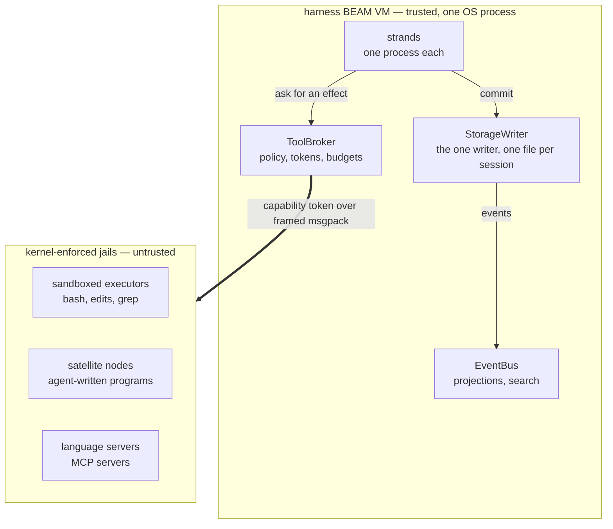
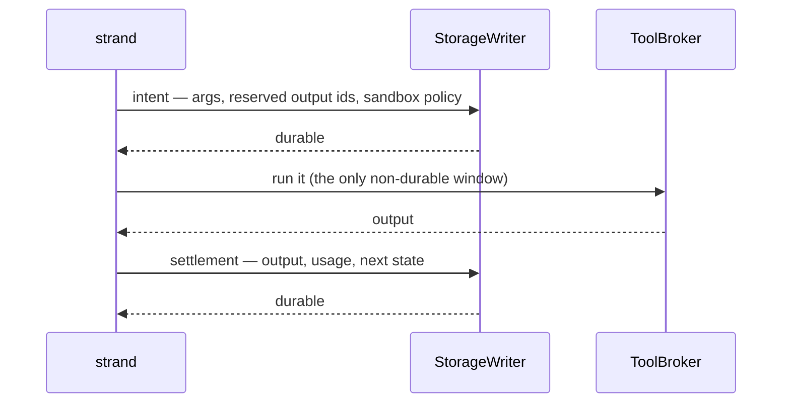

# Loom

Loom is a coding agent harness written in Gleam and running on the BEAM. A
session is a supervision tree over a write-once conversation store: every
step an agent takes — the prompt it received, the tool call it made, the
result that came back, the tokens it spent — is committed to a per-session
SQLite file before anything else can depend on it, so killing the OS
process at any instant loses no work and re-runs no side effect.
Everything the model influences executes outside the harness virtual
machine, in kernel-sandboxed OS processes reached through a single
capability-checked broker.

Three existing harnesses supply the parts: the durability model comes from
pi, the sandbox posture from Codex CLI, and the tool surface from omp. The
BEAM supplies what none of them have, because a harness is already an
actor system — strands, subagents, tool executions, and stream parsers are
processes, and crash recovery is a supervisor plus durable state rather
than defensive code. It is also why code mode is worth building: an
agent-written Gleam program that fans out, races two strategies, and holds
stateful actors gets real concurrency from a runtime built for it.

## Rule Zero

BEAM processes give fault isolation, not security isolation. Any process
in the virtual machine can call `os:cmd/1`, open any file the OS user can
open, and dial the network; there is no capability model inside the VM to
lean on. So the harness leans on the kernel instead:

> **Rule Zero: model-influenced execution never runs in the harness VM.**
> The BEAM node orchestrates. Untrusted work — shell commands,
> agent-written programs, third-party language servers and Model Context
> Protocol servers — runs in OS-sandboxed external processes under
> kernel-enforced policy. The kernel isolates threats; the BEAM isolates
> faults; the two are never confused.

Every effect leaves through the ToolBroker, which composes a policy,
refuses or narrows it, mints a capability token bound to one operation
step, and guarantees the caller exactly one settlement whatever happens
downstream. The sandbox policy is a typed, versioned value stored durably
with the execution intent, so the transcript records which jail each
command ran in. A denial surfaces as a structured escalation carrying the
exact policy difference — "wants: network to registry.npmjs.org" — and an
approval buys one re-execution, recorded. Prompts are a user interface,
never a control.

## The three planes

The planes are strictly layered: the durability plane knows nothing about
agents, the orchestration plane knows nothing about sandboxes, and
everything crossing the trust boundary goes through the one door.



The **durability** plane stores rows, answers queries, and decides
nothing. The **orchestration** plane decides what happens next and what
must be durable before it happens. The **effect** plane is everything that
touches the world.

| Package | Plane | What it holds |
|---|---|---|
| `core` | durability | Ids, entries, registers, transactions, and total decoders. Pure. |
| `storage` | durability | The storage interface, the in-memory and SQLite backends, the fenced lease. |
| `session` | durability | The session and repository layer, tree views, the branch index, forks. |
| `machine` | orchestration | Operation types, `next_action`, classification order. Pure; no I/O, no state between calls. |
| `runtime` | orchestration | The storage writer, the strand supervisor, the driver loop, recovery, the multi-strand surface. |
| `events` | orchestration | The event bus (OTP `pg` process groups), rebuildable projections, full-text search across a repository's sessions. |
| `provider` | effect | Typed provider clients, streaming, retries, role-based routing with fallback chains. |
| `broker` | effect | The ToolBroker: policies, capability tokens, budgets, escalation. |
| `sandbox` | effect | The `loom-exec` helper binary and platform drivers. Go. |
| `tools` | effect | bash, hash-anchored filesystem reads and edits, grep. |
| `tui` | client | A terminal client over the gateway protocol, runnable against a fake with `--demo`. Go. |
| `client` | client | The Gleam side of that gateway protocol: the hub, the websocket server, the production wiring, and the `loom-server` entry point. |
| `conformance` | tests | Storage conformance, wiring, the interleave harness, the simulation runner, the jailed end-to-end. |

Two commits bracket every effect, and the gap between them is the
session's only non-durable window.



Tools declare whether replaying them is safe. Recovery finds an effect
that was in flight and, on that declaration, either re-executes it from
the persisted arguments or settles the reserved id with a synthetic error.
Nothing runs twice, every call ends with a result, and the token ledger
survives a kill at any instant.

## Strands that talk to each other

A subagent is a strand: same driver code, its own leaf in the tree, its
own durable configuration. Strands are processes, so a raw `Process.send`
between them is possible — and forbidden as a transport, because a BEAM
mailbox evaporates on crash. An unread "found the bug at auth.gleam:42" is
simply gone after a supervisor restart: never in the transcript, invisible
to recovery, believed delivered.

> **Payloads travel durably; process messages are only doorbells.**
> Sending to another strand enqueues onto that strand in one commit, then
> rings an ephemeral nudge so the target wakes now rather than at its next
> checkpoint poll. A lost nudge costs latency, never data.

Four patterns fall out of that rule, and the runtime exposes each:

- **Request/reply** — a parent creates a subagent strand with a task
  brief, then consumes the child's terminal result as an entry.
- **Peer to peer** — two strands steer each other, and every turn of the
  conversation is a commit.
- **Blackboard** — `fact.*` registers hold shared, transactional session
  state: the reviewer posts findings, the implementer reads them.
- **Broadcast** — the event bus carries awareness ("strand 3 finished the
  tests"), and anything actionable is written durably too, because events
  are hints and pulls are truth.

So every exchange between agents sits in the tree, replayable and
forkable, and a stuck agent's inbox is durable state you can read. The
line is sharp: if the recipient would act differently for having received
it, it goes through a commit; if it only affects pacing or display, a
plain message is fine.

## Code mode: Gleam as the tool language

Instead of a round-trip per tool call, the model writes a program that
composes tools locally — loops, conditionals, intermediate values,
concurrency — and the harness runs it and returns one structured result.
The language is Gleam itself, which buys a property no scripting language
can offer:

> **A program's maximal capability set is computable from its source** —
> the transitive closure of its imports plus its own `@external`
> declarations.

Pure Gleam cannot perform I/O, and there is no eval, no reflection, no
dynamic module lookup, and no macros, so every effect must enter through
an import. Vetting is therefore a compiler-adjacent lint: reject
`@external` in submitted source, reject imports outside the allowlist, pin
the rest to the harness capability prelude. That prelude *is* the
capability system — `cap/fs`, `cap/proc`, `cap/net`, `cap/lsp`, `cap/git`,
`cap/task`, `cap/actor`, `cap/report` — typed modules whose
implementations are broker calls carrying the execution's token. The type
checker becomes the tool-argument validator, so malformed tool use fails
at compile time, a cheaper loop than a runtime tool error.

The programming model is specified; the prelude lands with the satellite
runtime. What an agent writes looks like this:

```gleam
import cap/fs
import cap/lsp
import cap/proc
import cap/report
import cap/task

// These imports are the program's whole capability set. It cannot open a
// socket: cap/net is absent, and no runtime trick can conjure it.

pub fn main() -> report.Report {
  // The language server knows where the call sites are; ripgrep guesses
  // fast. Race them — the loser is cancelled where it stands, and the
  // kernel jail behind it is killed.
  let sites =
    task.race([
      fn() { lsp.reference_paths(symbol: "decode_entry") },
      fn() { proc.lines(proc.run("rg", ["-l", "decode_entry", "src/"])) },
    ])

  // Eight at a time, results in input order, all eight sharing one
  // budget: one deadline, one cgroup, one ceiling on outstanding effects.
  let edited =
    task.parallel_map(sites, max_concurrency: 8, fn(path) {
      fs.replace(in: path, each: "decode_entry", with: "entry_decoder")
    })

  case proc.run("gleam", ["build", "--warnings-as-errors"]) {
    Ok(_) -> report.ok(edited)
    Error(failure) -> report.failed("the rename broke the build", failure)
  }
}
```

Vetting is strong, and the design does not bet on it alone. Programs run
in a **satellite node**: a disposable `erl` process launched inside the
executor sandbox with distribution disabled, the network off except for
the socket back to the broker, a heap ceiling, a cgroup, and a wall-clock
deadline — and killable as a unit. A hostile module that slipped the lint
still sits in a jail whose only reachable effects are token-checked broker
calls, so an escape needs both a vetting bypass and a kernel escape.

Every task is a child of the program root, so the loser of a race is not
merely ignored: its capability calls are revoked and its process groups
killed. `cap/actor` extends the same discipline to typed, program-scoped
actors with bounded mailboxes, which earn their keep when state outlives
one call — watching a build's output for the first error, coordinating a
debugger, running a work queue whose items generate more items.

Every executed program is an entry in the tree, and so a candidate for
promotion: **L0** ephemeral and satellite-jailed, **L1** the same program
saved as a named session skill at L0 privileges, **L2** a candidate
compiled against the wider extension API and passing its own tests in the
sandbox, **L3** an installed extension hot-loaded after a human approves
it, **L4** a pull request against Loom itself. L3 is the only rung that
touches the harness VM, and even there the harness compiles the source
itself — it never loads a `.beam` it did not build. Nothing self-promotes,
every rung is revocable, and the trusted computing base — storage, state
machine, broker, sandbox drivers — is not runtime-extensible at all.

## Beyond one machine

Erlang distribution is location-transparent and fully trusting after the
handshake: a connected node can run anything on any peer. That makes it a
fine control plane and a disastrous data plane, so the design keeps the
two apart.

> **Data plane** — length-prefixed msgpack over stdio, Unix sockets, SSH
> tunnels, or mutually authenticated TLS, to everything untrusted or
> semi-trusted: executors, satellites, language servers, MCP servers, and
> their remote equivalents. Every message is parsed and validated as data.
>
> **Control plane** — TLS-wrapped native distribution, strictly between
> orchestrator nodes you operate, for session routing and event fan-out.
> Native distribution never crosses a trust boundary.

Because the broker already treats every effect as uncertain and remote, a
remote executor pool is a driver rather than an architecture change: the
same helper and the same policy on a build server or a customer VM,
tunneled over the data plane, with a partition mid-command taking the
recovery path the effect sandwich already defines. Satellite nodes travel
the same way, putting agent-written programs next to the repository or
next to the compute.

Sessions move too, because a session is one file plus a tree booted from
it: close it, copy it, open it elsewhere. Clients are always thin — a
terminal, an editor plugin, and a phone all speak the same gateway
protocol, subscribing to the event stream with catch-up by sequence number
and sending commands back — so a local client against a local harness and
a remote client against a hosted one differ only in the socket.

## How it is tested

- **Storage conformance.** One suite, parameterized over a backend
  constructor, runs against both the in-memory and the SQLite backend and
  defines what "correct backend" means: atomicity, sequence ordering, the
  expectation matrix, branch scans, catch-up reads, and a torture script
  that re-scans every entry ever written after every commit. Three checks
  are SQLite-only: the writer-lease duel, `EXPLAIN QUERY PLAN` assertions,
  and branch-index invariants. A 10,000-entry session scans its newest 50
  entries in a median of about 2 ms in the development container, against
  a target of 5 ms.
- **Crash exploration by enumeration.** The storage writer exposes a seam
  that runs after a commit is durable but before the committer learns of
  it — precisely the state a crash leaves behind. Five scenarios run once
  to fix their commit counts, then once per boundary with the kill armed
  there: **42 crashed runs**, each of which must converge on the same
  terminal outcome, the same projected context, and the same ledger total,
  with no replay-unsafe tool executed twice. A run armed to crash must
  also have crashed, so the loop cannot pass vacuously.
- **Crash exploration by generation.** Enumeration is only as good as its
  hand-written list, so a deterministic simulation runner replaces the
  list with a seed. One integer splits into a *script* (what the session
  is asked to do) and a *schedule* (what goes wrong while it does it); the
  script runs clean, then faulted, and the pair is held to named checks.
  Every fault in the taxonomy is transparent by construction — crashes at
  commit boundaries and mid-effect, refused and stale commits, read
  faults, lease theft, dropped and delayed doorbells, slow and dying
  effects, torn frames — so anything that legitimately changes the outcome
  lives in the script and happens in both runs. Failing schedules shrink,
  and one that found a real defect is pinned as a hand-built regression
  rather than as a seed. The honest limits are in
  `docs/architecture/simulation.md`: real processes rather than a
  simulated scheduler, so BEAM message interleaving is not reproducible;
  one backend, one strand, one session; no real effect plane.
- **A jailed end-to-end.** A scripted provider drives the real broker, the
  real executor pool, and the freshly built Go helper against a real
  workspace: prompt, tool calls, sandboxed bash and edits, byte-exact
  file, exact ledger, and a crash rider over the integrated stack.
- **A sandbox self-test that reports what the kernel actually gave it.**
  `loom-exec --self-test` runs seven probes through the real jail path:
  writing outside the writable roots, writing to a protected path, opening
  a socket under network-off, reading a non-allowlisted environment
  variable, a fork bomb against the process cap, an output flood, and an
  orphaned grandchild. A probe whose layer the environment cannot provide
  prints `SKIPPED` with the reason; a probe whose layer is available must
  enforce or the run fails. Enforced and skipped are summarized
  separately, so a green self-test in a neutered container cannot be
  mistaken for a verified sandbox. The development container enforces four
  of the seven; bubblewrap, Landlock, and delegated cgroups need a fuller
  kernel. The Linux jail is also the only one that exists — macOS Seatbelt
  and the Windows sandbox are designed and unbuilt.

## Building and running

You need Gleam 1.11 or newer, Erlang/OTP 27 or newer, and Go 1.24 or newer
for the sandbox helper and the terminal client. Nothing is published to
Hex; the packages are monorepo-internal and are built where they sit.

```
make check            # the full gate: format check, warning-free build, all tests
make binaries         # bin/loom-exec and bin/loom-tui (the Go binaries)
make server-shipment  # the server: build/erlang-shipment + bin/loom-server
make selftest         # build the helper, then report ENFORCED/SKIPPED per probe
make e2e              # the jailed end-to-end against a freshly built helper
make soak             # the long simulation run (SOAK_SEEDS=n SOAK_FROM=n)
make help             # everything else
```

`make check` is exactly what CI runs, and `make check-<package>` narrows
it to one package. Run `make selftest` on the kernel you actually intend
to run agents on: the sandbox is only as strong as the layers that machine
provides, and the self-test is how you find out which ones those are.

Three binaries come out of a build. `bin/loom-exec` is the Go sandbox
helper the broker spawns into jails. `bin/loom-tui` is the Go terminal
client; it depends on nothing but the wire protocol, and `bin/loom-tui
--demo` runs it against an in-process fake with a canned session — no
server, no network, a fine first thing to try. `bin/loom-server` is the
session server: `make server-shipment` exports the Gleam `client` package
as an Erlang shipment into `build/erlang-shipment` and writes the
launcher. A shipment bundles compiled BEAM files, not the runtime system,
so running it needs an Erlang/OTP installation on the machine — where
that is unwanted, `make run-server` runs the same server from source
through Gleam instead.

### Running a session

The TUI never starts a server. That is the thin-client design, not an
omission: one server owns the session file and its writer lease, and any
number of clients — several terminals, an editor plugin, a phone —
subscribe to the same session over the gateway protocol and catch up by
sequence number. So a real session is two processes, typically two
terminals:

```
# terminal 1 — the server owns the session
bin/loom-server --session ~/sessions/myproj.db --workspace ~/src/myproj
# prints: loom-server: session myproj listening on ws://127.0.0.1:44123/v1/ws
#         (token file ~/sessions/myproj.db.token)

# terminal 2 — a client attaches
bin/loom-tui --addr ws://127.0.0.1:44123/v1/ws --session myproj \
  --token "$(cat ~/sessions/myproj.db.token)"
```

The session file is created if absent; the session name clients subscribe
with is the file's base name. The bearer token is minted at startup into
a `0600` file next to the session, which is the local-auth story: reading
it proves you are the same user, and remote clients get the same header
over their own transport. `make run-server SESSION=path` and
`make run-tui ADDR=... SESSION=...` wrap the two halves; `make dev` does
the whole loop in one command — builds the binaries, starts a server on a
scratch session (or `$SESSION`), waits for the port line, attaches the
TUI, and tears the server down when the TUI exits. `make dev` is
interactive and wants a real terminal; `scripts/dev.sh --smoke` is the
non-interactive variant that boots, probes the endpoints, and verifies a
clean shutdown.

What the server needs: the `loom-exec` helper (found on `PATH` or in
`./bin`, or named with `--helper`), an Erlang/OTP installation if run
from the shipment, and — optionally — a provider key. `ANTHROPIC_API_KEY`
is read from the environment at dispatch time; without it the server
boots and serves normally and generation requests fail in-band, which is
enough to inspect a session, replay history, or develop a client. By
default the server demands full sandbox enforcement, under which a
kernel that cannot provide the jail layers gets its tool calls refused;
`--best-effort` accepts a degraded helper for development machines, and
`make selftest` tells you honestly which of the two postures your kernel
can back.

The server's full configuration surface, flags first:

```
--session <path>      the sqlite session file (required; created if absent)
--bind host:port      listen address (default 127.0.0.1:0 — port printed)
--token-file <path>   bearer token file (default <session>.token, mode 0600)
--workspace <dir>     the jail's writable root (default: current directory)
--helper <path>       loom-exec location (default: PATH, then ./bin)
--config <loom.toml>  model catalogue file (default: the LOOM_* env vars)
--best-effort         accept a degraded jail (dev kernels); default refuses
```

Environment: `ANTHROPIC_API_KEY` (optional, read at dispatch),
`LOOM_MODEL` (default `claude-opus-5`), `LOOM_BASE_URL`,
`LOOM_CONTEXT_WINDOW` (default 1000000), `LOOM_MAX_OUTPUT_TOKENS`
(default 32000), `LOOM_SYSTEM_PROMPT`.

`--config` points at a model catalogue — a TOML file of named model
entries (`dialect`, `base_url`, `api_key_env`, `model_id`, context and
output limits, thinking level) plus role → fallback-chain routing.
`docs/examples/loom.toml` is the commented example, wiring a
Baseten-hosted OpenAI-compatible endpoint next to an Anthropic one.
Precedence is flags > config file > environment > defaults: with
`--config` the catalogue replaces the `LOOM_MODEL`-family variables
entirely, and without it those variables act as a one-entry catalogue.
API keys never live in the file — each entry's `api_key_env` names the
environment variable to read at dispatch. The TUI lists the catalogue
with `:models` and switches the active strand's model by name.

## Reading further

- `docs/architecture/` — the system as built, one document per plane
  (`durability.md`, `orchestration.md`, `effects.md`) plus `simulation.md`
  for the crash-exploration runner. Start here to understand the code that
  exists.
- `docs/loom-design.md` — the intent: why the BEAM, the three planes, Rule
  Zero, the two-channel doctrine, code mode, and the staged trust pipeline.
- `docs/loom-implementation-spec.md` — the work packages, the frozen
  interface contracts, and the acceptance criteria. Changing a frozen
  interface takes a proposal in `protocol-change/`, never silent drift.
- `docs/gleam-style.md` — a language tour and the house style. Gleam is
  young enough that habits from other languages mislead; read this before
  contributing.
- `docs/notebook.md` — the running lab log: what was decided, what broke,
  and what is in flight, newest entry first.
