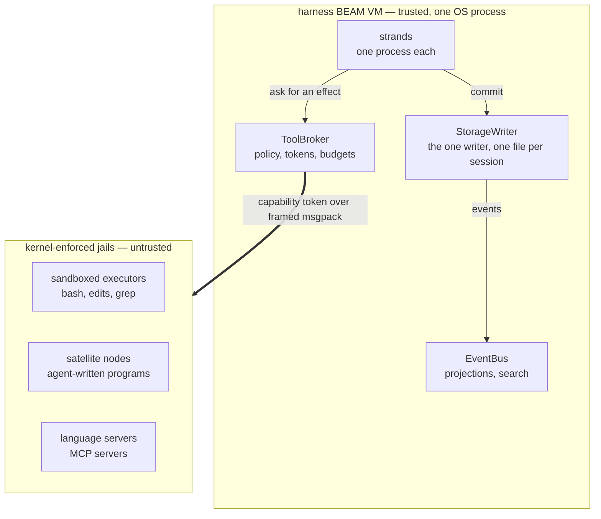
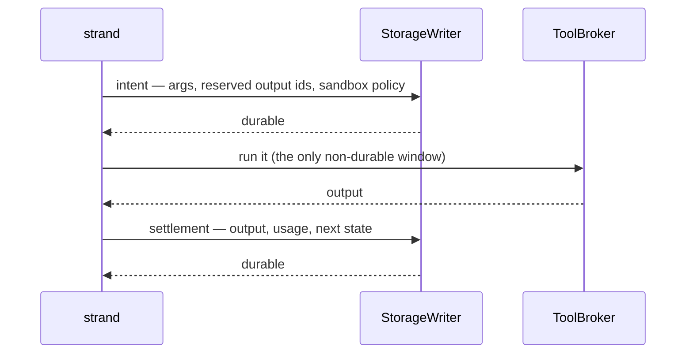

# Loom

Loom is a coding agent harness written in Gleam and running on the BEAM. A
session is a supervision tree over a write-once conversation store: every
step an agent takes — the prompt it received, the tool call it made, the
result that came back, the tokens it spent — is committed to a per-session
SQLite file before anything else can depend on it, so killing the OS
process at any instant loses no work and re-runs no side effect.
Everything the model influences executes outside the harness virtual
machine, in kernel-sandboxed OS processes reached through a single
capability-checked broker.

Three existing harnesses supply the parts: the durability model comes from
pi, the sandbox posture from Codex CLI, and the tool surface from omp. The
BEAM supplies what none of them have, because a harness is already an
actor system — strands, subagents, tool executions, and stream parsers are
processes, and crash recovery is a supervisor plus durable state rather
than defensive code. It is also why code mode is worth building: an
agent-written Gleam program that fans out, races two strategies, and holds
stateful actors gets real concurrency from a runtime built for it.

## Rule Zero

BEAM processes give fault isolation, not security isolation. Any process
in the virtual machine can call `os:cmd/1`, open any file the OS user can
open, and dial the network; there is no capability model inside the VM to
lean on. So the harness leans on the kernel instead:

> **Rule Zero: model-influenced execution never runs in the harness VM.**
> The BEAM node orchestrates. Untrusted work — shell commands,
> agent-written programs, third-party language servers and Model Context
> Protocol servers — runs in OS-sandboxed external processes under
> kernel-enforced policy. The kernel isolates threats; the BEAM isolates
> faults; the two are never confused.

Every effect leaves through the ToolBroker, which composes a policy,
refuses or narrows it, mints a capability token bound to one operation
step, and guarantees the caller exactly one settlement whatever happens
downstream. The sandbox policy is a typed, versioned value stored durably
with the execution intent, so the transcript records which jail each
command ran in. A denial surfaces as a structured escalation carrying the
exact policy difference — "wants: network to registry.npmjs.org" — the
tool that asked, and a bounded preview of the arguments it asked with, so
the person answering reads the command rather than only the appetite. The
approval is bound to that action by a digest over those arguments: a call
that would do something else can neither claim it nor spend it, and one
approval buys exactly one re-execution, recorded. Prompts are a user
interface, never a control.

## The three planes

The planes are strictly layered: the durability plane knows nothing about
agents, the orchestration plane knows nothing about sandboxes, and
everything crossing the trust boundary goes through the one door.



The **durability** plane stores rows, answers queries, and decides
nothing. The **orchestration** plane decides what happens next and what
must be durable before it happens. The **effect** plane is everything that
touches the world.

| Package | Plane | What it holds |
|---|---|---|
| `core` | durability | Ids, entries, registers, transactions, and total decoders. Pure. |
| `storage` | durability | The storage interface, the in-memory and SQLite backends, the fenced lease. |
| `session` | durability | The session and repository layer, tree views, the branch index, forks. |
| `machine` | orchestration | Operation types, `next_action`, classification order. Pure; no I/O, no state between calls. |
| `prompt` | orchestration | The system-prompt pack: named sections, a total decoder, rendered against an environment. Pure. |
| `runtime` | orchestration | The storage writer, the strand supervisor, the driver loop, recovery, the multi-strand surface. |
| `events` | orchestration | The event bus (OTP `pg` process groups), rebuildable projections, full-text search across a repository's sessions. |
| `provider` | effect | Typed provider clients, streaming, retries, role-based routing with fallback chains. |
| `broker` | effect | The ToolBroker: policies, capability tokens, budgets, escalation. |
| `sandbox` | effect | The `loom-exec` helper binary and platform drivers. Go. |
| `tools` | effect | bash, hash-anchored filesystem reads and edits, grep, the `agent_*` family, and the `code_mode` door. |
| `codemode` | effect | The vetting lint, the hermetic compile service, the satellite launcher, and the in-harness host that answers a running program's capability calls. |
| `cap` | effect | The capability prelude a model-written program is written against — compiled *into* the jail, never linked into the harness. |
| `tui` | client | The native terminal client over the gateway protocol, with a local `--demo` mode. Gleam over etui. |
| `client` | client | The Gleam side of that gateway protocol: the hub, the websocket server, the production wiring, and the `loomd` entry point. |
| `telemetry` | cross-cutting | Structured logs whose correlation context travels as a value, and two enforced redaction rules. A leaf over `core`, so every impure package may depend on it. |
| `conformance` | tests | Storage conformance, wiring, the interleave harness, the simulation runner, the jailed end-to-end. |
| `lint` | tooling | Loom's own house-rule lint over Gleam source; four of its seven rules gate at error level. |

Two commits bracket every effect, and the gap between them is the
session's only non-durable window.



Tools declare whether replaying them is safe. Recovery finds an effect
that was in flight and, on that declaration, either re-executes it from
the persisted arguments or settles the reserved id with a synthetic error.
Nothing runs twice, every call ends with a result, and the token ledger
survives a kill at any instant.

## Strands that talk to each other

A subagent is a strand: same driver code, its own leaf in the tree, its
own durable configuration. Strands are processes, so a raw `Process.send`
between them is possible — and forbidden as a transport, because a BEAM
mailbox evaporates on crash. An unread "found the bug at auth.gleam:42" is
simply gone after a supervisor restart: never in the transcript, invisible
to recovery, believed delivered.

> **Payloads travel durably; process messages are only doorbells.**
> Sending to another strand enqueues onto that strand in one commit, then
> rings an ephemeral nudge so the target wakes now rather than at its next
> checkpoint poll. A lost nudge costs latency, never data.

Four patterns fall out of that rule, and the runtime exposes each:

- **Request/reply** — a parent creates a subagent strand with a task
  brief, then consumes the child's terminal result as an entry. The
  spawn may also state the *shape* it wants back, and the harness holds
  the child to that schema on its own terminal write, so a parent that
  fans out reduces typed values instead of regexing prose.
- **Peer to peer** — two strands steer each other, and every turn of the
  conversation is a commit.
- **Blackboard** — `fact.*` registers hold shared, transactional session
  state: the reviewer posts findings, the implementer reads them.
- **Broadcast** — the event bus carries awareness ("strand 3 finished the
  tests"), and anything actionable is written durably too, because events
  are hints and pulls are truth.

So every exchange between agents sits in the tree, replayable and
forkable, and a stuck agent's inbox is durable state you can read. The
line is sharp: if the recipient would act differently for having received
it, it goes through a commit; if it only affects pacing or display, a
plain message is fine.

## Code mode: Gleam as the tool language

Instead of a round-trip per tool call, the model writes a program that
composes tools locally — loops, conditionals, intermediate values,
concurrency — and the harness runs it and returns one structured result.
The language is Gleam itself, which buys a property no scripting language
can offer:

> **A program's maximal capability set is computable from its source** —
> the transitive closure of its imports plus its own `@external`
> declarations.

Pure Gleam cannot perform I/O, and there is no eval, no reflection, no
dynamic module lookup, and no macros, so every effect must enter through
an import. Vetting is therefore a compiler-adjacent lint: reject
`@external` in submitted source, reject imports outside the allowlist, pin
the rest to the harness capability prelude. That prelude *is* the
capability system — typed modules whose implementations are broker calls
carrying the execution's token. The type checker becomes the
tool-argument validator, so malformed tool use fails at compile time, a
cheaper loop than a runtime tool error.

There are two preludes, and a submission is judged against exactly one of
them, because *which capabilities travel together* is the point. The
**workspace seam** — `cap/fs`, `cap/proc`, `cap/net`, `cap/git`,
`cap/lsp`, `cap/task`, `cap/actor`, `cap/kv`, `cap/report` — is a program
that orchestrates effects. The **orchestration seam** — `cap/strand` and
`cap/report`, and nothing else — is a program that orchestrates agents:
it spawns child strands, joins them on one shared deadline, messages
them and reads their notes, and it can touch neither the disk, nor the
network, nor a process. An orchestrator that could also write files is a
materially worse thing to hand a model than one that cannot, so the two
sets share no module carrying authority of its own, and a test pins that
disjointness rather than trusting two lists to stay apart. The server
serves the workspace seam alone by default; `--codemode-seams` widens
that, and where both are served the submission names the seam it wants
judging against and a refusal names it back.

A model writing a program authors blind — no autocomplete, no hover, only
a submission — so for as long as the tool described the prelude by module
*name*, the compiler was the only oracle for a signature and it was
reachable only by being wrong first. The `code_mode` description now
carries the full public surface of every module the offered seams admit,
generated out of `packages/cap` by `make gen-prelude` and held to a digest
inside `make check`, so drift is a build failure rather than a model told
about functions that no longer exist.

What an agent writes on the workspace seam looks like this:

```gleam
import cap/fs
import cap/lsp
import cap/proc
import cap/report
import cap/task

// These imports are the program's whole capability set. It cannot open a
// socket: cap/net is absent, and no runtime trick can conjure it.

pub fn main() -> report.Report {
  // The language server knows where the call sites are; ripgrep guesses
  // fast. Race them — the loser is cancelled where it stands, and the
  // kernel jail behind it is killed.
  let sites =
    task.race([
      fn() { lsp.reference_paths(symbol: "decode_entry") },
      fn() { proc.lines(proc.run("rg", ["-l", "decode_entry", "src/"])) },
    ])

  // Eight at a time, results in input order, all eight sharing one
  // budget: one deadline, one cgroup, one ceiling on outstanding effects.
  let edited =
    task.parallel_map(sites, max_concurrency: 8, fn(path) {
      fs.replace(in: path, each: "decode_entry", with: "entry_decoder")
    })

  case proc.run("gleam", ["build", "--warnings-as-errors"]) {
    Ok(_) -> report.ok(edited)
    Error(failure) -> report.failed("the rename broke the build", failure)
  }
}
```

That is the shape of the thing rather than a demonstration of it. Of the
nine modules the workspace seam admits, the shipped capability router
services exactly one call, `proc.run`; every other capability vets,
compiles, marshals its arguments, and comes back refused in band as
`unsupported_cap`. That is a routing table still being filled in
(issue #16), not a security property. `cap/task` and `cap/actor` are
different in kind — they run inside the satellite itself and compose
whatever the router does service — so the race, the cancellation, and the
order-preserving fan-out above are real today, over jailed processes.

Two worked programs are read verbatim by their own tests and put through
real vetting, a real offline `gleam build` in a jail, and a real
satellite: `docs/examples/stale_symbol_sweep.gleam` on the workspace seam
and `docs/examples/fan_out_review.gleam` on the orchestration seam. The
second one brings a rule the first does not need. `agent_spawn` is
throttled by turn cost — a model pays a provider round trip per spawn —
and a loop pays nothing, so an implicit throttle removed has to become an
explicit one: a hard ceiling on spawn admissions per execution, refused in
band *at* the ceiling and naming it.

Vetting is strong, and the design does not bet on it alone. Programs run
in a **satellite node**: a disposable `erl` process launched inside the
executor sandbox with distribution disabled, the network off except for
the socket back to the broker, a heap ceiling, a cgroup, and a wall-clock
deadline — and killable as a unit. A hostile module that slipped the lint
still sits in a jail whose only reachable effects are token-checked broker
calls, so an escape needs both a vetting bypass and a kernel escape.

Every task is a child of the program root, so the loser of a race is not
merely ignored: its capability calls are revoked and its process groups
killed. `cap/actor` extends the same discipline to typed, program-scoped
actors with bounded mailboxes, which earn their keep when state outlives
one call — watching a build's output for the first error, coordinating a
debugger, running a work queue whose items generate more items.

Every executed program is an entry in the tree, and so a candidate for
promotion: **L0** ephemeral and satellite-jailed, **L1** the same program
saved as a named session skill at L0 privileges, **L2** a candidate
compiled against the wider extension API and passing its own tests in the
sandbox, **L3** an installed extension hot-loaded after a human approves
it, **L4** a pull request against Loom itself. L3 is the only rung that
touches the harness VM, and even there the harness compiles the source
itself — it never loads a `.beam` it did not build. Nothing self-promotes,
every rung is revocable, and the trusted computing base — storage, state
machine, broker, sandbox drivers — is not runtime-extensible at all.

L0 is the rung that exists. There is no skill store, no candidate
pipeline, no extension zone, and no hot code loading in the tree: the
ladder above L0 is design, and the rules stated for it are constraints its
implementation will be held to rather than behaviour you can run.

## Beyond one machine

Erlang distribution is location-transparent and fully trusting after the
handshake: a connected node can run anything on any peer. That makes it a
fine control plane and a disastrous data plane, so the design keeps the
two apart.

> **Data plane** — length-prefixed msgpack over stdio, Unix sockets, SSH
> tunnels, or mutually authenticated TLS, to everything untrusted or
> semi-trusted: executors, satellites, language servers, MCP servers, and
> their remote equivalents. Every message is parsed and validated as data.
>
> **Control plane** — TLS-wrapped native distribution, strictly between
> orchestrator nodes you operate, for session routing and event fan-out.
> Native distribution never crosses a trust boundary.

Because the broker already treats every effect as uncertain and remote, a
remote executor pool is a driver rather than an architecture change: the
same helper and the same policy on a build server or a customer VM,
tunneled over the data plane, with a partition mid-command taking the
recovery path the effect sandwich already defines. Satellite nodes travel
the same way, putting agent-written programs next to the repository or
next to the compute.

Sessions move too, because a session is one file plus a tree booted from
it: close it, copy it, open it elsewhere. Clients are always thin — a
terminal, an editor plugin, and a phone all speak the same gateway
protocol, subscribing to the event stream with catch-up by sequence number
and sending commands back — so a local client against a local harness and
a remote client against a hosted one differ only in the socket.

None of that section has code behind it yet. Every channel Loom opens
today is data plane and single-node: the broker's channel to the helper,
the satellite's capability channel, and the websocket to a client. There
is no remote executor pool, no remote satellite, and no control plane —
the event bus is one node's `pg` scope — and the only thin client that
exists is `loom`. What the two-channel doctrine buys today is the
rule about what may *not* be built, which is the half worth having first.

## How it is tested

- **Storage conformance.** One suite, parameterized over a backend
  constructor, runs against both the in-memory and the SQLite backend and
  defines what "correct backend" means: atomicity, sequence ordering, the
  expectation matrix, branch scans, catch-up reads, and a torture script
  that re-scans every entry ever written after every commit. Three checks
  are SQLite-only: the writer-lease duel, `EXPLAIN QUERY PLAN` assertions,
  and branch-index invariants. A 10,000-entry session scans its newest 50
  entries with a p50 near 3 ms in the development container. The suite
  asserts a 15 ms ceiling rather than the design's 5 ms target, because a
  bound at the target would flake on shared hardware; dropping the branch
  index measures 21 ms and fails it. So what the gate holds is that the
  scan stays single-digit milliseconds, and the 5 ms target itself is
  still unverified.
- **Crash exploration by enumeration.** The storage writer exposes a seam
  that runs after a commit is durable but before the committer learns of
  it — precisely the state a crash leaves behind. Five scenarios run once
  to fix their commit counts, then once per boundary with the kill armed
  there: **42 crashed runs**, each of which must converge on the same
  terminal outcome, the same projected context, and the same ledger total,
  with no replay-unsafe tool executed twice. A run armed to crash must
  also have crashed, so the loop cannot pass vacuously.
- **Crash exploration by generation.** Enumeration is only as good as its
  hand-written list, so a deterministic simulation runner replaces the
  list with a seed. One integer splits into a *script* (what the session
  is asked to do) and a *schedule* (what goes wrong while it does it); the
  script runs clean, then faulted, and the pair is held to named checks.
  Every fault in the taxonomy is transparent by construction — crashes at
  commit boundaries and mid-effect, refused and stale commits, read
  faults, lease theft, dropped and delayed doorbells, slow and dying
  effects, torn frames — so anything that legitimately changes the outcome
  lives in the script and happens in both runs. Failing schedules shrink,
  and one that found a real defect is pinned as a hand-built regression
  rather than as a seed. The honest limits are in
  `docs/architecture/simulation.md`: real processes rather than a
  simulated scheduler, so BEAM message interleaving is not reproducible;
  one backend, one strand, one session; no real effect plane.
- **A jailed end-to-end.** A scripted provider drives the real broker, the
  real executor pool, and the freshly built Go helper against a real
  workspace: prompt, tool calls, sandboxed bash and edits, byte-exact
  file, exact ledger, and a crash rider over the integrated stack.
- **Code mode against a live toolchain.** `make e2e-codemode` takes a
  model-written program through real vetting, a real hermetic `gleam
  build` in a network-off jail, and a real `erl` satellite making a real
  capability call back over a real AF_UNIX socket: the happy path, a
  transitive import the build refuses, a runaway program dying at its
  deadline, a type error coming back in band, and an approved escalation
  reaching a capability its unwidened twin is refused. Both documented
  samples are read from `docs/examples/` verbatim by their own suites, so
  the file a reader learns from and the file that runs cannot drift, and
  each is asserted on an instrumented fixture rather than on its outcome
  line: real concurrency, real order preservation and a race that really
  kills for the migration sample; three distinct children, one join over
  three handles and typed integers in the program's own order for the
  orchestration one. Every run prints the helper's enforcement report for
  both stages and says whether network-off was *enforced*, because the
  hermeticity claim rests entirely on that.
- **A sandbox self-test that reports what the kernel actually gave it.**
  `loom-exec --self-test` runs nine probes through the real jail path:
  writing outside the writable roots, reading or writing a protected path,
  opening a socket under network-off, reading a non-allowlisted
  environment variable, a fork bomb against the process cap, an output
  flood, an orphaned grandchild, an observed `setsid` escape from the process group,
  and a hand-written, never-vetted Erlang module loaded straight into a
  jailed node. A probe whose layer the environment cannot provide prints
  `SKIPPED` with the reason; a probe whose layer is available must enforce
  or the run fails. Enforced and skipped are summarized separately, so a
  green self-test in a neutered container cannot be mistaken for a
  verified sandbox. **The development container enforces four of the
  nine** — the three Loom-side layers that hold anywhere plus the seccomp
  network filter — and skips the five that need bubblewrap, Landlock, or a
  delegated cgroup v2 base.
  `.github/enforcement-expectations` is the reviewed answer to which
  layers a CI machine must really have applied, probe by probe, and it
  fails the job in *either* direction: a required probe that did not
  enforce, and a known-gap probe that suddenly did.

  One layer is asserted rather than demonstrated. **Landlock has never
  executed in any environment this repository has run in** (issue #62):
  every development container and every runner so far answers `ENOSYS`
  to the ABI probe, so the branch that applies a ruleset has never been
  taken, and every claim about what Landlock does here is read from its
  documentation rather than measured. That matters most in degraded mode,
  where Landlock is promoted from second filesystem layer to the only
  one. macOS now has the phase-2 Seatbelt jail: a generated deny-default
  profile with parameterized filesystem grants and policy-driven network
  access. Windows remains specified and unbuilt; the helper refuses to serve
  there (`--allow-unenforced` overrides) rather than running with nothing
  enforcing the policy.

  Darwin's process-table tracker reaps descendants it observes outside the
  original process group, but it is not a PID namespace: a rapid daemonizing
  double-fork can be reparented between samples, and no stable process handle
  makes its last birth check plus signal atomic. Output drainage is bounded so
  a missed descendant cannot hold the result open forever. Every Darwin
  execution reports `skip:darwin-process-lifecycle`, so `FullEnforcement`
  refuses that stronger lifecycle claim. The production default uses
  `PlatformEnforcement`, which admits only this and ADR-006's two reported
  Darwin resource gaps while still requiring Seatbelt filesystem and network
  confinement. The descendant inherits both boundaries.

## What is not built

The architecture above is described as designed; this is where it and the
tree part company. Each line names the issue that tracks it, so a reader
can check whether it is still true.

- **Eight of the nine workspace prelude modules reach no effect.** Vetting
  admits nine; the router services one call, `proc.run`. The rest vet,
  compile, and refuse in band (#16). `cap/task` and `cap/actor` are the
  exception in kind: they run inside the satellite and compose whatever
  the router does service.
- **`Proxy(allowlist)` egress fails closed rather than enforcing.** The
  egress proxy sidecar was never built, so the broker narrows proxy mode
  to network-off and *reports* the narrowing. Nothing ever claims an
  allowlist was enforced, and nothing enforces one.
- **Landlock has never executed here.** Every environment this repository
  has run in answers `ENOSYS` (#62), so the second filesystem layer is
  asserted from documentation rather than demonstrated.
- **Code mode can spend an approval but nothing mints one.** A widened
  policy reaches a code-mode execution, proved by `make e2e-codemode`;
  but code mode clears through the broker directly rather than through
  the tool context, so a policy refusal inside it raises no escalation
  record for a human to approve (#97).
- **There is no jail on Windows.** It remains specified as WP-H phase 3.
  The helper reports itself unsupported and refuses to serve there without
  `--allow-unenforced`. Linux and macOS have native phase-appropriate jails.
- **`lsp_*` and `dap_*` do not exist**, and neither does triggered-rule
  injection or hindsight memory — all of M5. The tool set a model actually
  sees today is bash, hash-anchored read/write/edit, grep, the `agent_*`
  family, and `code_mode`.
- **There is no MCP adapter.** The design places MCP servers in the jail
  like any other executor and the broker's `clear_call` path is where one
  would land; none is written.
- **Nothing self-improves.** No skill store, no extension candidate
  pipeline, no extension zone, no hot code loading: the promotion ladder
  from L1 upward is design, not code.
- **The chaos runner is unbuilt.** `make soak` is the deterministic
  seed soak; random process kills under load are not tested.
- **CI is configured on both kernels.** `.github/workflows/` carries Linux
  and macOS gates, a Linux jail job that installs the required kernel layers,
  strict Seatbelt probes on macOS, and a nightly soak.

## Running Loom

Two downloads, per platform: the **server**, which is a tarball carrying
the BEAM runtime system and the sandbox helper, and the **client**, which
is a separate native Erlang shipment. The server needs nothing installed.
The client currently needs a compatible Erlang/OTP 29 installation on its
host; Loom deliberately does not bundle a second ERTS into the client archive.

Nothing is published yet. `make dist` builds both, and the sizes below
are what it produced on a Linux x86_64 development container:

```
dist/loomd-0.1.0-linux-x86_64.tar.gz   21 MB   the server (58 MB unpacked)
dist/loom-0.1.0-linux-x86_64.tar.gz            the terminal client shipment
dist/SHA256SUMS
```

The server tarball unpacks to a directory holding `bin/loomd` (the
launcher), `bin/loom-exec` (the sandbox helper, a file beside it — Loom
never extracts an executable at run time), the runtime system, the
compiled applications, the code-mode toolchain (`bin/gleam` and
`share/codemode-seed`), and a `SHA256SUMS` over every executable in the
tree that `sha256sum -c` will check. The server finds all of those
through `code:root_dir()` — the release root, resolved by the emulator
itself — before it looks at `PATH`, so nothing depends on where you
unpacked it or what else is installed. Code mode is roughly half the
download; `DIST_CODEMODE=0 make release` builds the 11 MB / 29 MB
artifact without it.

A release is built for one platform and cannot be otherwise: it carries
this machine's runtime system and `esqlite3_nif.so`, which is compiled C.
`make release` refuses a `GOOS`/`GOARCH` that is not the host rather than
producing a tree whose name lies about what is in it. Only the Linux
x86_64 artifact has been published; a macOS build uses the system Seatbelt
jail and must be built and smoke-tested on its native runner.
`docs/distribution.md` is the whole argument — the mechanism, what was
rejected, why the helper ships beside the server rather than inside it,
and every size above with how it was measured.

### Running a session

Install `loom` and `loomd` beside one another, change into a workspace, and
run the client:

```sh
cd ~/src/myproj
loom
```

The client maps the canonical workspace to private state under `~/.loom`,
reuses a compatible authenticated loopback daemon, or starts one and waits for
a real session snapshot. The process boundary remains: one daemon owns the
session file and its writer lease, and any number of clients can subscribe over
the gateway protocol. A manually managed or remote daemon uses the explicit
form:

```
# terminal 1 — the server owns the session
loomd-0.1.0-linux-x86_64/bin/loomd \
  --session ~/sessions/myproj.db --workspace ~/src/myproj
# prints: loomd: session myproj listening on ws://127.0.0.1:44123/v1/ws
#         (token file ~/sessions/myproj.db.token)

# terminal 2 — a client attaches
loom --addr ws://127.0.0.1:44123/v1/ws --session myproj \
  --token-file ~/sessions/myproj.db.token
```

The session file is created if absent; the session name clients subscribe
with is the file's base name. The bearer token is minted at startup into
a `0600` file next to the session, which is the local-auth story: reading
it proves you are the same user, and remote clients get the same header
over their own transport.

With `loomd` installed beside `loom` or on `PATH`, the native client
can perform that setup itself. Running `loom` with no arguments maps the
canonical current workspace to private session state under `~/.loom`, reuses a
compatible authenticated loopback server, or starts one and waits for a real
session snapshot. `--workspace`, `--session-file`, `--server`, and
`--state-dir` override those local defaults; `LOOM_SERVER` is the environment
form of `--server`. The convenience path never loads a workspace `loom.toml`
or runs the server from the workspace, because neither repository content nor
its configuration is trusted launch authority. It ignores relative `PATH`
entries during implicit daemon discovery and keeps its bearer token under the
private state root. Explicit `--addr` attachment continues to handle remote or
manually configured servers.

`loom --demo` renders a self-contained preview from a canned local model —
no server, no network, a fine first thing to try.

What the server needs beyond itself: optionally a provider key.
`ANTHROPIC_API_KEY` is read from the environment at dispatch time;
without it the server boots and serves normally and generation requests
fail in-band, which is enough to inspect a session, replay history, or
develop a client. The `loom-exec` helper is found beside the launcher; a
different one can be named with `--helper`.

Run `loom-exec --self-test` on the kernel you actually intend to run
agents on. The sandbox is only as strong as the layers that machine
provides, and the self-test is how you find out which ones those are —
it prints ENFORCED or SKIPPED per probe and summarizes the two
separately, so a green run in a neutered container cannot be mistaken for
a verified sandbox. By default the server demands platform enforcement:
Linux is fully strict, while Darwin admits only ADR-006's three explicitly
reported resource and lifecycle gaps. A missing jail, an unexpected gap, or
a silent layer still refuses the tool call. `--full-enforcement` demands the
stronger cross-platform contract; `--best-effort` accepts broader degradation
for development machines.

The server's full configuration surface, flags first:

```
--session <path>       the sqlite session file (required; created if absent)
--bind host:port       listen address (default 127.0.0.1:0 — port printed)
--token-file <path>    bearer token file (default <session>.token, mode 0600)
--workspace <dir>      the jail's writable root (default: current directory)
--helper <path>        loom-exec location (default: beside the server, then PATH, then ./bin)
--config <loom.toml>   model catalogue file (default: the LOOM_* env vars)
--codemode-seed <dir>  the offline build seed (default <workspace>/build/codemode-seed, then the bundled one)
--codemode-seams <s>   workspace, orchestration, or both (default workspace)
--best-effort          accept a degraded jail (dev kernels); default refuses
```

`code_mode` is registered only when this host has a Gleam compiler, an
emulator, *and* a build seed whose dependency table matches the one the
compile service generates. A release carries all three and registers it;
a checkout registers it once `make codemode-seed` has run. A host with
none of them prints the reason once — naming what is missing and how to
supply it — and ships no `code_mode` definition at all, rather than one
that always refuses: a tool definition renders ahead of the system prompt
and is paid for on every request of every strand for the life of the
session. Every other tool works normally.

Environment: `ANTHROPIC_API_KEY` (optional, read at dispatch),
`LOOM_MODEL` (default `claude-opus-5`), `LOOM_BASE_URL`,
`LOOM_CONTEXT_WINDOW` (default 1000000), `LOOM_MAX_OUTPUT_TOKENS`
(default 32000), `LOOM_SYSTEM_PROMPT`.

`--config` points at a model catalogue — a TOML file of named model
entries (`dialect`, `base_url`, `api_key_env`, `model_id`, context and
output limits, thinking level) plus role → fallback-chain routing.
`docs/examples/loom.toml` is the commented example, wiring a
Baseten-hosted OpenAI-compatible endpoint next to an Anthropic one.
Precedence is flags > config file > environment > defaults: with
`--config` the catalogue replaces the `LOOM_MODEL`-family variables
entirely, and without it those variables act as a one-entry catalogue.
API keys never live in the file — each entry's `api_key_env` names the
environment variable to read at dispatch. The TUI lists the catalogue
with `/model` and switches the active strand's model by name.

## Working on Loom

You need Gleam 1.18 or newer, Erlang/OTP 29 or newer, and Go 1.24 or
newer for the sandbox helper. `make release`
additionally needs `rebar3`, `strip` and a prepared build seed (`make
codemode-seed`, once, with the network); nothing else does. Nothing is
published to Hex — the packages are monorepo-internal and are built where
they sit.

```
make check            # the full gate: format check, warning-free build, tests, lint
make lint             # the house rules on their own (lint-<package> narrows it)
make binaries         # bin/loom-exec plus the native TUI shipment and launcher
make dev              # build, start a server on a scratch session, attach the TUI
make selftest         # build the helper, then report ENFORCED/SKIPPED per probe
make e2e              # the jailed end-to-end against a freshly built helper
make codemode-seed    # the offline package cache a code-mode build clones
make e2e-codemode     # code mode for real: jailed build, real satellite, real cap call
make release          # the self-contained server into build/release/loom (needs rebar3)
make dist             # dist/: separate server and native-client tarballs, SHA256SUMS
make soak             # the long simulation run (SOAK_SEEDS=n SOAK_FROM=n)
make doc-check        # the doc graph: coverage, the AGENTS.md mirrors, citations
make help             # everything else
```

`make check` is exactly what CI runs, and `make check-<package>` narrows
it to one package. It ends with `make lint` — Loom's own house-rule lint,
seven rules of which R0 (unparseable source), R2 (`case` nesting depth),
R4 (`panic` and `let assert` outside tests) and R6 (the portable subset
`core`, `machine` and `prompt` are held to) fail the build; R1, R3 and R5
report a census that is still settling and cost nothing. A rule earns the
error tier by a census that is zero and argued, not by taste.

Two generated artifacts have gates rather than regeneration steps in the
build. `make gen-prelude` re-renders the capability prelude's public
surface into `packages/tools/src/tools/prelude.gleam` — the signatures the
`code_mode` description carries — and needs `gleam` and `python3`;
`make prelude-check` is the digest comparison `make check` runs, which
needs neither. `make gen-sql` is the same arrangement for the generated
SQL modules, and needs `sqlite3`.

`make dev` is the one-command loop: it builds the binaries, starts a
server on a scratch session (or `$SESSION`), waits for the port line,
attaches the TUI, and tears the server down when the TUI exits. It is
interactive and wants a real terminal; `scripts/dev.sh --smoke` is the
non-interactive variant that boots, probes the endpoints, and verifies a
clean shutdown. `make run-server SESSION=path` runs the server from
source through Gleam, and `make run-tui ADDR=... SESSION=...` attaches to
it. `make server-shipment` exports the `client` package as an Erlang
shipment into `build/erlang-shipment` behind a thin `bin/loomd`
launcher — a shipment bundles compiled BEAM files and not the runtime
system, so it needs an Erlang/OTP installation to run, which is exactly
the gap `make release` closes.

`make tui-shipment` exports the native client into
`build/tui-erlang-shipment` and writes `bin/loom`. The launcher disables
the emulator's break handler so `Ctrl+C` reaches etui and shuts the client down
cleanly. Like every Erlang shipment, this one carries BEAM files but no ERTS;
the client host therefore needs compatible Erlang/OTP 29 on `PATH`.

The only Go build in the tree is the sandbox helper, and it goes through
`scripts/go-build.sh` with the same flags everywhere, so `bin/loom-exec`,
`packages/sandbox/loom-exec` and the helper inside a release are
byte-identical. That is what lets `make
selftest`'s verdict say something about the artifact rather than about a
development build of it.

## Reading further

- `docs/architecture/` — the system as built, one document at a time.
  The three planes first: `durability.md` for the stores, the commit,
  and the two backends; `orchestration.md` for operations, admission,
  and resuming after a kill; `effects.md` for the broker, the wire, and
  the jail. Then `messaging.md` for how two strands talk without a lost
  mailbox, `events.md` for projections and search over the log,
  `client.md` for the hub, the websocket, and the frozen JSON protocol,
  `models.md` for the model catalogue an operator writes in TOML,
  `compaction.md` for what a session does when the context runs out,
  `code-mode.md` for writing a program instead of one tool call per
  round trip, and `simulation.md` for the crash-exploration runner.
  Start here to understand the code that exists.
- `docs/loom-design.md` — the intent: why the BEAM, the three planes, Rule
  Zero, the two-channel doctrine, code mode, and the staged trust pipeline.
- `docs/loom-implementation-spec.md` — the work packages, the frozen
  interface contracts, and the acceptance criteria, with a milestone table
  whose statuses are read against the acceptance column and nothing else.
  Changing a frozen interface takes a numbered proposal in
  `protocol-change/`, never silent drift; there are seven, and 001 and 006
  are the format precedent.
- `docs/code-tour.md` — one request followed from a key press to an answer
  on screen, with a file and a line for every step. The cheapest way to
  learn where things live.
- `docs/distribution.md` — how the downloadable server is built and why:
  the release mechanism and what was rejected, why the sandbox helper is
  a file beside the server instead of a blob inside it, why the terminal
  client is a separate download, and every size in this README with how
  it was measured.
- Every package carries a `README.md` — what it is for and where to start
  reading it — beside a `CLAUDE.md` that is denser and more current than
  any top-level document about that package: its key types, its real
  dependency edges, its actor and register traffic, and the invariants
  that break things when violated.
- `docs/gleam-style.md` — a language tour and the house style. Gleam is
  young enough that habits from other languages mislead; read this before
  contributing.
- `docs/performance.md` — the measurement loop for Gleam and the BEAM:
  identifying the right node, choosing an OS or OTP profiler, recognizing
  immutable-data cost shapes, and separating idle, streaming, and memory
  claims.
- `docs/notebook.md` — the running lab log: what was decided, what broke,
  and what is in flight, newest entry first.
