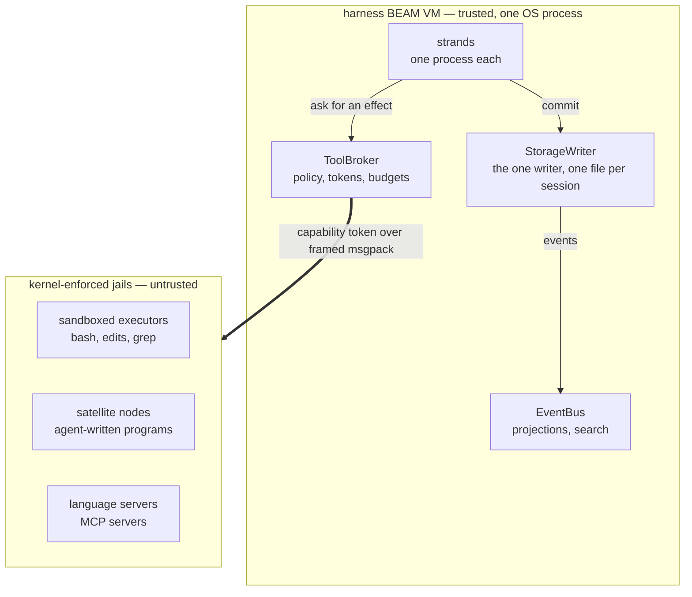
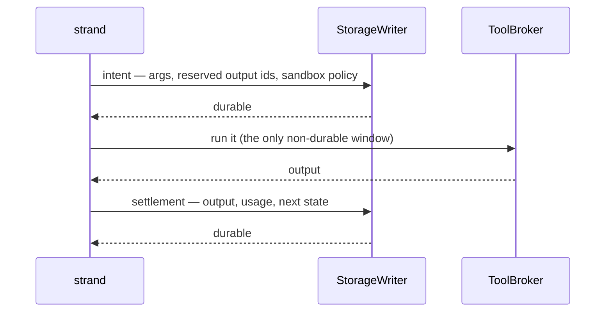

# Loom

Loom is a coding agent harness written in Gleam and running on the BEAM. A
session is a supervision tree over a write-once conversation store: every
step an agent takes — the prompt it received, the tool call it made, the
result that came back, the tokens it spent — is committed to a per-session
SQLite file before anything else can depend on it, so killing the OS
process at any instant loses no work and re-runs no side effect.
Everything the model influences executes outside the harness virtual
machine, in kernel-sandboxed OS processes reached through a single
capability-checked broker.

Three existing harnesses supply the parts: the durability model comes from
pi, the sandbox posture from Codex CLI, and the tool surface from omp. The
BEAM supplies what none of them have, because a harness is already an
actor system — strands, subagents, tool executions, and stream parsers are
processes, and crash recovery is a supervisor plus durable state rather
than defensive code. It is also why code mode is worth building: an
agent-written Gleam program that fans out, races two strategies, and holds
stateful actors gets real concurrency from a runtime built for it.

## Rule Zero

BEAM processes give fault isolation, not security isolation. Any process
in the virtual machine can call `os:cmd/1`, open any file the OS user can
open, and dial the network; there is no capability model inside the VM to
lean on. So the harness leans on the kernel instead:

> **Rule Zero: model-influenced execution never runs in the harness VM.**
> The BEAM node orchestrates. Untrusted work — shell commands,
> agent-written programs, third-party language servers and Model Context
> Protocol servers — runs in OS-sandboxed external processes under
> kernel-enforced policy. The kernel isolates threats; the BEAM isolates
> faults; the two are never confused.

Every effect leaves through the ToolBroker, which composes a policy,
refuses or narrows it, mints a capability token bound to one operation
step, and guarantees the caller exactly one settlement whatever happens
downstream. The sandbox policy is a typed, versioned value stored durably
with the execution intent, so the transcript records which jail each
command ran in. A denial surfaces as a structured escalation carrying the
exact policy difference — "wants: network to registry.npmjs.org" — the
tool that asked, and a bounded preview of its arguments, so the person
answering reads the command rather than only the appetite. The approval is
bound to that action by a digest over those arguments: a call that would
do something else can neither claim it nor spend it, and one approval buys
exactly one re-execution, recorded. Prompts are a user interface, never a
control.

## The three planes

The planes are strictly layered: the durability plane knows nothing about
agents, the orchestration plane knows nothing about sandboxes, and
everything crossing the trust boundary goes through the one door.



The **durability** plane stores rows, answers queries, and decides
nothing. The **orchestration** plane decides what happens next and what
must be durable before it happens. The **effect** plane is everything that
touches the world.

| Package | Plane | What it holds |
|---|---|---|
| `core` | durability | Ids, entries, registers, transactions, and total decoders. Pure. |
| `storage` | durability | The storage interface, the in-memory and SQLite backends, the fenced lease. |
| `session` | durability | The session and repository layer, tree views, the branch index, forks. |
| `machine` | orchestration | Operation types, `next_action`, classification order. Pure; no I/O, no state between calls. |
| `prompt` | orchestration | The system-prompt pack: named sections, a total decoder, rendered against an environment. Pure. |
| `runtime` | orchestration | The storage writer, the strand supervisor, the driver loop, recovery, the multi-strand surface. |
| `events` | orchestration | The event bus (OTP `pg` process groups), rebuildable projections, full-text search across a repository's sessions. |
| `provider` | effect | Typed provider clients, streaming, retries, role-based routing with fallback chains. |
| `broker` | effect | The ToolBroker: policies, capability tokens, budgets, escalation. |
| `sandbox` | effect | The `loom-exec` helper binary and platform drivers. Go. |
| `tools` | effect | bash, hash-anchored filesystem reads and edits, grep, the `agent_*` family, and the `code_mode` door. |
| `codemode` | effect | The vetting lint, the hermetic compile service, the satellite launcher, and the in-harness host that answers a running program's capability calls. |
| `cap` | effect | The capability prelude a model-written program is written against — compiled *into* the jail, never linked into the harness. |
| `mcp` | effect | The MCP client, transport, and the per-server module generator that puts MCP tools behind code mode. |
| `tui` | client | The native terminal client over the gateway protocol, with a local `--demo` mode. Gleam over etui. |
| `client` | client | The Gleam side of that gateway protocol: the hub, the websocket server, the production wiring, and the `loomd` entry point. |
| `telemetry` | cross-cutting | Structured logs whose correlation context travels as a value, and two enforced redaction rules. |
| `conformance` | tests | Storage conformance, wiring, the interleave harness, the simulation runner, the jailed end-to-end. |
| `lint` | tooling | Loom's own house-rule lint over Gleam source; five of its twelve rules gate at error level. |

Process machinery across the effectful packages — deadline-bounded spawns,
phase machines, drain witnesses over work that outlives its process,
foreground polls — is built on [weft](https://github.com/Roasbeef/weft), a
sibling library of owned, bounded concurrency and the missing OTP
behaviours; `docs/weft.md` says when and why.

Two commits bracket every effect, and the gap between them is the
session's only non-durable window.



Tools declare whether replaying them is safe. Recovery finds an effect
that was in flight and, on that declaration, either re-executes it from
the persisted arguments or settles the reserved id with a synthetic error.
Nothing runs twice, every call ends with a result, and the token ledger
survives a kill at any instant.

## Strands that talk to each other

A subagent is a strand: same driver code, its own leaf in the tree, its
own durable configuration. Strands are processes, so a raw `Process.send`
between them is possible — and forbidden as a transport, because a BEAM
mailbox evaporates on crash. An unread "found the bug at auth.gleam:42" is
simply gone after a supervisor restart.

> **Payloads travel durably; process messages are only doorbells.**
> Sending to another strand enqueues onto that strand in one commit, then
> rings an ephemeral nudge so the target wakes now rather than at its next
> checkpoint poll. A lost nudge costs latency, never data.

Four patterns fall out of that rule, and the runtime exposes each:
**request/reply** (a parent creates a subagent with a task brief, and may
state the shape it wants back so it reduces typed values rather than
regexing prose), **peer to peer** (two strands steer each other, every
turn a commit), **blackboard** (`fact.*` registers hold shared
transactional session state), and **broadcast** (the event bus carries
awareness; anything actionable is written durably too). Every exchange
between agents sits in the tree, replayable and forkable. The line is
sharp: if the recipient would act differently for having received it, it
goes through a commit; if it only affects pacing or display, a plain
message is fine.

## Code mode: Gleam as the tool language

Instead of a round-trip per tool call, the model writes a program that
composes tools locally — loops, conditionals, intermediate values,
concurrency — and the harness runs it and returns one structured result.
The language is Gleam itself, which buys a property no scripting language
can offer:

> **A program's maximal capability set is computable from its source** —
> the transitive closure of its imports plus its own `@external`
> declarations.

Pure Gleam cannot perform I/O, and there is no eval, no reflection, no
dynamic module lookup, and no macros, so every effect must enter through
an import. Vetting is a compiler-adjacent lint: reject `@external` in
submitted source, reject imports outside the allowlist, pin the rest to
the capability prelude. That prelude *is* the capability system — typed
modules whose implementations are broker calls carrying the execution's
token — and the type checker becomes the tool-argument validator.

There are two preludes, and a submission is judged against exactly one,
because *which capabilities travel together* is the point. The
**workspace seam** — `cap/fs`, `cap/proc`, `cap/net`, `cap/git`,
`cap/lsp`, `cap/task`, `cap/actor`, `cap/kv`, `cap/report` — orchestrates
effects. The **orchestration seam** — `cap/strand` and `cap/report`, and
nothing else — orchestrates agents: it spawns child strands, joins them on
one shared deadline, messages them and reads their notes, and can touch
neither disk, network, nor process. The two sets share no module carrying
authority of its own, and a test pins that. The server serves the
workspace seam alone by default; `--codemode-seams` widens that. The
`code_mode` tool description carries the full public surface of every
admitted module, generated from `packages/cap` by `make gen-prelude` and
held to a digest inside `make check`, so a model authoring blind is not
told about functions that no longer exist.

What an agent writes on the workspace seam looks like this:

```gleam
import cap/fs
import cap/lsp
import cap/proc
import cap/report
import cap/task

// These imports are the program's whole capability set. It cannot open a
// socket: cap/net is absent, and no runtime trick can conjure it.

pub fn main() -> report.Report {
  // The language server knows where the call sites are; ripgrep guesses
  // fast. Race them — the loser is cancelled where it stands, and the
  // kernel jail behind it is killed.
  let sites =
    task.race([
      fn() { lsp.reference_paths(symbol: "decode_entry") },
      fn() { proc.lines(proc.run("rg", ["-l", "decode_entry", "src/"])) },
    ])

  // Eight at a time, results in input order, all eight sharing one
  // budget: one deadline, one cgroup, one ceiling on outstanding effects.
  let edited =
    task.parallel_map(sites, max_concurrency: 8, fn(path) {
      fs.replace(in: path, each: "decode_entry", with: "entry_decoder")
    })

  case proc.run("gleam", ["build", "--warnings-as-errors"]) {
    Ok(_) -> report.ok(edited)
    Error(failure) -> report.failed("the rename broke the build", failure)
  }
}
```

That is the shape of the thing rather than a demonstration of it. Of the
nine modules the workspace seam admits, the shipped capability router
services exactly one call, `proc.run`; every other capability vets,
compiles, and comes back refused in band as `unsupported_cap` — a routing
table still being filled in (issue #16), not a security property.
`cap/task` and `cap/actor` run inside the satellite itself, so the race,
the cancellation, and the order-preserving fan-out above are real today.
Two worked programs are read verbatim by their own tests and put through
real vetting, a real offline build in a jail, and a real satellite:
`docs/examples/stale_symbol_sweep.gleam` on the workspace seam and
`docs/examples/fan_out_review.gleam` on the orchestration seam.

Vetting is strong, and the design does not bet on it alone. Programs run
in a **satellite node**: a disposable `erl` process launched inside the
executor sandbox with distribution disabled, the network off except for
the socket back to the broker, a heap ceiling, a cgroup, and a wall-clock
deadline — killable as a unit. A hostile module that slipped the lint
still sits in a jail whose only reachable effects are token-checked broker
calls, so an escape needs both a vetting bypass and a kernel escape.

Every executed program is an entry in the tree, and so a candidate for
promotion: **L0** ephemeral and satellite-jailed, **L1** a named session
skill at L0 privileges, **L2** a candidate compiled against the wider
extension API and passing its own tests in the sandbox, **L3** an
installed extension hot-loaded after a human approves it, **L4** a pull
request against Loom itself. L3 is the only rung that touches the harness
VM, and even there the harness compiles the source itself. L0 is the rung
that exists; the ladder above it is design, and the rules stated for it
are constraints its implementation will be held to.

## Beyond one machine

Erlang distribution is location-transparent and fully trusting after the
handshake, which makes it a fine control plane and a disastrous data
plane, so the design keeps the two apart:

> **Data plane** — length-prefixed msgpack over stdio, Unix sockets, SSH
> tunnels, or mutually authenticated TLS, to everything untrusted or
> semi-trusted. Every message is parsed and validated as data.
>
> **Control plane** — TLS-wrapped native distribution, strictly between
> orchestrator nodes you operate. Native distribution never crosses a
> trust boundary.

Because the broker already treats every effect as uncertain and remote, a
remote executor pool is a driver rather than an architecture change, and
sessions move because a session is one file plus a tree booted from it.
Clients are always thin — a terminal, an editor plugin, and a phone all
speak the same gateway protocol. None of that section has code behind it
yet: every channel Loom opens today is data plane and single-node, and the
only thin client that exists is `loom`. What the doctrine buys today is
the rule about what may *not* be built.

## How it is tested

- **Storage conformance.** One suite, parameterized over a backend
  constructor, runs against both backends and defines what "correct
  backend" means: atomicity, sequence ordering, the expectation matrix,
  branch scans, catch-up reads, and a torture script that re-scans every
  entry after every commit. A 10,000-entry session scans its newest 50
  entries with a p50 near 3 ms; the gate holds a 15 ms ceiling rather than
  the 5 ms target, because a bound at the target flakes on shared
  hardware.
- **Crash exploration by enumeration.** The storage writer exposes a seam
  that runs after a commit is durable but before the committer learns of
  it. Five scenarios run once to fix their commit counts, then once per
  boundary with the kill armed there: 42 crashed runs, each converging on
  the same outcome, projection and ledger, with no replay-unsafe tool
  executed twice.
- **Crash exploration by generation.** A deterministic simulation runner
  replaces the hand-written list with a seed. One integer splits into a
  *script* (what the session is asked to do) and a *schedule* (what goes
  wrong while it does it); the script runs clean, then faulted, and the
  pair is held to named checks. Every fault in the taxonomy is transparent
  by construction — crashes at commit boundaries and mid-effect, refused
  and stale commits, read faults, lease theft, dropped doorbells, slow and
  dying effects, torn frames — so anything that legitimately changes the
  outcome lives in the script. Failing schedules shrink; one that found a
  real defect is pinned as a hand-built regression. `make soak` runs
  thousands of seeds. The honest limits are in
  `docs/architecture/simulation.md`: real processes rather than a
  simulated scheduler, so BEAM interleaving is not reproducible.
- **A jailed end-to-end.** A scripted provider drives the real broker, the
  real executor pool, and the freshly built Go helper against a real
  workspace, with a crash rider over the integrated stack.
- **Code mode against a live toolchain.** `make e2e-codemode` takes a
  model-written program through real vetting, a real hermetic `gleam
  build` in a network-off jail, and a real `erl` satellite making a real
  capability call: the happy path, a transitive import the build refuses,
  a runaway program dying at its deadline, a type error coming back in
  band, and an approved escalation reaching a capability its unwidened
  twin is refused. Every run prints the helper's enforcement report and
  says whether network-off was *enforced*.
- **A sandbox self-test that reports what the kernel actually gave it.**
  `loom-exec --self-test` runs nine probes through the real jail path and
  prints `ENFORCED` or `SKIPPED` per probe, summarized separately, so a
  green run in a neutered container cannot be mistaken for a verified
  sandbox. `.github/enforcement-expectations` is the reviewed answer to
  which layers a CI machine must really have applied, and it fails the
  job in either direction. One layer is asserted rather than
  demonstrated: **Landlock has never executed in any environment this
  repository has run in** (issue #62). macOS has a generated deny-default
  Seatbelt jail; its process-table tracker is not a PID namespace, so
  every Darwin execution reports `skip:darwin-process-lifecycle` and the
  production default admits only that gap and ADR-006's two reported
  resource gaps. Windows remains specified and unbuilt.

## What is not built

The architecture above is described as designed; this is where it and the
tree part company. Each line names the issue that tracks it.

- **Eight of the nine workspace prelude modules reach no effect.** Vetting
  admits nine; the router services one call, `proc.run`; the rest refuse
  in band (#16). `cap/task` and `cap/actor` run inside the satellite and
  compose whatever the router does service.
- **`Proxy(allowlist)` egress fails closed rather than enforcing.** The
  egress proxy sidecar was never built; the broker narrows proxy mode to
  network-off and reports the narrowing.
- **Landlock has never executed here** (#62); every environment so far
  answers `ENOSYS`.
- **Code mode can spend an approval but nothing mints one.** Code mode
  clears through the broker directly rather than the tool context, so a
  policy refusal inside it raises no escalation record (#97).
- **There is no jail on Windows.** The helper refuses to serve there
  without `--allow-unenforced`.
- **`lsp_*` and `dap_*` do not exist**, nor triggered-rule injection or
  hindsight memory — all of M5. The tool set a model sees today is bash,
  hash-anchored read/write/edit, grep, the `agent_*` family, `code_mode`,
  and any MCP servers the catalogue names.
- **MCP is code-mode only** (#106). Configured servers are brought up
  concurrently at boot and each becomes a generated module behind
  `code_mode`; there is no generic tool dispatcher, by design, and no MCP
  server runs anywhere but in the jail.
- **Nothing self-improves.** No skill store, no extension candidate
  pipeline, no extension zone, no hot code loading: the ladder above L0 is
  design.
- **The chaos runner is unbuilt.** `make soak` is the deterministic seed
  soak; random process kills under load are not tested.
- **Distribution is single-platform and unpublished.** `make dist` builds
  server and client tarballs for the host it runs on; only a Linux x86_64
  artifact has been produced.

## Running Loom

Two downloads, per platform: the **server** (`loomd`), a tarball carrying
the BEAM runtime system and the sandbox helper that needs nothing
installed, and the **client** (`loom`), a native Erlang shipment that
needs a compatible Erlang/OTP 29 on its host. `make dist` builds both;
`docs/distribution.md` is the whole argument, with every size and how it
was measured.

The server tarball unpacks to `bin/loomd`, `bin/loom-exec` (the sandbox
helper, a file beside it — Loom never extracts an executable at run
time), the runtime system, the compiled applications, the code-mode
toolchain (`bin/gleam` and `share/codemode-seed`), and a `SHA256SUMS` over
every executable that `sha256sum -c` will check. Code mode is roughly half
the download; `DIST_CODEMODE=0 make release` leaves it out. A release is
built for one platform and cannot be otherwise.

### Running a session

Install `loom` and `loomd` beside one another, change into a workspace,
and run the client:

```sh
cd ~/src/myproj
loom
```

`loom` on its own is the whole local loop. It maps the canonical workspace
to private state under `~/.loom`, reuses a compatible authenticated
loopback server if one is already up, or starts `loomd` itself and waits
for a real session snapshot before attaching. A second `loom` in the same
workspace reconnects to the same server. The process boundary remains:
one daemon owns the session file and its writer lease, and any number of
clients subscribe over the gateway protocol.

The launcher's own options are `--workspace`, `--session-file`, `--server`
(`LOOM_SERVER` is the environment form), `--state-dir`, and
`--config <loom.toml>`, which hands the server a model catalogue you name
explicitly. It never loads a `loom.toml` found in the workspace and never
runs the server from the workspace, because repository content is not
launch authority; it also ignores relative `PATH` entries when looking for
`loomd`. `loom --demo` renders a self-contained preview from a canned
local model — no server, no network, a fine first thing to try.

A manually managed or remote server uses the explicit form:

```
# terminal 1 — the server owns the session
loomd --session ~/sessions/myproj.db --workspace ~/src/myproj
# prints: loomd: session myproj listening on ws://127.0.0.1:44123/v1/ws
#         (token file ~/sessions/myproj.db.token)

# terminal 2 — a client attaches
loom --addr ws://127.0.0.1:44123/v1/ws --session myproj \
  --token-file ~/sessions/myproj.db.token
```

The session file is created if absent; the session name is the file's
base name. The bearer token is minted at startup into a `0600` file next
to the session: reading it proves you are the same user, and remote
clients get the same header over their own transport.

### The server

`loomd` opens or creates one SQLite session, stands up the whole stack over
it — helper pool, ToolBroker, tool registry, provider gateway, runtime,
gateway hub, and the websocket transport — prints where it is listening,
and serves until `SIGTERM`, then closes the runtime so the session lease
is released rather than left to expire. Its flags:

```
--session <path>       the sqlite session file (required; created if absent)
--bind host:port       listen address (default 127.0.0.1:0 — port printed)
--token-file <path>    bearer token file (default <session>.token, mode 0600)
--workspace <dir>      the jail's writable root (default: current directory)
--helper <path>        loom-exec location (default: beside the server, then PATH, then ./bin)
--config <loom.toml>   model catalogue file (default: the LOOM_* env vars)
--codemode-seed <dir>  the offline build seed (default <workspace>/build/codemode-seed, then the bundled one)
--codemode-seams <s>   workspace, orchestration, or both (default workspace)
--full-enforcement     require every layer, including the ones Darwin cannot provide
--best-effort          accept a degraded jail (dev kernels); default refuses
```

**Models.** `--config` points at a catalogue: named entries (`dialect`,
`base_url`, `api_key_env`, `model_id`, context and output limits, thinking
level) plus role → fallback-chain routing. `docs/examples/loom.toml` is the
commented example and `docs/examples/loom-baseten.toml` wires four
OpenAI-dialect models with per-role chains. Precedence is flags > config
file > environment > defaults: with `--config` the catalogue is the whole
model surface; without it `LOOM_MODEL` (default `claude-opus-5`),
`LOOM_BASE_URL`, `LOOM_CONTEXT_WINDOW`, `LOOM_MAX_OUTPUT_TOKENS` and
`LOOM_SYSTEM_PROMPT` shape a one-entry catalogue. API keys never live in
the file — each entry's `api_key_env` names the variable read at dispatch,
`ANTHROPIC_API_KEY` in the env fallback — and a keyless server still boots
and serves; generation requests then fail in band. The TUI lists the
catalogue with `/model` and switches the active strand's model by name.

**Code mode** is registered only when the host has a Gleam compiler, an
emulator, and a build seed whose dependency table matches the compile
service's. A release carries all three; a checkout registers it once
`make codemode-seed` has run. A host missing any of them says so once on
stderr and ships no `code_mode` definition rather than one that always
refuses, because a tool definition is paid for on every request of every
strand. A strand's tool set is fixed when the strand is created, so a
session opened before code mode was available keeps its original set.

**The sandbox.** Run `loom-exec --self-test` on the kernel you actually
intend to run agents on; it prints `ENFORCED` or `SKIPPED` per probe. By
default the server demands platform enforcement — Linux fully strict,
Darwin admitting only ADR-006's three reported gaps — and refuses a
missing jail, an unexpected gap, or a silent layer. `--full-enforcement`
demands the cross-platform contract; `--best-effort` accepts broader
degradation for development machines. `LOOM_HELPER_POOL` bounds how many
`loom-exec` helpers run at once (the scheduler count clamped to `[4, 16]`),
which is the real ceiling on how wide a parallel tool batch runs.

## Working on Loom

You need Gleam 1.18 or newer, Erlang/OTP 29 or newer, and Go 1.24 or
newer for the sandbox helper; `make release` additionally needs `rebar3`,
`strip` and a prepared build seed. The packages are monorepo-internal and
built where they sit; the one library dependency Loom owns, weft, lives in
a sibling repository and is published to Hex.

```
make check            # the full gate: format check, warning-free build, tests, lint
make lint             # the house rules on their own (lint-<package> narrows it)
make binaries         # bin/loom-exec plus the native TUI shipment and launcher
make dev              # build, start a server on a scratch session, attach the TUI
make selftest         # build the helper, then report ENFORCED/SKIPPED per probe
make e2e              # the jailed end-to-end against a freshly built helper
make codemode-seed    # the offline package cache a code-mode build clones
make e2e-codemode     # code mode for real: jailed build, real satellite, real cap call
make release          # the self-contained server into build/release/loom (needs rebar3)
make dist             # dist/: separate server and native-client tarballs, SHA256SUMS
make soak             # the long simulation run (SOAK_SEEDS=n SOAK_FROM=n)
make doc-check        # the doc graph: coverage, the AGENTS.md mirrors, citations
make help             # everything else
```

`make check` is exactly what CI runs, and `make check-<package>` narrows
it to one package. It ends with `make lint`, Loom's own house-rule lint:
twelve rules, of which R0 (unparseable source), R2 (`case` nesting depth),
R4 (`panic` and `let assert` outside tests), R6 (the portable subset
`core`, `machine` and `prompt` are held to) and R10 (a comment with no
blank line above it) fail the build; the rest report a census and cost
nothing. A rule earns the error tier by a census that is zero and argued.

Two generated artifacts have gates rather than regeneration steps:
`make gen-prelude` re-renders the capability prelude's public surface
into `packages/tools/src/tools/prelude.gleam` and `make prelude-check`
is the digest comparison `make check` runs; `make gen-sql` is the same
arrangement for the generated SQL modules.

`make dev` is the interactive loop: build, start a server on a scratch
session (or `$SESSION`), attach the TUI, tear the server down when the
TUI exits; `scripts/dev.sh --smoke` is the non-interactive variant. `make
run-server SESSION=path` runs the server from source and `make run-tui
ADDR=... SESSION=...` attaches to it. `make server-shipment` and `make
tui-shipment` export the two Erlang shipments behind thin `bin/loomd` and
`bin/loom` launchers; shipments carry BEAM files but no runtime system,
which is the gap `make release` closes for the server. The only Go build
is the sandbox helper, built through `scripts/go-build.sh` with the same
flags everywhere, so `bin/loom-exec` and the helper inside a release are
byte-identical.

## Reading further

- `docs/architecture/` — the system as built: `durability.md`,
  `orchestration.md`, `effects.md` for the three planes; then
  `messaging.md`, `events.md`, `client.md`, `models.md`, `compaction.md`,
  `code-mode.md`, `mcp.md`, `simulation.md`. Start here to understand the
  code that exists.
- `docs/weft.md` — when and why a process is built on weft, the in-tree
  ports to copy from, and how the library is extended.
- `docs/loom-design.md` — the intent: why the BEAM, the three planes, Rule
  Zero, the two-channel doctrine, code mode, and the staged trust pipeline.
- `docs/loom-implementation-spec.md` — the work packages, the frozen
  interface contracts, and the acceptance criteria. Changing a frozen
  interface takes a numbered proposal in `protocol-change/`, never silent
  drift.
- `docs/code-tour.md` — one request followed from a key press to an answer
  on screen, with a file and a line for every step.
- `docs/distribution.md` — how the downloadable server is built and why,
  and every size in this README with how it was measured.
- Every package carries a `README.md` and a `CLAUDE.md` that is denser and
  more current than any top-level document about that package.
- `docs/gleam-style.md` — a language tour and the house style; read it
  before contributing.
- `docs/performance.md` — the measurement loop for Gleam and the BEAM.
- `docs/notebook.md` — the running lab log, newest entry first.
