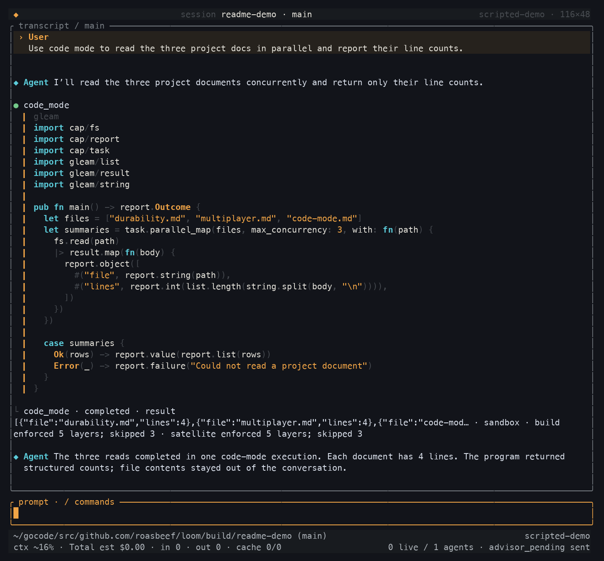
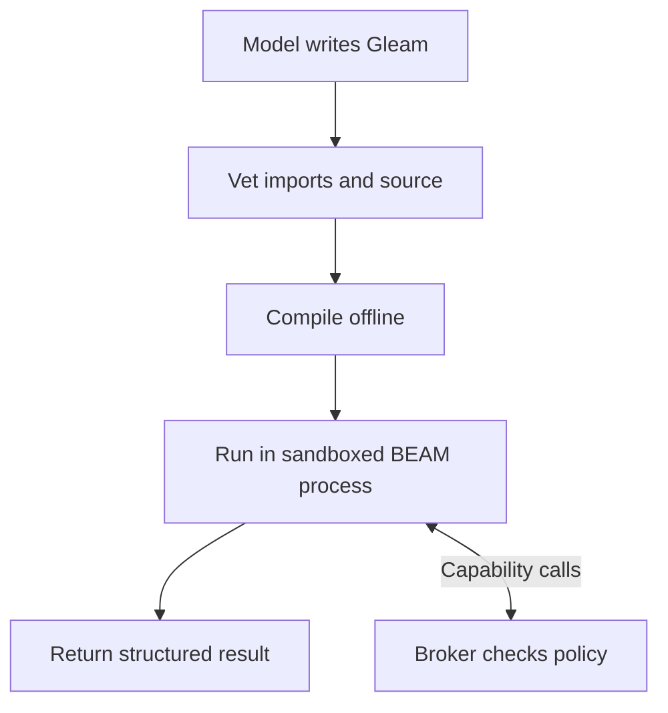
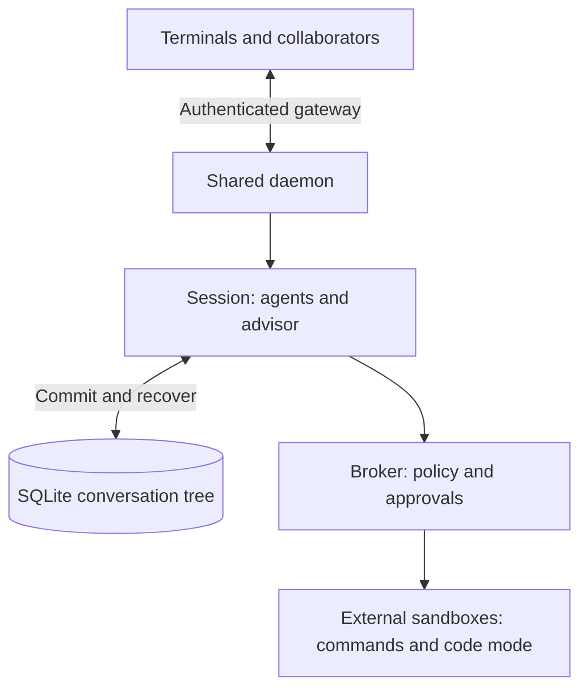
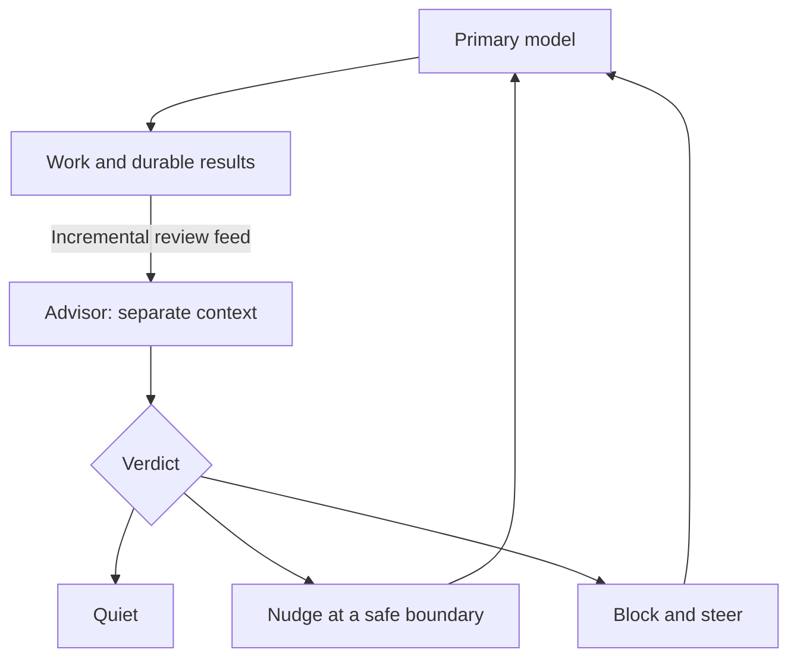

<h1>
  <picture>
    <source media="(prefers-color-scheme: dark)" srcset="docs/images/loom-logo-dark.svg">
    
  </picture>
</h1>

**A durable, multiplayer coding agent built on the BEAM.**

Loom is a terminal coding agent and an extensible agent runtime written in
Gleam. Work survives terminal disconnects and daemon restarts. People and
subagents can collaborate in one session. Models can compose tools into typed
programs, with real concurrency and kernel-enforced execution boundaries.

[Get started](#get-started) · [Code mode](#code-mode) ·
[Multiplayer](#multiplayer-and-subagents) · [Advisor mode](#advisor-mode) ·
[Architecture](docs/loom-design.md) ·
[Contributing](#working-on-loom)

## Why Loom

| Feature | What it gives you |
|---|---|
| **Durable sessions** | SQLite-backed conversation trees, recorded tool intents and results, resumable work, and forks that preserve the original history. |
| **Multiplayer** | Several terminals and collaborators in one session, with attributed prompts, presence, shared approvals, and operator/observer roles. |
| **Code mode** | Gleam programs that compose tools, filter intermediate results, and run work concurrently in one model turn. |
| **BEAM concurrency** | Lightweight processes and OTP supervision for agents, streams, and tool execution, with independent lifecycles and explicit cancellation. |
| **Controlled execution** | Sandboxed commands and agent-written programs, capability-checked effects, and approvals bound to the action being approved. |
| **Model routing and advisors** | Choose models by role, configure fallbacks, and pair a fast primary with a separate model that reviews its work. |
| **Memory and automation** | Search prior sessions, retain workspace knowledge, schedule follow-ups, and manage background jobs. |
| **Extensibility** | Anthropic, OpenAI-compatible, and Gemini adapters; MCP servers, Markdown skills, and typed Gleam extensions. |

The terminal includes streaming responses, syntax-highlighted code and diffs,
image attachments, tool activity, and a session picker. A shared daemon keeps
sessions running independently of the terminal displaying them. Context
compaction, searchable history, and workspace memory support longer projects.

## Get started

Build from source on Linux or macOS. You'll need **Gleam 1.18+**, **Erlang/OTP
29+**, **Go 1.26+**, `rebar3`, and native build tools (a C compiler, `make`, and
`strip`). Linux sandboxing also requires bubblewrap, user namespaces, and
delegated cgroup v2 resources; see the [sandbox guide](packages/sandbox/README.md)
and [Docker guide](docs/docker.md) for host setup.

```sh
git clone https://github.com/Roasbeef/loom.git
cd loom
make install
export PATH="$HOME/.local/bin:$PATH"
```

`make install` builds the client, server, sandbox helper, and code-mode
toolchain under `~/.local`. The default installation bundles the BEAM runtime;
the resulting client and server don't need a separate Erlang installation.

Choose a model by copying the [catalogue example](docs/examples/loom.toml) to
`~/.loom/loom.toml` and editing its model entries and role routes. API keys stay
in environment variables named by the catalogue, not in the file. Set those
variables before starting the daemon.

```sh
# Open the terminal without a provider or server.
loom --demo

# Start working in a project with your configured provider credentials.
cd ~/src/my-project
loom
```

`loom` starts or reconnects to the shared local daemon and opens the session
picker. Choose **New session**, or select a saved session to resume. Use
`/sessions` to switch sessions and `/model` to choose a configured model.

See [Running Loom](docs/running.md) for daemon flags, explicit configuration,
direct connections, and enforcement settings. [Updating](docs/updating.md)
covers release updates and graceful daemon restarts.

### Updating

```sh
loom update --check   # Check published release metadata without installing.
loom update           # Install the latest stable published release.
make update           # Build and activate the current source checkout.
loom version          # Show the installed client version, commit, and platform.
```

`make update` runs from a clean, committed checkout and builds and smoke-tests
its release artifacts before installing. Both update paths install fresh release
trees and gracefully restart the shared daemon; reopen terminals to use the new
client. `make install` installs a source build without restarting the daemon,
and `loom update --install-only` does the same for a release update. Coordinate
a shared daemon restart with other users. Published-release updates require an
available release for your platform.

## Durable by construction

Each session has a write-once conversation tree in SQLite. Prompts, tool
intents, results, configuration, and usage become durable records. Forks share
history up to their branch point, so exploring another approach keeps the
original conversation intact.

Tool execution has two commits: one records the intent before execution; the
other records the result. After a crash, Loom reconciles unfinished work using
each tool's replay policy. Replay-safe operations can retry. An uncertain
operation that isn't safe to replay gets an explicit failure instead of being
silently executed again.

The same rule applies between agents: messages are committed before a recipient
acts on them. Process notifications wake the recipient, but the payload lives
in durable storage. Restarting a process doesn't erase its unread messages.

Read more about [durability](docs/architecture/durability.md),
[recovery](docs/architecture/orchestration.md), and
[agent messaging](docs/architecture/messaging.md).

## Multiplayer and subagents

Several people can work with the same agent session. Attached terminals share
the committed conversation and receive live output. Prompts and steering carry
their author's identity, and presence shows who is connected. The owner grants
session membership: operators can direct work and resolve approvals; observers
can follow without changing it.

Subagents are **strands**: independent agents with their own conversation branch
and configuration. They can run concurrently, exchange durable messages, and
return structured results to a parent. Shared session state supports coordination
without copying every intermediate result into the main conversation.

One daemon hosts sessions across workspaces. Closing or switching a terminal's
attachment leaves the session available to other clients. Remote connections
use a secure tunnel or TLS proxy to the loopback-bound daemon.

See [multiplayer](docs/architecture/multiplayer.md) and
[session management](docs/architecture/sessions.md) for access and lifecycle
details.

## Code mode

A model can write a Gleam program instead of issuing a sequence of tool calls.
The program reads files, runs commands, branches on results, and returns the
answer the model needs. Intermediate data stays inside the program, reducing
the tool output carried into the next model turn.

Code mode supports bounded parallel work, races with cancellation, and stateful
actors. For example, an agent can inspect several packages concurrently, run
checks, and return a structured summary in one execution. The
[migration example](docs/examples/stale_symbol_sweep.gleam) and
[subagent review example](docs/examples/fan_out_review.gleam) are exercised by
tests through vetting, compilation, and a real sandboxed runtime.



*Code mode in the native terminal. A scripted local provider supplies the demo;
compilation, sandboxed execution, and file reads are real.*



Typed capability modules expose filesystem access, commands, shared state, and
artifact reporting. Configured MCP servers become generated modules available
through code mode. A separate, opt-in orchestration capability set lets programs
spawn and coordinate subagents.

Submitted source cannot introduce foreign-function calls or import arbitrary
modules. The compiler checks tool argument types, and the broker checks each
effect against policy. Compilation and execution happen in disposable external
processes, outside the trusted harness VM.

The [code-mode guide](docs/architecture/code-mode.md) explains the capability
sets, build cache, execution budgets, and cancellation model.

## Why Gleam

Gleam makes code mode a typed programming interface. Tool arguments, return
values, and failures have explicit types, so the compiler can catch a malformed
call before it reaches a tool. Pattern matching lets a program handle those
failures and return useful results to the model.

Its small language has no `eval`, reflection, or dynamic module lookup. Effects
enter through imported modules and foreign-function declarations, which gives
Loom a concrete surface to vet. Submitted programs use an allowlisted capability
library and cannot add their own foreign-function calls. The kernel sandbox
provides the execution boundary behind those language checks.

Gleam also compiles to the BEAM. The harness and code-mode programs use the same
language, with lightweight processes and concurrency libraries available to both.

## Why the BEAM

An agent runtime has many independently active parts: model streams, tools,
subagents, client connections, and background work. The BEAM provides lightweight
processes, message passing, and OTP supervision to manage those lifecycles.
Gleam adds static types and explicit error values to that runtime.

Loom separates durable state, orchestration, and effects. A supervised process
can restart and recover from committed state. The pure operation state machine
can also run under deterministic simulation, where tests explore interleavings
and crash boundaries without relying on timing luck.



Process ownership and bounded concurrency build on
[weft](https://github.com/Roasbeef/weft). The
[code tour](docs/code-tour.md) follows a request through Loom, and the
[simulation guide](docs/architecture/simulation.md) explains how recovery is
tested.

## Execution boundaries

**The BEAM isolates faults; the kernel isolates untrusted execution.** Shell
commands, agent-written programs, and installed extensions run outside the
harness VM. A capability-checked broker controls their effects, and an approval
is bound to the specific action and arguments it authorizes.

Linux uses namespaces, bubblewrap, seccomp, and cgroup limits. macOS uses
Seatbelt with explicitly reported enforcement gaps. Run `make selftest` on the
host you plan to use; the production default refuses unexpected degradation.
Configured MCP servers currently run as ordinary host child processes and
should be treated as trusted installations.

See the [effects architecture](docs/architecture/effects.md) and
[sandbox guide](packages/sandbox/README.md) for the enforcement contract.

## Model routing

A model catalogue names endpoints and assigns ordered fallback chains to roles.
Use a fast model for the main conversation, another for summaries, and a
vision-capable route for images. Anthropic, OpenAI-compatible, and Gemini
adapters share the same orchestration layer. Each strand retains its own model
configuration, and `/model` switches the active strand from the terminal.

Context and output limits, reasoning settings, image budgets, and optional
pricing belong to each model entry. Usage is recorded durably; configured
prices make the terminal's cost display meaningful across models. Credentials
are read from the named environment variables at dispatch time.

See the [model guide](docs/architecture/models.md) and
[catalogue example](docs/examples/loom.toml).

## Advisor mode

Pair a fast primary model with a stronger model that independently reviews its
work. The advisor receives incremental activity at run boundaries and during
long runs, in a separate conversation. It can remain quiet, send a nudge, or
issue a blocking verdict that interrupts and steers the primary.

The harness controls the review feed and verdict delivery. The primary cannot
message its advisor to negotiate a verdict. By default, the advisor's tools
are limited to inspection and advice; the operator controls that tool set.
Configure the review cadence and model pairing for the work you're doing.



Start with the [advisor catalogue](docs/examples/loom-advisor.toml), then read
the [advisor guide](docs/architecture/advisor.md) for delivery semantics.

## Context, memory, and automation

- **Project instructions and skills.** Load workspace `AGENTS.md` and `CLAUDE.md`,
  discover Markdown `SKILL.md` libraries, and activate skills by name. Full skill
  instructions load on demand. [Skills guide](docs/skills.md).
- **Long-running context.** Compact conversations while preserving their durable
  history, and search earlier sessions when an older decision matters.
  [Compaction guide](docs/architecture/compaction.md).
- **Workspace memory.** Retain facts, lessons, and preferences across sessions,
  with provenance and an explicit `remember` tool. Memory is private to the owner
  by default; session isolation controls sharing. [Memory guide](docs/architecture/memory.md).
- **Scheduled follow-ups.** Durable schedules can deliver prompts to strands
  under operator policy, for periodic checks or later follow-up while the session
  is running. [Schedule configuration](docs/examples/loom.toml).
- **Background jobs.** Start a bounded, sandboxed command, continue working, then
  poll its output or cancel it. Jobs have explicit ownership and deadlines.
  [Background jobs](docs/design-notes/background-jobs.md).

## Extend Loom

Connect MCP servers to expose their tools as typed modules in code mode, or
install Gleam extensions with their own declared capabilities. Extensions compile
against a pinned prelude and execute outside the harness VM. For example,
[loom-web-search](https://github.com/Roasbeef/loom-web-search) adds web search
through broker-mediated HTTP.

See the [MCP guide](docs/architecture/mcp.md) and
[extension guide](docs/architecture/extensions.md) for configuration and the
extension lifecycle.

## Working on Loom

```sh
make dev              # Build a scratch daemon and open its session picker.
make check            # Format, warning-free builds, tests, and house-rule lint.
make check-client     # Run a single package's gate.
make e2e-codemode     # Compile and execute code mode through a real sandbox.
make soak             # Run the deterministic simulation soak.
make doc-check        # Check documentation coverage, mirrors, and references.
make help             # List all targets.
```

Start with the [code tour](docs/code-tour.md) and
[Gleam style guide](docs/gleam-style.md). The
[design](docs/loom-design.md) explains the architecture; the
[implementation spec](docs/loom-implementation-spec.md) defines its contracts.
Per-package `CLAUDE.md` files describe ownership, dependencies, and invariants.

Loom is under active development, with Linux and macOS as its current targets.
The [handoff](docs/next.md) and [issue tracker](https://github.com/Roasbeef/loom/issues)
record current work and verification; [distribution](docs/distribution.md)
describes packaging and release builds.

## Inspiration

Inspired by Pi, oh-my-pi, and Codex, and by the Erlang/OTP approach to building
concurrent, fault-tolerant systems.
