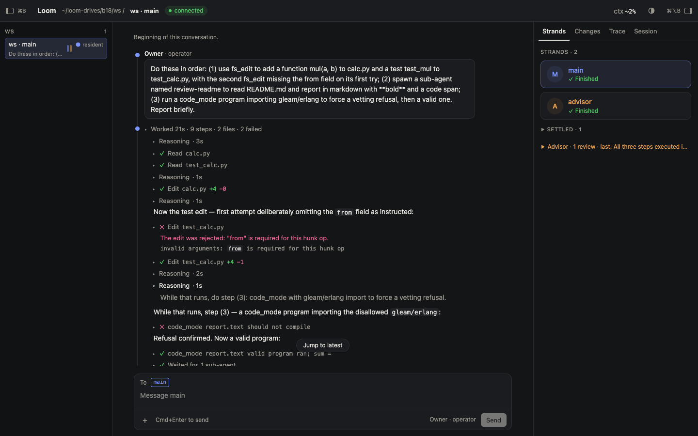
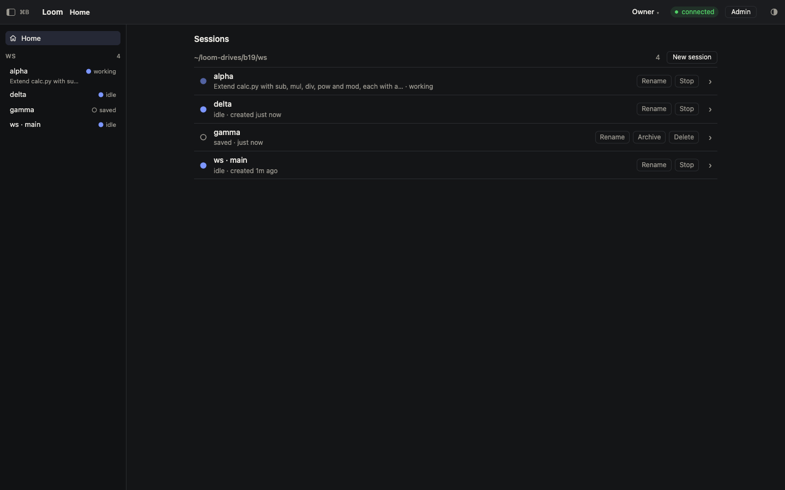
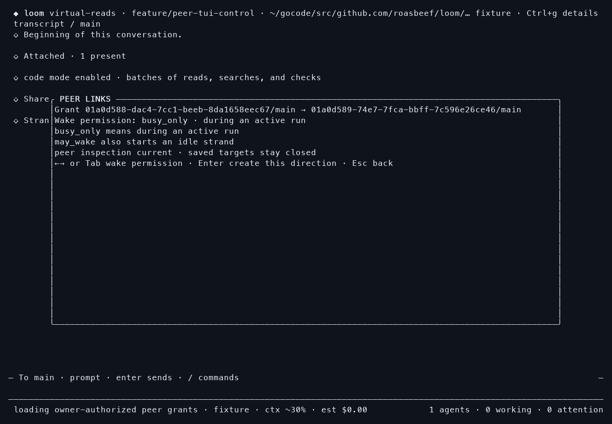
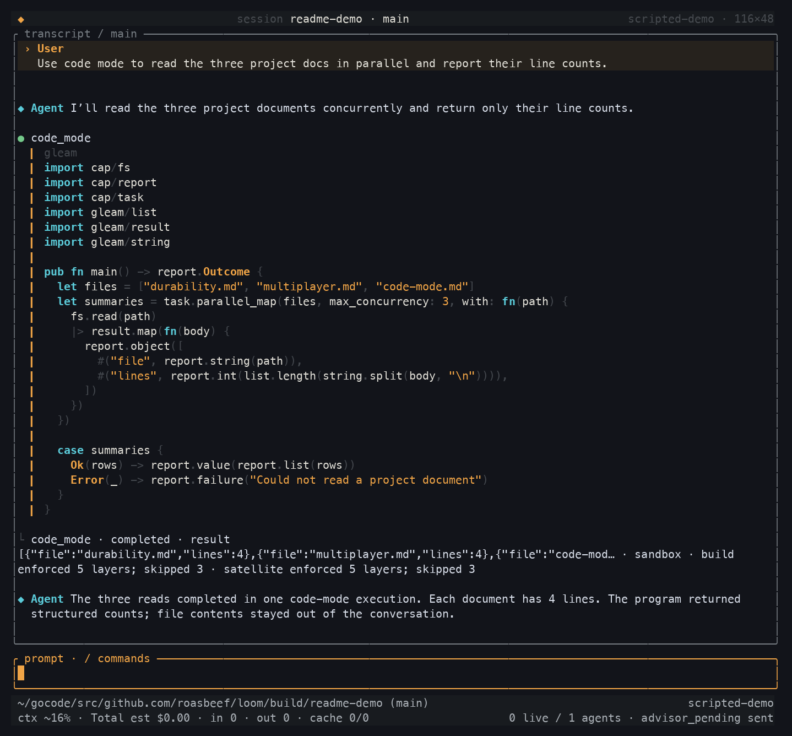
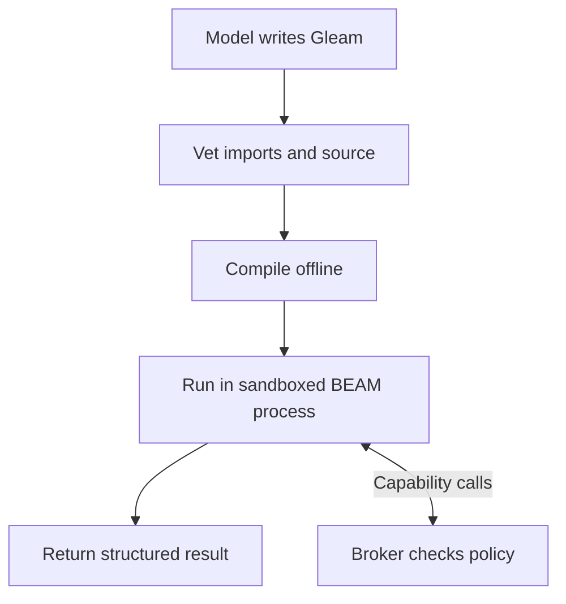
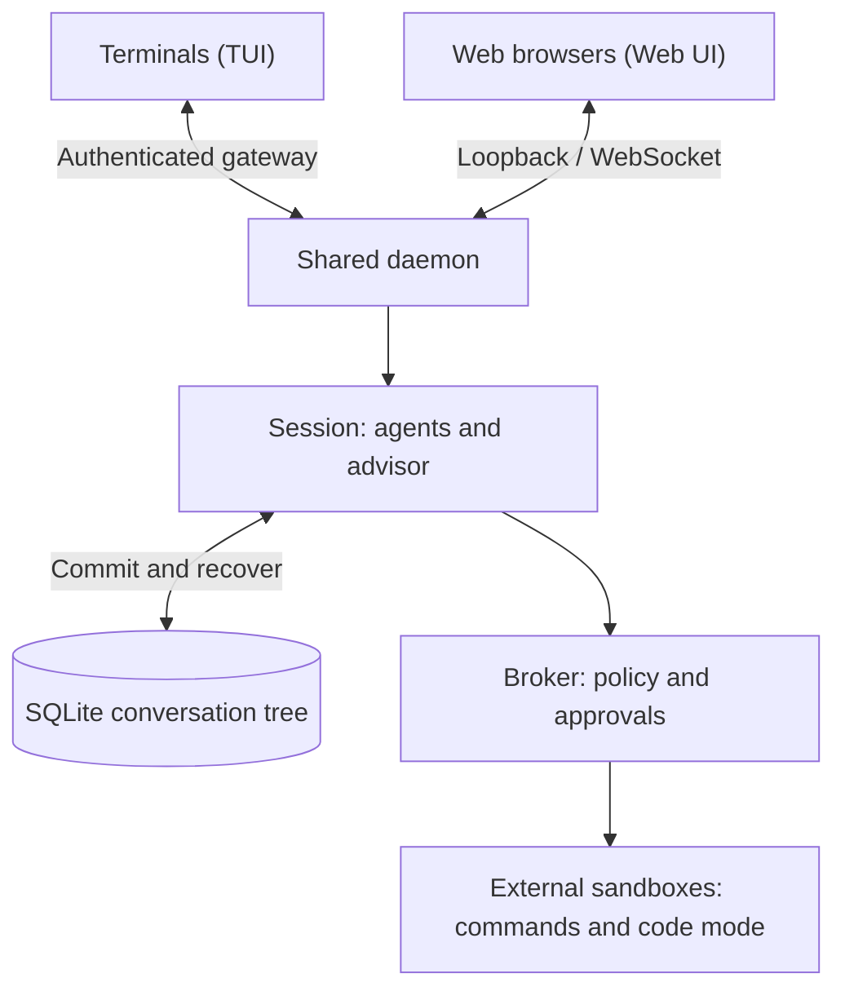
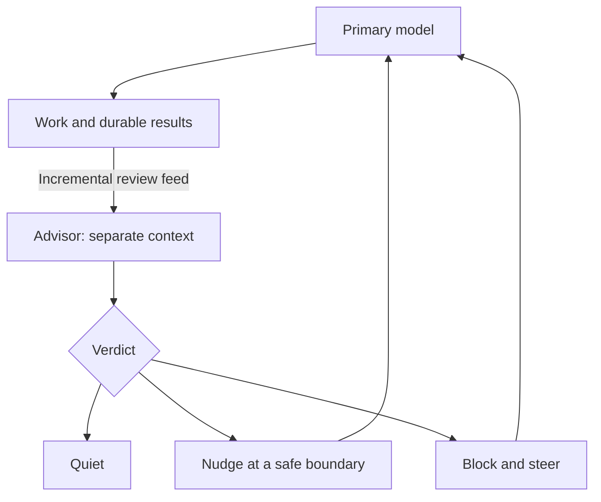

<h1 align="center">
  <picture>
    <source media="(prefers-color-scheme: dark)" srcset="docs/images/loom-logo-dark.svg">
    
  </picture>
</h1>

**A durable, multiplayer coding agent built on the BEAM.**

Loom is a coding agent and an extensible agent runtime written in
Gleam, offering both a native terminal interface and a web app powered by a
shared daemon. Work survives terminal disconnects and daemon restarts. People and
subagents can collaborate within a session or exchange messages across sessions
through explicit grants. Models can compose tools into typed programs, keep
actors alive across turns, and coordinate children with durable named steps.
Programs run concurrently within kernel-enforced execution boundaries.

[Get started](#get-started) · [Multiplayer](#multiplayer-and-subagents) ·
[Web UI](#web-ui) · [Code mode](#code-mode) ·
[Async collaboration](#async-collaboration) · [Advisor mode](#advisor-mode) ·
[Language servers](#language-servers) ·
[Architecture](docs/loom-design.md) ·
[Contributing](#working-on-loom)

## Why Loom

| Feature | What it gives you |
|---|---|
| **Durable sessions** | SQLite-backed conversation trees, recorded tool intents and results, resumable work, and forks that preserve the original history. |
| **Multiplayer** | Several terminals and collaborators in one session, with attributed prompts, presence, shared approvals, and operator/observer roles. |
| **Web UI** | A browser home page that lists and opens sessions, session creation and admin controls for the owner, and a thirty-day browser login — served from the same loopback daemon, no extra install. |
| **Code mode** | Gleam programs that compose tools, run concurrently, and retain actors across turns in a background execution. |
| **Agent collaboration** | Granted peer messaging across strands and resident sessions, plus named workflow steps that reuse durable child results. |
| **BEAM concurrency** | Lightweight processes and OTP supervision for agents, streams, and tool execution, with independent lifecycles and explicit cancellation. |
| **Controlled execution** | Sandboxed commands and agent-written programs, capability-checked effects, and approvals bound to the action being approved. |
| **Model routing and advisors** | Choose models by role, configure fallbacks, pair a fast primary with a separate model that reviews its work, and pin a goal the pair works toward across runs. |
| **Memory and automation** | Search prior sessions, retain workspace knowledge, schedule follow-ups, and manage background jobs. |
| **Language servers** | Semantic definitions, references, hover, diagnostics and rename through jailed language servers, available as tools and typed code-mode calls. Install profiles for Gleam, Go and Rust. |
| **Extensibility** | Anthropic, OpenAI-compatible Chat Completions, public OpenAI Responses, and Gemini adapters; MCP servers, Markdown skills, and typed Gleam extensions. |

Both the terminal and the web view connect to the same shared daemon, so you
can use either interface or both interchangeably. The terminal includes streaming
responses, syntax-highlighted code and diffs, image attachments, tool activity,
and a session picker. The web app provides a workspace home page, live transcripts,
approval prompts, and an admin surface. Context compaction, searchable history,
and workspace memory support longer projects.

## Get started

Build from source on Linux or macOS. You'll need
**Gleam 1.19.0**, **Erlang/OTP 29+**, **Go 1.26+**, `rebar3`, and native build tools (a C compiler, `make`, and
`strip`). Linux sandboxing also requires bubblewrap, user namespaces, and
delegated cgroup v2 resources; see the [sandbox guide](packages/sandbox/README.md)
and [Docker guide](docs/docker.md) for host setup.

Reproducible release builds use the
[maintained compiler patches](scripts/toolchain/gleam/README.md); ordinary
source builds can use the stock compiler.

```sh
git clone https://github.com/Roasbeef/loom.git
cd loom
make install
export PATH="$HOME/.local/bin:$PATH"
```

`make install` builds the client, server, sandbox helper, and code-mode
toolchain under `~/.local`. The default installation bundles the BEAM runtime;
the resulting client and server don't need a separate Erlang installation.

Choose a model by copying the [catalogue example](docs/examples/loom.toml) to
`~/.loom/loom.toml` and editing its model entries and role routes. API keys stay
in environment variables named by the catalogue, not in the file. Set those
variables before starting the daemon. The [configuration reference](docs/configuration.md)
lists every key the file accepts.

```sh
# Open the terminal without a provider or server.
loom --demo

# Start working in a project with your configured provider credentials.
cd ~/src/my-project
loom
```

`loom` starts or reconnects to the shared local daemon and opens the session
picker. Choose **New session**, or select a saved session to resume. Use
`/sessions` to switch sessions and `/model` to choose a configured model.

See [Running Loom](docs/running.md) for daemon flags, explicit configuration,
direct connections, and enforcement settings. [Updating](docs/updating.md)
covers release updates and graceful daemon restarts.

### Updating

```sh
loom update --check   # Check published release metadata without installing.
loom update           # Install the latest stable published release.
make update           # Build and activate the current source checkout.
loom version          # Show the installed client version, commit, and platform.
```

`make update` runs from a clean, committed checkout and builds and smoke-tests
its release artifacts before installing. Both update paths install fresh release
trees and gracefully restart the shared daemon; reopen terminals to use the new
client. `make install` installs a source build without restarting the daemon,
and `loom update --install-only` does the same for a release update. Coordinate
a shared daemon restart with other users. Published-release updates require an
available release for your platform.

## Durable by construction

Each session has a write-once conversation tree in SQLite. Prompts, tool
intents, results, configuration, and usage become durable records. Forks share
history up to their branch point, so exploring another approach keeps the
original conversation intact.

Tool execution has two commits: one records the intent before execution; the
other records the result. After a crash, Loom reconciles unfinished work using
each tool's replay policy. Replay-safe operations can retry. An uncertain
operation that isn't safe to replay gets an explicit failure instead of being
silently executed again.

The same rule applies between agents: messages are committed before a recipient
acts on them. Process notifications wake the recipient, but the payload lives
in durable storage. Restarting a process doesn't erase its unread messages.

Read more about [durability](docs/architecture/durability.md),
[recovery](docs/architecture/orchestration.md), and
[agent messaging](docs/architecture/messaging.md).

## Multiplayer and subagents

Several people can work with the same agent session across terminals and
browsers. Attached clients share the committed conversation and receive live
output in real time. Prompts and steering carry their author's identity, and
presence shows who is connected. The owner can share a session by inviting
collaborators from the terminal (`loom access`) or directly from the web view.
Session membership is role-based: operators can direct work and resolve approvals;
observers can follow without changing state.

Subagents are **strands**: independent agents with their own conversation branch
and configuration. They can run concurrently, exchange durable messages, and
return structured results to a parent. Shared session state supports coordination
without copying every intermediate result into the main conversation.

The owner can grant directional peer links between siblings or across resident
sessions. See [async collaboration](#async-collaboration) for the messaging and
background workflow APIs.

One daemon hosts sessions across workspaces. Closing or switching a terminal's
attachment leaves the session available to other clients. Remote connections
use a secure tunnel or TLS proxy to the loopback-bound daemon.

To share a session with a colleague from a browser, follow the
[guide to working with other people](docs/guide/multiplayer.md).

See [multiplayer](docs/architecture/multiplayer.md) and
[session management](docs/architecture/sessions.md) for access and lifecycle
details.

## Web UI

Loom pairs its terminal with a web app served by the same daemon. When started
with `--ui` (or `[daemon] ui = true`), the daemon hosts a browser interface
accessible locally or through an SSH tunnel. Both interfaces share the same
underlying session state: prompts entered in the terminal stream to the browser,
and approvals or steering in the browser reflect in the terminal in real time.

`loom ui` prints a single-use link to your home page, which lists sessions by
workspace and opens any of them, saved sessions included. Opening the home signs
the browser in for thirty days, so its bookmark works without `loom ui`.



*The web session view showing a live transcript with collapsible tool steps, reasoning blocks, subagent status, and the advisor review rail.*

Inside a session, the web view provides a live transcript with collapsible tool
executions and diffs, strand inspection, and an advisor commentary rail. Operators
can steer runs, target specific subagents from the composer, and resolve tool
approvals.

Sessions can be shared with others by generating single-use observer or operator
links (`loom ui --session ID`), or by inviting collaborators from the admin page.
Invitees without `loom` installed can redeem an invitation claim at
`http://<host>/ui/claim`, enter their token, choose a display name, and land on
their home page with a browser login. The daemon binds to loopback only; remote
browsers connect through a secure tunnel such as `ssh -L`.

```sh
loom ui                                 # Open your home page (starts the daemon if needed)
loom ui --session SESSION_ID --operate  # Open a specific session as an operator
loom access list                        # List who holds access to your sessions
```

From the home page, the owner can also create new sessions, stop a running session
with mid-turn confirmation, rename, archive, or delete saved sessions, and open the
admin page to manage member roles, revoke credentials or active sign-ins, and rotate keys.



*The web home page listing resident and saved sessions by workspace with owner controls.*

See [the web view](docs/architecture/web-view.md) for routes, authentication, and
security details.

## Async collaboration

An agent can launch a `code_mode` program that stays active while later turns
send it input. The program registers typed endpoints for its actors, publishes
progress, and returns a final result. Its handle supports readiness checks,
input, joining, and cancellation. A daemon restart retains the execution record
and input journal, but cannot restore the running actor heap or replay its
effects.

For work that must survive a restart, `cap/workflow.step` names each child task
and recovers its original operation and result on a later launch. This lets an
agent resume a review workflow without starting completed reviewers again.

The session owner can also link a source strand to a target strand in the same
session or another resident session. `peer_roster` discovers linked peers;
`peer_send` commits an attributed message and a retry-safe receipt. Links are
directional, and permission to wake an idle target is granted separately.
Messaging does not grant access to the peer's files or permission to join or
cancel its work. Saved sessions are not opened by a message.

In the terminal, `/sessions` lists resident targets. Select one and press `l`
to link it from the attached strand; Enter still opens the selected session.
The review shows both endpoints and the wake permission before creating the
link. `/peers` inspects and revokes grants, while `/agents` plus `p` starts from
a selected source strand.



*The owner reviews an exact source and target strand before granting the link.*

The [API guide](docs/async-collaboration.md) shows launch, typed endpoints,
workflow steps, and peer-link commands. The
[architecture guide](docs/architecture/async-collaboration.md) explains durable
custody and recovery.

## Code mode

A model can write a Gleam program instead of issuing a sequence of tool calls.
The program reads files, runs commands, starts child agents, branches on their
results, and returns the answer the model needs. The default server admits
these capabilities in both workspace and orchestration mode; an omitted mode
selects workspace. Intermediate data stays inside the program, reducing the
tool output carried into the next model turn.

Code mode supports bounded parallel work, races with cancellation, and stateful
actors. For example, an agent can inspect several packages concurrently, run
checks, and return a structured summary in one execution. The
[migration example](docs/examples/stale_symbol_sweep.gleam) and
[subagent review example](docs/examples/fan_out_review.gleam) are exercised by
tests through vetting, compilation, and a real sandboxed runtime.



*Code mode in the native terminal. A scripted local provider supplies the demo;
compilation, sandboxed execution, and file reads are real.*


```mermaid
flowchart TB
    A[Model writes Gleam] --> B[Vet imports and source]
    B --> C[Compile offline]
    C --> D[Run in sandboxed BEAM process]
    D --> E[Return structured result]
    D <-->|Capability calls| F[Broker checks policy]
```

A program imports typed capability modules for files, commands, child agents,
language servers, MCP servers and durable session notes, and the import list is
its permission set. With `"mode": "launch"`, a program keeps its actors alive
across model turns and accepts typed input from later calls. Submitted source
cannot declare foreign functions or import arbitrary modules, and it compiles
and runs in disposable sandboxed processes outside the trusted harness VM.

[**Code mode at a glance**](docs/code-mode.md) is the one-page overview: what a
program can import, notes and the blackboard, orchestration, launch mode, the
safety model, and the distributed execution in development. The
[architecture document](docs/architecture/code-mode.md) has the mechanics.

## Language servers

Loom can ask a language server for definitions, references, types, file
outlines, call hierarchy and diagnostics, and preview or apply a semantic
rename across files through `cap/lsp` in code mode. Semantic queries use
capability modules rather than separate top-level LSP tools. Results include file and line anchors for editing; writes through
`fs_write` and `fs_edit` also report diagnostics for files the running server
owns. Rename previews write nothing, and unsupported server features are
reported explicitly.

Language support ships as three optional profile extensions:

| Language | Profile | Server prerequisite |
|---|---|---|
| [Gleam](https://github.com/Roasbeef/loom-lsp-gleam) | `lsp_gleam` | `gleam lsp`. |
| [Go](https://github.com/Roasbeef/loom-lsp-go) | `lsp_go` | Go and `gopls`. |
| [Rust](https://github.com/Roasbeef/loom-lsp-rust) | `lsp_rust` | Rust, `rust-analyzer`, `rust-src` and cached dependencies. |

Install the profiles you need after preparing their server prerequisites:

```sh
loomd ext install https://github.com/Roasbeef/loom-lsp-gleam --rev v0.1.0
loomd ext install https://github.com/Roasbeef/loom-lsp-go --rev v0.1.0
loomd ext install https://github.com/Roasbeef/loom-lsp-rust --rev v0.1.0
loomd ext list
```

The profiles configure already installed binaries; each server runs inside
Loom's jail with network access disabled. Start a new session after installation
and verify each selected profile with `loomd ext check <profile>`.
The [language-server setup guide](docs/language-servers.md) covers installation
for all three languages, offline dependency preparation, daemon PATH, checks,
custom paths and troubleshooting. The [architecture guide](docs/architecture/lsp.md)
explains server ownership, isolation and rename behavior.

Code-mode programs can also collect explicit outlines and reference targets
through `cap/lsp_sql`, then use read-only SQLite joins, filters and aggregates
over the captured facts. Queries run inside the jailed program and return
typed rows with scope and provenance. The [SQL usage guide](docs/lsp-sql.md)
has a complete Gleam example; the [architecture document](docs/architecture/lsp-sql.md)
explains admission, limits and the finite observation guarantee.

## Why Gleam

Gleam makes code mode a typed programming interface. Tool arguments, return
values, and failures have explicit types, so the compiler can catch a malformed
call before it reaches a tool. Pattern matching lets a program handle those
failures and return useful results to the model.

Its small language has no `eval`, reflection, or dynamic module lookup. Effects
enter through imported modules and foreign-function declarations, which gives
Loom a concrete surface to vet. Submitted programs use an allowlisted capability
library and cannot add their own foreign-function calls. The kernel sandbox
provides the execution boundary behind those language checks.

Gleam also compiles to the BEAM. The harness and code-mode programs use the same
language, with lightweight processes and concurrency libraries available to both.

## Why the BEAM

An agent runtime has many independently active parts: model streams, tools,
subagents, client connections, and background work. The BEAM provides lightweight
processes, message passing, and OTP supervision to manage those lifecycles.
Gleam adds static types and explicit error values to that runtime.

Loom separates durable state, orchestration, and effects. A supervised process
can restart and recover from committed state. The pure operation state machine
can also run under deterministic simulation, where tests explore interleavings
and crash boundaries without relying on timing luck.


```mermaid
flowchart TB
    T["Terminals (TUI)"] <-->|"Authenticated gateway"| D["Shared daemon"]
    W["Web browsers (Web UI)"] <-->|"Loopback / WebSocket"| D
    D --> S["Session: agents and advisor"]
    S <-->|"Commit and recover"| H[("SQLite conversation tree")]
    S --> B["Broker: policy and approvals"]
    B --> J["External sandboxes: commands and code mode"]
```

Process ownership and bounded concurrency build on
[weft](https://github.com/Roasbeef/weft). The
[code tour](docs/code-tour.md) follows a request through Loom, and the
[simulation guide](docs/architecture/simulation.md) explains how recovery is
tested.

## Execution boundaries

**The BEAM isolates faults; the kernel isolates untrusted execution.** Shell
commands, agent-written programs, and installed extensions run outside the
harness VM. A capability-checked broker controls their effects, and an approval
is bound to the specific action and arguments it authorizes.

Linux uses namespaces, bubblewrap, seccomp, and cgroup limits. macOS uses
Seatbelt with explicitly reported enforcement gaps. Run `make selftest` on the
host you plan to use; the production default refuses unexpected degradation.
Configured MCP servers currently run as ordinary host child processes and
should be treated as trusted installations.

See the [effects architecture](docs/architecture/effects.md) and
[sandbox guide](packages/sandbox/README.md) for the enforcement contract.

## Model routing

A model catalogue names endpoints and assigns ordered fallback chains to roles.
Use a fast model for the main conversation, another for summaries, and a
vision-capable route for images. Anthropic, OpenAI-compatible, and Gemini
adapters share the same orchestration layer. Each strand retains its own model
configuration, and `/model` switches the active strand from the terminal.

Context and output limits, reasoning settings, image budgets, and optional
pricing belong to each model entry. Usage is recorded durably; configured
prices make the terminal's cost display meaningful across models. Credentials
are read from the named environment variables at dispatch time.

See the [model guide](docs/architecture/models.md), the
[configuration reference](docs/configuration.md) and the
[catalogue example](docs/examples/loom.toml).

## Advisor mode

Pair a fast primary model with a stronger model that independently reviews its
work. The advisor receives incremental activity at run boundaries and during
long runs, in a separate conversation. It can remain quiet, send a nudge, or
issue a blocking verdict that interrupts and steers the primary.

The harness controls the review feed and verdict delivery. The primary cannot
message its advisor to negotiate a verdict. By default, the advisor's tools
are limited to inspection and advice; the operator controls that tool set.
Configure the review cadence and model pairing for the work you're doing.


```mermaid
flowchart TB
    P["Primary model"] --> W["Work and durable results"]
    W -->|"Incremental review feed"| A["Advisor: separate context"]
    A --> V{"Verdict"}
    V --> Q["Quiet"]
    V --> N["Nudge at a safe boundary"]
    V --> B["Block and steer"]
    N --> P
    B --> P
```

Start with the [advisor catalogue](docs/examples/loom-advisor.toml), then read
the [advisor guide](docs/architecture/advisor.md) for delivery semantics.

### Session goals

With an advisor configured, you can pin an objective and let Loom work toward
it across runs. After each primary run, the advisor reviews the new work and
answers `continue` or `complete`. A continuation starts another run with the
advisor's note; completion records the note and stops. An optional check
command runs in the sandbox before each review, so the advisor judges against
real output such as a test run.

```text
/goal --budget 400000 get the branch green
/goal check make check
```

The loop is bounded by a token budget, a continuation cap, and progress checks.
Only the operator can set, pause, resume, or clear a goal; the primary model
receives the objective but cannot change or complete it. `/goal` shows the
current state, and aborting a goal-driven run pauses the goal rather than
erasing it. See the [goals guide](docs/architecture/goals.md).

## Context, memory, and automation

- **Project instructions and skills.** Load workspace `AGENTS.md` and `CLAUDE.md`,
  discover Markdown `SKILL.md` libraries, and activate skills by name. Full skill
  instructions load on demand. [Skills guide](docs/skills.md).
- **Long-running context.** Compact conversations while preserving their durable
  history, and search earlier sessions when an older decision matters.
  [Compaction guide](docs/architecture/compaction.md).
- **Workspace memory.** Retain facts, lessons, and preferences across sessions,
  with provenance and an explicit `remember` tool. Memory is private to the owner
  by default; session isolation controls sharing. [Memory guide](docs/architecture/memory.md).
- **Scheduled follow-ups.** Durable schedules can deliver prompts to strands
  under operator policy, for periodic checks or later follow-up while the session
  is running. [Schedule configuration](docs/examples/loom.toml).
- **Background jobs.** Start a bounded, sandboxed command, continue working, then
  poll its output or cancel it. Jobs have explicit ownership and deadlines.
  [Background jobs](docs/design-notes/background-jobs.md).

## Extend Loom

Connect MCP servers to expose their tools as typed modules in code mode, or
install Gleam extensions with their own declared capabilities. Extensions compile
against a pinned prelude and execute outside the harness VM. For example,
[loom-web-search](https://github.com/Roasbeef/loom-web-search) adds web search
through broker-mediated HTTP.

Try the [Jev MCP walkthrough](docs/jev-mcp.md) for setup, generated API
discovery, and a code-mode query that also works against a local fixture.
See the [MCP guide](docs/architecture/mcp.md) and
[extension guide](docs/architecture/extensions.md) for configuration and the
extension lifecycle.

### Language server profiles

The agent can ask a language server where a symbol is defined, who uses it,
and what a rename would touch, and sees compiler diagnostics after its edits.
The server runs in the same sandbox as any other tool, and edits land through
the normal hashline path. Language support ships as profile extensions in
separate repositories, so Loom carries the mechanism and no language:

- [loom-lsp-gleam](https://github.com/Roasbeef/loom-lsp-gleam)
- [loom-lsp-go](https://github.com/Roasbeef/loom-lsp-go)
- [loom-lsp-rust](https://github.com/Roasbeef/loom-lsp-rust)

Install one with `loomd ext install https://github.com/Roasbeef/loom-lsp-go --rev v0.1.0`.
To support another language, write a profile extension: the server's command
and the roots it needs, a small fixture project, and `[[check]]`s naming the
sites the server must report, then run `loomd ext check` until they pass. See
the [language server guide](docs/architecture/lsp.md).

## Working on Loom

```sh
make dev              # Build a scratch daemon and open its session picker.
make check            # Format, warning-free builds, tests, and house-rule lint.
make check-client     # Run a single package's gate.
make e2e-codemode     # Compile and execute code mode through a real sandbox.
make soak             # Run the deterministic simulation soak.
make doc-check        # Check documentation coverage, mirrors, and references.
make help             # List all targets.
```

Start with the [code tour](docs/code-tour.md) and
[Gleam style guide](docs/gleam-style.md). The
[design](docs/loom-design.md) explains the architecture; the
[implementation spec](docs/loom-implementation-spec.md) defines its contracts.
Per-package `CLAUDE.md` files describe ownership, dependencies, and invariants.

Loom is under active development, with Linux and macOS as its current targets.
The [handoff](docs/next.md) and [issue tracker](https://github.com/Roasbeef/loom/issues)
record current work and verification; [distribution](docs/distribution.md)
describes packaging and release builds.

## Inspiration

Inspired by Pi, oh-my-pi, and Codex, and by the Erlang/OTP approach to building
concurrent, fault-tolerant systems.
