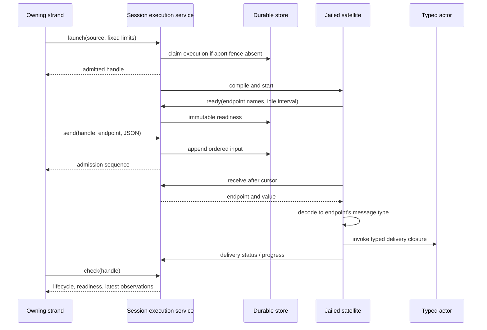

# Async collaboration: ownership, input and recovery

Async collaboration lets a code-mode program keep running in the background
while later model turns send it input. Code mode runs a model-written Gleam
program in a satellite, a fresh jailed BEAM node separate from the harness
VM. A launched program can keep state in its own actors for the life of the
execution. Separately, peer links let one session send messages to another.

Responsibility splits across the jail boundary. The host (the harness VM)
holds the execution identity, the input journal and ownership of child
operations; the satellite holds the actor heap. That split determines what
survives a restart and what each successful response proves.

The [API guide](../async-collaboration.md) describes calls and examples.
[Protocol 048](../../protocol-change/048-async-collaboration.md) records the
interface changes. This document explains the responsibilities behind them.

## From launch to useful input

`code_mode` runs synchronously unless the caller selects `launch`. On launch,
the client allocates a separate broker step beneath the initiating operation
and commits an execution record before it starts the worker. The commit is a
transaction that fails if the execution already exists or if an
operation-abort fence is present for the initiating operation. The record
fixes the source, the owner strand (the agent conversation within the session
that launched it), the seam and an absolute deadline.

Three modules divide the work. `client/async_runs` owns live workers and
serializes interactions with a handle. `runtime/async_execution` defines the
durable record and its total decoders. `client/async_codemode` binds
capability requests to the current execution, so a program cannot name a
different execution identity in a capability call.

`Running` means the worker has custody; compilation or startup can still be
pending. Readiness is a separate durable fact, published only when the
program registers its input endpoints. A send before readiness, or to an
unknown endpoint, fails without appending input. Readiness stays visible after
the execution ends, so a caller must check the lifecycle state as well.

## Typed delivery stays inside the satellite

`cap/execution.endpoint` pairs a JSON decoder with a callback that accepts
the decoder's message type, and hides that type inside one closure. One list
can therefore hold endpoints for actors with different message types. `serve`
publishes all endpoint names together, then drains one ordered journal and
dispatches each value locally. No actor subject or executable closure crosses
into the host.

An endpoint name selects a decoder; it grants no authority. A decoder failure
or callback error records a rejection and advances the serving cursor, so one
bad value does not block later inputs. The endpoint set and idle interval are
immutable once published.

Legacy `receive` registers the single `default` endpoint on its first call and
returns raw values for the program to decode. An execution cannot mix the raw
and typed receive modes.

The journal is durable and non-destructive. Reading the same cursor returns
the same entry again, and sending the same value twice creates two entries.
The serving cursor and delivery status are volatile, so neither is an
exactly-once ledger of effects. A program must not treat replayed input as
proof that an earlier side effect did not happen.

Three acknowledgements answer different questions:

| Observation | What it establishes |
|---|---|
| `send` sequence | The host stored input in the execution's journal. |
| `latest_delivery` | The satellite reported decoder/callback success or rejection. |
| Application progress or final result | The program's own account of its work. |

A successful delivery callback may only have enqueued a message for an actor,
so it does not prove the actor processed that message. Delivery status and
progress are both reported by the program; the harness does not verify them
independently.

## Bounded observation and lifetime

Progress is a coalesced, volatile snapshot. The service keeps the current
snapshot and at most one pending replacement per live execution, and it
coalesces updates on a 100 ms interval. `check` exposes the published
sequence, timestamp and JSON value, and intermediate updates can disappear
before any reader sees them. Progress is limited to 16,384 encoded bytes and
is neither a durable event log nor a recovery input.

The latest delivery observation is also volatile, with a bounded rejection
reason. Both it and progress disappear when the live execution is removed.

An execution has at most 16 endpoint names and 128 journal entries, with a
65,536-byte limit on the encoded journal. A session permits eight live
executions. An initiating operation can create at most 32 executions in
total, including ones already settled or lost. Recovery reconstructs that
count from durable records, and retrying an existing handle does not consume
another launch.

Typed serving requires an idle interval of 1..300000 ms. The host measures it
from readiness or from the most recent successful delivery callback; rejected
input, progress and status polling do not renew it. The idle check runs only
at input receive boundaries, so it limits the input service and is not a CPU
watchdog.

When the idle interval expires, the host closes admission and reaps the
execution as `Lost`, and that cancellation can race the satellite's idle
response. The fixed wall deadline still bounds compilation, callbacks and
other work. Raw receive keeps its per-call wait and original wall deadline,
with no typed-service idle limit.

The `code_mode` tool's `Exclusive` classification serializes the tool
invocation against other exclusive calls in the same batch. In launch mode,
that invocation ends when admission returns, so it does not reserve exclusive
workspace access for the rest of the satellite's life. Several admitted
executions can overlap, and programs must coordinate conflicting workspace
changes through the available capability policy and their own application
protocol.

## Closing custody and recovering identity

An execution moves through `Starting → Running → Draining → Finished(result) |
Lost(reason)`, and the state records custody. Admission closes before effect
cancellation and child cleanup begin. Admitting a child owned by an execution
checks the durable live generation and the operation-abort fence. Settlement
also covers background executions launched by owned children, even when those
children's model turns have already ended.

A daemon restart cannot restore a satellite heap. On restart, the daemon marks
surviving live records lost and retries cleanup; it does not rerun arbitrary
effects.

`cap/workflow.step` provides a narrower recovery guarantee. The launching
strand, run name and step name locate a stored intent, and the version, input
and assignment must match it. The intent keeps the original caller operation
and call site for Agency reconciliation. A separate pointer to the original
child operation is committed together with child admission, so an interrupted
publication of lineage cannot accidentally adopt a later run on that strand.
Durable child results remain available, and an intentional retry needs a new
step name.

## Peers have separate authority

A directional peer link authorizes messaging, with a separate permission to
wake an idle strand. It grants no child ownership, no join or cancel authority
and no filesystem access. The receiving session checks its grant and commits
both the message and a deduplication receipt in one atomic step. Retrying a
request ID with a different body fails. Delivery requires a resident session;
discovery does not activate saved sessions.

The conversation entry carries `PeerOrigin(session, strand)`, derived from
source identity that the harness binds. Legacy human origins keep their
existing wire shape. Peer origins have a distinct tagged encoding, and a
malformed origin fails decoding rather than becoming anonymous. Provider
rendering labels the entry as a message from a peer agent. The receipt
separately keeps optional source metadata supplied by the host, and
daemon-control sends currently supply `null` for it. See
[messaging](messaging.md) for link administration and routing.

TUI linking is tracked in [#485](https://github.com/Roasbeef/loom/issues/485),
CLI conveniences in [#488](https://github.com/Roasbeef/loom/issues/488), and a
complete collaboration workflow example in
[#489](https://github.com/Roasbeef/loom/issues/489). Saved-session outboxes,
cross-machine routing, deadline renewal and actor-heap recovery are separate
extensions, not guarantees of this protocol.
