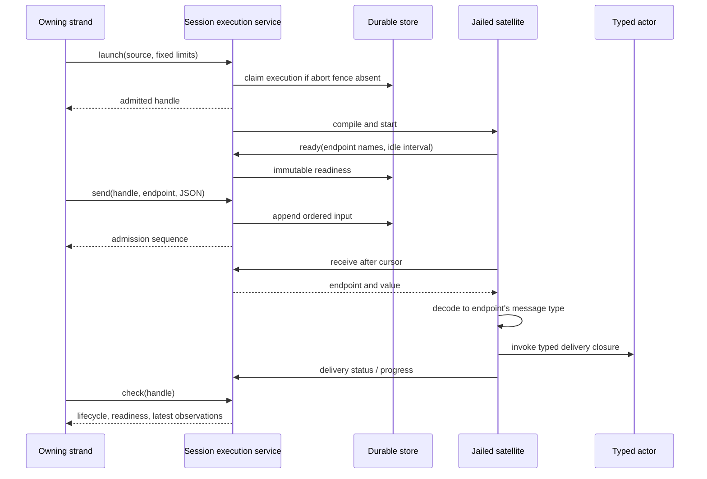

# Async collaboration: ownership, input and recovery

A background code-mode program runs in one sandboxed satellite while later
model turns send it data. Its actors can retain state during that execution.
The host retains the execution identity, input journal and child ownership;
the satellite retains the actor heap. This separation determines what survives
a restart and what a successful response proves.

The [API guide](../async-collaboration.md) describes calls and examples.
[Protocol 045](../../protocol-change/045-async-collaboration.md) records the
interface changes. This document explains the responsibilities behind them.

## From launch to useful input

`code_mode` remains synchronous unless the caller selects `launch`. The client
allocates a separate broker step beneath the initiating operation and commits
an execution record before starting its worker. The transaction checks that
neither that execution nor an operation-abort fence already exists. The
record fixes the source, owner strand, seam and absolute deadline.

`client/async_runs` owns live workers and serializes handle interactions.
`runtime/async_execution` defines the durable record and its total decoders.
`client/async_codemode` binds capability requests to the current execution;
the program cannot choose a different execution identity in a capability call.

`Running` means the worker has custody; compilation or startup can still be
pending. Readiness is a separate durable fact, published only when the program
registers its input endpoints. A send before readiness, or to an unknown
endpoint, fails without appending input. Readiness remains visible after the
execution ends, so callers must also check its lifecycle.

## Typed delivery stays inside the satellite

`cap/execution.endpoint` couples a JSON decoder with a callback accepting the
same message type. It erases the type behind that coupled closure, allowing
one list to contain endpoints for different actors. `serve` publishes all
endpoint names together, then drains one ordered journal and dispatches each
value locally. No actor subject or executable closure crosses into the host.

An endpoint name selects a decoder; it grants no authority. A decoder failure
or callback error records a rejection and advances the serving cursor, so one
bad value does not block later inputs. The endpoint set and idle interval are
immutable after publication. Legacy `receive` registers the single `default`
endpoint on its first call and returns raw values for the program to decode.
The raw and typed receive modes cannot be mixed within an execution.

The journal is durable and non-destructive. Reading the same cursor repeats
the same entry; sending the same value twice creates two entries. The serving
cursor and delivery status are volatile, so neither is an exactly-once effect
ledger. A program must not treat replayed input as proof that an earlier side
effect did not happen.

Three acknowledgements answer different questions:

| Observation | What it establishes |
|---|---|
| `send` sequence | The host stored input in the execution's journal. |
| `latest_delivery` | The satellite reported decoder/callback success or rejection. |
| Application progress or final result | The program's own account of its work. |

A successful delivery callback may only enqueue an actor message. It does not
prove that the actor processed it. Progress and delivery are program-reported
observations, not independent verification by the harness.

## Bounded observation and lifetime

The service keeps a current progress snapshot and at most one pending
replacement per live execution. Updates are coalesced on a 100 ms interval;
`check` exposes the published sequence, timestamp and JSON value. Intermediate
updates can disappear before any reader sees them. Progress is limited to
16,384 encoded bytes and is neither a durable event log nor a recovery input.
The latest delivery observation is also volatile, with a bounded rejection
reason. Both disappear when the live execution is removed.

An execution has at most 16 endpoint names and 128 journal entries, with a
65,536-byte encoded journal limit. A session permits eight live executions.
An initiating operation can create at most 32 executions in total, including
ones already settled or lost. Recovery reconstructs that count from durable
records; a retry of an existing handle does not consume another launch.

Typed serving requires an idle interval of 1..300000 ms. The host measures it
from readiness or the most recent successful delivery callback. Rejected
input, progress and status polling do not renew it. The idle check runs at
input receive boundaries, so it is an input-service limit, not a CPU watchdog.
Expiry closes admission and reaps the execution as `Lost`; its cancellation
can race the satellite's idle response. The fixed wall deadline still bounds
compilation, callbacks and other work. Raw receive retains its per-call wait
and original wall deadline, without a typed-service idle limit.

The `code_mode` tool's `Exclusive` classification serializes its tool
invocation against other exclusive calls in the same batch. In launch mode
that invocation ends when admission returns. It does not reserve exclusive
workspace access for the satellite's remaining lifetime. Multiple admitted
executions can overlap, and programs must coordinate conflicting workspace
mutations through the available capability policy and application protocol.

## Closing custody and recovering identity

`Starting → Running → Draining → Finished(result) | Lost(reason)` describes
custody. Closing admission precedes effect cancellation and child cleanup.
Execution-owned child admission compares the durable live generation and
operation-abort fence. Settlement includes background executions launched by
owned children, even if their model turns have already ended.

A daemon restart cannot restore a satellite heap. It marks surviving live
records lost and retries cleanup; it does not rerun arbitrary effects.
`cap/workflow.step` provides a narrower recovery guarantee. The launching
strand, run name and step name locate a stored intent; version, input and
assignment must match. That intent retains the original caller operation and
call site for Agency reconciliation. A separate original-child-operation
pointer is committed with child admission, so interrupted
lineage publication cannot accidentally adopt a later run on that strand.
Durable child results remain available; an intentional retry needs a new step
name.

## Peers have separate authority

A directional peer link authorizes messaging, with a separate permission to
wake an idle strand. It does not confer child ownership, join/cancel authority
or filesystem access. The receiving session atomically checks its grant and
commits both the message and deduplication receipt. Retrying a request ID with
a different body fails. Delivery requires a resident session; discovery does
not activate saved sessions.

The conversation entry carries `PeerOrigin(session, strand)`, derived from
harness-bound source identity. Legacy human origins retain their existing wire
shape. Peer origins have a distinct tagged encoding, and malformed origins
fail decoding rather than becoming anonymous. Provider rendering labels the
entry as a peer-agent message; the receipt separately retains optional source
metadata supplied by the host. Daemon-control sends currently supply `null` for
that metadata. See [messaging](messaging.md) for link administration and routing.

TUI linking is tracked in [#485](https://github.com/Roasbeef/loom/issues/485),
CLI conveniences in [#488](https://github.com/Roasbeef/loom/issues/488), and a
complete collaboration workflow example in
[#489](https://github.com/Roasbeef/loom/issues/489). Saved-session outboxes,
cross-machine routing, deadline renewal and actor-heap recovery are separate
extensions, not guarantees of this protocol.
