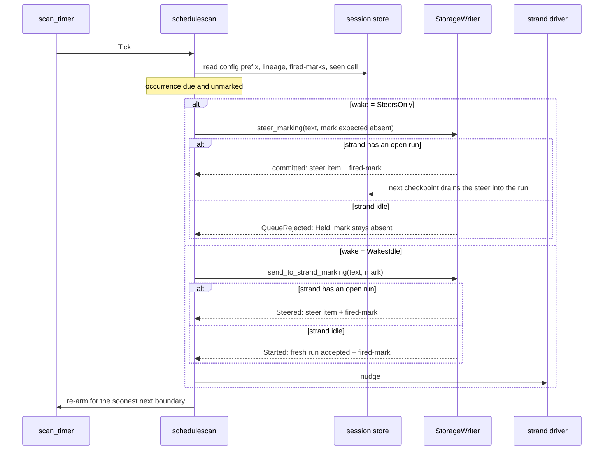

# Rules and scheduled heartbeats

Loom can put text into a model's context without anyone typing it. Two
features do this. A **triggered project rule** is a paragraph of standing
instruction that the operator writes in `loom.toml`; the harness injects it
into a strand the first time the model's own output contains one of the
rule's trigger strings. A **scheduled heartbeat** (a *schedule*) is a
paragraph injected on a clock instead: every N seconds, on a cron
expression, or once at an instant. Both exist so that an instruction which
matters only some of the time does not sit in the system prompt and cost
its tokens on every request.

Both features are built the same way. A session-scoped scanner process
reads the durable store, finds an injection that is due, and admits it
through the ordinary strand queues described in the
[orchestration plane](orchestration.md#strands-queues-and-doorbells). The
admission and a write-once *fired-mark* land in one transaction, which is
what keeps a crash from injecting the same text twice. Everything
lives in the `client` package, above the runtime, and uses only the
runtime's public session API: the rule and schedule stores are
configuration parsers, the scanners are supervised services, and the model's
door onto schedules is a tool in `tools/schedule` with its host half in
`client/scheduleseam`. [Inter-strand messaging](messaging.md) covers the
queue doors both scanners use; this page covers when the scanners use
them.

## Rules and schedules side by side

| | Triggered rule | Scheduled heartbeat |
|---|---|---|
| Written by | the operator, `[[rule]]` in `loom.toml` | the operator (`[[schedule]]`), or a model through `schedule_create` |
| Fires when | an assistant entry's visible text contains a trigger | an occurrence of its timing is due on the session clock |
| Fires how often | at most once per strand, for the life of the session | at most once per occurrence, until its expiry |
| Scanner is driven by | the StorageWriter's post-commit hints | its own re-armed timer |
| On an idle strand | holds until the strand's next run | holds, or (with `wake`) starts a fresh run |
| Durable state | `rule/fired/…`, `rule/cursor/…` | `schedule/fired/…`, `schedule/seen/…`, `schedule/config/…` |
| Scanner module | `client/rulescan` | `client/schedulescan` |

The deepest difference is the idle row. A rule may only steer a run that is
already open, because model output arrives constantly and a rule that could
start runs could keep a session busy forever, one fire at a time. A
schedule is time-driven and always expires, so it may be allowed to wake an
idle strand; whether it is allowed is the operator's decision (see
[the policy](#the-operators-policy)).

## Where the state lives

Rule text and operator schedules are never stored. They are parsed from
`loom.toml` at boot, and a restart is how a change to them takes effect.
What the store holds is the record of what has already happened, as cells
in the `fact.custom` register under two reserved prefixes:

| Key | Written | Meaning |
|---|---|---|
| `rule/fired/{strand}/{rule}` | once, with the injection | this rule has fired on this strand |
| `rule/cursor/{strand}` | lazily, every 64 judged entries | a checkpoint of how far the rule scanner has read |
| `schedule/config/{target}/{name}` | once, on a model's create; deleted on cancel | a model-created schedule exists |
| `schedule/seen/{target}/{name}` | once, on the scanner's first sight of a schedule | the epoch second its expiry clock started |
| `schedule/fired/{target}/{name}/{occurrence}` | once, with the injection | this occurrence has fired |

`runtime/api` reserves both prefixes (`rule_fact_prefix`,
`schedule_fact_prefix`), so the model-facing blackboard call `put_fact`
refuses them and `facts` hides them. This matters because a model that
could write a fired-mark could silence an operator's rule or heartbeat
before it ever fired, and one that could delete a mark could re-arm an
injection into a loop. A model reaches `schedule/config/…` only through
the tool seam, which is harness code.

A rule or schedule name may not contain `/`, `"` or a newline, because the
name is both a key segment and a quoted label inside the injected text.

## Triggered rules

A rule is `{name, triggers, body}`:

```toml
[[rule]]
name = "schema-gate"
triggers = ["migrations/", "ALTER TABLE"]
body = """
Before proposing a migration, run `make check-storage` and paste the
failing rows.
"""
```

`client/rules.parse` reads every `[[rule]]` table, in file order, and
refuses the whole configuration with a worded error on any unknown key,
empty field, duplicate name or oversized value. The server prints that
error and does not boot. The bounds are 64 rules, 32 triggers per rule, 64
characters per name, 256 per trigger and 8,192 per body; the first two
bound the per-entry matching cost, and the body bound keeps a rule cheaper
than the prompt line it replaces.

A trigger is a literal, case-sensitive substring, and any one trigger fires
the rule. There is no regular-expression syntax, because an
operator-supplied pattern evaluated against model output is an unbounded
computation whose input the model controls. Matching runs over an assistant
entry's visible text blocks, extracted by `events/search.entry_text`;
thinking blocks and tool-call arguments are out of scope. Assistant entries
that the conversation projection drops (errored, aborted or deferred
responses) are skipped, so a rule fires only on text the model will still
see. User prompts and tool results never fire a rule.

### The rule scanner

`client/rulescan` is one actor per session, started by `client/serve` only
when at least one rule is configured. Its mailbox type is
`runtime/writer.Event`: it is registered by name as a writer subscriber, so
the StorageWriter sends it a hint after every commit. The hint carries no
data. On each hint the scanner makes one pass over every strand in the
store (the keys of the `StrandLeaf` register) and reads its truth from the
store, not from the hint, so a dropped hint costs latency and nothing else.
Rules have no period: a strand whose branch has not moved costs one register
read per pass.

For each strand, the pass does this:

1. Skip the strand entirely if every rule has already fired on it, or if
   its hold was abandoned (below).
2. On the first visit this incarnation, load the durable cursor and the set
   of rules whose fired-marks are absent.
3. Skip the strand if its leaf has not moved and nothing is held.
4. Fetch the message entries on the strand's current branch above the
   cursor, oldest first, at most 256 per pass (`default_scan_limit`).
5. For each still-pending rule that one of those entries trips, attempt a
   fire.
6. Advance the in-memory cursor to the newest entry judged, unless a fire
   was held; write the durable cursor checkpoint once the in-memory one has
   run 64 entries ahead (`default_checkpoint_every`).

All reads go straight to the session store, not through the writer's
mailbox, so a slow pass never delays a settlement. The cursor is a
checkpoint rather than a record: correctness rests on the fired-marks, and a
restart that resumes behind the cursor re-judges a bounded overhang that the
marks make harmless. One consequence is that a rule added to a running
workspace starts its cursor at zero and can fire on old text the model can
still see.

### A rule fire, and the idle hold

A fire is one call to `api.steer_marking`: the fenced injection is enqueued
as a steer item on the strand's open run, and `rule/fired/{strand}/{rule}`
is written in the same transaction with the expectation that it is absent.
The outcome is classified four ways:

- **Fired.** Both landed. The steer drains into the conversation at the
  run's next checkpoint.
- **AlreadyFired.** The mark was already there (`FactConflict`): an earlier
  incarnation did this. The rule is spent either way.
- **Held.** The strand has no open run to steer (`QueueRejected`), or the
  runtime is unavailable.
- **Failed.** Any other error; treated like a hold and logged as
  `rule.injection_refused`.

A held rule is neither dropped nor turned into a new run. The scanner
records the hold by *not advancing the cursor*, so the matching entry is
still above it on the next pass. The strand's next run begins by committing
the user's message, which moves the leaf, which produces a hint, and by then
there is an open run to steer. Starting a run instead would let a style note
wake a session nobody is using; dropping the fire would spend the rule with
no record.

A hold on a subagent that will never run again would otherwise be retried
forever, one bounded re-scan per commit. So on the pass where a hold
*begins*, the scanner reads the strand's `runtime/lineage` cell once. If
the cell decodes and says `reaped`, the hold becomes **Abandoned**: the
strand leaves every later pass, its rules stay honestly unfired, and
`rule.hold_abandoned` is logged with the rule names. Every doubtful case
(no lineage cell, a cell that will not decode) stays an ordinary hold. A
terminal `last_result` alone is not treated as dead, because a live parent
can still send an idle child fresh work.

## Scheduled heartbeats

A schedule is a `client/schedule.Schedule`: a `name`, a `target` strand
(`"main"` by default), an `owner`, a timing, a `wake` setting and a
`body`. The operator writes one as a table:

```toml
[[schedule]]
name = "weekday-standup"
cron = "0 9 * * 1-5"
utc_offset = "+02:00"
body = "Summarise what is in flight, as a standup note."
```

The same value can also come from a model through `schedule_create`, stored
as a `schedule/config/…` cell. Both kinds are the same type with the same
bounds: `client/schedule.parse` builds the operator's, and
`client/schedule.build` builds the model's through the same predicates and
constants. The two paths word their refusals differently (one names a TOML
key, the other a tool argument) and cannot disagree about what is allowed.

### Three timings

A schedule has exactly one timing:

- **`Interval(seconds, expiry)`**, written `every = "300s"`. The interval is
  at least 60 seconds (`min_interval_s`) and at most 604,800 (seven days,
  `max_interval_s`). Occurrences sit on a grid aligned to the Unix epoch:
  the occurrence at time `now_s` is `floor(now_s / seconds) * seconds`.
- **`Cron(expression, offset_s, expiry)`**, written `cron = "…"` with an
  optional `utc_offset`.
- **`OneShot(at)`**, written `at = "2026-09-01T09:00:00Z"`: one RFC3339
  instant, stored as epoch seconds.

The two recurring timings always carry an `Expiry` of two bounds,
`max_fires` and `expires_after_s`. Both are always active, both default to
their ceilings (1,000 fires and 604,800 seconds), and whichever is reached
first ends the schedule. A configured value may only narrow a bound. The
reason is cost: 1,000 fires is also the most fired-mark rows one schedule
can ever leave, and the bound on a schedule's life is what makes waking an
idle strand safe to offer at all. A one-shot has no expiry, because it has
one occurrence.

The age bound counts from the moment a running scanner first observed the
schedule, not from its first fire. The scanner records that instant once in
`schedule/seen/{target}/{name}`. Counting from the first fire would give a
schedule that never manages to fire (a steer-only heartbeat on a strand
nobody opens a run on) no clock at all, and it would tick for the life of
the session.

### Cron expressions and time zones

`client/cron` implements standard five-field cron and nothing else:

```text
minute hour day-of-month month day-of-week
  0-59   0-23      1-31   1-12         0-7
```

Each field is `*`, a value, a range `a-b`, a step `*/n` or `a-b/n`, or a
comma-separated list of those. Day-of-week `0` and `7` both mean Sunday.
Seconds fields, `@yearly`-style macros, month and day names, and the
extensions `L`, `W`, `?` and `#` are refused by name, so an operator who
writes `L` meaning "last day of the month" gets an error instead of a
different schedule. Expressions are at most 64 characters.

One rule in cron surprises most readers and is kept deliberately: when both
day-of-month and day-of-week are restricted (neither is the single
character `*`), a date matches if *either* matches. `0 9 1 * 1` fires on the
first of every month and on every Monday. This is how vixie cron reads the
syntax, and matching it means an expression copied from elsewhere keeps its
meaning.

Every instant in the scheduling code is a UTC epoch second, and Loom
carries no timezone database. A cron schedule may name a **fixed offset**
from UTC, `utc_offset = "+05:30"`, between -14:00 and +14:00. The offset
changes how the expression's fields are read: an occurrence at UTC second
`t` matches when `cron.matches(expression, at_s: t + offset_s)`. A fixed
offset is not a zone, so a schedule written `+02:00` for a Berlin summer
fires an hour off Berlin's wall clock all winter. The tool description says
so, and every rendering names the offset (`cron "0 9 * * 1-5" UTC+02:00`).
Occurrence ids, and therefore fired-mark keys,
stay in UTC. Changing a schedule's offset renames no durable row and cannot
make its history unreadable.

`utc_offset` is refused beside `every`, whose grid has no fields to read,
and beside `at`, whose RFC3339 text already carries its own offset. The
same `parse_utc_offset` serves the TOML key and both model-facing doors.

The model has no clock: Loom's system prompt carries neither the date nor
the time. So the model's door also accepts `in_seconds` (1 to 604,800),
which the seam turns into an absolute `OneShot` instant using the session's
injected clock.

### When an occurrence is due

The scanner asks each schedule the same question, "which occurrence is due
now, and has it fired", and the two recurring timings answer it differently
on purpose:

- **Interval.** The due occurrence is the slot `now_s` falls in, even if
  that slot began before the schedule existed. A grid slot is not a time
  anybody chose, so a new schedule fires at once instead of waiting up to a
  full period.
- **Cron.** The due occurrence is the last match at or before `now_s`, and
  only if that match is at or after the schedule's observation instant. A
  cron occurrence is a time somebody asked for, so a `0 9 * * *` schedule
  created at 15:00 does not fire this morning's 09:00; it waits for
  tomorrow's.
- **One-shot.** Due once `now_s >= at`, whether the instant passed while
  the server was down or was already past when the schedule was written.

Only the current occurrence is ever considered. A scanner that was down
for a week fires one occurrence when it comes back, never the backlog. That
fire is annotated **late** in the injected text when a window closed with
nothing in it: for an interval, when the schedule has fired before and the
immediately preceding slot has no mark; for cron, when the preceding match
was owed (at or after the observation instant) and has no mark; for a
one-shot, when the fire lands five seconds or more after `at`.

### The schedule scanner

`client/schedulescan` is a `weft/state_machine` with one state,
`Watching`, and one named timeout, `scan_timer`. `client/serve` starts it
when the operator configured any schedule or the policy lets the model
create them. The timeout is armed through
`weft/timer.Injected(after: runtime.effects.timers.after)`, the session's
own timer seam, so a simulated session runs its heartbeats on logical time.
The first tick is armed with a zero delay on entry to `Watching`, so a
schedule that became due while the server was down fires promptly at boot.

Each tick (`Tick` from the timer, or `Rescan` from `poke`) does one full
scan:

1. Read the clock, then build the schedule list: the operator's list, fixed
   at boot, plus every model-created schedule decoded from the
   `schedule/config/` prefix. A config cell that does not decode is
   skipped. If the prefix read fails, the tick uses the operator's list
   alone rather than treating the failure as "the model cancelled
   everything".
2. For each schedule, end it for this tick if its target has stopped (see
   [Settled targets](#settled-targets)).
3. Read its fired-marks (one prefix scan, or one point read for a
   one-shot) and its observation instant, claiming the instant if this is
   the first sight.
4. If a recurring schedule's expiry has been reached, it is expired.
   Otherwise fire the due occurrence if it is owed and unmarked.
5. Compute each still-active schedule's next wake: the next interval
   boundary, the next cron match, or a one-shot's remaining wait, each
   floored at one second.
6. Re-arm `scan_timer` for the smallest of those delays.

The machine keeps nothing between ticks except the static operator list.
Due or not due, fired or not fired, and expired or not are all recomputed
from the store every time, so a restart loses nothing.

Re-arming has a few edge cases. With no active schedule, the timer is
cancelled and the machine goes quiet, unless the model's door is open; then
it re-arms at 60 seconds (`min_interval_s`) so that a schedule the model
creates is found even if the `poke` announcing it was lost. `poke` is sent
after every create, cancel and run-end reap; arming the one timer name
supersedes the pending arming, so pokes never multiply timer chains. A held
or failed one-shot retries after 60 seconds rather than at a tight cadence.
Every delay is clamped to 2^32-1 ms (about 49.7 days), because a larger
BEAM timeout raises inside the unlinked timer process and would silently end
every schedule. A cron expression with no match within 3,000 days (such as
`0 0 30 2 *`) is expired and logged as `schedule.cron_never_matches`.

The scanner's liveness rests on that one timer. `effects.real_timers` does
not drop wakes, but a host that supplies a lossy `Timers` could stop every
schedule until the scanner restarts.

### The firing path into a session

The injected message is a user-role `UserMessage`, because that is the only
shape provider APIs offer for harness-supplied context. Its text begins
`[loom] scheduled heartbeat "{name}"` (with ` (late)` when late), then says
whose text it is, then carries the body inside a named begin/end fence.
There are three attributions, chosen by `schedule.origin_of`: standing
operator configuration; a heartbeat *you* scheduled, carrying no authority
beyond what the model already had; or a heartbeat scheduled by the named
parent strand, worth as much as a steer from that strand. Rules use the
same framing with a `[loom] triggered project rule` header. Each says it is
not a turn from the user and expects no reply.

Which admission door a fire uses depends on `wake`:



On a **busy** strand both settings behave the same: the heartbeat joins the
open run's steer queue and reaches the model at the run's next checkpoint,
before its next model request. It does not interrupt a tool call in flight
and does not wait for the run to finish. `steer_marking` rings no doorbell;
the strand's poll tick finds the item. A heartbeat never enters the
next-run queue, so it never waits behind a queued prompt for a later run.

On an **idle** strand, `SteersOnly` holds: the mark stays absent, and the
occurrence is attempted again on any tick that runs while it is still the
current one. For a recurring schedule the scanner's own next wake is the
next boundary, so a held occurrence is normally replaced by the next one,
which is marked late if the schedule has fired before. `WakesIdle` goes through
`send_to_strand_marking`, which tries the steer first and, on
`NoActiveRun`, accepts a fresh run whose prompt is the heartbeat, with the
mark in the acceptance transaction. If a run opens between those two steps,
the accept is refused with `StrandBusy` and the steer is retried, up to four
attempts in all.

### Settled targets

Before any timing arithmetic, the scanner checks whether a schedule's target
has stopped for good. Only a subagent can have stopped: `main` and other
root strands are idle between runs, not finished. A subagent exists to run
one brief, so it counts as finished when its lineage cell says `reaped` or
its brief's result has settled. A finished target ends the schedule for that
tick, with no fire and no re-arm, whoever configured it. The check **fails
closed**: a `sub:` target with no lineage cell, or one whose cell will not
decode, counts as finished. That is the opposite of the rule scanner's
direction, because a held rule costs a re-scan while a fired schedule may
open a run.

`client/scheduleseam` also wraps the run-end hook: when a run ends, it finds
every strand whose own brief that run was and deletes those strands' whole
scheduling footprint (`schedule.strand_prefixes`). This frees the ceiling
slots that a finished child's schedules would otherwise hold. The work runs
on a spawned, unlinked process so the driver's loop never waits on a store
read. Failed deletes are dropped; the settled-target check still stops any
fire.

## The at-most-once guarantee

For rules, the claim is: a rule's text is admitted to a strand at most once
per session. For schedules: each occurrence `{target, name, occurrence}` is
admitted at most once. Neither feature promises at-least-once.

The ordering that makes the claim hold is:

1. The scanner judges from durable state only: fired-marks read from the
   store, never from process memory.
2. The injection and its fired-mark commit in **one transaction**, with the
   mark expected absent (`runtime/api.Mark` on `steer_marking`,
   `send_to_strand_marking`, or the fresh-run acceptance).
3. A `FactConflict` on that expectation is classified `AlreadyFired`, never
   retried.

Marking first and queueing second would lose the injection to a crash
between the two; queueing first would inject twice after one. One
transaction removes the window rather than narrowing it. Walking through the
failures:

- **Crash before the commit.** Nothing durable changed. The restarted
  scanner re-derives the same decision; for a schedule the first tick runs
  immediately, and it fires the occurrence if it is still current.
- **Crash after the commit.** The mark exists. The next read finds it and
  skips the occurrence. If that read and the commit race, the second
  attempt's expectation fails with `FactConflict`.
- **Two incarnations at once** (an old scanner still finishing during a
  restart). Both may decide to fire; only one expectation can succeed.
- **A store read that fails.** The point read treats the failure as "no
  mark" and attempts the fire; the commit's own expectation still refuses a
  duplicate. A failed prefix read returns an error and the tick retries
  later rather than concluding nothing has fired.

The observation instant uses the same technique: the scanner claims
`schedule/seen/…` with `put_reserved_fact_expecting(expected: None)`, and a
scanner that loses the race reads back the winner's value, so every
incarnation measures a schedule's age from one instant.

Some fires are lost by design, and each is recorded where it happens:

- **Missed windows.** Occurrences that passed while the server was down,
  beyond the one catch-up fire.
- **Held occurrences.** A steer-only occurrence on an idle strand that is
  replaced by the next one.
- **The abort corner.** A steered fire becomes conversation only when a
  checkpoint drains it. If an abort lands between the fire and that
  checkpoint, the queued item is discarded while the mark stands, so the
  rule or occurrence is spent on text the model never saw.
  `docs/spec-gaps.md` records this for rules (item 8 of the
  triggered-rules section), and the same steer path gives schedules the
  same corner. Admission cannot see an abort coming, and a mark that could
  be un-written would reopen the loop the write-once shape closes.

## Two doors: the model's and the operator's

### The operator's policy

A `[schedules]` table in `loom.toml` sets `client/schedule.Policy` with one
key, `model_created`:

| Value | Model tools registered | Model schedules may wake an idle strand |
|---|---|---|
| `"off"` | no | n/a |
| `"steer"` (the default) | yes | no |
| `"wake"` | yes | yes, except onto a subagent |

The default is `steer` because expiry is per schedule and not per session. A
model woken by its own heartbeat could create the next one before the
current one expires, and keep a session alive for as long as the server
runs. Waking is therefore an operator's opt-in. Under `steer`, a request for
`wake: true` is not refused; the seam downgrades it (`schedule.wake_under`)
and the result says the schedule will only steer, so the model has no reason
to retry.

### The model's door

`tools/schedule` defines three tools, `schedule_create`, `schedule_list` and
`schedule_cancel`, exported as one list so a host cannot register the
writer without the reader. The `tools` package may not reach a session, so
each tool is a closure over a seam that `client/scheduleseam` fills in. The
same seam also serves the `schedule.*` code-mode capabilities through
`scheduleseam.Door`, keyed on the calling strand, so a program and a tool
call reach one implementation (see [code mode](code-mode.md)).

`schedule_create` takes a `name`, a `body`, exactly one of `every_seconds`,
`cron` (with an optional `utc_offset`), `at` or `in_seconds`, and optionally
`max_fires`, `expires_after_s`, `wake` and `target`. The seam then:

1. Resolves `target` (default: the caller) and requires it to be the caller
   or a strand the caller spawned, asked of the lineage ledger through
   `client/agency.owns`. The shape of a strand name is not evidence, and
   every ledger failure is a refusal.
2. Parses the timing, filling in the default expiry for a recurring one.
3. Caps `wake` by the policy, then forces `SteersOnly` onto any subagent
   target: a subagent has one run, and a fresh one after its brief ended
   would extend its life outside the spawn budget its parent was held to.
4. Builds the schedule with `schedule.build`, owned by the caller
   (`StrandOwned`).
5. Checks the ceiling of 16 live model-created schedules per session
   (`max_model_schedules`, counted separately from the operator's 16), and
   that no operator or model schedule already has this `{target, name}`.
6. Claims `schedule/config/{target}/{name}` with an expect-absent write; a
   `FactConflict` becomes `NameTaken`.
7. Pokes the scanner and returns what was created, including the `wake` it
   actually got.

The `{target, name}` check against operator schedules has to happen here.
Both stores feed one scanner, which derives fired-marks from
`{target, name}` alone, so a model schedule sharing an operator's pair would
share its marks and suppress its fires. The ceiling count, by contrast, is
not atomic: concurrent code-mode creates that read the same count can admit
up to one batch past it. The per-schedule expiry bounds what that costs.

`schedule_list` and `schedule_cancel` are keyed on the **owner**. A strand
lists and cancels the schedules it created, wherever they fire, and a parent
can cancel a heartbeat it set on a child after the child has settled. A
child does not see its parent's schedules on it. Cancelling a name the
caller does not own answers `NotFound`, the same as a name that does not
exist, so the answer reveals nothing about other strands.

The model cannot:

- write, read or delete anything under `rule/` or `schedule/` directly;
- create, see or change a rule at all;
- list or cancel an operator schedule, or another strand's;
- schedule onto a strand that is not itself or a descendant;
- wake an idle strand unless the policy is `wake`, or wake a subagent under
  any policy;
- exceed the ceiling, the interval floor, or the expiry ceilings;
- replace an existing schedule by reusing its name; it must cancel first.

`schedule_create` and `schedule_cancel` are `replay: Never` and
`execution_mode: Exclusive`, so a replayed call cannot act twice and two
writers never share a tool batch. `schedule_list` is `Safe`.

### The operator's door

The operator configures rules, schedules and the policy in `loom.toml`, and
changes to any of them take effect on restart. For a running session,
`client/scheduleadmin` builds an `Admin` over the same `scheduleseam.Wiring`
as the model's door. `client/gateway` serves it as the `schedules` and
`schedule_cancel` protocol commands (`protocol-change/013`), and the TUI
exposes them as `/schedules` and `/unschedule <name> [target]`.

The listing shows everything: the operator's tables first (owner
`"operator"`), then every live model-created schedule with its owning
strand, its timing rendered by `scheduleseam.describe_timing`, and its fire
count. Cancellation reaches only model-created schedules. Naming an
operator table is refused with a conflict that points at the configuration
file, because the table has no durable cell to delete and the file is the
record. The gateway authenticates the operator; `scheduleadmin` makes no
ownership check.

### Retirement

Both doors cancel through `scheduleseam.retire`, which deletes a schedule's
whole footprint in a fixed order: its fired-marks, then its seen cell, then
its config cell last. All three go because a cancelled name can be reused,
and a new schedule under the old `{target, name}` would otherwise inherit
the old marks and age. The config cell goes last because the three
deletions are separate commits. A fault partway through leaves a live
schedule with a reset count and a caller told the cancel failed, which a
retry finishes. Deleting the config cell first could report failure for a
schedule that was in fact gone and leave its marks for the next schedule of
that name.

## Where the code lives

| Path | What it owns |
|---|---|
| `client/rules.gleam` | The `[[rule]]` parser and bounds, `scannable_text` and `fires_on`, the `rule/` key shapes, and the fenced injection text. |
| `client/rulescan.gleam` | The writer-subscribed rule scanner: the per-strand pass, the cursor checkpoint, the marked fire, the idle hold and the abandoned hold. |
| `client/schedule.gleam` | The `Schedule` value and its three timings; `parse`, `build`, `encode`/`decode`; `Policy`; the `schedule/` key shapes; the occurrence, lateness and expiry arithmetic; the injection text. Pure. |
| `client/cron.gleam` | The five-field cron grammar and the bounded calendar search. Pure; no clock. |
| `client/schedulescan.gleam` | The timer-driven scanner: the per-tick scan, the observation-instant claim, the settled-target check, the marked fire and the re-arm. |
| `client/scheduleseam.gleam` | The host side of the model's door: target, policy, ceiling and name checks; the config-cell claim; `retire`; the run-end reaper. |
| `client/scheduleadmin.gleam` | The operator's door: list every schedule, cancel a model-created one. |
| `tools/schedule.gleam` | The `schedule_create`, `schedule_list` and `schedule_cancel` tools: argument schema, descriptions and refusal wording. |
| `runtime/api.gleam` | `steer_marking`, `send_to_strand_marking`, `Mark`, the reserved-fact calls, and the `rule/` and `schedule/` prefixes. |
| `client/serve.gleam` | Parsing `loom.toml`, starting each scanner only when it has work, and wiring both schedule doors. |

Each path is relative to its package's source root:
`client/rules.gleam` is `packages/client/src/client/rules.gleam`. The design
rulings, including why the model's door was first cut and then reopened
with a `steer` default, are in `docs/design-notes/scheduled-heartbeats.md`.
The corners recorded as accepted gaps are in `docs/spec-gaps.md` under the
triggered-rules section.
