# The client plane

The client plane is how a person reaches a running session. A session is a
supervision tree inside one BEAM node: a writer holding the session file's
lease, one driver actor per strand, and a broker with a pool of jailed helpers
behind it. The person sits at a terminal outside that node and wants to watch a
run, read what the model wrote, and redirect it halfway through. This plane
lets them do that without becoming part of the tree.

It has three main pieces. `loomd` is the daemon: one per private state root, it
keeps a catalogue of sessions and admits a session assembly for each session it
opens. The gateway is each session's client-facing admission point; it
authenticates connections, admits commands through the runtime described in
[orchestration](orchestration.md), and serves transcript transfers. `loom` is
the native Gleam terminal client. The conversation itself lives in the
durability plane ([durability](durability.md)), and the effect plane
([effects](effects.md)) enforces the sandbox policy an approval widens.

The sections up to "Release updates" describe the current default daemon. The
sections titled "Historical" preserve the earlier single-session
implementation at `f019322`, which still explains much of the gateway's
internal design.

## Current default: one daemon, multiple sessions

The current implementation runs one `loomd` per private state root, shared
across workspaces. At startup the daemon opens its catalogue and its stable
owner credential, and it restores session metadata without opening every
conversation. An explicit create or open request admits an independent session
assembly, which owns one conversation database, runtime, gateway, broker, and
helper pool. Sessions in the same persisted domain share history and
maintenance owners. [Sessions](sessions.md) gives the ownership and shutdown
rules, and [multiplayer](multiplayer.md) gives identity and sharing policy.
Both describe the unreleased implementation, not the older shipped baseline in
the historical sections. [The daemon process](daemon.md) describes `loomd`
itself: startup, the ownership tree, admission and shutdown.

```sh
# Discover the shared daemon and show this workspace's saved sessions.
loom --workspace /work/project

# Explicitly open a saved canonical session ID.
loom --workspace /work/project --session SESSION_ID

# Start the daemon without choosing or opening a conversation.
loomd --state-dir /private/loom --bind 127.0.0.1:0 --capacity 8
```

`/sessions` lists the catalogue records the caller is authorized to see.
Listing never starts a session's runtime. Selecting a record opens it through
control and then prepares a candidate attachment; the terminal keeps its
previous transcript and connection until the candidate's initial cut (its
first snapshot of session state) validates. The old per-session daemon flags
and the `/v1/ws` endpoint are not compatibility modes of the default listener.

### Discovery, credentials, and safe startup

The state root defaults to `~/.loom`; `--state-dir` selects another root. It
holds these files:

| Path under the state root | Role |
|---|---|
| `daemon.endpoint` | The daemon's PID, birth identity, endpoint, and epoch. |
| `owner.token` | The stable owner bearer. The catalogue stores only its digest. |
| `launch.lock` | Serializes discovery and paused-child publication. |
| `daemon.lock` | Protects the daemon's retained resource lifetime. |
| `sessions/` | Conversation files. Their runtime state is separate from discovery. |

`tui/bootstrap.resolve_daemon` delegates to `tui/daemon/bootstrap`, which
starts or reuses the daemon in this order:

1. Acquire the launch lock and check the recorded native identity.
2. Start a paused child, but only when replacement is permitted.
3. Record the child's PID+birth before releasing it to execute.
4. Release the launch lock so the child can claim its reservation.
5. Treat the daemon as ready only after an authenticated v2 control exchange
   with the recorded epoch.

The default listener exposes no `/healthz` route. A successful HTTP connection
would not prove session or daemon readiness anyway.

Replacement is conservative because a failed probe never proves that the
previous daemon or its native children retired. Automatic replacement is
blocked by a PID+birth pair that is still live, by an error while observing
identity, or by an existing catalogue with no endpoint record. The endpoint
record survives normal root shutdown until the VM departs. Once the launcher
has released a child to execute, closing the launcher's handle does not
guarantee that the daemon died. Executable, helper, and configuration discovery
comes from trusted launcher choices, never from files the workspace selects.

For a local New session, the terminal resolves configuration itself, even when
the daemon is already live. An explicit `--config` path resolves against the
terminal's own working directory. With no flag, the terminal uses
`<state-root>/loom.toml` when present, normally `~/.loom/loom.toml`. An absent
file leaves the configuration reference empty, and the daemon keeps its runtime
defaults. A lookup failure is reported before the terminal retains a creation
key, so it cannot strand a local retry.

### Skill discovery and activation

Each session assembly captures the daemon user's Markdown skill libraries
through `host/skill`, and the gateway and the model tool share that capture. A
remote terminal fetches only command metadata, through the paged `skills` read,
and never substitutes its own local library. A new attachment clears the old
completion rows.

The model sees skill names and descriptions in `load_skill` and receives a
skill's full document only after selecting it. An explicit slash invocation
expands at the gateway before prompt or steer admission, preserving the
original author and the other content blocks. Neither path executes embedded
shell text or changes tool permissions. See [skills](../skills.md) and
[protocol 027](../../protocol-change/027-markdown-skills.md).
[Prompt assembly](prompt.md#skills) describes how skill names reach the
model's request.

### The authenticated v2 boundary

The loopback listener serves two routes: `/v2/control` handles catalogue and
lifecycle requests, and `/v2/sessions/<session-id>/ws` carries conversation
commands and credited transfers. Both use text WebSocket frames carrying `v: 2`
JSON envelopes. The conversation vocabulary keeps commands such as `prompt`,
`steer`, and `fork`, but the v1 envelopes and full-snapshot exchange in the
historical sections are not the current wire contract.
[Protocol 015](../../protocol-change/015-daemon-control-and-session-attachments.md)
defines that contract and its accepted transfer amendments, and
[`docs/client-protocol.md`](../client-protocol.md) is the client-facing
reference that spells out every body, error code and limit under it.

Each upgrade hashes the bearer and authenticates its current principal through
the manager. The session route resolves only an incarnation of the session that
is already resident; it never implicitly opens a saved session. Owner,
Operator, and Observer are distinct authorities. A role change, credential
revocation, or membership revocation closes an attachment at its next
authorization check, but revocation does not cancel work admitted before it.

A session socket binds its original gateway and the immutable daemon epoch,
session ID, incarnation, principal, role, and connection identity. It transfers
its root admission permit before parsing any message. Requests use
stop-and-wait credit: one bounded request receives one bounded reply. A timeout
closes the socket instead of retrying a mutation whose outcome is uncertain.
Metadata and entry bytes are fragmented. The initial recent window is
explicitly incomplete, and older history loads on request. Reconciliation
covers metadata-only changes as well as new entries.

Prompts, steers, follow-ups, configuration changes, and escalation decisions
carry authenticated origins. (An escalation is a request for a human to approve
a policy widening after the broker refused a tool call.) Approve and deny both
compare the exact current escalation sequence. The TUI renders presence,
authors, shared configuration, and exact approval outcomes. Its recording
format distinguishes provisional attachment attempts from adopted connections,
so replay cannot mistake a failed switch for a visible session change.
Automatic reconnect remains separate from explicit session replacement.

Control recovery for an explicit list, open, or create runs inside that
action's managed worker, not the frame loop. A live control owner is borrowed.
A replacement authenticates through the retained route and is closed with the
worker. Cancellation also retires an unfinished handshake. Recovery never
retries a mutation whose admission is unknown.

### Submission during reconciliation

Periodic reconciliation must not make an ordinary Enter wait for a gap between
snapshots. After the first validated cut, the channel can therefore retain one
unsent mutation behind its current capture. The encoded intent stays bound to
the original attachment and to the approval or configuration selection. A
second mutation, initial synchronization, or a closed channel still prevents
admission.

While the command waits, the composer keeps its text, attachments, and mode
visible but locked. Escape cancels the command locally and keeps the draft; it
sends no abort. When a valid capture completes, the channel refreshes
authority and then sends the command exactly once. Only the send allocates the
command's wire request ID and clears a composer-origin draft. An overlay action
never clears unrelated composer text.

Capture failure, revocation, or a target change cancels the unsent intent.
Switching sessions never moves it to the replacement connection, even if the
replacement fails. Commands already sent are handled differently: if the
connection is replaced before a reply arrives, the terminal keeps an
unknown-outcome notice with the original session and request ID and never
retries. Replay applies the same transition to a recorded connection closure.
[ADR-010](../adr/010-retain-one-unsent-terminal-command.md) records the
decision and the live failure that motivated it.

### Steering, queues, and observation views

Human steering means prompt preemption: the gateway queues the steer ahead of
ordinary turns, then stops the observed operation. Escape stops current work
and preserves the gateway queues. The cut's `pending_inputs` is the shared
queue view, and input text is never used as an identity. The queues keep their
transient lifetime from protocol 018.
[Protocol 022](../../protocol-change/022-human-input-priority.md) records
priority, bounds, and operation-specific cancellation.

Live provider text is scoped to one request generation within an operation. A
terminal marker retires only its own request, and a stale cut cannot erase a
newer pushed answer. Compact tool groups preserve call identity.
[Protocol 021](../../protocol-change/021-request-scoped-streams.md) records
request-scoped streams.

`/notes` reads current values through `client/notes_view` and validates them in
`tui/notes_view`, independently of the conversation transfer. The panel names
the capture and last-write revisions and labels excerpts. The agent
inspector's Notes tab follows its selected strand independently of the
composer, with stable note-key selection and rejection of stale replies.

The inspector's Messages tab projects `agent_send` invocations after each
sender's accepted operation prompt. Its bounded cache retains verified sends
after operations end. Tool acceptance is visible evidence of delivery, not a
read receipt. The notes and messages views reuse existing captures and notes
queries and add no wire authority; see
[protocol 023](../../protocol-change/023-current-client-observations.md).

Bare `/queue` fetches the complete held input before editing and saves by item
ID and revision. The gateway checks the original principal and preserves queue
position, priority, author, timestamp, and images. A conflict keeps the local
draft. An uncertain save requires an explicit read in the same session, epoch,
and incarnation.
[Protocol 024](../../protocol-change/024-edit-queued-input.md) records the
editing boundary.

`/diff` requests a bounded Git observation of the attached workspace and shows
it with a changed-file navigator in the existing wide and narrow layouts. Git
runs through the session broker under the final policy demoted to reads. A
pending reply releases the conversation lane while a bounded weft run finishes
(weft is Loom's library for process machinery), and the final push names the
original request in its body. Refresh is explicit, and old boards stay
labelled stale after a failure. Captured edits remain as a labelled fallback.
[Protocol 025](../../protocol-change/025-worktree-observation.md) records
authority, limits, and the difference between a filesystem observation and an
atomic snapshot. [The diff view](sessions.md#the-diff-view) lists the Git
commands one capture runs and the bounds on each.

The completion card and `/summary` use captured operation boundaries to
attribute edits, paired tool results, and actual command exit codes. Where
start or ancestry evidence is missing, the result stays unavailable or partial.
The live-job roster is a separate, timestamped query of the existing jobs
actor, requested on completion or explicit inspection and shown with current
queue counts. Ordinary transcript captures do not enumerate historical jobs.
[Protocol 026](../../protocol-change/026-live-jobs-observation.md) records this
bounded read.

The authoritative composition is
[`client/daemon/main`](../../packages/client/src/client/daemon/main.gleam),
[`client/daemon/server`](../../packages/client/src/client/daemon/server.gleam),
[`client/daemon/session_socket`](../../packages/client/src/client/daemon/session_socket.gleam),
and [`tui/daemon/bootstrap`](../../packages/tui/src/tui/daemon/bootstrap.gleam).
The frozen wire amendment is [protocol 015](../../protocol-change/015-daemon-control-and-session-attachments.md).

## Native agent workspace

The terminal's `agent_view` projection combines one captured strand and
operation view with bounded excerpts of the task and the designated assistant.
It never infers success from an absent phase, and it never infers a failed
operation from a single tool failure. Exact pending approvals are scoped to the
captured strand and operation; opening one delegates to the existing
`approval_panel` with no decision selected. `agent_activity` adds the current
`agent_wait` dependencies and a bounded recent-tool history, starting from the
same operation's accepted-prompt boundary. A question with no separate runtime
fact stays assistant text; the client does not infer a pending question from
prose.

`agents.Inspector` stores its selection by strand ID, independently of the
active recipient. The composer stays visible below the inspector. Tab enters
ordinary editing without changing either identity, and Escape returns keyboard
ownership to the roster.

Explicitly opening a transcript moves the editor and reader to that strand's
`(session, strand)` workspace. A snapshot refresh cannot redirect a missing
recipient. Each saved reading endpoint carries the anchors used to relocate it
after a width change, and retired reading windows are released without
evicting unsent drafts. Pending advisor observations stay transient and are
labelled separately from durable delivered advice.

Ordinary conversation uses a heading and gutter, with horizontal input rules.
Compact mode replaces successful code source with an activity and result
summary. Unresolved source shows six lines, diagnostics stay multiline, and
Ctrl+G keeps the full source, results, and accounting. The Studio rail keeps
Advisor distinct from worker tasks and labels Git observations as
observations. Scrollback controls occupy the existing reading heading rather
than changing the composer height.

Palette adaptation is pure and runs before a completed frame is cached. Light
and ANSI terminals get the same content, links, and wide-character cells, and
`NO_COLOR` keeps textual statuses and focus. The
[implementation review](../design-notes/tui-agent-workspace.md) covers
interaction keys, native captures, evidence boundaries, and validation limits.

## Current context observation

`client/context_view` captures a strand's configuration and leaf together, then
reads the strand's immutable branch through the latest compaction. It shares
the runtime projection and usage baseline, while estimating the pinned system
prompt, active tool definitions, and projected messages independently. The
gateway runs this ordinary read in its existing bounded pool of observation
workers. The read never replays hooks or calls a provider. The terminal's
`/context` inspector and its persistent percentage consume this board, not
retained scrollback or cumulative billing.
[Protocol 030](../../protocol-change/030-context-observation.md) owns request
correlation, byte bounds, and the estimate semantics.

## Installing an extension

`loom ext` is `loomd`'s first subcommand. It is an operator surface, not a
model one: four verbs (`install`, `list`, `remove`, `verify`), no daemon, and
no hot install. The session server reads the install records at boot and does
not re-read them while it runs. That is the same restart-to-change posture
`client/catalog` takes toward `loom.toml`, with the one difference the
extension ruling names: here the approval is *recorded* rather than implied by
an edit.

Every failure names the layer it came from. The pipeline resolves the source,
fetches it (or copies a local directory), extracts it, prunes it to the
extension's own tree, decodes the manifest, vets the package, compiles it, and
writes the record. Its failures fall into six layers: fetch, extract,
manifest, vetting, compile, and record. The layer name matters because an
extension is somebody else's repository, and the person reading the refusal is
usually not the person who can fix it. "vetting: src/w/nif.gleam: an
`@external` is not permitted" can be forwarded to the author; "install failed"
cannot.

The installer guarantees three properties.

**The record is written last, and the tree is renamed into place after it.**
All work happens under `<root>/.staging/<random>/`, so a directory under
`~/.loom/extensions` is either a complete install or absent, and a
half-installed extension is never discoverable. Every failure removes its
staging directory, including failures after a build has written megabytes into
it. A name already taken is refused rather than overwritten. Replacing an
install is remove-then-install, so a failed reinstall never costs anyone a
working extension.

**The install is content-addressed from the moment it is recorded.** The
record carries the digest of the *installed* tree (what survives the prune,
not what the archive carried), the manifest hash, the allowlist and net policy
the source was vetted against, and the resolved revision.
`client/extension/installed` re-derives each of them from disk on every read
and refuses the extension when any disagrees. One edited byte under `src/`
therefore refuses the extension until it is reinstalled, whatever the remote
did afterwards. The allowlist is *stored* rather than recomputed for the same
reason: recomputing it would make an operator's approval silently follow the
harness's current seam, while storing it turns a widened seam into a question.

**The compile is the code-mode build, not a second build.**
`serve.start_build_plane` is the boot's own helper ladder, helper pool,
broker, toolchain discovery, and seed verification, factored out so the
installer calls it instead of reimplementing it. Two implementations would
give two answers to "may this build run", and the hermetic build exists so
that there is one. The extension's own `gleam.toml` never reaches the
compiler, because the build root's is generated from
`compile.default_dependencies`. A dependency an author named would therefore
fail the build rather than enter it, and vetting refuses it before that
anyway.

The terminal client forwards rather than reimplements: `loom ext …` locates
`loomd` by the same ladder an implicit local session uses, runs it, streams its
output through, and exits with its status. With two ladders, an operator could
install an extension into one server's world and then start another server.

`docs/architecture/extensions.md` covers the extension's side in full: the two
tiers, the seam, the manifest, brokered egress and the secret bindings, and
what is built versus still planned. That includes phase 3's persistent
satellite, which the next section dispatches onto.

## Dispatching an extension

Dispatch has two halves: a boot that finds what was installed, and a tool call
that runs on a jailed node.

`serve.assemble` reads `installed.discover(record.root_for(Settings.home))`
before it builds the tool registry. Each discovered install takes one of three
paths:

- A `Refused` install is logged under `extension.refused` and registers
  nothing. Without the log line, an operator who installed something and then
  sees nothing has no way to tell "it is broken" from "I imagined installing
  it".
- A `Ready` install on a host with no code-mode toolchain is also logged and
  registers nothing. Without `erl` there is no satellite to boot, and a tool
  definition that can only fail would still render into the provider's cached
  byte prefix on every request.
- Every other install becomes one
  `contributions.Contribution(Extension(name), tools)`, appended after the
  built-ins. A repeated name refuses the boot (the contribution rules are under
  [the wire](#historical-the-wire)).

A call to one of those tools is **one invocation of a satellite the session
already holds open**. (A satellite is a jailed BEAM node outside the harness
VM; see [code mode](code-mode.md).) `client/extension/hosts` is a supervised
per-session actor that keeps at most one `satellite.Host` per installed
extension, launched lazily on that extension's first use, and
`client/extension/dispatch` asks it for the host rather than starting a node
itself. The host's work directory is keyed on the extension's *name*
(`client/codemode.host_root`), not on the `{op_id, step_id, source_index}` a
`code_mode` execution uses, because a host outlives all three. The two key
spaces stay disjoint, so an extension call and a `code_mode` call in one
assistant message still cannot share a socket or a token file. The latency
cost is one node launch per extension per session and no build, because the
build happened at install.

Authority does not persist on the node between calls. The host mints a token
bound to the invocation's `{op_id, step_id}`, sends it on the `hook_call`, and
revokes it when the `hook_result` comes back. An actor the extension kept alive
between calls is therefore refused `unauthorized` if it reaches for a
capability. The registry serialises invocations on its own mailbox,
deliberately session-wide rather than per-extension, since an extension tool is
`tool.Exclusive` anyway. A host whose satellite was lost is `Gone` for the rest
of the session rather than quietly restarted.

The router an invocation runs behind is described under "Dispatching an
extension" in `docs/architecture/code-mode.md`: the extension arm answers
`net.request` over the workspace bridge, layered over
`satellite.default_router`. Two points about it belong here.

First, the `Ctx.grants` that an escalation approval attributed to *this call*
are deliberately **not** composed onto the run phase. The operator approved the
extension once, at install, after reading a manifest, and a grant approved
mid-run would widen the jail past the terms of that approval. A `code_mode`
call is the opposite case, and does compose them: the model wrote that program
in this turn, and the human approved this turn's widening.

Second, `broker/egress` reads the secret bindings' values inside the request,
through the same `env_text` lookup `api_key_env` uses. The values appear in no
`Tool`, no frame, no `LaunchSpec` environment, and no log line.

## Release updates

The terminal dispatches `loom update` before terminal setup. `tui/update`
resolves a release manifest, verifies optional signatures against an explicit
local keyring, stages bounded archives, and calls the running client's bundled
installer. `tui/update/download` uses native Gun HTTPS streams through a
narrow FFI and a weft-managed transport owner. After publication,
`tui/update/lifecycle` uses the authenticated daemon control connection to
request shutdown, observe the original native fence's retirement, and verify
the replacement's full commit. `--install-only` leaves the lifecycle to the
operator. See [updating](../updating.md) and
[ADR-012](../adr/012-release-manifests-and-updates.md) for the complete
contract.

## Historical baseline at `f019322`

The sections titled "Historical" preserve the earlier single-session
implementation and its review evidence: lifecycle, authentication, hub, wire,
and terminal. Their v1 commands, per-session tokens, health endpoint,
unbounded replay, and TUI gaps describe that baseline. They are not current
launch instructions or default-server guarantees. Internal host and test
adapters retain some of these seams, but the default entrypoint does not
select them.

The baseline, in the `client` and `tui` packages, has four parts:

- A **hub** actor, one per served session, turns durable writes into a stream
  of events and turns client commands into ordinary admissions.
- A **WebSocket transport** authenticates an upgrade and passes text frames
  between a socket and that hub.
- A **frozen JSON protocol** defines, down to the byte, what the two ends
  exchange.
- `loom` is a native Gleam terminal client that speaks the protocol and
  depends on nothing else in the tree.

A scripted acceptance drives a whole session through the protocol and nothing
else: prompt, tools, a subagent, an escalation, fork, navigate, compact, and
reconnect.

## Historical: from a terminal to a running session

`loom` is the terminal client and `loomd` is the session server. In the
baseline, one `loomd` opens or creates one SQLite session database and serves
any number of clients attached to that session. It does not load every
database under `~/.loom/sessions` into one server. Each locally managed session
has its own daemon, gateway, and bearer token, and `/sessions` discovers their
launcher records and switches the terminal's connection.

The baseline had the two entry paths below. Use the current launch examples
above for the default daemon.

```sh
# Historical commands, not supported launch instructions for the default daemon.
# Discover or start the default session for this workspace.
loom --workspace /work/project

# Select another database for the same workspace.
loom --workspace /work/project --session-file /data/review.db

# Start a server explicitly, then attach from another terminal.
loomd --workspace /work/project --session /data/review.db \
  --bind 127.0.0.1:8080 --token-file /data/review.token
loom --addr ws://127.0.0.1:8080/v1/ws --session review \
  --token-file /data/review.token
```

The two `--session` flags take different values. `loomd` takes a database
path, while manual `loom` attachment takes the gateway's session name. That
name is the database basename before its first dot (`review.db` and
`review.part.db` both yield `review`); a basename that starts with a dot stays
whole (`.review.db` yields `.review.db`). Local bootstrap derives the name by
the same rule, so the operator does not have to supply it. `loom` with no flags
uses its current directory as the workspace. Manual attachment bypasses local
discovery and never auto-starts a server.

### The database and the discovery record

Local bootstrap uses `~/.loom` as its state root, overridden by `--state-dir`.
It canonicalizes the workspace and database paths before choosing the endpoint
record and launch lock. The default database name combines a readable
workspace basename with twelve hex characters of the canonical workspace's
SHA-256, so equal basenames in different directories stay distinct. The
endpoint key is the first twenty-four hex characters of the canonical database
path's SHA-256.

| Path under the state root | Role |
|---|---|
| `sessions/<workspace-slug>-<workspace-hash>.db` | Default durable session database; `--session-file` can place it elsewhere. |
| `endpoints/<database-hash>.json` | Discovery hint: workspace, database, session name, address, token/log paths, process identity, start time, and `starting` or `ready` status. |
| `tokens/<database-hash>.token` | The server-minted bearer credential, including when the database is outside the state root. |
| `locks/<database-hash>.lock` | Cross-process launch serialization for this database under this state root. |
| `logs/<database-hash>.log` | The launched server's stdout and stderr. [Telemetry](telemetry.md#installation-and-where-lines-go) describes what the daemon writes there. |
| `loom.toml` | The operator's default configuration for a cold start, when present. |

The session database holds the conversation, strands, registers, and writer
lease described in [durability](durability.md). The endpoint record holds no
transcript and cannot establish that a server is ready. Its schema version is
`2`, and the gateway protocol version it records is `1`; the two numbers
version different formats.

The launcher prepares user-owned, mode-`0700` state directories and publishes
endpoint records atomically as private files. Endpoint and token reads are
bounded to 16 KiB, and token reads also require a private, user-owned regular
file. Reuse checks the record against the expected canonical workspace,
database, derived session name, token and log paths, versions, and local
address. The historical automatic path accepted only
`ws://127.0.0.1:<port>/v1/ws`. Default daemon discovery instead probes
`/v2/control`, as described under
[safe startup](#discovery-credentials-and-safe-startup).

### Safe auto-start

`tui/bootstrap.resolve` holds a kernel launch lock while it reads the record,
decides whether to reuse it, and starts a daemon if needed. The lock uses
`flock` on Linux and `lockf` on macOS, and competing launchers re-read the
record after acquiring it. The runtime's database writer lease, not the launch
lock, remains the authority that excludes a second writer, including servers
started manually or through a different state root.

Reuse requires a real authenticated WebSocket connection; a listening port, a
`ready` record, or `/healthz` alone is insufficient. The probe reads the token,
sends `subscribe`, and waits for a decoded full snapshot naming the expected
session. It then closes its probe socket and returns the target for the
terminal's own connection.

If the probe fails, bootstrap compares the recorded PID and process birth
identity with the operating system:

- A matching live process gets a bounded retry window. If it still cannot
  answer, bootstrap reports an error and preserves the record.
- Unknown identity also prevents starting a competitor.
- A dead process or a reused PID permits replacement.

A compatible `starting` record can be adopted if its server becomes ready. An
abandoned start is replaced only after checking process identity.

For a cold start, the launcher selects an available loopback port and writes a
`starting` record. It releases the temporary port reservation before the daemon
binds the port; if another process takes the port, the authenticated snapshot
is still the readiness check. The launch ordering is:

```mermaid
sequenceDiagram
    participant T as loom bootstrap
    participant F as Private launcher files
    participant W as Paused wrapper
    participant D as loomd
    T->>F: Acquire launch lock and re-read endpoint
    T->>F: Publish starting record
    T->>W: Spawn wrapper blocked on launcher port
    T->>F: Publish wrapper PID and birth identity
    T->>W: Release to exec loomd
    W->>D: exec with fixed arguments
    D->>D: Open database, acquire writer lease, start runtime and hub
    D->>F: Publish bearer token
    D->>D: Bind WebSocket listener
    T->>D: Authenticated probe and subscribe
    D-->>T: Full snapshot naming expected session
    T->>F: Publish ready record and release lock
    T->>D: Open terminal connection and subscribe
```



Publishing the wrapper's identity before execution makes a launcher crash
recoverable: a wrapper whose launcher dies before release exits without
starting the server. After release, bootstrap never kills a process by numeric
PID, because PID reuse cannot be excluded atomically on both platforms. A
timeout closes the launcher port and reports the current log tail. It does not
promise that an already released daemon has terminated; the daemon's record
lets a later launch probe and adopt it.

Lock acquisition and cold startup each have a 30-second budget, and the
live-server retry and snapshot probe use 10-second budgets. Polling and
receive deadlines use monotonic time. A persisted `starting` timestamp uses
wall time only to compute the remaining startup budget when another launcher
adopts it.

Repository files never implicitly select host startup code. Daemon lookup
tries `--server`, then `LOOM_SERVER`, then a sibling of the installed launcher,
then absolute `PATH` entries; relative `PATH` entries are excluded from
implicit lookup. The daemon runs from the private logs directory and receives
the workspace as data in `--workspace`. An executable sibling `loom-exec`, when
available, is pinned as its helper. The wrapper and lock holder use the
shell's privileged mode so inherited shell functions cannot change their
behavior.

Configuration comes from an explicit `--config`, otherwise the state root's
`loom.toml` when present, otherwise the server's environment defaults.
Auto-start never implicitly loads the workspace's `loom.toml`. The daemon
inherits the launcher's environment, including provider credentials. A reused
daemon keeps the environment and configuration it booted with, so passing a
different `--config` to an attaching client neither restarts nor reconfigures
it. See [models](models.md) for the catalogue and runtime model selection.

### What the server starts, and what survives detach

`client/serve` assembles the helper pool, broker, provider and tool wiring, and
session runtime, and then starts the gateway hub and WebSocket listener. The
runtime acquires the session's writer lease and restores its durable state.
The service supervisor owns the hub and the configured background services;
memory distillation has its own lifecycle, described in [memory](memory.md).
Boot-time memory scanning of other saved sessions does not make those sessions
gateways on this listener.

`client/server` mints the bearer token at each boot and publishes the token
file before starting the listener. Direct `loomd` startup defaults to
`<session-path>.token`; automatic startup supplies the private token path from
the table above. The bearer token authorizes the client to the gateway and is
separate from the broker's per-action capability tokens.

Closing a terminal detaches that connection; the daemon and session continue.
`SIGTERM` or a fatal fault in a server child takes down the listener and closes
the runtime, which releases the writer lease during normal teardown. If the
storage actor itself dies, its lease expires instead. Restarting `loomd`
reopens the durable database and mints a new token.

### Switching sessions

`/sessions` lists the locally managed endpoint records under the active state
root. The list holds candidates; it is not a liveness report or a scan of
every SQLite database. Discovery rejects a directory with more than 1024
entries and omits malformed, incompatible, misplaced, or still-`starting`
records. Selecting a candidate runs the full locked resolution and
authenticated probe, and can restart a stopped session.

Resolution and connection startup run in one `weft` task with a 90-second
deadline, while the old connection stays usable. A failure leaves the old
socket and model intact. On success the terminal adopts the replacement
socket, closes the previous one, clears its projection, and consumes the new
subscription's full snapshot. Each attempt has its own terminal-owned inbox, so
late frames and close notices from the previous connection cannot change the
selected session.

After the handshake, a weft lifetime actor owns each Stratus socket link
(Stratus is the WebSocket client library). The actor monitors the terminal
that owns the inbox and the background connection attempt. If the attempt
completes normally, the socket stays available; if the attempt is cancelled or
the terminal exits, the actor closes it. An abnormal socket exit becomes a
`Closed` notice, not a process exit propagated into the terminal, and
`connection.adopt` checks liveness without adding that unsafe link.
Cancellation starts socket cleanup, but the attempt's exit alone does not prove
the socket has finished closing.

The implementation is in
[`tui/bootstrap.gleam`](../../packages/tui/src/tui/bootstrap.gleam),
[`tui/sessions.gleam`](../../packages/tui/src/tui/sessions.gleam), and
[`client/serve.gleam`](../../packages/client/src/client/serve.gleam).
The terminal and daemon share the OS primitives in
[`host/bootstrap.gleam`](../../packages/host/src/host/bootstrap.gleam);
startup policy stays in the callers' Gleam code.
[`bootstrap_test.gleam`](../../packages/tui/test/bootstrap_test.gleam)
covers path derivation, record validation, launch locking, and process
identity. `make e2e-client-bootstrap` enables its real-server lifecycle test,
which covers concurrent resolution, detach and reuse, and delivery of a
replacement snapshot to the adopting terminal. The ordinary unit-test run
leaves that real-server case inactive unless `LOOM_BOOTSTRAP_E2E_SERVER` is
set.

## Historical: what a client is trusted with

A client holds no durable state. It is not a strand, not a process in the
supervision tree, and not a party to any commit. Every fact the terminal shows
arrived in a snapshot or an event, so closing it loses nothing. The server owns
the session file and its writer lease; the client owns a view. The design rests
on that asymmetry: one server serves any number of clients (several terminals,
an editor plugin, a phone), and each catches up by sequence number.

The trust boundary is an authentication check, not a capability model. **One
session is one gateway is one bearer token is one trust domain.** A client that
presents the token may prompt, steer, or abort any strand in that session, read
the whole transcript, fork the tree, and change model configuration. There is
no per-strand principal to enforce against, and the code does not pretend
there is one. That posture follows the project's threat model, which defends
against accidents, prompt injection, and malicious generated code, and
explicitly does not defend against a hostile user on their own machine (design
§5.1).

The plane does defend three things:

- **Without the token, a client gets nothing.** Every upgrade that fails the
  bearer check is answered `401` before any WebSocket state exists.
- **A client cannot widen a sandbox policy past what the harness offered.** An
  `approve` command is checked structurally against the *server-stored*
  denial, and only the validated subset is handed on.
- **A client cannot reach a second session.** One hub serves one session ID
  over one store handle. A `subscribe` naming any other session is refused, and
  every seq a client sends is interpreted against that one store.

An authenticated client misbehaving toward its own session is deliberately not
defended against. The server sets no inbound frame-size limit and no rate limit
on `catch_up`, so a client holding the token can make the hub do
transcript-sized work per frame and stall event delivery for the session's
other connections. The M3 review found both gaps. The triage accepted them
without change, on the same reasoning as the analogous provider case: a client
that authenticated already holds the session.

## Historical: the hub

The hub is one actor per served session, registered under a process name so
the composition seams can address it before it starts. It is
transport-agnostic by design: **a connection is a sink function**, a
`fn(String) -> Nil` that the transport registers with `attach`, receiving an
integer ID in return. Inbound frames arrive as text through `handle_text`,
every reply and broadcast leaves through the sinks, and nothing in the module
refers to a socket. The WebSocket server is therefore one module thick, and a
second transport would be a new module rather than a hub change.

Four kinds of message reach the hub:

- `FromClient` carries client frames.
- `CommitHint` carries the runtime writer's post-commit publication. A small
  forwarder actor bridges it; the forwarder's subject is passed to `api.open`
  in `subscribers`, so the writer re-registers it on every tree restart.
- `BusHint` carries an events-bus publication when a bus is configured.
  `serve` configures none today, so the writer is production's only hint
  source.
- `ProviderDelta` carries deltas from the streaming tap described below.

**Events are hints; pulls are truth.** Neither hint carries content. Each one
triggers a read of everything in storage above the hub's high-water seq. A
lost hint therefore costs latency and never an event, because the next hint,
or the next command, pulls the same range. This is the orchestration plane's
doorbell doctrine (a notification carries no content and only prompts a read)
applied at the session's outward edge.

### The seq is the storage seq

One decision shapes the rest of the hub: **the envelope `seq` on a durable
event is the storage seq of the write that produced it.** Storage assigns
strictly increasing seqs to every write in a session, and entries, usage rows,
and register sets share one space. The event stream therefore needs no
materialized side index, is durable across gateway restarts by construction,
and can be rebuilt from scans at any time.

One pull assembles four sources and merges them:

```
pull(high_water = hw)
  ├─ entries       per-strand branch scans above hw, then a
  │                completeness pass over scan_entries(hw+1..)
  ├─ usage         scan_usage(hw+1..), attributed via the entry cache
  ├─ registers     strand.state phase, strand.last_result, and the
  │                "done" transition when the state register cleared
  └─ escalations   fact.custom cells under the reserved escalation/ prefix
        │
        └─ filter seq > hw · sort by seq · dedupe · broadcast
```

The high-water advances only to the greatest seq actually emitted, never to
the store's tail. Advancing further would race a commit landing between two of
the reads and silently drop its events. Register writes that produce no event
(leaf moves, queue bookkeeping) may sit above the high-water. That is harmless,
because every source gates on its own row or cell seq exceeding the
high-water.

Reading registers rather than a log has two consequences. Both are documented
protocol behavior, not bugs to fix later:

- **Immutable rows replay exactly.** `entry` and `usage` events are scanned by
  seq range, so a resume reproduces them one for one.
- **Register-backed events replay as current state at the current seq.**
  Registers keep no history, so a superseded `op_transition` cannot be
  reconstructed. A client that missed an intermediate phase still converges,
  because phases are display labels and the snapshot carries the live state.
  The truth about an operation is `op.state`, which the orchestration plane
  owns.

Attribution is the most complex part of the pull. An entry records its parent,
not its strand. The hub therefore scans each strand's branch from its leaf,
claims the entries it finds, and caches each entry ID's strand. A completeness
pass then sweeps whatever no leaf covered (a branch summary left behind by a
navigation, for example) and attributes it through the parent chain, falling
back to the first strand. Usage rows are attributed through the same cache by
their entry ID.

Escalation records need no scan. `runtime/escalation.Escalation` carries a
`CallScope` recording the exact `{operation, strand, step, source index, call
id}` a denial was raised for, and the hub reads `op` and `strand` straight from
it. Both are empty exactly when the record names no call, meaning the
escalation was raised through the unscoped door. The code this replaced
(`protocol-change/007`, issue #67) guessed instead: for *every* record it named
whichever single strand had an operation open, and it named neither when zero
or several did.

**The hub commits nothing of its own.** Its reads go straight to the store
handle, but every write it causes goes through the session's one writer.
Prompt, steer, follow-up, abort, and the escalation decisions go through
`runtime/api`. Compaction and navigation have no api entry point yet, so each
is committed as a `machine/acceptance` plan through `runtime/writer`, the same
pattern the conformance simulation runner uses. Strand seeding for `fork` and
`create_strand` writes its three registers in one compare-and-swap-guarded
transaction through that same writer, because the api's creation path always
takes a task brief and the protocol requires idle strands.

The hub is a plain actor started by `serve`, not a child of the session
supervision tree, and nothing restarts it. It is linked to the process that
booted it, so a hub crash takes the server down instead of leaving connections
attached to a dead hub.

## Historical: the wire

The historical transport used WebSocket text frames at `/v1/ws`, one JSON
envelope per frame. The implementation spec's Part 1.6 froze the envelope, and
[`packages/client/protocol.md`](../../packages/client/protocol.md) defines the
bodies under it. That v1 body reference and its golden fixtures preserve the
earlier contract; the default daemon and terminal use the v2 amendment linked
above.

```
c→s  {"v":1, "id":<uint>, "cmd":<name>, "body":{...}}
s→c  {"v":1, "reply_to":<uint>?, "event":<name>, "seq":<uint>?, "body":{...}}

cmd    subscribe, catch_up, prompt, prompt_content, steer,
       follow_up, abort, approve, deny, fork, navigate, compact,
       create_strand, models, set_config, schedules,
       schedule_cancel
event  snapshot, entry, op_transition, stream_delta, usage,
       escalation, strand_result, error
```

**Decoding is strict on the envelope and tolerant on names.** `v` must be `1`,
the discriminator must be present, and a command `id` must be present and
positive. An unrecognized `cmd` or `event` *name* decodes successfully and
keeps its raw body, so the receiver answers in band: a server replies `error`
with code `unsupported`, and a client ignores the event and survives a newer
server. Both sides ignore unknown *fields* inside known bodies, which makes a
new optional field an additive change within v1.

Everything in the Gleam `protocol` module is pure and total. A malformed frame
yields a `ProtocolFault` value (`MalformedFrame`, `BadEnvelope`, or `BadBody`)
that the hub answers, never a crash. `core/json` bounds nesting at 256 levels,
so a deeply nested frame produces a corruption report rather than a stack
overflow.

Seventeen commands ship, and the spec's Part 1.6 list names all seventeen. It
did not always: `models` arrived with the model catalogue without a spec
amendment, a documentation pass caught the gap, and `protocol-change/003`
ratified it. `prompt_content` (`011`) and the two schedule commands (`012`)
were proposed before they shipped, which is the order the ground rules
require.

Every command gets exactly one reply on the issuing connection: an event with
`reply_to` set, or `error` with `reply_to` on failure.

| cmd | success reply |
|---|---|
| `subscribe`, `catch_up` | `snapshot` (`full` or `resume`) |
| `prompt`, `steer`, `follow_up` | `entry` |
| `abort` | `op_transition` (`cancel_requested`) |
| `approve` / `deny` | `escalation` (`approved` / `rejected`) |
| `fork`, `create_strand`, `navigate` | `snapshot` (`strands`) |
| `compact` | `op_transition` (`compacting`) |
| `models` | `snapshot` (`models`) |
| `set_config` | `snapshot` (`config`) |
| `schedules`, `schedule_cancel` | `snapshot` (`schedules`) |

When the reply is *also* a durable-stream event (the `entry` acknowledging a
`prompt`), the hub suppresses that connection's broadcast copy and sends the
event as the reply instead, carrying both `reply_to` and the same `seq`. Every
other connection receives the ordinary broadcast. A client therefore sees each
durable event exactly once, whether or not it issued the command.

`set_config`'s `active_tools` is checked against the live tool registry, so
the registry the hub holds must be the one the effect wiring dispatches
through. That registry is built at boot from an ordered list of
**contributions** (`client/contributions.gleam`), each naming its origin: the
harness's own built-ins, or an installed extension.

Name collisions are handled asymmetrically. Within one contribution, a
repeated name is the author overriding themselves, and the later tool wins.
*Between* contributions, a repeated name is refused outright and fails the
boot, naming both origins. That asymmetry is the whole security argument for
the seam: an extension that could register `bash` would silently redefine what
the model's `bash` call does, and every sandbox argument in the tree would be
about the wrong function.

Each tool may also carry a one-line `prompt_snippet`. The registry's snippets,
in registration order, form the available-tools index in the system prompt; a
tool without one is absent from the index but still callable through the wire
tool array. Like the tool array, that index is fixed at session creation. The
prompt is rendered once and pinned, and `active_tool_names` is seeded from the
same registry at the same moment, so installing an extension changes what the
*next* session sees rather than growing the one already running.

Error codes are `bad_request`, `unknown_session`, `unknown_strand`,
`unknown_escalation`, `not_pending`, `conflict`, `unsupported`, and
`internal`. The set is open, and clients display unknown codes verbatim, as
they do unknown `op_transition` phases. That tolerance is needed: the hub
already emits two phase labels protocol.md does not list, `checkpoint` (from a
run's durable decision point) and `navigating`.

### Pinned to the byte

Tests, not discipline, keep the two implementations compatible. **Golden
fixtures under `packages/client/testdata/protocol/` pin the canonical text of
every command and event shape**, thirty-nine files. The gateway conformance
test and the native client's total decoders are held against that vocabulary,
so drift on either side fails a test rather than a session.

In three places the fixtures differ from what `core/codec` produces. The wire
follows the fixtures, the harness keeps the codec's canonical form, and the
protocol module adapts in both directions:

- Assistant `toolCall` blocks nest the call under a `toolCall` key, where the
  codec inlines its fields.
- `thinking` blocks always carry `redacted`, where the codec omits the default
  `false`.
- Floats print positionally the way Go's `encoding/json` does (`0.00027`, not
  the BEAM's shortest form `2.7e-4`), which is why the module ships
  `to_wire_text` rather than using `core/json.to_string`. Both forms parse to
  the same number; the fixtures pin the bytes.

Everything else that already has a durable JSON form in the harness (entries,
messages, usage) crosses **verbatim** in the core codec's vocabulary, with pi
field names and camelCase, nested inside snake_case gateway fields. A client
treats those as a nested document. The nested `seq` inside an entry is that
entry's storage seq, which for an `entry` event also equals the envelope's
seq. That equality is a coincidence of this design, not a rule a client should
rely on.

## Historical: attach, stream, steer

A connection scopes itself to a session with its first and only `subscribe`.
With no `from_seq`, or zero, the reply is a **full snapshot**: the session ID,
`next_seq`, every strand with its leaf and open operation, a recent window of
entries (fifty by default, oldest first), the pending escalations, and the
session's running usage total. The client rebuilds from scratch and sets its
stream position to `next_seq - 1`.

A client that was at `from_seq - 1` and reconnected sends `from_seq > 0`. The
reply is `snapshot {mode: "resume", next_seq}`, followed by the durable events
in `[from_seq, high_water]` replayed in order with their original seqs, after
which live events continue. If `from_seq` is out of range (zero, negative, or
past the high-water), the hub answers with a full snapshot instead, and the
client discards its state. `catch_up {from_seq}` runs the same machinery on an
already-subscribed connection; a client sends it when it notices a gap. Overlap
is legal and expected, and clients deduplicate by seq. Because event seqs *are*
storage seqs, the same path can page arbitrarily far back through the
transcript, though no client uses it that way yet.

```mermaid
sequenceDiagram
    participant T as loom (outside the node)
    participant W as websocket transport
    participant H as gateway hub
    participant A as runtime api / writer
    participant S as session store

    T->>W: upgrade + Authorization: Bearer
    Note over W: constant-time compare;<br/>401 before any socket state
    W->>H: attach(sink) → connection id
    T->>H: subscribe {session}
    H->>S: scans + register reads
    H-->>T: snapshot full (reply_to, no seq)

    T->>H: prompt {strand, text}
    H->>A: api.prompt → acceptance commit
    H->>S: pull above high-water
    H-->>T: entry (reply_to + seq)
    H-->>T: op_transition, usage … (seq, broadcast)

    A-->>H: provider deltas (tapped surface)
    H-->>T: stream_delta (ephemeral, never seq'd)

    T->>H: steer {strand, text}
    H->>A: api.steer → queue commit
    H-->>T: entry ack (reserved id, no seq)
    Note over H,S: the placed entry broadcasts later,<br/>with its real parent and seq
```

The commands are thin. They map onto the operation model the orchestration
plane already has, and the hub adds no conversational logic of its own:

- `prompt` is an acceptance on an idle strand.
- `steer` and `follow_up` are queue admissions, drained at a checkpoint and at
  a `MayFinish` boundary respectively.
- `abort` routes a cancellation marker through the strand driver.

Refusals come back as the api's own reasons, translated: a busy strand is
`conflict`, an unknown strand is `unknown_strand`, and a lost seq race that
four retries could not win is `conflict` again.

Two ack shapes describe something other than a placed entry. **A steer or
follow-up ack describes a durably queued item.** The queue admission mints a
reserved entry ID and writes the payload to a pending register, and the tree
entry appears only when the run consumes it. The ack therefore carries that
reserved ID and the message with no parent and no envelope seq; the placed
entry broadcasts later with both. **An abort ack is connection-scoped.** The
hub replies `op_transition {phase: "cancel_requested"}` immediately, while the
durable cancel-requested transition broadcasts with its seq when its commit
lands.

The gateway settles three questions protocol.md left open, and a client can
depend on the answers:

- A `follow_up` on an idle strand starts a run rather than being refused,
  mirroring the api's own idle path.
- `fork` forks **in place** under both scopes: it creates a new strand cursor
  over the shared tree, seeded at the source strand's current leaf. The reply
  is a `strands` snapshot of *this* session and cannot name a separate session
  file, so forking into a new file stays an admin surface.
- `strand_result` is emitted for every operation kind (runs, compactions, and
  navigations alike), since all three publish `strand.last_result`.

### Streaming without persisting

Streamed deltas never touch storage. `tap_provider` wraps the injected
`runtime/effects.ProviderSurface` so that each request's stream runs through a
relay process. The relay forwards every event, unchanged and in order, to the
effect process that asked for it, and copies the deltas to the hub as they
pass. The hub broadcasts them to subscribed connections as `stream_delta`
events with `ephemeral: true`: no seq, no replay, and wholly superseded by the
settled `entry` for the same operation.

A running tool call's output reaches clients as the same kind of frame by a
different route (`protocol-change/031`):

1. After every chunk, the tool collector shows an observer the bounded rolling
   window of each stream.
2. `client/serve` supplies `gateway.tool_output_observer`, which publishes the
   window on the event bus as `ToolOutput` under the session's canonical ID.
3. The hub joins that one topic and pushes each event to subscribed
   connections as `tool_output`.

Each frame is a snapshot of the whole window (at most 4 KiB), not a fragment,
so a client replaces what it shows for `{op, step, source_index, stream}` and a
dropped frame costs nothing. The route uses the bus rather than the hub's named
subject so that a hub on another node, or a remote client, can join the feed;
neither could reach a subject.

The relay is also an ownership boundary, split deliberately into three small
processes. A minimal public custodian owns the returned handle but does no
provider or callback work. The custodian releases the guard only after that
public witness exists, then adopts the guard, the callback observer, and the
inner stream owner before each begins work. The guard remains the inner
stream's direct consumer, and explicit cancellation and effect death travel
through it to the inner handle.

Failures are reported without inventing an outcome. A guard or observer crash
becomes an in-band transport failure only after the inner owner drains. A
silent inner owner is bounded by one fixed timer and reported honestly as
terminal `CancellationUnconfirmed`, not as a fabricated `ProviderCancelled`.
The custodian stays alive until the complete registered subtree exits. The tap
therefore preserves both event order and the transitive cancellation chain; it
is not another independently lived request.

`client/provider_relay.wrap` holds that mechanism once for both the delta tap
and the summary recorder. Its observer runs before it forwards an event, so
sharing the ownership machinery does not weaken the summary recorder's stricter
record-before-terminal order.

The tap lives entirely in the composition seam and leaves the orchestration
plane unchanged: `serve` builds the effects record, then replaces its provider
field with the wrapped one before `api.open`. If the inner provider dies first,
the relay forwards the in-band failure exactly as before.

### Escalations, and the one check that matters

This section predates `client/escalate`, which now files an escalation
from a policy refusal in production. [Approvals](approvals.md) describes
the current path from refusal to grant.

When the broker refuses a tool call under the session's policy, the refusal
comes back as an ordinary in-band tool result. `tool.refusal_outcome` renders a
`PolicyRefused` as an `is_error` outcome whose `details` carry the denial's
**wanted grants**, the exact set that would satisfy it. At this baseline
nothing consumed them; today `client/escalate` reads them from the refusal.
At this baseline no production path raised an escalation; today
`client/escalate` files the record through `api.claim_escalation`.
`api.raise_escalation` and `api.raise_escalation_for` still have callers only
in `client/demo.gleam` and the simulation surface under `conformance`.

Everything downstream of the missing raiser is built and exercised. Given a
durable escalation record, the hub surfaces pending escalations in the full
snapshot and as `escalation` events. It decodes the runtime's opaque stored
JSON into typed `broker/policy.Grant` values and re-encodes them in the
protocol's `type`-discriminated vocabulary. The terminal shows the wanted diff
verbatim ("wants: network to registry.npmjs.org"), because a human cannot judge
a policy widening they cannot read.

The approval path is the client plane's highest-stakes surface, and its whole
defense is one comparison. `approve` may carry a subset of grants, or none to
mean everything wanted. The wanted list is read from the server-stored record,
never from the command. Every submitted grant must appear in that list under
**structural equality** on the entire grant value.

The comparison has no prefix logic, no path normalization, and no ordering of
network modes by looseness. A crafted `/work/../etc`, or a `NetworkFull` where
the denial wanted a proxy, is not in the list and comes back `bad_request`.
Only the validated subset is re-encoded and stored, so the consume path hands
the single re-execution exactly what was approved. The broker and the kernel
enforce it again regardless, since this check is the first layer, not the only
one.

## Historical: authentication and the token

The spec asked for Unix-socket peer credentials locally and bearer tokens
remotely. `mist`, the Gleam ecosystem's WebSocket server, listens only on TCP
interfaces and has no Unix-socket listener, so peer credentials are not
implementable there today. The shipped design moves the same check into the
filesystem: bind loopback, mint a bearer token at startup, and write it to a
mode-`0600` file. Direct `loomd` startup defaults to a file next to the
session; local auto-start places it under the private state root's `tokens/`
directory, as described above. A local client reads that file, which only the
same user can do, and presents `Authorization: Bearer <token>` on the upgrade
exactly as a remote client would. Local and remote clients share one code path
and one header, and if `mist` gains Unix listeners, the token file can be
replaced without touching the protocol.

Three mechanisms make the design hold. All three came out of an adversarial
review that found the first two versions wanting.

**The token is 128 bits from a CSPRNG.** `mint_token` draws four values from
the injected entropy function and keeps the low 32 bits of each as eight hex
characters. `serve` injects `unique * 2^64 + random64`, where the random limb
comes from `crypto:strong_rand_bytes`. Because `2^64` is congruent to zero mod
`2^32`, the predictable monotonic limb is masked away entirely rather than
weakly mixed in, and each of the four words is an independent CSPRNG draw. The
monotonic limb still does its real job on the ID-seed path, where uniqueness
matters rather than unpredictability.

**The token file is never briefly readable, and never followed.** The bytes are
created exclusively (`O_EXCL`) at an unpredictable temporary name in the
destination directory, so a symlink or an existing file there is refused rather
than followed or truncated. The file is then restricted to `0600`, and only
then moved onto the real path by a single atomic rename. A rename replaces
whatever sits at the destination without reading through it, so a symlink
pre-planted at the well-known token path is refused the same way a plain race
is; the destination's contents never influence what gets written. A failed
rename deletes the temporary file. The earlier shape (write at the final path,
chmod on the next line) left the token world-readable for a window at a boot
time an attacker could predict. A test now asserts both the `0600` mode and
that a symlinked target is left untouched.

**The comparison is constant time in content and in length.** The presented
bytes go to `crypto:hash_equals` rather than `==`, which short-circuits at the
first differing byte and turns response latency into an oracle on the secret.
Length needs handling that the broker's capability tokens do not. There, both
operands are always exactly 32 bytes, so a length check leaks nothing. Here the
presented side is attacker-controlled, and `hash_equals`'s length-mismatch fast
path would leak the token's length. The shim therefore hashes both operands
with SHA-256 first, so every call (right or wrong, long or short) compares two
32-byte digests and never branches on length. Only the `Bearer ` prefix check
runs before the comparison, and it branches on a public scheme name.

The token scheme proves less than "the session is authenticated". It
authenticates *a user account* on the machine: reading a mode-`0600` file
proves you are the user who runs the server, which is the peer-credential check
relocated. It does not authenticate a program, so any process running as that
user can read the file and attach. It is not transport security: the client
plane has no TLS anywhere, so a token sent to a non-loopback address crosses
the network in the clear and anyone who sees it can replay it. Loopback is a
default and a documented invariant on `server.Config`, not something the code
enforces; nothing stops a caller binding a public interface under `LocalAuth`.
Finally, the token is all-or-nothing: whoever holds it holds the session.

The historical pre-auth surface was deliberately bare. `/v1/ws` ran the bearer
check before the upgrade, so a `401` was emitted with no WebSocket state in
existence. `/healthz` answered a static `ok` with no session, version, or build
information in it, and every other path was a static `404`. The default daemon
returns `404` for both of those retired routes, and its two v2 route families
authenticate against the manager before upgrading.

## Historical: the terminal client

`loom` is the native Gleam client in `packages/tui`. It builds on three
libraries: etui owns raw terminal input and frame diffs, Mork parses CommonMark
into a structured tree, and Stratus owns the WebSocket actor. One immutable
model keeps durable records, transient stream fragments, overlays, prompt
state, scroll position, and the server-reported usage ledger separate. `view`
is pure; socket messages and keys reduce the model before the next frame.
[The terminal client](terminal.md) describes the current client.

The protocol remains a real boundary even though both ends use Gleam. The TUI
imports the portable `core` package only to decode durable entry bodies. It
hand-writes the frozen ClientGateway envelope and event union, and both ends
decode the same golden corpus under `packages/client/testdata/protocol`.

Typed text is sent as a `prompt` on an idle strand and as a `steer` while that
strand has a live operation. Tab turns a live draft into a queued `follow_up`.
Typing `/` opens the command palette, and `/model`, `/agents`, `/notes`,
`/strand`, `/fork`, `/compact`, `/abort`, `/details`, and `/quit` cover the
rest of the surface. The model selector searches catalogue names and provider
identities. The agent inspector is a projection of server strands and operation
phases, not a second lifecycle registry.

`/diff` toggles captured successful edits. It shows retained edit history, not
a consolidated worktree diff or file browser. At 140 columns or wider it keeps
the conversation visible beside a right-hand changes pane; narrower terminals
show the changes in the main panel. Resizing preserves the open view and each
pane's scroll position. Mouse-wheel input follows the pane under the pointer,
while PgUp/PgDn scroll the changes while the pane is open, and Escape closes
it. The changes pane temporarily takes the agent rail's space and restores the
rail's visibility on close.

Durable records and transient streams never alias. The client caches wrapped
durable rows by strand, width, and detail mode, and rewraps only the changing
stream fragments. Compact tool groups recompute their projection when outcomes
arrive, reusing wrapped rows for unchanged speaker and text lines at the same
width. Rebuilt maps keep only current lines, and session adoption, full
snapshots, and `/clear` discard the hints. When the durable assistant entry
arrives, it clears that strand's fragments and becomes the sole transcript
authority. Model-authored terminal controls are replaced before Mork or etui
receives them; source blocks keep their bytes and indentation without executing
ANSI or HTML.

`loom --demo` runs a canned local model without a server or network. Plain
`loom` resolves the private session for the current workspace and starts or
reuses `loomd`. Manual attachment instead requires `--addr`, `--session`, and
`--token-file` or `--token`. The release is a separate Erlang shipment rather
than part of the server archive. It does not carry a second ERTS, so the
terminal host needs a compatible Erlang/OTP 29 on `PATH`.

## Historical: recording and replaying a session

`--record <path>` qualifies any interactive launch and writes one JSON line per
event as it arrives: every key, paste, resize, wheel notch, button press, drag
and release, and every message the WebSocket inbox delivered, each with its
monotonic offset from the start of the run. Ticks and plain mouse motion are
left out, because replaying them would change nothing. A gateway frame is
stored as the gateway's own bytes. The three connection lifecycle messages,
which are not wire frames, carry a tag of their own.

`loom replay <path>` plays that file back through `tui/virtual_backend`, an
etui backend whose `poll` answers from a script instead of a file descriptor,
and prints a frame as plain text. It installs no terminal state and opens no
socket, so an agent with no terminal can see what the client would have drawn.
Its options:

- `--all` prints every frame with its index.
- `--at <n>` picks one frame.
- `--width` and `--height` set the screen until the recording's own first
  resize supersedes them.

An unreadable or undecodable recording exits non-zero, naming the file and the
line, and so does a frame index the recording does not reach. The replay's
footer shows a fixed `replay` workspace, because a recording carries none, and
a frame that changed with the shell it was replayed from would be a poor
answer.

**A replay reproduces inbound traffic and rendering, and never an outbound
effect.** It writes to no socket, starts no daemon, reads no local session
catalogue, and invents no line the live client would have been sent.
`tui.Peer` makes that property structural rather than something to remember.
It has three variants, and every submit and command site enumerates all three:

- `Attached` carries the WebSocket and sends.
- `Preview` is `--demo` and answers a prompt with its canned echo.
- `Replaying` performs only the local half of the live path (the draft clears,
  the strand is marked submitting, the notice changes), while the turn the
  server echoed arrives from the recording as an ordinary entry.

The same rule governs the footer's tokens-per-second and the model catalogue.
The tokens-per-second window is this client's own clock from a request going
out to its settlement. A replay spends that window reading a file, so it leaves
the figure unset rather than reporting its own speed. A connected client
empties the demo models the launcher seeds, so a replay does too, and a replay
whose recording carried no models snapshot opens the same empty selector the
live client opened.

`/sessions` is the one place a replay knowingly draws what no live client
could. The command reads the local launcher catalogue, which a replay must not
touch and a recording does not carry. The replay therefore answers with a
notice that the command is not replayed, where the live client either opened
the selector or said the command is local-only. The alternative is to invent
one of those two answers, which is what `Peer` exists to prevent, so the
divergence is deliberate and recorded here rather than hidden.

Only the last frame of a replay is reproducible across runs. For a paced
event, the client either renders a frame or leaves the previous one on screen,
depending on how long ago it last drew, so which of the two `--at` and `--all`
show for a key press depends on the machine. The settling tick that ends a
replay is a flush point, so the last frame is always the current one. Tests
can inject a clock with `new_model_with_clock`, but the replay command still
uses the real one, so making every replayed frame reproducible is separate
work.

## What the acceptance actually proves

The real-client fan-out test in `client/tui_e2e_test` runs two independent TUI
actors through the shipped virtual loop against the managed daemon, SQLite, and
real v2 WebSockets. Each client submits a different prompt. Both render the
conditional provider replies and hold identical durable records, once each and
in order. A fresh subscriber recovers both turns after the drivers leave. The
existing native tmux drive remains. See
[multiplayer](multiplayer.md#what-the-fixtures-prove) for the coverage
boundary and the driver ownership model.

Current focused fixtures cover authenticated multi-principal operation and
exact approval resolution (`tui_multiplayer_test`), real SQLite assembly,
catalogue-only restart and replacement attachment (`tui_v2_persisted_test`),
and attempt-tagged recording replay (`tui_recording_v2_test`). These are
separate proofs with scripted provider effects, not a claim that every
multiplayer scenario has run against production providers.

The historical `client/demo` drives the M3 flow **through its protocol seam**,
against a real session, a real runtime with scripted provider effects, and a
served gateway. The flow covers subscribe; a prompt with a tool round-trip and
streamed deltas; a subagent strand created and briefed; a durable report
travelling back to the parent; an escalation raised and approved over the wire
and consumed as typed grants; fork, navigate, and compact; a catch-up replay;
and a final snapshot. It runs as a test inside `make check-client` and as a
narrated command-line program. Nothing in it reaches around the wire.

The historical baseline also has narrower proofs:

- Its conformance test decodes and re-encodes all thirty-nine golden fixtures
  byte for byte in both directions.
- The transport tests assert the token file's mode, that a pre-planted symlink
  is left untouched, and that a wrong token of the right length and one of the
  wrong length are both refused while the exact one passes.
- The hub tests walk the refusal surface: malformed frames, a wrong version,
  unknown commands, commands before `subscribe`, a wrong session, a steer at
  idle, unknown strands, escalations, `set_config` keys, and model names.
- Boot is smoke-tested end to end: `serve.boot` over a temporary session file,
  `/healthz` answered, and a real WebSocket `subscribe` returning a snapshot.

Those internal v1 tests are not evidence that the default listener serves v1
or `/healthz`.

## Where the code lives

[The terminal client](terminal.md#where-the-code-lives) maps the
`packages/tui` modules in more detail.

| Path | What it holds |
|---|---|
| `client/daemon/main.gleam`, `root.gleam`, `manager.gleam` | The default entrypoint, stable root ownership, catalogue admission, and session/domain retirement. |
| `client/daemon/server.gleam`, `protocol.gleam`, `session_socket.gleam` | Authenticated v2 control codecs and routes, resident-only attachment, and bounded socket admission. |
| `client/protocol.gleam` | Total conversation codecs, credited transfer envelopes, and grant vocabulary. |
| `client/gateway.gleam`, `client/daemon/transfer.gleam` | Original authenticated connection handles, command admission, authorization, and bounded snapshot/reconciliation state. |
| `client/worktree_diff.gleam` | Bounded Git observations through the attached workspace's existing broker and read-only policy. |
| `client/jobs.gleam` | Existing job lifecycle owner and explicit, strand-scoped live-job observations. |
| `client/server.gleam` | The historical v1 transport retained for internal host/test callers, not the default listener. |
| `client/serve.gleam` | Session assembly, domain resource construction, and independent runtime configuration resolution. |
| `client/catalog.gleam` | The `loom.toml` model catalogue: strict parser, role chains, the provider-gateway builder, name lookups. |
| `client/grants.gleam` | The bridge between the runtime's stored escalation JSON and typed `broker/policy.Grant`; `first_unwanted`, the approval subset check. |
| `client/wiring.gleam` | The production effect seam over the real provider gateway, broker, and tool registry. |
| `client/contributions.gleam` | The tool registry as an ordered list of contributions, and the collision that refuses a boot. |
| `client/extension/manifest.gleam` | The total `extension.toml` decoder: tools, hooks, the net policy and its secret *names*. |
| `client/extension/record.gleam` | The install record and the `Root` value that says where installs live. |
| `client/extension/install.gleam` | The pipeline and its six named layers, the prune that runs first, the staging discipline, and the generated satellite entry. |
| `client/extension/installed.gleam` | Discovery: the five re-derivations that decide whether an install is still what was approved (the tree digest, the manifest, the vetting, the recorded allowlist, and the artifact's own content address). |
| `client/extension/cli.gleam` | `loom ext install|list|remove|verify`, and the build seam over a started plane. |
| `client/extension/policy.gleam` | The manifest's `[net]` table as an `egress.Policy`, the per-invocation ceilings, and the refusal vocabulary. |
| `client/extension/seam.gleam` | The `net.request` router arm: msgpack in, msgpack out, no policy. |
| `client/extension/hosts.gleam` | The session's satellite registry: one host per installed extension, started lazily, serialising invocations, reaped on the way out. |
| `client/extension/dispatch.gleam` | An install record as `tool.Tool`s, and the invocation of the session's host for that extension. |
| `client/demo.gleam` | The M3 acceptance flow, driven through the protocol only. |
| `client/internal/ffi_crypto.gleam`, `.../ffi_file.gleam`, `.../ffi_os.gleam`, `client_ffi.erl` | Every external the package has, confined: constant-time compare, exclusive private file creation, clock, entropy, `PATH` lookup, the `SIGTERM` relay, and the documented halt. |
| `packages/client/protocol.md` | The normative ClientGateway body document. |
| `packages/client/testdata/protocol/` | The golden fixtures both implementations are pinned against. |
| `packages/tui/src/tui.gleam` | The terminal model, update loop, transcript, overlays, and command dispatch. |
| `packages/tui/src/tui/agent_view.gleam`, `agents.gleam` | Captured task/status projection and identity-based agent inspection. |
| `packages/tui/src/tui/agent_message_panel.gleam`, `focused_goal_panel.gleam` | Selectable observed-send presentation and the server-owned goal inspector. |
| `packages/tui/src/tui/note_panel.gleam` | Shared standalone and agent-inspector note selection, detail modes, and body paging. |
| `packages/tui/src/tui/queue_panel.gleam`, `diff_panel.gleam` | Captured queue-excerpt inspection and shared worktree navigation geometry. |
| `packages/tui/src/tui/context_panel.gleam`, `summary_panel.gleam` | Estimated context-capacity presentation and separated completion, usage, and live-job evidence. |
| `packages/tui/src/tui/appearance.gleam`, `theme.gleam` | Semantic palette and terminal-capability adaptation before frame caching. |
| `packages/host/src/host/websocket.gleam`, `packages/tui/src/tui/connection.gleam` | Shared owned WebSocket transport and its thin terminal event adapter. |
| `packages/host/src/host/bootstrap.gleam`, `endpoint.gleam` | Shared private files, kernel locks, paused launch, and birth-qualified endpoint fences. |
| `packages/tui/src/tui/daemon/bootstrap.gleam` | Default daemon discovery, authenticated readiness, and serialized launch policy. |
| `packages/tui/src/tui/daemon.gleam`, `attachment.gleam`, `session_channel.gleam` | Catalogue operations, candidate ownership, and credited conversation transfer. |
| `packages/tui/src/tui/bootstrap.gleam`, `sessions.gleam` | The default bootstrap forwarding seam plus historical local-session helpers retained for internal tests. |
| `packages/tui/src/tui_ffi.erl` | Terminal-specific OS integration; shared bootstrap primitives live in the host package. |
| `packages/tui/src/tui/queue_editor.gleam` | Complete queued drafts, revisions, namespace identity, and uncertain-save state. |
| `packages/tui/src/tui/worktree_view.gleam` | Validated worktree boards, request correlation, file selection, and refresh state. |
| `packages/tui/src/tui/completion_summary.gleam`, `live_jobs.gleam` | Captured operation evidence and separately timestamped current job rosters. |
| `packages/tui/src/tui/protocol.gleam` | Total event decoding and outbound command encoding. |

Each unqualified Gleam path is relative to its package's source root;
`client/gateway.gleam` is `packages/client/src/client/gateway.gleam`.

Related documents:

- `docs/architecture/orchestration.md`: the operation model the commands admit
  into.
- `docs/architecture/durability.md`: seqs, write-once rows, and why the event
  stream needs no side index.
- `docs/architecture/effects.md`: the policy vocabulary an escalation carries
  and the jail that enforces it.
- `docs/loom-design.md`: §8.5 covers thin clients and session mobility, and
  §5.1 the threat model this plane's trust posture follows.
- `docs/loom-implementation-spec.md`: Part 1.6 holds the frozen envelope, and
  WP-L the scope.
- `docs/review/m3-gateway.md`: the adversarial review behind the token
  hardening. `docs/review/m3-triage.md` records what was fixed and what was
  accepted.
- `docs/spec-gaps.md`, under "From WP-L": where the implementation refined the
  spec.
