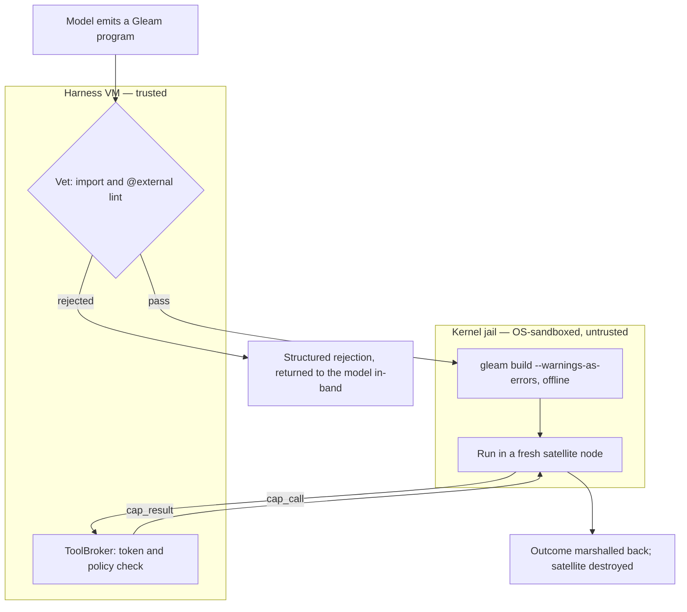

# Code mode

A tool call is a round trip: the model emits one call, the harness runs
it, and the result returns as context for the next turn. Ten dependent
steps cost ten round trips, and every intermediate payload — the full
file that only wanted its line count, the directory listing that only
wanted one name — lands back in the conversation whether the model needs
it or not. Code mode collapses the round trip. Instead of one call at a
time, the model writes a **program** that composes tools locally, with
loops, conditionals, intermediate values, and concurrency, and the
harness runs the whole thing and returns one structured result. The ten
steps become one execution. The intermediate payloads stay inside the
program and never reach the context. A multi-tool workflow stops being a
scattered sequence of turns and becomes a single durable artifact —
stored, replayable, and a candidate for promotion into a reusable tool.

The language the model writes is Gleam, the same language the harness is
written in. That choice is what makes running model-written code
defensible, and the rest of this document is the argument for why. Both
packages are built. `codemode` holds the vetting lint, the hermetic
compile service, the production builder and satellite launcher, and the
in-harness host that answers a running program's capability calls; `cap`
holds the prelude a program is written against and the boot runtime that
runs inside the jailed node. `make e2e-codemode` drives a model-written
program through the whole pipeline against a real jail. The last section
says what that run proves and what it cannot prove on a kernel missing a
layer.

## Why Gleam is safe to run

Pure Gleam cannot touch the world. It has no reflection, no `eval`, no
dynamic module lookup, and no macros. Every effect a program can have —
reading a file, spawning a process, opening a socket — enters through an
import that ultimately reaches a function declared `@external`, the one
door from Gleam to the Erlang runtime beneath it. A program with no such
import in its transitive reach can compute, but it cannot act. This gives
the property the whole design rests on:

> A Gleam program's maximal capability set is computable from its source:
> the transitive closure of its imports plus its own `@external`
> declarations.

The word *maximal* matters. Static analysis cannot decide what a program
*will* do — that is undecidable — but it does not need to. It only needs
to bound what the program *can* do, and for Gleam that bound is a set you
can read off the source without running it. A program that never imports
a networking module cannot open a socket no matter what its logic
computes, because the function that opens sockets is not in its reach and
no runtime trick can conjure it. Contrast Python, JavaScript, or Erlang
itself, where an import list tells you almost nothing: any of them can
reach the whole runtime through a string passed to `eval` or a module
resolved by name at runtime. Gleam closed those doors at the language
level, and code mode spends the result.

This turns capability control into a source-level check. The check is the
first of two defenses.

## The pipeline

A submitted program passes through two trust layers before its result
returns: a pure lint in the harness, then a kernel-enforced jail around
the running code. Vetting decides whether the program is *allowed* to
run; the jail contains it *while* it runs, so that a program which should
never have passed the lint still cannot reach anything it was not handed.
Between them sits the compile service, which is not a third layer so much
as a place where two attacks the lint cannot see are closed structurally.



Vetting and the broker run in the trusted harness virtual machine.
Compilation and execution run under the kernel sandbox, on the far side
of the boundary that `docs/architecture/effects.md` describes. The only
line crossing from the jail back to the harness is the framed channel
carrying a `cap_call` to the broker and a `cap_result` back — every
effect the program has, checked one at a time. Escape from this design
requires *both* a vetting bypass and a kernel escape, which is the point
of having two layers rather than one strong one.

`codemode/codemode.execute` drives vet, compile, and run in order and
short-circuits at the first refusal, so a rejected import never reaches a
compiler and a type error never spins up a node. Each stage's failure is a
value the model reads and fixes: `VetRejected`, `CompileFailed`,
`RunFailed`, or a `Ran` carrying the program's structured outcome.

## Layer one: vetting

**Vetting** is a lint, not a heuristic. It parses the submitted Gleam with
`glance` and enforces three rules, each rejecting one way a program could
smuggle in a capability its imports do not admit:

1. **No `@external` in submitted source** — and, failing closed, no
   attribute at all. The `@external` attribute is the sole bridge from
   Gleam to arbitrary Erlang. A one-shot program has no legitimate use for
   any attribute, so refusing the whole class removes the chance that some
   obscure or future spelling reaches foreign code. Every effect a program
   is allowed arrives instead through the prelude, whose `@external`
   declarations the harness wrote and trusts.

2. **No import outside the allowlist.** A program may import the
   capability prelude and a curated subset of the standard library, and
   nothing else. `gleam/erlang*` and `gleam/otp/*` additionally carry an
   explicit denylist entry, consulted before the allowlist, so they are
   refused with their own reason even if a misconfigured policy admitted
   one.

3. **No dependency outside the pinned prelude.** At the source level this
   is the same check as rule 2 — a submitted program declares no
   dependencies of its own, so the only names it can write are module
   names. Pinning proper belongs to the compile service, described below.

Both AST sweeps have a token-stream backstop, because the parser vetting
reads is not the compiler that will build the source. `glance` drops an
attribute that precedes no definition, so a dangling `@external` at end of
input vanishes from the tree; the backstop lexes the source with `glexer`,
collects every `At` token followed by a `Name`, subtracts the attributes
the tree accounted for, and rejects the remainder. The import backstop has
the same shape over `import` keywords and their module paths. Scanning
tokens rather than raw bytes is what makes these checks usable: an earlier
substring scan for `"@external"` rejected a program that merely *mentioned*
the word in a string or a comment, which is exactly what an agent grepping
a codebase for foreign-interface declarations would write. A string or a
comment lexes to one token that never decomposes into `At` followed by a
name, so the token scan sees only real syntax. It also sees that syntax
however it is spaced, since whitespace and comments are discarded before
the scan: `@ external`, and an `@` with a comment before the name, both
lex to the same two tokens.

The same fact — that vetting's parser is not the compiler's — costs
something in the other direction, and a submitter should hear about it
where it bites. `glance` 1.1 does not accept **label shorthand**: neither
`f(value:)` in a call nor `Pending(handle:, waited_ms:)` in a pattern,
both of which `gleam build` compiles happily. So a submitted program is
held to a slightly narrower language than the one that would compile it,
and the difference surfaces as an `Unparseable` rejection at a byte offset
for syntax that is perfectly legal Gleam. The `code_mode` tool says so in
the parse rejection itself (`tools/codemode.parser_note`) rather than in
its description: the description is the byte prefix of the provider's
cached region and is paid on every request of every strand, while the
rejection is paid only by the submission that tripped it.

Three adversaries motivate the rules, and each is a real entry in the
vetting corpus:

- **Hidden foreign code through a nested dependency.** A program with
  clean top-level imports pulls in a helper package that itself declares
  `@external` and re-exports it as an innocent-looking function. Rule 1
  catches `@external` in the submitted source, and rule 3 shuts the nested
  path, because a third-party package never enters the build at all.

- **Unicode-lookalike imports.** An import spelled with a Cyrillic letter
  standing in for a Latin one reads as `cap/fs` to a human but names a
  different module. The defense is a grammar gate rather than Unicode
  normalization, which would be the wrong tool: a Cyrillic `с` and a Latin
  `c` are distinct characters, not normalization variants. Legal Gleam
  module names are lowercase ASCII segments joined by `/`, so any name
  carrying a non-ASCII byte is definitionally not a reference to an
  allowlisted module and is rejected before the membership test runs. That
  test is then byte equality, and a homoglyph is never byte-equal to
  anything on the list.

- **Prelude shadowing.** A submitted module declares its own `cap/fs` with
  a hostile `@external`, hoping to be resolved in place of the real one.
  Rule 1 forbids the `@external`, but the structural answer is elsewhere:
  a Gleam module is named by its file path, and the submitted source does
  not contain its own module name, so the lint *cannot see* this attack at
  all. The compile service closes it by writing the program to a path it
  chooses — `loom_program.gleam`, whatever the program calls itself — so
  the vendored `cap/fs` is the only `cap/fs` in the build.

Because the type checker runs during the same pipeline, it doubles as the
tool-argument validator. A call to a capability with the wrong argument
types fails at compile time, before any sandbox spins up — a cheaper loop
than discovering a malformed tool call at runtime and feeding the error
back for another turn.

One residual is worth naming rather than glossing. `vet` is total *given
that `glance` returns*: malformed, incomplete, and hostile input all
settle as rejection values the model can read. But `glance` itself carries
a `panic` on a parser path no fuzzing has reached, and if some input ever
reaches it the crash propagates out of the lint. That costs availability,
never a spurious pass, and a fail-closed parser boundary is recorded as
deferred hardening.

## The prelude is the capability system

The **cap prelude** is the set of modules a code-mode program may import:
`cap/fs`, `cap/proc`, `cap/net`, `cap/git`, `cap/lsp`, `cap/task`,
`cap/actor`, `cap/report`, and `cap/kv`. Each is an ordinary typed Gleam
module whose functions look like local calls but whose bodies are stubs: a
call marshals its arguments and sends them as a `cap_call` over the framed
channel to the satellite host, carrying the execution's capability token,
and blocks for the `cap_result`. The program thinks it is calling
`fs.read`; the broker is the thing that actually reads, after checking the
call against policy.

Because effects arrive only through these imports, the import list *is*
the permission grant. A program that opens with `import cap/fs` and
`import cap/proc` can read files and run processes. It cannot open a
socket, because it did not import `cap/net`, and the socket-opening
function is therefore not in its reach — vetting confirms the absence, the
compiler refuses to resolve what is not in the build graph, and the jail
guarantees no other path exists. Permissions are not a configuration
attached to the program from outside; they are visible in the first few
lines the program wrote.

Only one of those nine modules reaches a real effect today. The host's
`default_router` maps exactly one capability, `proc.run`, onto a jailed
`broker.clear_call`; the rest of the prelude compiles, marshals, and calls
as designed, and comes back refused in band with `unsupported_cap`. The
harness-side bridge that maps `fs.*` and `report.emit` onto the existing
tools and `net.*` onto the egress proxy lands with the fuller runtime, and
a caller holding that bridge injects a fuller router, since the host is
generic over the table. None of that refusal is a security property — it
is a routing table still being filled in.

The deny-by-default story about `cap/net` is easy to credit to the wrong
place. Nothing in `cap/net` refuses anything: its functions marshal
arguments and dispatch exactly as `cap/fs.read` does, the refusal is
composed and returned by the broker, and the module only labels it. The
property the design wants still holds, because there is no policy field
for a program to flip and so no way for a program to widen its own network
access — but it holds in the broker, not in the prelude.

## Two seams, and why the sets are disjoint

There is not one prelude but two, and a submission is vetted against
exactly one of them (`codemode/vet/policy.Seam`).

The **workspace seam** is the nine modules above: a program that
orchestrates *effects*. The **orchestration seam** is `cap/strand` and
`cap/report`, and nothing else: a program that orchestrates *agents*.
`cap/strand` gives `spawn`, `wait` — a list of handles against one shared
deadline — `send`, `note`/`notes` and `roster`, and every one of them is
serviced by the same `client/agency` closures the model's own `agent_*`
tools call, judged against the same `Caller`. The authorization model is
reused rather than invented: descendant-only addressing, the depth and
fan-out caps, the lineage ledger, and the refusal names are the tools'.

Why a second allowlist rather than a tenth capability: **which
capabilities travel together is the point.** An orchestrator that could
also write files, run a process, or reach the network is a materially
worse thing to hand a model than one that cannot. A compromised
orchestration program can spawn and message within the lineage its own
strand roots, and can touch neither the disk, the network, nor a process.
That holds only while the two capability sets stay disjoint, which is why
they share no module but `cap/report` — which carries no authority of its
own — and why a test pins the disjointness rather than trusting the two
lists to stay apart.

Why a capability rather than an interpreter: Rule Zero. A trusted
orchestration interpreter living in the harness VM *is* model-influenced
execution in the harness VM, which is the one thing the architecture
forbids. So the script runs outside, which means it needs a channel back
to the broker, and that channel is `cap/strand`. Rule Zero forbids running
the orchestrator in the harness; it does not forbid model-influenced code
from *causing* a harness commit, which every tool call already does.

The seam brings one rule that is genuinely new. `agent_spawn` is throttled
by turn cost — the model pays a provider round trip per spawn, so the
economics bound the fan-out without the harness having to. A loop pays
nothing. Replacing the turn with a loop therefore removes an implicit
throttle, and an implicit throttle removed has to become an explicit one:
a **hard ceiling on spawn admissions per execution**, refused in band *at*
the ceiling and naming it. It is a lifetime bound on admissions, distinct
from the pooled outstanding-effect cap and from the Agency's live
`fan_out`/`session_strands` caps — which a program that spawns, joins and
spawns again passes forever. It is enforced by the satellite host, because
one host is stood up per execution holding the one `PhaseIdentity` a
caller may mint, so the tally is keyed to that identity by construction.

### Who chooses the seam

The host chooses which seams it *serves* (`client/codemode.Surface`, and
`--codemode-seams` on the shipped server, which defaults to the workspace
seam alone). Where it serves both, the **submission** chooses between them:
`code_mode` takes a `seam` argument and a program is judged against
exactly the one it names, defaulting to the workspace seam when it names
none. Nothing infers the seam from a program's imports — classifying a
submission by reading it would make the tool description a claim about a
decision the harness had already taken, and a model that meant to
orchestrate would learn it had been vetted as a workspace program only
from a refusal it could not act on.

Two properties keep that reachability from widening anything. The
**allowlist follows the submission**, so the seam a program is refused
against is the seam it asked for, and the refusal names it. The **router
follows the host**, so a surface serving one seam hands out that seam's
router whatever a request says, and no submission can reach a capability
the operator did not wire. A seam a host does not serve is refused before
anything is dispatched, in the tool shell and again in the wiring.

The argument and the schema grow only where there is a choice: a host
serving one seam renders neither the `seam` property nor a second import
list, and where both are served the shared standard-library subset is
stated once rather than duplicated into two lists the model would have to
diff. Both are the same arithmetic as tool registration itself — the tool
array renders ahead of the system prompt and is the byte prefix of the
cached region, so anything in it is paid on every request of the session.

`docs/examples/fan_out_review.gleam` is the worked sample, run verbatim by
`packages/codemode/test/codemode/orchestration_sample_test.gleam`, and
`docs/design-notes/orchestration-comparison.md` is the argument the seam
came out of.

## Layer two: the satellite node

A vetted, compiled program runs in a **satellite node**: a disposable `erl`
operating-system process, launched fresh for the execution inside the
executor sandbox, and killed as a unit when the execution ends. It is a
full BEAM virtual machine, which is what gives agent programs real
concurrency, but it is a jailed one:

- **No distribution.** The node boots as
  `erl -noshell -boot no_dot_erlang -pa <beam_dir> -proto_dist none
  -start_epmd false -run <entry> main -s init stop`. No `-name` or
  `-sname` is ever passed, so the Erlang clustering that would let one node
  run code on another is simply absent. The framed cap channel is the
  node's only link to anything, in keeping with the two-channel doctrine in
  `docs/architecture/effects.md`: native distribution never crosses a trust
  boundary. The trailing `-s init stop` is not decoration — `-run` alone
  leaves a `-noshell` node idling after the entry returns, and the node
  must die with the program.

- **No network except the channel to the broker.** The composed policy
  sets network off, which the helper enforces at socket creation with
  seccomp and again with an interface-less network namespace. `AF_UNIX`
  stays available, which is what the cap socket needs and all it needs.

- **Bounded resources.** A cgroup capping memory and process count, an
  `RLIMIT_CPU`, and a wall-clock deadline over the whole execution. The
  host arms its own timer for that deadline the moment the node connects
  back — not when the launch begins, because a launch that outlasted a
  timer armed up front would leave the host stopped and the node's destroy
  handle undelivered. On expiry the host calls `broker.abort` on the
  operation and closes the socket, killing the node and every executor it
  fanned out.

Teardown does not depend on the host surviving to run it. The host cleans
up on every exit path it takes itself, and the launcher additionally spawns
an unlinked janitor that monitors the host process and runs the same
teardown when it dies however it died — the same shape as the broker's own
fd-3 safety net. A host killed from outside therefore still leaves no node
running, no socket bound, and no token file on disk.

Teardown is also where the node's **enforcement report** is collected, and
the ordering is deliberate. `CapConnection.destroy` aborts the operation,
waits for the node's own settlement, and *returns* what the helper
reported; the host destroys the node before it reports the execution's
outcome, so the report travels out in `satellite.Run` rather than chasing
an outcome that has already left. The abort is what makes the report
reachable rather than what loses it — a cancelled execution still answers
with `exec_exit`, carrying the same enforcement list — and the launcher
holds the node's clearance handle so that teardown cancels it whichever of
the two arrives first. A stage that genuinely never reported carries an
`Unreported` naming the reason, which is a different value from a report
that was lost. Before this, the report was published on a callback the
abort usually beat, so a healthy run reported the build's layers and
nothing at all for the node (issue #5, spec-gaps WP-J 14).

A hostile `.beam` that slipped past vetting and the compiler lands here, in
a jail whose only reachable effect is the one broker channel. Be exact
about which layer holds that line, because it is easy to credit the wrong
one. **The capability token does not confine this adversary.** The boot
runtime has to read the token file, and its path is an ordinary
environment variable, so a `.beam` that carries its own `@external` reads
the file and presents the genuine token. The check then passes, as it
should. Two other things do the confining: the **kernel jail**, which
leaves the channel as the only thing the node can reach at all, and the
**broker's per-call policy check**, which composes and checks policy on
every `cap_call` whatever token came with it. What the token adds is
authentication and binding. It refuses a peer that never read the file —
another execution's satellite, anything that found the socket — it ties
the channel to one `{operation_id, step_id, deadline}` so a captured token
cannot be replayed elsewhere or later, and revoking it shuts the channel at
teardown. It is not a bearer capability, and no call gets more because it
carried a valid one.

### What the sandbox policy can and cannot say about reachability

The node needs two host paths inside its jail: the AF_UNIX cap socket,
which it must `connect(2)`, and the private token file, which it must
read. `SandboxPolicyV1` cannot say either of those things. Its filesystem
vocabulary is `writable_roots`, `readable_roots`, `protected`, and
`scratch`; there is no verb for binding a path into the jail at all.

Both paths are nonetheless reachable today, but *incidentally*. The
helper's base view is the whole host filesystem bound read-only
(`--ro-bind / /`), and Landlock grants `RODirs("/")` for the same reason,
so every host path is already visible and a `readable_roots` entry only
adds a redundant explicit bind. Three consequences follow, and the first
corrects what this document used to claim:

1. **`readable_roots` does not restrict reads.** Everything not named in
   `protected` is readable inside the jail whether or not a root covers
   it. A hostile `.beam` is kept out of `protected` paths and out of
   nothing else; it is not held to a read allowlist.

2. **Two ordinary-looking paths are invisible inside the jail.** Anything
   under a `protected` entry is shadowed — a read-only bind of a file onto
   itself, an empty read-only tmpfs for a directory or a path that does not
   exist yet — and when scratch is a tmpfs, everything under `/tmp` is
   replaced by the scratch mount. A cap socket in either place exists on
   the host and is simply absent in the jail, which presents as a satellite
   that never connects.

3. **Nothing records the dependency.** Tightening the base view to a
   minimal root, which is where the threat model wants to go, would
   silently break code mode, because no policy value says the socket and
   the token have to be there.

`protocol-change/004-sandbox-policy-explicit-mounts.md` proposes an
explicit `mounts` vocabulary that would state all of this positively. It
is PROPOSED and not implemented. Meanwhile the launcher does what the
current vocabulary allows and refuses what it does not: it expresses both
paths as `readable_roots`, composes the session base itself and refuses
in-band when the composition cannot cover them, and refuses up front the
three cases that would otherwise surface as a mysterious failure to
connect — a relative path, a path under a `protected` entry, and a path
under the scratch tmpfs mount. Nothing is created before that check
passes: no socket, no node.

Three kernel facts hold the current arrangement up, and a future change
must preserve them. `sb_permission` exempts sockets from
`EROFS`, so `connect(2)` on a socket inside a read-only mount succeeds;
Landlock's filesystem rights do not govern connecting to an existing
socket; and the network-off seccomp filter denies only non-`AF_UNIX`
socket creation. The first of those is reasoned, not yet observed — the
development container has no bubblewrap, so no run so far has actually
connected through a `--ro-bind`.

## The hermetic build

Compilation is itself sandboxed, and it carries security weight rather
than being plumbing. The compile service takes a `Vetted` — an opaque
token with no public constructor, so only source that passed the lint can
reach a build — writes the program under the pinned module name, generates
a tiny entry module that hands the program's `main` to the prelude's boot
runtime, and writes a `gleam.toml` naming exactly two dependencies: one
standard-library version and the prelude, vendored inside the build root.
A single version, never a range: an offline build cannot resolve a range,
so a range here does not merely loosen the pin, it fails to build.

The build then runs as an ordinary `broker.clear_call` with network off,
dispatched `RefuseNarrowed`, so a session base that cannot deliver a
network-off jail refuses the build rather than running it open. It is
`gleam build --warnings-as-errors`, and the flag is a security choice.
Gleam *warns*, and does not yet error, when a module from a transitive
dependency is imported — and `gleam/erlang/process`, `gleam/otp/*`, and
`core/*` are exactly that in a generated program, because the prelude
depends on them and their compiled modules are therefore present.
Promoting the warning to an error makes the **compiler** refuse those
imports, so the build graph is closed to them independently of the vetting
allowlist. Two honest limits: `gleam_stdlib` is a direct dependency, so
`gleam/io` and friends still compile and vetting's allowlist remains their
only gate; and every module present remains loadable at run time by a
hand-written `.beam`, which is the jail's problem and not the build's.

Two facts about Gleam's resolver stand between a pinned manifest and a
build that actually runs offline, and both look like accidents until you
hit them. Gleam
re-resolves versions — and reaches Hex — whenever a project root has no
resolved packages, and an exact `manifest.toml` does not prevent it once a
local path dependency is in play. So the packages are seeded rather than
fetched: a seed project with the same generated `gleam.toml` is built once,
online, and every build root is a copy of it. And Gleam records a local
dependency's path *relative to the project root*, treating a mismatch as a
stale manifest and going back to resolution. A build root is created fresh
per execution at whatever depth the session's scratch area lives, so no
relative path to `packages/cap` could be stable — hence vendoring the
prelude inside the build root at a fixed relative location. The pleasant
side effect is that a build root needs no read access outside itself. The
builder refuses to run against a seed whose dependency table is not
byte-identical to the one the compile service generated, and a build that
nonetheless reaches for Hex is diagnosed as a broken seed rather than
reported to the model as a broken program.

What comes out is an `Artifact`: every package's compiled modules flattened
into one directory, which is one `-pa` on the node's argv, plus a content
address over the whole set. Flattening is safe because Gleam prefixes a
module's beam name with its package, so `gleam@list` and `cap@fs` cannot
collide. A build root is cleared of whatever a previous run left before the
clone, since a stale `.beam` would otherwise join both the artifact and its
content address.

A code-mode program's source and its artifact are meant to be stored as
entries, so every execution is auditable history and a promotion candidate.
`execute` does not reach into storage itself: it hands the source and the
artifact back in the `Ran` outcome and the runtime commits them. That
runtime wiring is still owed, so today nothing persists them — see
`docs/architecture/durability.md` for what an entry is when it does.

## From a cap function to a broker RPC

Follow one `proc.run` from source to settlement. The program calls
`proc.run(proc.command(["/bin/echo", "hi"]))`. The `cap/proc` stub encodes
the argv and the optional cwd, environment, stdin, and timeout, and writes
`{token, cap: "proc.run", args, deadline_ms}` to the channel as a
`cap_call` frame. The **capability token** is a 32-byte random value the
host minted for this execution, written to a mode-0600 file inside a
mode-0700 directory, and bound to one `{op_id, step_id, policy, deadline}`;
it travels only over the channel it authenticates and is checked on every
call, in constant time, against the same vault the broker uses for its own
tokens.

The host validates the token, then applies the pooled outstanding-effect
cap *before* spawning anything, so a satellite flooding the channel cannot
buy one harness process per call up to the deadline. It routes the
capability to a clearance and dispatches it through `broker.clear_call`
under the execution's own `{op_id, step_id}` — which is what pools the
budget and what makes `broker.abort` at the deadline reach every effect the
program started. The broker checks the requested effect against policy
separately, and on every call, so a valid token buys nothing beyond a live
channel. The settlement comes back as a `cap_result`, the stub decodes it,
and the program resumes with an ordinary Gleam value. The broker, its
tokens, and the framed protocol are described in full in
`docs/architecture/effects.md`; code mode is one more caller at that one
door.

The type checker validated the arguments at compile time, so a `cap_call`
that reaches the host is already well-formed. What the broker adds is the
runtime authority check: the token could have been revoked, the policy
could refuse this path, the deadline could have passed. Vetting bounds what
the program can *ask for*; the broker decides, per call, what it *gets*.

The program's result travels the same socket as one terminal `outcome`
frame carrying its marshalled `report.Outcome` — `{ok: true, value}` or
`{ok: false, message, details}`. The frozen `broker/framing` does not know
that kind, so the host splits the byte stream itself, hands
`cap_call`/`cancel`/`heartbeat` payloads to `framing.decode_payload` for
typed decoding, and reads only the `outcome` body out locally. The envelope
checks are identical either way, so the two decoders cannot disagree about
what is well-formed. Removing the duplicated length read would need a
`framing` variant that carries a raw body, which is a protocol change
rather than a fix.

## Concurrency

The satellite runs a full BEAM, so agent programs get real parallelism —
but through curated capabilities, never the raw process primitives. Raw
`spawn` is deliberately absent, because it would allow unbounded process
creation and messages to arbitrary registered names, including the cap
channel itself. Two modules stand in its place.

**`cap/task` gives structured concurrency.** Every task is a child of the
combinator that started it, joined or killed before that combinator
returns.

```gleam
task.parallel_map(sites, max_concurrency: 8, with: fn(site) { ... })
task.parallel_map_fail_fast(sites, max_concurrency: 8, with: run)
task.race([strategy_a, strategy_b])
task.both(run_lint, run_tests)
task.all([job_a, job_b, job_c])
```

Three semantics are pinned. `parallel_map` preserves input order regardless
of completion order, so result *i* always corresponds to input *i* even
when input *i* finished last. Failures aggregate — every task still runs
and the error is the list of all of them — with `parallel_map_fail_fast`
available when the first error should abort the rest. And cancellation is
real, not advisory: when `race` has a winner, each loser is killed, which
makes the channel emit a `cancel` frame for its in-flight `cap_call`, and
the broker revokes the effect and kills the executor process group behind
it. A losing branch does not run to completion in the background wasting
budget — it stops, and its work outside the VM stops with it.

That structure lasts exactly as long as the combinator's own process, and
the guarantee is often quoted more strongly than it holds. Workers are
spawned unlinked and monitored, and the combinator drives cancellation
from its own loop. If something kills
the combinator out from under it — most plausibly a linked `cap/actor`
crashing while `main` is blocked inside it — the workers are orphaned and
keep running, spending pooled budget, until the node is torn down. So the
guarantee to state is "no work outlives the satellite"; "no work outlives
its call" holds only while the combinator is alive. Linking workers into a
per-combinator sub-supervisor would make the stronger claim true, and is a
recorded follow-up rather than today's behaviour.

**`cap/actor` gives typed, program-scoped actors** — a constrained
`gen_server`. Spawn one with an initial state and a typed handler, receive
an unforgeable typed `Address(state, msg)`, and `send`, `call(timeout)`, or
`get` against it. Actors earn their keep for ongoing state driven by
asynchronous input: watching a build's output stream and reacting to the
first error, coordinating a debugger stepping session, running a
work-stealing queue whose items generate more items. There is no global
registration, so no actor can be addressed by a name another program could
guess. Mailboxes are bounded, and the backpressure is real: `send` admits a
message only when the queue has room, and parks the sender inside `send`
until a slot frees, so a fast producer is bounded by how many processes are
pushing rather than by message rate.

The supervision policy is fixed, and "all-for-one" describes its common
case rather than a guarantee that holds from anywhere. The link runs
between an actor and its *spawner*. An actor spawned by `main` is linked to
the program root, so its abnormal crash does fail the program as a unit and
the strand that launched it sees a structured error, as
`docs/architecture/orchestration.md` describes for any failed operation. An
actor spawned inside a `cap/task` branch is linked to that branch's worker
instead, so its crash is contained to the branch and reported as a
`Crashed` failure while the program carries on. That is fault isolation
rather than all-for-one, and which one a given spawn site gets is worth
knowing. What is excluded either way is the rest of the OTP surface: links
and monitors with custom trap-exit logic, and self-defined supervision
strategies. Those belong to installed extensions, where a human approved
them; a jailed program does not get to invent its own failure semantics.

### Budgets are pooled per execution

Concurrency reopens a hole that per-call limits would leave gaping: a
program that fans out ten thousand polite parallel reads, or spawns fifty
test runs, respects every per-call limit while amplifying its footprint a
thousandfold. Code mode closes it by pooling the budget across the whole
execution rather than metering each call. One token backs every in-flight
`cap_call`, and the two aggregate limits ride on it: a cap on how many
effects may be outstanding at once, and one wall-clock deadline over the
entire program. Each `proc.run` still gets its own jail and its own cgroup,
carrying whatever memory and process ceilings the composed policy sets, so
what fan-out cannot buy is more concurrent effects or more time — the
ceilings on a *single* effect are unchanged by how many the program starts.
The node itself holds one outstanding effect for the whole execution, so a
pooled cap below two would starve every `cap_call`, and the launcher
refuses it up front rather than deadlocking.

## A worked example

The program below is not an illustration written for this document. It is
`docs/examples/stale_symbol_sweep.gleam` — the migration sample M4's
acceptance names — and
`packages/codemode/test/codemode/migration_sample_test.gleam` reads that
file *verbatim* and puts it through the real pipeline: real vetting, a real
offline `gleam build` inside a network-off jail, a real `erl` satellite, a
real AF_UNIX cap channel, and five real jailed processes behind `proc.run`,
against a fixture repository laid out under the rig's workspace. A sample
edited into something that no longer vets, compiles, or runs fails the
suite. The chore is an ordinary one: a symbol is being retired, and the
model wants to know how much of it is left in three packages and whether
the tree still builds. As tool calls that is five round trips and five
intermediate payloads landing in the conversation. As a program it is one
execution returning one line.

```gleam
import cap/proc
import cap/report
import cap/task
import gleam/int
import gleam/list
import gleam/string

/// The symbol being retired.
const symbol = "deprecated_decode"

/// The packages to sweep, in the order the report should list them.
const packages = ["packages/core", "packages/broker", "packages/runtime"]

pub fn main() -> report.Outcome {
  // Two ways to confirm the tree still builds, started together. The
  // first to finish wins and the other is cancelled where it stands.
  let build =
    task.race([
      fn() { proc.run(proc.command(["/bin/sh", "tools/build-quick"])) },
      fn() { proc.run(proc.command(["/bin/sh", "tools/build-thorough"])) },
    ])

  // One sweep per package, all at once. Each is its own `cap_call`, each
  // checked against policy, all drawing on one pooled budget — and the
  // results arrive in `packages` order however they finish.
  let sweeps =
    task.parallel_map(packages, max_concurrency: 3, with: fn(dir) {
      proc.run(proc.command(["/bin/sh", "tools/sweep", symbol, dir]))
    })

  case build, sweeps {
    Ok(built), Ok(outputs) ->
      report.text(
        string.join(
          list.map2(packages, outputs, fn(dir, output) {
            dir <> "=" <> int.to_string(match_count(output.stdout))
          }),
          " ",
        )
        <> " build="
        <> string.trim(built.stdout)
        <> " exit="
        <> int.to_string(built.exit_code),
      )
    Error(_failure), _ -> report.failure("no build strategy finished")
    _, Error(_failures) -> report.failure("the sweep did not settle")
  }
}

/// How many files one sweep listed. The whole file listing stays here, in
/// the program; only the count reaches the conversation.
fn match_count(stdout: String) -> Int {
  stdout
  |> string.split("\n")
  |> list.filter(fn(line) { string.trim(line) != "" })
  |> list.length
}
```

Trace what each line is permitted to do. The six imports are the entire
permission grant: this program can run processes, use structured
concurrency, report a result, and do list, string, and integer work. It
cannot open a socket — `cap/net` is absent — and it cannot touch git
history, because `cap/git` is absent. Vetting confirmed both absences
before the program compiled, and the hermetic build's dependency table
leaves the compiler nothing else to resolve. Its `main` returns a
`report.Outcome`, which is the shape the generated entry module hands to
the boot runtime; the runtime marshals it back as the terminal frame, so
the strand receives a value off the wire and never scrapes stdout.

`race` starts both build strategies together and returns the first to
finish. `tools/build-quick` wins. The `tools/build-thorough` branch is now
a race loser, and its cancellation is real: killing it makes the channel
emit a `cancel` for its outstanding `proc.run`, and the broker kills the
executor process group behind it, so the losing build stops mid-flight
instead of grinding on and spending budget the winner already made moot.

`parallel_map` then fans three `proc.run` calls across the packages at
once. Each is a separate `cap_call`, each routed and checked against
policy, each drawing from the one pooled budget; whichever package
finishes first, `outputs` still lists results in `packages` order, so its
first element is always `packages/core`'s. All three draw on one
outstanding-effect cap and one deadline. Had the whole program overrun its
wall-clock deadline instead, the satellite would die as a unit — both
builds, all three sweeps, and the program root — leaving nothing behind.

None of those three claims is free, so the fixture is instrumented and the
suite reads the instrumentation back rather than trusting a green outcome
line. `tools/sweep` stamps the wall time at which each sweep starts and
finishes: the last start lands before the first finish, which three
sequential runs cannot produce, and the per-package sleeps make the
completion order the exact *reverse* of the input order, so results
arriving in `packages` order is a property rather than a coincidence.
`tools/build-thorough` appends a tick every half second for thirty
seconds; the race is decided about a third of a second in and the program
then sweeps for three more, so the assertion bounds the tick count from
*both* sides — a loser merely abandoned would tick its way through the
sweep, and a loser that never started would prove nothing about
cancellation at all.

Three caveats about running this today.

1. **`proc.run` is the one capability the default router services**, which
   is why the sample is written in terms of it. A program calling
   `fs.read` or `report.emit` compiles and gets `unsupported_cap` back
   until the harness-side bridge lands — so an `Outcome` is currently the
   only way anything leaves the satellite at all. Even within `proc.run`,
   the router services argv alone: a `Command` carrying `in_dir`,
   `with_env`, `with_stdin`, or `with_timeout` is denied in band as
   `unsupported_argument` rather than run without it, which is why the
   sample's commands are bare argv and why its fixture scripts write
   relative to the jail's cwd.
2. **`report.value` is out of reach, for a different reason.** Building a
   structured `MsgPackValue` needs `import core/msgpack`, and `core` is a
   transitive dependency of the *prelude* rather than a direct dependency
   of the generated program, so `--warnings-as-errors` turns Gleam's
   transitive-import warning into a hard compile error — the same gate the
   end-to-end's second scenario asserts. The richest outcome a program can
   return today is therefore `report.text` over a string it composed
   itself. Everything above about structure is about the *frame*, not
   about the payload's shape.
3. **Every executable named has to be inside the jail** and permitted by
   the composed policy — `/bin/sh` here, plus the `grep`, `sleep`, and
   `date` the fixture's scripts call — exactly as `rg` must be for the
   harness's own `grep` tool.

## Where code mode sits: the promotion ladder

A code-mode program is the bottom rung of a trust ladder that runs from
throwaway code to a change in Loom itself. Code mode is where that ladder
begins, and reading the whole of it explains why the same programming
model reappears at every level; `docs/loom-design.md` §7 covers it in
depth.

```
L0  code-mode program     ephemeral, satellite-jailed, dies with the call
L1  session skill         L0 saved as a durable, named, reusable entry;
                          runs at L0 privileges
L2  extension candidate   compiled against a wider but still
                          capability-stubbed prelude; runs its tests in the
                          sandbox, results attached
L3  installed extension   after explicit human approval: hot-loaded into
                          the harness ExtensionZone
L4  core change           a pull request to Loom; ordinary review and
                          release; never runtime-loaded
```

L0 is built; the rungs above it are design. Two properties are meant to
carry up the ladder. First, nothing self-promotes: the step from a proven
candidate to an installed extension requires a human decision, recorded
durably. Second, the shape of the code does not change as it climbs. An
installed extension is an OTP actor implementing a typed behaviour — the
same actor model `cap/actor` hands a jailed program at L0. A stateful
helper prototyped as a program-scoped actor, proven against its tests,
becomes a supervised citizen of the harness when it is promoted, without
being rewritten into a different thing. Code mode is not only the fast path
for a single execution; it is the first draft of a durable capability.

The design carries this further with a satellite kept alive across calls
within a session. Its actors would persist between executions — the model
spawns an indexer in one call and queries it across the next several —
which nothing MCP-shaped can express. That mode is not built: every
execution today gets a fresh node and destroys it. What *is* built is the
guard that makes it safe when it arrives. The capability channel lives in a
node-global slot, and each execution installs its own, so a process that
outlived execution *N* would read execution *N+1*'s channel on its next
capability call and act under *N+1*'s token and policy. The invariant that
rules this out is external to the prelude: **the executor reaps every
process a program spawned before the next execution installs its channel.**
The boot runtime refuses to install over a channel whose actor is still
alive, so an unreaped predecessor fails the next boot outright instead of
silently lending it authority. A fresh node per execution never reaches the
case at all.

## What the end-to-end proves

`make e2e-codemode` builds the Go helper, rebuilds the offline seed, and
runs five scenarios through the real pipeline: real vetting, a real
`gleam build` inside a network-off jail, a real `erl` node, a real AF_UNIX
socket, and a real `broker.clear_call` behind the capability. Four are in
`test/codemode/e2e_test.gleam`; the fifth is the migration sample, in
`test/codemode/migration_sample_test.gleam`. All are feature-detected —
without the Go toolchain, the Gleam and Erlang toolchains, or a prepared
seed, each test prints its skip reason and passes, so `make check` stays
hermetic and fast.

The happy path submits a program that shells out to `/bin/echo` and returns
what it printed. The assertions are specific: the compiled entry module
really exists on disk, the manifest hash is a content address over the whole
set, and the structured outcome carries `echo=loom-code-mode exit=0` —
through the cap channel, the broker's policy check, a second jail, and back,
with nothing scraped from stdout. Running the same program again over the
same build root, with a stale `.beam` planted in it, must reproduce the
outcome byte for byte and the same manifest hash, and must clear the
plant. The second scenario allows `core/msgpack` through vetting on purpose,
so the program reaches the compiler, and asserts the build fails naming a
`direct dependency` — the compiler refusing a transitive import without
vetting's help. The third submits a program that spins forever and never
makes a capability call, and asserts the run ends as `DeadlineExceeded`
after at least five of its six seconds, so the kill is the deadline and not
a node that failed to boot, and that the cap socket and the private token
file are both gone afterwards. The fourth submits a mistyped capability call
and asserts a `Type mismatch` comes back in band, before any node spins up.

The fifth is the migration sample described above. It is the only scenario
whose program is read from a file rather than restated inline, the only one
that uses concurrency, and the only one whose assertions reach past the
outcome into evidence the fixture recorded while the program ran: that the
three sweeps overlapped in time, that they completed in the reverse of the
order the outcome reports them in, and that the race loser stopped ticking
when the race was decided rather than when the program ended. It prints the
overlap it measured and the tick count it saw, so a passing run says how
much margin it had.

What the run does not prove depends on the kernel under it, and the suite
says so out loud rather than letting green imply more than it earned. It
prints the helper's own enforcement report for both the build and the node
— and asserts that both are *present*, which is the property `make
e2e-codemode` owes the sandbox's value claim — and prints in as many words
whether network-off was *enforced*. In the
development container it is not: there is no bubblewrap binary, no Landlock
in the kernel, and no delegated cgroup v2 hierarchy, so the build runs
offline but this run does not prove it *could not* have reached the network.
The claims still owed to a target-tier kernel are therefore: that the
hermetic build is confined rather than merely well-behaved; that a
hand-written malicious `.beam` loaded directly into the node reaches nothing
on the filesystem or the network; and that memory and process-count
ceilings bite. A fourth is narrower and easy to overlook: that
`connect(2)` on the cap socket survives a bubblewrap `--ro-bind` is
reasoned from `sb_permission` and Landlock's rights model, and has never
been observed, because no run so far has had bubblewrap to bind with.
`make selftest` reports which layers the current kernel actually provides.

## Where the code lives

| Path | What it holds |
|---|---|
| `codemode/codemode.gleam` | `execute`: vet → compile → run, short-circuiting, total. |
| `codemode/vet.gleam`, `codemode/vet/policy.gleam` | The lint, its two token-stream backstops, and the opaque `Vetted`; the allowlist, the denylist, and the ASCII grammar gate. |
| `codemode/compile.gleam` | The hermetic compile service: pinned module name, generated entry, pinned dependency table. |
| `codemode/seed.gleam` | The once-resolved, vendored package cache every build root is cloned from, and `verify`. |
| `codemode/build.gleam` | The production `Builder`: `gleam build --warnings-as-errors` in a network-off jail, the flattened `.beam` set, the content address. |
| `codemode/launch.gleam` | The production `Launcher`: the cap socket, the reachability checks, the jailed `erl`, the janitor. |
| `codemode/satellite.gleam` | The in-harness host: the broker end of the cap channel, the router, the deadline, teardown. |
| `codemode/enforcement.gleam` | What each jailed stage's helper reported, or why no report exists; both stages of an execution as one record. |
| `cap/fs.gleam`, `cap/proc.gleam`, `cap/net.gleam`, `cap/git.gleam`, `cap/lsp.gleam`, `cap/kv.gleam`, `cap/report.gleam` | The prelude's capability modules — typed stubs over `cap_call`. |
| `cap/task.gleam`, `cap/actor.gleam` | Structured concurrency and program-scoped actors. |
| `cap/strand.gleam` | The orchestration seam: spawn, join, address, blackboard, roster. |
| `codemode/orchestration.gleam` | The harness end of that seam — `strand.*` onto the Agency closures. |
| `cap/runtime.gleam` | The boot runtime inside the node: read the token, connect the socket, install the channel, run `main`, emit the outcome. |
| `cap/internal/` | The channel actor, dispatch slot, wire codec, and socket FFI the program cannot import. |
| `test/codemode/e2e_test.gleam` | The jailed acceptance described above. |
| `test/codemode/migration_sample_test.gleam`, `test/support/sample_repo.gleam` | The migration sample's run and the instrumented fixture repository it sweeps. |
| `docs/examples/stale_symbol_sweep.gleam` | The migration sample itself — the readable artifact, and the exact bytes the suite submits. |

Each path is relative to its package's source root — `codemode/vet.gleam`
is `packages/codemode/src/codemode/vet.gleam` — except the last three
rows, which are under `packages/codemode/test/` and, for the sample
itself, at the repository root. The frozen wire contracts
these packages implement against — the framing, `cap_call` and
`cap_result`, the token rules, and `SandboxPolicyV1` — live in Part 1.4 of
`docs/loom-implementation-spec.md` and are shared with the executor and
satellite channels alike. `packages/codemode/CLAUDE.md` and
`packages/cap/CLAUDE.md` are denser than this document about their own
packages.
