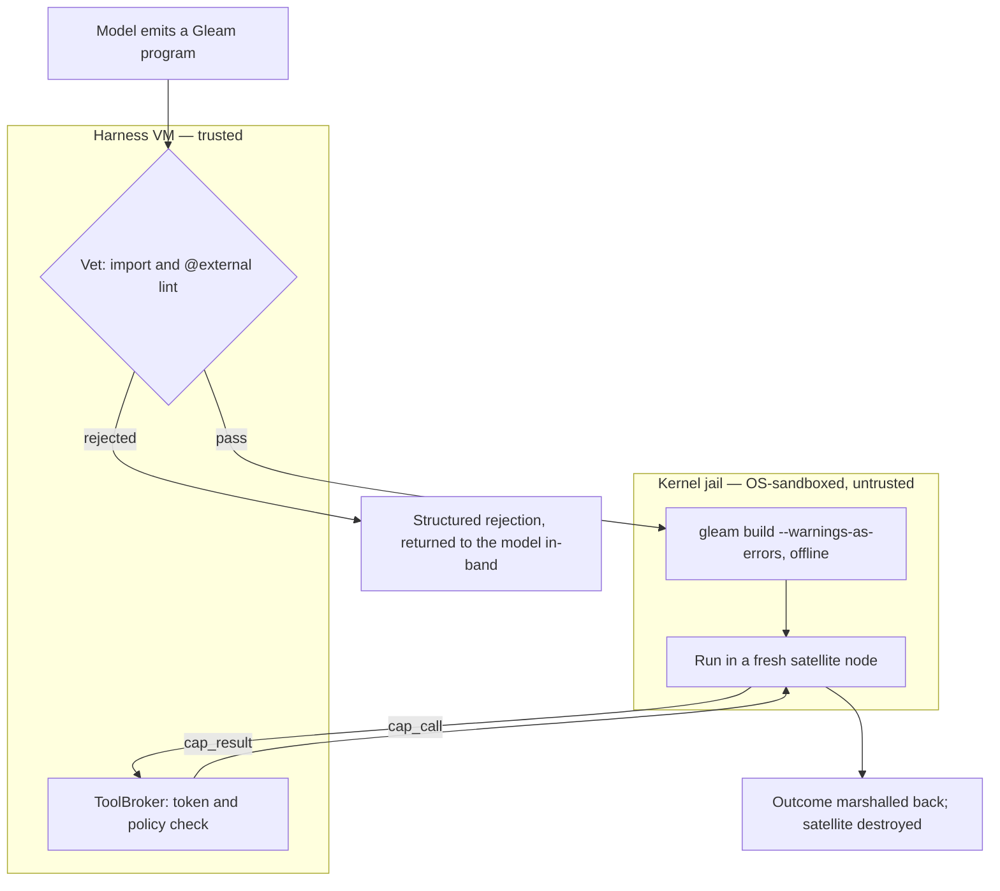

# Code mode

Code mode lets the model write a Gleam **program** that composes tools,
instead of issuing one tool call per turn. The harness vets the program,
compiles it in a sandbox, runs it in a jailed Erlang node called the
**satellite**, and returns one structured result. Every effect the program
has goes through the broker, one capability call at a time.

A tool call is a round trip: the model emits one call, the harness runs
it, and the result returns as context for the next turn. Ten dependent
steps cost ten round trips. Every intermediate payload also lands in the
conversation whether the model needs it or not: the full file that only
wanted its line count, the directory listing that only wanted one name. A
program composes tools locally, with loops, conditionals, intermediate
values and concurrency, so the ten steps become one execution and the
intermediate payloads never reach the context. The program is also a
single durable artifact: stored, replayable, and a candidate for promotion
into a reusable tool.

The model writes Gleam, the language the harness is written in. That
choice is what makes running model-written code defensible, and most of
this document argues why. Two packages implement code mode, and both are
built. `codemode` holds the vetting lint, the hermetic compile service,
the production builder and satellite launcher, and the in-harness host
that answers a running program's capability calls. `cap` holds the
prelude a program is written against and the boot runtime that runs
inside the jailed node.

Code mode builds on the effect plane: the satellite runs under the same
kernel sandbox as any executor, and its capability calls go to the same
broker (`docs/architecture/effects.md`). A program that starts child
strands (subagents) does so through the same `client/agency` closures as
the model's own `agent_*` tools. `make e2e-codemode` drives a
model-written program through the whole pipeline against a real jail, and
the last section says what that run proves and what it cannot prove on a
kernel missing a layer.

## Why Gleam is safe to run

Pure Gleam cannot touch the world. It has no reflection, no `eval`, no
dynamic module lookup, and no macros. Every effect a program can have
(reading a file, spawning a process, opening a socket) enters through an
import that ultimately reaches a function declared `@external`, the one
door from Gleam to the Erlang runtime beneath it. A program with no such
import in its transitive reach can compute, but it cannot act. The whole
design rests on this property:

> A Gleam program's maximal capability set is computable from its source:
> the transitive closure of its imports plus its own `@external`
> declarations.

The word *maximal* matters. Static analysis cannot decide what a program
*will* do, because that is undecidable, but code mode does not need it
to. It only needs to bound what the program *can* do, and for Gleam that
bound is a set you can read off the source without running it. A program
that never imports a networking module cannot open a socket whatever its
logic computes, because the socket-opening function is not in its reach
and nothing at runtime can load it. Python, JavaScript and Erlang itself
differ here: an import list says almost nothing about them, because any
of them can reach the whole runtime through a string passed to `eval` or
a module resolved by name at runtime. Gleam removed those paths at the
language level, and code mode relies on that.

Capability control therefore becomes a source-level check, and that
check is the first of two defenses.

## The pipeline

A submitted program passes two trust layers before its result returns: a
pure lint in the harness, then a kernel-enforced jail around the running
code. Vetting decides whether the program may run. The jail contains it
while it runs, so a program that should never have passed the lint still
cannot reach anything it was not handed. The compile service sits between
the two. It is not a third layer; it closes, by construction, two attacks
the lint cannot see.



Vetting and the broker run in the trusted harness virtual machine.
Compilation and execution run under the kernel sandbox, on the far side
of the boundary that `docs/architecture/effects.md` describes. One channel
crosses from the jail back to the harness: the framed channel that
carries a `cap_call` to the broker and a `cap_result` back. Every effect
the program has crosses it and is checked one at a time. An escape
therefore needs *both* a vetting bypass and a kernel escape, which is why
the design has two layers rather than one strong one.

`codemode/codemode.execute` runs vet, compile and run in order and stops
at the first refusal, so a rejected import never reaches a compiler and a
type error never starts a node. Each stage's failure is a value the model
reads and fixes: `VetRejected`, `CompileFailed`, `RunFailed`, or a `Ran`
carrying the program's structured outcome.

## Layer one: vetting

**Vetting** is a lint with exact rules, not a heuristic. It parses the
submitted Gleam with `glance` and enforces three rules. Each rule rejects
one way a program could smuggle in a capability its imports do not admit:

1. **No `@external` in submitted source**, and, failing closed, no
   attribute at all. The `@external` attribute is the only bridge from
   Gleam to arbitrary Erlang. A one-shot program has no legitimate use for
   any attribute, so refusing the whole class removes the chance that some
   obscure or future spelling reaches foreign code. A program gets its
   effects through the prelude instead, whose `@external` declarations the
   harness wrote and trusts.

2. **No import outside the allowlist.** A program may import the
   capability prelude and a curated subset of the standard library, and
   nothing else. `gleam/erlang*` and `gleam/otp/*` also carry an explicit
   denylist entry, consulted before the allowlist, so they are refused
   with their own reason even if a misconfigured policy admitted one.

3. **No dependency outside the pinned prelude.** At the source level this
   is the same check as rule 2: a submitted program declares no
   dependencies of its own, so the only names it can write are module
   names. The pinning itself belongs to the compile service, described
   below.

Both AST sweeps have a token-stream backstop, because `glance` is not the
compiler that will build the source. `glance` drops an attribute that
precedes no definition, so a dangling `@external` at the end of input
vanishes from the tree. The backstop lexes the source with `glexer`,
collects every `At` token followed by a `Name`, subtracts the attributes
the tree accounted for, and rejects the remainder. The import backstop
does the same over `import` keywords and their module paths.

Scanning tokens rather than raw bytes keeps these checks from rejecting
legitimate programs. An earlier substring scan for `"@external"` rejected
a program that merely *mentioned* the word in a string or a comment,
which is exactly what an agent grepping a codebase for foreign-interface
declarations would write. A string or a comment lexes to one token, never
to `At` followed by a name, so the token scan sees only real syntax. It
also catches that syntax however it is spaced, since the lexer discards
whitespace and comments first: `@ external`, and an `@` with a comment
before the name, both lex to the same two tokens.

The parser boundary also needs an explicit compatibility floor. `glance`
6.1 understands every post-1.1 construct that issue #89 found the shipped
Gleam compiler accepting: label shorthand in calls and patterns, `assert`,
`let assert ... as`, `echo`, and string-prefix alias patterns. The vetting
corpus pins those constructs as legitimate programs. The corpus matters
more than the version number, because a future dependency resolution
cannot quietly narrow the accepted language without failing before
release.

Three adversaries motivate the rules, and each is a real entry in the
vetting corpus:

- **Hidden foreign code through a nested dependency.** A program with
  clean top-level imports pulls in a helper package that declares
  `@external` and re-exports it as an innocent-looking function. Rule 1
  catches `@external` in the submitted source, and rule 3 closes the
  nested path, because a third-party package never enters the build.

- **Unicode-lookalike imports.** An import spelled with a Cyrillic letter
  in place of a Latin one reads as `cap/fs` to a human but names a
  different module. The defense is a grammar gate. Unicode normalization
  would be the wrong tool, because a Cyrillic `с` and a Latin `c` are
  distinct characters, not normalization variants. Legal Gleam module
  names are lowercase ASCII segments joined by `/`, so a name carrying a
  non-ASCII byte cannot refer to an allowlisted module, and it is rejected
  before the membership test runs. That test is then byte equality, and a
  homoglyph is never byte-equal to anything on the list.

- **Prelude shadowing.** A submitted module declares its own `cap/fs`
  with a hostile `@external`, hoping to be resolved in place of the real
  one. Rule 1 forbids the `@external`, but the lint *cannot see* the
  attack itself: a Gleam module is named by its file path, and the
  submitted source does not contain its own module name. The compile
  service closes it structurally by writing the program to a path it
  chooses, `loom_program.gleam`, whatever the program calls itself. The
  vendored `cap/fs` is then the only `cap/fs` in the build.

The type checker runs in the same pipeline, so it also validates tool
arguments. A call to a capability with the wrong argument types fails at
compile time, before any sandbox starts. That loop is cheaper than
discovering a malformed tool call at runtime and sending the error back
for another turn.

One residual remains. `vet` is total *given that `glance` returns*:
malformed, incomplete and hostile input all settle as rejection values the
model can read. But `glance` itself has a `panic` on a parser path no
fuzzing has reached, and if an input ever reaches it, the crash
propagates out of the lint. That costs availability, never a spurious
pass. A fail-closed parser boundary is recorded as deferred hardening.

## The prelude is the capability system

The **cap prelude** is the set of modules a code-mode program may import:
`cap/fs`, `cap/proc`, `cap/net`, `cap/git`, `cap/lsp`, `cap/task`,
`cap/actor`, `cap/report`, `cap/kv`, `cap/schedule`, `cap/job`, and
`cap/search`. (`cap/search` offers read-only navigation and search over
the workspace, so a program that only needs to find its way around a
tree can import it instead of `cap/fs` and declare in its imports that it
will not write.) Each is an ordinary typed Gleam module whose functions
look like local calls but whose bodies are stubs. A call marshals its
arguments, sends them as a `cap_call` over the framed channel to the
satellite host along with the execution's capability token, and blocks
for the `cap_result`. The program calls `fs.read`; the broker performs
the read, after checking the call against policy.

Because effects arrive only through these imports, the import list *is*
the permission grant. A program that opens with `import cap/fs` and
`import cap/proc` can read files and run processes. It cannot open a
socket, because it did not import `cap/net`, so the socket-opening
function is not in its reach. Three mechanisms hold that absence: vetting
confirms it, the compiler refuses to resolve what is not in the build
graph, and the jail guarantees no other path exists. The permissions are
not configuration attached to the program from outside; they are the
first few lines the program wrote.

No single router services every module. `satellite.default_router` maps
exactly one capability, `proc.run`, onto a jailed `broker.clear_call`.
The host is generic over the routing table, so a caller stacks
harness-side bridges over it:

- `codemode/workspace.routing` serves `fs.*`, `kv.*`, `schedule.*`,
  `job.*` and `report.emit` against the session's own tools.
- `codemode/search.routing` serves `search.glob`, `search.grep`,
  `search.stat` and `search.read_lines` over `tools/search`'s walk. It is
  its own module rather than four more arms on the workspace router,
  because the module a program imports is the unit of authorization, and
  `cap/search` grants strictly less than `cap/fs`.
- `client/mcp.routing` serves the generated per-server modules.
- For an installed extension, `client/extension/seam.routing` serves
  `net.request` and nothing else.

A capability that no layer in a given stack answers comes back refused in
band as `unsupported_cap`; `lsp.*` is the one still owed (#25). That
refusal is not a security property. It marks a routing table that is
still being filled in.

The deny-by-default behavior of `cap/net` is easy to credit to the wrong
place. Nothing in `cap/net` refuses anything: its functions marshal
arguments and dispatch exactly as `cap/fs.read` does. The broker composes
and returns the refusal, and the module only labels it. The property the
design needs still holds, because there is no policy field a program
could flip to widen its own network access. It holds in the broker, not
in the prelude.

### The modules a host adds: MCP servers

The modules above ship with Loom. A host may serve more, and exactly one
mechanism generates them today: each `[mcp.<name>]` server in `loom.toml`
becomes a `cap/mcp/<name>` module of typed façades, generated at boot
from that server's own `tools/list` (issue #106). A program reaches an
MCP server only by importing it (`import cap/mcp/github`); no part of MCP
is a registered tool. Three reasons drove that choice.

**A server costs what a module costs, not what its tool count costs.** A
registered-tool design pays per *tool* in the provider's cached prefix,
on every request of every strand. A module pays for its rendered surface
once, as `cap/proc` does, whether the server lists three tools or three
hundred. The operator controls the cost by choosing which servers to
enable, not through model-side discovery, which is why the design note's
tool-search proposal was dropped rather than built.

**Trust is per server, and it is visible in the import list.** The
vetting allowlist names one module per configured server, so a program
that imported `cap/mcp/github` was handed that server and no other. Every
façade calls one marshaling module, `cap/internal/mcp`. It is an
*internal* module, which the Gleam compiler forbids another package from
importing, so a program cannot name it and dispatch to a server string of
its own. Such a call would be a generic dispatcher by the back door, and
it would reduce per-server trust to "any server the router knows".

**The allowlist follows the host.** A façade exists only where its server
is configured, so no static list can name it. At boot the host adds the
generated `cap/mcp/<server>` modules to each offered program mode,
together with the `cap/mcp` vocabulary those modules import. Both modes
route calls through the same configured MCP layer. An unconfigured host
admits neither the import nor the call. Extension and resident policies
do not receive this host-specific widening.

The generated source enters the hermetic build vendored *inside* the
prelude, because only there does an internal-module call resolve. It is
written after the seed clone, which would otherwise delete it. Only the
modules the **vetted program actually imports** are written. The cost of
a configured server therefore scales with the imports a program wrote,
not with what an operator enabled, and a build whose program named no
server is byte-for-byte the build it always was.

A call travels as a capability like any other. The capability name is
`mcp.<server>`. The arguments are `{tool, arguments}`, with the tool's
name verbatim, whatever the generated façade renamed it to for Gleam. The
plan is `ServedHere`, as the orchestration seam's is: the harness answers
over a socket it already owns, building no `CallSpec`, entering no jail
and composing no policy. Three limits bound the call: the pooled
outstanding-effect cap, the execution's wall deadline, and one call
timeout. The refusals a program can read are `mcp_unavailable`,
`mcp_timeout`, `mcp_malformed`, `jsonrpc_<code>` for a server error, and
`unsupported_cap` for a server this host never configured.

## Program modes and capability admission

A **program mode** determines which capability modules a submitted
program may import. The `code_mode` tool's `seam` argument names it, and
the code calls each mode a *seam*. There are two, workspace and
orchestration, and the default server offers both. Both admit the same
capability modules, so one program can inspect files, run processes,
spawn child strands (a strand is a named line of work: the main
conversation, a subagent, a parallel attempt), exchange granted peer
messages, and report a result. Omitting `seam` selects workspace, and
explicit `--codemode-seams workspace` keeps the effect-only restriction.
The host's tool description lists the imports and signatures it actually
admits; installed MCP façades and `cap/notes` appear there when
configured.

`cap/strand` uses the same `client/agency` closures that sit behind the
model's `agent_*` tools, so Agency (the owner of child-strand lifecycle)
keeps every rule it already had. The current strand may address only its
parent or descendants, and depth, fan-out and workflow admission keep
their existing bounds. A peer message still requires an exact directional
grant. The broader import set does not bypass broker grants or the
satellite's kernel sandbox.

An operator can install a workspace-only surface without Agency custody.
That host keeps an effect-only allowlist and does not advertise
`cap/strand` or `cap/workflow`. Extension tools and resident hooks also
keep their separate policies, and their lifecycle does not carry the
current program's child custody.
[Protocol 048](../../protocol-change/048-async-collaboration.md) records
the program-mode change and its cost.

Orchestration is a capability rather than an interpreter because of Rule
Zero: model-influenced code never runs in the harness VM. A trusted
orchestration interpreter in the harness VM *is* model-influenced
execution in the harness VM. So the script runs outside, which means it
needs a channel back to the broker, and `cap/strand` is that channel.
Rule Zero forbids running the orchestrator in the harness. It does not
forbid model-influenced code from *causing* a harness commit; every tool
call already does that.

Orchestration mode brings one genuinely new rule: a **hard ceiling on
spawn admissions per execution**. The `agent_spawn` tool is throttled by
turn cost: the model pays a provider round trip per spawn, so cost bounds
the fan-out without the harness doing anything. A loop pays nothing, so
replacing the turn with a loop removes that implicit throttle, and the
harness must replace it with an explicit one. A spawn at the ceiling is
refused in band, and the refusal names the ceiling. The ceiling is a
lifetime bound on admissions. It is distinct from the pooled
outstanding-effect cap and from the Agency's live
`fan_out`/`session_strands` caps, which a program that spawns, joins and
spawns again would pass forever. The satellite host enforces it: one host
is stood up per execution, holding the one `PhaseIdentity` a caller may
mint, so the tally is keyed to that identity by construction.

### Durable analysis between executions

The default server installs a shared notes door through
`client/codemode.serving`, and that host advertises `cap/notes` in both
program modes. Notes give a program durable cells:

- `notes.put(key, value)` writes a JSON-compatible value under the
  caller's own `agent/<strand>/` namespace.
- `notes.get("main/analysis")` reads an exact cell.
- `notes.list(prefix)` returns keys in the same relative form, ready to
  reuse.

A missing cell and a stored JSON null are distinct. Writes update current
values and notify nobody. Agency keeps namespace validation and the
schema check on a child's `result` note.

Notes survive satellite exit, runtime restart and context compaction,
because they are existing durable session registers. They are not
cross-session memory. `cap/kv` remains an evictable cache. Large data
belongs in workspace files or `report.emit` artifacts, with a small
reference in a note. The [analysis example](../examples/notes_analysis.gleam)
saves data without returning the payload to the model, and the
[reuse example](../examples/notes_reuse.gleam) reads it in a fresh
program and verifies its JSON view.

A program can also read a note through the filesystem module:
`cap/fs.read("note://main/analysis")` returns the exact cell serialized
as JSON. The facade dispatches a separate `notes.read` capability, so
this read has a finite quota and never enters filesystem path resolution.
URI suffixes are opaque keys, and other filesystem operations reject
these virtual paths. There is no OS mount, so a shell command can consume
the value only after an explicit copy into a permitted workspace file.

The optional `codemode/notes.Door` holds only Agency's write and scan
callbacks. Its presence controls import admission, model descriptions,
routing and execution quotas. Unconfigured hosts, extensions and resident
hooks do not receive `cap/notes`. The installed notes door adds data
access to each offered program mode, but an explicitly workspace-only
host still has no agent lifecycle authority.

Each execution allows 256 puts and 64 each of get, list and virtual
reads. All three reads use the existing prefix query, and an exact read
filters its result by the full key. Stored values and list replies have a
1 MiB encoded-JSON bound, and oversized results fail explicitly. Storage
and decoding failures propagate as `plane_failed`, and absence is
reported only after a successful read. Legacy strand note calls keep
their own quotas. [Protocol 045](../../protocol-change/045-code-mode-notes.md)
records the contract and the deliberate absence of filesystem mounts and
subscriptions.

### Reusable programs on both surfaces

`report.decode_json` and `report.encode_json` convert between JSON text
and the structured Value that notes and child results use. They use the
existing core parser and shared conversion. They preserve the
integer/float distinction and refuse binary values, non-text keys,
duplicates and excessive nesting. Ordinary `gleam/json` parsing remains
available for application-specific decoders.

`strand.map` accepts assignments and a concurrency bound. It starts one
batch and joins it before admitting another. A pending child, or an
admission or join error, stops the helper with all known handles and
explicit NotStarted assignments. It does not cancel children or retry
uncertain admissions. Its join window is per batch, and the host's
execution deadline bounds the whole program.
[Protocol 046](../../protocol-change/046-code-mode-utilities.md) has the
contract.

The model-facing description includes a
[workspace analysis recipe](../examples/workspace_analysis.gleam) and a
[bounded child review recipe](../examples/strand_map.gleam), each shown
only when the host offers the imports it uses. Tests execute the
advertised strings verbatim and compare them with these files. Either
mode can save workspace data into notes for the other to consume, or one
program can combine reads and child work.

### JSON in submitted programs

The compiler seed already pins `gleam_json`, so ordinary code-mode
programs can import `gleam/json`, `gleam/dynamic` and
`gleam/dynamic/decode`. The current API is `json.parse(raw, decoder)`,
where `raw` can be file contents or command output. For example:

```gleam
import gleam/dynamic/decode
import gleam/json

let parsed = json.parse(raw, decode.list(decode.int))
```

For an unknown shape, use `json.parse(raw, decode.dynamic)` and then
`decode.run` with a typed decoder. Build output with `json.object`,
`json.array` and `json.to_string`. The jailed JSON regression executes
the [review example](../examples/json_reviews.gleam) verbatim, so its
decoder and encoder must work with the pinned package. Parsing adds no
filesystem, network, process or foreign-function authority; those
boundaries keep their existing capability checks.

### The third seam: extensions, and why it is a superset

An installed extension's code is vetted against a third seam. The
**extension seam** widens the workspace effect subset, not the union of
both program modes. `extension_cap_modules` starts with
`default_cap_modules()` and adds `ext`, `ext/hook`, and `ext/memory`.
`extension_stdlib_modules` adds `gleam/bit_array` and `gleam/uri` to the
shared pure subset. Extensions read files, run processes and make
brokered HTTP requests. They get no `cap/strand` or `cap/workflow`,
because their install-time lifecycle has no current Agency owner. The
tests pin this relationship directly.

The entry point also differs. A code-mode program gets its arguments when
the host launches it; an extension compiles at install and serves later
calls, which `ext` and `ext/hook` type. `ext/memory` gives an installed
extension durable cells under its own `ext/<name>/` prefix, a name that
does not exist for an ordinary code-mode program.

Two further differences follow. First, **the extension seam sees no
generated MCP façades.** An extension's allowlist is fixed at install and
recorded. A per-host widening applied afterwards would make an installed
extension's reach depend on configuration the record never saw. Second,
**the `code_mode` tool has no name for it.**
`client/codemode.tool_seam` returns a `Result`, because the harness
dispatches an extension from an install record, and a model never names
it in a `code_mode` call.

### Dispatching an extension: the router and the launch

A call to an installed extension's tool is **one invocation of a
satellite the session already holds open**. `client/extension/dispatch`
drives it through `client/extension/hosts`, and the router behind that
invocation has one layer the code-mode path does not:

```
client/extension/seam.routing        net.request
  codemode/workspace.routing         fs.*, kv.*, schedule.*, job.*,
                                     report.emit
    codemode/search.routing          search.glob, search.grep,
                                     search.stat, search.read_lines
      codemode/satellite.default_router  proc.run, then unsupported_cap
```

The middle bridge is the same one a code-mode program on this host gets:
`client/codemode.workspace_seam_for`, which `workspace_seam` delegates
to. An extension therefore reads and writes exactly what a program reads
and writes, under the same containment. The search arm beneath it is the
same arrangement over `client/codemode.search_seam_for`. The MCP arm is
absent by construction: `cap/mcp` is a harness-only capability on no
seam, so an extension cannot name it, and an arm for it would claim a
reach the allowlist has already denied.

**Each invocation arrives on a `hook_call` frame.** The artifact is
compiled once and invoked many times, so the call is what varies. It does
not travel through the node's environment, where it would be untyped,
size-limited and readable by every process in the jail. The frame carries
a per-invocation token, the kind (`tool` or `event`), the name, the
arguments and the deadline, and the satellite answers with one
`hook_result`. A tool's arguments are `{args, strand}` with `args` as
JSON *text*, because `gleam_json`'s parser is the only route from bytes
to a `Dynamic` that the extension seam admits. The router table above
belongs to `Invoking` rather than to the node, which lets
`requests_per_call` stay a per-*call* number on a node that is not
per-call.

**`net.request` is served on this path.** `cap/net` has declared it from
the start, and nothing ever answered it: `broker/policy` narrows
`NetworkProxy` to `NetworkOff` on every call, because the egress proxy
sidecar it was written for does not exist. ADR-007 observes that a jailed
extension does not need a socket; it needs a request made and the
response handed back. So the arm is a `ServedHere` plan that calls
`broker/egress` in the harness VM under a policy composed from the
manifest, and the node's network namespace stays empty. Every sandbox
layer already enforces that empty namespace, and the proxy was meant to
preserve it.

The policy is `client/extension/policy.egress_for`. It takes the
manifest's `hosts`, `methods`, `max_response_bytes` and `[[net.secret]]`
bindings verbatim. The harness fixes the rest: `SameHost(2)` redirects, a
request timeout, and `SystemRoots`, because an author who could set
`trust` could pin a root of their own choosing. `requests_per_call`
becomes a `satellite.CapCeiling` on `net.request`, for the reason that
type's documentation gives at length: a program's loop pays nothing, so
the implicit throttle it removes must become an explicit one. An
extension that named no `[net]` table gets a standing `network_off`
refusal on every request, before anything is decoded.

**The credential never enters the jail.** A binding names an environment
variable, a host and a header. `broker/egress` reads the value through an
injected lookup after it has judged the origin and the method, and puts
it on the matching hop. The value is in no capability frame, no
`LaunchSpec` environment and no `env_allow`; `client/extension_e2e_test`
reads the spec and taps every byte in both directions to confirm it.

Vetting an extension means vetting a *package* rather than a program,
which `codemode/vet/package` owns. A package needs three rules that a
single file does not.

First, **a repository is not an installed extension**. The installed tree
is `src/**/*.gleam`, `schema/**`, `skills/**`, `extension.toml`,
`gleam.toml`, `README*` and `LICENSE*`. `installed_subset` prunes
everything else (`test/`, `.gitignore`, `.github/`, `docs/`, `build/`,
Gleam's own resolved `manifest.toml`) before anything else touches the
tree. Those files are pruned rather than refused because every real Gleam
repository has them; the first acceptance test of a real repository found
the rule refusing it for having a test and a `.gitignore`. The precedent
is the `.git` directory that `archive.from_directory` already walks past:
the installed tree is what the extension *is*, and the repository around
it is not part of what an operator approves. The digest covers what
survives, so it describes the installed tree, and a later load compares
like with like rather than re-deriving the prune. One shape stays a
refusal: a non-`.gleam` file under `src/`. Gleam compiles and links such
a file into the artifact, which amounts to `@external` with the
declaration moved out of the source the lint reads, and pruning would
silently drop it.

Second, the package's `gleam.toml` may name only `gleam_stdlib`,
`gleam_json`, `cap` and `ext`.

Third, each file is judged against the seam widened by exactly the
package's own module names. An import of an absent sibling is therefore a
vetting refusal naming the import, and a module named `cap/fs` is refused
before it can become the `cap/fs` a sibling resolves.

### Who chooses the seam

The host chooses which seams it *serves*: `client/codemode.Surface`, and
`--codemode-seams` on the shipped server, which defaults to both seams.
Where the host serves both, the **submission** chooses between them.
`code_mode` takes a `seam` argument, and a program is judged against
exactly the seam it names, or the workspace seam if it names none.
Nothing infers the seam from a program's imports. Classifying a
submission by reading it would make the tool description a claim about a
decision the harness had already taken. A model that meant to orchestrate
would then learn it had been vetted as a workspace program only from a
refusal it could not act on.

Two properties keep the `seam` argument from widening anything. The
**allowlist follows the submission**, so a program is refused against
the seam it asked for, and the refusal names that seam. The **router
follows the host**, so a surface serving one seam hands out that seam's
router whatever a request says, and no submission can reach a capability
the operator did not wire. A seam the host does not serve is refused
before anything is dispatched, in the tool shell and again in the wiring.

The argument and the schema grow only where there is a choice. A host
serving one seam renders neither the `seam` property nor a second import
list. Where both are served, their common imports and signatures are
rendered once; on the default server the full capability set is common
to both modes. The reason is the same arithmetic as tool registration:
the tool array renders ahead of the system prompt and is the byte prefix
of the cached region, so every byte in it is paid on every request of the
session.

### What the description tells a model about the prelude

A model writes a program **blind**. It has no autocomplete, no hover and
no language server; it emits source and submits it. While the
description listed only module *names*, the compiler was the only source
of a signature, and the model reached it only by being wrong first: a
`CompileFailed` round trip, carrying a whole hermetic build, to learn
that `proc.run` takes a `Command` rather than a `String`. The design note
`docs/design-notes/tool-search-and-code-mode.md` put it this way: the
module namespace is the discovery index and the compiler is the schema
oracle, and the index is listed for free while the oracle is reachable
only by being wrong first.

The description now includes the signatures. Every module a seam admits
is rendered into it in full: `pub type` declarations with their
constructors and fields, `pub const`, and `pub fn` signatures, each under
the prelude's own `///` documentation. The model reads the contract
before it writes, rather than after it is refused. Four decisions shaped
the rendering.

**It is static, not a tool.** The original proposal was a
`code_mode_signatures(module)` tool, rejected on the cache arithmetic.
Tool bytes render ahead of the system prompt and are the byte prefix of
the provider's one-hour cached region. A static rendering is written once
per cache lifetime and read at about a tenth of base input on every later
request. A tool costs a round trip *every* time the model wants a
signature: a request/response cycle, output tokens, latency, and the
model having to know to ask before writing. The static rendering adds
nothing to the tool array and nothing that varies between turns, so the
arithmetic that note prices is untouched.

**It is generated at build time, and drift is a build failure.**
`make gen-prelude` runs `gleam export package-interface` over
`packages/cap`, renders the result with `scripts/gen-prelude.py`, and
commits it as `tools/prelude`. The package interface is the compiler's
own account of what it will accept, so the description cannot describe a
prelude the hermetic build would reject. `scripts/gen-prelude.sh --check`
runs inside `make check` and refuses a tree where the artifact and its
inputs disagree, naming the file that moved and the command that fixes
it. The gate is a digest comparison and nothing more, so it needs no
toolchain and costs nothing to run constantly. Regeneration is the step
that needs `gleam` and `python3`, the way `make gen-sql` needs `sqlite3`.

**It is filtered through the allowlist, not through the package.**
`package-interface` reports the public modules. All three allowlists
exclude `cap/runtime`, the satellite's trusted boot runtime, and
`cap/mcp`, the types-only vocabulary a generated façade imports.
`tools/codemode` selects from the artifact using each `SeamOffer`'s own
`allowed_imports`, the same list vetting judges against, so a module
vetting will reject is never advertised. Advertising one would be the
same error as classifying a submission by reading its imports: the model
would write against a module it cannot import and read a refusal it has
no way to understand.

**Each seam pays only for what it adds.** The signatures follow the same
split as the import lists: modules on every offered seam are rendered
once under a shared heading, and each seam renders only its own. The
default host renders the full shared program surface once, including
configured MCP façades.

Before the Protocol 048 additions, the measured description sizes were
17,678 bytes for a workspace-only host, 15,205 for an orchestration-only
host, and 28,818 for a host serving both: roughly 4,400, 3,800 and 7,200
tokens. About half of that is the `pub type` declarations. The estimate
this work was scoped against did not include them, but they are not
optional: `proc.run` returns a `proc.Output`, and a program that cannot
name the `stdout` field cannot read the output it just paid for.
`scripts/gen-prelude.py` argues what was deliberately left out, with the
bytes each omission saves: the `## Examples` doctests, and all but the
first sentence of each module's own doc.

`docs/examples/fan_out_review.gleam` is the worked orchestration sample,
run verbatim by
`packages/codemode/test/codemode/orchestration_sample_test.gleam`.
`docs/design-notes/orchestration-comparison.md` is the argument the
orchestration seam came out of.

## Layer two: the satellite node

A vetted, compiled program runs in a **satellite node**: a disposable
`erl` operating-system process, launched fresh for the execution inside
the executor sandbox and killed as a unit when the execution ends. It is
a full BEAM virtual machine, which gives agent programs real concurrency,
but it is jailed in three ways:

- **No distribution.** The node boots as
  `erl -noshell -boot no_dot_erlang -pa <beam_dir> -proto_dist none
  -start_epmd false -run <entry> main -s init stop`. No `-name` or
  `-sname` is ever passed, so the Erlang clustering that would let one
  node run code on another is absent. The framed cap channel is the
  node's only link to anything, following the two-channel doctrine in
  `docs/architecture/effects.md`: native distribution never crosses a
  trust boundary. The trailing `-s init stop` is required, because `-run`
  alone leaves a `-noshell` node idling after the entry returns, and the
  node must die with the program.

- **No network except the channel to the broker.** The composed policy
  sets network off. The helper enforces that at socket creation with
  seccomp, and again with a network namespace that has no interfaces.
  `AF_UNIX` stays available, which is all the cap socket needs.

- **Bounded resources.** A cgroup caps memory and process count,
  `RLIMIT_CPU` caps CPU time, and a wall-clock deadline covers the whole
  execution. The host arms its timer for that deadline when the node
  connects back, not when the launch begins: a launch that outlasted a
  timer armed up front would leave the host stopped and the node's
  destroy handle undelivered. On expiry the host calls `broker.abort` on
  the operation and closes the socket, which kills the node and every
  executor it fanned out.

Teardown does not depend on the host surviving to run it. The host
cleans up on every exit path it takes itself. The launcher also spawns an
unlinked janitor that monitors the host process and runs the same
teardown when the host dies, however it died; the broker's own fd-3
safety net has the same shape. A host killed from outside therefore still
leaves no node running, no socket bound, and no token file on disk.

Teardown also collects the node's **enforcement report**, the sandbox
helper's account of which layers it enforced, and the ordering is
deliberate. `CapConnection.destroy` aborts the operation, waits for the
node's own settlement, and *returns* what the helper reported. The host
destroys the node before it reports the execution's outcome, so the
report travels out in `satellite.Run` together with the outcome. The
abort does not lose the report: a cancelled execution still answers with
`exec_exit`, carrying the same enforcement list. The launcher holds the
node's clearance handle, so teardown cancels it whichever of the two
arrives first. A stage that genuinely never reported carries an
`Unreported` naming the reason, which is a different value from a lost
report. Previously the report was published on a callback that the abort
usually beat, so a healthy run reported the build's layers and nothing at
all for the node (issue #5, spec-gaps WP-J 14).

A hostile `.beam` that slipped past vetting and the compiler lands here,
in a jail whose only reachable effect is the one broker channel. It is
easy to credit the wrong layer with holding that line. **The capability
token does not confine this adversary.** The boot runtime must read the
token file, and its path is an ordinary environment variable, so a
`.beam` carrying its own `@external` can read the file and present the
genuine token. The token check then passes, as it should. Two other
mechanisms do the confining: the **kernel jail**, which leaves the
channel as the only thing the node can reach at all, and the **broker's
per-call policy check**, which composes and checks policy on every
`cap_call` whatever token came with it.

The token adds authentication and binding. It refuses a peer that never
read the file, such as another execution's satellite or anything else
that found the socket. It ties the channel to one
`{operation_id, step_id, deadline}`, so a captured token cannot be
replayed elsewhere or later, and revoking it shuts the channel at
teardown. It is not a bearer capability: no call gets more because it
carried a valid token.

### What the sandbox policy can and cannot say about reachability

The node needs two host paths inside its jail: the AF_UNIX cap socket,
which it must `connect(2)`, and the private token file, which it must
read. `SandboxPolicyV1` cannot express either. Its filesystem vocabulary
is `writable_roots`, `readable_roots`, `protected`, and `scratch`, with
no verb for binding a path into the jail.

Both paths are reachable today, but only *incidentally*. The helper's
base view is the whole host filesystem bound read-only (`--ro-bind / /`),
and Landlock grants `RODirs("/")` for the same reason, so every host path
is already visible and a `readable_roots` entry only adds a redundant
explicit bind. Three consequences follow, and the first corrects what
this document used to claim:

1. **`readable_roots` does not restrict reads.** Everything not named in
   `protected` is readable inside the jail whether or not a root covers
   it. A hostile `.beam` is kept out of `protected` paths and out of
   nothing else; it is not held to a read allowlist.

2. **Two kinds of ordinary-looking path are invisible inside the jail.**
   Anything under a `protected` entry is shadowed, by a read-only bind of
   a file onto itself or by an empty read-only tmpfs for a directory or a
   path that does not exist yet. And when scratch is a tmpfs, the scratch
   mount replaces everything under `/tmp`. A cap socket in either place
   exists on the host and is absent in the jail, which shows up as a
   satellite that never connects.

3. **Nothing records the dependency.** Tightening the base view to a
   minimal root, which is where the threat model wants to go, would
   silently break code mode, because no policy value says the socket and
   the token have to be there.

`protocol-change/004-sandbox-policy-explicit-mounts.md` proposes an
explicit `mounts` vocabulary that would state all of this positively. It
is PROPOSED and not implemented. Meanwhile the launcher does what the
current vocabulary allows and refuses what it does not. It expresses both
paths as `readable_roots`, composes the session base itself, and refuses
in band when the composition cannot cover them. It also refuses up front
the three cases that would otherwise surface as an unexplained failure to
connect: a relative path, a path under a `protected` entry, and a path
under the scratch tmpfs mount. Nothing is created before that check
passes: no socket, no node.

Three kernel facts hold up the current arrangement, and a future change
must preserve them:

- `sb_permission` exempts sockets from `EROFS`, so `connect(2)` on a
  socket inside a read-only mount succeeds.
- Landlock's filesystem rights do not govern connecting to an existing
  socket.
- The network-off seccomp filter denies only non-`AF_UNIX` socket
  creation.

The first is reasoned, not yet observed: the development container has
no bubblewrap, so no run so far has actually connected through a
`--ro-bind`.

## The hermetic build

Compilation is sandboxed too, and it carries security weight. The
compile service takes a `Vetted`, an opaque token with no public
constructor, so only source that passed the lint can reach a build. It
writes the program under the pinned module name, generates a tiny entry
module that hands the program's `main` to the prelude's boot runtime, and
writes a `gleam.toml` naming exactly two dependencies: one
standard-library version and the prelude, vendored inside the build root.
Each is a single version, never a range: an offline build cannot resolve
a range, so a range here would not merely loosen the pin, it would fail
to build.

The build runs as an ordinary `broker.clear_call` with network off,
dispatched `RefuseNarrowed`, so a session base that cannot deliver a
network-off jail refuses the build rather than running it open. The
command is `gleam build --warnings-as-errors`, and the flag is a security
choice. Gleam *warns*, but does not yet error, when a program imports a
module from a transitive dependency. In a generated program,
`gleam/erlang/process`, `gleam/otp/*`, and `core/*` are exactly that: the
prelude depends on them, so their compiled modules are present. Promoting
the warning to an error makes the **compiler** refuse those imports, so
the build graph is closed to them independently of the vetting
allowlist. The flag has two limits. `gleam_stdlib` is a direct
dependency, so `gleam/io` and similar modules still compile, and
vetting's allowlist remains their only gate. And every module present
remains loadable at run time by a hand-written `.beam`, which is the
jail's problem, not the build's.

Two behaviors of Gleam's resolver stand between a pinned manifest and a
build that actually runs offline, and both look like accidents until you
hit them:

- Gleam re-resolves versions, and contacts Hex, whenever a project root
  has no resolved packages, and an exact `manifest.toml` does not prevent
  it once a local path dependency is in play. So the packages are seeded
  rather than fetched: a seed project with the same generated
  `gleam.toml` is built once, online, and every build root is a copy of
  it.
- Gleam records a local dependency's path *relative to the project
  root*, and treats a mismatch as a stale manifest that sends it back to
  resolution. A build root is created fresh per execution at whatever
  depth the session's scratch area lives, so no relative path to
  `packages/cap` could be stable. The preludes are therefore vendored
  inside the build root at fixed relative locations
  (`compile.prelude_path` and `compile.ext_path`). As a side effect, a
  build root needs no read access outside itself.

The builder refuses to run against a seed whose dependency table is not
byte-identical to the one the compile service generated. A build that
nonetheless reaches for Hex is diagnosed as a broken seed, not reported
to the model as a broken program.

That byte comparison is why there is **one dependency table and not one
per seam**. `compile.default_dependencies` pins `gleam_stdlib`,
`gleam_json`, the capability prelude at `vendor/cap` and the extension
prelude at `vendor/ext`, and every build root gets all four, whichever
seam the submission was judged against. A second table would mean a
second seed to prepare, ship and keep in step, and it would buy nothing.
`codemode/vet/policy` decides per seam what a build may *import*, so
vetting refuses a workspace program that names `ext` long before the
compiler would find the module present. The seed script builds until
Gleam stops re-resolving rather than a fixed number of times, because
Gleam writes one local dependency's config fingerprint per resolution
pass, and a hard-coded count breaks the next time something is vendored.

The output is an `Artifact`: every package's compiled modules flattened
into one directory, which is one `-pa` on the node's argv, plus a content
address over the whole set. Flattening is safe because Gleam prefixes a
module's beam name with its package, so `gleam@list` and `cap@fs` cannot
collide. Before the clone, the build root is cleared of anything a
previous run left, since a stale `.beam` would otherwise join both the
artifact and its content address.

A code-mode program's source and artifact are meant to be stored as
entries, so every execution becomes auditable history and a promotion
candidate. `execute` does not write to storage itself; it hands the
source and the artifact back in the `Ran` outcome for the runtime to
commit. That runtime wiring is still owed, so today nothing persists
them. `docs/architecture/durability.md` describes what an entry is once
it does.

## From a cap function to a broker RPC

Follow one `proc.run` from source to settlement:

1. The program calls `proc.run(proc.command(["/bin/echo", "hi"]))`.
2. The `cap/proc` stub encodes the argv and the optional cwd,
   environment, stdin, and timeout, and writes
   `{token, cap: "proc.run", args, deadline_ms}` to the channel as a
   `cap_call` frame.
3. The host validates the token. It then applies the pooled
   outstanding-effect cap *before* spawning anything, so a satellite
   flooding the channel cannot buy one harness process per call up to the
   deadline.
4. The host routes the capability to a clearance and dispatches it
   through `broker.clear_call` under the execution's own
   `{op_id, step_id}`. Sharing that identity is what pools the budget, and
   what lets `broker.abort` at the deadline reach every effect the
   program started.
5. The broker checks the requested effect against policy, separately and
   on every call, so a valid token buys nothing beyond a live channel.
6. The settlement comes back as a `cap_result`, the stub decodes it, and
   the program resumes with an ordinary Gleam value.

The **capability token** is a 32-byte random value the host minted for
this execution. It is written to a mode-0600 file inside a mode-0700
directory and bound to one `{op_id, step_id, policy, deadline}`. It
travels only over the channel it authenticates, and the host checks it on
every call, in constant time, against the same vault the broker uses for
its own tokens. `docs/architecture/effects.md` describes the broker, its
tokens, and the framed protocol in full; code mode is one more caller of
that broker.

The type checker validated the arguments at compile time, so a
`cap_call` that reaches the host is already well-formed. The broker adds
the runtime authority check: the token could have been revoked, the
policy could refuse this path, the deadline could have passed. Vetting
bounds what the program can *ask for*; the broker decides, per call,
what it *gets*.

The program's result travels the same socket as one terminal `outcome`
frame carrying its marshalled `report.Outcome`: `{ok: true, value}` or
`{ok: false, message, details}`. The frozen `broker/framing` has no
`outcome` kind, so the host splits the byte stream itself. It hands
`cap_call`, `cancel` and `heartbeat` payloads to
`framing.decode_payload` for typed decoding, and reads only the `outcome`
body locally. The envelope checks are identical either way, so the two
decoders cannot disagree about what is well-formed. Removing the
duplicated length read would need a `framing` variant that carries a raw
body, which is a protocol change rather than a fix.

## Concurrency

The satellite runs a full BEAM, so agent programs get real parallelism,
but only through curated capabilities, never the raw process primitives.
Raw `spawn` is deliberately absent, because it would allow unbounded
process creation and messages to arbitrary registered names, including
the cap channel itself. Two modules replace it.

**`cap/task` gives structured concurrency.** Every task is a child of
the combinator that started it, and is joined or killed before that
combinator returns.

```gleam
task.parallel_map(sites, max_concurrency: 8, with: fn(site) { ... })
task.parallel_map_fail_fast(sites, max_concurrency: 8, with: run)
task.race([strategy_a, strategy_b])
task.both(run_lint, run_tests)
task.all([job_a, job_b, job_c])
```

Three semantics are pinned:

- **Order.** `parallel_map` preserves input order regardless of
  completion order, so result *i* always corresponds to input *i*, even
  when input *i* finished last.
- **Failures aggregate.** Every task still runs, and the error is the
  list of all the failures. `parallel_map_fail_fast` is available when
  the first error should abort the rest.
- **Cancellation is enforced, not advisory.** When `race` has a winner,
  each loser is killed. Killing it makes the channel emit a `cancel`
  frame for its in-flight `cap_call`, and the broker revokes the effect
  and kills the executor process group behind it. A losing branch stops,
  and its work outside the VM stops with it, instead of running to
  completion in the background and wasting budget.

That structure lasts only as long as the combinator's own process, and
the guarantee is often quoted more strongly than it holds. Workers are
spawned unlinked and monitored, and the combinator drives cancellation
from its own loop. If something kills the combinator out from under it
(most plausibly a linked `cap/actor` crashing while `main` is blocked
inside it), the workers are orphaned. They keep running, spending pooled
budget, until the node is torn down. The accurate guarantee is "no work
outlives the satellite"; "no work outlives its call" holds only while the
combinator is alive. Linking workers into a per-combinator
sub-supervisor would make the stronger claim true, and is a recorded
follow-up rather than today's behaviour.

**`cap/actor` gives typed, program-scoped actors**, a constrained
`gen_server`. A program spawns one with an initial state and a typed
handler, receives an unforgeable typed `Address(state, msg)`, and uses
`send`, `call(timeout)`, or `get` against it. Actors suit ongoing state
driven by asynchronous input: watching a build's output stream and
reacting to the first error, coordinating a debugger stepping session,
or running a work-stealing queue whose items generate more items. There
is no global registration, so no actor can be addressed by a name another
program could guess. Mailboxes are bounded, with real backpressure:
`send` admits a message only when the queue has room, and otherwise parks
the sender inside `send` until a slot frees. A fast producer is therefore
bounded by how many processes are pushing, not by message rate.

The supervision policy is fixed. "All-for-one" describes its common case
rather than a guarantee that holds from every spawn site, because the
link runs between an actor and its *spawner*:

- An actor spawned by `main` is linked to the program root. Its abnormal
  crash fails the program as a unit, and the strand that launched it sees
  a structured error, as `docs/architecture/orchestration.md` describes
  for any failed operation.
- An actor spawned inside a `cap/task` branch is linked to that branch's
  worker instead. Its crash is contained to the branch and reported as a
  `Crashed` failure while the program carries on. That is fault
  isolation rather than all-for-one.

Either way, the rest of the OTP surface is excluded: links and monitors
with custom trap-exit logic, and self-defined supervision strategies.
Those belong to installed extensions, where a human approved them; a
jailed program does not get to define its own failure semantics.

### Budgets are pooled per execution

Per-call limits alone would not bound a concurrent program. A program
that fans out ten thousand polite parallel reads, or spawns fifty test
runs, respects every per-call limit while multiplying its footprint a
thousandfold. Code mode therefore pools the budget across the whole
execution rather than metering each call. One token backs every in-flight
`cap_call`, and two aggregate limits attach to it: a cap on how many
effects may be outstanding at once, and one wall-clock deadline over the
entire program. Each `proc.run` still gets its own jail and its own
cgroup, carrying whatever memory and process ceilings the composed policy
sets. Fan-out therefore cannot buy more concurrent effects or more time,
and the ceilings on a *single* effect do not change with how many effects
the program starts. The node itself holds one outstanding effect for the
whole execution, so a pooled cap below two would starve every
`cap_call`; the launcher refuses such a cap up front rather than
deadlocking.

## A worked example

The program below is `docs/examples/stale_symbol_sweep.gleam`, the
migration sample that M4's acceptance names; it was not written for this
document. `packages/codemode/test/codemode/migration_sample_test.gleam`
reads that file *verbatim* and runs it through the real pipeline: real
vetting, a real offline `gleam build` inside a network-off jail, a real
`erl` satellite, a real AF_UNIX cap channel, and five real jailed
processes behind `proc.run`, against a fixture repository laid out under
the rig's workspace. If the sample is edited into something that no
longer vets, compiles, or runs, the suite fails.

The task is ordinary. A symbol is being retired, and the model needs to
know how much of it is left in three packages and whether the tree still
builds. As tool calls, that is five round trips and five intermediate
payloads in the conversation. As a program, it is one execution
returning one line.

```gleam
import cap/proc
import cap/report
import cap/task
import gleam/int
import gleam/list
import gleam/string

/// The symbol being retired.
const symbol = "deprecated_decode"

/// The packages to sweep, in the order the report should list them.
const packages = ["packages/core", "packages/broker", "packages/runtime"]

pub fn main() -> report.Outcome {
  // Two ways to confirm the tree still builds, started together. The
  // first to finish wins and the other is cancelled where it stands.
  let build =
    task.race([
      fn() { proc.run(proc.command(["/bin/sh", "tools/build-quick"])) },
      fn() { proc.run(proc.command(["/bin/sh", "tools/build-thorough"])) },
    ])

  // One sweep per package, all at once. Each is its own `cap_call`, each
  // checked against policy, all drawing on one pooled budget — and the
  // results arrive in `packages` order however they finish.
  let sweeps =
    task.parallel_map(packages, max_concurrency: 3, with: fn(dir) {
      proc.run(proc.command(["/bin/sh", "tools/sweep", symbol, dir]))
    })

  case build, sweeps {
    Ok(built), Ok(outputs) ->
      report.text(
        string.join(
          list.map2(packages, outputs, fn(dir, output) {
            dir <> "=" <> int.to_string(match_count(output.stdout))
          }),
          " ",
        )
        <> " build="
        <> string.trim(built.stdout)
        <> " exit="
        <> int.to_string(built.exit_code),
      )
    Error(_failure), _ -> report.failure("no build strategy finished")
    _, Error(_failures) -> report.failure("the sweep did not settle")
  }
}

/// How many files one sweep listed. The whole file listing stays here, in
/// the program; only the count reaches the conversation.
fn match_count(stdout: String) -> Int {
  stdout
  |> string.split("\n")
  |> list.filter(fn(line) { string.trim(line) != "" })
  |> list.length
}
```

The six imports are the entire permission grant: this program can run
processes, use structured concurrency, report a result, and do list,
string, and integer work. It cannot open a socket, because `cap/net` is
absent, and it cannot touch git history, because `cap/git` is absent.
Vetting confirmed both absences before the program compiled, and the
hermetic build's dependency table leaves the compiler nothing else to
resolve. `main` returns a `report.Outcome`, which is the shape the
generated entry module hands to the boot runtime. The runtime marshals it
back as the terminal frame, so the strand receives a value off the wire
and never scrapes stdout.

`race` starts both build strategies together and returns the first to
finish. `tools/build-quick` wins, and `tools/build-thorough` is cancelled
as the Concurrency section describes: the channel emits a `cancel` for
its outstanding `proc.run`, and the broker kills the executor process
group behind it. The losing build stops mid-flight instead of spending
budget on a result the winner already made unnecessary.

`parallel_map` then runs three `proc.run` calls across the packages at
once. Each is a separate `cap_call`, routed and checked against policy,
and all three draw on the one outstanding-effect cap and the one
deadline. Whichever package finishes first, `outputs` lists results in
`packages` order, so its first element is always `packages/core`'s. Had
the whole program overrun its wall-clock deadline instead, the satellite
would die as a unit (both builds, all three sweeps, and the program
root), leaving nothing behind.

The suite does not trust a green outcome line for those three claims.
The fixture is instrumented, and the suite reads the instrumentation
back:

- **Concurrency.** `tools/sweep` stamps the wall time at which each sweep
  starts and finishes. The last start lands before the first finish,
  which three sequential runs cannot produce.
- **Ordering.** Per-package sleeps make the completion order the exact
  *reverse* of the input order, so results arriving in `packages` order
  is a property rather than a coincidence.
- **Cancellation.** `tools/build-thorough` appends a tick every half
  second for thirty seconds. The race is decided about a third of a
  second in, and the program then sweeps for three more seconds, so the
  assertion bounds the tick count from *both* sides. A loser that was
  merely abandoned would tick its way through the sweep, and a loser that
  never started would prove nothing about cancellation.

Three caveats apply to running this today.

1. **`proc.run` is the one capability the default router services**,
   which is why the sample is written in terms of it. A program calling
   `fs.read` or `report.emit` compiles and gets `unsupported_cap` back
   until the harness-side bridge lands, so an `Outcome` is currently the
   only way anything leaves the satellite. Even within `proc.run`, the
   router services argv alone. A `Command` carrying `in_dir`, `with_env`,
   `with_stdin`, or `with_timeout` is denied in band as
   `unsupported_argument` rather than run without it. That is why the
   sample's commands are bare argv and why its fixture scripts write
   relative to the jail's cwd.
2. **`report.value` is out of reach, for a different reason.** Building a
   structured `MsgPackValue` needs `import core/msgpack`. `core` is a
   transitive dependency of the *prelude*, not a direct dependency of the
   generated program, so `--warnings-as-errors` turns Gleam's
   transitive-import warning into a hard compile error; the end-to-end's
   second scenario asserts this same gate. The richest outcome a program
   can return today is therefore `report.text` over a string it composed
   itself. Everything above about structure concerns the *frame*, not the
   payload's shape.
3. **Every executable named must be inside the jail** and permitted by
   the composed policy: `/bin/sh` here, plus the `grep`, `sleep`, and
   `date` the fixture's scripts call, exactly as `rg` must be for the
   harness's own `grep` tool.

## Where code mode sits: the promotion ladder

A code-mode program is the bottom rung of a trust ladder that runs from
throwaway code to a change in Loom itself. The ladder explains why the
same programming model reappears at every level; `docs/loom-design.md` §7
covers it in depth.

```
L0  code-mode program     ephemeral, satellite-jailed, dies with the call
L1  session skill         L0 saved as a durable, named, reusable entry;
                          runs at L0 privileges
L2  extension candidate   compiled against a wider but still
                          capability-stubbed prelude; runs its tests in the
                          sandbox, results attached
L3  installed extension   after explicit human approval: hot-loaded into
                          the harness ExtensionZone
L4  core change           a pull request to Loom; ordinary review and
                          release; never runtime-loaded
```

L0 is built; the rungs above it are design. Two properties are meant to
hold all the way up. First, nothing self-promotes: moving a proven
candidate to an installed extension requires a human decision, recorded
durably. Second, the code keeps its shape as it climbs. An installed
extension is an OTP actor implementing a typed behaviour, the same actor
model `cap/actor` gives a jailed program at L0. A stateful helper
prototyped as a program-scoped actor and proven against its tests becomes
a supervised process in the harness when it is promoted, without being
rewritten. A code-mode program is therefore both the fast path for one
execution and the first draft of a durable capability.

### A satellite kept alive across calls

The design goes further with a satellite kept alive across calls within
a session, so its actors persist between invocations. An extension can
start an HTTP client or an index in one call and query it across the next
several, which nothing MCP-shaped can express. **That mode is built** for
installed extensions: `codemode/satellite.start`/`invoke`/`stop` hold a
node open, and `client/extension/hosts` keeps one per installed extension
for the life of a session.

Submitted `code_mode` programs use a fresh node per execution. In
background `launch` mode, that execution can span several model turns.
The program receives later data through named typed `cap/execution`
endpoints or raw `receive`, under its original capability token and
deadline. Readiness is explicit, and intermediate progress is observable
without ending the program. A lost satellite is reported explicitly; its
actor state is not restored. The
[async collaboration guide](../async-collaboration.md) covers launch
handles, named child steps and recovery. The
[async architecture](async-collaboration.md) explains readiness, delivery
acknowledgements, lifetime limits and the scope of exclusive tool
admission.

An installed extension's satellite instead serves repeated invocations,
each with a separately issued token. The extension host enforces three
rules across those invocations.

**The token is the invocation's, never the node's.** A token is minted
for one `{op_id, step_id}` and checked on every `cap_call`, so a node
that outlives an execution has no token of its own to fall back on.
`invoke` mints one, sends it on the `hook_call`, and revokes it when the
answer comes back. A `cap_call` arriving between invocations is refused
`unauthorized` before any router sees it. The node's boot-token file
holds bytes the host minted nothing for; it exists only because
`cap/runtime`'s boot sequence reads one, so a satellite presenting those
bytes is refused like any other stranger. A fresh node per execution had
this property for free, and a persistent node has to enforce it: **an
extension may compute between invocations, and may not act.**

**One invocation at a time.** The protocol allows one outstanding
`hook_call` per satellite, so the host is a `weft/state_machine` over
`Idle | Answering(id) | Destroyed(reason)`, and a second `invoke` while
one is open gets `Busy`. Callers queue at the session's host registry.
The host does not grow a queue of its own, since a queue there would mean
a second token installed under the first invocation's worker. The
invocation's deadline is `Answering`'s own state timeout, which is why
these are states rather than a field: leaving the state cancels the
timer, and weft drops a fire that raced its own cancellation rather than
delivering it.

**A satellite that breaks the protocol loses its node.** A deadline that
passes with no answer, and a `hook_result` that correlates to no open
invocation, both destroy the node. Either one shows that the far side is
not speaking this protocol, and the host cannot trust the next frame from
a peer whose frames it cannot match. A destroyed host stays destroyed for
the rest of the session. Restarting it silently would hand an extension a
fresh set of the actors it just lost, without telling anyone they were
lost.

The reaping guard was built before the persistent mode was, and it still
carries the weight. The capability channel lives in a node-global slot,
and each boot installs its own. A process that outlived one node would
therefore read the next node's channel on its next capability call, and
act under that node's token and policy. The invariant lives outside the
prelude, and for a persistent satellite it reads: **a host reaps its node
before the session's next host for that extension starts.** The boot
runtime refuses to install over a channel whose actor is still alive, so
an unreaped predecessor fails the next boot outright instead of silently
lending it authority.

## What the end-to-end proves

`make e2e-codemode` builds the Go helper, rebuilds the offline seed, and
runs five scenarios through the real pipeline: real vetting, a real
`gleam build` inside a network-off jail, a real `erl` node, a real
AF_UNIX socket, and a real `broker.clear_call` behind the capability.
Four are in `test/codemode/e2e_test.gleam`; the fifth is the migration
sample, in `test/codemode/migration_sample_test.gleam`. All are
feature-detected. Without the Go toolchain, the Gleam and Erlang
toolchains, or a prepared seed, each test prints its skip reason and
passes, so `make check` stays hermetic and fast.

1. **Happy path.** The program shells out to `/bin/echo` and returns what
   it printed. The assertions are specific: the compiled entry module
   really exists on disk, the manifest hash is a content address over the
   whole set, and the structured outcome carries
   `echo=loom-code-mode exit=0`, having passed through the cap channel,
   the broker's policy check, a second jail, and back, with nothing
   scraped from stdout. Running the same program again over the same
   build root, with a stale `.beam` planted in it, must reproduce the
   outcome byte for byte with the same manifest hash, and must clear the
   plant.
2. **Transitive import.** This scenario allows `core/msgpack` through
   vetting on purpose, so the program reaches the compiler, and asserts
   the build fails naming a `direct dependency`: the compiler refuses a
   transitive import without vetting's help.
3. **Deadline.** The program spins forever and never makes a capability
   call. The run must end as `DeadlineExceeded` after at least five of
   its six seconds, so the kill came from the deadline and not from a
   node that failed to boot. The cap socket and the private token file
   must both be gone afterwards.
4. **Type error.** A mistyped capability call must return a
   `Type mismatch` in band, before any node starts.
5. **Migration sample.** The worked example above. It is the only
   scenario whose program is read from a file rather than restated
   inline, the only one that uses concurrency, and the only one whose
   assertions reach past the outcome into evidence the fixture recorded
   while the program ran: the sweeps overlapped in time, completed in the
   reverse of the order the outcome reports them in, and the race loser
   stopped ticking when the race was decided rather than when the program
   ended. The test prints the overlap it measured and the tick count it
   saw, so a passing run says how much margin it had.

What the run does not prove depends on the kernel under it, and the
suite states this explicitly rather than letting a green result imply
more than it showed. It prints the helper's own enforcement report for
both the build and the node, and asserts that both are *present*, which
is the property `make e2e-codemode` owes the sandbox's value claim. It
also prints in plain words whether network-off was *enforced*. In the
development container it is not: there is no bubblewrap binary, no
Landlock in the kernel, and no delegated cgroup v2 hierarchy. The build
runs offline, but this run does not prove it *could not* have reached
the network.

The claims still owed to a target-tier kernel are therefore:

- that the hermetic build is confined rather than merely well-behaved;
- that a hand-written malicious `.beam` loaded directly into the node
  reaches nothing on the filesystem or the network;
- that memory and process-count ceilings take effect;
- that `connect(2)` on the cap socket survives a bubblewrap `--ro-bind`.
  This fourth claim is narrower and easy to overlook. It is reasoned
  from `sb_permission` and Landlock's rights model, and has never been
  observed, because no run so far has had bubblewrap to bind with.

`make selftest` reports which layers the current kernel actually
provides.

## Where the code lives

| Path | What it holds |
|---|---|
| `codemode/codemode.gleam` | `execute`: vet → compile → run, short-circuiting, total. |
| `codemode/vet.gleam`, `codemode/vet/policy.gleam` | The lint, its two token-stream backstops, and the opaque `Vetted`; the allowlist, the denylist, and the ASCII grammar gate. |
| `codemode/compile.gleam` | The hermetic compile service: pinned module name, generated entry, pinned dependency table. |
| `codemode/seed.gleam` | The once-resolved, vendored package cache every build root is cloned from, and `verify`. |
| `codemode/build.gleam` | The production `Builder`: `gleam build --warnings-as-errors` in a network-off jail, the flattened `.beam` set, the content address. |
| `codemode/launch.gleam` | The production `Launcher`: the cap socket, the reachability checks, the jailed `erl`, the janitor. |
| `codemode/satellite.gleam` | The in-harness host: the broker end of the cap channel, the router, the deadline, teardown. |
| `codemode/enforcement.gleam` | What each jailed stage's helper reported, or why no report exists; both stages of an execution as one record. |
| `cap/fs.gleam`, `cap/proc.gleam`, `cap/net.gleam`, `cap/git.gleam`, `cap/lsp.gleam`, `cap/kv.gleam`, `cap/report.gleam` | The prelude's capability modules: typed stubs over `cap_call`. |
| `cap/task.gleam`, `cap/actor.gleam` | Structured concurrency and program-scoped actors. |
| `cap/strand.gleam` | Child operations from either default program mode: spawn, join, address, blackboard, roster. |
| `codemode/orchestration.gleam` | The harness end of `strand.*` calls through the Agency closures. |
| `client/mcp.gleam` | The MCP layer: a client per configured server, the generated modules, and the `mcp.<server>` router arm. |
| `mcp/{client,transport,codegen,interchange}.gleam` | The protocol, the stdio client, the façade generator, and the msgpack ↔ JSON translation. |
| `tools/prelude.gleam` | Generated: the capability prelude's public surface, per module, as the `code_mode` description renders it. |
| `scripts/gen-prelude.sh`, `scripts/gen-prelude.py` | `make gen-prelude` regenerates that artifact; `--check` gates it and `--self-test` proves the gate bites. |
| `cap/runtime.gleam` | The boot runtime inside the node: read the token, connect the socket, install the channel, run `main`, emit the outcome. |
| `cap/internal/` | The channel actor, dispatch slot, wire codec, and socket FFI the program cannot import. |
| `test/codemode/e2e_test.gleam` | The jailed acceptance described above. |
| `test/codemode/migration_sample_test.gleam`, `test/support/sample_repo.gleam` | The migration sample's run and the instrumented fixture repository it sweeps. |
| `docs/examples/stale_symbol_sweep.gleam` | The migration sample itself: the readable artifact, and the exact bytes the suite submits. |

Each path is relative to its package's source root
(`codemode/vet.gleam` is `packages/codemode/src/codemode/vet.gleam`),
except the last three rows, which are under `packages/codemode/test/`
and, for the sample itself, at the repository root. The frozen wire
contracts these packages implement (the framing, `cap_call` and
`cap_result`, the token rules, and `SandboxPolicyV1`) live in Part 1.4 of
`docs/loom-implementation-spec.md`, and the executor and satellite
channels share them. `packages/codemode/CLAUDE.md` and
`packages/cap/CLAUDE.md` are denser than this document about their own
packages.
