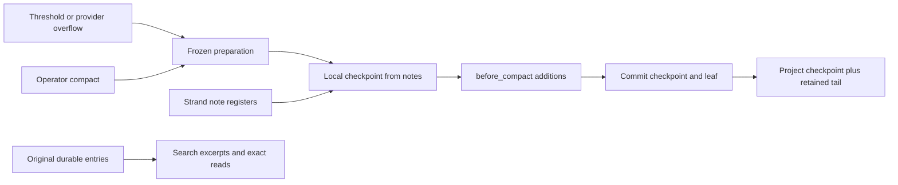

# Compaction

Compaction keeps a strand's model context bounded. (A strand is one agent
conversation inside a session, with its own branch of the conversation
tree.) Loom compacts by appending a checkpoint to the strand's branch. The
checkpoint holds a bounded snapshot of the strand's notes and a recent tail
of messages. Older entries stay in the store but stop appearing in the next
model request. The host builds the checkpoint locally; no model is asked to
summarize the transcript.

Every retained message in the tail is verbatim, with one exception: an
eligible large successful tool result may become an exact retrieval
reference.

This document describes the notes-based policy in PR #223. Deployment
starts fresh sessions. Resuming an in-flight task from the removed
summarizer implementation is outside this change's supported rollout.

The policy depends on three distinct mechanisms:

| Mechanism | Responsibility | Limit |
|---|---|---|
| `agent_note` and `agent_notes` | Maintain and retrieve the strand's working notes. | The model decides what to record; the harness does not prove completeness. |
| Compaction | Replace older projected conversation with a notes snapshot and recent messages. | Snapshot size is bounded; the newest exchange may exceed the recent-token target. |
| `history_search` | Find excerpts, then retrieve complete entries by session and entry IDs. | Search covers indexed text in registered repository sessions, not every possible source. |

The durable transcript is the source for recall under both the former
summarizer policy and this one; history was durable before this change
too. Removing the summarizer removes a provider dependency and a second
model's choice of what to preserve. In exchange, the working agent carries
more responsibility for note-taking and retrieval.

## The durable boundary

A `CompactionEntry` is an append, not a rewrite. It is parented on the
strand's current leaf and stores the replacement text plus the retained
messages. Publication moves the leaf in the same transaction, so a crash
exposes either the prior context or the committed checkpoint, never a
partially replaced conversation.

Projection (building the model's context from the tree) scans backward to
the newest compaction, includes it, and stops. The checkpoint text becomes
a user message, followed by the retained tail and any later entries.
Neither the notes nor recalled history become system instructions. The
original entries remain available to storage scans and exact history
reads.

The frozen structural contract still calls the replacement text `summary`
and the cut input `messages_to_summarize`. Those names do not imply a
summarizer call. This host supplies the text through `VerdictSupplied`; it
does not select the generation path. The retained structural machinery
also serves branch operations and remains part of the frozen interface.



`before_compact` extensions can append notes to a supplied checkpoint.
Their additions pass through the structural lifecycle before publication;
an extension does not rewrite the already committed transcript. The
checkpoint's 16 KiB note cap bounds the strand-note block only, not
extension additions or the eventual provider request as a whole.

## What survives a cut

`runtime/hooks.preparation` is shared by threshold, overflow, and operator
compaction. It selects a contiguous suffix using `keep_recent_tokens`, then
applies two retention rules:

1. Keep the newest assistant message and every message after it. Those
   messages can contain tool results or queued user input that the model
   has not read. Before the first assistant message, keep all input.
2. If the candidate boundary starts on a tool result, move it backward so
   the assistant call and its results stay together.

The token setting is a target, not a hard cap. For example, a batch that
returns 25,000 tokens survives a 20,000-token recent target. Trimming the
batch to meet the target could remove the result that caused the threshold
crossing before the agent ever reads it.

If this protected exchange cannot fit the model's window, compaction may
not recover enough room, and the existing overflow path reports failure. A
successful cut must not hide that failure by discarding unread input. If
nothing is eligible to cut, preparation is empty.

### Large tool results become references

After selecting the cut, Loom may replace a large successful tool-result
text inside the retained suffix with an exact history reference. The
original `MessageEntry` remains unchanged. A reference names the canonical
session and original entry UUID and keeps bounded head and tail excerpts.
It is emitted only when the host has registered `history_search` and the
tool is active on the strand.

These stay verbatim: results below 4,096 bytes, failures, images, ambiguous
or incomplete call pairings, and the newest assistant exchange. Call
arguments, provider signatures, tool names, namespaces, ordering, and the
cut itself are also unchanged.

A retained tail copied by an earlier compaction has no entry identity in
the copy. Reference preparation follows that compaction's parent branch
lazily. It accepts an origin only when the copied message is positionally
equal to the original projection. Orphan healing, or any other mismatch in
projection cardinality, clears all provenance. This fail-closed rule can
cost an optimization, but it cannot point a stub at the wrong durable
entry.

### The checkpoint text

The replacement text contains:

- the closed-window ordinal;
- the cut and retained message counts;
- the pre-cut context estimate;
- the strand's notes;
- any operator compaction instructions.

Its note block is capped at **16,384 bytes**, newest-written first. Older
notes may be omitted, and a single oversized note may be clipped. The text
marks any truncation and points to `agent_notes` for the complete board.
Bytes are not model tokens, and the rough four-characters-per-token
estimate is not a universal bound.

When a prior checkpoint exists on the branch, the new text includes its
session and entry IDs. A child strand can inherit a checkpoint while having
an empty note board of its own, and the reference makes that inherited
context retrievable without recursively embedding every prior checkpoint.
It does not guarantee that the child notices an omission, so the prompt
asks the child to copy relevant inherited requirements into its own notes.

## Notes and the system prompt

The default prompt instructs the agent to maintain a small set of current
notes: objective, constraints, decisions, progress, evidence, and next
steps. Stable keys are preferable to one new key per event, because the
snapshot has a fixed byte budget. Notes should include concrete file and
entry IDs, test outcomes, failed approaches, and unfinished work.

The prompt asks the agent to update notes before a large tool batch rather
than waiting for a capacity reminder. A single tool result can move
context from below the reminder point to above the compaction point. Loom
currently provides no guaranteed final note-writing turn.

Run-start note injection still matters. `client/notes.digest_hooks` appends
a user message containing up to **4,096 bytes** of the current strand's
notes; an empty board injects nothing. The injection refreshes mutable
notes that may have changed since the last checkpoint, including notes
written after it. The immutable checkpoint remains the snapshot published
at its own boundary.

Both renderings quote and attribute notes as historical data. Their fences
prevent the note text from closing the surrounding presentation, but they
do not prove that a model will ignore a malicious instruction in that text.
The prompt must preserve the distinction between recalled facts and
current instructions, and it asks the agent to verify facts against current
evidence when the distinction matters.

The system prompt is pinned for a session, and this rollout assumes new
sessions receive the new default. Mutable note contents are not inserted
into the system prompt, for two reasons: each update would change its
cached prefix, and model-authored records would gain instruction
authority they should not have. If an operator removes note or recall
tools, the model must respect its actual tool schema. The checkpoint
checks the strand's active tool list before advertising history search.

## Triggers and context introspection

Automatic compaction is checked at run checkpoints, including the boundary
where a run may finish. With context window `W` and reserve `R`, the
threshold is **estimated context > W − R**. The machine records which
trigger entry it already checked, so the same boundary does not request
compaction repeatedly. Host defaults are a 16,384-token reserve and a
20,000-token recent target; invalid settings disable compaction.

The context estimate folds the latest useful provider usage report together
with estimates for later messages. After a cut, it excludes usage reports
inside the carried tail, because those reports measured the context that
was replaced. Without that exclusion, an old report could immediately fire
the threshold again. The estimate remains approximate and does not promise
an exact provider-side count of every prompt, tool schema, or image.

The host uses each strand's configured model window, falling back to its
configured default when model facts are unavailable. Switching a strand to
a smaller model therefore changes the threshold it is measured against.

A transient reminder is appended to generation requests once context passes
**W − 2R**. It repeats while the strand remains in that band; it is not a
durable, one-time fallback phase. Threshold compaction runs before the next
generation, so a large enough result can skip the band entirely.

`context_remaining` reports, for the caller's strand:

- the current window ordinal;
- estimated usage;
- space before the checkpoint threshold;
- the recent-token target;
- the note count;
- whether compaction is disabled.

Its strand identity comes from harness coordinates, not model arguments.
It does not reserve capacity, write notes, or request a cut.

A provider context-overflow settlement can also trigger one recovery
compaction. The structural state records that attempt before publication,
so a later overflow follows the existing failure path instead of retrying
indefinitely. Operator `compact` uses the same preparation and publication
machinery. There is currently **no model-callable `new_context` or
equivalent compact tool**.

If checkpoint construction cannot read its required durable state, it
declines rather than claiming the strand wrote no notes. A declined
threshold compaction leaves the run alive. A declined overflow recovery
cannot recover the rejected request, so it drains the run. The original
transcript is still present in both cases.

## Search, exact recall and large results

`history_search` uses a repository-wide SQLite FTS5 index. Ordinary calls
take `query`, an optional `scope` (`repository` or `session`), and a hit
limit clamped to 1–50. Search returns ranked excerpts with canonical
session and entry IDs. SQLite currently chooses a 12-FTS-token snippet;
those are search-index tokens, not model tokens.

A second call retrieves the complete entry:

```json
{"action":"read","session":"<session ID from hit>","entry":"<entry ID from hit>"}
```

The host records source paths in the rebuildable index; the model supplies
IDs, never a database path. An exact read proceeds in four steps:

1. resolve the host's locator for the session;
2. open the source read-only;
3. validate its canonical session identity;
4. decode the stored entry with the ordinary total decoder.

The read neither acquires nor renews a writer lease and cannot create a
missing source. Unknown IDs, a mismatched source, corruption, or an
unavailable file produce explicit failures. Removing a session from the
index also removes its source locator.

Exact reads return the complete encoded entry, including fields that FTS
does not search. FTS extraction currently covers user, assistant, and
tool-result text plus compaction and branch-summary text. It does not index
tool-call arguments, thinking, images, or custom-entry payloads. Exact
reads can inspect those fields when an entry ID is known, but they do not
make an unindexed term searchable. Parent IDs in full entries also give
addresses for following preceding context. This extension does not
implement window listing or paged transcript browsing.

Entries larger than **65,536 bytes** spill to the content-addressed blob
store. The tool returns bounded excerpts and an explicit path, and does not
duplicate the complete payload in result details. A failed blob write
returns an error rather than truncated success. This tool implements the
spill itself; spill is not an automatic wrapper around every tool result.

The stored JSON may contain one very long line. `fs_read` refuses a
rendered window over 64 KiB and a file over 8 MiB, so line pagination alone
cannot read every blob. The result therefore directs the agent to bounded
byte-range reads through `bash`. If the host has disabled `bash`, such a
blob cannot be delivered. Blob spill bounds what reaches the model context;
it does not bound the decoded entry's peak allocation inside the harness.

Sessions are indexed while running and on reopen. There is no repository
backfill service, so a never-indexed session is not searchable, and a
removed or moved source may make an old hit unreadable. The index has no
authority over session commits; a failed sync does not roll back the
conversation.

A future vector index could share these source IDs and exact reads. FTS
would still serve exact names and errors, while embeddings could retrieve
semantically related passages. Such an index would remain derived data,
with its own rules for invalidation on model-version change and rewrite.
The current sqlight surface exposes no extension-loader API, so trusted
registration or binding support and release packaging would need
validation. This change introduces no embedding model or vector extension.

## Codex prior art and issue #132

[Issue #132](https://github.com/Roasbeef/loom/issues/132) discusses both
context policy and a separate projected task-state design. Notes-based
compaction does not implement that projected state, a transactional
`state_patch`, or a schema that proves task-state completeness.

The relevant Codex changes introduce several separate mechanisms:

| Codex change | Mechanism | Loom status |
|---|---|---|
| [#29743](https://github.com/openai/codex/pull/29743) | Local reset at token-budget compaction, retaining fresh initial context. | Local checkpoint publication; Loom also retains a recent exchange. |
| [#33255](https://github.com/openai/codex/pull/33255) | A final fallback phase with additional room and tools available before reset. | Not implemented; the transient reminder is weaker. |
| [#39827](https://github.com/openai/codex/pull/39827) | History window/item listing, exact reads and search; separate note operations. | FTS search and exact entry reads, plus strand notes. Window browsing remains absent. |
| [#40539](https://github.com/openai/codex/pull/40539) | A bounded thread hint, with native-provider handling. | Run-start note content and checkpoint snapshots use user-context messages. |

A hard reset, note persistence, note injection, retrieval, and a final
fallback phase are separate choices. Sharing some of them is not evidence
that Loom reproduces Codex's full behavior or quality. The current policy
follows the issue's later choice of notes as the default; it is not a
measured claim of superiority over summarization.

## Verification and remaining evidence

The deterministic tests cover preparation boundaries, checkpoint rendering
and truncation, context arithmetic, supplied checkpoint hooks,
provider-overflow recovery, exact cross-session reads, writer-lease
preservation, source validation, and large-entry spill. Scripted providers
establish the harness transitions. They do not establish whether a real
model writes useful notes or recalls an omitted constraint.

A quality comparison would need a real provider and at least two
compaction boundaries. It would:

1. hide checkable requirements, decisions, and tool-result canaries early
   in the conversation;
2. require real `agent_note` calls;
3. exercise a restart and a child strand with an independent board;
4. require exact retrieval of a fact omitted from the notes;
5. compare against a pinned summarizer baseline on final task correctness,
   missed constraints, recall success, note and retrieval tokens, latency,
   and provider cost.

That comparison has not been done. “State of the art” is an evaluation
target, not a property the architecture confers by itself.

## Source map

| Source | Responsibility |
|---|---|
| `core/entry.gleam`, `session/session.gleam` | Durable checkpoint format and context projection. |
| `machine/operation.gleam`, `machine/planner.gleam` | Frozen preparations, threshold guards and structural publication. |
| `runtime/hooks.gleam` | Usage accounting and retention boundaries. |
| `runtime/strand_runtime.gleam` | Hook execution and durable driver transitions. |
| `client/checkpoint.gleam`, `client/wiring.gleam` | Notes snapshot, prior-checkpoint references, reminder and host decisions. |
| `client/notes.gleam`, `prompt/default.gleam` | Run-start digest and agent note-taking protocol. |
| `tools/history.gleam`, `client/history.gleam` | Search/read tool contract and host-owned source resolution. |
| `events/search.gleam`, `storage/sqlite.gleam` | Rebuildable index and lease-free source reads. |
