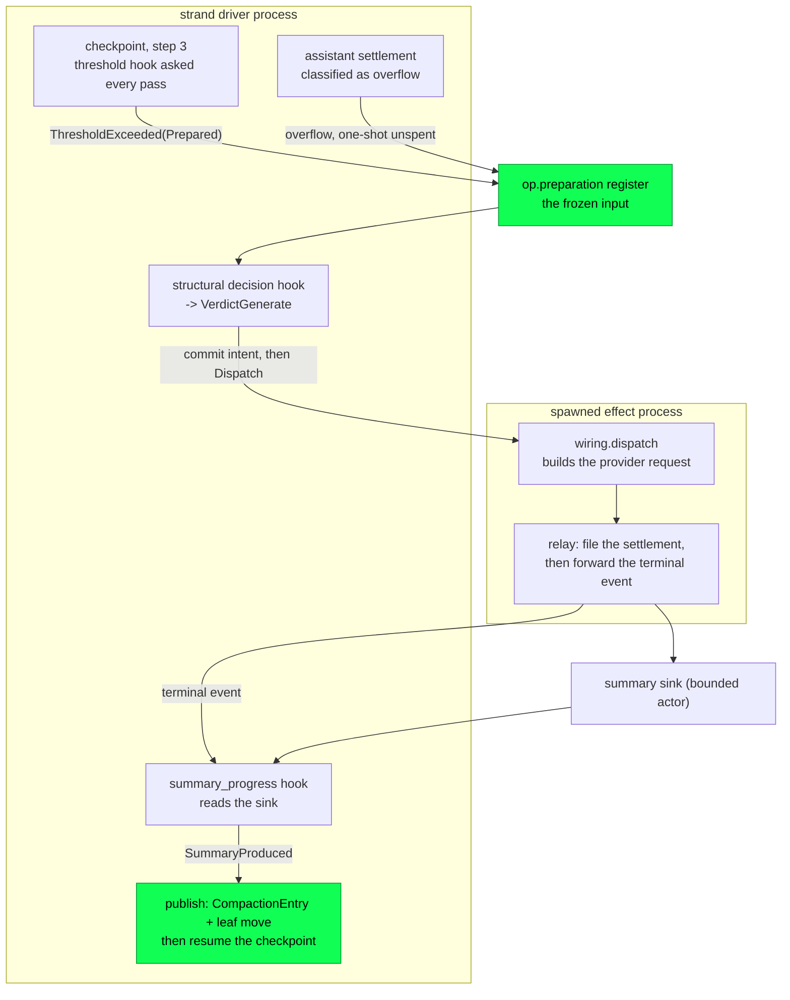

# Compaction

Every long session eventually holds more conversation than the model's
window will take. Compaction is what Loom does about it: summarize the
older half of a strand's context, keep the newer half verbatim, and
write both to the tree as one row. The machinery for that existed from
the durable entry type up through the state machine for most of the
project's life and none of it ran — the threshold was a constant that
never fired, every structural decision declined, and a production run
that overflowed its window drained as a terminal failure. It runs now,
and what follows is compaction as built.

Compaction straddles two of Loom's three planes. The durability
plane stores the checkpoint and stops reading at it
(`docs/architecture/durability.md`); the orchestration plane decides
when to write one and drives the provider round-trip that produces it
(`docs/architecture/orchestration.md`). The reasoning behind the
design — why the summary is a serialized transcript rather than the live
context, how pi and oh-my-pi solve the same problem, what the cache
arithmetic says — is `docs/design-notes/compaction-and-memory.md`, and
is not repeated here.

## Compaction is an append, not a rewrite

A `CompactionEntry` is one more write-once row in the conversation tree,
parented on the strand's current leaf, carrying the summary text and a
complete copy of the retained tail (`core/entry.gleam:53`). Nothing is
deleted. Every summarized message stays in the tree, navigable,
forkable, and indexable; what changes is only the *projection*, because
a context scan stops inclusively at the first compaction it meets
(`project`, `session/session.gleam:769`). Recovery therefore replays the
same context it had before the crash, since the compaction entry is in
the log like everything else.

The storage plane was built around this before it happened. The SQLite
branch index bounds its divergence copy at the newest compaction on the
path, which is what keeps forking from costing quadratic index growth —
so compaction is the thing that makes cheap forks stay cheap.

## The path, end to end

The two boxes are two processes. Everything in the first runs on the
strand driver; the provider round-trip runs on a process the driver
spawned and monitors. The sink between them exists because those halves
cannot hand a string to each other directly: the hook that asks whether
a summary was produced has no field to carry one, and runs on the wrong
process to have received it.

## What fires the threshold

Step 3 of the checkpoint procedure is the compaction check, and it runs
at every checkpoint of an open run, including the `MayFinish` boundary
where the run is about to end. Two conditions gate it: the run's
captured settings must have compaction enabled, and this boundary must
not already have been checked — `threshold_checked` names the trigger
entry whose check already ran, so a boundary is never checked twice
(`machine/planner.gleam:749`). What the machine reads is
`PlannerInputs.threshold`, which the runtime supplies as a plain value
on every pass of the drive loop (`threshold`,
`runtime/strand_runtime.gleam:1620`).

The hook behind it is built in production wiring from the catalogue's
own model facts rather than from a fixture: the threshold's context
window is the *strand's* — read from its durable configuration's own
catalogue entry, so a strand switched off the configured route is
measured against the window it will actually be dispatched into — and
only an identity the catalogue does not know falls back to the config's
declared figures (`compaction_hooks`, `client/wiring.gleam:303`;
`docs/architecture/models.md` has the routing side). The inequality is pi's —
compact once the context passes `context_window - reserve_tokens` — and
the defaults are pi's too, 16,384 reserve and 20,000 keep-recent, stated
once in `client/serve.gleam:677` (`default_reserve_tokens`) and
overridable from the environment. A setting that cannot describe a
working compaction — a non-positive keep-recent, or a reserve leaving no
room above the tail — disables compaction rather than firing a threshold
on every checkpoint and then preparing nothing
(`compaction_settings`, `client/serve.gleam:644`).

The hook reads the strand's context straight from the session store
rather than through the writer, which is what makes it callable from a
hook at all: both storage backends are actors, so the access serializes
with every other one. It reads the *durable* projection on purpose. A
threshold decision taken before a crash has to be taken again after it,
and process-local state would not survive to be re-taken. A strand with
no leaf, or a read that fails, projects as empty, which reads downstream
as "nothing to compact" — the safe direction, since no strand should be
halted because a token count could not be taken
(`project`, `runtime/hooks.gleam:323`).

## Counting the context the way the provider counts it

A pure estimate drifts against the provider on exactly the axes that
matter — cache reads, thinking tokens, the provider's own serialization
overhead — and it drifts *low*, which is the dangerous direction: a run
that believes it has room overflows instead of compacting. So the fold
is not an estimate when it does not have to be. It takes the newest
settled assistant message's provider-reported `total_tokens` out of the
projection and adds a characters-over-four estimate only for the
messages committed after it (`context_tokens`,
`runtime/hooks.gleam:423`). Everything that reaches the wire counts
toward the estimate — text, thinking, serialized tool-call arguments,
tool-result text — and an image counts as a flat 6,000 characters,
because its base64 payload is an order of magnitude larger than what a
provider bills for it (`estimate_message`, `runtime/hooks.gleam:375`).

Synthetic settlements report zero and are skipped: an abort or a
transport failure never described a real request, and an errored
response is dropped from the projection anyway
(`newest_reported`, `runtime/hooks.gleam:439`).

**The fold must skip what a compaction carried.** A `CompactionEntry`
holds a *copy* of its retained tail, so after a compaction the assistant
messages at the head of the projection are the same messages that were
in flight before it — and their reported usage describes the context
they were sent in, which was the large one the compaction just replaced.
Read one of those numbers and the threshold is crossed again on the very
next checkpoint, and on every checkpoint after that, forever: a session
that compacts once compacts on every operation for the rest of its life.
So the projection is handed to the hook together with a count of how
many leading messages the compaction contributed — its summary,
projected as one user message, plus every message of its retained tail —
and the fold starts after them (`Projected`, `runtime/hooks.gleam:269`).
That is pi's "reject usage older than the latest compaction" in the
shape Loom's projection makes available. When nothing after the carried
messages has a reported number yet, the whole projection is estimated
instead — an estimate of the small post-compaction context, never the
provider's memory of the large one it replaced.

`a_finished_compaction_does_not_re_fire_the_threshold_test` in
`packages/client/test/client/compaction_test.gleam` is the regression:
it compacts, prompts once more with a cheap turn, and asserts the tree
still holds exactly one compaction.

## The cost, recorded rather than hidden

`PlannerInputs.threshold` is a value, not a thunk, and that field is
frozen in spec Part 1. So an open operation pays one branch scan and one
projection per driver message — per poll tick, per doorbell, per settled
effect — whether or not anything is near the window.

Three things bound it. An idle strand never reaches `build_inputs` at
all, so a session sitting still costs nothing. The hook checks
`settings.enabled` before it calls a projection, so a host with
compaction off pays nothing either (`threshold`,
`runtime/hooks.gleam:569`). And the scan stops at the newest compaction,
so the window it grows in is exactly the window compaction closes — the
cost is bounded by the very thing it triggers. If it ever shows in a
profile, the fix is named: a memo keyed on the strand leaf's register
seq, since the branch is a function of the leaf and entries are
write-once. That memo is not built.

## Where the cut lands

Once the threshold is crossed, the same function that answered it builds
the split (`preparation`, `runtime/hooks.gleam:478`). It walks the
projection newest-first spending the keep-recent budget, and stops at the
first message that does not fit rather than skipping it, because a
retained tail has to be a contiguous suffix of the projection
(`recent`, `runtime/hooks.gleam:524`). Everything older than the
resulting boundary is what the summarizer is sent; everything newer
survives verbatim.

Then the boundary moves. **A cut point moves later off a tool result,
never earlier** (`cut`, `runtime/hooks.gleam:553`). A tool result at the
head of a retained tail is an answer to a call the model can no longer
see, so it belongs on the summarized side with the assistant turn that
made it, and moving the boundary later is what puts it there. The
direction matters as much as the rule. A boundary that only ever moves
later can only *shrink* the retained tail, so the keep-recent budget it
was just measured against still holds — and the cut can never come to
rest between an assistant turn and one of its results.

One consequence is worth naming rather than leaving as a stub: because
the boundary only ever moves later, it always lands on a turn boundary,
so this builder cannot produce pi's split-turn case. The preparation's
`is_split_turn` is correspondingly always `False` here, and
`turn_prefix_messages` is always empty. That in turn is why the
production progress hook never has to answer `SummaryNeedsRequest`: one
request per attempt is the whole loop.

A previous compaction's summary is not re-summarized: it travels as
`previous_summary`, which selects the pack's iterative-update prompt. Its
*retained tail* is, though — those messages survived one compaction and
would otherwise be dropped silently by the next.

When the walk leaves nothing older than the tail, the builder answers
`EmptyPreparation`, which the machine reads as "mark the boundary
checked and carry on" rather than as an error.

## The summary request

The structural decision hook in production always returns
`VerdictGenerate`: every compaction goes to a provider. `VerdictSupplied`
exists for a host that summarizes for itself, and a harness that used it
here would be answering its own compaction.

The words a summarizer reads live in the `prompt` package, as a second
pack alongside the system prompt, with its own version identity and the
same total decoder (`summary_source`, `prompt/default.gleam:241`). It
carries four sections — a summarization system prompt, an initial
compaction instruction, an iterative update instruction, a branch-summary
instruction — plus three fragments the input selects between. The format
is pi's, ported section for section: Goal, Constraints & Preferences,
Progress, Key Decisions, Next Steps, Critical Context, with explicit
instructions to preserve paths, identifiers, error messages, and
`sha256-` blob addresses verbatim.

The doomed messages reach the model as *text*, not as messages. They are
role-tagged, tool results truncated at 2,000 characters, and wrapped in a
`<conversation>` element the prompts describe as a record of the past
(`serialize`, `prompt/summary.gleam:270`). Nothing inside it can be
mistaken for a turn addressed to the model, no tool call in it can be
answered, and splicing goes through a substitution that never re-scans
what it just inserted — so a transcript containing a placeholder cannot
rewrite the instructions wrapped around it.

The request itself is one user message holding the system section and
the selected instruction concatenated, and nothing else: no `system`
field, no tool array (`summary_provider_request`,
`client/wiring.gleam:506`). It routes through the `Summarize` role when
one is configured, falling back to the strand's ordinary dispatch target
otherwise — for an on-route strand that is the role's chain, walked, and
only an off-route strand summarizes on exactly its captured identity —
routing a summary to a cheaper model is why the role exists, and unlike
a generation there is no durable identity contract to honour, since the
summary is published as text rather than as a response attributed to a
model (`summary_target`, `client/wiring.gleam:629`). An
operator's manual instructions reach the prompt from the operation's
durable state rather than from the preparation, because the preparation
is the frozen *input* the decision hook approved and the instructions are
a property of the operation that asked (`instructions_for`,
`client/wiring.gleam:561`).

### The cache decision is a request shape

Sending no system prompt and no tool array is the cost decision, not an
omission. The Anthropic adapter spends four cache breakpoints on every
request, and the two one-hour marks — the expensive, long-lived ones —
hang on exactly those two positions, because tools and system render
ahead of the messages and change at most once a session. A request that
carries neither writes no long-lived cache entry, and cannot disturb the
session's own pinned head, because it never sends one. That is pi's
`cacheRetention: "none"` expressed structurally rather than as a
convention someone has to remember: there is no flag to forget, and
`a_summary_request_pays_no_cache_write_on_the_head_test` in
`packages/client/test/client/wiring_test.gleam` pins the contrast
against an ordinary generation so the shape cannot leak the other way.

The honest residue: the adapter still hangs a rolling five-minute mark on
the last block of each of the final two user turns
(`mark_tail_user_turns`, `provider/adapter/anthropic.gleam:440`), and a
summary request has exactly one user turn. So it writes one five-minute
cache entry that will never be read — the next summary's bytes differ —
and pays roughly 1.25x base input on its serialized transcript instead of
1x. At a 150k-token compaction point that is real money. Removing it
needs a request-level flag in `provider`, which `ProviderRequest` has no
field for today. It is not built.

## The relay across the process boundary

The machine's structural loop is deliberately two-step. A nested summary
request settles as `ObservedSummaryReturned`, which carries only the
*usage* — the ledger row is what that transaction is for — and the
runtime then asks the `summary_progress` hook whether the attempt
produced a summary, needs another request, or failed. The hook's
arguments are `(operation, task_id, attempt)`. The response text is not
among them, and that signature is frozen.

The two halves also run on different processes. `client/wiring`'s
dispatch runs on the effect process the driver spawned; the hook runs on
the driver itself. So the text needs a rendezvous, and `client/summaries`
is it: a small actor keyed by the same triple the hook is asked about
(`key`, `client/summaries.gleam:148`), holding the newest 32 settlements
and dropping the oldest beyond that. A session compacts a handful of
times; the bound exists so a long-lived server cannot accumulate summary
text nobody will ask for again.

The recording happens in a wrapper around the provider surface rather
than inside it, so a host with its own provider — the scripted demo is
one — can still run the real hooks over it
(`recording_summaries`, `client/wiring.gleam:435`). The wrapper owns the
inner stream and **files the settlement before forwarding the terminal
event** (`record_summary_event`, `client/wiring.gleam:471`, through the
observer-before-forward seam in `client/provider_relay.gleam:85`). That
ordering is the whole point: by the time the effect process reports the request
settled and the driver turns around to ask for progress, the text is
already in the sink, so the hook's read is a question about a record that
exists rather than a race it might lose. A response that reached for a
tool is a failed attempt rather than a summary — the summarizer was sent
no tool array, so a call in the answer means it did something else — and
so is an answer with no text (`settlement_of`,
`client/wiring.gleam:437`).

Ownership flows inward on the same relay. Its public custodian monitors the
effect consumer and adopts the guard, private observer, and inner stream owner
before their work begins; the guard alone consumes the inner stream. Explicit
cancellation of the wrapper cancels the inner handle, and abort or driver
restart does the same without waiting for the provider deadline. A guard or
observer crash becomes an in-band transport failure, while a silent inner
owner becomes terminal `CancellationUnconfirmed` after one fixed grace. The
custodian remains alive as a drain witness until the registered subtree exits.
Consumer death records nothing. The record-before-forward law still applies
when a real settlement wins the race; cancellation never manufactures a
summary record.

**A missing record reads as retryable, never as an empty summary.**
Nothing in the sink is durable, and deliberately so. A record lost to a
crashed process, a reaped effect, or an evicted entry reads back as
absent, and the hook reports a retryable failure, so the machine starts
the attempt over and asks the provider again — exactly what it does for
an orphaned summary request (`summary_progress`,
`client/wiring.gleam:642`). Answering `SummaryProduced(summary: "")`
instead would publish a `CompactionEntry` whose summary is nothing at
all, silently replacing a conversation with a blank. Losing the text
costs one request; trusting the gap costs the conversation.

Neither end of the sink can take a strand down with it. Both calls check
that the actor is alive first, because `process.call` exits its caller
when the callee is gone: a dead sink must surface as a lost record, not
as a faulted driver or a crashed effect.

## What gets committed

Each nested request settles its own ledger row and clears the in-flight
marker in one transaction, so the next pass is unambiguously "between
requests" (`settle_summary_request`, `machine/planner.gleam:3031`). Those
rows carry no entry id, because they commit before the result entry
exists. When progress finally reports `SummaryProduced`, the publication
is a single transaction: the compaction entry parented on the current
leaf, carrying the summary, the complete retained tail from the frozen
preparation, the `tokens_before` the preparation recorded, a `from_hook`
of `False`, and the summarizer's display usage — plus the leaf move
(`compaction_publication`, `machine/planner.gleam:3437`). No extra usage
row is written on this path; the hook-supplied path writes one because
nothing else billed it, and the generated path already paid per request.

Where the run goes next depends on who hosted the work. An in-run
compaction restores the checkpoint it copied aside, already marked
threshold-checked, so the same boundary is never rechecked and the run
carries straight on to its generation step (`publish_structural`,
`machine/planner.gleam:3345`). A standalone compaction operation
finishes, with the new entry as its result leaf.

## When the compaction does not happen

Decline and failure both end an in-run compaction with nothing published,
and for both the first question is the `CompactionReason` — not the error
and not how far the retry ladder got. That is one rule read at two sites,
`decide_structural` for a decline (`machine/planner.gleam:2812`) and
`structural_failure` for a failure (`machine/planner.gleam:3370`).

**A threshold compaction is Loom's own clamp**, applied because the
context crossed an inequality the harness chose. Failing to apply it
costs the clamp, not the conversation: every message that was in the
tree is still in the tree, still projecting to the same context, still
the size it was when the last generation request fitted the window. So
the run restores the checkpoint the compaction copied aside and carries
on unsummarized, whether the compaction was declined by a hook or failed
past its retry ladder against a summarizer that was down.

**An overflow compaction is the provider's verdict** that the context
does not fit, and a run that cannot shrink a context the provider has
already refused has nowhere left to go. A declined or failed overflow
compaction drains the run, exactly as before.

What neither ever does is publish. An empty summary would replace the
conversation with nothing, and
`a_terminally_failed_summary_publishes_nothing_test` asserts the tree
gains no compaction at all.

### What the run does next, and why it is not nothing

A threshold compaction that failed leaves a question a decline does not:
the summarizer will be just as unavailable at the next boundary, and the
context did not shrink, so the threshold will be crossed again. Restoring
the checkpoint alone would re-enter the whole structural lifecycle — a
decision hook, a resolution, a full retry ladder of provider requests
against the same dead route — on every turn for the rest of the run.

So abandoning a threshold compaction also **switches threshold compaction
off for the remainder of that run**, by clearing `enabled` in the run's
own captured `CompactionSettings`
(`abandon_threshold_compaction`, `machine/planner.gleam:3317`). That is
the durable record of the attempt the backoff needs, and it needs no new
state: `enabled` is already the single gate step 3 reads
(`after_inbox`, `machine/planner.gleam:794`), already inside `op.state`,
and therefore already survives a crash-restore rather than re-opening the
gate on recovery.

The backoff interval is the operation. `RunSettings` is captured per
operation at acceptance, so the next prompt on the strand takes a fresh
snapshot with compaction enabled and asks the summarizer again. A
summarizer outage costs the run its compaction, not the session its
ability to compact.

The run then continues unclamped, which is survivable because the clamp
was never the only guard. Overflow recovery does not consult these
settings at all — a request that does not fit still diverts into a
compaction task (`settle_overflow`, `machine/planner.gleam:1224`) — so
the provider's own limit remains the backstop. If the summarizer is
still down when it fires, that compaction drains the run, and by then
draining is the honest outcome.

### Which failures leave the run alive

Not every structural error is about the summarizer, so the threshold path
consults one predicate before it decides to survive
(`fatal_to_the_context`, `machine/planner.gleam:3278`). It asks what the
error is a statement *about*. An unresolvable route, a provider that
would not answer, a summarizer that replied with a tool call instead of
a summary, a settlement lost with its process, an attempt orphaned at the
attempt cap — all of those describe the summarizer, and the run survives
them. An error that says the *context* does not fit describes the
conversation, and the run drains on it even from the threshold path.

The predicate is a denylist rather than an allowlist, deliberately. A
code it has never heard of, from a host's own hooks, is far likelier to
be one more way for a summarizer to be unavailable than a claim that the
conversation cannot continue — and the two mistakes cost differently.
Continuing when the run should have drained costs one more generation
request, which the overflow path catches. Draining when the run should
have continued costs the whole session, which is the failure this
distinction exists to prevent (issue #34). Corruption is untouched by
any of it: an undecodable register or an impossible observation is a
`Fault` raised at its own site, never an `OperationError`, so nothing
here can turn an impossible state into a survivable one.

`threshold_summarizer_unresolved_keeps_the_run_alive_test`,
`threshold_summary_failure_past_the_ladder_keeps_the_run_alive_test`,
`overflow_summarizer_unresolved_still_drains_test` and
`threshold_context_overflow_still_drains_test` in
`packages/machine/test/machine/failure_test.gleam` drive a failing
summarize route down each path and pin the four outcomes apart.

## What a later projection sees

Every context read afterwards scans the branch newest-first and stops
inclusively at the first compaction. The compaction is therefore the
oldest entry the scan returns, and the projection opens with its summary
rendered as a **user** message — the summary is injected context, not
model output — followed by its retained tail, and nothing earlier is read
(`project_entry`, `session/session.gleam:930-719`). The ordinary rules then
apply to the tail: errored, aborted, and deferred responses drop, and a
retained tool call whose result was severed by the cut heals with a
synthetic error result. On a settled history that healing is a no-op,
which is exactly what the cut rule buys.

Forks follow with no extra design. A fork is a new strand whose leaf
register points into the shared tree, so a fork taken *below* a
compaction has no compaction on its path and its scan runs to the root —
it sees the full history, unsummarized. A fork taken *above* one inherits
the summary and the retained tail like any other reader. Compaction is a
path-local event; siblings are untouched. The branch index's divergence
copy is bounded at that same compaction, which is the cheap-fork property
the storage plane was already built around.

## The other two ways in

**Overflow.** When a provider reports that the context does not fit, the
settlement classifies as an overflow and the machine asks the runtime for
a preparation before deciding anything (`settle_overflow`,
`machine/planner.gleam:1403`). The hook behind that key is the same
builder the threshold uses, asked unconditionally: a provider that says
the context does not fit has already evaluated the inequality, so the
only question left is whether there is anything to compact
(`overflow`, `runtime/hooks.gleam:613`). A preparation with something in
it diverts the run into a compaction task, committing the overflowing
response, its leaf move, its usage row, the preparation and the new state
as one transaction — so the compaction task can never exist without the
response that caused it — and resumes the same trigger with the one-shot
recovery marked spent, so a retried request cannot loop on overflow
(`enter_overflow_compaction`, `machine/planner.gleam:1289`). An empty
preparation, or a second overflow on the same step, drains the run as
`context_overflow`; so does a compaction that was declined or that failed
against its summarizer, which is where this path parts company with the
threshold's. Before the wiring existed the default preparation was
always empty, which is why an overflowing production run simply died.

**The manual command.** `Compact(strand, instructions)` accepts a
standalone compaction operation, and it goes through the same builder:
the client hub reads the strand's durable projection, prepares it with
the run's own settings, and hands the result to `machine/acceptance`
(`compaction_preparation`, `client/gateway.gleam:2566`). An
operator-requested compaction therefore cuts where an automatic one cuts,
keeps what an automatic one keeps, and carries a previous summary forward
the same way; a change to the cut rule cannot apply to only some of the
three entry points. When the projection has nothing older than the tail,
acceptance rejects with `NothingToCompact` rather than opening an
operation that would publish nothing.

## What is not built, and what is not proven

Stated plainly, because each of these reads like a feature from the
outside.

**Kill-and-recover mid-compaction has no production-hooks scenario.**
The compaction tests drive a real session and a real runtime through the
production seams, but none of them kills anything. The seam-level
equivalent is covered — a summary the sink does not hold starts the
attempt over and the compaction still lands
(`a_retryable_summary_failure_is_retried_test`) — and the machine-level
crash points are covered by the deterministic simulation
(`docs/architecture/simulation.md`), which trips thresholds, generates
summaries and prepares overflow compactions under injected faults
including a tree killed mid-flight. But the simulation
supplies its *own* hooks, with a placeholder preparation rather than
`runtime/hooks.preparation`; the enumerated interleave harness never
reaches compaction at all. Nothing yet crashes a strand mid-compaction
with the production builder installed.

**`make e2e` runs compaction live and never fires it.** The end-to-end
rig installs the production wiring with production's own settings —
16,384 reserve, 20,000 keep-recent — against a 200,000-token window, and
its scripted turns report a few hundred tokens apiece. So the threshold
never crosses. What that proves is that the compaction seams cost a
normal session nothing, not that they fire; the firing is proved in
`packages/client/test/client/compaction_test.gleam`, against a
10,000-token window, and in the gateway demo, which compacts `main` over the
wire and asserts the committed entry carries the text the provider
produced with `from_hook: False`.

**Branch summaries are wired everywhere except at the trigger.** The
prompt section exists, the request builder is total over both preparation
shapes, the machine's navigation host is built, and the projection
already renders a branch summary as user-message context. Nothing
dispatches one: `client/gateway` accepts every navigation with
`summarize: False`, so the navigation host never enters its structural
lifecycle.

**Cumulative file-operation tracking is not filled.** The preparation
carries a `FileOperations` record and the pack renders a `<read-files>`
/ `<modified-files>` block when it is non-empty, but the builder always
constructs it empty. Filling it means extracting paths from the tool
calls in the summarized span and merging the previous compaction's lists,
and it is a preparation change rather than a prompt one.

**`SummaryNeedsRequest` is never returned in production.** Because this
builder cannot produce a split preparation, one request per attempt is
the whole loop.

**The simulation never fails a summarizer.** Its `summary_progress` hook
answers only `SummaryProduced` or `SummaryNeedsRequest`
(`hooks`, `conformance/simulation/surface.gleam:1247`), so no seed drives
a structural failure and the seeded soak proves the survival rule only by
*not* regressing around it. Adding a refusing summarizer means a new
`script.Structural` variant, and drawing it would reshuffle every seed's
schedule — the corpus is the oracle, so a variant added here should stay
out of the weight table and be reached by an explicitly constructed
script. The rule itself is pinned at the machine level, in
`packages/machine/test/machine/failure_test.gleam`, and at the seam level
by `a_terminally_failed_summary_publishes_nothing_test`.

## Where the code lives

| Path | What it holds |
|---|---|
| `core/entry.gleam` | `CompactionEntry`: summary, retained-tail copy, `tokens_before`, `from_hook`, usage. |
| `session/session.gleam` | The compaction-stopped branch scan and the projection that opens with a summary and its tail. |
| `machine/operation.gleam` | `CompactionSettings`, the `Compacting` phase with its `resume_after`, `CompactionPreparation`, the structural decision states. |
| `machine/planner.gleam` | Checkpoint step 3, overflow diversion, the decide/generate/publish lifecycle, and the publication transaction. |
| `machine/acceptance.gleam` | `AcceptCompaction`, and the `NothingToCompact` rejection. |
| `runtime/effects.gleam` | The `ThresholdQuery` / `OverflowQuery` hook vocabulary, and the inert defaults. |
| `runtime/hooks.gleam` | The token fold, the carried guard, the one preparation builder, and the two compaction signals. |
| `runtime/strand_runtime.gleam` | Where the threshold is asked on every pass, and where an overflow preparation is fetched. |
| `prompt/summary.gleam` | The pack's vocabulary, the input types, and the transcript serializer. |
| `prompt/default.gleam` | `summary_source`: the shipped summarization pack. |
| `client/wiring.gleam` | The production hooks, the summary request shape, the recording relay, and the progress hook. |
| `client/summaries.gleam` | The bounded sink the relay files into and the hook reads. |
| `client/serve.gleam` | The defaults, their environment overrides, and the clamp that disables rather than misfires. |
| `client/gateway.gleam` | The manual `compact` command, over the same preparation builder. |
| `client/test/client/compaction_test.gleam` | Threshold, overflow recovery, retry, and terminal failure, through the production seams. |

Each path is relative to its package's source root — `runtime/hooks.gleam`
is `packages/runtime/src/runtime/hooks.gleam`. For intent,
`docs/design-notes/compaction-and-memory.md` carries the rationale and
the reference-implementation comparison; `docs/loom-implementation-spec.md`
Part 1.1 freezes `CompactionEntry` and §3.2 holds the normative
projection and budgeting rules — threshold compaction at checkpoints
only, once per trigger id, with reserve and keep-recent validated at set
time; `docs/spec-gaps.md` records where implementation refined the spec.
