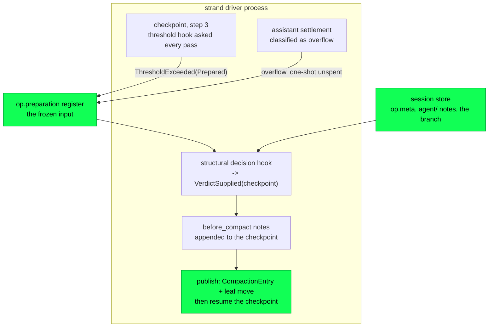

# Compaction

Every long session eventually holds more conversation than the model's
window will take. Compaction is what Loom does about it: cut the older
half of a strand's context away, keep the newer half verbatim, and write
both to the tree as one row — the retained tail as a copy, and in place
of everything older a **checkpoint** built from the model's own notes.
No provider is asked to condense anything. The mechanism for the cut
existed from the durable entry type up through the state machine for
most of the project's life and none of it ran; then it ran with a
summarizer model writing the text that stood in for the cut; and now it
runs with the strand's own `agent_note` cells there instead, the messages
that left still one `history_search` away. What follows is compaction as
built.

Compaction straddles two of Loom's three planes. The durability plane
stores the checkpoint and stops reading at it
(`docs/architecture/durability.md`); the orchestration plane decides when
to write one and what it says (`docs/architecture/orchestration.md`). The
reasoning behind the cut — how pi and oh-my-pi solve the same problem,
what the cache arithmetic says — is
`docs/design-notes/compaction-and-memory.md`, whose Part 2 also records
the summarizer design that shipped first and was removed; it is not
repeated here.

## Compaction is an append, not a rewrite

A `CompactionEntry` is one more write-once row in the conversation tree,
parented on the strand's current leaf, carrying the checkpoint text and a
complete copy of the retained tail (`core/entry.gleam:53`). Nothing is
deleted. Every cut message stays in the tree, navigable, forkable, and
indexable; what changes is only the *projection*, because a context scan
stops inclusively at the first compaction it meets
(`project`, `session/session.gleam:857`). Recovery therefore replays the
same context it had before the crash, since the compaction entry is in
the log like everything else.

The storage plane was built around this before it happened. The SQLite
branch index bounds its divergence copy at the newest compaction on the
path, which is what keeps forking from costing quadratic index growth —
so compaction is the thing that makes cheap forks stay cheap.

## What a compaction publishes, and why it is not a summary

Loom's first live compaction sent the cut messages to a summarizer model
as a serialized transcript under pi's Goal / Progress / Next Steps
prompt, published the prose it wrote, and at the next compaction sent
that prose back to be merged with the next cut. That is gone, and the
argument is about what each mistake costs. A summary condenses the
transcript once per compaction and again at the next, so a detail the
summarizer drops is out of the model's reach for good, and it drops it
silently — there is no signal that a constraint was lost until the model
acts as if it had permission. A note the model wrote is copied forward
whole at every boundary, and the transcript it came from is still in the
tree and still searchable, so the failure a missed note produces is a
recoverable one. The summarizer also had to be *there*: an overflow
compaction that could not reach its route drained the run, where a
checkpoint needs no provider at all.

So the text a compaction publishes is assembled locally, at the
structural decision, from three things (`for_operation`,
`client/checkpoint.gleam:189`; `render`, `client/checkpoint.gleam:300`):

- **A header naming the boundary.** Which window just closed (one-based,
  counting the compactions already on the branch), how many messages and
  about how many tokens left the context, how many newest messages follow
  verbatim, and where the cut messages went: `history_search` with scope
  `session` when this host registered the tool, and a plain statement
  that they cannot be recovered from here when it did not. It says
  "Nothing was summarized" in those words, so the model does not read
  its own notes as a summarizer's account of the past.
- **The strand's own notes.** Every `agent/{strand}/` blackboard cell the
  model wrote with `agent_note`, newest-written first, quoted inside the
  same `agent-notes` fence the run-start digest uses and attributed as a
  record the model made rather than an instruction addressed to it. The
  block is capped at `max_notes_bytes` (`client/checkpoint.gleam:118`),
  sixteen kilobytes — roughly four thousand tokens, a fifth of pi's
  keep-recent budget — with the oldest dropped first and a truncation
  line naming `agent_notes` for the rest. A strand that wrote nothing is
  told so, and told where notes go, rather than handed an empty fence.
- **The operator's `compact` instructions,** when the compaction was
  asked for with any, quoted and attributed in their own fence. They were
  written to steer what the checkpoint carries forward, and the model
  reads them in the operator's own words rather than a summarizer's
  paraphrase of them.

This is the shape Codex's Astra rollover ships as "notes across context
windows", and the policy issue #132 names `CheckpointAndReset`, with one
deliberate difference: Loom keeps the retained tail verbatim, so a
rollover never drops a tool result the model has not read yet.

The hook that decides is `client/wiring`'s structural decision
(`structural_decision`, `client/wiring.gleam:357`). It answers
`VerdictSupplied` with the checkpoint and no usage — nothing was billed —
and the machine publishes it as a hook-supplied entry, `from_hook: True`.
It declines two things. A branch summary, because notes describe a
strand's own work and say nothing about a branch it abandoned, and
nothing in the tree asks for one (`client/gateway` accepts every
navigation with `summarize: False`). And a checkpoint that could not be
built — an operation whose `op.meta` or preparation register would not
read, a strand whose notes or branch would not — because publishing "you
wrote no notes" over a store that did not answer would replace a window
with a false record of it. The machine's generate path, the structural
lifecycle that would dispatch a `SummaryRequest`, is left standing as the
frozen contract it is; no host selects it, the deterministic simulation
still drives it, and a summary request that somehow reached
`client/wiring`'s dispatch is refused terminally rather than sent, since
there is no prompt it could be made with (`prepare_dispatch`,
`client/wiring.gleam:437`).

## Telling the model before the cut

A checkpoint built from notes is only as good as the notes, and a model
that learns of a rollover afterwards cannot write them. Two things close
that gap, and they are the same arithmetic the threshold reads.

**The reminder.** The `context` hook — the slot the extension bus folds
its transforms over — appends one user message to a request once the
strand's context passes `reminder_point`, one reserve below the point
the threshold compacts at (`reminder_point`,
`client/checkpoint.gleam:433`; `near_limit_reminder`,
`client/wiring.gleam:386`). It says about how many tokens remain, that
what survives the boundary is the model's own notes and the newest
messages, and asks for the notes now — requirements, decisions,
approaches that failed and why, test results, exact identifiers. It is
stateless and recomputed per request, so it repeats while the context
stays in that band and stops the moment a compaction empties it; it rides
the transient projection and never the store, so a crash re-projects and
re-decides, the replay rule every hook is held to; and it re-projects the
strand from the store rather than pricing the list in hand, because the
fold has to know how many leading messages a compaction carried or it
reads the pre-compaction usage those carry and reminds forever (the same
guard "Counting the context" describes below). Codex measured periodic
capacity reminders as prompt churn and kept only the near-limit one; this
is the near-limit one.

**The model's own question.** `context_remaining` (`tool`,
`tools/context.gleam:94`) lets the model ask at any time: which window it
is in, about how many tokens are in use, how many remain before the
checkpoint, what the checkpoint keeps, and how many notes it has written.
The host fills the seam from the same projection and the same token fold
the threshold reads (`remaining_seam`, `client/checkpoint.gleam:508`) and
the same window the threshold measures against — the strand's own
catalogue entry, else the configured fallback (`strand_window`,
`client/wiring.gleam:593`) — so asked and told are one number, and the
model cannot be told one thing and compacted on another. The strand it
answers for is the caller's own, from the harness's coordinates, never an
argument. A host with compaction switched off says so rather than naming
a boundary that will never come.

The system prompt says the same thing once, in `identity`, so a model
writes notes from the start rather than from the first reminder
(`packages/prompt/CLAUDE.md`).

## The path, end to end

Everything runs on the strand driver, and nothing leaves the VM: there is
no effect process, no provider round trip and no rendezvous between
processes, because the checkpoint is a function of durable state the
driver can read directly. That is what a summary needed a sink actor for
(`docs/design-notes/compaction-and-memory.md`, Part 2) and what a
checkpoint does not.

## What fires the threshold

Step 3 of the checkpoint procedure is the compaction check, and it runs
at every checkpoint of an open run, including the `MayFinish` boundary
where the run is about to end. Two conditions gate it: the run's
captured settings must have compaction enabled, and this boundary must
not already have been checked — `threshold_checked` names the trigger
entry whose check already ran, so a boundary is never checked twice
(`machine/planner.gleam:749`). What the machine reads is
`PlannerInputs.threshold`, which the runtime supplies as a plain value
on every pass of the drive loop (`threshold`,
`runtime/strand_runtime.gleam:2483`).

The hook behind it is built in production wiring from the catalogue's
own model facts rather than from a fixture: the threshold's context
window is the *strand's* — read from its durable configuration's own
catalogue entry, so a strand switched off the configured route is
measured against the window it will actually be dispatched into — and
only an identity the catalogue does not know falls back to the config's
declared figures (`compaction_hooks`, `client/wiring.gleam:300`;
`docs/architecture/models.md` has the routing side). The inequality is pi's —
compact once the context passes `context_window - reserve_tokens` — and
the defaults are pi's too, 16,384 reserve and 20,000 keep-recent, stated
once in `client/serve.gleam:945` (`default_reserve_tokens`) and
overridable from the environment. A setting that cannot describe a
working compaction — a non-positive keep-recent, or a reserve leaving no
room above the tail — disables compaction rather than firing a threshold
on every checkpoint and then preparing nothing
(`compaction_settings`, `client/serve.gleam:957`).

The hook reads the strand's context straight from the session store
rather than through the writer, which is what makes it callable from a
hook at all: both storage backends are actors, so the access serializes
with every other one. It reads the *durable* projection on purpose. A
threshold decision taken before a crash has to be taken again after it,
and process-local state would not survive to be re-taken. A strand with
no leaf, or a read that fails, projects as empty, which reads downstream
as "nothing to compact" — the safe direction, since no strand should be
halted because a token count could not be taken
(`project`, `runtime/hooks.gleam:389`).

## Counting the context the way the provider counts it

A pure estimate drifts against the provider on exactly the axes that
matter — cache reads, thinking tokens, the provider's own serialization
overhead — and it drifts *low*, which is the dangerous direction: a run
that believes it has room overflows instead of compacting. So the fold
is not an estimate when it does not have to be. It takes the newest
settled assistant message's provider-reported `total_tokens` out of the
projection and adds a characters-over-four estimate only for the
messages committed after it (`context_tokens`,
`runtime/hooks.gleam:501`). Everything that reaches the wire counts
toward the estimate — text, thinking, serialized tool-call arguments,
tool-result text — and an image counts as a flat 6,000 characters,
because its base64 payload is an order of magnitude larger than what a
provider bills for it (`estimate_message`, `runtime/hooks.gleam:443`).

Synthetic settlements report zero and are skipped: an abort or a
transport failure never described a real request, and an errored
response is dropped from the projection anyway
(`newest_reported`, `runtime/hooks.gleam:517`).

**The fold must skip what a compaction carried.** A `CompactionEntry`
holds a *copy* of its retained tail, so after a compaction the assistant
messages at the head of the projection are the same messages that were
in flight before it — and their reported usage describes the context
they were sent in, which was the large one the compaction just replaced.
Read one of those numbers and the threshold is crossed again on the very
next checkpoint, and on every checkpoint after that, forever: a session
that compacts once compacts on every operation for the rest of its life.
So the projection is handed to the hook together with a count of how
many leading messages the compaction contributed — its checkpoint,
projected as one user message, plus every message of its retained tail —
and the fold starts after them (`Projected`, `runtime/hooks.gleam:335`).
That is pi's "reject usage older than the latest compaction" in the
shape Loom's projection makes available. When nothing after the carried
messages has a reported number yet, the whole projection is estimated
instead — an estimate of the small post-compaction context, never the
provider's memory of the large one it replaced. The checkpoint's own size
is inside that estimate, which is why `max_notes_bytes` is a compaction
parameter rather than a rendering detail: a checkpoint that could grow
without bound would be a checkpoint that could re-cross the threshold it
was written to clear.

`a_finished_compaction_does_not_re_fire_the_threshold_test` in
`packages/client/test/client/compaction_test.gleam` is the regression:
it compacts, prompts once more with a cheap turn, and asserts the tree
still holds exactly one compaction.

## The cost, recorded rather than hidden

`PlannerInputs.threshold` is a value, not a thunk, and that field is
frozen in spec Part 1. So an open operation pays one branch scan and one
projection per driver message — per poll tick, per doorbell, per settled
effect — whether or not anything is near the window. The reminder adds
one more projection per generation request, and the `context_remaining`
tool one per call the model makes.

Three things bound it. An idle strand never reaches `build_inputs` at
all, so a session sitting still costs nothing. The hook checks
`settings.enabled` before it calls a projection, so a host with
compaction off pays nothing either (`threshold`,
`runtime/hooks.gleam:647`). And the scan stops at the newest compaction,
so the window it grows in is exactly the window compaction closes — the
cost is bounded by the very thing it triggers. If it ever shows in a
profile, the fix is named: a memo keyed on the strand leaf's register
seq, since the branch is a function of the leaf and entries are
write-once. That memo is not built.

The compaction itself costs one more scan, filtered to compaction
entries, to number the window (`closed_windows`,
`client/checkpoint.gleam:262`), and one read of the strand's notes. Where
a summary request used to run a provider, that is the whole bill.

## Where the cut lands

Once the threshold is crossed, the same function that answered it builds
the split (`preparation`, `runtime/hooks.gleam:556`). It walks the
projection newest-first spending the keep-recent budget, and stops at the
first message that does not fit rather than skipping it, because a
retained tail has to be a contiguous suffix of the projection
(`recent`, `runtime/hooks.gleam:594`). Everything older than the
resulting boundary is what leaves the context; everything newer survives
verbatim.

Then the boundary moves. **A cut point moves later off a tool result,
never earlier** (`cut`, `runtime/hooks.gleam:624`). A tool result at the
head of a retained tail is an answer to a call the model can no longer
see, so it belongs on the cut side with the assistant turn that made it,
and moving the boundary later is what puts it there. The direction
matters as much as the rule. A boundary that only ever moves later can
only *shrink* the retained tail, so the keep-recent budget it was just
measured against still holds — and the cut can never come to rest
between an assistant turn and one of its results.

One consequence is worth naming rather than leaving as a stub: because
the boundary only ever moves later, it always lands on a turn boundary,
so this builder cannot produce pi's split-turn case. The preparation's
`is_split_turn` is correspondingly always `False` here, and
`turn_prefix_messages` is always empty.

A previous compaction's checkpoint is not re-processed: the notes it
carried are read fresh from the board at the next boundary, which is the
whole point — the board is the source of truth and the checkpoint is its
rendering. The previous compaction's *retained tail* is cut like any
other message, since those messages survived one compaction and would
otherwise be dropped silently by the next. The preparation still carries
the previous text as `previous_summary`, a frozen field nothing reads
now.

When the walk leaves nothing older than the tail, the builder answers
`EmptyPreparation`, which the machine reads as "mark the boundary
checked and carry on" rather than as an error.

## The extension's word at the boundary

An installed extension that declared `before_compact` is asked once per
compaction, at the structural decision, and every note it returns is
appended to the checkpoint after the harness's own text and the strand's
notes (`noted_verdict`, `runtime/strand_runtime.gleam:1453`). The block
is fenced `<extension name=…>` and attributed by the harness, and its
prose says what a model at the top of its next window needs to hear: that
this is an extension's aside placed in the checkpoint, not part of the
conversation and not the operator speaking (`note_block`,
`client/extension/hooks.gleam:1374`). It is a note and never a veto —
there is no answer that stops the compaction — and it is safe under the
replay rule for the same reason the reminder is: the decision is
transient until the publication commits it, so a crash before that
re-decides and re-asks. `docs/architecture/extensions.md` has the bus
side.

## What gets committed

When the decision supplies the checkpoint, the publication is a single
transaction: the compaction entry parented on the current leaf, carrying
the checkpoint, the complete retained tail from the frozen preparation,
the `tokens_before` the preparation recorded, `from_hook: True` and no
usage — no provider was billed, so no ledger row is written — plus the
leaf move (`compaction_publication`, `machine/planner.gleam:3517`).

Where the run goes next depends on who hosted the work. An in-run
compaction restores the checkpoint it copied aside, already marked
threshold-checked, so the same boundary is never rechecked and the run
carries straight on to its generation step (`publish_structural`,
`machine/planner.gleam:3413`). A standalone compaction operation
finishes, with the new entry as its result leaf.

## When the compaction does not happen

A declined decision ends an in-run compaction with nothing published, and
the first question is the `CompactionReason` — one rule read at
`decide_structural` (`machine/planner.gleam:2868`), and the same rule the
generate path's failure site reads (`structural_failure`,
`machine/planner.gleam:3370`), so a host that did select generation would
be held to it too.

**A threshold compaction is Loom's own clamp**, applied because the
context crossed an inequality the harness chose. Failing to apply it
costs the clamp, not the conversation: every message that was in the
tree is still in the tree, still projecting to the same context, still
the size it was when the last generation request fitted the window. So
the run restores the checkpoint the compaction copied aside and carries
on unclamped — and, to keep a store that will not answer from re-entering
the whole structural lifecycle at every later boundary of the run,
abandoning a threshold compaction also **switches threshold compaction
off for the remainder of that run**, by clearing `enabled` in the run's
own captured `CompactionSettings`
(`abandon_threshold_compaction`, `machine/planner.gleam:3317`). That is
already the single gate step 3 reads (`after_inbox`,
`machine/planner.gleam:811`), already inside `op.state`, and therefore
already survives a crash-restore. The backoff interval is the operation:
`RunSettings` is captured per operation at acceptance, so the next prompt
on the strand takes a fresh snapshot with compaction enabled and tries
again.

**An overflow compaction is the provider's verdict** that the context
does not fit, and a run that cannot shrink a context the provider has
already refused has nowhere left to go. A declined overflow compaction
drains the run. Under the checkpoint that is far rarer than it was: the
only way to decline is a store that will not read, where a summarizer
route that was down used to do it.

What neither ever does is publish. An empty checkpoint would replace the
conversation with nothing, and the decision hook never answers one: a
strand with no notes gets the header and the words "You wrote no notes
before this boundary", which is a true record rather than a blank.

### Which failures leave the run alive

The generate path's predicate over structural errors is still in the
machine (`fatal_to_the_context`, `machine/planner.gleam:3278`): an error
that says the *context* does not fit drains from either door, and
everything else — every way a summarizer could be unavailable — leaves a
threshold compaction's run alive. It is a denylist rather than an
allowlist, deliberately (issue #34), and
`packages/machine/test/machine/failure_test.gleam` still drives a
failing summarize route down each path and pins the four outcomes apart.
No production host reaches it now, because no production host generates;
it is documented here so the next reader does not mistake the machine's
generate path for dead code — the deterministic simulation exercises it
(`docs/architecture/simulation.md`), and a host that summarizes for
itself could select it tomorrow without a machine change.

## What a later projection sees

Every context read afterwards scans the branch newest-first and stops
inclusively at the first compaction. The compaction is therefore the
oldest entry the scan returns, and the projection opens with its
checkpoint rendered as a **user** message — the checkpoint is injected
context, not model output — followed by its retained tail, and nothing
earlier is read (`project_entry`, `session/session.gleam:948`). The
ordinary rules then apply to the tail: errored, aborted, and deferred
responses drop, and a retained tool call whose result was severed by the
cut heals with a synthetic error result. On a settled history that
healing is a no-op, which is exactly what the cut rule buys.

Forks follow with no extra design. A fork is a new strand whose leaf
register points into the shared tree, so a fork taken *below* a
compaction has no compaction on its path and its scan runs to the root —
it sees the full history, uncompacted. A fork taken *above* one inherits
the checkpoint and the retained tail like any other reader. Compaction is
a path-local event; siblings are untouched. The branch index's divergence
copy is bounded at that same compaction, which is the cheap-fork property
the storage plane was already built around.

## The other two ways in

**Overflow.** When a provider reports that the context does not fit, the
settlement classifies as an overflow and the machine asks the runtime for
a preparation before deciding anything (`settle_overflow`,
`machine/planner.gleam:1258`). The hook behind that key is the same
builder the threshold uses, asked unconditionally: a provider that says
the context does not fit has already evaluated the inequality, so the
only question left is whether there is anything to compact
(`overflow`, `runtime/hooks.gleam:685`). A preparation with something in
it diverts the run into a compaction task, committing the overflowing
response, its leaf move, its usage row, the preparation and the new state
as one transaction — so the compaction task can never exist without the
response that caused it — and resumes the same trigger with the one-shot
recovery marked spent, so a retried request cannot loop on overflow
(`enter_overflow_compaction`, `machine/planner.gleam:1298`). An empty
preparation, or a second overflow on the same step, drains the run as
`context_overflow`. Before the wiring existed the default preparation was
always empty, which is why an overflowing production run simply died;
`a_reported_overflow_compacts_and_retries_test` now proves the recovery
lands with no summarizer anywhere in the harness.

**The manual command.** `Compact(strand, instructions)` accepts a
standalone compaction operation, and it goes through the same builder:
the client hub reads the strand's durable projection, prepares it with
the run's own settings, and hands the result to `machine/acceptance`
(`compaction_preparation`, `client/gateway.gleam:2619`). An
operator-requested compaction therefore cuts where an automatic one cuts,
keeps what an automatic one keeps, and carries the same notes forward;
its instructions reach the checkpoint from the operation's durable state
(`instructions_for`, `client/wiring.gleam:472`), because the preparation
is the frozen *input* the decision hook approved and the instructions are
a property of the operation that asked. When the projection has nothing
older than the tail, acceptance rejects with `NothingToCompact` rather
than opening an operation that would publish nothing.

## What is not built, and what is not proven

Stated plainly, because each of these reads like a feature from the
outside.

**Nothing measures the checkpoint against the summarizer it replaced.**
Issue #132's comment asked for the same tasks under both policies before
either was promoted — task success, facts lost, human corrections,
tokens, recovery calls. The checkpoint became the only compaction by
decision, on the strength of the Astra design and the cost argument
above, not by that measurement; the summarizer path is gone from the
host, so the comparison would now be against a branch. If the model's
notes turn out too thin in practice, the levers are the prompt's
`identity` paragraph, the reminder's band, and `max_notes_bytes` — in
that order.

**There is no model-requested rollover.** Codex lets the model call for a
fresh window; Loom's compaction fires on the threshold, on overflow, or on
an operator's `compact`. A model that wants the boundary early has no
door, because a tool call inside a run cannot open a standalone operation
on the strand that is running, and admitting one at a checkpoint would be
a machine change (issue #132's `CheckpointAndReset` sketch). It is not
built.

**Windows are numbered, not addressable.** The checkpoint says "window 3
closed here"; `history_search` has no way to scope a query to one window.
A model recovering a detail searches the session and reads the hits.

**Kill-and-recover mid-compaction has no production-hooks scenario.**
The compaction tests drive a real session and a real runtime through the
production seams, but none of them kills anything. The machine-level
crash points are covered by the deterministic simulation
(`docs/architecture/simulation.md`), which trips thresholds, supplies and
generates summaries and prepares overflow compactions under injected
faults including a tree killed mid-flight — with its *own* hooks and a
placeholder preparation, not `runtime/hooks.preparation` or
`client/checkpoint`. Nothing yet crashes a strand mid-compaction with
the production builder installed. The window is smaller than it was: the
decision and the publication are one driver pass apart with no effect
process between them.

**`make e2e` runs compaction live and never fires it.** The end-to-end
rig installs the production wiring with production's own settings —
16,384 reserve, 20,000 keep-recent — against a 200,000-token window, and
its scripted turns report a few hundred tokens apiece. So the threshold
never crosses. What that proves is that the compaction seams cost a
normal session nothing, not that they fire; the firing is proved in
`packages/client/test/client/compaction_test.gleam`, against a
10,000-token window, and in the gateway demo, which compacts `main` over
the wire and asserts the committed entry is a hook-supplied checkpoint
opening with the window-boundary header.

**Branch summaries have no producer.** The machine's navigation host is
built and the projection already renders a branch summary as
user-message context, but the host declines every branch-summary
decision and `client/gateway` accepts every navigation with
`summarize: False`. Producing one would need words a checkpoint cannot
supply — notes describe a strand's own work, not a branch it abandoned —
so it needs a summarizer, and this host has none.

**Cumulative file-operation tracking is not filled.** The preparation
carries a `FileOperations` record and the builder always constructs it
empty. Under the checkpoint nothing renders it; the field stays because
the preparation is a frozen shape.

**The simulation never supplies a checkpoint from notes.** Its
`structural_decision` answers from a script, not from a board
(`hooks`, `conformance/simulation/surface.gleam:1282`), so no seed
exercises `client/checkpoint`'s reads; those are pinned at the seam level
in `packages/client/test/client/checkpoint_test.gleam`, against the same
registers the machine writes.

## Where the code lives

| Path | What it holds |
|---|---|
| `core/entry.gleam` | `CompactionEntry`: the checkpoint text, retained-tail copy, `tokens_before`, `from_hook`, usage. |
| `session/session.gleam` | The compaction-stopped branch scan and the projection that opens with a checkpoint and its tail. |
| `machine/operation.gleam` | `CompactionSettings`, the `Compacting` phase with its `resume_after`, `CompactionPreparation`, the structural decision states. |
| `machine/planner.gleam` | Checkpoint step 3, overflow diversion, the decide/publish lifecycle (and the generate path no host selects), and the publication transaction. |
| `machine/acceptance.gleam` | `AcceptCompaction`, and the `NothingToCompact` rejection. |
| `runtime/effects.gleam` | The `ThresholdQuery` / `OverflowQuery` hook vocabulary, `CompactionCue`, and the inert defaults. |
| `runtime/hooks.gleam` | The token fold, the carried guard, the one preparation builder, and the two compaction signals. |
| `runtime/strand_runtime.gleam` | Where the threshold is asked on every pass, where an overflow preparation is fetched, and where a supplied checkpoint gains its `before_compact` notes. |
| `client/checkpoint.gleam` | The checkpoint: its text, the store reads it is built from, the reminder, and the `context_remaining` seam. |
| `client/wiring.gleam` | The production hooks: the structural decision, the reminder on the `context` slot, the strand's window. |
| `client/notes.gleam` | The `agent/{strand}/` cells the checkpoint quotes, and the run-start digest of the same. |
| `tools/context.gleam` | The `context_remaining` tool. |
| `client/serve.gleam` | The defaults, their environment overrides, the clamp that disables rather than misfires, and the seam's registration. |
| `client/gateway.gleam` | The manual `compact` command, over the same preparation builder. |
| `client/test/client/compaction_test.gleam` | Threshold, overflow recovery, the re-fire guard, the reminder, and the `before_compact` note, through the production seams with a provider that cannot summarize. |
| `client/test/client/checkpoint_test.gleam` | The checkpoint's text and bounds, and its reads against the registers the machine writes. |

Each path is relative to its package's source root — `runtime/hooks.gleam`
is `packages/runtime/src/runtime/hooks.gleam`. For intent,
`docs/design-notes/compaction-and-memory.md` carries the rationale and
the reference-implementation comparison, including the summarizer design
this replaced; `docs/loom-implementation-spec.md` Part 1.1 freezes
`CompactionEntry` and §3.2 holds the normative projection and budgeting
rules — threshold compaction at checkpoints only, once per trigger id,
with reserve and keep-recent validated at set time; `docs/spec-gaps.md`
records where implementation refined the spec.
