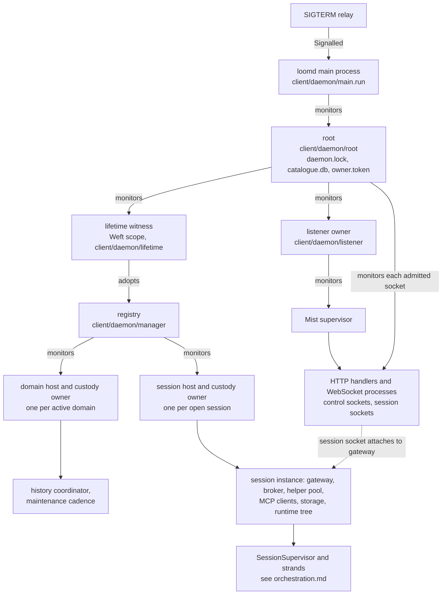
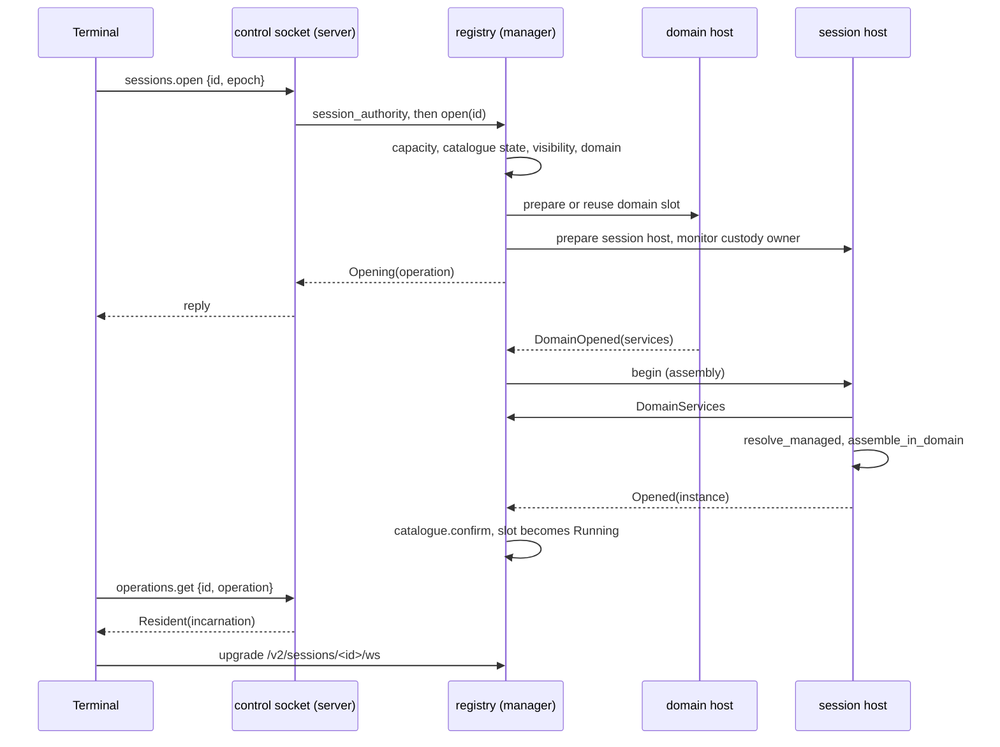

# The daemon process

`loomd` is the one long-lived BEAM VM that hosts every session a user has
open, across workspaces. It owns the private state root, the session
catalogue, the owner credential, and a single loopback listener. It opens
no conversation on its own: a session's runtime starts only when an
authorized client asks for it, and a restarted daemon comes back with every
session closed. This doc is the map of that process. It follows `loomd` from
the command line to a listening socket, draws the ownership tree down to the
point where a session's own supervision tree begins, and then follows a
client from connection to attached session, and the daemon from a shutdown
request to exit.

The daemon sits above all three planes rather than inside one. Each session
it admits carries its own durability plane (a conversation database and its
writer), its own orchestration plane (the runtime tree in
[orchestration](orchestration.md)), and its own effect plane (a broker and a
pool of jailed helpers, in [effects](effects.md)). The daemon's job is
custody: deciding when those pieces may start, and refusing to let a
replacement start until the previous one has provably stopped. Two
neighbouring docs own parts of this story in detail.
[Sessions](sessions.md) owns the catalogue, session ownership, domains, and
the one-process model. [Client](client.md) owns the endpoint record, the
launcher, the v2 wire, and the gateway. This doc links to them rather than
repeating them.

## The pieces

The daemon is built from a small number of long-lived processes, each with
one job:

- **`client/daemon/main`** parses flags, reserves the endpoint record,
  starts the root, starts the listener, publishes readiness, and then
  waits for a signal or for the root to exit.
- **`client/daemon/root`** is the lifetime owner. It holds the daemon lock,
  the catalogue connection, and the owner credential; it admits every
  connection against the connection limits; and it orders shutdown.
- **`client/daemon/lifetime`** starts the session registry inside one Weft
  scope and hands the root a witness process whose normal exit proves that
  every session and domain has retired.
- **`client/daemon/manager`** is that registry. It serializes catalogue
  access, admits session opens against the capacity limit, holds one slot
  per open session and one per active domain, and answers authorization
  questions for every connection.
- **`client/daemon/listener`** owns the Mist HTTP server so that the root
  can monitor it before any socket is accepted.
- **`client/daemon/server`** routes HTTP upgrades, authenticates bearers,
  and serves the `/v2/control` socket. **`client/daemon/session_socket`**
  serves `/v2/sessions/<id>/ws` and connects each socket to one session's
  gateway.
- **`client/serve`** assembles a session. The daemon calls three of its
  functions: `serve.build_domain` for a domain's shared services,
  `serve.resolve_managed` to turn a catalogue registration into settings,
  and `serve.assemble_in_domain` to build the session itself.

Smaller modules (limits, domain services, snapshot transfer, the control
codec, and `loomd access`) are listed in the table at the end. Below all of
them, `host/endpoint` and `host/bootstrap` supply the discovery record, the
kernel locks, and process identity.

## Startup, in order

The binary's entry point is `client.main`. It answers `--help` and `-h`
without starting anything, sends `loomd access ...` to `client/daemon/admin`
and `loomd ext ...` to the extension installer, and passes every other
argument list to `client/daemon/main`. That split lives in `client.gleam`
rather than in `client/serve` because the extension installer imports
`client/serve`, and Gleam forbids the cycle.

Usually a terminal launches the daemon, and that launcher holds
`launch.lock` while it spawns a paused wrapper and writes a `Starting`
record naming the wrapper's PID and birth identity. [Client](client.md)
("Discovery, credentials, and safe startup") and [sessions](sessions.md)
("Implemented shared endpoint boundary") describe that half. Once released,
the wrapper execs the VM, and `client/daemon/main` runs these steps:

1. **Parse flags.** `main.parse` reads `--state-dir` (default
   `$HOME/.loom`), `--bind` (a literal `127.0.0.1:port` or `[::1]:port`;
   port 0 asks the kernel for one), `--capacity` (1 to 1024, default 8), and
   `--owner-name`. The remaining flags (`--config`, `--helper`,
   `--read-scope`, `--network`, `--codemode-seed`, `--codemode-seams`,
   `--best-effort`, `--full-enforcement`) are not interpreted here. They
   are kept as `session_defaults` and handed to each session's resolver
   when that session opens. No file is opened during parsing.
2. **Claim the endpoint.** `main.claim_endpoint` observes this VM's own PID
   and birth identity, takes `launch.lock`, and calls `endpoint.claim`.
   Claiming adopts a `Starting` record whose PID and birth match this VM,
   writes a fresh `Starting` record if the old owner is observed gone, and
   refuses if a live VM still owns the record. A daemon started by hand in
   the foreground writes its own reservation in this step.
3. **Prepare the root.** `main.prepare` reads the `[daemon]` limits from the
   last `--config` file, if any, and calls `root.start` with a
   `manager.Assembly`: the four callbacks the registry uses to build a
   domain, build a session, list a session's fatal processes, and drain a
   session at shutdown. `root.start` only spawns the root's state machine.
   It touches no file, so the caller holds a handle it can shut down even if
   everything after this fails.
4. **Drive the root to `Serving`.** `main.listen` calls `root.ready`, and
   the first readiness request moves the root from `Dormant` to `Starting`.
   The root then acquires one resource per turn, committing each to its
   state before taking the next:
   1. create the private state directory and `sessions/`, and refuse a
      symlinked `daemon.lock` or `catalogue.db`;
   2. take `daemon.lock`, the daemon's lifetime lock, and monitor the lock
      helper;
   3. open `catalogue.db`;
   4. read `owner.token`, or mint and write it if neither the file nor an
      owner record exists, and register its digest as the owner principal;
   5. mint a random daemon epoch and call `lifetime.start`, which starts
      the registry under a Weft scope and returns its witness. The root
      monitors the witness and enters `Serving`.

   Restoring the catalogue in this step creates an empty registry. No
   session opens.
5. **Start the listener.** `root.start_listener` prepares a parked
   `listener` owner, monitors it, and only then sends it `Begin`, which
   starts Mist. The listener reports the port the kernel chose.
6. **Publish readiness.** `main.publish_endpoint` takes `launch.lock` again
   and replaces the matching `Starting` record with `Ready`, adding the
   host, the actual port, the epoch, and the build identity. A launcher
   waiting on the record treats the daemon as ready only after an
   authenticated control hello names that epoch.
7. **Wait.** `main.run` prints the control URL, relays SIGTERM into a
   subject, and blocks until either a signal arrives or the root exits.

If any step from 4 onwards fails, `main.run` logs `daemon.start_failed`,
calls `root.shutdown` with a 30-second budget, and halts with status 1. The
ordering exists so that nothing the daemon acquires can escape cleanup:
every resource is recorded by its owner before the next acquisition starts,
and the listener cannot accept a socket before the root is monitoring it.

## The ownership tree

The daemon does not use OTP supervisors with restart strategies. Each owner
is an unlinked state machine that traps exits and holds the original
monitor of whatever it started. A restart would be wrong here: a registry
restarted empty would forget sessions whose effects are still running. So
an owner that loses a child's proof of retirement stops admitting work and
keeps its locks instead. The diagram shows who monitors whom, from the VM's
main process down to the point where a session's runtime tree begins.

Everything above the registry exists once per daemon. Everything below it
exists once per domain or once per open session, and comes and goes with
opens and stops. The session instance is the value `serve.assemble_in_domain`
returns. Its runtime tree, the rest-for-one `SessionSupervisor` with its
writer, drain ledger and strand factories, is described in
[orchestration](orchestration.md) under "The supervision tree".

Each host pairs a builder process (`client/internal/instance_host`) with a
custody owner (`client/internal/instance_owner`). The builder runs
assembly and stays alive afterwards. As assembly acquires each resource,
it publishes that resource's cleanup to the custody owner before it
starts the next. If the builder dies, the custody owner runs the published
cleanups in a fixed order: runtime, services, broker, helpers, MCP clients,
storage (which releases the writer lease), then the address namespace. The
custody owner exits normally only if every cleanup succeeded. That normal
exit is the event the registry waits for before it frees the slot.
[Sessions](sessions.md) ("Catalogue and ownership components" and "Instance
resources") covers this custody layer in detail.

The root tracks its own lifecycle in a `Phase`: `Dormant`, `Starting`,
`Serving`, `Stopping`, `Refused`, `RecoveryBlocked` and `Closed`. Only
`Serving` admits new connections. `Refused` means startup failed before
the registry existed. `RecoveryBlocked` means the root lost proof that
something retired, and it is permanent for this VM (see "Failure
behaviour").

## Admitting a connection

Every client reaches the daemon through the one listener, which serves two
routes and answers 404 to anything else. `/v2/control` carries catalogue
and lifecycle commands. `/v2/sessions/<id>/ws` carries one session's
conversation. [Client](client.md) ("The authenticated v2 boundary")
describes the wire contract, and
[protocol 015](../../protocol-change/015-daemon-control-and-session-attachments.md)
defines it.

Admission on either route has the same shape:

1. `server.handle` asks the root for readiness (a one-second budget), takes
   the `Authorization: Bearer` header, hashes it with SHA-256, and asks the
   registry to authenticate the digest. Any failure is a 401, and the
   plaintext credential never leaves this function.
2. The HTTP handler process calls `root.acquire` with a connection class:
   `Control`, `Observer`, or `Operator`. The root refuses if the connection
   count or the reserved-byte total would pass its limit (see "Resource
   limits") and otherwise records a reservation, monitored, against the
   HTTP process. A refusal is a 503 whose text names the setting to raise.
3. The handler upgrades to a WebSocket. The new socket process queues an
   `Admit` message to itself in its initializer, and in its first handler
   turn calls `root.transfer`. The root monitors the socket process before
   it drops the HTTP process's monitor, in one turn, so the reservation is
   never unowned.
4. The HTTP handler waits (up to five seconds) for the socket process to
   report that the transfer was attempted. It then calls `root.release`,
   which frees the reservation only if it was never transferred, and
   returns.

The transfer runs in a handler turn, not in the initializer, because Mist
gives a WebSocket initializer 500 ms and kills the socket if it overruns.
The transfer and the session attach together have budgets of about six
seconds, which a loaded daemon can need. Because Mist arms the socket only
after the initializer returns, `Admit` is always the first message the
handler receives. A peer's frame cannot arrive before admission. Once admitted,
a reservation is released only by the socket process's own exit, so a
parser that might still be running is never uncounted.

A control socket then sends a `hello` event carrying the protocol version,
the daemon epoch, the principal ID, the daemon's build version and commit,
and its limits. Clients compare the epoch against the endpoint record and
the build against their own.

## Opening a session

Opening a session is two separate client actions: an `open` command on the
control socket, which starts the runtime, and a session-socket connection,
which attaches to it. The open path never attaches, and the attach path
never opens.

In more detail:

1. **Control check.** `server.dispatch` for `OpenSession` checks the
   supplied epoch against the daemon's, asks the registry for this
   credential's authority over the session, and requires Owner or Operator
   authority. An Observer cannot open a session.
2. **Admission in the registry.** `manager.open` runs one serialized turn.
   An existing slot answers with its current state, so concurrent opens of
   one session share one operation. Otherwise the registry refuses when
   every slot is taken (`Capacity`), when the catalogue row is still
   `Reserved` (`NotInitialized`; only a create retry can finish it), or
   when the session is archived (`SessionArchived`). It then reads the
   session's domain from the catalogue and reserves or reuses a domain
   slot. Finally it prepares a parked session host, monitors its custody
   owner, and records a slot in the `WaitingForDomain` phase. The operation
   ID is the epoch plus a counter, so an operation from an earlier daemon
   can never match.
3. **Immediate reply.** The registry answers `Opening(operation)` without
   waiting for assembly. Heavy work never runs inside the registry, which
   must keep answering authorization questions for every attached socket.
4. **Domain services.** If the domain was not already running, its host
   runs `serve.build_domain` through the `domain_build` callback, which
   starts the shared history coordinator and, if configured, the
   maintenance cadence. When the services publish, the registry releases
   every session builder waiting on that domain. [Sessions](sessions.md)
   ("Shared domain resources") covers domain reuse, revival and retirement.
5. **Session assembly.** The released builder asks the registry for its
   domain's services, then runs the `build` callback that `main.prepare`
   supplied. That callback resolves settings with `serve.resolve_managed`,
   which reloads the registration's saved configuration and canonical
   workspace (never the daemon's working directory) and adds the state-root
   masks to the sandbox policy. It attaches a peer directory, then calls
   `serve.assemble_in_domain`, which builds the session's storage, broker,
   helper pool, services, gateway and runtime tree under the custody owner.
   The result is projected to `serve.Resident`, which holds only the
   gateway's address, the peer endpoint, the fatal process list and a drain
   handle. The registry therefore never copies a whole session graph.
6. **Confirmation.** On `Opened`, the registry confirms the registration in
   the catalogue and moves the slot to `Running`. The client, polling
   `operations.get`, now receives `Resident(incarnation)`.
7. **Attach.** The client connects to `/v2/sessions/<id>/ws`.
   `server.session_upgrade` checks the credential's authority, reads the
   session's status, requires `Resident`, and resolves the instance for
   that exact incarnation in one registry turn, so a stop and reopen in
   between refuses the upgrade. `session_socket.upgrade` transfers the
   reservation and calls `gateway.attach_authenticated_flushing`. The
   socket monitors the gateway process it attached to, not the gateway's
   name.

Every later frame on the session socket is re-authorized by
`manager.frame_authority`. It answers the daemon epoch, the session
incarnation and the credential's current membership in one registry turn,
and the gateway asks it twice per command: once on admission and once
before delivering the reply. Its four refusals (`StaleEpoch`,
`StaleIncarnation`, `Unauthorized`, `RegistryUnavailable`) stay distinct so
that a revoked credential is reported as a revocation, not as an outage.

A failed assembly is logged by `main.start_class` as
`daemon.session_start_failed` with a fixed stage and class, and never with
the raw reason, which can contain a path. For a held writer lease the log
also carries `lease_expires_at_ms`, the time the session will next open;
[sessions](sessions.md) ("Reopening after an unclean exit") explains why.
The registry remembers the failed operation, so `operations.get` answers
`StartFailed` rather than `StaleOperation`.

## The control surface

The control socket carries every catalogue and lifecycle command. Each
frame is at most 64 KiB and decodes through `client/daemon/protocol`. The
server does not cache authentication: every frame re-authenticates the
digest, so a revoked credential stops working on its next request.

`server.control_use` sorts each command into a read or a mutation. Reads
keep working while the daemon drains; mutations need the root to be in
`Serving`.

| Kind | Commands | Authority |
|---|---|---|
| Read | `Status` | Any authenticated principal |
| Read | `ListSessions`, `GetSession`, `GetOperation` | A member of the session; listing shows only the sessions the credential may see |
| Read | `ListArchivedSessions`, `WorkspaceDefault` | Owner |
| Session lifecycle | `CreateSession`, `OpenSession`, `StopSession`, `DeleteSession` | Create, stop and delete are owner-only; open needs Operator or Owner |
| Metadata | `RenameSession`, `ArchiveSession`, `RestoreSession`, `SetDefault`, `IsolateSession` | Owner |
| Membership | `Invite`, `SetRole`, `RevokeMembership`, `RotateCredential`, `RevokeCredentials` | Owner |
| Peer mail | `LinkPeers`, `UnlinkPeers`, `SendPeer` | Owner |
| Daemon | `Shutdown` | Owner |

Most commands that change a session or its membership, and `GetOperation`,
carry the epoch the client saw in `hello`; a mismatch is refused as
`stale_epoch`. Destructive checks run inside the
registry's own turn rather than in the server: delete, for example,
re-checks the owner, the epoch and the absence of a live slot in the same
turn that removes the catalogue rows. [Sessions](sessions.md) and
[multiplayer](multiplayer.md) define what each command does to the
catalogue and to membership.

`Status` returns `manager.Summary`: whether admission is open, the session
capacity with its opening, resident, stopping and blocked counts, and the
same census for domains. It is the daemon's health report; the listener has
no separate health route.

`loomd access` (`client/daemon/admin`) is the operator's command-line path
to the owner-only membership commands and `IsolateSession`. It reads the
`Ready` endpoint record, checks that the recorded VM is still present,
reads `owner.token`, verifies the `hello` epoch, and sends exactly one
command. It never starts a daemon or opens a session. A lost reply is
reported as an unknown outcome and is not retried.

## Resource limits

The daemon enforces two independent kinds of limit. Session capacity bounds
how many runtimes may exist at once. Connection limits bound how many
sockets, and how much message payload, the listener will accept.

| Limit | Set by | Default | What it bounds |
|---|---|---|---|
| Session capacity | `--capacity` (1 to 1024) | 8 | Session slots in every phase, including opening, stopping and blocked |
| Domain capacity | same value | 8 | Domain slots, including closing and blocked |
| `max_connections` | `[daemon]` table | 64 | HTTP reservations and admitted WebSockets combined |
| `max_reserved_message_bytes` | `[daemon]` table | 512 MiB | Sum of every admitted connection's charge |

A connection's charge is its largest allowed inbound message plus, for
session sockets, an 8 MiB delivery allowance. Control and Observer sockets
accept 64 KiB messages and Operator sockets accept 32 MiB, so an operator
socket costs 40 MiB of the budget. The allowance covers what the daemon
may hold for a slow reader at once (overlapping metadata cuts, encodings,
fragments and replies), rounded up. It is an accounting bound, not a
measurement of BEAM heap or RSS.

The `[daemon]` table is read once at startup from the last `--config`
file. `client/daemon/limits` rejects unknown keys and non-positive values,
and it also accepts a `profile` boolean, which the launcher reads. Session
configuration cannot change a running daemon's limits; raising one means
restarting the daemon, which is what the refusal text says.

Slots stay counted until their cleanup is proven. A stopping or blocked
session still occupies a session slot, and a failed cleanup keeps its slot
until the VM exits. This is deliberate: freeing a slot on a timeout would
let a second writer start beside a first whose effects might still be
running.

## Snapshot transfer

`client/daemon/transfer` paces how an attached session socket receives the
session's history. It is a pure state machine; the gateway performs the
storage reads it asks for. A transfer starts when a client subscribes (the
`Recent` window, at most one hundred descriptors), catches up from a
sequence (`Reconcile`), pages older history (`History`), or fetches
specific escalations (`Escalations`).

Delivery is stop-and-wait: each `SnapshotNext` from the client buys one
fragment of at most 24,576 raw bytes, which fits below the 64 KiB observer
message limit once encoded. The transfer holds at most one descriptor page
and never builds a queue of replies, so a slow client costs the daemon a
bounded amount of memory. Its metadata must encode within 2 MiB before the
transfer starts. A transfer expires 30 seconds after capture. Each storage
read it requests is funded with between one and five seconds; when less
than a second remains, `transfer.step` returns `Exhausted`, and the client
captures a fresh transfer. Without that floor, a read funded with the last
few milliseconds would time out and look like a stalled storage actor.

This module moves a snapshot to one socket. It does not move a session
between daemons; nothing in the daemon does.

## Shutdown

Four events start a shutdown: SIGTERM, an owner's `Shutdown` control
command, the death of the process that started the root, and the listener
exiting on its own while the root is serving. All four reach the same
`stop` path in the root. The `Shutdown` command replies `draining` first and
requests shutdown only after that reply is written, so the owner sees the
acknowledgement before sockets close.

The root then runs these steps:

1. **Close admission.** The root enters `Stopping`. New connections are
   refused, existing control sockets keep read access, and mutations are
   refused.
2. **Return held input.** The root starts a Weft task with a seven-second
   deadline that calls `manager.drain_held`. The registry hands back one
   drain callback per resident session, and the task runs them outside the
   registry, all sharing one five-second budget. Each callback
   (`serve.drain_resident`) makes the session's gateway return queued
   prompts to their submitters, unsent, and then drains the runtime. The
   callbacks run outside the registry because delivering those returns
   re-authorizes each frame through the registry, which would otherwise
   deadlock.
3. **Cut session sockets and cancel the registry.** When the task reports,
   the root kills every Observer and Operator socket and cancels the Weft
   scope. The registry stops every slot, fences its domains for retirement
   (a domain fenced here is never revived), and exits normally once every
   session and domain has drained.
4. **Close the rest.** The witness's normal exit is the root's cue to kill
   the remaining control sockets and close the listener. The listener asks
   Mist's supervisor to terminate and waits up to ten seconds for its exit.
5. **Release files.** When no connections remain and the listener has
   exited normally, the root closes the catalogue, releases `daemon.lock`,
   enters `Closed`, and exits normally.

`main` waits up to 30 seconds for the root to confirm and then exit
normally. On success it logs `daemon.stopped` and returns. Otherwise it logs
`daemon.retirement_unconfirmed` and halts with status 1. The budget limits
how long `main` waits; it is not evidence that cleanup finished. The
endpoint record is deliberately left in place. Only the VM's own exit, as
observed by a later launcher through PID and birth identity, frees the
state root for another daemon.

## Lifetime and restart

The daemon has no idle timeout. It keeps running with zero sessions and
zero connections until one of the four shutdown events above. A terminal
that exits leaves the daemon and its sessions running.

A restart is a new VM. The launcher finds the old `Ready` record, observes
that its PID and birth no longer match a live process, and treats the
record as vacant ([client](client.md), "Discovery, credentials, and safe
startup"). The new daemon repeats the startup sequence with a fresh random
epoch. Every attachment and control request that still names the old epoch
is refused as stale, and every operation ID from the old daemon fails to
match.

The catalogue and `owner.token` persist, so owner and member
credentials keep working, but every session starts closed. A session reopens
only when a client asks for it, and it then resumes its unfinished work
through the runtime's durable recovery ([sessions](sessions.md), "Discovery
is not execution").

## Failure behaviour

Each failure below is handled by keeping custody, not by restarting a
component.

- **A session fails to assemble.** Its custody owner runs the cleanups
  published so far. The slot moves to `Closing` and is freed when the
  owner exits normally. The client receives `StartFailed`.
- **A session's cleanup fails.** The custody owner stays alive, the slot
  becomes `Blocked` (`RecoveryBlocked` in status), and it keeps its
  capacity for the life of the VM. A blocked slot also prevents a normal
  daemon shutdown, because the registry never empties.
- **A socket's reader fails.** The session socket asks the registry to
  stop that exact incarnation (`manager.stop_if_incarnation`), so a broken
  gateway cannot leave a session resident that no socket can attach to.
- **The root loses proof.** If the lock helper dies, the lifetime witness
  exits abnormally, the listener's Mist tree does not retire normally, or
  the catalogue close fails, the root enters `RecoveryBlocked`. It kills
  connections, cancels the lifetime, closes the listener, and keeps
  `daemon.lock` held. Readiness answers with the reason from then on, and
  `main` halts with status 1.
- **The VM is killed.** A KILL of the root closes the lock helper's port
  before transitive cleanup is necessarily done. Nothing inside the VM can
  close that gap, which is why the endpoint's PID and birth identity, not
  `daemon.lock`, decide whether a new daemon may start. A launcher that
  finds the old VM alive refuses to start another root.

The common rule is that a timeout, a dead process, or a missing reply is
never treated as proof that work stopped. Only an original monitor's normal
exit releases a slot, a lock, or the state root. When that proof is lost,
the daemon stays blocked until a person restarts it.

## Where the code lives

| Path | What it owns |
|---|---|
| `client.gleam` | The binary's entry: help, `access` and `ext` dispatch, and the default daemon start. |
| `client/daemon/main.gleam` | Flag parsing, endpoint claim and publication, root preparation with the `manager.Assembly` callbacks, start-failure classification, signal wait. |
| `client/daemon/root.gleam` | The lifetime owner: startup ladder, daemon lock, catalogue, owner credential, connection permits, shutdown ordering, `RecoveryBlocked`. |
| `client/daemon/lifetime.gleam` | The Weft scope that owns the registry and the witness the root monitors. |
| `client/daemon/manager.gleam` | The registry: catalogue serialization, session and domain slots, open and stop, authorization, administration, status census, held-input drain. |
| `client/daemon/listener.gleam` | The parked Mist owner and its bounded close. |
| `client/daemon/server.gleam` | HTTP routing, bearer authentication, the control socket and command dispatch. |
| `client/daemon/session_socket.gleam` | The session socket: permit transfer, gateway attach, per-frame authorization, pushed frames. |
| `client/daemon/protocol.gleam` | The v2 control envelope and command decoder. |
| `client/daemon/domain.gleam` | One domain's shared history and maintenance services. |
| `client/daemon/limits.gleam` | The `[daemon]` table and its refusal messages. |
| `client/daemon/transfer.gleam` | Stop-and-wait snapshot transfer state. |
| `client/daemon/admin.gleam` | The one-shot `loomd access` command. |
| `client/internal/instance_host.gleam`, `client/internal/instance_owner.gleam` | The builder process and the custody owner behind every session and domain slot. |
| `client/serve.gleam` | Session and domain assembly: `resolve_managed`, `build_domain`, `assemble_in_domain`, `Resident`, `drain_resident`. |
| `client/wiring.gleam` | The runtime effect record `serve` injects into each session: provider dispatch, tool execution, hooks. |
| `client/server.gleam` | The legacy `/v1/ws` transport, kept for internal host fixtures; production traffic uses `client/daemon/server`. |
| `host/endpoint.gleam` | The `daemon.endpoint` record, its `Starting` and `Ready` states, and the replacement rule. |
| `host/bootstrap.gleam` | Kernel locks, paused-wrapper spawn and release, process birth identity, private file I/O. |
| `tui/daemon/bootstrap.gleam` | The launcher side: discover, reserve, spawn, and await an authenticated hello. |

Each path is relative to its package's source root: `client/daemon/root.gleam`
is `packages/client/src/client/daemon/root.gleam`, and `host/endpoint.gleam`
is `packages/host/src/host/endpoint.gleam`. For intent,
`docs/loom-design.md` covers the three planes and Rule Zero, and
`docs/design-notes/single-daemon.md` records the alternatives considered for
the one-daemon model.
