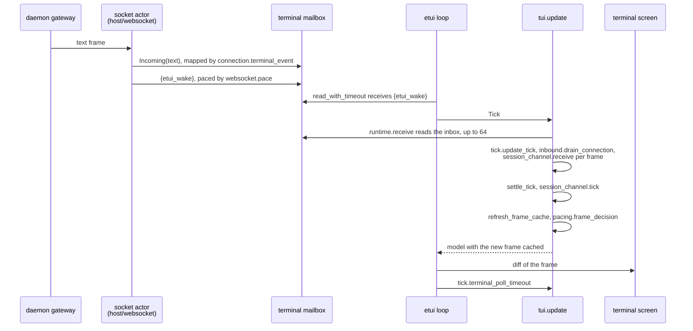
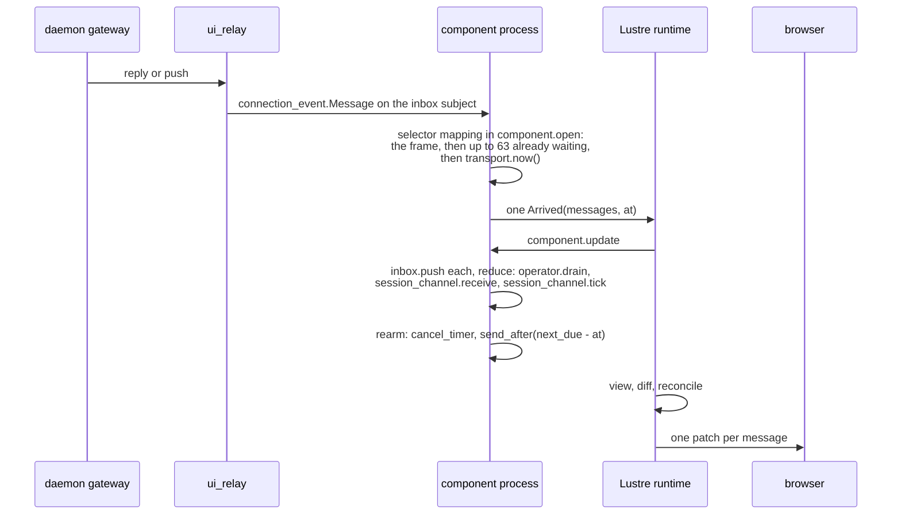
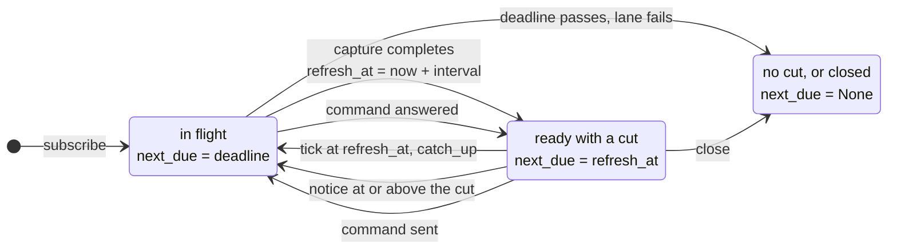
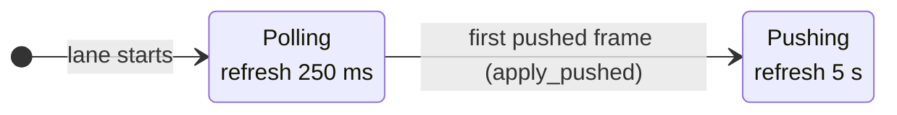

# Delivery: from the socket to the screen

This document follows a frame the daemon sends a client until the client
has reduced it and painted the result, in both of Loom's client hosts: the
terminal (`packages/tui`) and the web view (`packages/web_view`). It
describes delivery as it stands after ADR-013's addendum on event-driven
delivery, which replaced a fixed 250 ms tick with a wake on arrival and one
timer for the lane's own deadlines. The decision, its costs and the
measurements are in that addendum; this is the map of how the pieces fit.

## Six terms

A **lane** is one client's credited connection to one session: a
`session_view/session_channel.Channel`, with one request on the wire at a
time. Each terminal and each open page holds its own lane, and the lane
carries the frames of every strand in the session.

A **strand** is one conversation thread in a session, such as `main`, the
advisor, or `sub:reviewer`. Frames name the strand they belong to; the lane
does not open one per strand.

An **inbox** is what a host has received from one source and not yet handed
to the lane, oldest first. The terminal's is a `tui/buffered.Inbox` over the
socket's `Subject`; the web view's is a `session_view/inbox.Inbox` that the
component fills from its selector.

A **batch** is the set of frames one host step takes from its inbox: at
most 64 in either host (`tui_model.connection_batch`,
`component.arrival_batch`).

A **reduction** is one pass that hands a batch to the lane in arrival order
(`operator.drain` calling `session_channel.receive` for each frame) and then
runs the lane's own `session_channel.tick`. A reduction is where a frame
takes effect: a capture completes, a notice issues a catch-up, a delta
reaches the transcript.

A **deadline** is a reading of the host's monotonic clock at which the
lane's `tick` would act without any frame arriving: the in-flight
request's timeout, or the idle refresh of a ready lane.
`session_channel.next_due` names the earliest one, and `None` when there is
nothing a tick could do.

## The rule both hosts follow

Traffic is reduced when it arrives, and time is handled by one wake-up at
the lane's next deadline. Nothing polls on a fixed cadence to find traffic.

The two halves have different owners. Arrival is a host fact: only the
host can see its mailbox. The deadline is a lane fact: only the lane knows
whether it is waiting on a reply, when it last captured, and whether its
daemon pushes. So the lane exposes `next_due` and never reads a clock, and
the host arms a wake-up for the answer and reads the clock when the wake-up
fires.

`next_due` is exact in both directions. A `tick` at any reading before it
changes nothing, and a `tick` at it acts. The property test in
`packages/tui/test/session_channel_property_test.gleam` checks both after
every generated step (rule N1). A host that wakes late acts late but never
misses a deadline, because `tick` compares with `>=`.

## The terminal, step by step

1. **The socket actor files the frame.** The gateway writes a text frame
   to the websocket. Stratus hands it to the socket actor's `on_message`
   in `packages/host/src/host/websocket.gleam`, which calls `deliver`.
   `deliver` sends `Incoming(text)`, mapped by `connection.terminal_event`,
   to the terminal's inbox subject.
2. **The socket actor wakes the loop.** Still in `deliver`, and only after
   the send, `websocket.pace` decides the wake. Outside the 16 ms interval
   it calls `notify` at once; inside it, the first delivery arms one
   `send_after` for the interval's end and later ones are covered by it.
   `notify` is the closure `connection.connect_waking` built, which calls
   `etui_terminal_ffi:wake/1` and sends `{etui_wake}` to the process that
   owns the inbox. The same process sent the frame first, so the frame is
   in the mailbox before its wake.
3. **Etui ends its wait.** The loop was blocked in
   `etui_terminal_ffi:read_with_timeout`, a selective receive of keyboard
   input with an `after` clause. The `{etui_wake}` clause returns
   `{error, woken}`, and the backend turns that into a `Tick`, treating it
   as a zero-wait probe so a half-read escape sequence is not resolved
   early.
4. **The runtime receives.** `tui.update` stamps the clocks
   (`runtime.message`), then `runtime.receive` reads the inbox's mailbox
   up to the room its buffer has (`runtime.arrivals`) and
   `tui/admission` files what it read.
5. **The tick reduces.** `tick.update_tick` drains, in its fixed order, the
   replay, the candidate attachment, the jobs' replies and up to 64
   connection frames (`inbound.drain_connection`). Each frame goes through
   `inbound.handle_connection_message` to `session_channel.receive`, and
   the updates it returns are folded in by `inbound.apply_channel_update`.
   `settle_tick` services the side reads and runs `inbound.tick_channel`,
   which is the lane's `tick` at the stamp's transport reading.
6. **The frame is paced.** `settle_update` calls `tick.refresh_frame_cache`,
   and `pacing.frame_decision` renders a stale frame if 16 ms have passed
   since the last one, or defers it to the next tick. The lane's outputs
   leave through `runtime.perform` and `terminal_lane.perform`.
7. **Etui paints and asks when to wake.** Etui diffs the cached frame
   against the screen and writes the difference. It then calls
   `tick.terminal_poll_timeout` for its next wait.

The poll timeout is only for what no wake announces. A drain that stopped
at its batch (`Model.connection_backlog`) polls at once, because the frames
it left in the mailbox had their wakes spent on earlier ticks. A walking
viewport polls at 16 ms, and a lane with a request in flight at 8 ms,
because a reply usually lands inside the wake interval of the wake that let
the loop send its request. A model that `tick.wakes_itself` takes the paced
poll (40 ms after activity, 400 ms when quiet) capped at 250 ms, the cap it
had before wakes, and by the lane's deadline: something running anywhere, a
deferred frame, a job whose replies wake nothing, or frames still held.
Anything else sleeps until `session_channel.next_due`, capped at
`tick.idle_poll_ceiling_ms`, one second, because etui notices a resized
window only when its loop runs.

## The web view, step by step

1. **The relay files the frame.** `client/daemon/ui_relay` receives the
   gateway's reply or push for the page's attachment and sends it, as a
   `connection_event.Message`, to the inbox subject the component created
   in `component.open`.
2. **The selector drains the burst.** The component's selector matches the
   frame, and its mapping function in `component.open` reads up to 63 more
   frames already waiting with `process.receive(inbox, 0)` (`waiting`),
   reads the clock, and builds one `Arrived(messages, at)`.
3. **Lustre runs `update`.** The runtime takes the message
   (`EffectDispatchedMessage`) and calls `component.update`, or
   `operator_page.update`, which passes it on. `Arrived` files the batch
   with `inbox.push` and runs `reduce`: `drained` hands every filed frame
   to `session_channel.receive` through `operator.drain`, then the lane's
   `tick` runs at `at`, and `component.apply` folds the updates into the
   model. The lane's outputs become one `effect.from` (`perform`).
4. **The component re-arms its timer.** `rearm` cancels the timer it armed
   before and calls `process.send_after` for `next_due - at`. It does this
   inside `update`, because the `Timer` handle has to be stored in the
   model for the next arming to cancel it.
5. **Lustre renders once.** The runtime calls `view`, diffs the new tree
   against the last one and broadcasts the patch to the page's socket,
   whether the patch holds a change or not. The page's `ui_socket` writes
   it to the browser, and Lustre's client runtime applies it.

When the timer fires, its selector mapping in `component.arm` reads the
clock and dispatches `Ticked(at)`, which runs the same `reduce` and then
brings the strip's cache labels up to `at`.

## When the lane is due

The interval after a capture depends on what the lane has seen of its
daemon:

A lane that has seen no push cannot tell a quiet session from a daemon that
never pushes, so it refreshes every 250 ms. A pushed frame is evidence that
commits are announced; from the next capture on, the refresh repairs a
lost final notice and catches what the daemon does not announce. The hello
is not used as that evidence: it names no push capability, and a lane that
reconnects may face an older daemon.

The `Pushing` interval, `session_channel.pushing_refresh_ms`, is 5 s. It
can be that long because no change a peer's screen depends on waits for
it. The last one that did was a peer joining the session: protocol-change/018
had the hub push `presence` when a peer departed and not when one
subscribed, so the peers already attached saw a newcomer only at their
next capture, and with a 5 s refresh the shipped multiplayer fixture spent
4.7 s of its 12.2 s waiting for it. The constant was 1 s while that was
so. [protocol-change/054](../../protocol-change/054-roster-push-on-subscribe.md)
has the hub push the roster to every subscriber when a network peer
subscribes, so a join now reaches the other peers as a pushed frame.

The newcomer receives its own copy of that roster, and that copy is the
first frame pushed to it. A client that attaches to a session where
nothing happens therefore moves to `Pushing` at attach and refreshes
every 5 s, rather than staying `Polling` at 250 ms until the first commit,
stream or departure reaches it. The roster and the reply to `subscribe`
leave the hub by different paths, so either may arrive first; a roster
that arrives before the lane has a cut marks the lane pushed and captures
nothing.

## Four timelines

**One frame.** A stream delta arrives while the terminal is idle and its
last wake was more than 16 ms ago. At t = 0 the socket actor files the
frame and wakes the loop. The loop's `Tick` receives and reduces it; the
tick changed the transcript, so the frame is paced, and more than 16 ms
have passed since the last paint, so it is painted in the same step. On
the web, the selector matches at t = 0 and the component renders once.
Before event-driven delivery, the frame waited in the terminal's inbox for
the next poll timeout, up to 250 ms, and on the web for the next 250 ms
tick. A commit notice takes a catch-up's round trips on top: the notice
issues `catch_up` at once, and each reply either wakes the loop or arrives
within its 8 ms in-flight poll.

**A burst of 500 frames.** A provider writes 500 deltas in a few
milliseconds. The socket actor files all 500, wakes the loop for the first
and schedules one more wake for the end of the 16 ms interval. The first
tick reduces 64 frames and records `MailboxMayHoldMore`, so the next poll
waits for nothing and the next batch is taken at once. Eight back-to-back
batches reduce the burst in a few tens of milliseconds, at the same
reductions per frame as before, and frame pacing paints at most one frame
per 16 ms however many ticks run; the viewport then walks the new rows into
view a row per frame. On the web the 500 frames become eight
`Arrived` messages of up to 64, and so eight renders. Before, each of the
500 frames was its own Lustre message and render.

**An idle session.** Nothing is running and the daemon has pushed to the
lane before.
The terminal sleeps up to one second at a time (the idle ceiling), and
every `pushing_refresh_ms` (5 s) its lane is due: the tick issues `catch_up`, the loop polls at
8 ms while it is in flight, and the reply's frames wake it. A capture that
brings back the cut already drawn repaints nothing. The page sleeps until
its timer fires at the lane's refresh, `pushing_refresh_ms` after the last
capture, and renders once for the timer and once per reply batch. Before, both
hosts woke four times a second and each wake issued or waited on a
capture.

**A lost final notice.** The last commit before a session goes quiet is
announced by a notice that never reaches the client. No later notice will
cause a catch-up from the lane's `cut.next_seq`, so the commit is fetched by
the idle refresh: within `pushing_refresh_ms` of the lane's last capture
on a pushing lane, within 250 ms on a polling one. A lost notice followed by
any later notice costs nothing, because a notice at or above the cut
catches up from `cut.next_seq` and fetches both commits.

## Why time is an input

The lane reads no clock. Every transition that sets or checks a deadline
takes `now` from its caller, and `next_due` is a pure function of the lane.
Three things depend on that.

- **Replay.** `loom replay` drives the same lane with its own time, which
  starts at zero and moves only with the recording, so a replay makes the
  same transitions and draws the same frames on every run. The replay
  goldens in the `tui` tests pin its output byte for byte.
- **The protocol model.** The P model in
  `protocol/models/terminal-attachment/` has no clock. A refresh or a
  deadline can fall due at any tick the checker chooses, which covers every
  ordering a real clock allows, and `eTick` with `tickPending` already
  stood for a reduction woken by an arrival and coalesced with others.
  Event-driven delivery changed when a host ticks, not what a tick does, so
  the model changed only in its prose.
- **Fake-clock tests.** The property test passes the oracle's own `now`,
  `poll_timeout_test` sets the model's stamp, and `component_test` passes
  `at` in the messages it sends. None of them sleeps, and each schedule
  reproduces from its seed.

## Debugging latency

Start with counts, then with a scenario.

**Counts on a live client.** Launch with `--profile` (see
[distribution.md](../distribution.md)) or start `erl` with `-name`, then
count calls over a window with `erlang:trace_pattern(MFA, true,
[call_count, local])` and read them back with `erlang:trace_info(MFA,
call_count)`. The functions that answer the usual questions:

| Question | Function to count |
|---|---|
| How often does the terminal's loop wake? | `etui_terminal_ffi:read_with_timeout/1` |
| How often does the socket wake it? | `etui_terminal_ffi:wake/1` |
| How often does a lane capture? | `session_view@session_wire:catch_up/2` |
| How many requests does the daemon decode? | `client@protocol:decode_command/1` |
| How often does the terminal paint? | `tui@render:render_frame/2` |
| How often does a page render? | `web_view@component:view/1`, `web_view@operator_page:view/1` |

A terminal whose frames reach the screen late but whose loop wakes often
is paying for pacing: look at `frame_debt` and the viewport backlog. One
whose loop does not wake after a frame is missing its wake: count
`host@websocket:deliver/2` against `etui_terminal_ffi:wake/1`. A page that
renders once per frame is not batching: count `web_view@component:update/2`
during a burst.

**Scenarios.** `scripts/tui_perf.sh <checkout> <label> <scenario>` measures
the terminal's update loop on a pinned clock, so two revisions compare by
reductions and words, which the machine's load does not move:

- `events`: one key, one idle tick, and a tick and a key with 64 frames
  waiting. The idle tick is the per-wake cost.
- `burst <n>`: a burst drained tick by tick; `ticks` is the number of
  reductions a burst costs, and the per-frame figures should not move.
- `backlog <n> <jobs> live`: a mailbox backlog while jobs run, which is
  the cost of each selective receive that scans it.
- `growth <n>`: per-frame cost as one reply grows, which should stay flat.
- `session <n>` and `replay <n>`: memory after a long reply, and a
  replay's cost and frame count.

For the web view, `packages/web_view/test/delivery_test.gleam` counts the
patches a burst costs on Lustre's real runtime, and
`packages/client/test/client/terminal_wake_test.gleam` watches a real
socket wake its loop after the frames it files.
