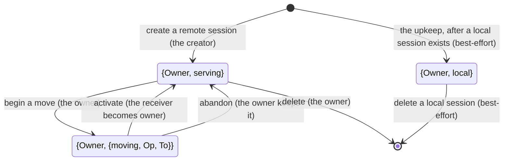
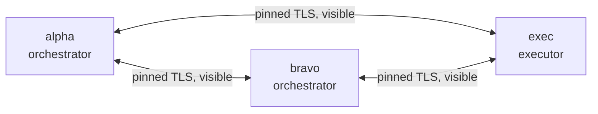
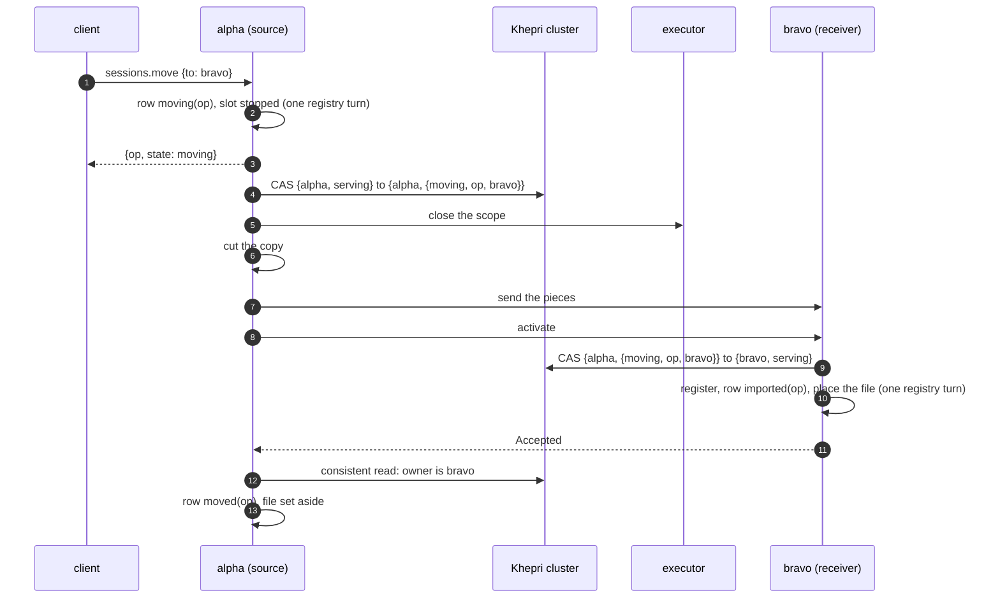

# The session directory and session ownership

A deployment with two orchestrators has to answer one question correctly at
all times: which orchestrator owns this session? The owner is the only daemon
that may run the session's runtime, write its conversation store, and attach to
its executor scope. If two daemons ever both believe they own a session, both
can run it against the same checkout, and the conversation forks.

This page describes how Loom answers that question when the orchestrators and
executors are members of a Khepri cluster. It is written for an engineer who has
not worked on the distributed runtime. Read
[the distributed runtime design note](../design-notes/distributed-runtime.md)
first for the two roles (an orchestrator holds a session's conversation, an
executor holds its checkout) and for how a tool call crosses between them.
[ADR-019](../adr/019-khepri-for-session-ownership.md) records why Khepri was
chosen and what the spikes measured, and
[protocol-change/079](../../protocol-change/079-khepri-session-ownership.md)
specifies the interfaces. [The plan](../design-notes/khepri-ownership.md)
ordered the implementation, and
[`protocol/models/session-move`](../../protocol/models/session-move/README.md)
holds the formal model, `KhepriMove.tla`.

**Status: implemented.** The code named here is on `main` once
protocol-change/079 lands; the shipped tests that run it are listed at the
end.

## Two kinds of deployment

A deployment chooses whether it has a directory by writing a `[directory]` table
on its daemons.

- **Without `[directory]`**, nothing on this page applies. Each orchestrator's
  catalogue is the source of truth for the sessions it holds, a daemon asked
  about a session it lacks asks its peers under a two-second deadline, a move is
  decided by two catalogue rows, and distribution connections are hidden. This
  is phase 3 and phase 5 of the design note, unchanged.
- **With `[directory]`**, the daemons listed in `[directory] members` form one
  Khepri cluster, and Khepri holds the single authoritative record of which
  orchestrator owns each session on an executor.

A daemon with `[directory]` requires every orchestrator in its
`[orchestrators.<name>]` table to be a member too, so the two kinds never mix
within one move.

## What the store holds

Khepri is a replicated tree store built on Ra, an implementation of the Raft
consensus protocol. Every member of the cluster holds a full copy of the tree.
A write goes to the cluster's leader, which commits it once a majority of
members have it on disk, and every member then applies it to its copy.

The store is named `loom_directory`, and it holds one record per session at the
path `[loom, sessions, <session id>]`:

```erlang
{loom_owner, 1, Owner, serving}
{loom_owner, 1, Owner, {moving, Op, To}}
{loom_owner, 1, Owner, local}
```

- `Owner` is the owning orchestrator's distribution node name, such as
  `alpha@10.0.0.1`. It is not an `[orchestrators.<name>]` key, because each
  daemon picks its own names for its peers: alpha may call its peer `bravo`
  while a third daemon calls the same node `laptop`. A daemon translates the node
  name into its own row only when it answers a client.
- `serving` means the owner serves a remote session (one created with an
  executor or a pool), or will when a client opens it.
- `{moving, Op, To}` means the owner has begun handing a remote session to the
  node `To` under the move `Op`, and has stopped serving it.
- `local` marks a local session, whose checkout is a directory on its
  orchestrator. A local session never moves, so its record is only where to
  find it: a lookup hint, never an authority.

Every write names the exact value it expects to replace, so a write never
depends on a read that came before it. These are all the transitions a record
makes:



The two arrows out of `Moving` expect the same value, so exactly one of them
commits. `Local` is a state of its own so that no move can take a local
session's record as its base: every write of a move, and a remote delete,
expects `serving` or `moving`, and finds `local` a mismatch.

A local session's record is written after the session exists, by the movers'
upkeep (see "Local sessions"), and nothing waits on it, so creating a local
session needs no majority. Deleting one removes its record best-effort; a
record left behind names the right owner, which answers `not_found`, and a
client asking another member is redirected there and told the same.

A second path, `[loom, migrated, <node>]`, records that an orchestrator has
copied its catalogue's ownership into the store (see "Migrating an existing
deployment"). The store holds nothing else: no conversation, no workspace path,
no credential, no executor name.

## The record decides, the catalogue remembers

The catalogue keeps the move table it has had since phase 5,
`catalogue_session_moves`, with its rows `moving`, `moved` and `imported`, and
gains a second table that marks a session being deleted. These rows no longer
decide ownership. They are each daemon's local memory of what it has begun, so
that a restarted daemon knows which moves to resume and which deletions to
finish, and so that the registry can refuse to open a session in the same turn
that decides not to serve it.

One rule orders every local row against the record:

- A local change that **stops** this daemon from serving a session (`moving`,
  `deleting`) is written first, in the registry turn that stops the slot, and the
  record changes after it. If the record write fails because the record held
  something else, the local change is reverted.
- A local change that **lets** this daemon serve a session (`imported`, the return
  to `resident` after an abandoned move) is written only after the record write
  that grants it has committed.

The rule keeps the registry's existing guarantee: admission reads the custody
row in the turn that reserves a slot, so a session whose row says it is moving
or being deleted never opens, and no runtime is serving a session at the moment
its record says it belongs to someone else.

Opening a session makes no call to the store. A remote session opens on the
strength of its local row exactly as before. This is safe while the only writer
that can take ownership away from an orchestrator is that orchestrator itself,
by beginning a move. Failover, which lets a third daemon take ownership, will
add a check of the record at open (see "What failover would add").

## Members, and who connects to whom

The cluster's voting members are listed in `[directory] members` on every
member:

```toml
[directory]
members = ["alpha@10.0.0.1", "bravo@10.0.0.4", "exec@10.0.0.2"]
```

The members are the orchestrators and the executors. Raft needs a majority of
members to commit a write, so two orchestrators alone would stop committing
when either is down. With an executor as a third member, any one of the three
can be down. Three, five or seven members is recommended; an even count adds a
member without letting the cluster survive one more failure, and the daemon
warns about it.



Every link is a pinned TLS distribution connection, visible on both ends, and
any of the three may be the Raft leader.

Raft's leader sends every write to every follower, and any member can become
the leader. So every member must be able to connect to every other member, and
each must pin the other's leaf certificate in `[[distribution.peers]]`. Today an
executor pins only orchestrators; a deployment with two executors as members has
each executor pin the other as well. The order of `members` does not matter.

**Members use visible distribution connections.** `client/distribution` starts
every node hidden today. A hidden connection does not appear in `nodes()`, and
Ra relies on `nodes()` in three places: the leader sends a snapshot only to a
node listed there, its node monitor reports only visible nodes, and its failure
detector sends heartbeats only to visible nodes. The spike in ADR-019 showed the
consequence. Over hidden connections, a member that fell behind a snapshot never
caught up, and a member restarted after a quorum loss never reconnected.

So a daemon with `[directory]` starts distribution visible, with
`-kernel connect_all false` so that `global` never connects it to a node because
a peer is connected there. `dist_auto_connect` stays `never`, so sending a
message to an unconnected node still drops it instead of dialing, and the
`net_kernel:allow/1` list still admits only pinned nodes. A daemon without
`[directory]` is started hidden, exactly as before. A spike also measured
`-kernel prevent_overlapping_partitions false` and found it changes nothing when
`connect_all` is false, so it is not set.

Visibility is decided when a connection is made, not by the node: a connection
made with `net_kernel:hidden_connect_node/1` is hidden even between two visible
nodes, and stays hidden until it drops. So every connection from one member to
another goes through one function, `distribution.connect`, which uses
`net_kernel:connect_node/1` when both ends are members and
`hidden_connect_node/1` otherwise. Whichever side connects first, and for
whatever reason, the link between two members is visible.

**Who connects, and when.**

1. **The link keeper.** Each member runs one process
   (`client/directory/member`) that, every two seconds, connects to each
   configured member missing from `nodes()`, and backs off, doubling up to
   thirty seconds, from one that does not answer. Once a cut network returns, both ends reconnect
   within a few seconds.
2. **Ra itself.** When a Ra server starts, it connects to the members it does
   not see. The spike measured a restarted member reconnecting this way and
   committing a write 11 ms later.
3. **The existing callers.** An orchestrator still connects to its executor when
   a session attaches, and to a peer orchestrator for peer mail and for the
   pieces of a move, now through the same `distribution.connect`.

Visible connections have side effects worth knowing. `nodes()` lists the other
members. `pg` scopes of the same name on two members exchange their membership
lists; Loom's event bus publishes only to local members, so delivery is
unchanged. `global`'s locks span the members, which Khepri uses while a member
joins. None of this widens trust: a connected peer could already run any code on
the other node, hidden or visible.

## Forming the cluster

A cluster is created once. An operator runs `loomd directory bootstrap` on one
member, with its daemon stopped. The command refuses when the member already has
a store on disk (its `joined` marker, or the directory Ra keeps for a server;
the files the Ra system writes at every daemon boot do not count, so a member
that booted before any cluster existed can still create it), and when any
configured member it can reach answers that it holds a joined store. The
refusal names the remedy: start the daemon if a cluster exists, or remove the
store and run the command again if it is a leftover. Otherwise it creates a
store with that member as its only member, marks it joined, and exits.

Every other member joins on its own. When a member daemon boots and finds no
joined store in its data directory, it joins the cluster through the first
configured member that answers:

1. It starts its own Ra server without calling an election.
2. It asks the cluster to remove its member identity, in case the cluster still
   lists it from before a disk loss.
3. It asks the cluster to add it back as a **non-voter**, which Ra calls
   `promotable`. A non-voter receives the log and snapshots but does not vote and
   does not count toward the majority.
4. Ra promotes it to a voter once it has caught up with the leader's log. The
   daemon waits for the promotion, then marks its store joined.

A member whose store is already joined starts it, and Ra resumes the membership
recorded in its log.

The same rule covers a member that lost its disk. Its old identity is removed
while the remaining members have a majority, and it comes back as a non-voter,
so it never votes with an empty log. Raft's safety argument assumes a voter
keeps what it acknowledged, and a member that lost its disk has not. The spike
measured this path: after 5000 writes and a snapshot taken while one member's
directory was deleted, the member rejoined as a non-voter and was promoted in
21 ms. Losing the disks of a majority of members is not a rejoin; it is a
restore from backup.

Bootstrap is a command, not a boot-time rule, because a rule such as "the first
configured member creates the cluster when its data directory is empty" would
make a first member that lost its disk create a second, empty cluster beside the
real one.

The control command `directory.status` reports the configured members, Ra's
members and which of them are voters, the leader, this member's applied index,
and whether its store is joined (protocol-change/079 has the reply). When the configured list and Ra's list differ,
Ra's is the one in force: membership lives in Raft's log, and `members` only
tells a daemon whom to join and whom to keep connected.

## Reading an owner

There are two kinds of read, and they give different guarantees.

**A local read** returns the member's own copy with Khepri's `favor =>
low_latency`. It takes about 2 µs and never waits for other members. A copy can
lag the leader, most of all right after the member restarts.

**A consistent read** first waits for the member's copy to catch up with
everything the leader has committed (`khepri:fence/2`), then reads. It needs a
quorum, and it runs in a weft task under a deadline because Khepri's consistent
path ignores its own timeout when the majority is gone (ADR-019).

### What a stale local read may decide

| Decision | Read used | Why |
|---|---|---|
| Redirect a client to the owner (`not_owner`) | local | A stale answer sends the client to the previous owner, which redirects it again |
| Route peer mail to the recipient's orchestrator | local | Delivery is acknowledged by the recipient's owner; a stale route is answered there |
| Retire a moved session (set its file aside) | consistent | A stale copy could show an owner the session has already left again |
| Resume, finish or abandon a move | consistent, and the write itself | Each step that changes ownership is a compare-and-set |
| Finish a deletion | the write itself, after a local `deleting` mark | Absence alone never decides a deletion |

A copy can also lack a record the leader has: during a member's join, and on a
member restarted after a long outage, until it has caught up. A lookup there
answers `not_found` for a session created elsewhere meanwhile. The window closes
on its own, in seconds or one snapshot transfer.

### A misdirected request

A client asks bravo for a session alpha owns. Bravo's `sessions.get` misses in
its catalogue, the directory's lookup reads bravo's copy of the record, finds
alpha's node, and bravo refuses `not_owner` naming its own row for alpha and,
if that row configures one, alpha's address. A record with no owner other than
bravo, or no record, leaves the answer `not_found`.

## Writing an owner

Every change of ownership is one Khepri command against one record, and Ra
applies commands to a record in one order. When two daemons race to change the
same record, the second finds the record different from the value it expected,
and its write fails.

| Operation | Who | Expects | Writes |
|---|---|---|---|
| create | the daemon creating a remote session | no record | `{self, serving}` |
| begin a move | the source | `{self, serving}` | `{self, {moving, Op, To}}` |
| activate | the receiver | `{source, {moving, Op, self}}` | `{self, serving}` |
| abandon | the source | `{self, {moving, Op, To}}` | `{self, serving}` |
| delete | the owner | `{self, serving}` | no record |

No Khepri call runs inside a registry turn, which is bounded at five seconds.
Each runs in a weft task under its own deadline: three seconds for most writes,
five for an activation.

### Creation

`sessions.create` for a remote session first reserves the registration, without
opening it. Then it creates the record. Only then does it ask the registry to
create the session, which finds the reservation under the same request key and
opens it. A reserved registration with no record is never served. Without a
quorum the creation is refused `no_quorum`; the reservation stays, and a retry
under the same request key repeats the record write, which accepts a record that
already names this daemon. A local session is created exactly as before, with
no store call; its record follows (see "Local sessions").

### A move

A move keeps the six steps of phase 5. The file handling is unchanged.

| Step | The record says | The source's row | A crash leaves | Resumed by |
|---|---|---|---|---|
| 1 Intend | `serving` until the write, then `moving` | `moving`, written first with the slot stopped in the same turn | a `moving` row, record `serving` or `moving` | the mover at boot, which repeats the intent write and accepts a record already `moving` under this operation |
| 2 Close | `moving` | `moving` | the scope cell with or without a close | the mover, which asks the executor to close again |
| 3 Cut | `moving` | `moving` | a partial copy | the next cut, which replaces it |
| 4 Send | `moving` | `moving` | a partial copy on the receiver | the receiver's stage answer, then a full resend |
| 5 Activate | `moving` until the receiver's write, then `serving` with the receiver as owner | `moving`; the receiver's row becomes `imported` after its write | the receiver's write with or without its `imported` row | the source asking again; the receiver finishes its import when the record already names it |
| 6 Retire | the receiver owns it | `moved`, after a consistent read shows another owner | `moved` with the file not yet set aside | the mover at boot |

The sequence below is one move with nothing going wrong. The receiver's write
comes before its import, and the source's retirement comes after a consistent
read.



**Intend.** `sessions.move` writes the `moving` row and stops the slot in one
registry turn, as phase 5 does, and returns. The mover waits until this
daemon's migration marker exists, then writes the record from `serving` to
`moving`. A record already `moving` under the same operation is a repeat and
the mover goes on. A missing record, now that the seed has run, means only one
thing: the session's owner deleted it. That happens when the source was down
while the receiver activated, imported and then deleted the session. The mover
must not serve it again, so it ends the move as a retirement does, with the
`moved` row and the file set aside (never deleted), and logs
`daemon.move_record_gone`. A record that already names
another owner means the receiver's activation committed and its reply was lost,
and the mover carries on, so that the receiver is asked again and answers from
what it holds.

**Activate.** The receiver checks the copy (the sender's node, the digest, the
scope cell's clean close, the executor row). Then it writes the record from the
sender's `moving` to its own `serving`, and only after that registers the session,
records `imported` and places the file in one registry turn. A repeat of the same
activation finds the `imported` row and answers `Accepted` without touching the
store. When the record write fails, the receiver reads what the record holds:

- **The receiver is already the owner.** Its own earlier write committed and its
  reply or its import was lost, or the session has moved on since. It finishes the
  import if it has not, and answers `Accepted`. It never removes a session it
  owns.
- **Another daemon owns it, or there is no record.** The move ended without this
  receiver. It answers `Refused(move_ended)` and removes only its incoming copy.
- **The write did not commit in time.** It answers `Failed`, which the source
  treats as silence.

**Retire.** The source retires only on the receiver's answer (`Accepted`, a stage
of `Activated`, `move_ended`, or a refusal or a refused close that its abandon
followed), and only when a consistent read shows the record names another
owner. It then writes `moved`, sets its file aside, and releases its lease and
its cut copy. A consistent read that names the source itself means the move was
abandoned, and the file stays where it is.

**Abandoning a move.** The source abandons by writing `serving` back with itself
as owner, expecting `moving` under this operation, and only then reverts its row
to `resident`. Because the receiver's activation expects the same `moving`
record, exactly one of the two commits. If the abandon fails because the receiver
already took the session, what happens depends on why the source abandoned:

- After an answer (a refusal, or a close the executor refused because the
  receiver holds the scope), the receiver has spoken, and the source retires.
- After silence (the thirty-minute give-up, or the owner's request), the source
  does not retire. The receiver may have crashed between its write and its
  import, and it finishes the import only inside the source's activation
  request. So the source keeps its `moving` row and its file, asks again, and
  retires on the receiver's answer. The wait is not counted toward the give-up,
  which could not take the session back anyway.

That is why a source may now give up on a receiver that does not answer. It
abandons on the answers phase 5 abandons on (an unproven cleanup, a corrupt or
oversized file, a refusal from the receiver), and also after thirty minutes of
stalls during which the store had a quorum, provided the receiver's
`[loom, migrated, <node>]` marker exists and this daemon has seeded the store
itself. Before its own seed, a missing record means "not copied yet", so the
give-up waits for the seed as a run does, and that wait is not counted either. The marker condition covers an upgrade
in which the receiver still runs phase 5 code: such a receiver activates by
writing its own catalogue and never writes the record, so abandoning against it
would leave two owners. An operator can also abandon a move by hand with
`sessions.move` and `abandon: true`, which takes the same write.

**An imported session can move onward at once.** Phase 5 held such a session
until its origin had retired the move that brought it, because the origin's
retry read the receiver's catalogue row and could abandon on its refusal. The
origin now abandons only by a write that expects its own `moving` record, which
fails once the receiver has activated, so the hold is no longer needed.

### Delete, archive and restore

Deleting a remote session writes a `deleting` mark in the registry turn that
checks no slot is open, then deletes the record with a condition that it names
this daemon as `serving`, then removes the registration, the mark and the file.
Admission refuses a session with a `deleting` mark. If the record names another
owner, or is `moving`, the mark is removed and the delete is refused. If the
write does not commit, the mark stays and the delete is refused `no_quorum`; a
repeated delete, or the movers' periodic pass, finishes it once the store has a
quorum. A record that is already absent while the mark exists means this daemon's
own delete committed before a crash, and the deletion is finished. Absence of a
record without the mark never deletes anything.

Archive and restore change only whether a session is listed, so they write
nothing to the store.

### Local sessions

Every session on a member has a record, local ones included, so a member asked
about another orchestrator's local session answers `not_owner` naming it, and
peer mail to the session is routed there, as for a remote session. A local
session's record is a lookup hint: it never moves, and no move or delete of a
remote session can use it as a compare-and-set base (it is `local`, not
`serving`).

Writing it is best-effort and never gates admission. The movers' upkeep runs a
pass, `migrate.cover_local`, that writes `{self, local}` for every local
session missing from this member's copy. It runs at boot and after each local
creation, which asks for it and does not wait. A pass that fails, for want of a
majority, leaves the work wanted, and the next tick (five seconds) runs it again,
so a session created without a majority is recorded once the majority returns.
A request made while a pass runs is covered by the next pass. Deleting a local
session through the control socket removes its record best-effort; a record left
behind, or one left by a delete from the web page, which does not remove it,
names this daemon, and it answers `not_found`.

An orchestrator member records local sessions if it lists executors, pools or
other orchestrators. An executor member lists none of these, has no writes, and
records nothing.

## Without a quorum

When a majority of members cannot reach one another, Ra cannot commit, and
Khepri writes return `{error, timeout}` at their deadline. Local reads keep
returning whatever the member last applied.

| Operation | With no quorum |
|---|---|
| Lookups (`sessions.get` and `sessions.open` on a miss, peer mail routing) | Work, from the local copy |
| A running session, its tool calls, its executor | Work; nothing on the tool path reads the store |
| Opening any session | Works; opening makes no store call |
| Creating or deleting a local session | Works; the record follows once the majority returns |
| Creating a remote session | Refused `no_quorum` |
| Beginning a move | Accepted; the mover stalls at the intent write |
| A move already under way | Stalls at its next write and retries; neither activation nor abandon can commit |
| Deleting a remote session | Refused `no_quorum`, the `deleting` mark stays |
| Archive and restore | Work |

An executor that is a member keeps running its scopes and tool calls without a
quorum; it only stops voting until it can reach the others.

## What an executor member can and cannot do

An executor that is a member votes in elections, can become the leader, and
holds a full copy of the tree: session identities, owner node names and move
identities. It holds no conversation content and no credential. Its loss counts
against the quorum exactly as an orchestrator's does, and when it returns it
catches up from the leader.

The executor's daemon code never writes to the store; the executor role builds
no value that can. That is a property of the code and not a security boundary.
An executor is a trusted Erlang peer: it can run any code on any node it is
connected to, and it can submit any Khepri command on its own node. That was
already true of every pinned peer before this change. Ra has no voting member
that is barred from becoming leader, so an executor can lead the cluster; a
leader orders and replicates commands, and the conditions each command carries
are checked when it is applied.

A practical cost: Ra's write-ahead log syncs to disk on the executor, where
sandboxed builds also write. A slow leader slows every commit.

## Where the data lives

Each member keeps its store under `<state root>/directory`: Ra's write-ahead
log, its log segments, its snapshots, and the `joined` marker. On an executor
that directory sits beside the execution ledger (`exec-ledger.db`); on an
orchestrator, beside the catalogue. Khepri keeps the whole tree in memory as
well. A record is under a hundred bytes. Khepri writes a snapshot and truncates
the log after 20 MiB of commands by default.

Deleting the directory loses only that member's copy, as long as the other
members keep a majority: the member rejoins as a non-voter on its next boot.

## Migrating an existing deployment

An existing two-orchestrator deployment has ownership in its catalogues, and
moves should not be in flight when it is upgraded. The first time a member
orchestrator's store is joined and has a quorum, the daemon copies its
catalogue's remote sessions into the store, one record per registration:

| Catalogue row | What the daemon writes |
|---|---|
| none (resident) | `{self, serving}` |
| `imported(Op, From)` | `{self, serving}`; if the record is already the sender's `{moving, Op, self}`, the activation write instead |
| `moving(Op, To)` | `{self, {moving, Op, To}}`; if the record already names `To` as owner, nothing, and the mover retires |
| `moved(Op, To)` | nothing; the receiver writes its own |

A record that already names this daemon means the copy is being repeated, and it
succeeds. A record that names another daemon for a resident or imported session
is a conflict: the existing record stands and the daemon logs
`directory.migration_conflict`. A restored backup is the case that produces one.
Until an operator resolves it, the daemon still opens the session (opening reads
no record), refuses to delete it (the delete expects this daemon as owner), and
a move of it finds the record naming another owner and retires it, setting the
file aside where an operator can recover it.
When every registration is copied, the daemon writes `[loom, migrated, <node>]`.
Until then its movers do not act on the store, so no move decides anything from
a record that is merely missing.

## What failover would add

This change makes the record authoritative and every change of owner a
compare-and-set, which is what failover needs to build on. Failover itself
needs five more pieces:

- **Knowing the owner is gone.** A lease in the record that the owner renews, or
  Ra's own view of which members are connected, with a rule for when another
  orchestrator may act.
- **A takeover write**: a compare-and-set from `{old, serving}` to
  `{new, serving}`, guarded by the lease.
- **A check at open.** Once a third daemon can take ownership, an owner can no
  longer trust its own row. Opening a remote session would write the record back
  unchanged, a compare-and-set that commits only while the record still names
  this daemon.
- **Fencing the old owner at the executor.** The executor's attach token and
  incarnation already refuse a stale source after a clean close. A takeover
  happens without a clean close, so attach would carry an ownership epoch from
  the record, and the executor would refuse a lower one.
- **The conversation itself.** The session's SQLite file lives only on the
  owner's disk. A new owner cannot run a session whose conversation it does not
  have, so failover needs the file replicated to, or readable by, the
  orchestrator that takes over. Of the five pieces, this one is the largest.

## Where the code goes

| Module | Holds |
|---|---|
| `client/internal/ffi_khepri.gleam` and `client_khepri_ffi.erl` | The only calls into Khepri and Ra, with every return normalized to a `Result` |
| `client/directory/record` | The record, its total decoder and its encoder |
| `client/directory/store` | Starting, bootstrapping and joining the store; the deadline-bounded reads and writes |
| `client/directory/member` | The link keeper and the join, and the member's status |
| `client/directory/settings` | The `[directory]` table |
| `client/directory/ownership` | `Ownership`, the writes, each bound to this node |
| `client/directory/deletion` | Finishing a remote delete under its `deleting` mark |
| `client/directory/migrate` | Copying catalogue rows into the store once, and writing local sessions' records (`cover_local`) |
| `client/daemon/directory_cli` | `loomd directory bootstrap` |
| `client/session_directory` | `Directory`: the lookup, and on a member the writes and the status |
| `client/session_mover`, `client/session_movers`, `client/session_importer` | The move, with the record deciding and the rows remembering; the give-up and the periodic pass |
| `storage/catalogue` | The `catalogue_session_deletions` table (catalogue version 13) |

## The tests that run it

| Test | What it proves |
|---|---|
| `client/directory/store_test`, `record_test`, `ownership_test` | The store's calls, the record's total decoder, and every compare-and-set's success and refusal, on a one-member store in the test VM |
| `client/directory/daemon_record_test` | Creation, deletion, `directory.status` and abandon over the control socket of a member, and that opening a session or creating a local one needs no store |
| `client/directory/migrate_test` | The migration table, conflicts left standing, the marker written last, and a local session's record written by the movers once a stopped store returns |
| `client/session_mover_test`, `client/session_importer_test` | Moves under `Recorded` authority, the give-up, and the receiver's compare-and-set |
| `client/distribution_test` (`members_visible`, `members_not_transitive`, `member_needs_connect_all_off`, `directory_rejoin`) | Visible member links, no transitive connections, the boot refusal, and a member that lost its disk rejoining as a non-voter |
| `client/daemon_shipped_remote_move_test` (`members` variants) | One clean move and a source halted after each of the six steps, among three shipped members |
| `client/daemon_shipped_directory_test`, `client/daemon_shipped_peer_mail_test` (member variants) | Redirects and peer mail from each member's own copy, with an owner down, for remote sessions and for a local one |
| `client/daemon_shipped_directory_quorum_test` | A member alone without a majority, and a member that lost its disk, against the shipped daemon |
| `protocol/models/session-move/KhepriMove.tla` | The move and a move back under crashes, lost majorities and late activations, with eight mutants |
