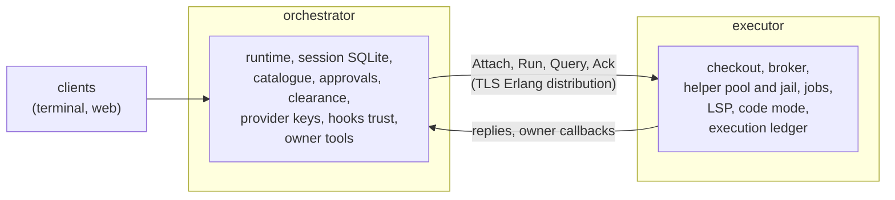
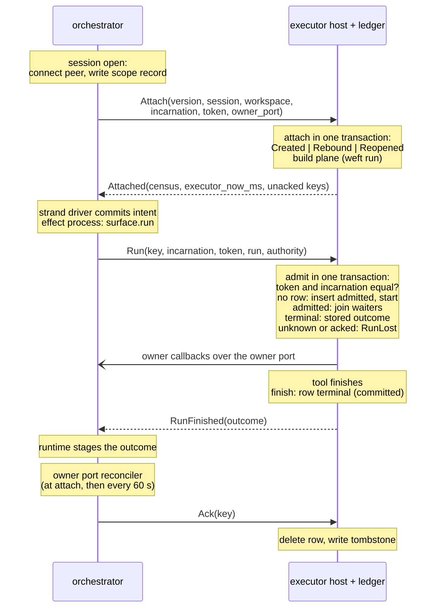

# The distributed runtime

A distributed Loom runs one session on two machines. The orchestrator keeps the
conversation: the runtime, the session's SQLite store, approvals and the
provider keys. The executor keeps the checkout and runs the session's workspace
tool calls beside it. Both are the same release, joined by TLS Erlang
distribution with pinned certificates, and a single machine that plays both
roles is the ordinary local daemon. This page is for an engineer who knows the
single-machine architecture and needs to reason about the distributed one, and
in particular about what happens when something fails.

The design of record is
[the distributed runtime note](../design-notes/distributed-runtime.md). The
wire, durable formats and rules, with every addendum, are in
[protocol-change/078](../../protocol-change/078-distributed-runtime.md). The
operator's side is [the setup guide](../distributed-setup.md). The work is
issue #697 and PR #923. This page explains how the parts fit and links to those
documents for detail rather than repeating it.

## The cut: `ToolSurface.run`

Every tool effect already leaves the runtime through one function slot,
`run: fn(ToolRun) -> ToolOutcome` on `effects.ToolSurface`
(`runtime/effects.gleam:321`). The strand driver calls it on an effect process
after the call's intent and effective arguments are committed. Both sides of
the slot are plain data: a `ToolRun` carries the operation, step, source index,
strand, call, arguments, replay policy and consumed grants, and a `ToolOutcome`
carries a finished `AgentMessage` or a failure reason. No closure, port or
local handle crosses it. The distributed runtime puts the machine boundary at
that slot, so a remote session sends whole tool calls to the executor and gets
outcomes back: one round trip per call, never one per file access.

The cut sits there for three reasons. The runtime already makes a call durable
before the effect starts and already stages an outcome that is unknown, so a
remote call needs no second custody system. The executor can run main's own
workspace plane unchanged: `serve.assemble_in` was split into a
conversation half and a workspace half, and a remote session asks the executor
to run the same workspace half that a local session runs in-process. Local and
remote therefore share one assembly and cannot drift apart. And everything below
the cut (code mode, the LSP manager, the jobs actor, the broker) runs beside the
files it reads, so no LSP byte, capability socket or helper frame crosses the
network.

Protocol-change/078 records the two rejected cuts: a typed RPC per
filesystem operation, which is what PR #819 built, and a remote broker
dispatcher, which would have left harness-side tools reading the
orchestrator's disk.

### What stays on the orchestrator

The orchestrator keeps everything that belongs to the conversation or to the
user. That is the runtime and its strands, the session store (conversation
tree, registers, facts, approvals, grants, budgets), the catalogue, peer mail,
memory, the provider credentials, MCP clients, `~/.loom`, user-level hooks and
the hook trust record. Clearance stays here: `wiring.clear` is pure over the
tool declarations, so the orchestrator builds declarations for the workspace
tools from the executor's census and clears every call before it is sent.
Approvals park here, beside the durable escalation record.

Tools that act on the conversation rather than on the checkout also run here:
`agent_*`, `history_search`, `remember`, `schedule_*`, `context`, `advise`,
skills and the peer tools. `client/tool_placement` is the name table that says
which side runs each tool, and its test asserts that every registered tool is
placed exactly once. A remote session refuses a tool with no placement instead
of running it on the orchestrator.

### What runs on the executor

The executor runs the workspace plane: the broker, the helper pool and its
jail, the executor service, the workspace tools (`fs_*`, `bash`, `grep`,
`working_directory`, `code_mode` and the job tools), the jobs actor, the LSP
manager and the code-mode host. It holds the checkout, the `.blobs` and
`.codemode` work directories, toolchains and caches, and its own machine
configuration (`[tools]`, `[workspace]`, `[lsp]`, `[jobs]`, `[secrets]`). The
rule behind the split is that configuration naming a path on a machine lives on
that machine. The orchestrator never interprets an executor path, and the
executor never opens the conversation store.

When a workspace host starts a session's plane it returns a census: platform
and enforcement level, the toolchain probe, language servers, the shell, the
Git program, the workspace root as an opaque string, the text of the
workspace's guidance files, the bytes of its project hook files and the base
policy summary. The orchestrator renders and pins the system prompt from that
census, and checks the hook bytes against its own trust record before any hook
runs.

### Callbacks from the executor

A workspace tool sometimes needs the orchestrator while it runs. The executor's
plane receives an `OwnerServices` record of functions, exactly as a local plane
does, and for a remote session each function is a message to a per-session
owner port on the orchestrator (`remote/owner_link` sends, `remote/owner_port`
answers). The plane cannot tell which kind it holds. The callbacks are an
escalation for approval, the reserved facts (`client/working_directory/` and
`job/` only, fenced in `owner_services`), a background job's completion notice,
strand activity and wakes, live output tails (casts that may be dropped), and a
code-mode satellite's owner-bound capabilities (`strand.*`, `notes.*`,
`schedule.*`, `peer.*`). A satellite's `fs.*`, `kv.*`, `report.*`, `proc.*`,
`jobs.*` and `lsp.*` requests are served on the executor beside it.

Every callback is a monitored call with a budget. If the owner port dies, the
connection drops or the budget runs out, the function returns the in-band
failure its type allows: an escalation settles as refused, a fact operation
fails with `owner unavailable`, a capability is denied with
`owner_unavailable`. The tool run that asked therefore reaches a terminal
outcome instead of waiting on a reply nobody will send. An escalation's budget
is the call's remaining time plus a two-second slack, and it crosses the wire as
a remaining duration because the two clocks differ.

### Callers that are not tools

Hooks, goal checks, Git observation and the worktree diff run commands through a
`broker.Broker`, which is a subject and a clock. A remote session holds
`broker.over(census.broker, clock)`, a handle on the executor's broker subject,
so `clear_call`, `cancel` and `abort` work as they do locally and output streams
back to the caller. A `CallSpec` carries an absolute deadline that the
executor's broker compares with its own clock, so these callers read
`Half.call_clock` rather than the local clock (see "Two clocks" below). The
workspace path they put in a spec comes from the census as an opaque string.

### What a remote session refuses

Four features read orchestrator-side state that has no executor counterpart
yet, and a remote session refuses them rather than half running them: extension
tools, operator-added directories, background code mode, and MCP façades inside
code mode. Foreground `code_mode` works. A remote failure never falls back to a
local path, because a remote session's orchestrator has no workspace path to
fall back to.

## Trust and transport

Orchestrators and executors are mutually trusted and administered by one
operator. A connected node has the full privileges of an Erlang peer: it can
spawn processes and call any function on the other node. So compromising an
executor's VM compromises the orchestrators it talks to, and the operator
accepts that cost when enrolling a machine. The design therefore draws its
boundary around who may connect, and does not try to defend one connected node
against another.

### Who may connect

`client/distribution` is the membership layer. It starts distribution and
connects to configured peers, and sends no message of its own. The checks are
these:

- **TLS with pinned leaves.** Nodes connect over `inet_tls_dist`. The verify
  function (`verify/4` in `client_distribution_ffi.erl`) keeps every PKIX
  failure, and for the leaf it requires a SHA-256 that matches a configured pin
  and a single node-name SAN (the certificate's only DNS name containing an
  `@`) equal to that same pin's node name. Both directions check, so a stolen
  certificate for another node, or a matching pin issued by another CA, is
  refused.
- **No automatic connection.** `dist_auto_connect` is `never`. A send to a node
  nobody connected to is dropped rather than dialled, and the only connections
  are the ones `distribution.connect` makes, under a weft deadline, to
  configured peers.
- **Hidden nodes and an allow list.** The node starts hidden, so two
  orchestrators connected to the same executor do not become connected to each
  other through it. `net_kernel:allow` lists only the configured peers, between
  one and 32 of them.
- **A shared cookie.** All nodes of a deployment hold one cookie, which must be
  the VM's own `$HOME/.erlang.cookie` with mode 0600; the emulator reads the
  cookie from there and nowhere else. The cookie is a second check behind TLS,
  not the boundary.

The verify function does not compare the certificate's node name with the name
the peer claims in the distribution handshake. Among pinned peers no per-node
identity is established at the distribution layer, so a pinned node can present
itself as another pinned node. That stays inside the trust envelope, since every
pinned node already holds full Erlang privileges, but nothing in the design may
assume a message came from the node it names on the strength of the connection
alone.

### Who dials whom

Orchestrators dial; executors never do. An orchestrator connects to an
executor when a session opens, and to a peer orchestrator when it asks the
session directory, sends peer mail or moves a session. No connection is made at
startup. An executor's owner callbacks travel back over the connection the
orchestrator made, and when that connection is gone they fail in-band. An
executor therefore needs two inbound ports (`epmd` and its fixed
`listen_port`). An orchestrator with no peer orchestrators is dialled by nobody
and can run without a reachable listener; in a deployment with two, each is
dialled by the other.

### Booting a distributed VM

The daemon boots without a node name and starts distribution itself, from
`daemon/main.prepare_startup`, before the catalogue or any session is opened.
`distribution.start` refuses a VM that was not booted for it, each with its own
`BootRefusal`: it requires OTP 29 or newer, `-proto_dist inet_tls`, an
`-ssl_dist_optfile` whose content equals what `tls_options` generates from this
configuration and is private, and no `-name`, `-sname`, `-setcookie`,
`-nocookie` or `-ssl_dist_opt`. The launcher `bin/loomd` adds the two flags when
`LOOM_DISTRIBUTION_OPTFILE` is set and changes nothing otherwise. A daemon with
no `[distribution]` table never starts `net_kernel`, and its sessions never
consult a ledger.

### How `epmd` is found or started

Distribution needs an `epmd` to register the node's name and port. `erl -name`
launches one at boot, but the daemon boots without a name and calls
`net_kernel:start/2` later, and that dynamic start never launches `epmd`. On a
machine where nothing had started one, the node would fail to register. So
`ensure_epmd` in the FFI, called by `distribution.start` before
`net_kernel:start/2`, asks the loopback `epmd` for its names under a deadline.
When nothing answers it runs `epmd -daemon` from the release's
`erts-<version>/bin`, or from `PATH` when the release carries none, and polls
for up to three seconds. It does nothing under `-start_epmd false`, which is how
an operator says `epmd` is managed elsewhere (a system service, or a forwarded
port). The port is the VM's `epmd_port`, which `ERL_EPMD_PORT` sets. When no
`epmd` can be had, the daemon exits with `EpmdUnavailable`, a fault distinct
from a credential failure. The `epmd` it starts outlives the daemon and is
shared by later Erlang nodes on the machine, as any `epmd` is.

### What the closed vocabularies limit

The messages between nodes are values of closed custom types: `HostMessage` to
the executor host, `OwnerMessage` to the owner port, and `orchestrator_port`'s
`Message` between orchestrators. They hold only plain data and subjects, and no
function, port or atom built from a peer's input. The owner port serves only
the two reserved fact prefixes, and the orchestrator port serves only four of
peer mail's commands, so a peer cannot read a session's conversation through
them. Those limits are scope hygiene: they keep each port to its job. They are
not a security boundary, because a peer that wanted more could call any
function on the node directly.

Because the peers are trusted, a message is a typed Erlang term matched
directly, not decoded from untrusted bytes. The only guard on its shape is
`Attach.version` (`protocol.version`, 2 today). The host refuses a different
version with `VersionMismatch` and creates nothing. A peer built from a
different vocabulary whose message does not match crashes the executor host,
which halts the executor daemon. Both ends are therefore upgraded together, and
the version is bumped for every changed constructor or field.

Jailed payloads stay outside all of this. Code-mode satellites, MCP servers and
language servers boot with `-proto_dist none`, their environment is built from
an allow list so `ERL_FLAGS` is not inherited, and no credential, cookie or
options file is mounted into a jail.

## Provisioning

`loom distribution` (`dist` for short, and `loomd distribution` on the daemon)
takes an operator from nothing to a trusted deployment without `openssl`. `init`
writes an example plan; `provision` reads the plan, mints one authority, one
ECDSA P-256 certificate per node and one cookie, and writes one
`<node>.loombundle` per node plus a secret-free `system.json`; `show` prints the
deployment; `install` puts one bundle's files in place and merges its role
tables into `loom.toml`; `options` renders the TLS options file. A bundle holds
the node's private key and the cookie, and no command prints either. The
authority's key is dropped when `provision` returns, so adding a node or
renewing a certificate means provisioning again and reinstalling every bundle.
The plan and bundle rules call the daemon's own validators, so a bundle that
installs is one the daemon accepts. The setup guide, section 3, has the
commands and the files they produce.

## One tool call, end to end

A remote call goes through four stages: the session open attaches once, each
call is sent as a `Run` and admitted by key into the executor's ledger, the
outcome is committed before any reply, and the orchestrator later acknowledges
it. Recovery and reconnection reuse the same messages.

### Attach, once per open

Each time the orchestrator assembles a session it calls `surface.attach`
exactly once, before the first `run` or `recover`. The attach carries a fresh
32-byte random token and an incarnation, and the ledger makes that token the
scope's only valid one. Every strand, every strand-driver restart and every
runtime restart inside the open shares that one surface and token. A second
attach inside one open would rotate the token and get another strand's live
`Run` refused as `StaleToken`, so nothing below `remote/workspace` attaches
again.

The token is the fence against an earlier open. A crashed orchestrator, or an
open that was closed, may leave `Run` messages in flight, and Erlang orders
messages only per sender and receiver pair, so a later open cannot assume its
messages arrive after the dead open's. The ledger compares the token by value in
the transaction that admits a call, so a dead open's late `Run` is refused
however the network ordered it.

The host builds the session's plane as a weft run and answers the attach when
the build lands; a rebound attach reuses the plane it already has and is
answered at once. While a build is in flight, a second `Attach`, a `Run` and a
`Close` for that session are refused with `PlaneBuilding` before the ledger is
touched, and `surface.attach` re-sends the same attach with the same token
until its 30-second window runs out. The reply carries the census, the
executor's clock reading at the moment of the reply, and the session's
unacknowledged terminal and unknown keys.

### Run, keyed by the planner's identity

A call's key is `(session, op, step, source_index)`, the identity the planner
already uses. The host admits a `Run` by inserting an `admitted` row in the same
`BEGIN IMMEDIATE` transaction that checks the scope is open and that the
request's incarnation and token equal the stored ones. A second `Run` for the
same key never starts a second run: it joins the live run's waiters, or gets the
stored outcome, or is told the outcome is lost.

| Call row | Meaning | A `Run` for the key gets |
|---|---|---|
| none | never admitted in this scope | admitted, and the tool starts |
| `admitted` | running in this VM | added to the waiters |
| `terminal` | finished, outcome stored with its digest | the stored outcome |
| `unknown` | lost to an executor restart or a cancel | `RunLost` |
| tombstone (`call_ack`) | acknowledged in this incarnation | `RunLost`, never a start |

When the tool finishes, the host commits `finish` (the row becomes `terminal`
with the encoded outcome) before it answers any waiter. A cancelled run's row
becomes `unknown` before its worker is killed. A request for an `unknown` key
never starts the call again. The model reads `unknown_outcome_text` for a lost
call, which says plainly that the call may have run.

Admission reserves 16 MiB for each call, twice the largest file `fs_read`
returns, inside a ledger budget of 512 MiB. `finish` shrinks the reservation to
the outcome's real size, and an acknowledgement releases it. A call that would
pass the budget is refused with `BudgetExhausted`. Sixteen live calls hold
256 MiB, and the other half is room for results the orchestrator has not
acknowledged yet.

### Reconnecting re-sends the same `Run`

The orchestrator's effect process monitors the executor host while it waits.
When the connection drops, `surface.run` reconnects with a pause that doubles
from 50 ms to 2 s, and sends the same `Run` again. It keeps doing so until the
executor answers or the effect process is killed. It has no deadline of its
own, because the call's deadline lives on the executor. Messages lost with a
dropped distribution connection are never delivered later, so the re-send cannot
start a second run; admission treats it idempotently by key.

### Which `DOWN` cancels

There is no cancel message. The runtime aborts a call by killing its effect
process, and the host monitors the process that owns each `Run`'s reply subject.
A `DOWN` with any reason except `noconnection` means someone asked to stop, and
when the run's last waiter is gone the host cancels it
(`cancels_run`, `remote/host.gleam:328`). A `noconnection` `DOWN` means only
that the orchestrator is unreachable. The run continues to completion or to its
own deadline, which is built on the executor's clock, and its outcome waits in
the ledger. An abort issued during a partition arrives only as `noconnection`,
so that call's cancellation is unconfirmed: the run finishes, and its outcome
stays in the ledger until the reconciler acknowledges it.

### Acknowledgements and tombstones

An acknowledgement tells the executor that the orchestrator has durably staged
an outcome, so its row may go. The acknowledgement comes from the owner port's
reconciler. When a runtime attaches, the reconciler takes the unacknowledged
keys the attach reported; every 60 seconds it asks again with `ListUnacked`. It
acknowledges a key only when `workspace.settled` says the session no longer
holds that call pending, that is, the operation's state is gone or its batch no
longer lists the call as planned or running. A lost `Ack` is therefore found
again on the next pass, and no row leaks.

`exec_ledger.ack` (`storage/exec_ledger.gleam:765`) deletes a `terminal` or
`unknown` row, releases its bytes, and writes a tombstone in `call_ack`. A key
with a tombstone is never admitted again in that incarnation. The tombstone
closes a race the P model found. When a runtime restarts inside one open, the
token stays the same, and the dead effect process's `Run` can still be in
flight. Recovery's fence, sent from a new process, can overtake that `Run`, and
the acknowledgement follows the fence. Without the tombstone, the late `Run`
then found no row and a current token, and started a call the language model
had been told never ran. Tombstones hold no outcome
and no bytes. They are dropped when the scope reopens at a new incarnation,
closes with every child retired, or is released by the operator.

### Recovery and the per-key fence

When a strand driver or runtime restarts, its effect processes are killed, and
the planner finds orphaned calls whose intent is durable but whose result was
never staged. A remote session's surface offers `ToolSurface.recover`, so the
runtime spawns a recovery effect for each, which reports through the same
`ToolDone` path as a fresh run. A local session sets `recover: None` and keeps
the old orphan rule.

`surface.recover` asks the ledger. A call whose replay policy is `ReplayNever`
is asked with `QueryOrFence`, which in one transaction either returns the row
that exists or, when there is none, inserts a terminal "did not start" row. If
a dead runtime's stale `Run` arrived first, the fence finds it admitted and
recovery waits by re-sending `Run`. If the fence arrived first, the stale `Run`
finds the key taken and never starts. A `ReplaySafe` call is asked with a plain
`Query`, because the planner may replay it under the same key and admission
deduplicates the replay against any stale `Run`.

| Ledger answer | Recovery | The runtime stages |
|---|---|---|
| `terminal` | `Recovered(outcome)` | the stored outcome |
| `admitted` | re-sends `Run` and waits | the outcome, or unknown if it is lost |
| `unknown`, or a tombstone | `OutcomeUnknown` | "the outcome is unknown" |
| no row, `ReplaySafe` | `NotStarted` | nothing yet: the planner replays it |
| no row, `ReplayNever` (fenced) | `NotStarted` | "the call never reached the executor and did not run" |
| refused or unreachable | `OutcomeUnknown` | "the outcome is unknown" |

Recovery assumes the attach of the current open ran first, because "no row"
means "never started" only after the token has taken effect.

### Two clocks

The orchestrator and the executor do not share a clock, and the design never
lets one machine's clock decide a timeout on the other. Tool deadlines are built
and enforced on the executor, where the broker budget and tool timeouts are
constructed. Escalations cross as a remaining duration, and the owner port
rebuilds the deadline on its own clock. Non-tool callers are the one case that
builds an absolute deadline on the orchestrator. For them, `workspace.rebased`
shifts the local clock by the executor's reading in the `Attached` reply minus
the local reading at receipt, and `Half.call_clock` is that shifted clock. The
skew is measured at every attach, a rebound one included. Protocol version 2
moved the clock reading from the census, which is built once per plane, into the
reply, after a review found that a rebound attach rebased the clock on a reading
as old as the scope.

## Scope lifecycle

A scope is the executor's record of one session's workspace. The ledger has one
scope row per session, with a workspace, an incarnation, a state (`open`,
`closing` or `closed` with `all_retired` or `unknown:<n>`) and the current
attach token.

### Incarnations

The incarnation rises only on a reopen, and by exactly one. The orchestrator
keeps a scope record in the session's own store (the reserved cell
`client/remote/scope`, holding the incarnation, the last close outcome and the
executor), and `scope.attach_at` picks the incarnation from it: 1 with no
record, the stored incarnation plus one after any close that ended, clean or
not, and the stored incarnation otherwise. The ledger then answers:

- no scope: create it (`Created`), if capacity allows;
- `open` at the same incarnation: replace the token (`Rebound`), which is how a
  new open after an orchestrator crash takes over a scope the executor still
  holds;
- `closed, all_retired` and exactly the next incarnation: reopen (`Reopened`),
  if capacity allows, and drop the old incarnation's tombstones;
- anything else: refuse, with `StaleIncarnation`, `ScopeClosing` or
  `UncleanClose`.

A request from a closed incarnation fails the incarnation check, and a request
from an earlier open of the same incarnation fails the token check. An executor
admits at most 16 scopes that are not cleanly closed, and refuses the
seventeenth attach with `CapacityExhausted` inside the attach transaction,
before it builds anything. `LOOM_EXECUTOR_MAX_SCOPES` lowers the limit. A clean
close frees its slot at once.

### Clean and unknown cleanup

Close is a ledger transition. The host commits `closing` first, which is the
fence: nothing is admitted after it. It then cancels the session's live calls,
telling their waiters the outcome is lost, and runs the plane's close as a weft
run. The plane retires its parts in order (the language servers, the scope's
supervised children, the broker, then the helper pool) and reports `AllRetired`
only when nothing failed and `exec.close_pool` returned its retirement result.
Job runners, language servers and satellites are all helper children, so pool
retirement covers them. A missing helper witness is `UnknownCleanup`. A monitor
`DOWN`, a timeout or a lost reply never counts as a witness. The host then
records `closed` with the outcome, and removes the scope's directory only on
`AllRetired`.

A repeated `Close` at an incarnation that already closed answers the stored
outcome without asking the plane again. That is how an orchestrator whose reply
was lost, or a mover resuming after a restart, learns the cleanup finished: the
scope row is the evidence, not the host's memory. On the orchestrator,
`plane.close` records whatever the executor reports. An unanswered close records
nothing and still lets the session's custody finish, because the scope is then
still open on the executor and the next open rebinds it.

### The operator's release

A scope whose cleanup was not proven gets no automatic successor: the executor
never infers that a session's processes are gone. The explicit exit is
`loomd executor release SESSION`, run on the executor with its daemon stopped.
It takes the state directory's endpoint reservation first, which a live daemon
holds, so it cannot open the ledger beside one. It moves a `closing` scope, or a
`closed` one with unknown cleanup, to `closed, all_retired`, and writes a
`scope_release` row with the former state and the time in the same transaction.
It refuses an `open` scope and a clean one. Because the orchestrator attaches at
the next incarnation after any close, the same attach that the executor refused
as `UncleanClose` before the release reopens the scope after it.

### What an executor restart does

The executor host is a node-level actor that owns the one ledger connection.
The daemon starts it unlinked and monitors it, and any end of the host halts
the executor daemon with `daemon.executor_lost`. The host is never restarted on
its own, because the planes it builds are not in its link set, and a lone
restart would leave their helper pools and jobs actors running beside the
second set the next attach builds. Ending the VM retires them.

On the next boot, `exec_ledger.open` turns every `admitted` row into `unknown`;
nothing is relaunched. The new host holds no plane for any scope. A `Run` for a
key the ledger holds a row for is answered from that row first: a stored outcome
is returned and an unknown row gets `RunLost`. Only a key with no row is refused
with `NoPlane`, whose text says nothing started. A session that stays open
across the restart therefore keeps failing new calls until it is closed and
reopened. Its close finds no plane, so no witness, and records
`UnknownCleanup(0)`. The reopen is then refused as an unclean close until the
operator runs `loomd executor release`. That is the routine way out of an
executor restart, and the setup guide's troubleshooting section walks through
it.

## Pools and placement

A session can name a pool instead of an executor (`sessions.create` with
`pool`). `[pools.<name>]` lists executors in the order they are tried, and may
require a `platform`, an `enforcement` level and `toolchains`. Each
`[executors.<name>]` row may declare the same three. The declarations are the
operator's claims, and `pools.candidates` is a pure function of configuration:
an executor that declared nothing cannot satisfy a requirement, and no message
asks a machine what it has. The balance is order, not load.

The rule that matters is that a session's checkout exists only where its scope
record says. `remote/workspace` writes the record, naming the executor, after
the connection succeeds and before the `Attach` is sent. A session whose record
names an executor has only that candidate, ever. A first open, with no record,
moves to the next candidate in exactly two cases, both of which prove that no
scope exists: the connection failed before the attach was sent, or the executor
answered `CapacityExhausted`. The record is withdrawn after that refusal. Every
other outcome fails the open and keeps the record: an attach with no answer may
have created the scope, and the ledger's rebind makes a retry against the same
executor converge. A capacity refusal on a later open is `executor_unavailable:`
and never a reason to move.

After an attach, the census is compared with the declaration. A contradiction
closes the scope, which returns its slot, and fails the open naming the declared
and the reported value. The catalogue learns the chosen executor through
`manager.seed_executor`, which writes the executor column once and only for a
pooled registration with none.

## Two orchestrators

A deployment may run two orchestrators, each with its own catalogue, and a
client may connect to either. A session is created on, and owned by, the
orchestrator the client is connected to. Identities are UUIDv7, so no two
orchestrators mint the same one, and nothing registers a session anywhere else.
Each catalogue stays the source of truth for the sessions it owns.

Finding a session that another orchestrator owns follows option C of the phase 3
ruling: `client/session_directory` is an interface, not a store. Its `lookup`
answers `Here`, `Elsewhere(orchestrator)`, `Unknown` or `Unreachable(names)`.
The backing asks the local catalogue first, then every `[orchestrators.<name>]`
peer at once, in one weft run under a two-second deadline: each task connects to
the pinned peer and sends `Owns(session)` to its `loom_orchestrator` port. The
port answers `Owned`, `NotOwned` or `Moved(to)` from its catalogue, counting a
reserved or archived registration as held, and a catalogue that cannot answer
sends nothing, so a failed read is reported as unreachable and never taken for a
negative. `session_directory.decide` is the policy: the first holder in
configuration order wins over any silence; with no holder, any silence is
`Unreachable`; only a full set of "not held" answers is `Unknown`. Nothing is
cached, registered or retried. The interface is shaped so that a replicated
store could later replace the backing (Khepri is planned as a follow-up), and
phase 5 added its write half, `activate`.

The control commands use the directory only on a miss. When `sessions.get` or
`sessions.open` finds no session in the daemon's catalogue and the principal is
the owner, the daemon asks the directory. `Elsewhere` becomes the refusal
`not_owner`, carrying the owning orchestrator's name and, when this daemon's
row configures one, its `address`. `Unreachable` becomes `owner_unreachable`,
carrying the names that did not answer. A member principal always gets
`not_found`, because a member's standing is the owning daemon's to judge.
Nothing follows a redirect: neither first-party client holds a credential for a
second daemon, so the terminal prints the launch line for the owner and stops.
There is no merged session list.

## Peer mail across orchestrators

Peer mail already deduplicated on the recipient by message id, and its only
same-node assumption was the recipient's `peer_mail.Endpoint`. The distributed
runtime adds a second kind of endpoint and a durable outbox on the sender.
[Messaging](messaging.md#peer-mail-across-orchestrators) describes the whole
path; the parts that matter for failures are these.

`peers.routed` answers a session resident on this orchestrator locally and asks
the directory for any other. `Elsewhere` yields `remote_peer.at`, an endpoint
that sends `PeerCommand(session, command, reply)` to the owner's
`loom_orchestrator` port. The port serves four commands (`Allow`, `Revoke`,
`Deliver`, `SentReceipt`) and refuses every other `peer_mail.Command`. It
forwards a served command to the resident session's own endpoint, and admission
runs in the recipient's Agency as it does within one daemon, so a repeated
`Deliver` gets the stored receipt. A remote call is `Unreachable` on
`noconnection`, on `noproc`, or after seven seconds with no answer.

`peer_mail.Failure` separates `Refused(reason)`, a definitive answer, from
`Unreachable`. Before it asks, `peers.send` writes an outbox row
(`client/peers/outbox/<digest>`) in the sending session's store. When the first
attempt finds the owner unreachable, the tool returns `queued`, and a weft state
machine per resident session, `peer_outbox_drain`, retries the row every five
seconds. A strand keeps at most 64 rows, and a row pending for an hour is
refused as `owner unreachable`. A reply that arrives after the deadline reaches
nobody; the drainer's next attempt gets the receipt the recipient stored.

## Moving a session between orchestrators

An owner can hand a session that lives on an executor to another orchestrator
with `sessions.move` (`loom sessions move <id> --to <orchestrator>`). The
conversation file moves; the checkout and the executor stay where they are. A
local session cannot move, because its checkout is a directory on the source.

### Who owns the session

Two catalogue rows are the whole authority, ordered by a write-ahead intent.
The source's row in `catalogue_session_moves` goes `resident -> moving(op, to)
-> moved(to)`, and the receiver's goes `resident -> imported(op, from)`. Each
transition is a compare-and-set in one immediate transaction, keyed by the
move's `op`. No third store takes part, and the executor records no owner. Its
incarnation fence is a second guard: it records which token is current, not
which orchestrator owns the session.

- Before the intent, the source serves the session.
- The intent commits `moving` in the same registry turn that stops the slot,
  and admission refuses a `moving` or `moved` session, so no runtime on the
  source can open the file afterwards.
- Until the receiver activates, the source's `moving` row is still the one
  owner. Neither side being unreachable changes that.
- The activation is the receiver's compare-and-set, `absent -> imported`, with
  the file put in place. From then the receiver owns the session.
- The retirement moves the source to `moved(to)`, which the same `op` cannot
  undo, so a late message of that move cannot bring the session back.

### The six steps

The source's mover (`session_mover`, run by the daemon's `session_movers`
actor) takes the steps in order, each durable before the next:

1. **Intend and stop.** Commit `moving(op, to)` and stop the slot.
2. **Close.** The session's cleanup closes its executor scope and writes the
   outcome into the file's scope cell. A cell with no close, because the
   orchestrator died first, is settled by asking the executor to close again,
   which answers the stored outcome. An unproven cleanup refuses the move.
3. **Cut.** Copy the closed file with `VACUUM INTO` under the writer lease
   `move:<op>`, drop the lease row from the copy, and hash it.
4. **Send.** Send the copy in 256 KiB pieces, each acknowledged, up to 256 MiB.
   Any failure sends the whole file again.
5. **Activate.** The receiver checks the sender's node against its
   `[orchestrators.<name>]`, the digest, that the copy's scope cell reads a
   clean close at the claimed incarnation, and that it configures the executor
   the cell names. Then one registry turn registers the session, records
   `imported` and renames the copy into place.
6. **Retire.** The source's row becomes `moved(to)`, its lease is released and
   its file is set aside as `<id>.db.moved`.

Every run starts from what is on disk. A mover reads the source's row and asks
the receiver how far the move has got (`Absent`, `Received` or `Activated`)
before it takes a step, and the daemon resumes every `moving` row at boot. Each
step runs under a weft deadline of its own, and a stalled move is retried every
five seconds.

### The rules

Three rules carry the protocol's safety. The TLA+ model checks the first two
with a mutation each; the third concerns a second move, which that model
leaves out.

**Only an answer abandons a move.** A move is abandoned, returning the source's
row to `resident`, only on an unproven cleanup, a refused close, a corrupt or
oversized file, or the receiver's `Refused`. Silence, an unanswered close and
an expired deadline are stalls, because an unreachable receiver may have
activated the session and lost the reply. Abandoning on silence could leave two
owners.

**A committed activation is always accepted.** Once the receiver has committed
`imported` under an operation, every `Activate` for that operation is answered
`Accepted`, whatever else is now true: the session may already be open there,
the sender may have been renamed in the configuration, the copy may be gone.
The receiver reads its catalogue before it resolves the sender for that reason.
A refusal after the commit would make the source abandon and leave the session
owned by both.

**An imported session holds move-on and delete until its origin has retired.**
The receiver's `imported` row is the record the source's retry depends on.
Moving the session onward replaces that row, and deleting the session removes
it, after which the source's retry would import the session afresh. So
`sessions.move` refuses `not_movable`, and `sessions.delete` refuses `busy`,
until the origin answers `Moved` for the session. The web page's delete does
not apply this hold yet.

### The executor fence

The receiver attaches at the incarnation the copied cell implies, one above the
clean close, so the executor reopens the scope with the receiver's token and
refuses the source's old one by value. The source's scope was already closed
cleanly before the copy was cut, so the source has no live runtime to refuse in
the first place.

A move carries no running processes. A background job dies with the scope's
clean close, as it does on a stop. Memberships, claims and the memory domain
stay on the source, and a client reconnects to the receiver and catches up from
there.

## Failures

This table lists each failure, what the system does, and what an operator or
the model sees. "Unknown" below always means the model reads
`unknown_outcome_text`, which says the call may have run.

| Failure | What the system does | What is seen |
|---|---|---|
| Orchestrator VM crashes during a call | The host receives a `noconnection` `DOWN`, so the run continues and its outcome waits in the ledger. On reopen the orchestrator attaches at the same incarnation, which rebinds the scope with a new token, and recovery reads each orphaned call's row. | After the dead daemon's writer lease lapses (up to 60 s), the model gets the stored outcome. The tool ran once. |
| Strand driver or runtime restarts inside one open | Effect processes die with a reason other than `noconnection`, so their runs are cancelled once no waiter is left and the rows become `unknown`. Recovery fences `ReplayNever` keys; the token stays the same. | Cancelled calls stage as unknown. A finished call stages its outcome. |
| Executor VM restarts, or the host dies | The daemon halts on the host's death. On boot every `admitted` row becomes `unknown`. Re-sent `Run`s for known keys are answered from the ledger. | In-flight calls stage as unknown. New calls fail with "no workspace for this session ... attach first" until the session is closed and reopened, and the reopen needs `loomd executor release` (refusal: `could not prove 0 children of the closed scope are gone`). |
| Partition during a call | The surface reconnects with a doubling pause and re-sends the same `Run`. The run continues on the executor. | The session waits. The call completes once, and its outcome arrives after the link returns. |
| Abort while partitioned | The kill reaches the host only as `noconnection`, so the run continues. | Cancellation is unconfirmed. The run finishes once, and its outcome stays in the ledger until it is acknowledged. |
| Partition during attach | `surface.attach` re-sends the same attach and token for up to 30 s. A repeat finds the scope rebound or still building. | Within the window, the open succeeds. After it, `operations.get` reports `start_failed` with `executor_unavailable:`; the scope record names the executor, so the next open retries the same machine and converges. |
| Executor unreachable at open | The connection fails before any state is touched. A first open into a pool moves to the next candidate. | `executor_unavailable:` with OTP's reason. A first-ever open leaves the registration `reserved`, and only a `sessions.create` retry under the original key finishes it. |
| Executor full | The attach is refused inside the ledger transaction before a plane is built. | A first pooled open moves on. Otherwise the open fails with an `executor_unavailable:` reason saying the executor already holds its limit of scopes that are not cleanly closed. |
| Ledger budget full | Admission refuses the call. | The model reads `the executor's ledger is full at N bytes of unacknowledged results`. |
| Owner port dies during a callback | The executor's call fails in-band. | The approval stands as refused, a fact operation fails with `owner unavailable`, a capability is denied; the tool reaches a terminal outcome. |
| Peer orchestrator unreachable on lookup | The directory's two-second fan-out reports silence. | `owner_unreachable` naming the orchestrators that did not answer, unless another one answered `Owned`. |
| Recipient's owner unreachable for peer mail | The outbox row stays pending and the drainer retries every 5 s for up to an hour. | `peer_send` returns `queued`; after an hour the row records `owner unreachable`. |
| Source crashes during a move step | The `moving` row survives. The restarted daemon resumes the mover, which asks the receiver how far the move got and takes the remaining steps. | `daemon.move_finished` after the restart. The shipped test halts the source after each of the six steps. |
| Receiver crashes or is unreachable during a move | The mover stalls and retries; it never abandons on silence. A receiver restarted mid-send holds only a `.part` file, never taken for a copy. | `daemon.move_stalled` with the reason, repeated until it clears. The session stays `moving` on the source, which is one owner. |
| Executor does not answer the move's close | The mover stalls. An unproven cleanup aborts the move. | `daemon.move_stalled`, or `daemon.move_aborted` naming the cleanup. |
| No `epmd`, or its port held by something that does not answer | `distribution.start` fails before the catalogue opens. | The daemon exits: `no epmd answers on port N and Loom could not start one`. |
| VM booted without the TLS flags, or a stale options file | `distribution.start` refuses with a `BootRefusal`. | The daemon exits with a plain line naming the check. |
| Pin, name or CA mismatch | The TLS handshake is refused in whichever direction fails. | `executor_unavailable:` with a deliberately plain reason. |
| Mismatched builds | A different `protocol.version` is refused at attach. A message the receiver cannot match crashes the host. | `the executor speaks protocol version N and this orchestrator does not`, or `daemon.executor_lost` on the executor. |

**Quorum does not apply.** No state in this design is replicated or decided by a
vote. Each fact has exactly one writer: a session's conversation is in its
owner's store, a call's state is in its executor's ledger, and ownership is in
the two catalogue rows the move orders. Losing a node never changes who owns
anything; it makes that node's facts unavailable until it returns. Automatic
failover would mean one node taking over facts another node wrote, which needs a
replicated store, and that is deferred.

## What the formal models check

`make model-check` runs two models of this design, each with mutants that must
be caught. It needs Java with the TLA+ jar and the P tool, so it is not part of
`make check` or CI.

The TLA+ model `protocol/models/session-move` (`Move.tla`) checks one move with
a crash possible between any two writes, over two orchestrators and one
executor. Its invariants are that two orchestrators never serve the session at
once, that `moved` is never left, that the receiver is active only over a
complete copy and the source retires only over an active receiver, and that a
serving node holds the executor token. It checks liveness too: a `moving` move
settles under fairness. Four mutants (no durable intent, abort after the send, a
refusal after the receiver's commit, retiring without observing the receiver)
each violate their invariant. The model does not cover the copy's contents, the
directory, a second move, or an unproven cleanup.

The P model `protocol/models/remote-execution` checks the surface against the
host and ledger over a wire that reorders across sender pairs and loses
everything in flight on a break. Its specs are that a key starts at most once,
that a fenced key never starts, that an unknown key is final, that a staged
outcome is the stored one, that a stale token never starts a body, that only a
killed waiter cancels, that every durable call is eventually staged, and that a
refusal means the executor never started the call. Seven mutants, from ignoring
the token to deleting the row on acknowledgement, are each caught. The model
found the two defects fixed under protocol version 2 and ledger version 3: a
restarted executor refusing a call it may have run, and a late `Run` starting an
acknowledged key. It leaves out scope states other than `open`, reopening,
capacity, the byte budget, the plane build, owner callbacks and time.

Neither model covers trust and transport, pools, the directory or peer mail.
The directory holds no state of its own, so it has no model.

## Limits and deferred work

- **No failover, and no moving a session between executors.** A session keeps
  the executor its first open chose. If that executor is down the session waits.
  A replicated store behind `session_directory` (Khepri) is planned for a
  follow-up PR and is the prerequisite for failover.
- **Remote sessions refuse** extension tools, operator-added directories,
  background code mode and MCP façades in code mode.
- **After an executor restart**, an open session fails new calls until it is
  closed and reopened, and the reopen needs the operator's release. Runs left
  by an orchestrator that died hold their budget until the session is reopened
  and closed; there is no listing of them on the executor.
- **Imported sessions whose origin is gone** (decommissioned, renamed or
  reinstalled) can never move on, and have no override yet.
- **Peer mail across orchestrators** does not serve `Roster` or `Describe`, and
  a message to a recipient that is saved on its owner is refused, not queued.
- **Moves** do not resume inside a file, carry running processes, the memory
  domain, memberships or claims, or appear in the web view. The terminal does
  not render the `moving` and `moved` members of a session view.
- **Provisioning is one-shot.** Certificate rotation and adding a node without
  reissuing the others are later work.
- **The ledger is one SQLite file per executor.** Corruption affects every
  scope's history on that machine; full sync and a digest over each outcome are
  the mitigation. Writes serialize through one actor, two short transactions per
  call.

## Where the code lives

| Module | Role |
|---|---|
| `client/distribution`, `client/internal/ffi_distribution`, `client_distribution_ffi.erl` | Membership: boot checks, TLS verify, `epmd`, hidden connect |
| `client/distribution_plan`, `_provision`, `_bundle`, `_install`; `daemon/distribution_cli` | `loom distribution` |
| `client/executors`, `client/workspaces`, `client/pools`, `client/orchestrators` | The `[executors]`, `[workspaces]`, `[pools]` and `[orchestrators]` tables |
| `client/tool_placement` | Which side runs each tool |
| `client/remote/protocol`, `client/remote/address`, `client/remote/codec` | The closed node vocabulary and its transport |
| `client/remote/host`, `client/executor_plane`; `daemon/main.start_executor` | The executor's host and its real plane factory |
| `client/remote/surface`, `client/remote/workspace`, `client/remote/scope` | The orchestrator's attach, run, recover and scope record |
| `client/remote/owner_port`, `client/remote/owner_link`, `client/owner_services` | Owner callbacks and the acknowledgement reconciler |
| `storage/exec_ledger`; `daemon/executor_cli` | The execution ledger and the operator's release |
| `client/session_directory`, `client/remote/orchestrator_port` | Two orchestrators: lookup and the answering port |
| `client/remote/remote_peer`, `client/peers`, `client/peer_outbox`, `client/peer_outbox_drain` | Peer mail across orchestrators |
| `client/session_move`, `client/session_mover`, `client/session_movers`, `client/session_importer` | Moving a session |

`packages/client/CLAUDE.md` has one section per phase, from "Trusted
distribution membership" to "Moving a session between orchestrators", with the
invariants and tests of each. `packages/storage/CLAUDE.md` covers the ledger and
the catalogue's custody rows. Related decisions:
[ADR-017](../adr/017-executor-service-seam.md) for the executor service the
workspace plane runs on, [ADR-002](../adr/002-sqlite-binding.md) for the SQLite
binding the ledger uses, [ADR-006](../adr/006-macos-seatbelt-boundary.md) for
why a macOS executor enforces less than a Linux one, and
[ADR-015](../adr/015-language-servers-as-jailed-leases.md) for the language
servers that run beside the checkout. [The executor service](executor.md) and
[sessions in one daemon](sessions.md) describe the single-machine parts this
runtime splits.
