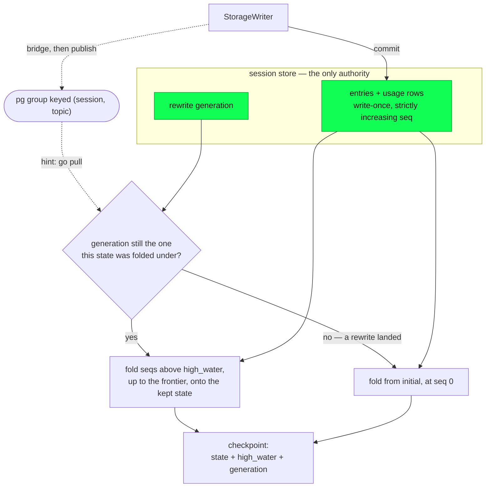

# Events, projections, and search

The `events` package keeps read models over the durable session log. The log
can answer any question about a session, but not quickly. "What just
happened" means finding what is new since you last looked. "What is this
session costing" means summing the whole usage ledger. "Which conversation
mentioned the auth migration" means decoding every entry of every session on
disk. Each answer is a fold over rows the store already holds, and the
package exists so that fold is not recomputed on every request.

Its unit is the **projection**, which `docs/architecture/durability.md`
defines: state derived from the log, rebuildable, carrying no authority, and
overruled by the log wherever the two disagree. The package holds three
pieces:

- an **event bus** that tells read models something changed;
- a **projection driver** that catches a read model up without skipping a
  row, and restarts it when the history underneath is rewritten;
- a **search service**, a full-text index over a whole repository of
  sessions.

One rule governs all three, and the next section states it.

## Events are hints; pulls are truth

An event on the bus never carries the thing that changed. It carries an id,
a seq, and sometimes a display label, and it means only "go look." Every
read model converges by scanning the store from a cursor it persisted
itself. An event that never arrives therefore costs a subscriber some
latency and nothing else.

One topic carries text: `Outputs`, the rolling tail of a running tool call.
It keeps the rule because its text is display state, of the same standing
as a phase label. Each event holds a complete bounded window that a
terminal draws and nothing acts on, and the durable tool result supersedes
it when the call settles (`protocol-change/031`).

Drop every event and each read model still converges on its next hint, its
next explicit sync, or its next restart. The package's lost-event tests
publish a hint for one commit in three and assert that the projection ends
equal to a rebuild from zero.

Telemetry is a separate channel from the bus. Its log lines are for
operators, and no read model depends on them;
[Telemetry](telemetry.md#telemetry-and-the-event-bus) describes how the
two relate.

The rule is what lets the bus be cheap: process-group membership plus
plain sends, with no acknowledgements, no retries, no buffering, and no
ordering promise beyond what a single Erlang send pair gives. The delivery
path cannot lose data because it never carries data.

The doorbell in `docs/architecture/messaging.md` applies the same idea
differently. A **nudge** is point-to-point: a sender that has just
committed a payload for one named strand asks that strand's driver to
re-plan now. A bus event is a broadcast on a session topic to whoever is
listening, and the publisher does not track who that is. Both are lossy on
purpose, and both are safe for the same reason: the durable write happened
first, and the recipient's own scheduled pull would have found it anyway.

## The bus

The bus is an OTP `pg` scope named `loom_events`, and nothing more. It has
no actor, no mailbox of its own, and no state beyond `pg`'s membership
table. A `Bus` handle is a compile-time atom in a wrapper. Publishing is an
ETS lookup of one group followed by a plain send to each local member.

Groups are keyed `#(session, topic)` inside the one node-global scope. Per-
session isolation therefore costs no per-session process, and a lookup runs
at local ETS speed. The session key is a caller-supplied string: `core`
defines no session-id type, and the gateway's canonical identifier is still
an open question recorded in `docs/spec-gaps.md`.

There are seven topics and seven event shapes, one shape per topic:

| Topic | Event | Carries |
|---|---|---|
| `Entries` | `EntryAdded(id, seq)` | an entry id and its seq |
| `Operations` | `OpTransition(op, phase)` | an operation id and a display label |
| `Usage` | `UsageAdded(id, seq)` | a ledger row id and its seq |
| `Strands` | `StrandResult(strand)` | the strand's name |
| `Escalations` | `Escalation(op, description)` | an operation id and display text |
| `Commits` | `Committed(seqs, ts)` | the seqs one transaction consumed |
| `Outputs` | `ToolOutput(strand, op, step, source_index, call_id, stream, tail, total_bytes)` | a running call's bounded output window |

Three of these shadow a register, and in each case the register is the
truth:

- `phase` is a word for a progress line, not a machine state; `op.state`
  holds the state. Keeping the event to a string also keeps the `events`
  package off a dependency on `machine`.
- `description` is text to show a human. An approval attaches to the
  durable escalation record under the reserved `escalation/` prefix.
- `StrandResult` names the strand that settled and never carries its
  result.

A subscriber that reads any of these as data is already wrong.

Six of the seven topics are hints that durable state moved; `Outputs` is a
live display feed, and the two kinds are joined differently. `hint_topics`
names the six and `subscribe_hints` joins them, which is what a
pull-driven subscriber requires. A projection driver joined to `Outputs` as
well would wake once per 32 KiB chunk of every running command and find
nothing new in the store. `subscribe_all` still joins all seven, and the
host fixture hub uses it.

Each event belongs to exactly one topic, so a process subscribed to all
seven receives each event once. Subscribing joins the *calling* process,
and `pg` removes the membership through its own monitor when that process
dies. `subscriber_count` is an ETS lookup, fine for a test or a diagnostic
but never for a decision, since membership changes underneath it.

Subscription is idempotent per `{session, topic, pid}`, and that takes a
guard, because `pg` counts multiplicity. A process that joins the same
group twice appears twice in `get_local_members/2` and receives every event
twice, and one `leave` removes only one of the two memberships. So
`bus.subscribe` checks whether the caller is already a member before
joining. The check runs in the same single-threaded process that would do
the join, so it cannot race the join it guards. Without the guard, a driver
subscribed twice makes a redundant storage round trip per event, and an
`unsubscribe` the caller believes worked leaves a live membership behind.

### The bridge

Nothing in `events` imports the runtime. The runtime's StorageWriter
publishes its own minimal post-commit notification: an ordinal, the seqs,
and a timestamp. `bus.bridge` connects the two. It starts an actor holding
a caller-supplied mapping closure, and the actor maps everything sent to it
into an `Event` and publishes it. The composition layer writes the closure,
because it is the only layer that knows both types.

The closure runs inside the bridge actor and comes from outside the
package, so a closure that crashes crashes the bridge. `actor.start` links
the new process to its starter, which would propagate that crash to the
starter. `bridge` therefore unlinks immediately after a successful start
and keeps the failure local. That matches the promise the bus makes
everywhere else: if the bridge dies, events are missed until something
restarts it, and missed events are legal. The package ships no supervised
bridge child specification today, so restarting the bridge is the
composition layer's problem, and an unsolved one.

### Who is on the bus today

The shipped daemon's gateway joins the `Outputs` topic of its session. It
relays each `ToolOutput` to every subscribed connection as a pushed
`tool_output` frame (`protocol-change/031`). Under network delivery it
joins nothing else: its commit hints arrive from the runtime writer through
`gateway.commit_forwarder`, and a bus subscription to the hint topics would
run the same pull twice per commit.

The host fixture hub joins every topic. It discards each hint's payload and
uses the arrival to pull from storage above its own high-water seq. A
projection driver configured with `FromBus` joins the six hint topics and
does the same.

The one production publisher is the effect wiring. `client/serve` supplies
`gateway.tool_output_observer` as `wiring.Config.observe_output`. The tool
collector (`tools/tool.collect_observed`) passes the observer the bounded
rolling window of each output stream after every chunk it folds, and the
observer publishes the window under the session's canonical key.

Nothing publishes a hint yet. The bridge exists and is tested, but no
composition has run the writer's publication through it. The hint half of
the bus is a working mechanism with consumers and no producer.

The bus inherits `pg`'s open access. `bus.start` is public and idempotent,
and any process on the node can join any session's groups or publish forged
events into them. Isolation here is by group key, not by capability, and
the node is the trust boundary. Rule Zero already requires that, since
model-influenced code never runs in this virtual machine at all.

A second trap for anyone wiring the bus: `bus.start` and `bus.supervised`
do not compose. `start` treats an already-running scope as success, and
`supervised` treats it as a failure to start. A component that calls
`start` first turns the supervised child into a permanent restart loop.

## Projections

A projection is a pure fold:

```gleam
pub type Projection(state) {
  Projection(initial: state, apply: fn(state, Change) -> state)
}

pub type Change {
  EntryAppended(entry: Entry)
  UsageAppended(row: UsageRow)
}
```

`apply` performs no I/O and never crashes; a shape it does not recognize
folds as a no-op. Folding the same changes in the same order from
`initial` therefore always yields the same state. That determinism is what
makes an incremental catch-up and a rebuild from zero provably equal. The
package's exit criterion tests both directions: folding after every commit
ends equal to one rebuild at the end, and a rebuilt `SessionStats` equals
the statistics the storage backends maintain natively.

Entries and usage rows share the session's seq namespace, so the two
`scan_*` reads merge into one totally ordered stream of changes by seq.
`stats_projection()` is the shipped example. It counts message entries and
sums the usage ledger field-wise, which is deliberately the same pair of
figures storage maintains for itself, so the two can be checked against
each other.

### The frontier

`catch_up(store, projection, state, after: high_water)` reads everything
past the high-water and folds it in. It issues more than one scan, and the
writer may commit between them.

The fix is a **frontier**. Before either scan, `catch_up` reads the newest
committed seq across both streams, then bounds both scans by
`(high_water, frontier]`. Seqs are strictly increasing and rows are
write-once, so that window is immutable by the time either scan runs, and
the batch is consistent whatever lands mid-pull. Anything past the frontier
is the next pull's work.

Without the bound, the loss is silent and permanent. Suppose the entry scan
runs, then a commit appends an entry at seq 40 and a usage row at seq 41,
then the usage scan runs and returns the row at 41. The high-water advances
to 41, and nothing will ever scan the entry at 40 again. The lost-event
test caught exactly that. `docs/spec-gaps.md` records the rule as
load-bearing and marks it for promotion to a repo-wide convention: **a
catch-up that issues more than one scan bounds every scan by a frontier seq
read before the first one.**

The scan order inside `frontier` also matters, and is correct: newest entry
first, then newest usage row. A commit landing between those two reads can
then only make the frontier an underestimate. A short batch is harmless; a
skipped row is not.

`rebuild` is `catch_up` from seq zero on `projection.initial`, so there is
no second implementation to drift.

### Checkpoints

A driver persists its progress through a `Checkpoint`, which loads and
saves a **triple**: the state, the high-water seq it was folded to, and the
store generation it was folded under. Any one of the three is meaningless
without the others. `ephemeral()` persists nothing and rebuilds on every
restart, which is the honest default for a cheap projection.

Saving the state together with its high-water, rather than the high-water
alone, makes a crash safe for a fold that is not idempotent. A crash
between applying a change and saving loses the in-memory state and the
advanced high-water together. The restart then folds those changes again
onto the older state, from the older high-water, so no interleaving applies
a change twice.

Persistence itself is best-effort. A checkpoint that loses a write costs a
longer catch-up, never a wrong answer.

### The driver, and what a rewrite does to it

The driver is an actor. It loads the checkpoint or starts from zero,
catches up once, and then pulls whenever it is hinted. It offers three
calls:

- `read` returns the current state without pulling. It is a local-speed
  lookup that may lag until the next hint.
- `sync` forces a pull and returns the converged state along with any
  storage fault.
- `poke` is the fire-and-forget nudge an external hint source calls.

Its configuration takes the store and the generation as *functions*, not
values:

```gleam
pub type Options(state, handle) {
  Options(
    store: fn() -> Storage(handle),
    generation: fn() -> Int,
    projection: Projection(state),
    checkpoint: Checkpoint(state),
    hints: Hints,
  )
}
```

The driver calls both on every pull because of the **precise rewrite**: the
administrative operation that erases a leaked secret from a session's
history by rewriting payloads into a copy and swapping the copy over the
original. A rewrite causes three problems, and the driver handles each.

**The handle goes stale.** A rewrite swaps the session's store. A driver
that captured a `Storage(handle)` at start would read a stale or closed one
forever, so it asks for the current store on every pull.

**The frontier cannot detect the rewrite.** A precise rewrite preserves seq
numbering and replaces payloads, so the frontier does not move. A
checkpointed projection then has nothing owed, folds nothing, and serves
the erased text forever, which defeats the operation. A rewrite that
*shortens* a session is worse: the frontier moves backwards, and every
later pull short-circuits on it.

So the store carries a **rewrite generation** counter that the rewrite
bumps (`storage/sqlite.generation`; the memory backend has no persisted
generation, and callers pass `0`). Every pull compares the current
generation against the one the checkpointed state was folded under. A
mismatch restarts the fold from `initial` at seq zero against the current
store. A fault during that pull leaves the driver's recorded generation
untouched, so a detected rewrite that has not been folded yet is retried
whole rather than half-adopted.

**A fault on the hint path has nowhere to go.** A `Hinted` cast carries no
reply channel, so a pull failure there would vanish. A driver reading a
closed handle would serve its last good state indefinitely, and nothing
would report why. The driver logs the fault instead, and an explicit `sync`
still returns it to a caller that is watching.



Solid edges are commits and reads against the store. Drop the dashed hint
and the next `sync`, the next hint, or a restart still converges. The
generation edge is what makes erasure stick. Where a projection disagrees
with the store, the store is right; the machinery above exists to detect
the disagreement.

## Search

Search is a standalone service with its own store, and sessions know
nothing about it. It reads sessions through the ordinary `Storage` scans.
It keeps its index, plus a durable per-session cursor, in one SQLite file
per repository, never inside a session file. The index carries no
authority: an indexing failure cannot affect a commit, and deleting the
database costs a re-sync and nothing more.

The schema is two tables:

```sql
entry_fts(session_id UNINDEXED, entry_id UNINDEXED, text)   -- FTS5 virtual
search_cursor(session_id PK, generation, high_water) WITHOUT ROWID
```

`entry_fts` is a content-carrying FTS5 table, so the index holds a verbatim
copy of the text it indexes. The session and entry ids are stored but not
tokenized. They let a hit name where it came from, and a caller joins back
through the repository it already holds.

### What gets indexed

`entry_text` extracts text per entry kind:

- a user, assistant, or tool-result message: its text blocks, joined by
  newlines;
- a compaction entry: its summary;
- a branch summary: its summary.

Thinking blocks and tool-call arguments are deliberately excluded, as are
images and custom entries. An entry whose extracted text is empty is
skipped, but its seq still advances the cursor, so a re-sync finds nothing
to redo.

### Sync

`sync` pulls a session's entries past the stored cursor and indexes them.
`notify` is the same function under the name the wiring uses: a hint that
one session changed triggers a pull of that session, and the next sweep
catches a lost hint. Debouncing for search-as-you-type freshness belongs in
the caller.

`sync` reads the cursor **inside** the same `BEGIN IMMEDIATE` transaction
that writes the rows, and that ordering is load-bearing. The cursor
determines what the call writes: how far back to scan, and whether to drop
and re-index. If `sync` read it before taking the write lock, two
concurrent syncs of the same session could both read the same un-advanced
cursor, scan the same range, and insert the same rows.

That duplication would be permanent. `entry_fts` has no uniqueness
constraint to conflict against, and the incremental path has no delete to
repair it, so every later query would return each entry twice, consuming
`LIMIT` and distorting `rank`. Before the fix, five entries indexed as ten.
With the read under the lock, the second sync waits its turn and then reads
the advanced cursor. The package's test races a deliberately slow scan
against a fast one, through two real connections to one index file.

Rows and the advanced cursor commit together, so a crash mid-batch re-runs
the batch into the same state.

### Rewrite invalidation

The cursor is stored with the session store's generation, and `sync` takes
the current generation from its caller. A mismatch drops that session's
index rows and re-indexes from seq zero in the same transaction, because a
rewrite replaces payloads without moving any seq, so the old cursor cannot
detect the change. A missing cursor takes the identical path.
[Precise rewrite](durability.md#precise-rewrite) describes what a rewrite
changes in the session file.

The end-to-end test runs the real sequence: a SQLite session file,
`sqlite.rewrite_into` erasing one entry's payload, and `sqlite.generation`
supplying the bumped counter. Afterwards the erased text no longer matches
and the retained text still does.

The unsafe ordering, scanning first and reading the generation afterwards,
cannot be expressed through this API. The worst available interleaving
stores an *older* generation beside newer data, which the next sync detects
as a mismatch and repairs.

### Querying

`query(text, limit)` runs an FTS5 `MATCH` and returns hits ranked
best-first. Each hit has the session id, the entry id, and a `snippet()`
excerpt in which `[` and `]` mark the matched terms. The query text is
bound as a parameter, so the caller can use FTS5 query syntax (bare words,
quoted phrases, `AND`/`OR`/`NOT`) without an injection path. A malformed
query is an `IndexFault`, not a crash.

We ran twenty hostile probes through the real API: injection attempts,
unbalanced quotes, bare operators, two thousand nested parentheses, and a
five-thousand-term disjunction. Each returned either ranked hits or an
`IndexFault`, never a crash, and left both tables intact.

A hit may be stale. It names an entry as it was when indexed, and a later
rewrite reaches the index only when someone syncs that session under the
bumped generation.

`query_in_session(session, text, limit)` has the same ranking and syntax,
filtered to one session's rows. The scope is **in the SQL**: `AND
session_id = ?` sits beside the `MATCH`, before `ORDER BY rank` and
`LIMIT`. Filtering afterwards would not give correct scoping, because a
ten-hit request narrowed to one session can come back empty while that
session has matches. It takes a `SessionId` rather than a string for the
reason given under "Naming a session" below.

`recent_in_session(session, limit)` takes no query. It returns one
session's rows by descending `rowid`, which FTS5 assigns in insertion
order. `sync` inserts a session's entries in log order and a resync
reinserts them the same way, so the highest rowids are the newest entries.
With no `MATCH`, `snippet()` has nothing to anchor on, so each hit's
excerpt is the first 160 characters of its indexed text. `history_search`
uses this call when a model asks for its own session's history without a
query.

`remove` drops a session's rows and its cursor. Call it alongside deleting
a session.

### Naming a session

Every entry point that names a session (`sync`, `notify`, `remove`,
`query_in_session`, `recent_in_session`) takes a `core/ids.SessionId`, with
no caller-supplied-string form (`protocol-change/008`). The index spans a
*repository*, which is exactly where a file-derived name ("review", from
`/data/review.db`) collides across checkouts without detection. The stored
`session_id` column and `Hit.session` hold that id's canonical text; parse
one back with `ids.parse_session_id` when the typed value is needed.

### What search does not do

These are limitations of the code as it stands, not of the design.

**CJK and emoji content is effectively unsearchable.** The schema names no
tokenizer, so FTS5 uses `unicode61`, which splits on non-alphanumeric
characters only. A Japanese sentence becomes one token, matchable only by
typing the entire sentence, and emoji produce no token at all. Other
content is indexed without restriction, and accented Latin text
round-trips correctly because diacritic folding applies to the index and
the query alike. The fix is a tokenizer change (`trigram`, or ICU), which
costs a full reindex; the M3 triage deferred it to a search-quality pass as
`EV-unicode-tokenizer`. Until then, treat the index as covering
whitespace-delimited scripts.

**Nothing reconciles the index against live sessions.** The module exposes
`open`, `close`, `sync`, `notify`, `query`, and `remove`. Nothing
enumerates indexed sessions and compares them to sessions that still
exist, so a deleted session's text stays searchable until someone calls
`remove` for it.

**A non-positive limit means no limit.** The limit is passed into SQL
`LIMIT ?`, and SQL reads `LIMIT -1` as unbounded. Storage's own convention
is the opposite (a limit of zero or below returns no rows), so a caller
computing a limit by subtraction gets the whole index instead of nothing.
Separately, an empty query string is an `IndexFault` rather than an empty
result, which a search-as-you-type caller meets on the first backspace.

Both are the caller's to handle, and `tools/history` handles them. It
clamps the limit to `[1, 50]` and never sends an empty query: in the
session scope an empty query becomes a browse through
`recent_in_session`, and in the repository scope it is refused in band with
a worded message.

**Nothing backfills a session that is never reopened.** A session's rows
enter the index while it runs, and the holder syncs once at start.
Reopening a session written before search was wired therefore indexes its
whole file, while one that is never reopened stays unfindable. There is no
sweep over the repository's session files.

**The injected notes digest is indexed like anything else.** The `agent/`
digest that `client/notes` injects at run start is an ordinary user
message, so it lands in the index. It is bounded by its own 4096-byte cap;
the structural anti-feedback exclusion belongs to memory stage M2.

## Who wires it

`client/history` is the search service's one consumer; memory stage M1
added it (issue #28). It has three pieces.

**One holder actor owns the connection.** A `sqlight` connection should not
be copied into every closure that might use it. Syncs and queries must
serialize somewhere, and a crash must be able to reopen the file rather
than leave every holder of a stale handle returning faults forever. So one
actor owns the connection. It starts under a process *name* in the
server's restartable tier, and both the tool seam and the sync reach it by
name. A restart reopens the index file at the same address.

**The writer's commit publication drives sync, not the event bus.** A
one-session server's writer sits in the same VM as its index, so a bus
subscription would only run the same pull twice, and starting a `pg` scope
for it would gain nothing. The hint is instead a second writer subscriber,
following the `client/gateway.commit_forwarder` pattern: a tiny named
actor whose only job is to poke the holder. A lost poke costs latency and
never a row, because `sync`'s own durable cursor determines what gets
indexed.

(The gateway's *own* bus subscription, for a host that supplies one, is
keyed by the canonical `SessionId` rather than by a display name. The two
key spaces are disjoint by construction, so a hub keyed by name would sit
in a group no identified publisher reaches.)

**The index file is protected.** It lives beside the session file as
`loom-search.db`, and `client/serve` adds it to the session base policy's
`protected` list before validating that policy. This is a security
property, and it extends the blob store's argument one step. Search
snippets are read back into *future* sessions' contexts, so an index a
model can write is a channel from one execution's output into a later
execution's input: prompt injection that persists. Writing is the only
poisoning path, so `protected` bars writes and leaves reads alone.

An index that will not open registers no `history_search` tool and logs
one worded line; it never refuses the boot. Recall is a projection with no
authority, and a session that cannot search its own past is still a
working session.

## The parrot pilot

The named static SQL statements behind search are generated, not written
by hand. `src/events/sql/search.sql` holds twelve named queries,
`scripts/gen-sql.sh` compiles them with parrot into `src/events/sql.gleam`,
and the generated module is committed. It carries the banner `Code
generated by parrot. DO NOT EDIT`, and the banner is accurate: edit the
`.sql` and regenerate.

Search is a deliberate pilot rather than a conversion. ADR-004 adopts
parrot for typed SQL but gates it. The workflow must first prove itself on
the next *new* SQL surface. Then `storage/sqlite`'s straightforward
statements move over in a mechanical commit series, with the plan-asserted
branch-index queries last. The storage backend is the most thoroughly
proven code in the repository: a conformance suite over two backends,
`EXPLAIN QUERY PLAN` assertions, and a fenced-lease duel. Converting it
wholesale would put that evidence at risk to gain type safety it already
has by other means. The search database has no regression risk, so it went
first.

The pilot produced three benefits, all visible in the code:

- **The SQL text comes back verbatim.** A generated function returns
  `#(text, params)` or `#(text, params, decoder)`, so the statement is a
  value rather than something hidden inside a driver. That makes the
  eventual retrofit safe for the plan-asserted queries: identical text
  means identical plans by construction, and `"EXPLAIN QUERY PLAN " <> sql`
  still composes.
- **Column order cannot drift silently.** Every call site uses labelled
  arguments, such as `sql.set_cursor(session_id:, generation:,
  high_water:)`, so reordering columns in the `.sql` becomes a compile
  error rather than a mis-bound query. Likewise `run_statement` takes a
  two-tuple, which structurally rejects a `:many` three-tuple: an `:exec`
  statement that grew a result set would fail to compile.
- **Decoders arrive with their queries.** `GetCursor` and `SearchEntries`
  and their total decoders are generated from the column list.

What stays hand-written is as much a part of the decision. Schema DDL and
pragmas are outside codegen, so the two `CREATE` statements live as
constants in `events/search`. `sql/schema.sql`, which the generation script
loads into a throwaway database, holds the same text. A test pins the two
together, comparing with comments and blank lines stripped so the prose can
change without loosening the contract. Parrot is driver-agnostic and
returns its own `dev.Param` values, so a ten-line function converts them to
sqlight's `Value`. ADR-002 is untouched, and sqlight remains the binding.

Before touching this code, know three constraints:

1. **Query files must be ASCII.** Parrot slices queries by byte offset
   while counting characters. A single multi-byte character anywhere in a
   `.sql` file silently corrupts the generated SQL of every later query in
   that file. `scripts/gen-sql.sh` states the rule in its header. The bug
   deserves an upstream report.
2. **Use the column-qualified match form.** The generator rejects the
   table-valued `tbl MATCH ?` spelling. `entry_fts.text MATCH ?` works, and
   is arguably the better spelling anyway.
3. **Nothing in CI checks any of this.** `make check` does not run
   `gen-sql`, and nothing pins `search.sql` to the committed `sql.gleam`.
   The ASCII rule and the source-to-generated correspondence are
   conventions today, not enforcement. The one exception is the DDL pin, a
   test in this package.

The recorded verdict is positive, with those findings. FTS5 virtual tables,
snippet functions, rank ordering, and upsert cursors all generate clean
typed modules; regeneration is byte-reproducible; and no hand-written
fallback was needed. The retrofit of storage's plain statements may proceed
on that evidence, and the plan-asserted queries still move last.

## What is not built yet

Beyond the search limitations above, four gaps matter before building on
this package.

**No production consumer drives a projection.** Nothing outside `events`
imports `events/projection`. Only tests exercise the driver, the checkpoint
contract, and the generation guard, which is why the `Checkpoint` contract
could still gain its generation field without a `protocol-change/`
proposal. `events/search` is no longer in that position: `client/history`
drives it in production.

**Neither pull path is batched.** Neither `catch_up` nor `search.sync` caps
its scan. A rebuild of a large session materializes every entry, every
usage row, and the merged change list at once. A first search sync of a
large session performs every insert in one immediate transaction against
the repository-wide database, where other sessions' syncs wait on the write
lock against a five-second busy timeout.

Neither is a correctness problem: a failed sync retries, and `catch_up` is
correct at any size. But the "batch" the comments describe is not yet a
batch the code enforces. The frontier is what makes a row cap safe to add,
since bounding the row count while keeping the seq bound is sound.

**A driver's first catch-up runs inside the actor initializer's five-second
budget.** With `ephemeral()`, that first pull is a full rebuild. A store too
slow for the budget does not degrade the driver; the driver fails to start.
Under supervision that becomes a restart loop repeating the same too-slow
work. Catching up after initialization, by the actor sending itself a hint,
would keep the same convergence guarantee without making process startup
depend on scan latency.

**Cross-node fan-out does not exist.** The bus publishes to the local
members of a group. Clustering the `pg` scope is follow-up work and changes
nothing here but the member list.

## Where the code lives

| Path | What it holds |
|---|---|
| `events/bus.gleam` | The seven topics and events, `publish`, idempotent `subscribe`, `select_published`, and the unlinked writer `bridge`. |
| `events/projection.gleam` | `Projection`, `Change`, `Checkpoint`, `catch_up` and its frontier, `rebuild`, `stats_projection`, and the driver actor with its generation guard. |
| `events/search.gleam` | `open`/`close`, the transactional `sync`/`notify`, `query`, `query_in_session`, `recent_in_session`, `remove`, `entry_text`, the hand-written DDL, and the parrot parameter bridge. |
| `events/sql.gleam` | The twelve generated statement functions and their decoders. Produced by parrot from `events/sql/search.sql`; regenerate, never edit. |
| `events/sql/search.sql` | The twelve named static queries — the source of truth for the generated module. |
| `sql/schema.sql` | The search database DDL, pinned to the copy in `events/search` by a test. |
| `events/internal/ffi_pg.gleam` | The confined `pg` binding, and the publish/unwrap pairing that makes the typed boundary sound. |
| `events_ffi.erl` | The Erlang shim those externals bind to. |

Each path is relative to its package's source root: `events/bus.gleam` is
`packages/events/src/events/bus.gleam`, and `sql/schema.sql` sits beside
`src` rather than inside it.

Related documents:

- `docs/architecture/durability.md` covers the store these read models sit
  on: seqs, write-once rows, and the single writer.
- `docs/architecture/messaging.md` places the bus among the four
  inter-strand patterns, alongside durable payloads and ephemeral
  doorbells.
- `docs/loom-design.md` §3.6 states the hints-and-pulls rule.
- `docs/loom-implementation-spec.md` WP-K holds the scope and exit
  criteria.
- `docs/adr/004-parrot-sql-codegen.md` records the codegen decision and its
  pilot verdict.
- `docs/spec-gaps.md` "From WP-K" records where the implementation refined
  the spec.
