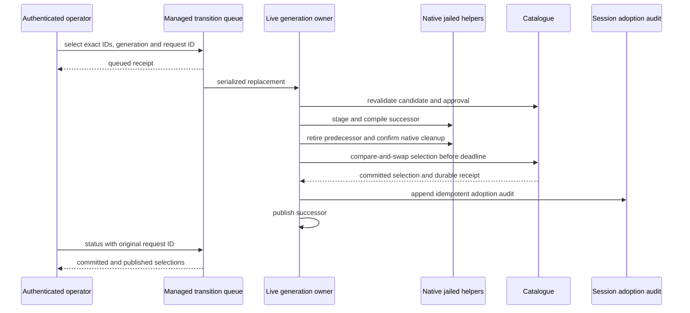

# Governed runtime evolution

Loom can retain an agent's source, test it in a jail, record the evidence,
obtain operator approval and serve an exact selected version. The conversation
continues through activation and rollback. Authored code runs in satellites;
it never enters the harness VM. [Protocol 068](../../protocol-change/068-runtime-evolution.md)
and the addendum to [ADR-007](../adr/007-extension-tiers-and-brokered-egress.md)
record this boundary. Issue [#807](https://github.com/Roasbeef/loom/issues/807)
consolidates the earlier skill, candidate and loader issues; #236 remains the
linked trace and model-evaluation workstream. This page describes the native
owners, selection boundaries and recovery path for engineers changing that
implementation.

## Three artifact kinds

| Kind | Admission and use | Selection boundary |
| --- | --- | --- |
| Executable skill (`program`) | Retain `program.gleam`, a named `run(input: String) -> report.Outcome`, author-check function, description and JSON input contract. Each invocation receives fresh JSON and passes current workspace-seam vetting and compilation. | Owner selects a version for its canonical workspace. Callers name candidate ID and generation. Their current policy governs effects. |
| Tool or hook (`extension`) | Retain the manifest, source, argument schemas and separately admitted author-test entry. Tests and the persistent implementation run in the extension jail. | An authenticated operator selects a version for their session. One generation capture covers promoted before-tool, tool and after-tool processing. |
| Model profile (`prompt`) | Retain `prompt.json` containing exact provider/model/API, system suffix, task prefix and tool-description prose. Independently admitted tasks drive paired production rollouts. | Owner selects one profile slot for an exact target. A new session pins the selected map; an existing or resumed session keeps its previous map. |

An executable skill is distinct from an instruction-only `SKILL.md` playbook.
A new trusted capability backend, storage mechanism or harness implementation
still requires a core PR and reviewed release. This surface composes existing
capabilities. It does not grant approval authority to authored code.

## Agent and operator workflow

The model sees `evolution_propose`, `evolution_test`, `evolution_inspect`,
`evolution_catalogue`, `evolution_invoke` and `evolution_trace`. Proposals name
a directory in the current caller's readable roots; provenance comes from the
native session and strand. A bounded tar snapshot runs under the caller's
kernel jail before the host decodes and hashes its bytes. Native directory
preauthorization alone would leave a check/read race on authored symlinks.

The candidate ID covers source/text, test entry, schemas, kind, publication
scope, native provenance and build/seam/evaluator identities. A seam is the
module allowlist against which authored code is vetted. Neither a path
nor a model-supplied digest grants authority. Tests produce a separate,
content-addressed evidence envelope. A passing author-owned test establishes
its checks; it does not establish model quality or replace harness-owned
isolation and lifecycle tests.

An operator inspects `inspect` and `evidence`, approves their exact identities,
and issues `select`. The authenticated connection supplies authority and
principal identity. JSON cannot grant an owner role. A session operator can
mutate their session; global workspace skills and exact model profiles require
owner authority. An observer can inspect their visible catalogue and status.

Both `loom evolution` and `loomd evolution` expose those controls:

```sh
loom evolution catalogue SESSION
loom evolution inspect SESSION --candidate-id SHA256
loom evolution evidence SESSION --evidence-id SHA256
loom evolution approve SESSION --args approval.json
loom evolution select SESSION --args selection.json
loom evolution status SESSION --request-id publish-1
```

Use `--state-dir PATH` before the action when daemon state lives elsewhere.
The command authenticates with the native owner's private daemon credential,
checks the resident incarnation and returns one JSON value. Exit zero means an
acknowledged response; a queued receipt still requires status polling. Exit 2
is invalid input, 3 is not sent or refused, and 4 is an unknown outcome that
requires receipt lookup. `--args` accepts at most 48 KiB of object JSON. A
selection payload names candidate/evidence IDs, expected generation, reason,
request ID and optional bounded deadline. No payload grants authority.

For example, after inspecting a passing candidate and its evidence, write
`approval.json` with their exact IDs:

```json
{"candidate_id":"<candidate SHA256>","evidence_id":"<evidence SHA256>"}
```

Then write `selection.json`. Generation zero means no preceding selection;
for a replacement, use the generation of the currently selected version.

```json
{
  "candidate_id": "<candidate SHA256>",
  "evidence_id": "<evidence SHA256>",
  "expected_generation": 0,
  "reason": "Verified the retained author checks and native lifecycle evidence",
  "request_id": "publish-1",
  "deadline_ms": 60000
}
```

The placeholders must be replaced with the retained identities. Run the
`approve` and `select` commands above, then query `status` with `publish-1`.
For an extension, wait for its published selection before invoking it.
To roll back, approve the retained earlier version if necessary and submit
`rollback` with that version's IDs, the current generation and a new request ID.
The deadline applies to live session-extension activation; global program and
model-profile selection changes their discovery boundary.

Promoted extensions use a stable generic tool surface. Discovery returns the
actual callable name, description, schema, candidate ID and generation.
`evolution_invoke` requires that exact version token. It refuses a stale token
instead of interpreting old arguments under a new implementation or schema.
Provider-native tool registrations remain the installed contributions.

`rollback` selects previously approved source under a new generation. It does
not reverse filesystem, network or other external effects from previous calls.
Ephemeral extension state resets; durable extension memory is version-scoped.
There is no implicit state migration.

## Catalogue, commit and recovery

The catalogue is `<state>/evolution/evolution.db`. Its entire parent directory,
SQLite sidecars and native runtime scratch are protected from filesystem tools
and every jail. The catalogue reuses `session.open_sqlite_owned`, generated
storage queries and reserved facts. There is no handwritten SQL or separate
schema. Compilation and execution hold no catalogue writer lease.

Catalogue handles for the same canonical file share its fenced writer lease,
including callers from separate sessions or VMs. Admission uses a one-second
`weft/poll` budget, with a ten-millisecond native SQLite busy timeout.
Only typed native lock-busy or held-lease refusals before ownership are retried.
An admitted operation and its acknowledged retirement each run once.
Transition deadlines are checked after admission and immediately before a new
selection compare-and-swap (CAS). An exact committed receipt remains recoverable
after that deadline.

Native compilers receive a writable view of only their own artifact directory
and discovered toolchain mounts. Satellite nodes receive that directory read
only. Caller grants cannot widen either native launch view. Capability calls
restore the original caller policy, workspace and execution identity, so the
artifact exception cannot become permission to read another session's source.

Independent prompt fixtures live under `<state>/evolution-trials`, beside the
protected catalogue. The source session masks that parent before taking its
policy snapshot. Each trial can read and write only its own fresh workspace;
it retains the source's protected-state, network and resource restrictions.
Its native toolchain mounts are discovered anew. Relocating a cap socket never
removes the original catalogue or daemon-state masks.

Each short mutation appends a lifecycle entry and updates reserved facts in one
fenced transaction. Selection compares the complete preceding selection and
current approval/revocation sequence, so an A → B → A rollback cannot bypass
an expected-generation check. Exact model profiles have one slot per target,
even when candidate aliases differ.

A live extension's central selection CAS is the irreversible commit point.
The session adoption audit is a separate, idempotent commit referencing it.
These two SQLite transactions are not atomic together. Recovery finishes the
missing audit, revalidates current approval and reconstructs the committed
version before publication. Staging failure leaves the previous selection;
a failed CAS after retirement rebuilds the committed predecessor.

For a session extension, the live owner performs the following sequence.
It holds the complete promoted hook/tool fold while replacing its generation.



| Failure | Owner's response |
| --- | --- |
| Capture, author check or staging fails | Retain the refusal or evidence; no new selection commits. A staging failure keeps the predecessor available unless cleanup custody is itself uncertain. |
| Predecessor retirement is unconfirmed | Retain its remaining cleanup task and refuse publication or another allocation. The old central selection remains, but the live owner does not claim it is callable. |
| Selection CAS loses after retirement | Discard the staged successor and reconstruct the committed predecessor. Failed reconstruction or cleanup remains an explicit refusal. |
| Selection commits but adoption fails | Preserve the durable selection and receipt. Recovery must complete the audit and reconstruct that committed version before publication. |
| Caller loses an acknowledgement | Look up the original request ID. A missing response does not prove that selection failed. |
| Caller presents a stale invocation token | Refuse instead of interpreting its arguments under the replacement schema. |

The gateway response window is six seconds. Selection therefore returns a
queued receipt immediately and staging runs behind one managed job. The
operator polls `status` with the original `request_id`; an identical retry
resolves the same request, while reuse for different arguments is refused.
The finite deadline governs admission through the central CAS. After a commit,
audit/publication recovery must finish even if the original caller's wait has
expired. A durable receipt takes precedence over a timed-out queue wait.

`completed` status distinguishes the committed selection from the currently
published selection. A committed transition whose adoption is still running
can report `committed` with `published: null`. A failed acknowledgement is not
proof that no selection committed.

## Worker custody

The live owner serializes complete promoted invocation folds against replacement.
A provider request already rendered retains its original bytes. Installed
hooks remain installed; the promoted hook layer captures one generation for
its complete fold. Newly promoted hooks join future events; activation does
not replay the original session-start event. Cancellation and revocation do not
transfer the old version's capabilities to a replacement.

A promoted generation owns a dedicated two-helper executor pool: one persistent
satellite and one nested brokered process. One active generation and one
staging/retiring generation bound replacement concurrency. Publication waits for
orderly executor/helper retirement. A BEAM exit, hook-host stop report or execution
`CallExited` does not prove native cgroup/port cleanup. An unconfirmed verdict
retains its retry capability and blocks another allocation. Trial and author-test
planes follow the same rule before returning evidence.

Cleanup carries a typed remaining task. After an executor's failed frozen
verdict, its continuation rechecks the original pool's native inventory.
Confirmed helper retirement is consumed once; a later directory-removal failure
retains deletion alone. An acknowledged legacy-host failure transfers that
remaining task before the host exits, rather than retaining a dead host address.
Failure to receive a report still proves no cleanup.

## Model evaluation and traces

An operator uses `admit_tasks` to capture a version-one task set. Each task has
an ID, prompt, initial file map and an exact expected-file map. Sorted fixture
and criterion bytes are part of the immutable task-set identity. The model can
name that admitted identity in `evolution_test`; it cannot author its scorer.
Every baseline and candidate arm opens a fresh production runtime and workspace,
with ordinary jailed tools and one exact resolved model. Trial workers retire
before independent file comparison, eliminating authored path races during scoring.

The native request guard reserves conservative context/cache/output tokens and
priced cost before every dispatched request, including failed attempts. The
comparison retains worst-case debits for attempts lacking complete native usage
across both arms; measured usage cannot silently refund an unknown charge. The
comparison records actual usage, turns, tool executions, task/criterion IDs,
profile IDs and composed-request digests. Incomplete work, absent outcomes or
unconfirmed retirement produce durable inconclusive evidence. Scripted lifecycle
callbacks never produce model-quality evidence. The production fixture uses a
scripted HTTP provider to prove the coding/evaluation machinery. It does not
demonstrate a statistical improvement on a commercial model.

An authenticated operator can `mark_outcome` on a settled assistant entry in their
source session. `evolution_trace` joins bounded source excerpts, actual model
identity, usage and these independent marks. A missing mark stays `unmarked`.
Thinking, opaque signatures, images and provider diagnostics are excluded.
Credential-shape and credential-named-JSON scrubbing happens before clipping.
This heuristic can leave short unlabelled secrets or private prose; it is not
an arbitrary-text secrecy proof.

A session pins its immutable profile map. The gateway chooses an overlay only
after each actual fallback, vision or child target is resolved, starting from
the unchanged base request on every attempt. Description overlays cannot change
registered names, schemas, requirements, replay policy or generated capability
signatures. Every attempt journals its actual profile and composition digest.

## Module ownership and reading order

The controller lives in the existing `client` package; it is not a new
package or an authored module loaded into the harness. Paths below are
relative to `packages/client/src/client/evolution/`.

| Modules | Responsibility |
| --- | --- |
| [`record`](../../packages/client/src/client/evolution/record.gleam), [`identity`](../../packages/client/src/client/evolution/identity.gleam), [`store`](../../packages/client/src/client/evolution/store.gleam) | Immutable envelopes, native compatibility identity, protected catalogue, approval and selection transactions. |
| [`candidate`](../../packages/client/src/client/evolution/candidate.gleam), [`evaluate`](../../packages/client/src/client/evolution/evaluate.gleam), [`program`](../../packages/client/src/client/evolution/program.gleam) | Jailed capture, author checks, compilation and fresh program inputs. |
| [`control`](../../packages/client/src/client/evolution/control.gleam), [`cli`](../../packages/client/src/client/evolution/cli.gleam), [`queue`](../../packages/client/src/client/evolution/queue.gleam), [`page`](../../packages/client/src/client/evolution/page.gleam) | Authenticated operator actions, bounded managed staging, receipts and complete paged inspection. |
| [`live`](../../packages/client/src/client/evolution/live.gleam), [`native`](../../packages/client/src/client/evolution/native.gleam), [`retirement`](../../packages/client/src/client/evolution/retirement.gleam), [`hook`](../../packages/client/src/client/evolution/hook.gleam) | One published generation, its jailed planes, remaining cleanup obligations and serialized invocation folds. |
| [`prompt`](../../packages/client/src/client/evolution/prompt.gleam), [`model_door`](../../packages/client/src/client/evolution/model_door.gleam), [`tasks`](../../packages/client/src/client/evolution/tasks.gleam) | Profile capture, model-facing dispatch and independently admitted task criteria. |
| [`rollout`](../../packages/client/src/client/evolution/rollout.gleam), [`rollout_host`](../../packages/client/src/client/evolution/rollout_host.gleam), [`fixture`](../../packages/client/src/client/evolution/fixture.gleam), [`trace`](../../packages/client/src/client/evolution/trace.gleam) | Paired production runs, aggregate request budgets, scoring after native retirement and bounded observations. |

The adjacent package contracts are described in the READMEs for
[`codemode`](../../packages/codemode/README.md),
[`ext`](../../packages/ext/README.md), [`tools`](../../packages/tools/README.md),
[`runtime`](../../packages/runtime/README.md),
[`provider`](../../packages/provider/README.md),
[`prompt`](../../packages/prompt/README.md),
[`session`](../../packages/session/README.md) and
[`storage`](../../packages/storage/README.md).

## Hard bounds and deliberate limits

| Boundary | Current ceiling |
| --- | --- |
| Candidate catalogue | 128 candidates, 1 MiB per candidate, 32 MiB retained envelope bytes. |
| Author snapshot | 256 archive entries, 256 KiB per file, 1 MiB inflated source; bounded complete archive output. |
| Evidence | 256 records, 64 KiB per envelope. |
| Task admission | Ten tasks, 64 initial and 64 expected paths per task, 256 KiB captured JSON. |
| Operator activation | One queued managed job; relative deadline at most 120 seconds; bounded deduplication receipts. |
| Model-facing comparison | At most 20 trials, 20 turns, one million aggregate tokens, two dollars, 64 KiB retained output and 120 seconds. Callers may lower ceilings. |
| Trace door | At most 32 retained turns; 100 source descriptors, 256 usage rows, 16 KiB per source entry, 1 MiB source copies, 32 KiB retained excerpts. |

The catalogue envelope ceiling is not a cap on its append-only lifecycle journal.
Author-test and rollout CPU/memory enforcement inherit the ordinary helper and
sandbox policy; token/cost limits do not replace those kernel boundaries.
Multiple-candidate search, GEPA/Pareto optimization, family-wide profile inference,
resident authored modules, dependency downloads and automatic state migration are
outside this implementation. Noise handling and holdout quality require real
model trials; a scripted fixture cannot certify those properties.

## Acceptance evidence

`make e2e-evolution` enables three fixtures in `packages/client/test/client/`.
They use a scripted loopback HTTP provider with the actual runtime, compiler,
SQLite, capabilities and native helpers.

| Fixture | What it demonstrates |
| --- | --- |
| [`evolution_acceptance_test`](../../packages/client/test/client/evolution_acceptance_test.gleam) | Author, test, approve, replace, roll back and continue in the same conversation, with native retirement and helper census checks. |
| [`evolution_program_acceptance_test`](../../packages/client/test/client/evolution_program_acceptance_test.gleam) | Two sessions discover one selected workspace program, pass fresh input and enforce each caller's own policy. |
| [`evolution_prompt_acceptance_test`](../../packages/client/test/client/evolution_prompt_acceptance_test.gleam) | Independent admitted file criteria, paired coding runs, durable comparison evidence and pinned profile composition. |

Focused tests under `test/client/evolution/` cover stale selection, deadline
admission, unknown spend, paged bytes and remaining cleanup custody.
`make check` establishes the repository gate; platform signoff also exercises
kernel enforcement and shipped release behavior. Those are separate verdicts.
CI and signoff enable the evolution fixtures explicitly. Passing scripted
fixtures establishes this operational loop, not commercial-model quality.
