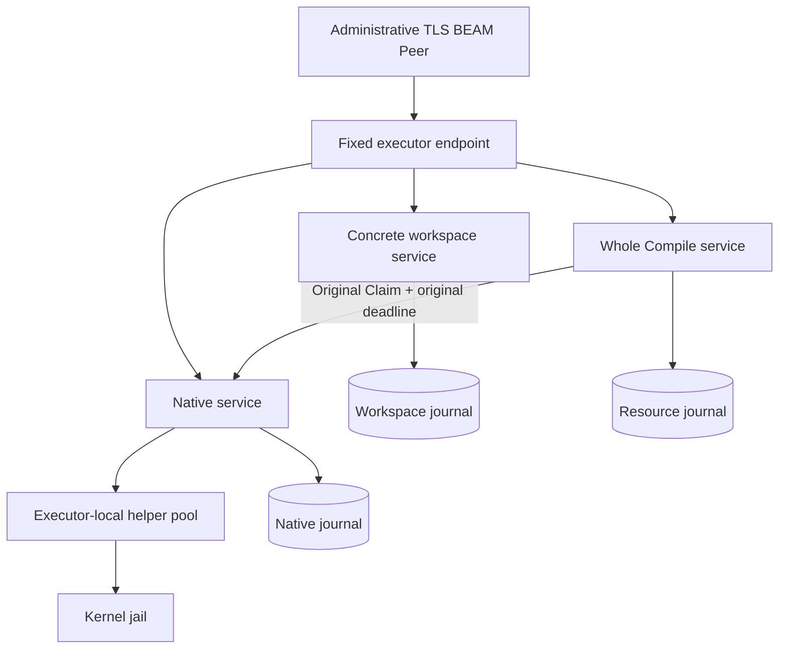

# The executor service

The local executor service owns helper bookkeeping; native helpers and the
kernel own confinement. The distributed executor extends that same effect
boundary with exact durable request identity, original policy enrollment and
retained results beside a workspace. Trusted executor BEAM nodes share the
owner's runtime trust domain, while every model-written satellite remains in
an external jail.

The local service and standalone smoke entrypoint are implemented on main. The #697
components described next exist in the integration tree, including whole
Compile, owner consumption and the TLS BEAM endpoint. Registered daemon
assembly, Launch/satellite, remote LSP and separate-host ordinary-tool
acceptance remain pending. The following local-service design/history sections
retain their original phase-specific evidence; their old cut lists are not a
current inventory of distributed components.

## Trusted executor membership

`executor/remote/distribution` starts TLS distribution in a previously
non-distributed OTP 29 VM, before endpoint publication. Administrative configuration contains
one local full node name, at most thirty-two peer names and exact certificate
pins. Names are validated before atoms are created. Mutual certificate
verification checks the leaf pin and full-node subject alternative name in
both directions. Boot refuses plaintext options, unsafe overrides and another
distribution start. It provides no plaintext retry.

The launcher uses a private OTP home for cookie loading and restores the
operator's OS HOME inside the runtime. `protected_membership_paths` returns
the five actual canonical credential/options paths checked at boot. Trusted
registration and jail assembly must keep those paths inaccessible to executed
programs. The bootstrap cannot establish that an embedding host retained those
protections in every sandbox policy.

A successful Membership can resolve an opaque Peer from the finite configured
list. That Peer is administrative identity; `connect` separately observes
connectivity under a finite budget. Fixed discovery resolves only
`loom_executor_endpoint`. Hidden nodes and explicit-only connection policy
constrain topology, not the privilege of a connected executor. Distributed
Erlang permits remote process creation, so compromise of a member affects the
runtime trust domain. Satellites must receive no cookie, private key, boot options or membership
handle. Credential and descriptor exclusion in the deployed jail remains an
acceptance check. Joining this domain does not add a Raft voter.

## One concrete endpoint

`executor/remote/beam_endpoint` binds trusted local registrations to existing
service actors. A registration retains the original owner Peer, labels, full
session/workspace scope, authority epochs and transport generation. Native
registration requires the actual registered native service. Compile registration
derives the native endpoint and enrollment from its whole Compile actor, so a
same-scope replacement service cannot silently satisfy a live command route.
Network frames cannot install registrations or choose a callback.



Up to sixteen registered scopes share four data credits and two control
credits. First native/Compile admission and stdin use data capacity; query,
cancellation and receipt have reserved control capacity. These limits cover
admitted exchanges, not arbitrary mailbox traffic from a trusted full-node
peer. Administrative close quiesces new admission; it supplies no native
retirement evidence.

The closed transport header is at most 1 KiB and retains the existing Hello's
complete binding. Canonical payload bytes remain unchanged. Native frames are
bounded to 256 KiB with a separate 128-KiB Prepared limit. Invocation transfer
is at most nine MiB; workspace completion is at most thirty-two MiB; Compile
completion is at most 256 KiB. Existing 64-KiB chunks require consumption replies
one frame at a time. Content limits do not imply an equal resident-memory bound.

A credit retains a stable final reply subject for the concrete service ask.
Once that ask is queued, transport cancellation or caller death cannot retract
it. Credit reuse requires the actual service answer and the managed transport's
final `AllDelivered`. An unconsumed local handoff carries its run correlation;
late handoffs from an old run are refused before touching a new registration.
Lost asks or drain witnesses retire capacity. Endpoint death does not establish
native cleanup, so the embedding owner must reconcile the service and helper
lifetimes before replacement.

## A native scope borrows the node endpoint

The node endpoint outlives each registered native host. `remote/host` starts its
native service before publication and sends Register and Fence from the same
process. A lost Register acknowledgement therefore does not justify creating a
new host or allowing late registration to pass the original fence.

Closing a host first fences that exact row and quiesces fresh native admission.
It waits for the row's actual service replies and managed transport joins while
the service can still produce them. It then requests native retirement through
the original service and waits for that service to exit. Failure at an earlier
step does not suppress later cleanup attempts; failure at any step prevents
journal release. The service retains the original physical-close disposition
across a later persistence error, so retrying does not manufacture evidence by
closing an already-closed pool. A dead service with a lost disposition remains
uncertain.

This ordering preserves sibling scopes and the node's shared credits. Endpoint
drain establishes transport custody only; it does not establish native retirement.
The current host owns the native scope. Whole Compile and workspace owners still
need their corresponding physical-resource proofs in the final node assembly.
The [scoped host review](../review/distributed-scoped-host.md) records the actual
TLS controls and their limits.

## Durable work outlives transport

The [custody guide](remote-custody.md) describes owner tool/run admission and
immutable child reservations. The [compilation guide](remote-compilation.md)
describes original preparation and native association. Transport references,
node connectivity and endpoint generations never replace those durable keys.

Native Request, finite Authority and Admit precede a live resource association.
Only the original preparation Claim can obtain a new launch permit, and that
association commits under the same writer lock as outer cancellation. The
native engine then checks the original clamped monotonic deadline before its
existing launch-intent path. Historical association reconciles evidence; it
cannot grant another permit. The actor-owned Compile route supplies the
original Claim, rather than constructing a live context from historical input.

Compile has one to four original continuations and a separate bounded metadata
window. It reserves input and full outer completion capacity before exclusive
allocation, source preparation and Ready. Native output/terminal evidence must
be committed before the original continuation finalizes the artifact and
commits the exact closed completion. Ready is a preparation receipt, not
successful Compile or evidence that a listener is live.

Each resource database uses its existing actor and named Parrot/sqlc queries.
No new transport database or generic remote procedure registry exists. Exact
historical query/ACK can survive endpoint loss and journal reopening; neither
recovery nor a changed clock supplies another deadline, UUID or preparation
claim. Native retirement, resource cleanup, native owner receipt and outer
owner receipt retain separate witnesses.

## Distributed verification boundary

Actual component tests boot two independent TLS BEAM VMs. Bootstrap controls
cover pins, names, missing client certificates, plaintext, cookie mismatch and
unsafe options. Endpoint controls exercise closed routes, shared credits and
correlation-fenced handoffs. The owner Compile fixture joins the original
Broker, real compiler/helper, both journals and exact durable receipts over
that endpoint. Same-host VMs do not prove separate-host filesystem isolation.

The [bounded P model](../../protocol/models/remote-execution/README.md) checks
native/product custody, preparation, exact wall, live association, owner-run
discharge and endpoint credits. Its service answers, durable commits and drain
observations are assumed truthful. Channel PlusCal and the admission Lean
bridge remain limited to their established contracts. These checks neither
prove TLS/OTP signal delivery nor SQLite crash atomicity, physical compilation
or kernel retirement. Component gates belong to exact source/dependency
snapshots; a focused probe with an explicit weft overlay is not the final
repository gate.

The daemon has not yet assembled this into the ordinary registered-workspace
product. Launch/satellite, remote LSP, configuration and the separate-host
acceptance run remain required. Legacy socket transport modules and fixtures
remain during migration; TLS BEAM is the selected single inter-node transport
under the [protocol amendment](../../protocol-change/067-remote-workspace-services.md#addendum-trusted-executor-distribution).
The native historical-context Missing/Conflict classification still has its
separately pending correction. These limits belong to integration, rather than
permission to fall back to local execution or replay uncertain work.

## Local service design and history

Loom runs untrusted work in a native jail and keeps the books on that work in
Gleam. The two halves already existed: `broker/exec` supervises `loom-exec`
helpers, and the helper builds the jail. What did not exist was a single
object that says "this execution, on this helper, is in this state, and its
native resources are in that one". Issue #696 asks for one. This document began
as the design, written before any code and accepted in
[ADR-017](../adr/017-executor-service-seam.md). S1 built the service lane, S2
hardened it and made it the default, and S3 gave it an operational surface: a
bounded snapshot, counters and latency summaries, and telemetry lines. The
page records where the tree is, the
shape the service took, how each lifecycle invariant is held, and which parts of
the issue the survey showed to be wrong.

The service is built and, since S3, it is the only execution model a session
has. The direct dispatcher, which is the broker's behaviour from before the seam
existed, was the rollback through S2; S3 removed the switch that chose it (see
"The lane switch"), and a follow-up deleted the dispatcher itself. The tests and
the M3 demo reach the service through `broker.start(BrokerConfig)`, which starts
one over a pool's seams. The one-shot build and check planes run the service too.
"The tree today" describes the direct dispatcher as the tree stood before the
service, from the survey, and cites its code by function name because the file is
gone. "The target shape" and "The state model" describe what
S1 built, and where the build differs from the S0 sketch the text says so. The
sections on shutdown, defects and verification carry what S2 added, and "The
operational surface" is S3's. S4, the standalone entrypoint, is built and has its own section below. S5, the Go decision, is built and recorded in ADR-018. The doc-check gate verifies every
`path:line` citation below, so a phase that moves code will fail the build until
this page is brought along. That is deliberate.

## Why the boundary exists

The issue states the split in one sentence, and the design keeps it: Gleam
describes, supervises and exposes execution, and a native process establishes
confinement and proves what happened to operating-system resources. The
reasons are those of Rule Zero (`docs/loom-design.md`). A BEAM actor is not an
independently sandboxable kernel process, so OTP supervision cannot stand in
for namespaces, Landlock, seccomp or a process-group kill. A NIF would run
inside the emulator's address space and change the failure boundary without
creating per-actor confinement. The jail therefore stays out of process, and
the kernel stays the boundary.

What belongs on the Gleam side is everything that is bookkeeping about the
jail: who asked for an execution, which helper carries it, what state it is in,
who is owed a settlement, and what the native side has and has not proved. The
tree already does part of this work, scattered across three modules. The
helper machine knows one execution as a payload inside one of its phases. The
pool knows custody of helpers. The broker's per-call relay knows deadlines and
the caller. No module owns the execution as a whole, so four properties that
the issue lists as invariants rest on convention rather than on a type: a
relay learns when its helper dies, a cancel cannot reach a replacement
execution, a settlement happens once, and shutdown accounts for work in
flight. The service exists to make those four mechanical.

The service does not make execution faster, and nothing here claims it will.
It adds one hop between the broker and the helper, and the baselines at the
end of this page exist so that the hop is measured rather than assumed free.

## The tree today

The survey behind this section read every module the service touches. The
facts that shape the design are these. They describe the direct lane, which was
what the tree did before the service and which a follow-up deleted. Where S2 has
since changed a fact, the paragraph says so.

### The helper machine

`broker/exec` holds two weft state machines. The per-helper machine wraps one
`loom-exec` process behind a `Transport` seam. Its phases are `Prepared`,
`AwaitingHello`, `Idle`, `Running`, `Cancelling` and `Dead`
(`broker/exec.gleam:618`). An execution is the `RunningExec` payload carried by
`Running` and `Cancelling` (`broker/exec.gleam:646`). It has a frame id from a
counter that belongs to the helper process, and that id never leaves the
module: callers correlate events by the `Subject` they passed to `run`. No
registry, queue or identity exists above it.

The helper machine owns three timers: the handshake deadline, the cancel
grace, and an idle heartbeat. The heartbeat is off in production, because
`start_helper_pool` sets `heartbeat_interval_ms: 0`
(`client/serve.gleam:697`). The execution's wall deadline is not in the helper
machine at all. It lives in the broker's relay and, independently, in the
helper's own `wall_s` policy limit.

### Pool custody

Custody of a helper is two independent facts. `Availability`
(`broker/exec.gleam:2799`) says what the pool may do with the entry:
`Available`, `Borrowed`, `Draining`, `RetiringActor` or `Unconfirmed`.
`Retirement` (`broker/exec.gleam:545`) says what the helper machine knows about
its own native process, and it has four values. `NoNativeResource` means
nothing was acquired. `PendingExit` means the helper was told to go, by a
shutdown frame or, since S2, by `SIGKILL`, and the port is retained so the exit
status can still be selected; it records which (`Awaiting`: `AfterShutdown` or
`AfterKill`). `NativeExit(status, awaited)` means that status arrived, and it is
the only evidence
[protocol-change/014](../../protocol-change/014-helper-shutdown-witness.md)
accepts. `LostExit` means the port is gone and the proof is lost for good.

The pool never reuses a slot without evidence. Capacity is counted over every
entry, including draining and unconfirmed ones (`lendable_again`,
`broker/exec.gleam:3278`), and an entry leaves the inventory only when its
actor exits normally after a recorded retirement (`record_owner_exit`,
`broker/exec.gleam:3185`). Until S2 the cost was that most failures ended in
`LostExit`: `mark_dead` closed the port, and `kill_transport` closed it before
it sent `SIGKILL`, so no exit status could follow. A helper that missed its
cancel deadline, timed out its handshake or violated the protocol therefore
cost one slot permanently. S2 keeps the port across the kill (`kill_transport`,
`broker/exec.gleam:2406`, reached from `mark_dead`, `broker/exec.gleam:2452`), so
the status is selected and `native_verdict` (`broker/exec.gleam:1708`) can retire
a killed helper that left no live jail, or whose jail was bwrap's; "Defects found
on the way" has the rule. A write that fails waits for the status as well
(`mark_gone`): a port delivers `{exit_status, S}` and then closes, so a helper
that died on its own finds its status queued behind the failed write, and
recording `LostExit` there dropped it. A kill whose SIGKILL
does not land would otherwise hold the slot `Draining` for ever, so the
retained port carries a `kill_witness_ms` state timeout (5 s), which a failed
write arms too: on expiry the
port is closed and the proof is `LostExit`, which can lose a proof but never
grant one. The pool
has no waiter queue. A full pool answers `AllBusy(size)` at once
(`next_helper`, `broker/exec.gleam:3325`), and waiting is the caller's polling loop
(`clear_awaiting_helper`, `broker/broker.gleam:495`), which `docs/weft.md`
rules deliberately hand-rolled. Idle retirement (#283) is not implemented.

### The direct lane's relay

Every cleared call reaches a helper through the `Dispatcher` the broker was
started with, and the direct lane's was `broker/direct`. `start_execution`
(`broker/broker.gleam:1109`) builds a `Dispatch`, calls `Dispatcher.start`, and
on success keeps an `Active` row (`broker/broker.gleam:280`) holding the
`Execution` the dispatcher returned, the broker's monitor on that execution's
guarantor, and the call's token and budget slot. The broker never holds a
`Helper`. Direct `start` borrows a helper, spawns an
unlinked relay process, waits for the relay to hand back the event subject it
owns, and only then sends the helper its start with `exec.run`,
before `start` returns. The relay (`relay`) forwards output to the caller, enforces the wall
deadline, and on a terminal event calls the broker's `settle` closure, which
sends the broker a `Settle` and then the caller a `CallSettled`. The broker
handles that `Settle` by demonitoring the guarantor, calling the execution's
`release`, which in this lane is `checkin`, and running `reclaim`
(`broker/broker.gleam:987`), which revokes the token and releases the budget
slot.

The relay selects two things: events from the helper machine, and the death of
the caller (`relay_wake`). It does not watch the
helper actor itself. When that actor dies mid-execution, nothing sends a
terminal event, because the death notice runs inside the dying actor
(`notify_death`, `broker/exec.gleam:2618`). A relay with a wall deadline
eventually settles through its grace window. A relay with `deadline_ms == 0`,
the session-lifetime jobs of protocol-change/058, waits in
`selector_receive_forever` and never settles. The
jail itself is not leaked, since the port closes with the dead owner, the
helper reads end of file, and it cancels and joins its jail. The hang is on the
BEAM side. A relay that itself dies unsettled is also silent to its caller: the
broker's monitor on the guarantor fires and the broker reclaims the slot and the
token, but `settle` was never called, so no `CallSettled` follows.

### The per-session effect plane

`start_effect_plane_in` (`client/serve.gleam:761`) builds one pool and one
broker for each session, and one executor service between them. The pool and the broker are captured by value in closures, and each is a
fatal child of the instance (`instance_children`, `client/serve.gleam:2153`),
since a replacement would be unreachable. The service is a third fatal child. The custody order of a session's teardown is Runtime,
Services, Broker, Helpers, Mcp, Storage, Namespace (`clean`,
`client/internal/instance_owner.gleam:366`), so the session's writer lease is
released only after the `Helpers` step has shown a native exit for every helper
the session owned. `Helpers` is `executor.close` with a two second drain budget and
a five second helpers budget (`client/serve.gleam:773`), which drains executions
and then closes the pool. Before the service it was `close_pool` with a five
second wait.

Only `serve.gleam` builds the pool. Only `executor.gleam` and its relays
call `run`, `stdin` and `cancel`, and `broker.gleam` reaches them through the
closures of an `Execution`. Seven clearance sites share the one broker per
session: the ordinary tool runner, the jobs runner, goal checks,
language-server jails, the hook runner, the worktree observer and the
git-identity step. Code mode reaches the broker through the opaque `Broker`
handle at fifteen call sites in the `codemode` package, so any design that
changes the handle's type touches all of them. One non-broker borrower exists:
the boot-time `degraded` probe checks a helper out directly
(`client/serve.gleam:6576`).

Some native processes never go through the pool, and "all execution goes
through the service" must not be read to include them: MCP servers (an open
issue, #109), the `loom-exec --publish-git-identity` step, credential commands
in `[secrets]`, and the daemon's own launch helpers.

### The native side

The helper is a 316-line frame loop that serves one execution at a time, and
it holds no state between executions. Two facts about it matter to the
service. First, it reports an execution as free as soon as the child is
reaped, which is strictly before the terminal frame is written and before
cgroup removal is joined (`execFreed`,
`sandbox/internal/server/server.go:147`). A broker that treated `exec_exit` as
"fully cleaned up" would claim more than the helper does, which is why
protocol-change/014 insists on the process exit status as the witness.

Second, the helper has a latent head-of-line fault. `exec_stdin` is handled
on the frame-loop goroutine, and `WriteStdin` holds the execution's mutex
across a pipe write (`WriteStdin`, `sandbox/internal/jail/run.go:649`). A
payload that never reads stdin, given enough stdin to fill the pipe, blocks the
loop, so cancel, heartbeat and shutdown frames go unread. `Cancel` needs the
same mutex (`sandbox/internal/jail/run.go:678`), so the wall-clock timer stalls
too. That fault is fixed on its own branch; see "Defects found on the way".

## The target shape

The shape below is what S1 built. Where the build departs from the S0 sketch
the text names the departure and the reason, because the sketch is what
ADR-017 and the issue comment describe.

### The seam

The service sits at the execution level. The broker keeps what it owns today,
which is policy composition, tokens, budgets, abort epochs and the `Active`
rows. Where it used to check a helper out, run the execution, relay events and
check the helper in, it calls a record of functions instead, defined in
`broker/dispatch`:

```gleam
pub type Dispatcher {
  Dispatcher(start: fn(Dispatch) -> Result(Execution, StartRefusal))
}

pub type Dispatch {
  Dispatch(
    request: exec.ExecRequest,
    seq: Int,
    deadline_ms: Int,
    clock: Clock,
    caller: Option(Pid),
    deliver: fn(Chunk) -> Nil,
    settle: fn(Terminal) -> Nil,
  )
}

pub type Execution {
  Execution(
    id: ExecutionId,
    guarantor: Pid,
    cancel: fn() -> Nil,
    stdin: fn(BitArray, Eof) -> Nil,
    release: fn() -> Nil,
    abandon: fn() -> Nil,
  )
}
```

`start` answers synchronously. A `NoHelper(CheckoutError)` refusal feeds the
broker's existing congestion handling unchanged, so `AllBusy(size)` still
means what it means today, and `NotStarted` is the dispatcher saying it could
not set up its own machinery, which the broker answers as `BrokerUnavailable`.
`start` must answer at once, because the broker calls it from its serial
message handler, and a service that parked the request would wait for a helper
that only the broker's own mailbox can release
(`docs/architecture/effects.md`, "Tokens, budgets, and the helper pool"). The
wait therefore stays in the caller.

The broker builds `deliver` and `settle` per call. `deliver` sends the caller
its `CallOutput`; `settle` sends the broker its own `Settle` and then the
caller its `CallSettled`, the same two messages in the same order as before the
seam. A dispatcher reports `settle` exactly once per started execution, by
whichever of its relay and its service holds the verdict, and the next two
paragraphs are how that is made true. The returned `Execution` is all the
broker keeps: its closures are the only way back to the helper, so the broker
never holds a `Helper` and never imports an implementation. In the direct lane
the closures capture the helper, exactly as the broker's `Active` row did. In
the service lane they name the execution by `ExecutionId` and cast to the
service, which looks the row up and drops anything addressed to a row that is
gone.

**`release` and `abandon` are exclusive.** The S0 sketch had only `abandon`,
and the helper's return was left to the dispatcher. Building the direct lane
showed that the moment of the return matters. The broker handles a `Settle` by
demonitoring the execution's guarantor, which also flushes any `DOWN` already
queued, then calling `release`, then reclaiming the slot and token
(`broker/broker.gleam:987`). A guarantor `DOWN` that reaches the broker with
the monitor still in place calls `abandon` instead, through
`handle_guarantor_down` (`broker/broker.gleam:1013`). Because the demonitor is
the step that separates the two paths, the broker calls exactly one of them for
any execution, never both and never `abandon` after a settlement. An earlier
draft returned the helper from inside the relay, ahead of `settle`, and that
opened a window in which a relay killed between the two made the broker
`abandon`, and so cancel, a helper that another call had already been lent. The
helper therefore goes back where it always went, while the broker processes the
settlement, and the broker's own ordering is what keeps `abandon` away from a
helper that has been lent on. In the direct lane `release` is `checkin` and
`abandon` is a cancel followed by `checkin`. In the service lane both are casts
to the service, covered below.

**The relay is the guarantor, in both lanes.** The guarantor is the process
whose unsettled death means `settle` will never be called, and the broker
monitors it. S0 sketched the service as the service-lane guarantor. As built it
is the relay in both lanes, which is the process that calls `settle`, so the
broker has one rule (demonitor on `Settle`, `abandon` on `DOWN`) and it is the
same rule for either dispatcher. The service watches the relay as well. A
relay that dies unsettled is therefore seen twice, by the broker, which casts
`Abandon`, and by the service's own monitor, which delivers `RelayDown`.
Whichever arrives first removes the row, cancels the helper, returns it busy so
the pool retires it, and settles the caller as `ExecutionLost(RelayDown)`. The
second finds no row and is dropped. That makes the caller's settlement
unconditional in this lane, where the direct lane gives none.

Carrying closures rather than ids keeps the direct lane free of a registry.
`ExecutionId` lives in `broker/dispatch` beside the `Execution` that carries it,
and is opaque so that identities come only from its constructor function and
the pair can grow a field without touching a call site. It is an incarnation
and a sequence number, where the sequence is the broker's own call id.

Three alternatives sit at other heights and were rejected. A seam behind
`checkout` and `checkin` (`BrokerConfig`, `broker/broker.gleam:234`) is free to
build but sees only lend and return, never output, exit, cancel or deadline, so
the execution registry would have to be fed from the broker anyway. A seam at
the tool runner sits above policy and tokens and would change every one of the
seven clearance sites and fifteen code-mode sites. The design instead keeps
the `Broker` handle as the one door and replaces what sits beneath it, so no
call site outside `broker.gleam` and `serve.gleam` changed in S1, and
`broker.start` kept its signature, first by wrapping the direct dispatcher and
now by starting a service. ADR-017 records the comparison.

### The modules

| Module | Role | Lives |
|---|---|---|
| `broker/dispatch` | The `Dispatcher`, `Dispatch`, `Execution` and `ExecutionId` types, the `Chunk`, `Terminal` and `StartRefusal` vocabulary, and `relay_grace_ms`, so the relay and its tests name one figure for how long a cancel may take. It defines vocabulary and no process. The broker imports this and nothing else from the service. | `packages/broker` |
| `broker/execution` | The pure core of one relay: `Mode`, `Core`, `Event`, `Effect` and `step(core, event) -> #(Core, List(Effect))`. It imports no process library and is property-tested without a process. | `packages/broker` |
| `broker/relay` | One `weft/state_machine` per execution, running `step`: it selects the helper's events, the caller's death, the helper actor's death and the service's control messages, and performs the effects. | `packages/broker` |
| `broker/executor` | A `weft/state_machine` with phases `Serving`, `Closing` and `Closed`, holding the table of live rows, the pool's seams as closures, the incarnation, the books and the logger. It is the service lane's dispatcher and the only process that speaks to a helper about an execution. | `packages/broker` |
| `broker/executor_view` | The operator surface, pure: `Snapshot`, `LiveView`, `Settled`, `Metrics`, the two bounded rings and the nearest-rank summaries, and the payload-free names the log lines use. No process, no I/O. | `packages/broker` |

All five stay in `packages/broker` (`broker/direct`, a sixth, was deleted). S4 added `packages/executor` as an entrypoint
only, for the reasons in "The standalone executor (S4)". A separate package
holding the service itself could not be called by `broker.gleam` without a dependency cycle, so the seam
type would live in `broker` regardless, and the package would hold only an
implementation. It would also cost a manifest, a path dependency on weft, a
documentation pair, CI wiring and a lint policy, none of which S1 through S3
earn. `broker.gleam` does not import `executor.gleam`. The pure core sits in
`broker` and not in `core` or `machine` because lint rule R6 binds those
packages and not this one, and because the core settles in the seam's own
vocabulary and reuses `ExecResult` and `ExecFailure`, which `core` would
otherwise have to duplicate. The S0 sketch had the diagnostic ring in the
executor and described it as a `weft/actor`. S3 built the ring, but as a value
in `broker/executor_view` that the service updates, and the three phases below
made the service a state machine.

### The relay reaches the service through closures

`broker/relay` never imports `broker/executor`, which imports it to start
relays, so the ways back are closures the service builds and hands over in
`Link` (`broker/relay.gleam:157`): `cancel`, a bounded ask, `may_settle`, a
bounded call that now carries the relay's `Verdict`, and, since S3, `progress`,
a cast. A relay never casts to a helper. That is the
whole of the single-sender argument in "The state model", and it is why the
relay cannot cancel the wrong execution: it has no handle with which to do so.

`may_settle` answers a `Permission` (`broker/relay.gleam:114`), which has three
values. `Granted` means the execution was live and is now spoken for, so this
relay reports. `AlreadySettled` means the service has settled or released it
already, so reporting again would be a second settlement and the relay says
nothing. `ServiceSilent` means the service did not answer within
`settle_wait_ms` (`broker/relay.gleam:253`) or is gone, and the relay reports
anyway. The third arm is the delicate one, and the module argues it. A dead
service settles nothing, so the relay's report is the only one. A live service
that answers late has, by the order of its own mailbox, either granted this
relay's ask, which changes nothing since the relay has gone, or seen the
relay's death after the ask and found the row no longer live. Between the three
answers an execution is reported once.

### Locality

There is one service per session effect plane, in process, wrapping that
session's pool. The reason is the proof. The custody order releases the writer
lease only after `Helpers` has shown a native exit for each helper the session
owned. A daemon-wide pool could lend session A's helper to session B, and then
"A's jails are joined" would have to be proven from `exec_exit`, which
protocol-change/014 says is not a join witness. The only way to keep the proof
under sharing is to retire helpers per session, and that is no sharing at all.

Capacity across sessions is already bounded by the session slots times the
pool ceiling of sixteen. If the baseline memory probe shows that bound too
loose, the remedy is idle retirement (#283), not a daemon-wide semaphore. In
local mode the service lives inside `loomd`. A second VM would buy nothing,
since the helper is already out of process and the kernel is the boundary, and
it would cost a wire the epic is told not to define.

### The lane switch

The service shipped behind a setting, and S3 deleted it. `Settings.executor_lane`
took `DirectLane` or `ServiceLane`, read from `LOOM_EXECUTOR_LANE`, and
`start_effect_plane_in` handed off to a direct or a service start. S1 shipped
the service opt-in with `DirectLane` as the default, because the issue's rollout
rule is that a new path starts opt-in. S2 flipped the default once the failure
matrix passed, and kept `LOOM_EXECUTOR_LANE=direct` as the rollback: only that
exact text selected the direct lane, so a typo landed on the path every session
was meant to run. The lane was read once when a session opened. A session built
its one pool first, exactly as it always did, and the lane only chose what stood
between the broker and that pool, so a running session never changed lanes and
no helper was ever visible to both dispatchers.

S3 removed `ExecutorLane`, `Settings.executor_lane`, `executor_lane_named`,
`executor_lane_from_environment`, the variable, and the direct arm of
`client/serve`, with their tests and documentation. A session now has one
execution model. The follow-up to the S5 stack then deleted `broker/direct`, the
lane comparison (`lane_equivalence_test`, the Direct arm of `support/lanes`, the
two-lane run of `real_lane_test` and the direct columns of `failure_matrix_test`)
and the enforcement-tag normalisation that existed only to compare lanes.
`broker.start(BrokerConfig)` stays as the entry for the 59 call sites in 43 test
and demo files that hold a pool's seams and no session: it starts a service over
`checkout` and `checkin`, with no custody query and no pool to close. The
scenarios survive as absolute assertions. `call_story_test` pins the caller's
whole story for twelve endings over fake helpers, and `real_helper_service_test`
(once `real_lane_test`) asserts the bytes, exit and presence of an enforcement
report for four payloads over real helpers. The build plane and the check plane, which `start_effect_plane`
starts for the extension installer and `loom ext check`, were migrated: that
function now starts the pool, the service and a dispatching broker, and
`stop_build_plane` and `stop_check_plane` close the service with `drain_ms` and
`helpers_ms`. Production has one execution model.

The test `the_executor_service_is_a_fatal_root_and_closes_under_custody_test`
pins that the service is a fatal root beside the pool and the broker, that the
`Helpers` step closes it, and that the lease is released only after.

## The state model

The issue asks for three independent dimensions: the logical outcome of an
execution, the state of its output, and the native custody of its resources.
The tree already has the third. The first two are new and live in
`broker/execution`, and as built they are smaller than the S0 sketch, which
put a four-variant `Phase` with a `HelperGen` and an `Outcome` type in a single
registry row. The built types are these.

```gleam
// broker/execution: the relay's pure core
pub type Mode { Streaming | Draining }
pub type Settledness { Open | Settling(terminal: dispatch.Terminal) }
pub type Core {
  Core(mode: Mode, output: Output, cancel: CancelState, settled: Settledness)
}

pub type Event {
  ExecOutput(chunk: dispatch.Chunk) | ExecExited(result: exec.ExecResult)
  | ExecFailed(failure: exec.ExecFailure) | CancelRequested | CallerDown
  | HelperDown | DeadlineReached | GraceExpired
}
pub type Effect {
  Deliver(chunk: dispatch.Chunk) | SendCancel | EnterDraining
  | Settle(terminal: dispatch.Terminal)
}
pub fn step(core: Core, event: Event) -> #(Core, List(Effect))

// broker/dispatch and broker/exec: how an execution ended
pub type Terminal { Completed(result: exec.ExecResult) | Failed(failure: exec.ExecFailure) }
pub type ExecFailure { ... | ExecutionLost(cause: LossCause) }
pub type LossCause { HelperActorDown | RelayDown | ExecutorClosing }

// broker/executor: whether anyone may report the verdict
type Status { Live | Granted }
```

The logical outcome is `dispatch.Terminal`. There is no separate `Outcome` and
no `Lost` variant beside `Failed`: a loss is `Failed(ExecutionLost(cause))`,
which is the one failure that says the execution may have started and its
result is unknown. Putting it in `ExecFailure` means it travels the existing
`Terminal` and `CallFailed` path with no new broker outcome. It carries
`LossCause`, whose three values are the three machines that can be lost: the
helper's actor (`HelperActorDown`), the relay (`RelayDown`), and the service
itself closing (`ExecutorClosing`). Nothing may replay an execution that ended
this way. `broker.denial_for_failure` answers `None` for it, because an
approval would invite the retry, and `tool.exec_failure_text` tells the model
plainly that the command may have run and its outcome is unknown. The S0 names
`LossReason`, `HelperActorGone`, `RelayGone` and `ServiceClosing` did not
survive.

The state of the output is `execution.Output`, counters and one `Truncation`
flag, and nothing else. The service retains no output bytes: the relay hands
each chunk to the caller as it arrives. The S0 `Open | Drained | OutputLost`
variants are not built, because no decision depends on them.

An `ExecutionId` pairs an incarnation with a sequence number. The incarnation
is the session clock's reading when the service starts, so ids from an earlier
service can never equal one from a later one, and a service restart is a
session restart in any case. The direct lane always mints incarnation zero. The
sequence number is the broker's call id.

### Where the phases went

S0 put one `Phase` (`Dispatched`, `Running`, `Cancelling`, `Settled`) in each
registry row. As built, the lifecycle is split by who can observe each part.
The service's row has two statuses, `Live` and `Granted`. The relay's `Core`
has a `Mode`, `Streaming` or `Draining`, and a `Settledness`. The helper
machine keeps the phases it always had. The split follows from what a decision
can depend on, and `Dispatched` versus `Running` is the case that shows it: the
relay does exactly the same thing before the first output as after it, so the
edge between them changes no decision and would be a state with no transition
effect. `Dispatched` is therefore the interval during which the row is `Live`
and the core is `Streaming` and has delivered nothing, which needs no name.

`Draining` is the grace after a cancel that the relay itself started. Only two
causes put the core there, a dead caller and a passed wall deadline. A cancel
the broker asked for does not, because the service has already forwarded it to
the helper before the relay hears of it (`CancelRequested`), and today's broker
cancel never moved the relay into a grace window either: the helper's own
cancel grace bounds the wait and reports `CancelEscalated` itself. The name
collides with the issue's `Draining`, which meant output draining. The built
`Draining` is the cancel grace, and it has no relationship to output. `Settled`
is the `Settling` value of `Core.settled`. The module says *settling* and not
*settled* because the core has only decided the verdict. The relay must still
ask the service for leave to report it, and that handshake is `broker/relay`'s.

```
  relay: execution.Mode

                          caller down, wall deadline
    Streaming ------------------------------------------> Draining
        |                                                     |
        | exit, failure, helper down                          | exit, failure, helper down,
        |                                                     | grace expired (CancelEscalated)
        v                                                     v
    Settling(terminal) <--------------------------------------+
    absorbing: Settle is emitted once; a broker cancel is only recorded

  service: executor.Status

                       relay asks, first ask
    Live -----------------------------------------------> Granted
      |                                                       |
      | relay lost, abandon or closing:                       | Release, or Abandon
      | the service settles ExecutionLost(..)                 |
      v                                                       v
    row removed                                          row removed
```

### Why the helper has no generation

S1 mints no `HelperGen`. The fence it would provide comes from two facts that
already hold. Each execution's relay owns the subject its helper events arrive
on, so an event from an earlier execution cannot reach a later one's relay. And
the service is the only process that sends a helper a `Run`, `Stdin` or
`CancelExec` in the service lane: the relay asks the service to cancel through
`Link` rather than casting to the helper itself. Erlang orders messages between
one sender and one receiver, so a cancel the service sent for an execution
reaches the helper before any `Run` the service sends for the next one, and a
helper that has already settled the first ignores it in `Idle`
(`broker/exec.gleam:1264`). The other half of the fence is the row. A message
addressed to an execution whose row is gone, or whose settlement has been
granted, is dropped, and `a_stale_cancel_does_not_reach_the_next_execution_test`
holds the closures of a finished execution and calls them after a second
execution has started on the same helper. S2 built no
`HelperGen` and found no window. The follow-up added
`a_stale_relay_cancel_never_reaches_the_next_execution_test` in
`cancel_fence_test`, which calls a finished execution's relay link late, after
a second execution started on the same helper, and a control that does the
same through a link sending straight to the helper; only the control cancels
the second execution. A `HelperGen` is added only if a test finds a window this
argument misses, or if S3's introspection needs to name a helper incarnation
that a pid cannot.

One limit is worth stating, because the module could otherwise be read as
proving more. No test fails if the relay is changed to cast to the helper
directly, since the absorbing core never cancels after it has settled, so the
ordering half of the argument is argued and not independently exercised. The
row half is exercised.

### The rows: `Live` and `Granted`

A row exists only while the service holds a helper for the execution. It is
`Live` until nobody has been given leave to report a verdict. The relay asks
(`MaySettle`) before it reports, and the first ask for a live row turns it
`Granted` and is answered `Granted`; every later ask is answered
`AlreadySettled` (`grant_settlement`, `broker/executor.gleam:674`). The service
settles a row itself only when it is `Live`, and only for a lost relay or a
closing service (`lose_row`, `broker/executor.gleam:1139`). It never settles a
`Granted` row, because the relay may already have reported. Because the status
is read and written inside one mailbox, the two settlers cannot both win.

A `Granted` row whose relay dies is the case that needs care. When the
service's own monitor reports the death, the relay may or may not have
reported, so the service neither settles nor cancels: the execution had
ended. It waits for the broker, which sends `Release` if it saw the
settlement and `Abandon` if it did not. An `Abandon` is proof that the relay
made no settlement send at all, because the relay's first send on settling is
the broker's own `Settle`, and a process's messages reach the broker ahead of
its death notice. So on `Abandon` the service settles the caller as
`ExecutionLost(RelayDown)` and returns the helper, and the caller hears a
settlement in this lane in every case
(`an_abandoned_granted_row_settles_the_caller_as_lost_test`).
A `Live` row can be released too, and the case is real. A relay whose ask went
unanswered reports anyway as `ServiceSilent`, the broker releases, and the
service reads `Release` before the late ask. The execution has been reported,
so `release_row` treats it exactly as a granted one (`broker/executor.gleam:681`),
and the relay's late ask finds no row and is answered `AlreadySettled` to a
process that has already gone.

A row ends when the broker releases it, when the broker abandons it, or when the
service settles a lost relay or an execution that outlasted a close. Each of
those returns the helper to the pool, which retires it if it comes back busy.
A close then hands the pool to `close_pool`, which retires every helper the
pool owns and drops any `Granted` row that was still waiting for a release that
will not come.

### The duplicate-sequence refusal

`dispatch_execution` (`broker/executor.gleam:736`) refuses a `start` whose
sequence number is still in the table, answering `NotStarted` and borrowing no
helper. The check exists because `start` is a call whose budget is the sum of
every step the service may spend inside it, the checkout wait, the relay's init
wait, the run call and a second of slack (`start_budget_ms`,
`broker/executor.gleam:290`). A service that overruns it anyway, because
something it called broke its own bound, leaves the broker answering
`NotStarted` for a call that the service then goes on to start: an orphan. The
broker spends the call id on every attempt, so no later call is given the
orphan's number, and the orphan's settlement names a call the broker no longer
has and is ignored. The cost is one pool slot held until the service closes. The
refusal is therefore unreachable through the broker. It stays so that a
different caller of the dispatcher cannot overwrite a live row, which would let
the orphan's relay be granted against the new row.
`a_taken_sequence_number_is_refused_without_a_helper_test` pins the refusal.

### Custody, the census and the inventory

Native custody stays a projection and not a fourth field. It is per helper,
because one helper carries many executions over its life, and `exec_exit` of
any one of them says nothing about whether the helper has retired. S1 built the
counting half. `exec.pool_census` (`broker/exec.gleam:3226`) asks the pool
actor for a `PoolCensus` (`broker/exec.gleam:2876`): the configured `size`
beside five counts that partition the entries, `available`, `borrowed`,
`draining`, `retiring` and `unconfirmed`. The pool answers in every phase,
including while closing, and never postpones the question behind a retirement,
since an observer during shutdown is the observer most in need of an answer. A
pool that is gone or silent is `PoolUnavailable`. `executor.snapshot`
carries the service's incarnation, its live rows in start order, and the census
beside them. (An earlier `executor.inventory`, with an `Inventory` and a `LiveRow`,
returned the same three things, had no production caller and duplicated the
snapshot, so it was removed.) `pool_census_counts_the_inventory_by_custody_test`
and `the_snapshot_shows_a_live_row_until_the_release_test` cover the two. The
census also carries two lifetime counters, `spawned` and `retired`, which are
the pool's helper churn (see "The operational surface").

The per-helper rendering was the other half, and S3 built it.
`exec.pool_custody` (`broker/exec.gleam:3250`) asks the pool actor for a
`PoolCustody`: the census beside one `HelperView` per inventoried helper, taken
in one pool step. A view is the helper's pid, its spawn ordinal, whether the
pool can `Lend` it, and its custody in the issue's vocabulary. The views are
derived from the pool's own `Availability` and never ask a helper anything, so
a wedged helper cannot delay the answer and nothing is held once it is sent.
The service does not ask it: `executor.snapshot` and `executor.census` call the
query in the observer's process, from a closure the `Executor` handle keeps, so
a pool slow to spawn holds only the observer. The service answers its own half
(`Observation`, from its rows and books) and `executor_view.completed` joins the
two. The halves are therefore not read at one instant: the rows are as of the
service's answer and the custody a moment later, so a row whose helper the pool
has since released has no ordinal. `a_snapshot_waiting_on_the_pool_does_not_delay_a_settlement_test`
holds the query for two seconds and requires a cancel's settlement to arrive
while it is held. S4 added a fourth field to the view, `features`: the hello features the pool
received from `await_ready` when the handshake completed, stored on its
`PoolEntry`. Empty means unknown, because a helper that has not finished its
handshake has not said.

The version census (`broker/census`, `executor.census`) takes its features
from this custody query and from nothing else: the newest helper that has said
hello. It borrows nothing and spawns nothing, and the caller reads it, so it
cannot park the serial service behind a spawn. Before the first spawn the features are empty, meaning
unknown, never "none". `the_census_reads_features_without_borrowing_test` holds
`PoolCensus.spawned` unchanged across a census, and
`a_full_pool_still_reports_its_features_test` that a lent-out pool still
answers.

| Pool fact | Lending | Custody as rendered |
|---|---|---|
| `Available` | `Lendable` | `Held` |
| `Borrowed` | `Lent` | `Held` |
| `Draining` | `Withdrawn` | `Retiring` |
| `RetiringActor` | `Withdrawn` | `Retired` |
| `Unconfirmed(RetirementProofLost)` | `Withdrawn` | `ProofLost` |
| `Unconfirmed(` any other reason `)` | `Withdrawn` | `CleanupUnconfirmed(reason)` |

Two of the issue's names are not produced, and the types say why. `NoNativeResource`
is a state of the helper machine, which can retire without ever having acquired
a transport, but the pool begins a helper the moment it inventories it, so a
pool entry always holds or held an OS process. `Retired` carries no native exit
status because the pool records the retirement verdict and not the status that
produced it; carrying one would thread a value through `AwaitRetirement`,
`HelperRetired` and the pool entry for a figure no operator has asked for.
`ProofLost` takes no reason because the only reason it can have is the one it
names.

"Helper generation" is the helper's pid and its spawn ordinal. The pool counts
spawns (`PoolCensus.spawned`) and stamps each entry, and a live row in the
snapshot names its helper's ordinal when the pool still lists it. This is
introspection and not a fence: nothing compares the number to anything, and
"Why the helper has no generation" below stands.

### Why the issue's eight phases are two modes

The issue sketches `Queued`, `Preparing`, `Starting`, `Running`, `Cancelling`,
`Completing`, `Draining` and `Settled`. Five of those are not observable, and a
state the registry can never see is a state it can never test.

`Queued` has no referent, since nothing queues (see "Admission and bounds").
`Preparing` is the spawn and handshake, which happen inside `checkout` in the
pool actor and are synchronous to the broker (`spawn_new`,
`broker/exec.gleam:3285`), so the registry never sees a helper that is "being
prepared" for an execution. `Starting` has no second event to end it:
`dispatch_exec` replies `Ok` before the frame is written
(`broker/exec.gleam:1689`), and the first output or exit is the only evidence
the jail ran. `Completing` and `Draining` collapse into settlement, which is
one event; the grace period after a cancel is `Draining`'s state timeout in the
built relay and not a state of its own beyond that.

What survives of the eight is what the relay's decisions depend on. `Running`
is `Streaming`, `Cancelling` is `Draining`, and `Settled` is the absorbing
`Settling`. The S0 sketch kept a fourth, `Dispatched`, as the honest edge
before first output. Building the core showed that edge decides nothing, which
is the argument above.

### The transition function

`step` (`broker/execution.gleam:269`) takes a core and an event and returns the
next core with a list of effects. It is total and pure. The eight events are
output, exit, failure, a broker cancel, the caller's death, the helper actor's
death, the wall deadline and the grace expiry. The four effects are delivering
a chunk, asking the service to cancel, entering `Draining`, and settling with a
terminal. `Settling` is absorbing: once a core has emitted `Settle`, every event
answers `#(core, [])`, which is how exactly-one settlement is a property of the
function and not a discipline of its callers. The module's doc carries the
transition table for the two modes, and lint rule R14 holds the table to the
type's constructors.

Three choices in the table are deliberate. A `CancelRequested` is recorded and
sends nothing, for the reason given above. A `HelperDown` settles
`Failed(ExecutionLost(HelperActorDown))` in either mode, because a dying helper
notifies from inside itself and a relay that waited would wait for a deadline
that may not exist. And the two timeouts are meaningful in one mode each: a
`DeadlineReached` in `Draining` and a `GraceExpired` in `Streaming` cannot fire,
because the shell arms each as the state timeout of its own mode, but the core
answers them with no effect so that a stale fire the timer book failed to drop
could not settle an execution early.

`execution_test` runs 600 seeded random event sequences through `step`.
`at_most_one_settle_per_sequence_test` checks that none produces two
settlements, `nothing_is_produced_after_settle_test` that none delivers after
settling, `terminal_events_always_settle_test` that every terminal event settles,
and `cancel_is_sent_at_most_once_test` that a cancel is not repeated.

The service around the core has its own seeded property test,
`executor_property_test`, on the same `support/seeded` generator. A seed draws a
pool size and ten to twenty-two steps: starts (an execution that ends at once,
one that sleeps, one that ignores cancel, one that floods output, with or without
a wall deadline), cancels from the broker and from the caller's own process,
caller death, helper crashes, a pause, and one `executor.close` while work is in
flight. A driver performs them in order against a real broker over fake helpers.
Every plan must keep five things: each caller that was not killed hears exactly
one settlement (or was refused at clearance) and nothing after it; the inventory
drains once the executions end, and every relay is dead; with the service still
open nothing is borrowed and the slots held beyond that are bounded by the
helpers the run killed plus its cancel-ignoring executions; a plan with neither
closes `Ok`; and a second `close` returns the stored verdict, or says the service
is gone after an `Ok` one. A seed reproduces the plan, which every failure prints
whole, not the schedule, and `LOOM_EXECUTOR_PROPERTY_SEEDS` and
`LOOM_EXECUTOR_PROPERTY_ONLY` set how many seeds a run draws and replay one.
`leak_census_test` draws its hundred endings the same way from
`LOOM_LEAK_CENSUS_SEEDS` seeds (default two), so its failure names a seed. The
simulation runner runs tool calls through this service too; see
`docs/architecture/simulation.md`, "The effect plane".

One question the design settled by argument and left to a test is whether
`CancelExec` needs an execution id. It carries none (`broker/exec.gleam:507`),
and a cancel cast that arrives after the helper has processed `Exited` is seen in
`Idle` and ignored (`broker/exec.gleam:1257`). S1 delivered the row half of the
test, and the follow-up the relay half (`cancel_fence_test`, over a fake helper
and an injected late cancel: a real relay cannot produce one).
`twenty_sequential_runs_on_one_real_helper_see_no_busy_window_test`
shows back-to-back real runs meeting no stale cancel. If a race test ever finds
a window, then `CancelExec` grows a fence, and not before.

## How the lifecycle invariants are held

The issue lists twelve. The table gives, for each, what holds it in the direct
lane, what holds it in the service lane as S1 and S2 built it, and the phase in
which the difference landed or the remainder is planned. "Defect" entries refer
to the section after the next.

| # | Invariant | Held in the direct lane by | Held in the service lane by | Phase |
|---|---|---|---|---|
| 1 | Ownership precedes acquisition | `prepare` parks an owner with `NoNativeResource`; the pool records the entry and its monitor before `begin` (`spawn_new`, `broker/exec.gleam:3609`). No analogue for an execution. | The relay, with its monitor on the helper actor, starts before `exec.run`, and the row is in the table before the service handles another message. The service is blocked for all of it, so no message sees the interval. | S1, built |
| 2 | One helper, one live execution | The machine answers `HelperBusy`. The system did not: `status_of` reported `Running` and `Cancelling` as ready, so a checked-in busy helper was re-lent. The busy-checkin fix gives them `StatusBusy` (`status_of`, `broker/exec.gleam:1509`). | The pool lends a helper only when its status is `StatusReady`, which the busy-checkin fix makes mean idle. | Fixed ahead of S1 |
| 3 | Exactly one settlement per execution | The machine settles once and `Dead` absorbs, but a dead helper actor or a dead relay settles nothing (defect). | `Settling` is absorbing in `step`; the relay reports only after `Granted`, which a live row yields once; `HelperDown` settles `ExecutionLost(HelperActorDown)`. `settled_is_absorbing_test`, `at_most_one_settle_per_sequence_test`, `only_the_first_ask_to_settle_is_granted_test`. | S1, built |
| 4 | No claim of exactly-once effects | `run` promises one terminal event, not one effect. Its documentation used to say `HelperUnresponsive` meant "nothing was dispatched" (`HelperUnresponsive`, `broker/exec.gleam:343`), which a timeout cannot guarantee (defect, now corrected). | `ExecutionLost` is the only outcome for an execution that may have started and cannot be accounted for; nothing replays it, and `denial_for_failure` offers no approval for it. The `HelperUnresponsive` and `run` docs now say that a dispatch can follow a caller that stopped waiting, and the late-`Run` fence refuses it only when the caller is gone: `late_run_is_not_dispatched_after_its_caller_is_gone_test`. | S1, S2 built |
| 5 | Cancel is idempotent and generation-fenced | Idempotent (`Cancelling(..)` in `broker/exec.gleam:1268`). Fenced only by the broker's discipline of cancelling through the `Active` row. | The service is the helper's only sender, and a message for a row that is gone or `Granted` is dropped. No generation is minted. `a_stale_cancel_does_not_reach_the_next_execution_test`. A relay's own cancel is now a call the service answers after it has told the helper, so the relay's grace cannot run ahead of the cancel (`a_relays_own_cancel_starts_its_grace_when_the_cancel_is_sent_test`). | S1 built; cancel ask S2; relay-link race test (`cancel_fence_test`) added in the follow-up |
| 6 | BEAM death is not native cleanup | `record_owner_exit` refuses to free the slot (`record_owner_exit`, `broker/exec.gleam:3380`). Unchanged. | A lost relay is settled as `ExecutionLost(RelayDown)` and its helper is returned busy, so the pool retires it under the same evidence rules. The service never touches custody. A killed service leaves its helper borrowed and unretired: nobody reports `Completed`, the helper is never lent again, and the pool's own close answers for it. `a_killed_service_does_not_report_completion_nor_lend_the_helper_test`, `a_relay_crash_settles_lost_and_the_next_call_runs_test`. | S1 (relay); S2 built |
| 7 | Native retirement keeps its witness | Only a native exit status selected from a retained port counts (`native_exit`, `broker/exec.gleam:1574`). Extended in S2: a deliberate `SIGKILL` of a port whose handle is kept yields status 137, which `native_verdict` counts when the helper had no live jail, or had one and advertised bwrap (defect, fixed). `real_helper_witnessed_kill_retires_a_stopped_helper_test`, `pool_recovers_the_slot_of_a_killed_bwrap_helper_test`, `pool_keeps_the_slot_of_a_killed_unjailed_helper_test`. | Unchanged. | S2 built |
| 8 | No capacity reuse before evidence | `lendable_again` (`broker/exec.gleam:3606`). Unchanged. | Unchanged. The rule stays; the witnessed kill changes only which failures can produce evidence. `a_hundred_mixed_executions_leak_nothing_test` holds the pool to the slots of helpers the run itself killed, and `real_helper_failed_write_loses_the_proof_test` that a lost proof cannot be repaired by a late exit. | S2 built |
| 9 | Late events from an old helper are fenced | Per-helper subjects, frame ids, pid-keyed pool messages. A late `Run` was not fenced (defect, fixed in S2), and a stdin error under the execution's own id settled it (defect, fixed in S2). | Each relay owns its execution's subject, and the row fence drops anything addressed to a finished execution. `handle_run` refuses a `Run` whose events owner is dead, and each stdin frame has an id of its own, so its error correlates to nothing. `late_run_is_not_dispatched_after_its_caller_is_gone_test`, `stdin_frames_carry_their_own_id_and_their_errors_settle_nothing_test`. | S1 (subject, row); S2 built |
| 10 | Enforced, degraded, skipped and unsupported stay distinct | Typed refusals (`DegradedHelper`, `DegradedExecution`) and a report of strings. | The service forwards `ExecResult.enforcement` unchanged. `real_helper_outcomes_are_identical_in_both_lanes_test` compares it, and the exit and the output, across the two lanes. The tag vocabulary stays spelled where Go emits it, and `enforcement_tags_test` pins the broker's side to the Go sources (ADR-018). | S1 built; S5 built |
| 11 | Darwin limits stay | `tolerated_layers_for_demand` and `FullEnforcement` still refusing `skip:darwin-process-lifecycle`. | Untouched. The witnessed-kill rule retires a helper with a live jail under bwrap only. | n/a |
| 12 | Shutdown is a state transition | The helper (`handle_shutdown`, `broker/exec.gleam:1605`) and the pool both have one. The broker has none: stopping it does not cancel active calls. | The service's `Closing` phase (below), with separate drain and helpers budgets, tested in `executor_test` and, with output flowing, in `failure_matrix_test`: `shutdown_during_output_delivers_the_real_exit_test`, `shutdown_during_output_with_a_stubborn_helper_settles_lost_test`, `close_after_the_result_was_granted_does_not_settle_it_lost_test`. | S1, S2 built |

Invariant 10 is the honest weak spot. The report is a list of strings with a
`skip:` prefix convention, assembled in Go and interpreted in Gleam by two
vocabularies that agree only because tests keep them so. The service does not
make that better or worse. S5 prototyped a generated shared file, measured it
at about 750 lines against zero observed drift, and reverted it (ADR-018).
`enforcement_tags_test` now reads the Go jail sources and asserts that every
tag and prefix the broker's layer checks name is spelled there, and
`exec.skip_prefix` is the one Gleam constant for `skip:`. The pin proves a tag
is spelled somewhere in those sources, not at each emit site; the fixtures and
the real-helper tests are what catch emission.

## Admission and bounds

The service has no admission queue. The caller's retry loop is the queue, and
its remaining clearance budget is the queue's age limit. That placement is not
an omission; it follows from the broker's structure. The broker checks a helper
out inside its serial handler and checks one in only on settlement, so a
service that parked a request would be waiting on the mailbox it blocks. The
retry loop sits outside that mailbox and cannot reach this state. `docs/weft.md`
lists the loop among the shapes that stay hand-rolled, for three stated reasons
that a service-side queue would break. The issue's "queue depth" and "queue
age" become counters of congested refusals and retries, not a data structure.

Because nothing is admitted without a helper, the registry is bounded by the
pool size, which is clamped to sixteen (`max_pool_size`,
`broker/exec.gleam:2880`). The other numbers are fixed literals and not knobs:

| Bound | Value | Where it is enforced |
|---|---|---|
| Output retained by the service | 0 bytes; counters only | `execution.Output` holds counts. Output goes to the caller as it does today. `a_live_snapshot_carries_no_request_test` and `the_settled_snapshot_and_the_log_carry_no_request_test` search the rendered snapshot and the log lines for a marker the helper echoes back. |
| Drain budget of a close | 2000 ms | `drain_ms`, `broker/executor.gleam:382`: how long `close` lets live executions finish after a cancel |
| Helpers budget of a close | 5000 ms, whole | `helpers_ms`, `broker/executor.gleam:298`: what the pool is given however long the drain took |
| Diagnostic ring | the last 64 settled executions per service, and the last 64 samples of each latency series | `ring_size`, `broker/executor_view.gleam:50`: trimmed on every push. `the_recent_ring_holds_sixty_four_test`. |
| Relay progress reports | one per mode or cancel change, then at most one chunk-driven report (first chunk, every 16th) per 250 ms | `progress_chunks`, `broker/relay.gleam:260`, and `progress_interval_ms`, `broker/relay.gleam:266`. Never per chunk. |
| Registry size | at most the pool size (4 to 16) | By construction: a row exists only while the service holds a helper for it. |
| Relay grace after a cancel | 5000 ms | `relay_grace_ms`, `broker/dispatch.gleam:67` |
| Checkout wait | 15 000 ms | `exec.checkout(pool, waiting: 15_000)`, `client/serve.gleam:709` and `client/serve.gleam:757` |
| Run call | 5000 ms | `run_wait_ms`, `broker/executor.gleam:360` (the direct dispatcher had its own copy) |
| Service `start` call | 22 000 ms | `start_budget_ms`, `broker/executor.gleam:367`: the checkout wait, the relay's init wait, the run call and a second of slack |
| Relay's ask to settle | 5000 ms | `settle_wait_ms`, `broker/relay.gleam:253` |
| Relay's ask to cancel | 5000 ms | `cancel_wait_ms`, `broker/relay.gleam:272` |
| Output per stream | `policy.limits.output_bytes`; 0 means unlimited | The helper (`limiter.go`). A session lease whose output is a wire runs with 0 (`session_lease`, `broker/policy.gleam:408`). |
| Frame payload | 16 MiB | Both framing codecs. |

The issue also asks for bounded behaviour under a slow output consumer. The
design delivers a narrower guarantee, and says so. Ports are active, so the
BEAM side has no flow control, and three unbounded mailboxes sit in series:
the helper actor, the relay and the caller. The only honest bound is the
helper-side per-stream cap, which discards after truncation so the child never
blocks. Jobs whose output is the wire, such as a language server's stdout
(protocol-change/058), are uncapped by design. The service therefore does not
buffer or push back. What S2 proves instead is that cancel stays responsive
under a flood, and that the helper's cap is what bounds the backlog.

Probe 5 below measures the latency from a cancel to settlement while `yes`
fills both streams. `a_caller_that_stops_reading_cannot_slow_a_cancel_test`, in
`real_helper_service_test`, then runs the service against a real helper with a caller
that reads nothing for two seconds while `yes` writes under a one-mebibyte
`output_bytes` cap. The measured result: the caller's mailbox received exactly
one mebibyte, in 34 events, the last chunk marked truncated, and the cancel
settled in 3 ms; the test asserts under a second. The relay's delivery is a
send and never waits on the caller, so the cancel cannot queue behind the
backlog, and the BEAM adds no buffer of its own beyond the caller's mailbox.

The bound belongs to the helper, and not every lease has one. The production
caps are 4 MiB for the workspace default (`workspace_default`,
`broker/policy.gleam`), 1 MiB for hooks and goal checks and 4 MiB for the
language-server manager. A session lease whose output is a wire runs with
`output_bytes` of 0, which the helper reads as no cap: `session_lease` zeroes it
for `OutputIsWire` (`broker/policy.gleam:414`), and the language-server jail is
the one caller. For those long-lived streams the mailbox is bounded only by the
consumer, and a consumer that stops reading grows without limit. That is a
deliberate trade, since a cap sized for one command would cut a live server's
stream mid-frame, and this page does not claim to have bounded it.

No daemon-wide ceiling is added. The bound is the session slots times sixteen
helpers, and the memory baseline decides whether that is too loose.

## Shutdown as a transition

The service has three phases, `Serving`, `Closing(closer)` and `Closed(outcome)`
(`Phase`, `broker/executor.gleam:165`), and it is a `weft/state_machine` and not
a plain actor for the reasons the pool's own phases are one. Closing is a
transition with a deadline, and the machine owns both: `Closing` carries a
state timeout for the drain budget, which dies with the state and so needs
no stale-fire check; a second closer is postponed until the first has a verdict
and replayed when the machine reaches `Closed`; and `Closed` is a state that
answers the stored verdict, which a plain actor would have to fake with a flag.
Every phase and message pair is written out, with the messages that mean the
same in all phases binding the phase to a name, so a new message is still a
compile error (`handle`, `broker/executor.gleam:430`). ADR-017 sketched the
service as an actor holding a registry; closing is what made it a machine.

On a `Close` in `Serving` (`begin_close`, `broker/executor.gleam:1195`) the
service sends a cancel to every live row and, if any is still live, enters
`Closing` with a state timeout of the drain budget. From then on it refuses new
`start` calls with `NoHelper(PoolUnavailable)`, which is deliberately not
`AllBusy`, so callers stop polling (`broker/exec.gleam:3014`). Live rows settle
through their relays as the cancels land, and the service finishes as the last
one is granted. If the drain budget expires first, the rows still live are
settled `ExecutionLost(ExecutorClosing)`: the relay is killed first so it cannot
answer a late ask, and the helper is returned busy so the pool retires it
(`expire_live_rows`, `broker/executor.gleam:1225`). Then it calls `close_helpers`,
which is `close_pool`, with the whole helpers budget, and replies with the
pool's retirement verdict (`finish_closing`, `broker/executor.gleam:1210`).

S2 separated the two budgets. `executor.close(service, draining:, helpers:)`
takes a drain budget and a helpers budget, and the pool always gets the whole of
the second. The first S1 shape took one `waiting` and spent half of it on the
drain, so a slow drain shortened the native-exit wait that the direct lane
always gave `close_pool` in full, and `RetirementPending` became likelier at
shutdown in the service lane than in the direct one. The custody hook passes the
constants `drain_ms` (2000) and `helpers_ms` (5000). A call to `close` therefore
blocks at most the two budgets plus a second of slack, eight seconds with the
constants, which is the figure a teardown step that funds it should assume.
`instance_owner` bounds only its waiting caller and not the cleanup steps, so the
longer close fits without a change to teardown.
`the_pool_gets_its_whole_budget_after_a_full_drain_test` and
`the_pool_gets_its_whole_budget_with_nothing_to_drain_test` pin that the pool is
handed exactly the budget asked for, and reverting to the single split fails the
first.

An `Ok` verdict ends the service. An `Error` does not: custody of helpers that
could not be shown retired must not be dropped quietly, so the service stays
alive in `Closed(outcome)` and answers any later `close` with the same verdict,
as the pool does. That is also why the `Closed` phase exists at all. A second
`close` during the first is postponed and answered the stored verdict, and the
pool is asked once: `a_second_close_answers_the_stored_verdict_test`. After a
clean close the service is gone, so a second `close` finds no process and
answers `RetirementOwnerGone`, as `close_pool` does after a clean `close_pool`
(`a_second_close_after_a_clean_close_finds_no_service_test`). The session wiring
never closes a service twice: the owned path closes only through the custody
`Helpers` step, and the ownerless path only through `close_instance`, so the two
answers are never both given to one session.

The broker is stopped before the service, as in the custody order, so no new row
can arrive during `Closing`, and a `Release` for a granted row will never come
once the broker has stopped, which is why granted rows do not delay a close. The
hook that stands at `Helpers` in the service lane is
`executor.close(service, draining: drain_ms, helpers: helpers_ms)`. Nothing new
is added to custody: the five second wait and the two-sided proof (native exit
status zero, and a normal actor exit) are the pool's, unchanged.

S1 tests the close. `close_with_a_live_execution_settles_it_and_answers_the_pool_test`
shows a live execution cancelled and settled through its relay with the pool's
verdict returned, `close_settles_an_execution_that_will_not_end_as_lost_test`
shows one that ignores cancel settled once as `ExecutionLost(ExecutorClosing)`,
and `start_during_closing_is_refused_as_pool_unavailable_test` shows the
refusal. S2 adds the shutdown with output flowing, in `failure_matrix_test`.
`shutdown_during_output_delivers_the_real_exit_test` closes while chunks are
arriving from a helper that honours cancel, and the caller sees its real exit
once and is never told `ExecutorClosing` for an execution that ended by itself.
`shutdown_during_output_with_a_stubborn_helper_settles_lost_test` closes over a
helper that ignores cancel, and the caller hears `ExecutionLost(ExecutorClosing)`
once and never also an exit, while the pool's close still answers `Ok` because it
retires the helper the service gave up on.
`close_after_the_result_was_granted_does_not_settle_it_lost_test` shows that a
row already `Granted` is never turned into a loss by a later close.

There is no restartable in-session service. The pool and broker are fatal
children captured by value, and the service joins them. S2's "service restart
is not cleanup" test is therefore negative, and
`a_killed_service_does_not_report_completion_nor_lend_the_helper_test` is it. It
unlinks the service as custody does and kills it mid-run. A broker cancel is a
cast to a dead process and is lost. The relay's own deadline cannot reach the
helper through the dead service, so after its grace the relay reports
`CancelEscalated`, a truthful verdict, and nobody ever reports `Completed`. The
helper stays borrowed and is never lent again, the broker whose dispatcher is
the dead service refuses new calls as unavailable, `executor.close` on it
answers `RetirementOwnerGone` and nothing more, and the pool's own close, which
is what retires the helper, answers for itself. Of the S0 plan, the assertion
that custody reports `Failed(Helpers)` is not made by this test; it holds the
pool-level half.

## The operational surface

S3 answers one question: can a stuck executor be debugged without attaching to
arbitrary process state? The answer is `executor.snapshot`
(`broker/executor.gleam:527`), a bounded value built from the service's own
books and the pool's custody, and one telemetry line per settlement. Nothing in either can hold a
secret, because the types have nowhere to put one.

### Introspection

The issue asked for nine things. Each has a field, or a stated reason it does
not.

| Issue asks for | Where it is | Notes |
|---|---|---|
| Execution id | `LiveView.id`, `Settled.id` | The incarnation and the broker's call number. |
| Phase | `Snapshot.phase` (`Serving`, `Closing`, `Closed`); `LiveView.mode` (`Streaming`, `Draining`) and `LiveView.status` (`Running`, `Granted(outcome)`) | The service's phase and each execution's. A row stuck in `Granted` is a broker that has not processed a settlement. |
| Helper generation | `LiveView.helper` and `LiveView.helper_ordinal`; `HelperView.pid` and `.ordinal` | Pid plus the pool's spawn ordinal. Introspection, not a fence. |
| Queue age | none | Nothing queues. `Metrics.all_busy` counts congested refusals. |
| Start time | `LiveView.started_at` (session clock, ms) and `age_ms` (monotonic) | |
| Deadline | `LiveView.deadline_ms` | `0` is none. |
| Enforcement mode | `LiveView.demand` | The demand the request carried, which the helper checks against its report. |
| Custody state | `Snapshot.pool`: `PoolCustody.helpers` and the census | `Held`, `Retiring`, `Retired`, `CleanupUnconfirmed(reason)`, `ProofLost`. |
| Last failure | `Snapshot.last_failure` and `Snapshot.recent` | The most recent non-`Completed` settlement with its id and time, and the last 64 settlements. |

A live row also carries the cancel state and cause and the output counters
(stdout and stderr bytes, chunks, truncation). Those come from the relay, and
the choice of how was a decision. The alternatives were for each relay to cast
progress to the service, or for the snapshot to ask each relay. Asking would
have the serial service wait on processes that may be waiting on it: a relay
blocks in `ask_to_settle` for up to five seconds, so a stuck execution could
stall the tool used to debug it. The relay therefore casts a `Progress` on a
change of mode, a change of cancel state, the first chunk, and every
`progress_chunks` (16) chunks after, and carries its exact final counters in
the `Verdict` it asks leave to report. A chunk-driven report is also skipped
when the relay's last one went less than `progress_interval_ms` (250 ms, on
weft's monotonic clock) ago, so a flood of output costs the service at most
four small messages a second per relay, and a service blocked for 15 seconds
holds about 60 per relay however fast the helper writes. Mode and cancel
changes are never skipped. The cost is staleness: a running row's counters
lag by up to 15 chunks, or by a quarter second of output, and exact totals
appear in `recent`.

A settlement is recorded where a row's life ends, and nowhere else. A granted
row is recorded when the broker releases it, so a relay that is granted and then
dies unreported is abandoned and recorded lost, matching what the caller was
told. A row still granted when the service closes is recorded at the close,
since its release will not come. One case is not recorded: a `Live` row that the
broker releases, which happens only when the relay reported without an answer
from a silent service. The service never learned that verdict and counts nothing
it cannot state.

### Metrics

All counters and rings live in the service state, are bounded, and are rendered
in the snapshot. Latencies are measured on weft's monotonic clock; the session
clock is injected and fixed in tests, so it times nothing.

| Metric | Field | Measured |
|---|---|---|
| Starts | `started` | A start that returned an `Execution`. |
| Settlements by class | `completed`, `failed`, `lost` | At the recording point above. |
| Refusals | `all_busy`, `pool_unavailable`, `spawn_failed`, `not_started` | A `NoHelper` split by its reason, and a start the dispatcher could not carry out. |
| Launch latency | `launch` | Time inside `start`, for starts that succeeded. |
| Execution latency | `execution` | Start to settlement (the grant, or the loss). |
| Cancel-to-settle | `cancel_to_settle` | From the first cancel the service forwarded to the settlement, for executions that were cancelled. |
| Output | `output_bytes`, `truncated` | Bytes forwarded across settled executions, and how many were truncated. |
| Helper churn | `PoolCensus.spawned`, `.retired`, `.unconfirmed` | Helpers ever inventoried, helpers that left through both retirement boundaries, and helpers held unconfirmed now. |

A latency summary is p50, p95 and max over the last 64 samples of its series,
nearest-rank, computed when the snapshot is asked for. Cancellation to the
native exit of a helper is not built; the "not built" table says why.

### Telemetry

On each recording the service writes one `executor.settled` line through the
`Logger` in `ExecutorConfig` (`log.discard()` in tests; `client/serve` passes the
session's). The fields are `execution` and `incarnation` as `Ident`, the outcome
class and detail, the cancel cause, and counts of duration, stdout bytes, stderr
bytes and chunks. A completion is Info and anything else is a Warning. A close
writes `executor.closed` with the pool's verdict, Info when custody was shown
retired and a Warning when it was kept. The service holds no request after
dispatch, so it has no argv, environment or token to log, and the redaction
rules of `telemetry` stand behind that. `broker` now depends on `telemetry`,
a leaf over `core`.

### Operator access

The brief asked for an operator route without a new wire. None exists. Every
daemon command, `loomd access` (`client/daemon/admin.gleam:108`) and `loomd
peer` (`client/daemon/peer_cli.gleam:185`) among them, is a request on the
authenticated control protocol, decoded by `client/daemon/protocol` and bounded
by Part 1.6. An `executor.snapshot` verb would be a new command on that wire.
There is no debug dump, no `sys:get_state` hook and no local inspection path
that reaches a live session's service. So S3 stops at the Gleam API and the
telemetry lines, and the verb is left as a filing for someone who needs it.

If it is filed, `protocol-change/062` would have to say the following.

- **Problem.** An operator on a host with a stuck session has the log lines but
  cannot ask for the live rows, the pool's custody or the metrics.
- **Decision.** A read-only control command `executor.snapshot` for a resident
  session, answering the `Snapshot` as bounded JSON: every field in this section,
  with the ring and the live rows capped at their existing bounds. It requires
  the owner role, and never opens a saved session.
- **Wire.** One new request kind and one response shape in the control
  protocol's envelope. `executor_view`'s types are the schema; no field of a
  request is echoed, so the redaction argument is the one made above.
- **Considered.** A `loomd executor status` that reads the log, which has no
  live state; a debug socket outside the control protocol, which is a second
  authentication surface; and exposing the service pid for `sys:get_state`,
  which hands out unbounded process state, the thing the issue says not to do.
- **Costs.** A frozen interface grows by a verb, `docs/architecture/daemon.md`
  and the conformance suite gain a case, and the snapshot's shape becomes
  something a client may depend on.

## Defects found on the way

The survey found four latent defects on the BEAM side and one in Go, and S2
found a fifth on the BEAM side, in how stdin frames are addressed. Each was
checked against the code before it was ruled real. They were not hypothetical;
only one had a test when the survey was written, and that test pinned the wrong
behaviour. The status of each is stated with it. The three that S2 owned are
marked **Fixed in S2**, with the tests that fail without the fix.

**The relay never learns that its helper actor died.** Described above under
"The direct lane's relay". The service lane fixes it structurally, and S1 built
the fix. `relay.init` monitors the helper actor in the relay's own initialiser,
before the execution is dispatched, and a `HelperDown` event settles
`ExecutionLost(HelperActorDown)` in either mode. A monitor of an actor that is
already dead fires at once, so a helper that died between its checkout and its
dispatch settles as lost too, instead of leaving the relay to wait for a
terminal event nobody can send. A `Down` that arrives after a terminal event is
harmless: the relay has settled and stopped, and a core that has settled
answers every event with nothing.
`helper_actor_death_settles_as_lost_promptly_test` and
`helper_actor_death_settles_with_no_deadline_test` pin it, the second being the
session-lifetime case that used to hang for ever. The direct lane
that had the defect was deleted in the follow-up that removed `broker/direct`.
Phase: S1, built.

**A busy helper can be checked in as available.** When a relay dies unsettled,
the broker abandons the execution (`handle_guarantor_down`,
`broker/broker.gleam:961`), which in the direct lane casts a cancel and then
checks the helper in at once. `status_of` used to report a cancelling helper as
ready, so a helper checked in mid-execution (`handle_checkin`,
`broker/exec.gleam:3208`) went back into the lendable set, and the next
borrower's `run` got `HelperBusy`, which the broker turned into a failure of an
unrelated call. The fix landed ahead of S1 as `375d873`: `StatusBusy` joins
`HelperStatus`, the pool lends only on `StatusReady`, and a helper that is
checked in busy is retired, which costs one lazy respawn per relay crash. Both
lanes benefit. `status_of_a_running_helper_is_busy_test`,
`busy_checkin_retires_the_helper_without_a_further_checkout_test` and
`pool_of_one_refuses_then_respawns_after_a_busy_checkin_test` pin it. Phase:
independent change, before S1.

**A late `Run` can start an execution nobody is listening to.** `try_call`
leaves the request queued when it times out, so a wedged actor that recovers
processes a `Run` whose caller was already told `HelperUnresponsive`, which the
type documents as "nothing was dispatched" (`broker/exec.gleam:337`). The
broker's next step retires the helper, which queues a shutdown right behind the
run, so the orphan is cancelled within one mailbox step. The residual harm is
that a jailed command may start after the caller was told it had not. S2 drops
a `Run` in `handle_run` (`broker/exec.gleam:1789`) when the owner of its events
subject is no longer alive, replies `NotReady`, and corrects the two doc
comments. A clock-stamped expiry is the stronger fence and is taken only if a
race test shows the liveness check losing. Phase: S2.

**Fixed in S2.** `handle_run` refuses a `Run` whose events owner is dead, and the
`HelperUnresponsive` and `run` documentation now says that a dispatch can still
happen after the caller gave up, and that the fence refuses it only when the
caller's events owner is gone. The test is
`late_run_is_not_dispatched_after_its_caller_is_gone_test` in `exec_test`: it
wedges the actor inside a channel write, lets `run` time out, kills the events
owner, releases the actor, and asserts that no `exec_start` frame was written,
and then that a live caller is still dispatched. Without the fence it fails. The
fence is a liveness check; a caller that is alive but stopped waiting is not
caught, which is why the contract reads "outcome unknown" and not "never ran".

**A killed helper's slot is never recovered.** This is the permanent slot loss
described under "Pool custody". `mark_dead` closes the port before any exit
status can be selected, so the entry is `ProofLost` for good. The likeliest
trigger is a handshake timeout under load, since `spawn_new` blocks the pool for
the handshake wait. The recovery that touches no wire is the witnessed kill:

1. `kill_transport` sends `SIGKILL` to the helper's OS pid and keeps the port
   open. Erlang delivers `{exit_status, 137}` to the owner of a port whose child
   died by signal, and the port is already opened with `exit_status`
   (`broker_ffi.erl:77`). This was measured in the development container before
   the design was accepted.
2. `Retirement` gains `PendingExit` for a kill as well as for a shutdown, and the
   failure paths that today end `LostExit` (`CancelDeadline`,
   `HandshakeDeadline`, `HeartbeatMissed`, `ChannelFault`, `ProtocolViolation`,
   `SendFailed` with the port still open) move to it.
3. A retirement that ends in a deliberate kill counts as proof only when the
   helper's hello advertised `bwrap`. Under bwrap, `--die-with-parent` and
   `--unshare-pid` (`sandbox/internal/jail/bwrap.go:185`) make the helper's
   death the jail's death, which is the property the tree already relies on
   when the BEAM dies. Without bwrap (degraded Linux, where a payload can
   `setsid` away, and Darwin, where the descendant tracker lives inside the
   killed helper) the slot stays `Unconfirmed`, exactly as today.

The cheapest disproof runs in the same container: a jailed command that ignores
`SIGTERM` with a marked argv, the helper stopped with `SIGSTOP`, a cancel, and
then a check that `WireClosed(137)` reached the machine, that no process with
that argv survives a second, and that the pool lends again. If the marker
survives, step 3 is wrong and the slot must stay unconfirmed. Phase: S2.

**Fixed in S2.** The disproof is
`real_helper_witnessed_kill_retires_a_stopped_helper_test` in `integration_test`
and it held: with the helper stopped and the cancel unanswered, the machine
settled `CancelEscalated`, no process carrying the payload's argv survived
within one second, `close_pool` answered `Ok(Nil)`, and the pool lent a
replacement before it was closed. The port's OS pid is the helper itself, which
the test checks from `/proc` (the shell `exec`s it). An adversarial review then
corrected step 3 above, and the rule as built is by phase and not by features
alone. The verdict (`native_verdict`) is: status 0 after a shutdown; and after a
kill or an unasked death, any status when the helper had **no live jail**
(`NoJail`, killed before its hello was accepted, or `SettledJail`, killed while
idle, since `Settle` had already killed the last jail), on every platform, and
any status when it had a live one (`LiveJail`: `Running` or `Cancelling`) and its
accepted hello advertised `bwrap`; otherwise `RetirementExit(status)`. A
handshake timeout under load, the likeliest trigger, therefore recovers its slot
on every platform. An exit nobody asked for (`Unprompted`) is judged by the same
rule as a kill from the same phase, and is recorded separately only so a reader
can tell them apart. The ordering is tested too:
`real_helper_kill_verdict_precedes_no_late_payload_write_test` has a jailed
payload append the wall clock as fast as `date` forks, and asserts no line is
later than 100 ms after the instant `close` answers `Ok`; in nine runs the
latest line was 0.06 to 5.3 ms before it. The rule and its cost, the
per-execution cgroup directory that a kill does not remove, are recorded in the
addendum to protocol-change/014.

The kill paths are in `retirement_test`, each under a hello with and without
`bwrap`, and each stating where the helper died:
`cancel_escalation_kill_keeps_its_witness_test` (live jail),
`channel_fault_kill_with_a_live_execution_needs_bwrap_test` (live jail),
`heartbeat_miss_kill_retires_an_idle_helper_test`,
`channel_fault_kill_retires_an_idle_helper_test`,
`protocol_violation_kill_retires_an_idle_helper_test`,
`handshake_deadline_kill_retires_a_helper_with_no_jail_test`,
`version_mismatch_kill_retires_a_helper_with_no_jail_test`, and for the unasked
deaths `unasked_death_while_running_follows_the_jail_test` and
`unasked_death_while_idle_retires_on_any_platform_test`. The pool half is
`pool_recovers_the_slot_of_a_killed_bwrap_helper_test` and
`pool_keeps_the_slot_of_a_killed_unjailed_helper_test`. A write that fails finds
the port closed but its status possibly queued, so it waits (`mark_gone`,
`PendingExit(Unprompted(..))`, bounded by the same witness timeout) rather than
recording `LostExit`. A fake channel cannot fail a write (twelve
places build a `ChannelTransport`, so its `send` was not changed), so
`real_helper_failed_write_keeps_a_queued_status_test` and
`real_helper_failed_shutdown_write_keeps_a_queued_status_test` suspend the
actor with `sys:suspend`, queue a request, SIGKILL a real helper and resume it,
so the failed write finds the status behind it; and
`real_helper_failed_write_loses_the_proof_test` closes a real helper's port
from outside, so no status comes, and sees `LostExit` after the witness window.
The pool needed no
change. The dead helper keeps the failure it died with after its status arrives.

**The Go helper stalls on stdin.** Described above under "The native side". The
fix moves `exec_stdin` off the frame-loop goroutine, with a Go test that gives a
non-reading payload one mebibyte of stdin and then cancels, expecting an exit
within three seconds. It changes behaviour and not bytes, so it does not
contradict "reuse `loom-exec` unchanged", which means the wire is unchanged.
Phase: independent PR on `sandbox/stdin-off-frame-loop`, alongside S1.

**A refused stdin write settles the running execution.** Found in S2, after the
survey. The helper answers a failed stdin write, a write after end of file or
into a pipe whose reader is gone, with `error{no_exec}` carrying the *stdin
frame's* id (`handleExecStdin`, `sandbox/internal/server/server.go`). The machine
sent `exec_stdin` with the execution's own id, so `handle_error_frame` took the
error for the execution's refusal, settled a running payload as
`Failed(RefusedByHelper("no_exec", ..))` and moved to `Idle` while the helper
still ran it. The real `exec_exit` was then dropped, and the next `Run` got a Go
`busy`. Reproduced first with a real helper: a payload that closed its stdin, a
stdin frame with `eof`, then a second send, settled
`Failed(RefusedByHelper("no_exec", "jail: stdin already closed"))` instead of
exiting 0. (A payload that merely closes its own descriptor does not fail the
helper's write under bwrap, because the jail's supervisor keeps the pipe's read
end open; the second send after `eof` fails on every platform.)

**Fixed in S2.** Each `exec_stdin` frame takes a fresh id from `fresh_id`. The
helper uses a stdin id for nothing but addressing its error reply, so the error
now correlates to no execution and `settle` drops it. `cancel` cannot hit the
same trap, because the helper never answers a `cancel` with an error. Tests:
`stdin_frames_carry_their_own_id_and_their_errors_settle_nothing_test` in
`exec_test` and `real_helper_stdin_error_does_not_settle_execution_test` in
`integration_test`; both fail with the execution's id. This changes an id value
and not a frame's shape, kind, keys or version, and the spec (§1.4) makes ids
opaque `u64`s the helper does not correlate for stdin, so it is not a wire
change and files no protocol-change.

## The original local-service cut list

The original #696 survey produced this cut list. Later #697 components are
described above. Each historical item has a reason that a future reader
should be able to find before proposing the item again.

| Not built | Why |
|---|---|
| A service-side queue, queue age, or admission beyond pool size and `max_outstanding` | The wait cannot move into the broker's serial handler; see "Admission and bounds". |
| A daemon-wide service or helper ceiling | The proof of custody is per session; the existing bound is session slots times sixteen. |
| A workspace registry | Nothing in the tree associates helpers with workspaces. Per-execution policy roots carry it. #697 can add one if it needs one. |
| The states `Queued`, `Preparing`, `Starting`, `Completing`, an output-draining state, and an output state `Closing` | None is observable. Whether a helper has "freed" or "joined" an execution is internal to the helper and not on the wire. The built `Draining` is a different thing: the grace after a cancel. |
| A `HelperGen` | S1's fence is the single sender plus the row, and S2 found no window. `cancel_fence_test` found no window, so one is added only if a test does. |
| Queue age | Nothing queues, so there is no age to report. S3 reports congested refusals (`all_busy`) instead. |
| Cancellation to native exit of a helper | The pool keeps the retirement verdict and not when the exit came. Timing it means threading a duration through `AwaitRetirement`, `HelperRetired` and the pool entry. Cancel-to-settle is measured; `retired` and `unconfirmed` count the helpers. |
| An operator verb (`loomd executor status`) | Every daemon command rides the authenticated control protocol, so a verb is a wire change. See "Operator access". |
| A metrics exporter, an HTTP endpoint, any knob for the ring or the progress interval | Out of S3's cut list. The numbers are in the snapshot and the lines. |
| Output buffering or BEAM-side backpressure in the service | Ports are active. The honest bound is helper-side, and S2 measured cancel latency under flood instead. Leases whose output is a wire run uncapped (`OutputIsWire`), so their mailbox is bounded only by the consumer. |
| A restartable in-session service | The pool and broker are fatal children captured by value. The service joins them. |
| Re-enabling the idle heartbeat | It is off in production on purpose (`client/serve.gleam:697`). |
| Per-execution `limits`, use of the token by the helper, a shutdown acknowledgement, a `--version` flag, any new frame kind | Each is a wire change. The helper ignores `limits` and only checks the token for non-emptiness (`docs/spec-gaps.md`). |
| Any NIF, and any Erlang FFI beyond `broker/internal/ffi_port` | The witnessed kill needs none: `kill_os_process` and `port_event` already exist. |
| Folding #283 (idle retirement) into the epic | It is a pool change: one named timeout re-armed to the soonest expiry. The service must only not block it, so `Availability` stays the pool's. |
| A `packages/executor` beyond an entrypoint | S4 built the entrypoint. A listener, registration or trust model waits for #697. |
| A second fake helper; knobs for handshake, cancel and checkout timeouts | They stay literals. |
| A generation on the wire | Generations are BEAM-side only. |

## Where the issue's framing was corrected

The issue was written from the structure of the code and not its detail, which
is a reasonable way to write an epic and a poor way to plan the work. Seven
corrections follow. They are also posted as a comment on #696, because the
next reader will find the filing before this page.

1. There is no execution object, queue, generation or output backpressure to
   wrap. An execution is a payload inside a helper phase, admission is
   caller-side polling by a documented ruling, and the three custody dimensions
   already exist as `Availability` crossed with `Retirement`. S1 adds a registry
   above `exec`; it does not refactor it.
2. `Queued`, `Preparing`, `Starting`, `Completing` and `Draining` are not
   observable states. S1 built two relay modes, an absorbing settled flag, and
   two row statuses, and no execution phase of the four the S0 sketch kept.
3. The idle heartbeat is off in production, and "local deadlines" live in the
   broker relay and in the helper's `wall_s`, not in the helper machine.
4. The Go helper holds no orchestration worth moving. The duplication is codecs
   and a tag vocabulary. S5 measured that too: no Go moved, and the vocabulary
is pinned by a test rather than generated (ADR-018).
5. S4 has no caller without #697. It shrank to an entrypoint and a pure version
   census and defined no local control channel; it is built.
6. `exec_start.limits` is ignored by the helper and `token` is checked only for
   being non-empty. The service must not read meaning into either.
7. Measurement found four latent defects and one Go bug, and S2 found a fifth
   BEAM defect in how stdin frames are addressed. Two of the fixes landed as
   independent changes and three belong to S2.

## The phases as re-scoped

The branches are stacked, each cut from the one before.

| Phase | Branch | What it delivers | Exit |
|---|---|---|---|
| S0 | `executor/s0-design` | This page, ADR-017, the baseline harness (`make bench-exec`), and the correction comment on #696. | Reviewed design, no change in behaviour. |
| Alongside | `broker/busy-checkin` and `sandbox/stdin-off-frame-loop`, each off `main` | The two defect fixes above, each with a test that fails without it. The busy-checkin fix is in the tree as `375d873`; the stdin fix is independent of the epic. | Merged independently of the epic. |
| S1 (built) | `executor/s1-service` | The `Dispatcher` seam with its `release` and `abandon` split, `broker/execution`, `broker/relay`, `broker/executor` and `broker/direct` (since deleted), the relay's helper monitor, `ExecutionLost`, `pool_census` and the inventory, and the opt-in lane switch. No `HelperGen` is minted. | `both_lanes_show_the_caller_the_same_events_test` and `both_lanes_refuse_an_empty_pool_alike_test` in `lane_equivalence_test` ran twelve scenarios and an empty pool through both lanes over fake helpers and compared the caller's events without normalising. `real_helper_outcomes_are_identical_in_both_lanes_test` in `real_lane_test` ran four payloads through both lanes over real helpers and asserted the same bytes, the same exit and a byte-identical enforcement report. The follow-up that deleted `broker/direct` turned them into `each_ending_shows_the_caller_its_pinned_story_test` and `real_helper_outcomes_are_what_each_payload_produces_test`. |
| S2 (built) | `executor/s2-hardening` | The witnessed kill and the exposure-based `native_verdict`, the late-`Run` fence, fresh ids for stdin frames, the relay's cancel ask, separate drain and helpers budgets for `close`, the stored-verdict second close, `failure_matrix_test`, `leak_census_test`, the slow-consumer and sequential-runs tests, and the lane default flip to `ServiceLane`. The cancel race test was not written then; `cancel_fence_test` is the follow-up. | `failure_matrix_test` passes for every case under both lanes where they agree; `a_hundred_mixed_executions_leak_nothing_test` leaves the inventory empty, every relay dead and the process count at baseline; the real-helper leak census closes `Ok` with no process, port or jail left, where S0 measured seven stranded processes; `make check-client` is green with the variable unset and with `LOOM_EXECUTOR_LANE=direct`. |
| S3 (built) | `executor/s3-ops` | `executor.snapshot`, `exec.pool_custody`, the counters and latency summaries, and `executor.settled` and `executor.closed` lines, with no tokens, environment or output; the 64-entry ring; the per-helper custody rendering. The lane setting, `LOOM_EXECUTOR_LANE` and the direct arm of `client/serve` are deleted; `broker/direct.gleam` stayed behind `broker.start` until the follow-up deleted it. | A stuck executor is debuggable from the snapshot and the lines, and a session has one execution model. Cancellation to native exit and an operator verb are not built. |
| S4 (built) | `executor/s4-standalone` | A thin `packages/executor` that boots the service without `client`, a smoke entrypoint, and a pure census of `{service version, exec protocol 3, policy 2, helper features}` with a skew check. No control socket and no protocol change. | `make executor-smoke`: the entrypoint boots from `broker`, `core` and `telemetry` and the hex packages alone (no `host`, no `client`), prints one census line, runs one jailed command, drains with the pool's clean verdict, and exits zero. It refuses a degraded helper, so it needs bwrap on Linux. It is a source-tree entrypoint, not a release artifact. |
| S5 (built) | `executor/s5-go-decision` | A generated tag contract was prototyped (one TOML source rendering a Go constants file and a Gleam module, behind a byte-compare gate), measured at about 750 lines against zero observed drift, and reverted. What stayed: `enforcement_tags_test`, which reads the Go jail sources and pins every tag and prefix the broker names; `exec.skip_prefix` as the one `skip:` constant. No Go moves. | ADR-018: no-go on moving Go, and no generated contract. Wire bytes unchanged. |

S1's exit rule was that the broker's tests and the real-helper integration tests
pass under both lanes and the enforcement report for the same fixture is
byte-identical. The two equivalence tests carry it. They leave out, by design,
the two places the service lane is meant to differ: a helper actor that dies
mid-run, and a relay that dies. `executor_test` covers both, and S2's
`failure_matrix_test` writes out both lanes' behaviour side by side.

S4's adapter for #697 needs no new code. `Dispatcher` is already a record of
functions, and #697 supplies one whose `start` crosses its transport.

## The standalone executor (S4)

`packages/executor` boots the service as a process of its own. Its manifest is
the proof that the service needs no session: it depends on `broker`, `core`
and `telemetry` (the last for `log.discard()`) and on hex packages (`argv`,
`envoy`, `gleam_json`, `gleam_time`, `simplifile`, `weft`), and it does not
depend on `host` or `client`. It adds no listener, frame, registration or
trust model, and no `protocol-change/`.

`broker/dispatch.Dispatcher` is the adapter for #697. A remote transport is a
`Dispatcher` whose `start` forwards a `Dispatch` to a peer and whose
`Execution` closures forward `cancel`, `stdin`, `release` and `abandon`. No
second type names it.

The steps are `boot`, `smoke`, `census` and `drain`; `run` strings them
together and `main` adds an exit status. `smoke` runs `/usr/bin/true` jailed
through the broker and the service and refuses a degraded result, naming the
`skip:` layers the helper reported. A host whose helper says `degraded` (no
bwrap on Linux) therefore fails the smoke by design, and the package's
real-helper test asserts that refusal instead of skipping. `census` follows
the smoke so the features are the helper's own hello. `drain` is the broker's
stop and then `close`, and its answer is the pool's native-exit verdict
unchanged. The scratch directory is removed after a drain that returned `Ok`
and after a boot that failed before spawning anything, and is left in place
(with a line on stderr) when custody was not confirmed, because a jail may
still be using it.

A restart is a fresh incarnation. Each boot mints its own from the wall clock
in microseconds, so within one VM an `ExecutionId` of one boot never equals
one of another, and nothing resumes.

`broker/census.skew` compares two censuses and reports every version mismatch
in field order, never refusing on features. It has no caller until #697 pairs
two sides: S4 defines the refusal and does not wire it. The census, the
pairing and the refusal are the pieces #697 consumes.

## Protocol changes

None is needed in any phase. The witnessed kill is a signal sent from the BEAM
and a port event the machine already selects; the rule for what its status
proves is an addendum to protocol-change/014, and the wire, the protocol version
and the Part 1 text are unchanged. `StatusBusy`, `BrokerConfig`,
`HelperStatus` and `Retirement` are the broker's own API and not a frozen
interface of the specification. The census reads existing constants. The tag
generator must reproduce today's strings byte for byte, and the golden
fixtures prove it. Anything that adds a frame kind, a key, or a flag the broker
passes on the wire path would bump `exec_protocol_version` and require its own
`protocol-change/` file, and nothing here does. One filing remains
conditional: an operator-facing `executor status` command on daemon control
would need one. S3 built the Gleam snapshot and the telemetry first, found no
route to an operator that is not a wire change, and wrote down what
protocol-change/062 would carry in "Operator access". It is not filed.

## Baselines

Each probe runs the real helper under bwrap, which this development container
provides: `loom-exec --self-test` reports ten layers enforced and one skipped
(the cgroup pids ceiling, because there is no delegated cgroup v2). The
harness is `make bench-exec`, gated by `LOOM_BENCH_EXEC=1`, and writes one
line of JSON per probe. A change in S1 through S3 that does not move the
number it was meant to move did not fix the cost it claimed to.

The first run is recorded below, taken on 2026-10-02 against `main` at
`7dacc61` in a four-scheduler Linux container, under `BestEffort` demand
(platform enforcement refuses every result here because the cgroup layer is
absent). A second run on the same tree reproduced every figure within the
noise of a shared machine: the warm round trip moved from 11.3 ms to 10.6 ms at
p50, so compare runs taken on a quiet box.

| # | Probe | What it measures | What it is the "before" for | p50 | p95 |
|---|---|---|---|---|---|
| 1 | Spawn to ready | `prepare_helper`, `begin` and `await_ready`, 30 runs; orderly close afterwards | The service's dispatch latency; idle retirement (#283) | 4.9 ms | 5.8 ms |
| 2 | Round trip | `clear_call` of `true` on a warm pool of four, 100 sequential runs | The extra service hop, which must not move it beyond noise | 11.3 ms | 13.2 ms |
| 3 | First wide batch | Pool of four, eight concurrent calls, three fresh pools; per-call latency, and time to the last settlement (cold 74–87 ms, warm 49–71 ms) | The serial spawn cost inside the pool actor, which had never been measured | 47.2 ms | 82.1 ms |
| 4 | Cancel to settle | `sleep` cancelled (10 runs, code 143), and a payload ignoring `SIGTERM` (5 runs, code 137) | The cancel ladder; the witnessed kill must not regress it | 5.0 ms and 2006 ms | 7.7 ms and 2007 ms |
| 5 | Flood | `yes` for three seconds with a one-mebibyte cap (1 MiB received, 33 chunks) and with none (837 MB, 25,706 chunks); BEAM memory stayed near 35 MiB with 0.37 MiB retained | The evidence that replaces "backpressure": cancel settles in 4.5 ms and 4.0 ms | 4.5 ms | n/a |
| 6 | Leak census | 100 executions: 80 successes, 17 cancels, 3 escalations of a `SIGSTOP`ped helper | Each escalation settled `CancelEscalated` after the pool's 3,000 ms grace; `close_pool` answered `RetirementProofLost`; ports returned to baseline, 7 BEAM processes remained (the pool holding unconfirmed custody), and **no** `loom-exec` or `bwrap` process survived. S2 drives the unconfirmed count to zero | n/a | n/a |
| 7 | Memory | Resident memory of an idle helper; of a running jail tree; BEAM memory of a warm pool of four | 6.4–6.5 MiB per idle helper, 11.8 MiB for helper, two bwrap processes and `sleep`; 415 KiB of BEAM memory for four helpers. At sixteen helpers a session costs about 100 MiB of helper memory, which keeps a daemon-wide ceiling on the cut list until a session count says otherwise | n/a | n/a |
| 8 | Enforcement fixture | `ExecResult.enforcement` for `true`, byte-exact | The S1 lane-equivalence comparison: `bwrap`, a `mounts:` plan, `rlimit-fsize`, `rlimit-cpu`, `landlock:abi=7`, `no-new-privs`, `seccomp-net`, and `skip:cgroup-v2` | n/a | n/a |
| 9 | Tag drift | A diff of the Go and Gleam tag vocabularies | S5's input: Go emits 22 tags, the broker names 14, all spelled alike, so zero drift | n/a | n/a |
| 10 | Stdin hazard | A non-reading payload, one mebibyte of stdin, then a cancel; time to `exec_exit` | Fixed on its own branch: no exit within three seconds before, 8–67 ms after | n/a | n/a |

The leak census is the measurement that most changes the plan. Every escalated
helper's jail died with it, as `--die-with-parent` and the PID namespace
promise, and the pool still had to treat each slot as unconfirmed because the
port was closed before an exit status could be read. The defect is the lost
proof, not a lost process, which is what the S2 witnessed kill recovers.

After S2 the same census, with three escalations of a `SIGSTOP`ped helper,
settles each `CancelEscalated` after the 3,000 ms grace and then reports
`close_pool` as `Ok(Nil)`, with no process left behind, no port above baseline
and no BEAM process above baseline (`processes_delta_after_close` is 0, where
before it was 7 with the pool holding unconfirmed custody). The in-tree
counterpart over fake helpers is `a_hundred_mixed_executions_leak_nothing_test`,
which drives a hundred executions in a fixed mixed order (successes, cancels,
dead callers, helper-actor crashes and escalations) and checks that the pool is
back to baseline holding only the slots of helpers the run itself killed or
lost, that the executor's inventory is empty, that every relay is dead, that the
VM's process count is back within tolerance of where the first execution left
it, and that every caller alive to hear a settlement heard exactly one. Against
a real helper, `a_caller_that_stops_reading_cannot_slow_a_cancel_test` and
`twenty_sequential_runs_on_one_real_helper_see_no_busy_window_test` extend
probes 5 and 10.

Two things are not measurable here and are not mocked: the cgroup pids and
memory ceiling, and anything on Darwin.

## Durable remote admission

The first #697 foundation snapshot lived in `executor/remote/identity`, `admission`,
`journal_codec` and `journal`. It does not replace the local dispatcher or
expose a listener. Protocol-change/066 defined the ordering required of its
future adapter. The current distributed sections above describe the later
payload, service and transport boundaries.

A request identity binds session, operation, executor, workspace and both
authority epochs. The pure reducer reserves bounded request evidence and distinguishes
admission, launch intent, definite pre-launch refusal, terminal outcome,
native retirement and owner receipt. Exact retries do not authorize another
launch. Compaction retains a tombstone and does not release its lifetime slot.

The SQLite journal serializes changed transitions with an immediate writer
transaction and acknowledges only after COMMIT. Required WAL/FULL durability
and a checked metadata head also serialize independent opens. Recovery
validates the bounded command history through the production reducer and
discards historical effects. Database uncertainty closes the handle; recovery
inspects the original identity instead of assuming the write failed.

This layer retains digests, not exact command/result payloads or native
process handles. The remote adapter still owes payload storage, authenticated
transport, owner-side durable receipts, workspace authority and actual native
reconciliation. Its launch callback must apply a committed live decision once;
a duplicated Gleam value is not a new authorization. Journal restart tests
cannot establish that native descendants were retired.

## Verification

The issue's fourteen scenarios map onto tests as follows. Names in code format
exist today. A row says plainly where a test was planned and not written. S1's
tests are in `execution_test`, `executor_test`, `dispatch_test`,
`lane_equivalence_test` and `real_lane_test` (now `call_story_test` and
`real_helper_service_test`) under
`packages/broker/test/broker`, and S2 added `failure_matrix_test`,
`leak_census_test`, `retirement_test` and the real-helper cases in
`integration_test` and `real_helper_service_test`. A scenario that a lane test covers is written
here with the scenario's name in quotation marks, because that is how the test
names it.

| Scenario | Covered by | Phase |
|---|---|---|
| Stdout, stderr and stdin execution | `echo_run_streams_output_and_exit_test`, `stdin_roundtrip_test`, `real_helper_echo_test` and `real_helper_stdin_roundtrip_test` at the exec level; through both lanes, `both_lanes_show_the_caller_the_same_events_test` ("an echo completes", "several chunks arrive in order", "stdin reaches the payload") and `real_helper_outcomes_are_identical_in_both_lanes_test` (output on both streams, a nonzero exit, stdin through `cat`). `stdin_sent_straight_after_clear_call_reaches_the_payload_test` holds the `Run`-before-`Stdin` ordering in the service lane. Descriptor hygiene is the helper's, tested in Go and by `make selftest`. | S1, built |
| Sequential jobs, no spurious busy window | The Go `TestExitFrameWriteDoesNotHoldTheHelperBusy`; `status_of_a_running_helper_is_busy_test`, `busy_checkin_retires_the_helper_without_a_further_checkout_test` and `pool_of_one_refuses_then_respawns_after_a_busy_checkin_test`; `twenty_sequential_runs_on_one_real_helper_see_no_busy_window_test`, twenty `true`s back to back on a pool of one through the service | Fix before S1; real-helper test S2, built |
| Cancel before launch, during launch, running, and after completion | `cancel_is_idempotent_test`; in the pure core, `a_broker_cancel_is_recorded_and_sends_nothing_test`, `a_broker_cancelled_execution_still_settles_on_its_exit_test`, `caller_death_while_streaming_cancels_and_drains_test` and `cancel_is_sent_at_most_once_test`; through the service, `cancel_settles_the_execution_and_returns_the_helper_test` and `a_stale_cancel_does_not_reach_the_next_execution_test`; and in `failure_matrix_test` `cancel_before_dispatch_returns_settles_once_test`, `cancel_during_output_delivers_the_chunks_then_settles_once_test`, `cancel_after_completion_is_idempotent_test` and `double_cancel_settles_once_test`, each in both lanes. A relay's own cancel is pinned by `a_relays_own_cancel_starts_its_grace_when_the_cancel_is_sent_test`. A stale relay cancel against a reused helper is pinned by `cancel_fence_test` (fake helper, injected late cancel) | S1 (pure and fakes); S2 (matrix); real-helper race not built |
| A process that ignores `SIGTERM` | `cancel_escalates_when_ignored_test`, `real_helper_orderly_running_retirement_test`; through the service, `the_drain_grace_escalates_when_the_helper_never_answers_test` and the lane scenario "a cancel the helper ignores escalates"; the witnessed-kill test with a marked argv, `real_helper_witnessed_kill_retires_a_stopped_helper_test`, and `real_helper_kill_verdict_precedes_no_late_payload_write_test` for the ordering; `cancel_escalation_kill_keeps_its_witness_test` for the machine; probe 4 | S1 (service); S2 built (witnessed kill) |
| `setsid` and descendant escape | The self-test probe for an observed `setsid` escape, unchanged and run in each phase. The platform-specific claim does not change. | every phase |
| Malformed or oversized helper frame | `malformed_frame_closes_channel_in_band_test` and the lane scenario "a malformed frame closes the channel in band"; the kill paths in `retirement_test` (`channel_fault_kill_with_a_live_execution_needs_bwrap_test`, `protocol_violation_kill_retires_an_idle_helper_test`), and `pool_recovers_the_slot_of_a_killed_bwrap_helper_test` for the slot | S1; S2 built |
| Helper actor crash | `helper_actor_death_settles_as_lost_promptly_test` and `helper_actor_death_settles_with_no_deadline_test`, which settle `ExecutionLost(HelperActorDown)` with and without a deadline; in the pure core, `helper_death_while_streaming_settles_lost_test` and `helper_death_after_a_terminal_event_changes_nothing_test`. `pool_helper_actor_death_is_unconfirmed_test` pins the custody half. | S1, built |
| Relay crash | `a_relay_crash_settles_lost_and_the_next_call_runs_test`, `an_abandoned_granted_row_settles_the_caller_as_lost_test`, and in `dispatch_test` `unsettled_guarantor_death_abandons_once_and_frees_the_slot_test` | S1, built |
| Executor-service crash | `a_killed_service_does_not_report_completion_nor_lend_the_helper_test`: kill the service mid-run; nobody reports `Completed`, the helper is never lent again, `executor.close` answers `RetirementOwnerGone`, and the pool's own close answers for the helper. The planned custody assertion `Failed(Helpers)` is not made | S2 built |
| Shutdown during output | `close_with_a_live_execution_settles_it_and_answers_the_pool_test`, `close_settles_an_execution_that_will_not_end_as_lost_test` and `start_during_closing_is_refused_as_pool_unavailable_test` cover shutdown mid-run. With output flowing, `shutdown_during_output_delivers_the_real_exit_test` and `shutdown_during_output_with_a_stubborn_helper_settles_lost_test` show one settlement either way, and `close_after_the_result_was_granted_does_not_settle_it_lost_test` that a granted result is never turned into a loss. The budgets and the second close are `the_pool_gets_its_whole_budget_after_a_full_drain_test`, `the_pool_gets_its_whole_budget_with_nothing_to_drain_test`, `a_second_close_answers_the_stored_verdict_test` and `a_second_close_after_a_clean_close_finds_no_service_test` | S1 (close); S2 built (with output, budgets) |
| Slow consumer | The helper-side `real_helper_output_truncation_test`; probe 5 for cancel latency under flood; and `a_caller_that_stops_reading_cannot_slow_a_cancel_test`, which measured one mebibyte received and a 3 ms cancel. The BEAM side is not bounded for leases whose output is the wire (`OutputIsWire` runs with `output_bytes` 0); see "Admission and bounds". | S2 built |
| Missing enforcement feature | `degraded_helper_refused_on_full_enforcement_test`, the `platform_enforcement_*` tests, the lane scenarios "a degraded helper is refused in band" and "a lying exit report is refused in band", and the byte-exact enforcement comparison in `real_helper_outcomes_are_identical_in_both_lanes_test` | S1, built |
| Unsupported platform | `host_platform_for_names_the_unjailed_ones_test`; the self-test's `UNSUPPORTED PLATFORM` result. No new behaviour. | unchanged |
| Late old-generation event | `settled_is_absorbing_test` and `helper_death_after_a_terminal_event_changes_nothing_test` against a settled core; `a_stale_cancel_does_not_reach_the_next_execution_test` against a gone row; `late_run_is_not_dispatched_after_its_caller_is_gone_test` with a stalled actor; `stdin_frames_carry_their_own_id_and_their_errors_settle_nothing_test` and `real_helper_stdin_error_does_not_settle_execution_test` for the stdin id; `cancel_fence_test` for a stale relay cancel | S1 (core, row); S2 built (late `Run`, stdin) |
| Code-mode hostile BEAM | `the_real_token_does_not_widen_policy_test`, `cap_calls_without_the_token_are_all_denied_test`, `satellite_that_never_returns_is_killed_at_the_deadline_test`, and `make e2e-codemode`, all under the service lane, which is now the default and needs no export; the default flip waited on them | S2 built |

Beyond the matrix, several checks follow from the design and not from the issue.
`at_most_one_settle_per_sequence_test` shows that no event sequence produces
two settlements for one execution. In `dispatch_test`,
`settling_releases_once_and_never_abandons_test` and
`unsettled_guarantor_death_abandons_once_and_frees_the_slot_test` show that the
broker calls `release` or `abandon` and never both. `only_the_first_ask_to_settle_is_granted_test`
shows that a second relay ask is refused, and
`a_taken_sequence_number_is_refused_without_a_helper_test` that a duplicate
`start` takes no helper. `pool_census_counts_the_inventory_by_custody_test` and
`the_inventory_shows_a_live_row_until_the_release_test` hold the census and the
inventory. S3's `executor_snapshot_test` pins the zero-byte retention and the
64-entry ring: `the_recent_ring_holds_sixty_four_test` runs seventy executions
and finds sixty-four, `a_live_snapshot_carries_no_request_test` and
`the_settled_snapshot_and_the_log_carry_no_request_test` plant a marker in
argv, environment, working directory and token, and
`progress_is_thinned_and_exact_at_settlement_test` shows forty chunks leaving
the live row at thirty-two and the totals exact at settlement. And the lane-equivalence tests are the cheapest
disproof of the seam: if any broker case needed a lane-specific expectation, the
execution-level seam would be leaking semantics and ADR-017 would be wrong. None
did in S1.

## Where the code lives

The subject now lives in the five ADR-017 modules and one wiring site. The
helper machine and pool stay in `broker/exec.gleam`, with `pool_census` added to
the pool. The seam vocabulary is `broker/dispatch.gleam`, the pure core is
`broker/execution.gleam`, the per-execution shell is `broker/relay.gleam`, the
dispatcher is `broker/executor.gleam`. `broker/broker.gleam` holds the broker's
own decisions and calls whichever dispatcher it was started with. `client/serve.gleam` does the
per-session wiring and holds the lane switch. The package documentation for
`broker` (`packages/broker/CLAUDE.md`) carries the types, messages and
invariants of the new modules, and the effect-plane overview
(`docs/architecture/effects.md`) describes the helper pool and the relay and is
updated with the phase that changes them.
