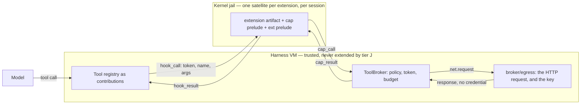
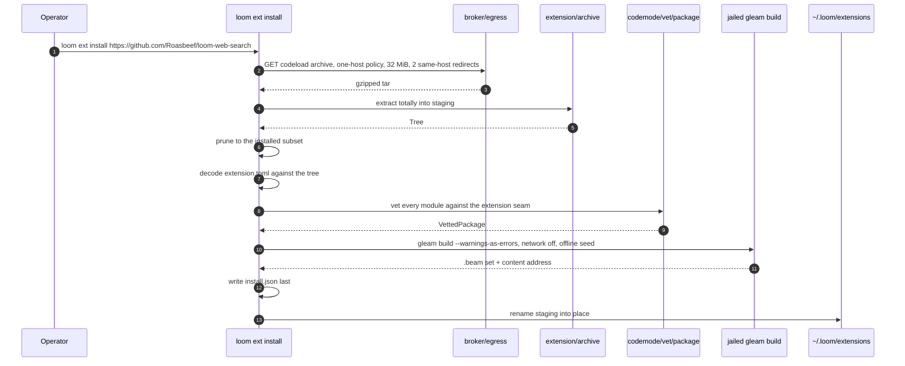

# Extensions

An extension adds tools and hooks to Loom from outside the repository
without adding code to the trusted computing base (TCB). Today every tool
the model can call is defined in this repository, compiled into the
harness, and shipped in a release. That is the right home for `bash` and
`fs_read`, whose reach is the whole security argument, and the wrong home
for everything else. Web search, a language server, or a company's
internal issue tracker is a small amount of code that somebody outside
this repository wants to write, and none of them is a reason to cut a Loom
release.

The obvious mechanism, loading somebody else's module into the harness
virtual machine, is the one the design forbids. It would put
model-adjacent code beside the storage writer, the state machine and the
broker, which is what Rule Zero exists to prevent (`docs/loom-design.md`
§7): model-influenced code never runs in the harness VM. So an extension
runs where a code-mode program runs: in a jailed *satellite* (a separate
BEAM node inside a kernel sandbox), against the same capability prelude
(the `cap/*` modules a jailed program uses to request effects), with every
effect judged by the same broker, one authorised invocation at a time.
Installing an extension changes nothing in the harness VM, so the freeze
test #33 asks for holds by construction rather than by argument.

The main pieces are:

- the **manifest**, `extension.toml`, which declares the extension's tools,
  hooks and network policy;
- the **installer**, `loom ext install`, which fetches, vets and compiles
  the extension offline in a jail and writes an install record;
- **discovery**, which re-checks each install record at boot and turns it
  into a tool contribution to the registry;
- the **host**, one long-lived satellite per extension per session, which
  the harness drives with `hook_call` frames;
- **brokered egress**, through which the harness makes an extension's HTTP
  requests and injects credentials the jail never sees;
- the **hook bus**, which fires harness events at the extensions that
  declared them.

Relative to the neighbouring planes, extensions sit on the effect plane:
the orchestration plane registers and calls their tools like any other,
the broker judges their effects, and the only durable state they own is a
reserved subtree of facts.

The ruling is `docs/adr/007-extension-tiers-and-brokered-egress.md`. The
argument behind it (the vocabulary, the manifest, the pi survey, the
phases) is `docs/design-notes/extension-architecture.md`. This document
describes what the tree actually holds, and each section says whether it
is **built** or **planned**. The acceptance extension is a real
repository,
[loom-web-search](https://github.com/Roasbeef/loom-web-search), and its
`extension.toml` is the worked example throughout.

## Where the phases stand

| Phase | What it is | Status |
|---|---|---|
| 1 | `packages/ext`, the extension seam, the manifest, the install pipeline, install records, discovery, `loom ext` | **Built** (#177, #178, #179, #182) |
| 2 | Boot registration, jailed dispatch of an extension tool, `net.request` served by the broker under the manifest's policy | **Built** (#196) |
| 3 | A persistent satellite, `hook_call`/`hook_result`, the hook bus | **Built**: the satellite host, the frame pair (`protocol-change/012-hook-call.md`, ACCEPTED), the typed hook vocabulary, the bus, the runtime slots, and the manifest and record halves, with the bus's invoker wired onto the session's hosts |
| 4 | Tier H: the harness-resident loader, the artifact import check, rollback | Freeze proven (#204); loader deferred (#32). #33's two mechanisms are gated tests over the package graph, both prelude source trees and both vetting seams, recorded in `docs/review/extension-zone.md`. The loader is deferred because no surveyed extension needs in-VM residency |
| 5 | LSP and DAP as extensions | Named, not commissioned (#26) |

A section that describes phase 3 or later says so in its first sentence,
so a reader who wants only the tree as it stands can skip it on sight.

## Two tiers, and why jailed is the default

An installed extension has one manifest and up to two bodies.

**Tier J, the jailed body**, is the only one phase 1 admits. This is
literal: `manifest.Tier` has one variant and the decoder accepts one
string (`extension/manifest.gleam:74`). A tier-J body runs in a satellite
under the *extension seam*, which is the workspace seam's capability
modules plus the `ext` prelude that carries the typed behaviours. (A
*seam* is the module allowlist a program is vetted against;
`docs/architecture/code-mode.md` defines the three.) A tool call is one
invocation of the extension's compiled source with the call's arguments.
The capability channel is the only way out, and the broker judges every
effect per invocation exactly as it does for a code-mode program.

**Tier H, the harness-resident body**, is design §7's L3. It would be
hot-loaded under a harness-controlled module name, confined to the typed
behaviours, loaded only after an approval recorded durably, and used only
for a hook that must read harness state synchronously. It is phase 4, and
nothing planned needs it. A manifest naming tier H is refused today with
an error naming the tier; it is not installed and silently ignored. That
distinction is what `an_unknown_tier_is_refused_test`
(`client/test/client/extension_test.gleam:56`) pins.



The rule that makes this shippable is **a tool is always tier J, and a
hook is tier H only when it cannot be tier J.** Intuition suggests the
reverse, because hooks feel like harness business and tools feel like
sandboxable work, but the intuition is backwards. A tool call is a request
the model made and the broker judges. A hook fires on the harness's own
timeline with the harness's own data in hand. The more powerful surface
belongs behind the stronger boundary, which is the same ordering
`docs/architecture/code-mode.md` applies to the orchestration seam.

## The seam an extension is vetted against

**Built.** The extension seam is the third of code mode's three seams,
and unlike the other two it deliberately overlaps its siblings.
`extension_cap_modules` is `default_cap_modules()` widened by exactly
three names, `ext`, `ext/hook` and `ext/memory`
(`vet/policy.gleam:611`). `extension_stdlib_modules` is the shared pure
subset widened by `gleam/bit_array` and `gleam/uri`
(`vet/policy.gleam:633`). JSON and dynamic decoding belong to the shared
subset, so ordinary code-mode programs have them too.

The workspace and orchestration seams are disjoint because an
orchestrator and an effect program are different kinds of thing, and the
question there is which capabilities travel together. An extension's tool
is the same kind of thing as a workspace program: it reads files, runs
processes and, under ADR-007, makes brokered HTTP requests. It differs
only in its *entry point*. The harness knows a code-mode program's
arguments when it launches the node, whereas an extension is compiled
once at install and invoked many times, so the call is what varies. Phase
1 handled that with a capability the node pulled on, `cap/ext.call`.
Phase 3 deleted it: the harness now sends the satellite the call over a
`hook_call` frame (`protocol-change/012`), so nothing calls that
capability any more and the widening is one name shorter.

The widening is pinned by tests. First,
`the_extension_seam_widens_by_exactly_three_names_test`
(`codemode/test/codemode_test.gleam:583`) asserts that the set difference
is exactly `ext`, `ext/hook` and `ext/memory`. The first two are the
vocabulary modules `packages/ext` ships, and neither carries authority.
The third does carry authority: it reaches the durable cells under the
reserved `ext/<name>/` prefix, which no other seam can reach because no
other seam's programs have an installed name to key a subtree by. The
same test asserts that `cap/strand` is not in the difference. The
superset check alone would pass if the extension seam had quietly picked
up agent orchestration, which would put the disk and the lineage in one
program after all.

Second, the two extra standard-library names live on a list of their own,
so widening them widens exactly one seam, and
`the_extension_stdlib_list_admits_no_capability_test`
(`codemode/test/codemode_test.gleam:596`) holds that list to carrying no
authority.

Two consequences follow. **The extension seam gets no generated MCP
façades.** An extension's allowlist is fixed at install and recorded, and
a per-host widening applied afterwards would make an installed
extension's reach depend on configuration the record never saw. **The
`code_mode` tool has no name for the extension seam.** The harness
dispatches an extension from an install record, and a model never names
one in a `code_mode` call. `docs/architecture/code-mode.md`, "The third
seam: extensions, and why it is a superset", covers this in depth.

## The manifest

**Built.** `extension.toml` at the root of the extension's repository is
the whole configuration surface; `loom.toml` gains nothing per extension.
Here is the acceptance extension's manifest verbatim, with the tool
description elided:

```toml
[extension]
name = "web_search"
version = "0.1.0"
description = "Search the web with Brave Search."
license = "MIT"
tier = "jailed"

[[tool]]
name = "web_search"
description = "Search the web with Brave Search and read back the top results. …"
prompt_snippet = "web_search: search the web with Brave and read the top results"
parameters = "schema/web_search.json"
entry = "web_search/tool"
timeout_ms = 20000

[net]
hosts = ["api.search.brave.com"]
methods = ["GET"]
max_response_bytes = 1048576
requests_per_call = 4

[[net.secret]]
env = "BRAVE_API_KEY"
host = "api.search.brave.com"
header = "X-Subscription-Token"
```

`manifest.decode` (`extension/manifest.gleam:239`) is a total decoder in
the strong sense the durability boundaries use: **an unknown key is an
error in every table.** The general rule is what refuses the `[client]`
table the design note reserves for a later ruling, with no special case
for it; `the_client_table_is_refused_test`
(`client/test/client/extension_test.gleam:78`) checks the general rule
rather than a named exception. Names are held to `[a-z][a-z0-9_]*` by
codepoint (`manifest.is_legal_name` at
`extension/manifest.gleam:257`), and environment-variable names to
`[A-Z_][A-Z0-9_]*` (`extension/manifest.gleam:275`). The check is by
codepoint because a Cyrillic lookalike in a tool name is not a
normalization variant of anything.

Three rules need the file tree beside the manifest, so `decode` takes a
`Surroundings` (`extension/manifest.gleam:200`):

1. A tool's `parameters` must be a path under `schema/` that exists and
   *parses as JSON*.
2. A tool's `entry` must name a module that `src/` actually ships.
3. A secret's `host` must be one of `[net].hosts`.

The third is a contradiction check. A binding for a host the policy cannot
reach describes a key that could only be sent somewhere the allowlist
forbids.

Two smaller decisions. First, `prompt_snippet` is **required** here,
whereas pi's `promptSnippet` is optional. (pi is the TypeScript coding
agent whose extension API the design note maps onto Loom's.) The
harness's own omission rule drops a tool with no snippet from the
available-tools index (`tools/tool.gleam:442`), so an author who forgot
one would get a tool that is callable but invisible, instead of a refusal
naming the problem. Second, an absent `[net]` table decodes to `no_net()`
(`extension/manifest.gleam:177`): empty hosts, empty methods and zero
caps. An extension that names no network reaches none, which is the
deny-by-default the whole design rests on.

## Installing

**Built.** `loom ext` is `loomd`'s first subcommand, and it is an
operator surface, not a model one. The verb split lives in
`packages/client/src/client.gleam:34`, one module outside `client/serve`.
The installer needs `serve.start_build_plane`, and putting the dispatch
inside `serve` would create an import cycle.

Every failure belongs to one of six named layers
(`extension/install.gleam:133`) and says which one. Naming the layer
matters because an extension is somebody else's repository, and the
person reading the refusal is usually not the person who can fix it.
`vetting: src/w/nif.gleam: an @external is not permitted` can be
forwarded to the author; `install failed` cannot.



`run` (`extension/install.gleam:205`) is that sequence read top to bottom,
in five `use` lines and a `stage` call. Every failure removes its staging
directory, including failures after a build has written megabytes into
it, so a directory under `~/.loom/extensions` is either a complete install
or absent. A name already taken is refused rather than overwritten.
Replacing an install means removing it and then installing, so nobody
loses a working extension to a failed reinstall.

### Hardening the install

The install is the only network-bound step in the design, and it runs as
the operator on the host, outside any jail. So it gets the same treatment
ADR-007 gives the extension itself.

**No git client.** A source is one of three forms: a local path, an
`https://` URL naming a `.tar.gz`, or an `https://github.com/<owner>/<repo>`
URL that resolves to codeload's archive URL. `source.parse`
(`extension/source.gleam:84`) refuses `git://`, `ssh://`, `git+ssh://`,
`file://`, plain `http://` and the scp-style `git@host:path` **by name**,
and each refusal restates the three accepted forms. `git clone` is a
large attack surface driven by the remote (a hostile remote chooses the
pack, the refs, the attributes and the submodules), and nothing in an
install needs it. A URL carrying userinfo is refused as malformed rather
than stripped (`source.host` at `extension/source.gleam:187`), so
`https://github.com@evil` cannot install anything.

**The fetch is a policed egress request, not a separate HTTP client.**
`cli.fetch` builds `egress.one_host` (`broker/egress.gleam:415`):

- the host is the URL's host and nothing else;
- the method is `GET`;
- at most two same-host redirects are followed (GitHub's archive redirect
  is one);
- the response is capped at 32 MiB;
- one deadline covers the whole transfer;
- the secrets resolver always fails, because no credential belongs on a
  public archive fetch.

This is Decision 2's policy shape with an allowlist of exactly one host.
The install path and the extension path therefore share one HTTP surface,
so a cap raised for one is raised for both.

**The archive is untrusted input.** `archive.extract`
(`extension/archive.gleam:249`) inflates under the total-bytes cap and
abandons the stream as soon as it goes over, so a decompression bomb is
never materialised. The ustar reader then admits regular files,
directories and pax headers and nothing else. It refuses symlinks, hard
links, devices, fifos and GNU long-name extensions **by name**. Paths may
not be absolute, may not contain `..` or `.`, and must sit under one
top-level directory. They are confined to a printable codepoint subset:
no control characters, no backslash, and none of the invisible formatting
and bidi codepoints. A local directory goes through the same collector via
`from_directory` (`extension/archive.gleam:284`). That function also
lstats the root before walking it and skips a `.git` directory, so a
working checkout reads the same as its own export.

**The install is addressed by content.** `archive.digest`
(`extension/archive.gleam:336`) is a SHA-256 over a length-prefixed
encoding of the sorted files. It deliberately excludes `Tree.root` and
`Tree.commit`, so a tree fetched from an archive and the same tree copied
from a directory produce the same digest. The record stores the resolved
revision and that digest, and every later load re-digests the tree
against the record. From the moment it is recorded, an install is fixed
by its content, whatever the remote does afterwards.

**The compile is offline, jailed, and the same one code mode uses.**
`serve.start_build_plane` is the boot's own helper ladder, helper pool,
broker, toolchain discovery and seed verification, factored out so the
installer calls it instead of reimplementing it. Two implementations
would give two answers to "may this build run". The extension's own
`gleam.toml` never reaches the compiler, because the build root's
`gleam.toml` is generated from `compile.default_dependencies()`. A
dependency the author named would therefore fail the build rather than
enter it, and vetting refuses it before that anyway. Vetting runs on the
source before the compiler sees it, so the compiler is never the first
thing to touch a hostile file.

### What an install keeps

**Built** (#182). The layout rule is stated as *what an install keeps*,
not *what an archive may contain*. We learned the difference when the
first attempt to install a real repository was refused for having a test
and a `.gitignore`, which every Gleam repository has.

`package.installed_subset` (`vet/package.gleam:201`) is the single place
that decides. It keeps `src/**/*.gleam`, `schema/**`, `skills/**`,
`extension.toml`, `gleam.toml`, `README*` and `LICENSE*`. It prunes the
rest: `test/`, `.gitignore`, `.github/`, `docs/`, `build/`, and Gleam's own
resolved `manifest.toml`, which the build regenerates. `is_installed`
(`vet/package.gleam:219`) is the same rule written as a predicate. The
precedent is the `.git` directory that `from_directory` already skips:
the installed tree is what the extension *is*, and the repository around
it is not part of what an operator approves.

Three orderings matter.

1. `installed_tree` runs **first** (`extension/install.gleam:215`), ahead
   of the UTF-8 decode, the manifest, the vetting, the digest and the
   write. So the recorded digest describes the installed tree, and a
   later load compares like with like instead of re-deriving the prune
   and hoping it produces the same result. It also means the UTF-8
   refusal applies only to installed files: a screenshot under `docs/` is
   pruned, and one under `schema/` is refused.
2. `vet_package` also prunes, idempotently (`vet/package.gleam:146`), so
   no caller can vet a wider tree than the one that gets installed by
   forgetting a step.
3. `installed.check` deliberately does **not** prune
   (`extension/installed.gleam:197`). The install already narrowed the
   repository and wrote exactly that, so what sits under `<name>/src/`
   *is* the installed tree, and a file added afterwards must change the
   digest. Pruning again at load would forgive exactly the tampering the
   digest exists to catch.

One shape is refused rather than pruned: a non-`.gleam` file under
`src/`. Gleam compiles a native module found there and links it into the
artifact. That amounts to an `@external` whose declaration has moved out
of the source the lint reads, and pruning it would silently drop
something the author expected to run.

`a_repository_is_pruned_to_its_extension_test`
(`codemode/test/codemode/vet_package_test.gleam:91`) runs a whole
repository through and asserts the prune produces the same set whichever
entry point asks. `a_repository_installs_and_only_its_extension_is_kept_test`
(`client/test/client/extension_test.gleam:577`) does the same end to end,
then asserts the recorded digest verifies against the pruned tree.

## Discovery, and what a load re-derives

**Built**, both the re-derivation and the registration at boot.
`installed.discover` (`extension/installed.gleam:82`) reads the
extensions root, filters entries through the same name grammar the
manifest uses, and returns `Ready` or `Refused` for each. A refusal is a
*value*, not a shorter list, because an operator who installed something
and then sees nothing cannot tell "it is broken" from "I imagined it".

`check` (`extension/installed.gleam:197`) re-derives five things from
disk and compares each with the record:

1. the tree digest;
2. the manifest;
3. the vetting;
4. the recorded allowlist against the current seam's;
5. the artifact's content address, via `build.fingerprint_directory`,
   the same function the build itself used.

The fifth is the easiest to leave out and the one that matters most.
Re-vetting *source* says nothing about the *bytes that actually run*, and
`a_tampered_artifact_is_refused_test`
(`client/test/client/extension_test.gleam:546`) keeps that gap closed.

The allowlist is **stored** in the record rather than recomputed
(`extension/record.gleam:121`), and that is deliberate. If it were
recomputed, an operator's approval would silently follow the harness's
current definition of the seam. Storing it means a widened seam becomes a
question the operator is asked again.

One gap remains. The workspace-local root, `<workspace>/.loom/extensions`,
whose extensions are listed but never loaded until approved, is a design
ruling and not yet code. Today the only root is `<home>/.loom/extensions`
(`extension/record.gleam:154`), resolved from `--home` or `HOME`.
Discovery's other caller is the boot itself: `client/serve` reads the same
records `loom ext list` and `loom ext verify` read, and the dispatch
section below says what it does with them.

### `loom ext`

**Built.** Four verbs, with no daemon and no hot install
(`extension/cli.gleam:106`):

```
loom ext install <source> [--rev REV] [--home DIR] [--best-effort]
loom ext list
loom ext remove <name>
loom ext verify <name>
```

`install` prints five lines: what was installed and at which revision,
the tool names, the tree digest, where it went, and what the kernel
enforced on the jail that built it. The last is the same enforcement
report code mode prints, for the same reason: a green build on a kernel
missing a layer must say so rather than let the absence read as success.
`verify` exits non-zero on a `Refused`, so scripts can use it.

The terminal client forwards `loom ext …` rather than reimplementing it.
Typed at `loom`, it locates `loomd` by the same ladder an implicit local
session uses, runs it, streams output through, and exits with its status
(`tui.gleam:329`). Two ladders would risk installing an extension into
one server's world and then starting another.

## Inside the satellite

**Built**, along with the harness end that answers it, which the dispatch
section below describes. `packages/ext` is `cap`'s sibling: a second small
package vendored into every extension build root, published on its own,
and running *inside* the jailed node rather than in the harness VM. The
split is deliberate. `cap` is the capability language, what a jailed
program may *reach*. `ext` is the behaviour contract, what shape a jailed
program must *have* to serve a tool call.

An author writes one function per tool, typed
`Tool = fn(Dynamic, Ctx) -> Result(Outcome, Refusal)`
(`packages/ext/src/ext.gleam:110`). Arguments arrive as a `Dynamic`
because their shape is the manifest's `parameters` JSON schema, which the
harness holds and this package does not. `ext.decode_args`
(`packages/ext/src/ext.gleam:167`) turns a decode failure into a refusal
that names the field. The model reads that refusal and retries, and
`expected String at .city` is a repair instruction where `bad arguments`
is a dead end. A refusal is a *value*, not a thrown error (pi signals a
tool error by throwing). The reason is that a refusal is text the model
reads, while a crash is a fault the harness reports and the model can do
nothing with. `Terminate` is a two-variant type rather than a `Bool`
field, so the call site says which it means.

The install writes a generated `loom_satellite` entry module whose whole
body is one call:

```gleam
runtime.serving(
  tools: [#("web_search", tool.run)],
  events: [#("session_start", tool.warm)],
)
```

`serving` (`ext/runtime.gleam:161`) hands `answer`
(`ext/runtime.gleam:176`) to `cap/runtime.serve`, the same boot runtime a
code-mode program uses. Reusing it keeps the token file, the socket and
the exclusive channel slot in one place, and it means this module could
not read a token if it tried. `serve` (`ext/runtime.gleam:144`) is the
same call with an empty event table, which is what an artifact declaring
no `[[hook]]` gets. The generated entry writes whichever of the two the
manifest asked for (`entry_source` at `extension/install.gleam:586`).

`answer` does exactly two things: it dispatches on what the harness asked
for, and it returns a value or an in-band code. There is no third step,
because fetching the call is no longer the node's job. In phase 1 the
node pulled its call through `cap/ext.call`. Phase 3 deleted that
capability, along with the module that declared it, and now the harness
sends the call over a `hook_call` frame. The frame carries a `kind`
(`tool` or `event`), a name, the arguments, and how long the satellite
has (`runtime.Asked` at `cap/runtime.gleam:529`).

A tool's arguments still arrive as `{args, strand}`, with `args` as
**JSON text** rather than a msgpack map, for the reason phase 1 chose it.
`gleam_json`'s parser is the only route from bytes to a `Dynamic` that
the extension seam's allowlist admits. Text also means the harness hands
over exactly the bytes the model's tool call carried, with no re-encoding
step in between to disagree about numbers. An event's payload is JSON
text too, in the shape `client/extension/hooks` pins for that event.
`ext/runtime` carries it between the channel and `ext/hook`, which owns
the decoding and the rendering of the answer. The event name travels
beside the hook in a `Declared` (`ext/runtime.gleam:129`), so a manifest
and a module that name different events produce `mismatched_hook`
instead of a silent mis-serve.

**One satellite serves many invocations, one at a time.** The harness
reads every failure through the refusal vocabulary:

- `unknown_tool` and `bad_arguments` mean the artifact and the manifest
  disagree about what this build serves;
- `refused` means the extension declined a call it understood;
- `unhandled` is the ordinary answer for an event nobody registered a
  handler for, since an extension is asked about every event and handles
  few of them.

`the_runtime_answers_two_invocations_on_one_node_test`
(`ext/test/ext_test.gleam:152`) drives two round trips over one faked
channel. `a_cap_call_presents_the_invocation_token_test`
(`ext/test/ext_test.gleam:181`) is the one that matters for authority: a
capability call made inside an invocation carries the token that
invocation was given, not the boot token the node read off disk.

## Dispatch

**Built** (#196), and moved by phase 3 onto a host that outlives the
call. Discovery answers what is installed. Dispatch turns one of those
answers into a tool the model can call, and then into an invocation. The
path runs in one direction, from boot to answer, and each step consumes a
value the previous step produced.

1. **At boot, discovery feeds the registry.** `serve.assemble` reads
   `installed.discover` for the extensions root before it builds the
   registry (`extension_registrations` at `client/serve.gleam:2044`). A
   `Refused` is logged and registers nothing. A `Ready` on a host with no
   code-mode toolchain is also logged and registers nothing: with no
   `erl` there is no satellite to boot, and a tool definition that can
   only fail still costs a place in the provider's cached prefix on every
   request.

2. **Everything else becomes a contribution.** `dispatch.tools`
   (`extension/dispatch.gleam:185`) turns the record and the manifest into
   `tools.Tool` values, and the boot appends one
   `Contribution(Extension(name), tools)` after the built-ins. From there
   the registry treats an extension tool like any other: it is dispatched
   by name through `tool.dispatch`, and the collision rule that refuses a
   boot when two contributions claim one name is the same rule that
   guards `bash`.

3. **A call is one invocation of a satellite the session already has.**
   Phase 2 launched a jailed `erl` per call and destroyed it afterwards.
   Phase 3 keeps one host per installed extension, started lazily on that
   extension's first use (`hosts.invoke` at
   `client/extension/hosts.gleam:354`, over `dispatch.hosting` at
   `extension/dispatch.gleam:394`). No build happens, because that was the
   install's job, and no node launch happens except the first time. The
   declared tool timeout is still clamped: `within`
   (`extension/dispatch.gleam:676`) takes the minimum of the manifest's
   `timeout_ms` and the operator's `max_within_ms`, because an install is
   not a way to raise how long this host will hold a strand.

4. **The harness sends the node its call.** The satellite does not
   receive the tool name in its environment or through a capability it
   pulls on. The host writes a `hook_call` carrying a freshly minted
   token, the kind, the name, the JSON arguments and the deadline, and the
   satellite writes back one `hook_result`. The token is bound to *this*
   invocation's `{op_id, step_id}` and revoked when the answer arrives.
   That binding is what stops a session-lived node from having wider
   authority: an extension may compute between invocations but may not
   act. `docs/architecture/code-mode.md`, "A satellite kept alive across
   calls", covers the host in depth.

5. **A `net.request` is judged by the manifest an operator approved.**
   `policy.egress_for` (`extension/policy.gleam:142`) is the whole
   translation. It copies the manifest's hosts, methods and secret
   *names* verbatim, and the harness fixes `redirects`, `timeout_ms` and
   `trust`, because an author must not be able to set any of the three
   for their own extension. Two of the manifest's numbers are requests
   rather than settings. `max_response_bytes` is clamped to the harness
   ceiling (`max_response_bytes` at `extension/policy.gleam:64`), which is
   the install fetch's own archive cap, so the two egress callers share
   one bound. `requests_per_call` becomes an admission ceiling on the
   invocation (`ceilings` at `extension/policy.gleam:184`). The tally is
   reset per invocation, which keeps it meaning *per call* now that the
   node lives longer than a call. A manifest with no `[net]` table is
   `ReachesNothing`, refused as `network_off` rather than against an
   allowlist nobody wrote.

6. **The answer is settled into a `ToolOutcome`.** `settle`
   (`extension/dispatch.gleam:832`) reads what the `hook_result` carried:
   content blocks and an optional `terminate`. When there is no answer at
   all, it turns a `hosts.HookFailure` into a sentence the model can act
   on. A refusal is text the extension wrote, and a crash is the
   extension's bug. A departed host says it will stay departed, so a model
   reading it stops retrying. Either way `settle` returns the same type a
   built-in tool returns, so the strand's driver cannot tell which kind
   of tool it just ran.

The dispatch deliberately does *not* do two things. First, it does not
compose onto the run phase a `Ctx.grants` from an escalation approved for
*this call*. The operator approved this extension once, at install,
having read a manifest, and a mid-run widening would take it past the
terms of that approval. Second, no arm here adds to the node's
environment, which is why the credential claim below covers the whole
path rather than one arm of it.

## The satellite the session keeps

**Built.** This is phase 3's first wave; the hook bus that uses it is the
second. Phase 2 started a node for one call and destroyed it afterwards.
That was ADR-007's accepted cost, and `protocol-change/012-hook-call.md`
(ACCEPTED) removes it. An extension's artifact is compiled once at
install, so each call was paying a node boot for nothing, and an
extension could keep no state between calls: no HTTP client, no cache,
no actor of its own.

**Two frames, flowing from harness to satellite for the first time.**
Before phase 3 the capability channel carried requests only from
satellite to broker. `framing.HookCall` (`broker/framing.gleam:184`)
carries a token, a kind (`tool` or `event`), a name, the arguments and a
deadline. `HookResult` (`broker/framing.gleam:196`) carries the
`CapOutcome` that answers it, correlated by the same frame id. Spec
§1.4's frozen `kinds` list gained both names. They cross the *capability*
socket and nothing else. A helper on the exec channel that sends one is
marked dead as a protocol violation (`framing.HookCall` at
`broker/exec.gleam:1771`), because the two channels are two protocols,
and a peer that confuses them is a peer whose next frame cannot be
trusted either.

**The invocation is the unit of authority.** A token is minted for one
`{op_id, step_id}` and checked on every `cap_call`, so a node that
outlives an execution has no token of its own. `invoke`
(`codemode/satellite.gleam:2103`) mints one for *this* invocation, sends
it on the `hook_call`, and revokes it when the answer comes back. Between
invocations the host holds no token, and a `cap_call` arriving then is
refused `unauthorized` before any router sees it. The node's boot token
file is not an exception: it holds thirty-two bytes this host minted
nothing for, and it exists only because `cap/runtime`'s boot sequence
reads one. `a_token_is_dead_once_its_invocation_closes_test`
(`codemode/test/codemode/host_test.gleam:239`) pins this.

**One slot, and a breach costs the node.** The protocol allows one
outstanding `hook_call` per satellite, so `Host`
(`codemode/satellite.gleam:1907`) is a `weft/state_machine` over `Idle |
Answering(id) | Destroyed(reason)`. The invocation's deadline is
`Answering`'s own state timeout, which is why these are states rather
than a field: leaving the state cancels the timer, and weft drops a timer
that fired while being cancelled instead of delivering it. A second
`invoke` while one is open returns `Busy` (`InvokeError` at
`codemode/satellite.gleam:1955`). The satellite also answers a second
`hook_call` with `busy` on its own side rather than queueing it, because
a queue would mean a second token installed under the first invocation's
worker.

The far side can break the one-slot rule in two ways, and both destroy
the node: a deadline that passes with no answer, and a `hook_result` that
correlates to nothing. A destroyed host stays destroyed for the rest of
the session. Restarting one silently would give an extension a fresh set
of the actors it just lost without telling anybody it had lost them; the
session's next boot is where a restart belongs.
`a_deadline_destroys_the_node_test`
(`codemode/test/codemode/host_test.gleam:271`) and
`a_stray_hook_result_destroys_the_node_test`
(`codemode/test/codemode/host_test.gleam:303`) cover both.

**The reaping invariant, restated.** `docs/architecture/code-mode.md`
states it for the disposable node: the executor reaps every process a
program spawned before the next execution installs its channel. For a
satellite that lives for the session, it becomes **a host reaps its node
before the session's next host for that extension starts**. The guard is
one that already existed: `cap/internal/dispatch.install_exclusive`
refuses to claim the VM-global channel slot while a previous channel
actor is alive, so a breach fails the next boot outright instead of
silently lending it authority.

**Who owns the hosts.** `client/extension/hosts` is one supervised actor
per session (`extension_hosts.supervised` at `client/serve.gleam:3413`).
It holds at most one host per installed extension, started lazily on that
extension's first use under whichever call happened to be first. That is
sound because every extension call in a session runs under one workspace
and one session base. The host's work root is keyed on the extension's
*name* rather than on `{op_id, step_id, source_index}` (`host_root` at
`client/codemode.gleam:1487`), because a host outlives all three.

The actor performs each invocation itself, so its mailbox is the queue,
and a second caller waits instead of reading `Busy`. That makes the actor
a session-wide serialiser rather than a per-extension one. The
simplification is deliberate: an extension tool is `tool.Exclusive`, and
hook events fire on a serialised timeline, so the only case it slows is
two *different* extensions invoked from two strands at the same moment.
A per-extension lease is the fix to reach for once that case is measured
in practice.

What a caller reads is `HookFailure`
(`extension/hosts.gleam:90`): `Unhandled`, `Refused`, `Crashed`,
`Deadline` or `Gone`. It is deliberately smaller than the host's own
`InvokeError`. A caller's response to a failure depends on whether the
extension answered, died mid-answer, ran out of time, or no longer
exists, not on which of the host's internal endings produced the last of
those. A tool call goes through `invoke` (`extension/hosts.gleam:354`).
The hook bus calls `invoke_event` (`extension/hosts.gleam:446`), where
`Unhandled` is the ordinary answer rather than a failure to report,
because the bus asks every installed extension and most of them handle
none of the events on offer.

**What this wave deliberately left out.** This wave built no hook bus:
nothing in it fires `session_start` or `tool_call` at anybody. The
per-event payload shapes were left open at both ends on purpose.
`ext/runtime`'s `Handler` takes an untyped `report.Value`, and
`hosts.invoke_event` an untyped `MsgPackValue`, so fixing the shapes
costs a change in the bus and not in the transport under it. The bus is
the next wave, described under "Phases 3 to 5" below.

## Egress, and the key that never enters the jail

`cap/net` exists and refuses everything, because the design's egress
plan was a proxy sidecar that was never built.
`policy.narrow_unenforceable` turns `NetworkProxy` into `NetworkOff` on
every clearance, so a proxy-mode call fails closed. A sidecar is the
general answer for a jailed process that opens sockets itself. **An
extension does not need to open a socket. It needs a request made and the
response handed back.**

So `net.request` is served the way `fs.read` is served: the harness
performs the request, under a policy composed from the extension's
manifest, and returns the response over the capability channel. The
jail's network namespace stays empty, which is the property every sandbox
layer already enforces and the property the proxy was meant to preserve.
`broker/egress` is explicitly *not* that proxy revived
(`broker/egress.gleam:374`), and `packages/broker/CLAUDE.md` says so in
its invariants so the next reader does not conflate them.

### The threat model

The caller is model-influenced code in a jail. The asset is the
operator's API key. The whole design follows from never letting the
caller name the key.

A `Secret` (`broker/egress.gleam:159`) binds an **environment variable
name** to one header and one origin, the same way `client/catalog`'s
`api_key_env` binds a provider key one layer down. The value is read at
request time through the `secrets` function injected into
`egress.request`. It is not stored on the policy and not returned. Most
importantly, **no `Refusal` variant has a field it could occupy**
(`broker/egress.gleam:239`). That is enforced by the types rather than by
convention: `describe` (`broker/egress.gleam:443`) has nothing to redact
because there is nothing to redact, and
`describe_names_the_binding_but_never_the_value_test`
(`broker/test/broker/egress_test.gleam:301`) renders every variant and
asserts the canary value appears in none of them.

A caller might probe for the key in three ways, and each is refused
before a socket exists:

- Naming the credential header yourself is `HeaderReserved`. Reserving a
  secret's header also refuses any caller header of that name, case
  insensitively.
- Appending a header by ending one early is `HeaderMalformed`, from the
  same pass. Every header is scanned for CR, LF and NUL **over
  codepoints, not substrings**. `string.contains` works on grapheme
  clusters, and CRLF is one cluster, so a substring scan for `"\r"` misses
  the exact injection sequence. The refusal names the header and never
  the value.
- An unset binding is `SecretMissing`, so a missing key never degrades
  into an unauthenticated request that a hostile server gets to answer.

The URL is attacker-influenced too, so **every hop re-runs the whole
check**: scheme, origin and method. A redirect is a new request. Origins
are matched exactly and case-insensitively, with no wildcards and no
suffix matching. A bound credential is injected only on a hop whose
origin it names.
`injects_a_credential_only_for_the_origin_it_is_bound_to_test`
(`broker/test/broker/egress_test.gleam:375`) runs two live TLS origins
and asserts the header is absent from the unbound one's echo.

The module doc records two subtler decisions. First, neither HTTP
connections nor TLS sessions are reused, and the TLS half matters more.
The `ssl` client session cache is node-global and keyed on host and port,
and a resumed TLS 1.2 handshake carries no certificate. A session
established under other roots, by another policy or by the provider's own
client sharing the node, would therefore skip the verification the pinned
roots were meant to force. Second, the size cap is enforced while the body
streams, but `httpc` streams only 200 and 206 responses. On other
statuses the cap is checked after the fact rather than stopping the read,
and the doc states this openly.

Egress does **not** defend the extension against what the body says. The
body comes back intact: `max_response_bytes` bounds how much a permitted
host can say, never what it says, and those bytes then flow wherever that
extension's own capabilities allow. The allowlist is the trust decision;
the cap is only a resource bound.

The one hop that touches a socket is
`ffi_egress.fetch` (`broker/internal/ffi_egress.gleam:61`): `httpc` on a
broker-private profile, with autoredirect off and the body streamed. It
performs exactly one hop and never follows a redirect. The redirect
chain, the credential injection and the whole-request deadline stay in
Gleam.

### What is built, and what is not

**Built**: the egress client, its FFI, `one_host`, and the manifest's
`[net]` decode, with its secret *names* carried into the install record.
`a_record_carries_no_secret_values_test` asserts by equality that the
record's terms are exactly the names, so a field added later cannot
smuggle a value in unnoticed
(`client/test/client/extension_test.gleam:213`).

**Also built** (#196), and named here because an earlier edition of this
document listed it as owed: `policy.egress_for`
(`extension/policy.gleam:142`) turns a `manifest.Net` into an
`egress.Policy`. The extension seam's `net.request` arm serves it
(`routing` at `extension/seam.gleam:217`; `cap/net.gleam:71` marshals
and labels the request, and this arm answers it). `policy.ceilings`
(`extension/policy.gleam:184`) is the `requests_per_call` ledger, now
tallied per invocation rather than per node. Egress has two production
callers, the install fetch and a dispatched extension, and the web-search
extension both installs and is called on `main`.

**The one exception to the rule.** MCP servers keep `api_key_env`, and
their credential is in the environment of an unjailed child process
rather than held by the harness. That is a real difference in posture.
It is #109's open question, not an oversight, and
`docs/architecture/mcp.md` owns it. Making a secret's *source* pluggable
(a vault, a keychain, a command) is #181, and it lands behind the one
`secrets` function egress already takes.

## Extension memory

**Built.** pi's `appendEntry` maps onto a reserved fact prefix the
extension owns (`docs/design-notes/extension-architecture.md`, "The rest
of pi's surface, mapped"). These are durable, latest-wins cells under
`ext/<name>/<key>`, reached from the jail through `ext.remember` and
`ext.recall`.

**The cells are written through the same interface as
`schedule/config/…`.** `runtime/api.ext_fact_prefix` is reserved
(`runtime/api.gleam:reserved_fact_key`), so `put_fact` refuses these keys
and `facts` hides them. The harness writes them with `put_reserved_fact`,
a blind latest-wins overwrite of one cell, exactly as a model-created
schedule's config cell is written. Nothing here is compare-and-set: an
extension is the only writer of its own subtree, and of two concurrent
writes to one key, the later one's value remains.

**The harness binds the subtree, and nothing else names it.** The
capability frame carries a *leaf* key and nothing more.
`client/extension/seam` checks the leaf: it must be non-empty, contain no
`/`, and be at most `max_key_length` characters, and the value must be at
most `max_value_bytes`. `client/extension/dispatch` closes the `Door`'s
two closures over the installed record's `name`, and
`client/extension/memory.key` turns that into `ext/<name>/<key>`. So an
extension called `a` cannot read `ext/b/…` however it words the request,
because no argument lets it name another extension. The leaf check is
about the shape of a cell name, not about escaping a path: `../x` is
refused for the slash, and `..` means nothing to a cell name.

**The durable store sits behind a `Door`, not on the seam.**
`client/extension/seam` is the wire (msgpack in, msgpack out, every field
decoded totally) and holds no durability at all, just as it holds no
egress policy. `Memory` is two closures on the `Extension` record beside
`Egress`. The module that reaches `runtime/api` is
`client/extension/memory`, whose `Door` is built from a runtime borrowed
through the Agency's holder (`memory.for_session`). `client/scheduleseam`
uses the same arrangement for the same reason: the runtime does not exist
until `api.open` has returned the registry these tools are registered in.
A host with no session hands the dispatch `memory.shut`, so the
capability is still routed and refuses with a sentence, rather than being
an unrouted name.

**Both arms are per extension, not per invocation kind.** A `hook_call`
of kind `event` reaches the same satellite under the same router, so a
phase 3 hook may remember and recall exactly as a tool may. That is
deliberate. The natural use is a hook that records what it saw for a tool
to read on the next call, and a seam that served one kind but not the
other would draw a distinction with no reason behind it.

**What extension memory is not.** It is not `cap/kv`, which the router
beneath already serves; that store is ephemeral scratch, evicted between
calls and gone with the session. It is not listable: there is no
`ext.forget`, no scan, and no cross-extension read, so the only key an
extension can name is one it already knows. And it is not a channel to
the model: a remembered cell is rendered into no prompt, and an extension
that wants the model to see one injects it itself from
`before_agent_start`.

**What bounds it.** A value is capped per cell, and a key is overwritten
rather than appended, so one cell cannot grow. The number of *distinct*
keys is deliberately not capped, because an install is an operator's
trust decision over code they were meant to read. The durability plane
has no per-writer quota for any writer (the model's facts, a strand's
entries, a schedule's config cells), so a ceiling here would be the only
one in the plane, on its newest and smallest source of growth. The
argument is not that `fs.write` could fill the disk anyway: `fs.write`
reaches the workspace, while these cells land in the session file under
the operator's home, possibly on another volume, and on the durability
plane rather than in scratch.

The growth to weigh before revisiting this comes from hooks rather than
tools: a `before_agent_start` handler writing a fresh 64 KiB key on every
provider request adds that much every turn, for the life of the
repository. There is no admission ceiling either, following
`codemode/workspace.ceilings` and the precedent `schedule.create` set.

## The invariants

Each invariant is stated with the failure it prevents.

**Nothing an extension ships runs in the harness VM.** A tier-J
extension's code is compiled into a satellite artifact and executed
behind the jail; the harness links none of it. Otherwise, installing an
extension would put model-adjacent code beside the storage writer, and
every Rule Zero argument in the tree would be about the wrong process.

**A satellite that outlives an execution retains no authority.** The
host mints a token per invocation, hands it over on the `hook_call`, and
revokes it on the answer. An extension may compute between invocations
but may not act: a `cap_call` made by an actor it kept alive is refused
`unauthorized` before any router sees it. Without the per-invocation
binding, holding a node open would quietly turn a per-call grant into a
session-long one. Phase 2's disposable node avoided that widening by
accident rather than by design.

**A hook starts no background jobs.** `cap/job` reaches an extension the
way `cap/schedule` does. `extension_cap_modules` is the workspace seam
widened by the `ext` vocabulary, so both arrive as workspace capabilities
rather than as a second shared entry (`codemode/vet/policy.gleam`, beside
the `cap/schedule` ruling). For a *tool* call that is the whole story:
the job runs under the model's own operation, appears in the strand's
transcript, and an abort of that operation reaches it.

A *hook* differs in its operation. `client/serve.hook_coordinates` mints
one session-long operation for every hook in a session and attributes it
to the root strand for reads. This is deliberate, because a hook fires on
the harness's timeline and has no run whose `{op_id, step_id}` it could
borrow. Nobody sees that operation as a running step, so nobody can abort
it. A `context` or pre-tool hook that called `job.start` on every event
would therefore leave hour-long processes owned by `main`, spending the
model's ceiling of live jobs on work it never asked for and cannot find.
So `dispatch.bridge` reads `Coordinates.origin` and serves a hook
`workspace.no_jobs()`: the five job capabilities are still routed, and
each refuses in band, naming the reason. Without the split, installing an
extension would be a way to run background work no operator can stop.

**The record is written last, and the tree is renamed into place after
it.** Everything happens under `<root>/.staging/<random>/`. Without that
ordering, a half-installed extension would be discoverable for a window,
and discovery would have to distinguish "incomplete" from "tampered
with", two states that look identical on disk.

**Every load re-derives what the record claims:** digest, manifest,
vetting, allowlist and artifact fingerprint. Without the re-derivation,
an install would be a promise about one moment rather than a claim about
bytes, and one edited file under `src/` would run unvetted forever.

**The prune happens once, first, and never again at load.** The digest
describes the installed tree because the tree was narrowed before it was
digested. Pruning again at load would forgive exactly the tampering the
digest exists to catch.

**A refusal names its layer and its file.** `vetting:
src/w/nif.gleam: …` can be forwarded to the author; `install failed`
cannot. The failure type makes it impossible to omit the layer.

**The credential is a name in the manifest and a value in the server's
environment, and exists nowhere in between.** No file holds it, no frame
on the capability channel carries it, no refusal has a field it could
occupy, and the extension's own source could not read it, because the
extension seam has no module that reads the environment. Without this, an
extension system would be a mechanism for exfiltrating credentials with
a tool registry attached.

**An extension's memory is its own, and the model cannot reach it.** The
subtree is `ext/<the name an operator installed it under>/`, composed by
the harness from the install record. The prefix is reserved, so
`put_fact` refuses it and `facts` hides it. Without the first property,
an extension could read or overwrite another's state by wording a key.
Without the second, a model could forge what an extension "remembered"
approving, and read back what it was never shown.

**Two contributions may not claim one tool name.** Within one
contribution, a repeated name is the author overriding themselves, and
the later one wins. *Between* contributions, a repeated name takes the
boot down, naming both origins
(`contributions.registry` at `client/contributions.gleam:267`). An
extension that could register `bash` would silently redefine what the
model's `bash` call does, and every sandbox argument in the tree would be
about the wrong function.

**A registry reaches a session once.** The prompt index and
`active_tool_names` are both fixed at session creation, so installing an
extension changes what the *next* session sees rather than growing the
one already running. The alternative is a live session whose tool array
no longer matches its cached prefix.

## What the end-to-end proves

The install pipeline's own discipline (staging, the record, the rename,
the digest, the layer naming) is proved on **every** run of `make
check-client`, because every test but one injects a fake build. Each
hostile fixture differs from the working one in exactly one way, so
`a_hostile_fixture_is_refused_by_its_own_layer_test`
(`client/test/client/extension_test.gleam:344`) asserts *which* rule
caught it. Vetting refuses an `@external` and a forbidden import; the
manifest refuses an unknown tier, an unknown key and an out-of-policy
secret host. A tampered source file, a tampered artifact, a missing entry
`.beam`, a record naming another extension, and a traversing name each
have their own test, and each asserts the refusal is a value naming the
reason rather than an absence.

One test builds for real. `a_real_jailed_build_installs_test_`
(`client/test/client/extension_test.gleam:779`) runs the extension's
source through a genuine `gleam build --warnings-as-errors` inside a
network-off jail, against the same offline seed and the same helper code
mode uses. It is feature-detected the same way as
`packages/codemode/test/codemode/e2e_test.gleam`: without a sandbox
helper, a toolchain and a prepared seed, it prints its skip reason and
passes, so `make check` stays hermetic and fast. `make e2e-codemode`
prepares the seed and `make binaries` builds the helper, and in that
environment the test runs.

The egress suite is split the same way, for the same reason. Refusals
that must happen *before a socket exists* are tested offline, since a
test that needed a server to observe them would not be checking that
property. The live half runs a real TLS origin on loopback, whose chain
is generated by `public_key:pkix_test_data/1` and whose root is pinned.
Nothing in it relaxes verification. The session-reuse test runs against
TLS 1.2 on purpose, because 1.3 resumes through tickets, which are off by
default in OTP's client.

The dispatch has an end-to-end test of its own.
`an_installed_extension_reaches_the_network_test_`
(`client/test/client/extension_e2e_test.gleam:113`) installs a fixture
extension with a real jailed build, holds a real satellite open against a
real TLS origin on loopback whose root it pinned, and asserts nine
things:

- The registry carries the fixture's tool, and the manifest's
  `prompt_snippet` reaches the prompt index, so what was installed is
  what the model is offered.
- A call answers `200` through the brokered request, and the origin saw
  the credential in the header the manifest bound it to. The harness
  reads this out of band rather than off the wire.
- The binding's variable name and its value are in **neither half** of
  the node's environment: not in `launch.node_env`, which the launcher
  sets, and not in `env_allow`, which the kernel would pass through.
- The value is on **no frame** in either direction. A tap records every
  byte on the capability channel around the production launcher, so the
  claim covers the whole channel rather than the one arm that could
  plausibly carry the value.
- A host the manifest does not name is refused in band, as a denial the
  extension read and turned into a sentence naming the host.
- The request after `requests_per_call` is refused while the ones under
  it are answered, which is what makes it a ceiling rather than a
  failure.
- A **second call reaches the same node**. This is counted from the
  launcher's specs rather than inferred from how fast the call felt, and
  it is the central claim of phase 3.
- A jailed tool **remembers on one call and recalls on the next**. It
  still recalls after the session file underneath has been closed and
  reopened while the satellites stayed up, which makes the answer a fact
  about the disk rather than about the node. A second extension asking
  for the same key over its own satellite finds nothing.
- A `hook_call` of kind `event` is dispatched to the handler the
  manifest's `[[hook]]` named, with an empty payload, because wave B is
  what fixes the per-event shapes.
- An extension that does not answer inside its own deadline **loses its
  satellite**, and is told so on the next call. Only a real node can
  demonstrate this.

The origin deliberately does not echo the request. An echoing origin
would put the credential in the response body and make the absence
claims false for a reason unrelated to the design.

The model half was driven for real on 2026-09-02. `loom ext install
https://github.com/Roasbeef/loom-web-search` fetched over codeload,
pinned at `677199c`, and produced the same tree digest as a local-path
install of the same revision. A Kimi K3 session then called `web_search`
and answered from Brave's results, with `BRAVE_API_KEY` in `loomd`'s
environment on the host and nowhere else. That was phase 2's remaining
exit criterion, and it is met.

## Phases 3 to 5

**Phase 3, built: a persistent satellite and hooks.** Hooks need the
harness to call *into* the extension, but `cap_call` only flows from
satellite to broker. Phase 3 therefore added the `hook_call` frame, with
the deadline discipline of a cap call, and the session-lived satellite
that `docs/architecture/code-mode.md` had described as not built ("kept
alive across calls"). Its reaping guard already existed in
`cap/runtime`'s refusal to install over a live channel. The frame went
through a `protocol-change/` proposal written before the phase started,
`protocol-change/012-hook-call.md`, now ACCEPTED. "The satellite the
session keeps" above covers the transport; this section covers the
harness side, which decides *when* to call.

Phase 3 built tool calls and hooks together because they share one
mechanism: both are the same frame, down the same channel, to the same
node. An extension's hooks cost no second process and no second boot.

**The hook bus is two event managers per session.** The harness side is
two `weft/event_manager`s per session, each holding a handler per
installed extension. Each is an ordered list; each handler holds private
state (its name, the events it declared, its invoker); and a broken
handler is dropped and logged while its siblings carry on.

There are two managers rather than one because a manager's mailbox is a
queue, so a notification cast onto it delays the next event asked *on*
it. With one manager, a slow `usage` handler could use up the `tool_call`
gate's whole budget and turn one extension's `Block` into an `Allow`.
The notifications therefore have a manager of their own. Dropping is per
manager: the handler that mishandled the event loses its place, and its
twin on the other manager loses its place at the next event it
mishandles. An extension is broken when its satellite is gone, has
crashed, or has missed its deadline. It is also broken when its answer
cannot be read at all, because the harness cannot apply a verdict it
cannot parse.

The events come in three shapes:

- **Notifications** (`session_start`, `agent_end`, `agent_settled`,
  `usage`) are `notify`.
- **The three events that need an answer** are `before_agent_start`,
  whose answer is an injection; `tool_call`, whose answer is a verdict;
  and `before_compact`, whose answer is a note. Each is a `sync_notify`
  whose event carries a reply subject, drained after the fan-out returns,
  so any `Block` wins and notes concatenate in load order. The
  `sync_notify` runs on a weft-bounded worker rather than on the caller.
  It is a `call`, a `call` that goes unanswered panics its caller, and
  the callers are strand drivers that share one answering manager across
  every strand of the session. A fan-out that does not answer returns an
  empty list, which costs a hook and never a strand.
- **The two chained transforms** (`context`, `tool_result`) are a fold
  rather than a fan-out, because each handler must see its predecessor's
  output. They run on the caller's process. A failure there discards one
  transform rather than removing a handler, and the bus module documents
  this.

**The bus reaches the satellites through `hosts.invoker`.** The bus's
`Invoker` is a function parameter, which lets the bus be tested with no
node at all. The one implementation a session builds is
`client/extension/hosts.invoker(hosts, at:)`, so a hook event and a tool
call land on the same `satellite.Host` the registry started lazily on
first use. `client/serve` builds it from the same single discovery pass
that produces each extension's tool contribution and its bus
subscription, so a host and a hook cannot end up describing different
extensions.

The coordinates that invoker carries are minted for the purpose. The
bus's `Invoker` takes none, because a hook fires on the harness's
timeline rather than inside a model-made call, so there is no run whose
`{op_id, step_id}` it could borrow. Instead `serve.hook_coordinates`
mints one operation for the session's hooks, under the step
`extension-hooks` and the root strand. A hook's capability token is bound
to that operation and its effects clear against it, so a hook's reads are
attributed to the extension hooks and never to whichever run happened to
be in flight.

Where each event fires in the harness:

| Event | Where it fires |
|---|---|
| `session_start` | `serve.with_extension_hooks`, once the bus exists and before the runtime opens |
| `before_agent_start` | `effects.Hooks.run_start`, appended after the harness's own digests. The text is fenced `<extension name=…>` and attributed by the harness, never by the extension |
| `context` | `effects.Hooks.context`, a phase-3 slot on the hooks record (whose shape is frozen), applied in `runtime/strand_runtime` to the projection a generation attempt is about to send. A transform that grows the context past its allowance is discarded and logged |
| `tool_call` | `effects.ToolSurface.clear`, **after** the built-in clearance. A `Block` becomes the `ClearanceRefused` that the driver turns into the in-band error the model reads, `<extension> blocked <tool>: <reason>`. A verdict the harness cannot read allows the call in hand and costs the extension its place on the bus, because a gate whose answers do not parse is not a policy |
| `tool_result` | `effects.ToolSurface.run`, over the settled reply before the driver commits it. The transform is applied by rebuilding the original reply with the hook's content, so `is_error`, `usage`, the timestamp and the call's coordinates stay the harness's. A hook may rewrite what the model reads and may not write the session's accounting |
| `agent_end` | `effects.Hooks.run_end`, beside the follow-up the harness was already placing |
| `agent_settled` | Nowhere yet. The event and its fan-out exist, and a manifest may declare it, but nothing in the harness produces it, and `serve` logs the declaration rather than pretending otherwise. The design note's table says why it is not faked |
| `before_compact` | `effects.Hooks.compaction_note`, asked in `runtime/strand_runtime` when the structural decision supplies the checkpoint: after the compaction is decided, before it is published. Every returned note is fenced `<extension name=…>` and attributed by the harness, bounded in total by the same `context_growth_tokens` a `context` transform gets, and appended to the checkpoint *after* the harness's own text and the strand's notes, so it opens the next window with them. (The machine's generate path, which no host selects, would ask at the summary request's dispatch instead.) A branch summary is not a compaction and never fires it |
| `usage` | `effects.Hooks.usage`, called from the driver's own `commit_then` once `writer.commit` has returned, for every `InsertUsage` in the transaction, paired with the seq storage assigned it. Notify-only: nothing reads the answer |

Every payload crosses as a msgpack string holding JSON. That is the shape
a tool invocation's arguments already use, and the only one the extension
seam can read, since it admits `gleam/json` and no msgpack decoder. A
conversation message is `core/codec`'s durable JSON, decoded back through
the same total decoder, so a transform that no longer decodes is
discarded rather than half-applied. `client/extension/hooks.gleam`'s
module documentation is the normative table of the nine shapes.
`packages/ext/src/ext/hook.gleam` is the extension's side of the same
wire. It has one `Hook` variant per event, so an entry module that
answers the wrong event is a compile error in the extension rather than a
shape mismatch on the wire. `ext/runtime` refuses with `mismatched_hook`
when the manifest's declared event and the module's answer disagree.

**`before_compact` cannot veto, and `usage` carries no content.** The
design note refused pi's `session_before_*` cancellation hooks, because a
veto from the jail on a commit boundary needs a justification the design
note did not make. `before_compact` is the half of that shape that needs
no such justification: it fires once the runtime has already decided to
compact, and no answer can stop the compaction. That also makes it safe
under the rule that hooks decide from durable state, for the same reason
`context` is safe. The note is transient input to a checkpoint whose
consuming commit is the compaction entry's publication, so a crash before
that commit re-decides and re-asks, and the second answer is as good as
the first because neither was written down.

`usage` is the notify-only event that tracing and observability
extensions need (on pi: Braintrust, LangSmith, OTel, Langfuse). It
carries only the ledger row's numbers and coordinates: no request, no
response, no model text, and not the row's `details` field, whose opaque
application JSON is exactly where somebody would later put a prompt.
Loom still has no provider hooks, by ruling. `usage` is also the one hook
on the surface that is not replayable, and it does not need to be. The
row is durable before the call, and the transaction that wrote it is
never re-planned, so the notification fires at most once. It is lost
outright if the driver dies between the commit and the call, which is the
correct trade against double-counting a session's cost.

**An extension never overrides a built-in tool; an operator may
deactivate one.** pi extensions such as `hashline-edit` register a tool
under a built-in name and expect to replace it. Loom refuses that: a
repeated name across contributions is a boot refusal
(`contributions.Collision`), because an install that silently redefined
what the model's `fs_edit` call does would make every sandbox argument in
the tree an argument about the wrong function. What an operator may do is
remove the built-in from the active set. `LOOM_DISABLE_TOOLS` names
built-ins that this server does not register, and
`contributions.deactivate` drops them before the names are claimed, so
the extension's tool of that name is admitted with nothing to refuse. An
active built-in collides; a deactivated one yields. Deactivation reaches
built-ins only, because deactivating an *extension's* tool would hand one
extension's name to another by configuration: the peer shadowing the
same module refuses, one step removed. To stop an extension's tool,
uninstall the extension.

The event vocabulary is pi's where the moment and the handler's power
match, and it diverges openly where they do not. The sharpest divergence
is that **arguments are not mutable.** pi mutates `event.input` in place
and re-validates nothing. A hook that rewrites a call's arguments after
vetting is the one thing the vetting cannot see, so a `tool_call` handler
here may `Block` with a reason or say nothing.
`docs/design-notes/extension-architecture.md` has the whole table,
including the events deliberately absent. There are no provider hooks,
because provider ownership is TCB, and none of pi's UI moments, because
those belong to the client, and the client is a separate process over a
frozen gateway.

**Phase 4, split: the freeze is proven, the loader is deferred.** The
loader (#32) would compile a harness-resident body from vetted source
under a harness-controlled module name. It would check the compiled
artifact's *import table* before loading it, run it under a supervised,
time-boxed wrapper, and roll back to the previous artifact when a load or
a first call fails. It is **deferred**: a survey of the pi extension
corpus found none that needs in-VM residency, so building the one code
path §7's hard rule was written against would buy nothing.

The freeze (#33) is not deferred. Both mechanisms it asks for are gated
tests in `client/test/client/extension/freeze_test.gleam`.

- **The compile-time half** walks the package graph: `packages/ext` names
  only `cap`, `cap` names only `core`, `core` names none, and the resolved
  manifest and `codemode/seed.default_vendored` agree. It then walks both
  prelude source trees, so an import added to `packages/ext` or
  `packages/cap` that reaches a TCB module fails the test.
- **The runtime half** checks the seam a body is admitted under.
  `policy.extension()` and the new `policy.resident()` are both disjoint
  from the module names the TCB packages ship, checked against the trees
  rather than a snapshot, and both allowlists are pinned as exact sets.

`ResidentSeam` is the seam a resident body *would* be vetted against:
`ext`, `ext/hook`, and the jailed seam's standard library with every
`cap/*` module removed. It is declared before a loader exists so that #32
starts from a frozen allowlist. `docs/review/extension-zone.md` is the
review record. It carries the measurement a loader would rest on: the
beam import table admits `erlang`, `maps` and `lists`, which no Gleam
allowlist names, so the artifact check must work per MFA
(module-function-arity) rather than per module.

**Phase 5, named but not commissioned: LSP and DAP as extensions.** A
language server is a long-lived JSON-RPC process over stdio plus a small
tool set, and nothing in it touches the TCB, so an extension is a better
home for both than a core tool (#26). Phase 3's persistent satellite is
what makes this possible. The server process outlives one call as a
child the extension starts from `session_start` through `cap/proc`, in
the jail, with access to the workspace roots and no network. What the
plan does not yet contain is a grant for binaries: a `[proc]` table in
the manifest beside `[net]`, with the same per-execution ceiling shape.
`cap/lsp` exists today as an allowlisted stub, and this route retires it.

## Where the code lives

| Path | What it holds |
|---|---|
| `packages/ext/src/ext.gleam` | The author-facing vocabulary: `Ctx`, `Content`, `Terminate`, `Outcome`, `Refusal`, and the `Tool` alias at `packages/ext/src/ext.gleam:110`. No effects, no FFI. |
| `ext/runtime.gleam` | What an extension's generated entry serves from: `serve` (`ext/runtime.gleam:144`), `serving` (`ext/runtime.gleam:161`), `answer` (`ext/runtime.gleam:176`), and the five refusal codes. |
| `cap/runtime.gleam` | The satellite's own serving loop: `serve` (`cap/runtime.gleam:549`), `serve_over` (`cap/runtime.gleam:582`), the per-invocation token install, and the `busy` and `crashed` answers. |
| `codemode/satellite.gleam` | Both shapes of node: `run` for one execution, and the persistent `Host` (`codemode/satellite.gleam:1931`) with `start`, `invoke` (`codemode/satellite.gleam:2122`) and `stop`. |
| `client/extension/hosts.gleam` | The session's host registry: `HookFailure` (`extension/hosts.gleam:90`), `invoke` (`extension/hosts.gleam:354`), `invoke_event` (`extension/hosts.gleam:446`), and the reaping on the way out. |
| `codemode/vet/policy.gleam` | The four seams. The fourth, `resident` (`vet/policy.gleam:459`), is frozen for a tier that does not exist. `extension_cap_modules` (`vet/policy.gleam:599`) and `extension_stdlib_modules` (`vet/policy.gleam:618`) widen the effect-only workspace subset, so extensions do not gain child custody. |
| `codemode/vet/package.gleam` | Vetting a *package*: `installed_subset` (`vet/package.gleam:201`), the native-file refusal, the `gleam.toml` dependency gate, and the sibling-import widening. |
| `client/extension/source.gleam` | The grammar of what an operator may type: `parse` (`extension/source.gleam:84`), the refused schemes, and the codeload archive URL. |
| `client/extension/archive.gleam` | The total tar.gz reader, the directory walker, and the tree digest: `extract` (`extension/archive.gleam:249`), `from_directory`, `digest` (`extension/archive.gleam:336`). |
| `client/extension/manifest.gleam` | The total `extension.toml` decoder: `decode` (`extension/manifest.gleam:234`), the closed key lists, the name grammars, the `[[hook]]` event names, and `no_net()`. |
| `client/extension/install.gleam` | The pipeline: `run` (`extension/install.gleam:209`), the staging discipline, and the generated satellite entry that serves this manifest's tools and hooks. |
| `client/extension/record.gleam` | The install record and the `Root` that says where installs live: `Record` (`extension/record.gleam:121`), `terms`, `root_for`. Format 2 carries the hooks an operator approved. |
| `client/extension/hooks.gleam` | The hook bus: the `Event` type, `Invoker`/`HookFailure`, the five fan-out events, the two folds, the fence an injection is rendered in, and `wire`, which composes the bus into a session's `Effects`. |
| `packages/ext/src/ext/hook.gleam` | The extension's side: the typed `Hook` behaviours, `Verdict`, `rendered`, and the JSON marshalling of every event's payload. |
| `client/extension/installed.gleam` | Discovery and the five re-derivations: `check` (`extension/installed.gleam:197`), `artifact_matches`, `summarise`. |
| `client/extension/cli.gleam` | `loom ext install\|list\|remove\|verify`: `dispatch` (`extension/cli.gleam:106`), the one-host fetch, and `build_for` over a started build plane. |
| `client/extension/policy.gleam` | The manifest's `[net]` table as a policy: `egress_for` (`extension/policy.gleam:142`), the per-invocation `ceilings` (`extension/policy.gleam:184`), the harness's own `max_response_bytes` ceiling, and the refusal vocabulary `cap/net` can branch on. Pure; no transport. |
| `client/extension/seam.gleam` | The router arms a jailed extension has that a code-mode program does not: `net.request` and the two memory arms, `routing` over `serviced_caps`, plus `checked_key` and the two bounds a leaf and a cell are held to. Msgpack in, msgpack out, and no policy and no durability at all. |
| `client/extension/memory.gleam` | The durable half of those two arms: `Cell`, `Door`, `key` (the one composition of `ext/<name>/<key>`), `door` over a borrowed runtime, and `shut` for a host with no session. |
| `packages/ext/src/ext/memory.gleam` | The author's side: `remember` and `recall` over `ext.remember` and `ext.recall`. |
| `client/extension/dispatch.gleam` | An install record as `tools.Tool` values over the session's host: `tools` (`extension/dispatch.gleam:185`), `hosting` (`extension/dispatch.gleam:394`), the timeout clamp `within` (`extension/dispatch.gleam:676`), the jail's `requirements` (`extension/dispatch.gleam:313`), and `settle` (`extension/dispatch.gleam:877`). |
| `client/serve.gleam` | The boot that finds what is installed: `extension_registrations` (`client/serve.gleam:2044`), the two refusals it logs, and the contribution it appends. |
| `client/contributions.gleam` | The tool registry as an ordered list of contributions: `registry` (`client/contributions.gleam:267`) and the collision that refuses a boot. |
| `broker/egress.gleam` | The outbound HTTP surface: `request` (`broker/egress.gleam:374`), `one_host`, `Secret` (`broker/egress.gleam:159`), and a `Refusal` type with nowhere to put a credential. |
| `broker/internal/ffi_egress.gleam` | One hop over `httpc` on a broker-private profile: `fetch` (`broker/internal/ffi_egress.gleam:61`). The only impurity in the path. |
| `tui/tui.gleam` | `loom ext …` forwarded to the server by the same ladder a local session uses; the `Forward` arm is at `tui.gleam:946`. |
| `client/test/client/extension_test.gleam` | The install acceptance, layer by layer, plus the one real jailed build. |
| `codemode/test/codemode/host_test.gleam` | The host's contract over a faked satellite: two invocations on one node, `busy`, the revoked token, and the two endings that destroy it. |
| `client/test/client/extension_e2e_test.gleam` | The dispatch acceptance: a real build, a real satellite, a real TLS origin, and the two absence claims about the credential. |
| `broker/test/broker/egress_test.gleam` | The credential canary, the header-injection refusals, and the live TLS origin. |

Each Gleam path is relative to its package's source root, so
`extension/install.gleam` is
`packages/client/src/client/extension/install.gleam`. There are two
exceptions. `packages/ext/src/ext.gleam`, `packages/ext/src/ext/hook.gleam`
and `packages/ext/src/ext/memory.gleam` are written out in full, because
a bare `ext.gleam` would read as the `cap/ext` module phase 3 deleted,
and a bare `memory.gleam` would read as `client/extension/memory.gleam`
on the row above. The last four rows are under their packages' `test/`.

`docs/architecture/code-mode.md` covers in depth the pipeline an
extension's artifact is compiled into and what each of its layers
confines. `docs/architecture/effects.md` holds the threat model and the
two-channel doctrine. `docs/architecture/client.md` describes the install
from the client's side, including the registry seam.
`packages/ext/CLAUDE.md`, `packages/client/CLAUDE.md`,
`packages/codemode/CLAUDE.md` and `packages/broker/CLAUDE.md` are denser
than this document about their own packages. For intent, read
`docs/adr/007-extension-tiers-and-brokered-egress.md` and
`docs/design-notes/extension-architecture.md`.
