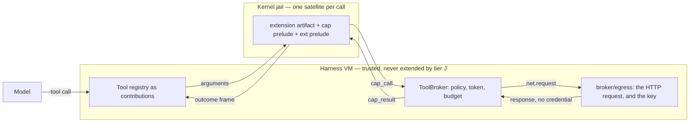
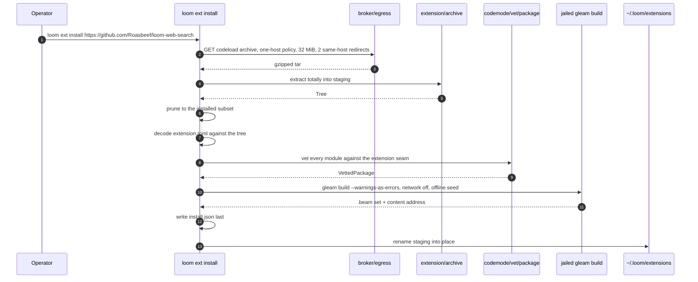

# Extensions

Every tool the model can call is defined in this repository, compiled
into the harness, and shipped in a release. That is the right home for
`bash` and `fs_read`, whose blast radius is the whole security argument,
and the wrong one for everything else. Web search, a language server, a
company's internal issue tracker: each is a small amount of code that
somebody outside this repository wants to write, and none of them is a
reason to cut a Loom release. **An extension is capability that arrives
from outside the repository without arriving inside the trusted computing
base.**

The obvious way to do that is the one the design forbids. Loading
somebody else's module into the harness virtual machine puts
model-adjacent code beside the storage writer, the state machine and the
broker, which is exactly what Rule Zero exists to prevent
(`docs/loom-design.md` §7). So an extension does not run in the harness.
It runs in the same jailed satellite a code-mode program runs in, against
the same capability prelude, judged by the same broker, one execution per
call. Installing one changes nothing in the harness VM, which is why the
freeze test #33 asks for is satisfied by construction rather than by
argument.

The ruling is `docs/adr/007-extension-tiers-and-brokered-egress.md`, and
the argument behind it — the vocabulary, the manifest, the pi survey, the
phases — is `docs/design-notes/extension-architecture.md`. This document
is what the tree actually holds, section by section, and it says so per
section: **built** or **planned**. The acceptance extension is a real
repository,
[loom-web-search](https://github.com/Roasbeef/loom-web-search), and its
`extension.toml` is the worked example throughout.

## Where the phases stand

| Phase | What it is | Status |
|---|---|---|
| 1 | `packages/ext`, the extension seam, the manifest, the install pipeline, install records, discovery, `loom ext` | **Built** (#177, #178, #179, #182) |
| 2 | Boot registration, jailed dispatch of an extension tool, `net.request` served by the broker under the manifest's policy | **Built** (#196) |
| 3 | A persistent satellite, `hook_call`/`hook_result`, the hook bus | **In flight**. The bus, the runtime slots, the manifest and record halves are built (`client/extension/hooks.gleam`); the persistent satellite that answers a `hook_call` is the other half, and until it lands every invoker is `hooks.unwired()` |
| 4 | Tier H: the harness-resident loader, the artifact import check, rollback | **Planned** (#32, #33) |
| 5 | LSP and DAP as extensions | Named, not commissioned (#26) |

Everything below is marked against that table. Where a section describes
phase 3 or later it says so in its first sentence, so a reader who wants
only the tree as it stands can skip on sight.

## Two tiers, and why jailed is the default

An installed extension has one manifest and up to two bodies.

**Tier J, the jailed body**, is the only one phase 1 admits — literally,
since `manifest.Tier` has one variant and the decoder accepts one string
(`extension/manifest.gleam:74`). It runs in a satellite under the
*extension seam*: the workspace seam's capability modules, `cap/ext`
for the call itself, and the `ext` prelude that carries the typed
behaviours. A tool call is one execution of the extension's compiled
source with the call's arguments; the capability channel is the only way
out; the broker judges every effect per call exactly as it does for a
code-mode program.

**Tier H, the harness-resident body**, is design §7's L3: hot-loaded
under a harness-controlled module name, confined to the typed behaviours,
only after an approval recorded durably, and only for a hook that must
see harness state synchronously. It is phase 4 and nothing planned needs
it. A manifest naming it is refused today, naming the tier — not
installed and quietly ignored, which is the distinction
`an_unknown_tier_is_refused_test` pins
(`client/test/client/extension_test.gleam:56`).



The rule that makes this shippable is **a tool is always tier J, and a
hook is tier H only when it cannot be tier J.** The instinct runs the
other way — hooks feel like harness business and tools feel like
sandboxable work — and the instinct is backwards. A tool call is a
request the model made and the broker judges; a hook fires on the
harness's own timeline with the harness's own data in hand. The more
powerful surface belongs behind the stronger boundary, which is the same
ordering `docs/architecture/code-mode.md` applies to the orchestration
seam.

## The seam an extension is vetted against

**Built.** The extension seam is the third of code mode's three, and
unlike the first two it is deliberately *not* disjoint from its
siblings. `extension_cap_modules` is `default_cap_modules()` widened by
exactly `cap/ext` and `ext` (`vet/policy.gleam:453`), and
`extension_stdlib_modules` is the shared pure subset widened by
`gleam/dynamic`, `gleam/dynamic/decode`, `gleam/bit_array`, `gleam/uri`
and `gleam/json` (`vet/policy.gleam:480`).

Disjointness exists between the workspace and orchestration seams because
an orchestrator and an effect program are different kinds of thing, and
which capabilities travel together is the question. An extension's tool
is not a different kind of thing from a workspace program: it reads
files, runs processes and, under ADR-007, makes brokered HTTP requests.
It differs in its *entry point*. The harness knows a code-mode program's
arguments when it launches the node; an extension is compiled once at
install and run many times, so the call is what varies and something has
to fetch it. That something is `cap/ext`.

The widening is pinned rather than trusted. `the_extension_seam_widens_by_exactly_three_names_test`
asserts the set difference is exactly `cap/ext`, `ext` and `ext/hook` —
the one capability only an extension makes, and the two vocabulary
modules `packages/ext` ships — and that `cap/strand` is not among them
(`codemode/test/codemode_test.gleam:578`) — because the superset test
alone would pass if the extension seam had quietly picked up agent
orchestration, putting the disk and the lineage in one program after all.
The five extra standard-library names live on a list of their own so that
widening them widens exactly one seam, and
`the_extension_stdlib_list_admits_no_capability_test`
(`codemode/test/codemode_test.gleam:591`) holds that list to carrying no
authority.

Two consequences are worth stating. **The extension seam sees no
generated MCP façades**: an extension's allowlist is fixed at install and
recorded, and a per-host widening applied afterwards would make an
installed extension's reach depend on configuration the record never saw.
And **the `code_mode` tool has no name for it**: an extension is
dispatched by the harness from an install record and is never named by a
model in a `code_mode` call. `docs/architecture/code-mode.md`, "The third
seam: extensions, and why it is a superset", is the depth.

## The manifest

**Built.** `extension.toml` at the root of the extension's repository is
the whole configuration surface, and `loom.toml` gains nothing per
extension. Here is the acceptance extension's, verbatim, with the tool
description elided:

```toml
[extension]
name = "web_search"
version = "0.1.0"
description = "Search the web with Brave Search."
license = "MIT"
tier = "jailed"

[[tool]]
name = "web_search"
description = "Search the web with Brave Search and read back the top results. …"
prompt_snippet = "web_search: search the web with Brave and read the top results"
parameters = "schema/web_search.json"
entry = "web_search/tool"
timeout_ms = 20000

[net]
hosts = ["api.search.brave.com"]
methods = ["GET"]
max_response_bytes = 1048576
requests_per_call = 4

[[net.secret]]
env = "BRAVE_API_KEY"
host = "api.search.brave.com"
header = "X-Subscription-Token"
```

`manifest.decode` (`extension/manifest.gleam:230`) is a total decoder in
the strong sense the durability boundaries use: **an unknown key is an
error in every table.** That is not fussiness, it is how the `[client]`
table the design note reserves for a later ruling gets refused without a
special case for it — `the_client_table_is_refused_test`
(`client/test/client/extension_test.gleam:78`) checks the general rule
rather than a named exception. Names are held to `[a-z][a-z0-9_]*` by
codepoint (`manifest.is_legal_name` at
`extension/manifest.gleam:257`), and environment-variable names to
`[A-Z_][A-Z0-9_]*` (`extension/manifest.gleam:275`), because a Cyrillic
lookalike in a tool name is not a normalization variant of anything.

Three rules need the tree beside the manifest, so `decode` takes a
`Surroundings` (`extension/manifest.gleam:191`): a tool's `parameters`
must be a path under `schema/` that exists and *parses as JSON*; its
`entry` must name a module `src/` actually ships; and a secret's `host`
must be one of `[net].hosts`. The last is a contradiction check rather
than a nicety — a binding for a host the policy cannot reach describes a
key that could only ever be sent somewhere the allowlist forbids.

Two smaller decisions. `prompt_snippet` is **required** here, where pi's
`promptSnippet` is optional, because the harness's own omission rule
drops a tool with no snippet from the available-tools index
(`tools/tool.gleam:442`); an extension author who forgot one would get an
invisible-but-callable tool instead of a refusal naming it. And an
absent `[net]` table decodes to `no_net()`
(`extension/manifest.gleam:177`) — empty hosts, empty methods, zero
caps — so an extension that names no network reaches none, which is the
deny-by-default the whole design rests on.

## Installing

**Built.** `loomd` grew its first subcommand with `loom ext`, and it is
an operator surface rather than a model one. The verb split lives in
`packages/client/src/client.gleam:34`, one module out of `client/serve`,
because the installer needs `serve.start_build_plane` and putting the
dispatch inside `serve` would be an import cycle.

Every failure is one of six named layers (`extension/install.gleam:133`)
and says which one it came from. Naming the layer is the point of the
type rather than a nicety: an extension is somebody else's
repository, the person reading the refusal is usually not the person who
can fix it, and `vetting: src/w/nif.gleam: an @external is not permitted`
is forwardable where `install failed` is not.



`run` (`extension/install.gleam:188`) is that sequence read top to bottom
in five `use` lines and a `stage` call. Every failure removes its staging
directory, including the ones that happen after a build has written
megabytes into it, so a directory under `~/.loom/extensions` is either a
complete install or absent. A name already taken is refused rather than
overwritten: replacing an install is remove-then-install, and nobody
loses a working extension to a failed reinstall.

### Hardening the install

The install is the one network-bound step in the whole design, and it
runs as the operator on the host, outside any jail. So it gets the same
treatment ADR-007 gives the extension itself.

**No git client.** A source is a local path, an `https://` URL naming a
`.tar.gz`, or an `https://github.com/<owner>/<repo>` URL that resolves to
codeload's archive URL. `source.parse` (`extension/source.gleam:84`)
refuses `git://`, `ssh://`, `git+ssh://`, `file://`, plain `http://` and
the scp-style `git@host:path` **by name**, each refusal restating the
three accepted forms. `git clone` is a large, remotely driven attack
surface — a hostile remote chooses the pack, the refs, the attributes,
the submodules — and nothing in an install needs it. A URL carrying
userinfo is refused as malformed rather than stripped
(`source.host` at `extension/source.gleam:187`), so `https://github.com@evil`
cannot install anything.

**The fetch is a policed request, not a client of its own.**
`cli.fetch` builds `egress.one_host` (`broker/egress.gleam:415`): host is
the URL's host and nothing else, method `GET`, at most two same-host
redirects (GitHub's archive redirect is one), a 32 MiB response cap, one
deadline for the whole transfer, and a secrets resolver that always
fails, because no credential belongs on a public archive fetch. This is
Decision 2's policy shape with an allowlist of exactly one, which is the
point: the install path and the extension path share one HTTP surface, so
a cap raised for one is raised for both.

**The archive is untrusted input.** `archive.extract`
(`extension/archive.gleam:249`) inflates under the total-bytes cap and
abandons the stream the moment it goes over, so a decompression bomb is
never materialised. The ustar reader then admits regular files,
directories and pax headers and nothing else, refusing symlinks, hard
links, devices, fifos and GNU long-name extensions **by name**; paths may
not be absolute, may not contain `..` or `.`, must sit under one
top-level directory, and are confined to a printable codepoint subset
with no control characters, no backslash, and none of the invisible
formatting and bidi codepoints. A local directory goes through the same
collector via `from_directory` (`extension/archive.gleam:284`), which
additionally lstats the root before walking it and skips a `.git`
directory, so a working checkout reads as its own export.

**Content, not a promise.** `archive.digest`
(`extension/archive.gleam:336`) is a SHA-256 over a length-prefixed
encoding of the sorted files, and it excludes `Tree.root` and
`Tree.commit` deliberately, so a tree fetched from an archive and the
same tree copied from a directory digest identically. The record stores
the resolved revision and that digest, and every later load re-digests
the tree against the record. An install is content-addressed from the
moment it is recorded, whatever the remote does afterwards.

**The compile is offline, jailed, and the same one code mode uses.**
`serve.start_build_plane` is the boot's own helper ladder, helper pool,
broker, toolchain discovery and seed verification, factored out so the
installer calls it rather than reimplementing it. Two implementations
would be two answers to "may this build run". The extension's own
`gleam.toml` never reaches the compiler — the build root's is generated
from `compile.default_dependencies()` — so a dependency an author named
would fail the build rather than enter it, and vetting refuses it before
that anyway. Vetting runs on the source before the compiler sees it, so
the compiler is never the first thing to touch a hostile file.

### What an install keeps

**Built** (#182). The layout rule is stated as *what an install keeps*
rather than *what an archive may contain*, and the difference was found
the hard way: the first attempt to install a real repository was refused
for having a test and a `.gitignore`, which is every Gleam repository
there is.

`package.installed_subset` (`vet/package.gleam:201`) is the one door. It
keeps `src/**/*.gleam`, `schema/**`, `skills/**`, `extension.toml`,
`gleam.toml`, `README*` and `LICENSE*`, and prunes the rest — `test/`,
`.gitignore`, `.github/`, `docs/`, `build/`, and Gleam's own resolved
`manifest.toml`, which the build regenerates. `is_installed`
(`vet/package.gleam:219`) is the same rule read as a predicate. The
precedent is the `.git` directory `from_directory` already walks past:
the installed tree is what the extension *is*, and the repository around
it is not part of what an operator approves.

Three orderings carry the weight.

`installed_tree` runs **first** (`extension/install.gleam:194`), ahead of
the UTF-8 decode, the manifest, the vetting, the digest and the write. So
the recorded digest describes the installed tree, and a later load
compares like with like rather than re-deriving the prune and hoping it
lands the same way twice. It also means the UTF-8 refusal reaches only
installed files: a screenshot under `docs/` is pruned, one under
`schema/` is refused.

`vet_package` prunes too, idempotently
(`vet/package.gleam:146`), so no caller can vet a wider tree than the one
that gets installed by forgetting a step.

`installed.check` deliberately does **not** prune
(`extension/installed.gleam:197`). The install already narrowed the
repository and wrote exactly that, so what sits under `<name>/src/` *is*
the installed tree, and a file dropped in afterwards has to change the
digest. Pruning again at load would forgive exactly the tampering the
digest exists to catch.

One shape stays a refusal rather than a prune: a non-`.gleam` file under
`src/`. Gleam compiles a native module found there and links it into the
artifact, which is `@external` with the declaration moved out of the
source the lint reads, and pruning it would silently drop something the
author expected to run.

`a_repository_is_pruned_to_its_extension_test`
(`codemode/test/codemode/vet_package_test.gleam:91`) puts a whole
repository through and asserts the prune is the same set whichever door
asks for it; `a_repository_installs_and_only_its_extension_is_kept_test`
(`client/test/client/extension_test.gleam:577`) does the same end to end
and then asserts the recorded digest verifies against the pruned tree.

## Discovery, and what a load re-derives

**Built**, both the re-derivation and the registration at boot.
`installed.discover` (`extension/installed.gleam:82`) reads the
extensions root, filters entries through the same name grammar the
manifest uses, and returns `Ready` or `Refused` for each — a refusal is a
*value*, not a shorter list, because an operator who installed something
and then sees nothing cannot tell "it is broken" from "I imagined it".

`check` (`extension/installed.gleam:197`) re-derives five things from
disk and compares each with the record: the tree digest, the manifest,
the vetting, the recorded allowlist against the current seam's, and the
artifact's content address via `build.fingerprint_directory` — the same
function the build itself used. The last one is the one that is easy to
leave out and the one that matters: re-vetting *source* says nothing
about the *bytes that actually run*, and
`a_tampered_artifact_is_refused_test`
(`client/test/client/extension_test.gleam:546`) is what stops that gap
from reopening.

The allowlist is **stored** in the record rather than recomputed
(`extension/record.gleam:121`), and that is a decision rather than an
accident. Recomputing it would mean an operator's yes silently followed
the harness's current idea of the seam; storing it turns a widened seam
into a question the operator gets asked again.

One honest gap remains. The workspace-local root —
`<workspace>/.loom/extensions`, listed but never loaded until approved —
is a design ruling and not yet code: today the only root is
`<home>/.loom/extensions` (`extension/record.gleam:154`), resolved from
`--home` or `HOME`. Discovery's other caller is now the boot itself:
`client/serve` reads the same records `loom ext list` and `loom ext
verify` read, and the section on dispatch below says what it does with
them.

### `loom ext`

**Built.** Four verbs, no daemon, no hot install
(`extension/cli.gleam:106`):

```
loom ext install <source> [--rev REV] [--home DIR] [--best-effort]
loom ext list
loom ext remove <name>
loom ext verify <name>
```

`install` prints five lines — what was installed and at which revision,
the tool names, the tree digest, where it went, and what the kernel
enforced on the jail that built it. That last one is the same enforcement
report code mode prints, and it is there for the same reason: a green
build on a kernel missing a layer should say so rather than let the
absence read as success. `verify` exits non-zero on a `Refused`, so it is
usable from a script.

The terminal client forwards rather than reimplements: `loom ext …` typed
at `loom` locates `loomd` by the same ladder an implicit local session
uses and runs it, streaming output through and exiting with its status
(`tui.gleam:348`). Two ladders would mean installing an extension into
one server's world and then starting another.

## Inside the satellite

**Built**, and the harness end that answers it is built too — the
section on dispatch below is that half. `packages/ext` is `cap`'s
sibling: a second small package vendored
into every extension build root, published on its own, and running
*inside* the jailed node rather than in the harness VM. The split is
deliberate — `cap` is the capability language, what a jailed program may
*reach*; `ext` is the behaviour contract, what shape a jailed program
must *be* to serve a tool call.

An author writes one function per tool, typed
`Tool = fn(Dynamic, Ctx) -> Result(Outcome, Refusal)`
(`packages/ext/src/ext.gleam:110`). Arguments arrive as a `Dynamic`
because their shape is the manifest's `parameters` JSON schema, which the
harness knows and this package does not; `ext.decode_args`
(`packages/ext/src/ext.gleam:167`) turns a decode failure into a refusal
that names the field, because the model reads that refusal and retries
and `expected String at .city` is a repair instruction where `bad
arguments` is a dead end. A refusal is a *value* rather than a thrown
error — pi signals a tool error by throwing — because a refusal is text
the model reads and a crash is a fault the harness reports and the model
can do nothing with. `Terminate` is a two-variant type rather than a
`Bool` field, so the call site says which it means.

The install writes a generated `loom_satellite` entry module whose whole
body is one call:

```gleam
runtime.serve([#("web_search", tool.run)])
```

`serve` (`ext/runtime.gleam:84`) hands `answer`
(`ext/runtime.gleam:101`) to `cap/runtime.run`, which is the same boot
runtime a code-mode program uses — reused rather than reimplemented, so
the token file, the socket, the exclusive channel slot and the terminal
`outcome` frame stay in one place and this module could not read a token
if it tried. `answer` then does exactly three things: it asks the harness
which call this execution is for, it dispatches on the name, and it
returns an outcome.

The asking is `cap/ext.call` (`cap/ext.gleam:77`), capability
`ext.call`, arguments the empty map, result
`{tool, args, strand, deadline_ms}` with `args` as **JSON text** rather
than a msgpack value. Two reasons: `gleam_json`'s parser is the only
route from bytes to a `Dynamic` that the extension seam's allowlist
admits, and text means the harness hands over exactly the bytes the
model's tool call carried with no re-encoding step in between to disagree
about numbers. The alternative — smuggling the call in through the node's
environment — would be untyped, size-limited, and visible to every
process in the jail.

**One satellite serves exactly one call.** `serve` fetches a call,
dispatches it, and returns; `cap/runtime` writes one `outcome` frame and
the node exits. A second `ext.call` would be a second admission against
the same token, so there is no loop here to make one. An unknown tool
name is an error outcome naming both the name asked for and the sorted
list this artifact serves, because the only way it can happen is a
manifest and an artifact that disagree, and an operator reading that
needs the disagreement rather than half of it.
`the_runtime_fetches_its_call_and_answers_test`
(`ext/test/ext_test.gleam:123`) drives the whole round trip over a faked
channel and asserts exactly one outcome frame comes back.

## Dispatch

**Built** (#196). Discovery answers what is installed; dispatch is what
turns one of those answers into a tool the model can call and then into
an execution. The path runs boot to outcome in one direction, and every
step of it is a value the step before produced.

**At boot**, `serve.assemble` reads `installed.discover` for the
extensions root before it builds the registry
(`extension_contributions` at `client/serve.gleam:1354`). A `Refused`
is logged and registers nothing; a `Ready` on a host with no code-mode
toolchain is logged and registers nothing too, because no `erl` means no
satellite to boot and a tool definition that can only fail still costs a
place in the provider's cached prefix on every request.

**Everything else becomes a contribution.** `dispatch.tools`
(`extension/dispatch.gleam:160`) turns the record and the manifest into
`tools.Tool` values, and the boot appends one
`Contribution(Extension(name), tools)` after the built-ins. From there
the registry knows nothing special: an extension tool is dispatched by
name through `tool.dispatch` like every other, and the collision rule
that refuses a boot when two contributions claim one name is the same
rule that guards `bash`.

**A call is one satellite execution of the artifact the install
compiled.** No build happens — that was the install's job — so the call
pays a node launch and nothing else. The declared tool timeout is
clamped: `within` (`extension/dispatch.gleam:365`) takes the minimum of
the manifest's `timeout_ms` and the operator's `max_within_ms`, because
an install is not a way to raise how long this host will hold a strand.

**The node pulls its own call.** The satellite does not receive the tool
name in its environment; it asks, once, over the capability channel, and
the extension seam's `ext.call` arm answers with the tool, the JSON
arguments, the strand and the deadline (`routing` at
`extension/seam.gleam:151`). A second ask is refused by a lifetime
ceiling of one admission, since a satellite is launched to serve exactly
one call.

**A `net.request` is judged by the manifest an operator approved.**
`policy.egress_for` (`extension/policy.gleam:157`) is the whole
translation: the manifest's hosts, methods and secret *names* verbatim,
and `redirects`, `timeout_ms` and `trust` fixed by the harness, because
none of the three is something an author should be able to state about
themselves. Two of the manifest's numbers are requests rather than
settings — `max_response_bytes` is clamped to the harness ceiling
(`max_response_bytes` at `extension/policy.gleam:67`, the install
fetch's own archive cap, so the two egress callers share one bound), and
`requests_per_call` becomes a per-execution admission ceiling alongside
`ext.call`'s one (`ceilings` at `extension/policy.gleam:199`). A
manifest with no `[net]` table is `ReachesNothing`, refused
`network_off` rather than refused against an allowlist nobody wrote.

**The outcome is settled into a `ToolOutcome`.** `settle`
(`extension/dispatch.gleam:556`) reads the terminal `outcome` frame —
content blocks, an optional `terminate`, or an error naming what went
wrong — and hands back the same type a built-in tool hands back, so the
strand's driver cannot tell which kind of tool it just ran.

Two things the dispatch deliberately does *not* do. A `Ctx.grants` an
escalation approved for *this call* is not composed onto the run phase:
the operator approved this extension once, at install, having read a
manifest, and a mid-run widening would run it past the terms of that
approval. And no arm here adds to the node's environment, which is why
the credential claim below is a claim about the whole path rather than
about one arm of it.

## Egress, and the key that never enters the jail

`cap/net` exists and refuses everything, because the design's egress
story was a proxy sidecar that does not exist —
`policy.narrow_unenforceable` turns `NetworkProxy` into `NetworkOff` on
every clearance, so a proxy-mode call fails closed. A sidecar is the
general answer for a jailed process that opens sockets itself. **An
extension does not need to open a socket. It needs a request made and the
response handed back.**

So `net.request` is served the way `fs.read` is served: the harness
performs the request, under a policy composed from the extension's
manifest, and returns the response over the capability channel. The
jail's network namespace stays empty, which is the property every sandbox
layer already enforces and the property the proxy was meant to preserve.
`broker/egress` is emphatically *not* that proxy revived
(`broker/egress.gleam:374`), and `packages/broker/CLAUDE.md` says so in
its invariants so the next reader does not conflate them.

### The threat model

The caller is model-influenced code in a jail. The asset is the
operator's API key. The whole design follows from refusing to let the
first one name the second.

A `Secret` (`broker/egress.gleam:159`) binds an **environment variable
name** to one header and one origin — exactly as `client/catalog`'s
`api_key_env` binds a provider key, one layer down. The value is read at
request time through the `secrets` function injected into
`egress.request`. It is not stored on the policy, it is not returned,
and — the load-bearing part — **no `Refusal` variant has a field it could
occupy** (`broker/egress.gleam:239`). That is structural rather than a
convention: `describe` (`broker/egress.gleam:443`) has nothing to redact
because there is nothing to redact, and
`describe_names_the_binding_but_never_the_value_test`
(`broker/test/broker/egress_test.gleam:301`) renders every variant and
asserts the canary is in none of them.

Three ways a caller might probe for the key, and each is refused before a
socket exists:

- naming the credential header yourself is `HeaderReserved` — reserving a
  secret's header also refuses any caller header of that name, case
  insensitively;
- appending a header by ending one early is `HeaderMalformed`, from the
  same pass. Every header is scanned for CR, LF and NUL **over
  codepoints, not substrings**, because `string.contains` works on
  grapheme clusters and CRLF is one cluster, so a substring scan for
  `"\r"` misses the exact injection sequence. The refusal names the
  header and never the value;
- an unset binding is `SecretMissing`, so a missing key never degrades
  into an unauthenticated request that a hostile server gets to answer.

The URL is attacker-influenced too, so **every hop re-runs the whole
judgement**: scheme, origin, method. A redirect is a new request. Origins
are matched exactly, case-insensitively, with no wildcards and no suffix
matching, and a bound credential is injected only on a hop whose origin
it names — `injects_a_credential_only_for_the_origin_it_is_bound_to_test`
(`broker/test/broker/egress_test.gleam:375`) runs two live TLS origins
and asserts the header is absent from the unbound one's echo.

Two subtler decisions are recorded in the module doc. Neither HTTP
connections nor TLS sessions are reused, and the second matters more: the
`ssl` client session cache is node-global and keyed on host and port, and
a resumed TLS 1.2 handshake carries no certificate, so a session
established under other roots — by another policy, or by the provider's
own client sharing the node — would skip the verification the pinned
roots were meant to force. And the size cap is enforced while the body
streams, but `httpc` only streams 200 and 206; on other statuses the cap
is a check rather than a brake, which the doc states rather than papers
over.

What egress does **not** defend against is stated as plainly: the body
comes back intact. `max_response_bytes` bounds how much a permitted host
can say, never what it says, and those bytes then flow wherever that
extension's own capabilities allow. The allowlist is the trust decision;
the cap is only a resource bound.

The one hop that touches a socket is
`ffi_egress.fetch` (`broker/internal/ffi_egress.gleam:61`), `httpc` on a
broker-private profile with autoredirect off and the body streamed. It
performs exactly one hop and never follows a redirect; the chain, the
injection and the whole-request deadline stay in Gleam.

### What is built, and what is not

**Built**: the egress client, its FFI, `one_host`, and the manifest
`[net]` decode with its secret *names* carried into the install record
(`a_record_carries_no_secret_values_test` asserts the record's terms are
exactly the names, by equality, so a field added later cannot smuggle a
value in unnoticed —
`client/test/client/extension_test.gleam:213`).

**Also built** (#196), and named here because an earlier edition of
this document listed it as owed: `policy.egress_for`
(`extension/policy.gleam:157`) turns a `manifest.Net` into an
`egress.Policy`, the extension seam's `net.request` arm serves it
(`routing` at `extension/seam.gleam:151` — `cap/net.gleam:71` marshals
and labels, and this is what answers), and `policy.ceilings`
(`extension/policy.gleam:199`) is the per-execution `requests_per_call`
ledger. Egress now has two production callers, the install fetch and a
dispatched extension, and the web-search extension both installs and is
called on `main`.

**The one exception to the rule, stated once.** MCP servers keep
`api_key_env`, and their credential is in the environment of an unjailed
child process rather than held by the harness. That is a real difference
in posture and it is #109's open question, not an oversight;
`docs/architecture/mcp.md` owns it. Making a secret's *source* pluggable —
a vault, a keychain, a command — is #181, and lands behind the one
`secrets` function egress already takes.

## The invariants

Each of these is a sentence and the failure it prevents.

**Nothing an extension ships runs in the harness VM.** A tier-J
extension's code is compiled into a satellite artifact and executed
behind the jail; the harness links none of it. Were it otherwise,
installing an extension would be model-adjacent code beside the storage
writer, and every Rule Zero argument in the tree would be about the wrong
process.

**The record is written last and the tree is renamed into place after
it.** Everything happens under `<root>/.staging/<random>/`. Without the
ordering there would be a window in which a half-installed extension is
discoverable, and discovery would have to distinguish "incomplete" from
"tampered with" — two states that look identical from disk.

**Every load re-derives what the record claims.** Digest, manifest,
vetting, allowlist, artifact fingerprint. Without the re-derivation an
install would be a promise about a moment rather than a claim about
bytes, and one edited file under `src/` would run unvetted forever.

**The prune happens once, first, and never again at load.** The digest
describes the installed tree because the tree was narrowed before it was
digested. Pruning again at load would forgive exactly the tampering the
digest exists to catch.

**A refusal names its layer and its file.** `vetting:
src/w/nif.gleam: …` is forwardable to the author; `install failed` is
not. The failure type exists to make that impossible to get wrong.

**The credential is a name in the manifest and a value in the server's
environment, and nothing in between.** No file holds it, no frame on the
capability channel carries it, no refusal has a field it could occupy,
and the extension's own source could not read it — the extension seam has
no module that reads the environment. Without this, an extension system
would be a credential-exfiltration mechanism with a tool registry
attached.

**Two contributions may not claim one tool name.** Within a contribution
a repeated name is the author overriding themselves and the later one
wins; *between* contributions it takes the boot down, naming both origins
(`contributions.registry` at `client/contributions.gleam:191`). An
extension that could register `bash` would silently redefine what the
model's `bash` call does, and every sandbox argument in the tree would be
about the wrong function.

**A registry reaches a session once.** The prompt index and
`active_tool_names` are both fixed at session creation, so installing an
extension changes what the *next* session sees rather than growing the
one already running. The alternative is a live session whose tool array
no longer matches its cached prefix.

## What the end-to-end proves

The install pipeline's own discipline — staging, the record, the rename,
the digest, the layer naming — is proved on **every** run of `make
check-client`, because every test but one injects a fake build. Each
hostile fixture differs from the working one in exactly one way, so
`a_hostile_fixture_is_refused_by_its_own_layer_test`
(`client/test/client/extension_test.gleam:344`) asserts *which* rule
caught it: an `@external` and a forbidden import are refused by vetting,
an unknown tier and an unknown key and an out-of-policy secret host by
the manifest. A tampered source file, a tampered artifact, a missing
entry `.beam`, a record naming another extension and a traversing name
each have their own test, and each asserts the refusal is a value naming
the reason rather than an absence.

One test builds for real. `a_real_jailed_build_installs_test_`
(`client/test/client/extension_test.gleam:779`) runs the extension's
source through a genuine `gleam build --warnings-as-errors` inside a
network-off jail, against the same offline seed and the same helper code
mode uses, and it is feature-detected the way
`packages/codemode/test/codemode/e2e_test.gleam` is: without a sandbox
helper, a toolchain and a prepared seed it prints its skip reason and
passes, so `make check` stays hermetic and fast. `make e2e-codemode`
prepares the seed and `make binaries` the helper, and there it runs.

The egress suite is split the same way and for the same reason. Refusals
that must happen *before a socket exists* are tested offline, because a
test that needed a server to observe them would not be checking that. The
live half runs a real TLS origin on loopback whose chain is generated by
`public_key:pkix_test_data/1` and whose root is pinned — nothing in it
relaxes verification, and the session-reuse test runs against TLS 1.2 on
purpose, since 1.3 resumes through tickets that are off by default in
OTP's client.

The dispatch has an end-to-end of its own.
`an_installed_extension_reaches_the_network_test_`
(`client/test/client/extension_e2e_test.gleam:111`) installs a fixture
extension with a real jailed build, boots a real satellite per call
against a real TLS origin on loopback whose root it pinned, and asserts
six things:

- the registry carries the fixture's tool and the manifest's
  `prompt_snippet` reaches the prompt index, so what was installed is
  what the model is offered;
- a call answers `200` through the brokered request, and the origin saw
  the credential in the header the manifest bound it to — read out of
  band by the harness rather than off the wire;
- the binding's variable name and its value are in **neither half** of
  the node's environment: not in `launch.node_env`, what the launcher
  sets, and not in `env_allow`, what the kernel would pass through at
  all;
- the value is on **no frame** in either direction, asserted by a tap
  that records every byte on the capability channel around the
  production launcher — so the claim is about the channel rather than
  about the one arm that could plausibly carry one;
- a host the manifest does not name is refused in band, as a denial the
  extension read and turned into a sentence naming the host;
- the request after `requests_per_call` is refused while the ones under
  it are answered, which is what makes it a ceiling rather than a
  failure.

The origin deliberately does not echo the request, because an echoing
one would put the credential in the response body and make the absence
claims false for a reason that has nothing to do with the design.

The model half was driven for real on 2026-09-02: `loom ext install
https://github.com/Roasbeef/loom-web-search` over codeload, pinned at
`677199c` and producing the same tree digest a local-path install of the
same revision produces, then a Kimi K3 session called `web_search` and
answered from Brave's results, with `BRAVE_API_KEY` in `loomd`'s
environment on the host and nowhere else. That is phase 2's remaining
exit criterion, and it is met.

## Phases 3 to 5

**Phase 3, planned: a persistent satellite and callbacks.** Hooks need
the harness to call *into* the extension, and `cap_call` only flows
satellite → broker. Phase 3 adds a `hook_call` frame in the other
direction over the same authenticated channel, answered by `hook_result`,
with the deadline discipline of a cap call, and a satellite that lives
for the session — the "kept alive across calls" mode
`docs/architecture/code-mode.md` describes as not built, whose reaping
invariant already has its guard in `cap/runtime`'s refusal to install
over a live channel. That is a `protocol-change/` proposal rather than
drift, and it is written before the phase starts:
`protocol-change/012-hook-call.md` is proposed on `ext/phase-3-proposal`.

The harness side is built, and it is one `weft/event_manager` per session
with a handler per installed extension: an ordered list, each holding
private state (its name, the events it declared, its invoker, how many
answers it has declined), a broken one dropped and logged while its
siblings carry on. Notifications (`session_start`, `agent_end`,
`agent_settled`) are `notify`; the two events that need an answer —
`before_agent_start`, whose answer is an injection, and `tool_call`,
whose answer is a verdict — are a `sync_notify` whose event carries a
reply subject, drained after the fan-out returns, so any `Block` wins.
The two chained transforms (`context`, `tool_result`) are a fold rather
than a fan-out, because each handler must see its predecessor's output;
they run on the caller's process and a failure there discards one
transform rather than removing a handler, which the bus module states
rather than leaves to be discovered.

Where each event lands in the harness:

| Event | Where it fires |
|---|---|
| `session_start` | `serve.assemble`, once the session's extension hosts are wired |
| `before_agent_start` | `effects.Hooks.run_start`, appended after the harness's own digests; the text is fenced `<extension name=…>` and attributed by the harness, never by the extension |
| `context` | `effects.Hooks.context`, a phase-3 slot on the frozen-in-shape hooks record, applied in `runtime/strand_runtime` to the projection a generation attempt is about to send. A transform that grows the context past its allowance is discarded and logged |
| `tool_call` | `effects.ToolSurface.clear`, **after** the built-in clearance; a `Block` becomes the `ClearanceRefused` the driver turns into the in-band error the model reads, reading `<extension> blocked <tool>: <reason>` |
| `tool_result` | `effects.ToolSurface.run`, over the settled reply before the driver commits it. A transform that changes which call the reply settles, or whether it failed, is discarded whole |
| `agent_end` | `effects.Hooks.run_end`, beside the follow-up the harness was already placing |
| `agent_settled` | nowhere yet; see the design note's table for why it is not faked |

Every payload crosses as a msgpack string holding JSON, the shape
`cap/ext` already uses for a tool call's arguments and the only one the
extension seam can read: it admits `gleam/json` and no msgpack decoder.
A conversation message is `core/codec`'s durable JSON, decoded back
through the same total decoder, so a transform that no longer decodes is
discarded rather than half-applied. `client/extension/hooks.gleam`'s
module documentation is the normative table of the seven shapes, and
`packages/ext/src/ext/hook.gleam` is the extension's side of the same
wire.

The vocabulary is pi's where the moment and the handler's power match,
and diverges openly where they do not. The sharpest divergence:
**arguments are not mutable.** pi mutates `event.input` in place and
re-validates nothing; a hook that rewrites a call's arguments after
vetting is the one thing the vetting cannot see, so a `tool_call` handler
here may `Block` with a reason or say nothing. `docs/design-notes/extension-architecture.md`
has the whole table, including the events deliberately absent — no
provider hooks, because provider ownership is TCB, and none of pi's UI
moments, because those belong to the client and the client is a separate
process over a frozen gateway.

**Phase 4, planned: tier H.** The loader compiles a harness-resident body
from vetted source under a harness-controlled module name, checks the
compiled artifact's *import table* against the tier-H allowlist before
loading it — the runtime half of #33's two freeze mechanisms, where the
vetting lint is the compile-time half — runs it under a supervised,
time-boxed wrapper, and rolls back to the previous artifact when a load
or a first call fails.

**Phase 5, named but not commissioned: LSP and DAP as extensions.** A
language server is a long-lived JSON-RPC process over stdio plus a small
tool set, and nothing in it touches the TCB, so the extension route is a
better home for both than a core tool (#26). Phase 3's persistent
satellite is what makes it possible: the server process outlives one call
as a child the extension starts from `session_start` through `cap/proc`,
in the jail, seeing the workspace roots and no network. What the plan does
not yet contain is a grant for binaries — a `[proc]` table in the manifest
beside `[net]`, with the same per-execution ceiling shape. `cap/lsp`
exists today as an allowlisted stub, and this route retires it.

## Where the code lives

| Path | What it holds |
|---|---|
| `packages/ext/src/ext.gleam` | The author-facing vocabulary: `Ctx`, `Content`, `Terminate`, `Outcome`, `Refusal`, and the `Tool` alias at `packages/ext/src/ext.gleam:110`. No effects, no FFI. |
| `ext/runtime.gleam` | The satellite's whole main loop: `serve` (`ext/runtime.gleam:84`), `answer`, `dispatch`, and the outcome body. |
| `cap/ext.gleam` | The one capability an extension calls before anything else: `call` (`cap/ext.gleam:77`), and the wire shape it pins. |
| `codemode/vet/policy.gleam` | The three seams. `extension_cap_modules` (`vet/policy.gleam:453`) and `extension_stdlib_modules` (`vet/policy.gleam:480`) are the widening, written as the workspace list widened so the superset is a fact about the code. |
| `codemode/vet/package.gleam` | Vetting a *package*: `installed_subset` (`vet/package.gleam:201`), the native-file refusal, the `gleam.toml` dependency gate, and the sibling-import widening. |
| `client/extension/source.gleam` | The grammar of what an operator may type: `parse` (`extension/source.gleam:84`), the refused schemes, and the codeload archive URL. |
| `client/extension/archive.gleam` | The total tar.gz reader, the directory walker, and the tree digest: `extract` (`extension/archive.gleam:249`), `from_directory`, `digest` (`extension/archive.gleam:336`). |
| `client/extension/manifest.gleam` | The total `extension.toml` decoder: `decode` (`extension/manifest.gleam:230`), the closed key lists, the name grammars, and `no_net()`. |
| `client/extension/install.gleam` | The pipeline: `run` (`extension/install.gleam:188`), the staging discipline, the generated satellite entry. |
| `client/extension/record.gleam` | The install record and the `Root` that says where installs live: `Record` (`extension/record.gleam:121`), `terms`, `root_for`. Format 2 carries the hooks an operator approved. |
| `client/extension/hooks.gleam` | The hook bus: the `Event` type, `Invoker`/`HookFailure`, the five fan-out events, the two folds, the fence an injection is rendered in, and `wire`, which composes the bus into a session's `Effects`. |
| `packages/ext/src/ext/hook.gleam` | The extension's side: the typed `Hook` behaviours, `Verdict`, and the JSON marshalling of every event's payload. |
| `client/extension/installed.gleam` | Discovery and the five re-derivations: `check` (`extension/installed.gleam:197`), `artifact_matches`, `summarise`. |
| `client/extension/cli.gleam` | `loom ext install\|list\|remove\|verify`: `dispatch` (`extension/cli.gleam:106`), the one-host fetch, and `build_for` over a started build plane. |
| `client/extension/policy.gleam` | The manifest's `[net]` table as a policy: `egress_for` (`extension/policy.gleam:157`), the per-execution `ceilings` (`extension/policy.gleam:199`), the harness's own `max_response_bytes` ceiling, and the refusal vocabulary `cap/net` can branch on. Pure; no transport. |
| `client/extension/seam.gleam` | The two router arms a jailed extension has that a code-mode program does not: `routing` (`extension/seam.gleam:151`) over `serviced_caps` (`extension/seam.gleam:59`). Msgpack in, msgpack out, and no policy at all. |
| `client/extension/dispatch.gleam` | An install record as `tools.Tool` values and one satellite per call: `tools` (`extension/dispatch.gleam:160`), the timeout clamp `within` (`extension/dispatch.gleam:365`), the jail's `requirements` (`extension/dispatch.gleam:287`), and `settle` (`extension/dispatch.gleam:556`). |
| `client/serve.gleam` | The boot that finds what is installed: `extension_contributions` (`client/serve.gleam:1354`), the two refusals it logs, and the contribution it appends. |
| `client/contributions.gleam` | The tool registry as an ordered list of contributions: `registry` (`client/contributions.gleam:191`) and the collision that refuses a boot. |
| `broker/egress.gleam` | The outbound HTTP surface: `request` (`broker/egress.gleam:374`), `one_host`, `Secret` (`broker/egress.gleam:159`), and a `Refusal` type with nowhere to put a credential. |
| `broker/internal/ffi_egress.gleam` | One hop over `httpc` on a broker-private profile: `fetch` (`broker/internal/ffi_egress.gleam:61`). The only impurity in the path. |
| `tui/tui.gleam` | `loom ext …` forwarded to the server by the same ladder a local session uses; the `Forward` arm is at `tui.gleam:348`. |
| `client/test/client/extension_test.gleam` | The install acceptance, layer by layer, plus the one real jailed build. |
| `client/test/client/extension_e2e_test.gleam` | The dispatch acceptance: a real build, a real satellite, a real TLS origin, and the two absence claims about the credential. |
| `broker/test/broker/egress_test.gleam` | The credential canary, the header-injection refusals, and the live TLS origin. |

Each Gleam path is relative to its package's source root —
`extension/install.gleam` is
`packages/client/src/client/extension/install.gleam` — except
`packages/ext/src/ext.gleam`, whose root-relative name would collide with
`cap/ext.gleam`, and the last three rows, which are under their packages'
`test/`.

`docs/architecture/code-mode.md` is the depth on the pipeline an
extension's artifact is compiled into and on what each of its layers
confines; `docs/architecture/effects.md` holds the threat model and the
two-channel doctrine; `docs/architecture/client.md` is the install from
the client's side, including the registry seam. `packages/ext/CLAUDE.md`,
`packages/client/CLAUDE.md`, `packages/codemode/CLAUDE.md` and
`packages/broker/CLAUDE.md` are denser than this document about their own
packages. For intent, `docs/adr/007-extension-tiers-and-brokered-egress.md`
and `docs/design-notes/extension-architecture.md`.
