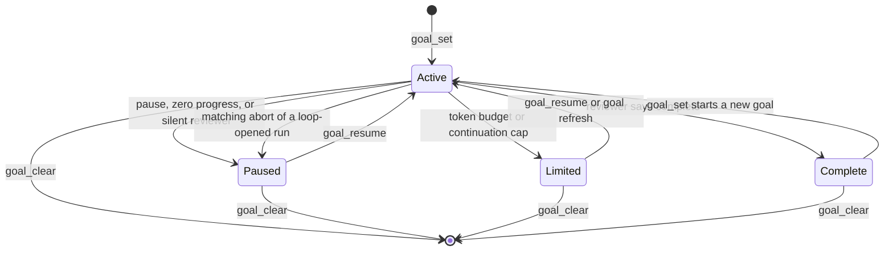
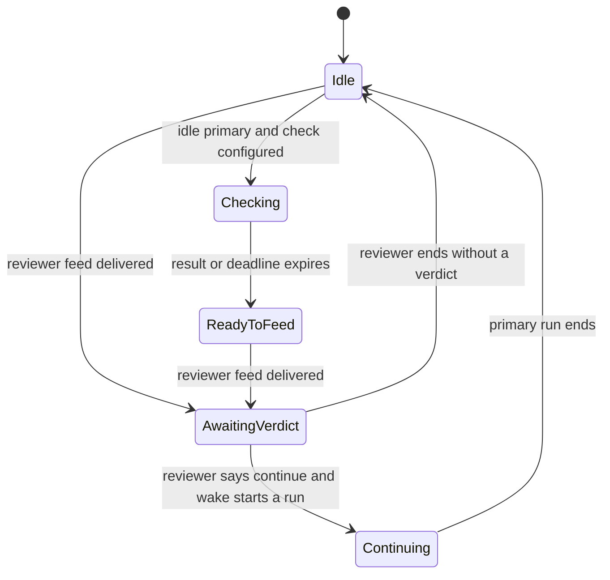
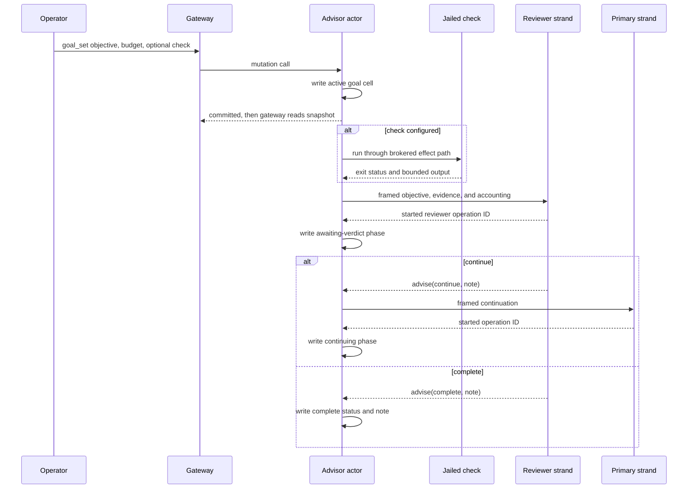

# Session goals

A session goal is one objective, pinned by the operator, that Loom carries
across runs of the *primary* (the model strand doing the session's work). A
second model strand, the *advisor*, reviews the primary's durable work after
each run and either declares the goal complete or asks the primary to
continue. The harness bounds this autonomous loop with a token budget, a
continuation cap and progress checks. The primary cannot create, pause,
resume, clear, or complete a goal; it receives the objective as
operator-authored data inside a harness frame and continues the work.

This document describes the implementation at `ebd99fe1`. [Protocol Change
044](../../protocol-change/044-session-goals.md) owns the contract. The older
[design note](../design-notes/goals.md) records how that contract was reached,
including designs that the current source replaced.

## An operator's view

Suppose the operator pins:

```text
/goal --budget 400000 get the branch green
/goal check make check
```

The first command stores an active goal with a required 400,000-token budget.
The second attaches `make check` without resetting the goal's accounting or
loop counters. If the primary is idle, `goal_set` may start the first review
before the second command arrives; the check then applies from the next review
on.

Each review is a *feed*: a message to the advisor carrying the objective, the
check result, and the primary's new transcript. When a feed is due and a check
is attached, Loom first runs the check through the jailed effect path. The
advisor must answer the feed with `continue` or `complete`.

A continuation opens another primary run with the reviewer's note. Completion
records the reviewer's note and leaves the terminal goal visible until the
operator clears or replaces it.

The operator can inspect the same durable facts with `/goal`, pause the loop
with `/goal pause`, and continue a held goal with `/goal resume`. Aborting a
primary run that the goal loop opened pauses the goal; it does not erase it.

## Ownership and authority

The goal cell lives at the reserved `goal/state` custom-fact key. The
[advisor actor](../../packages/client/src/client/advisor.gleam) is its only
writer. Goal mutations enter through the gateway, cross the
[`goalcommand` seam](../../packages/client/src/client/goalcommand.gleam), and
become calls to that actor. The gateway never writes the cell directly.

`goal_get` is different. The
[`goal_pending` projection](../../packages/client/src/client/goal_pending.gleam)
reads the exact durable cell and returns its latest committed snapshot. The
read does not call the actor and works when the host has no advisor actor
routed. Mutations refuse with `unsupported` in that configuration because no
reviewer exists to judge the goal.

The two model strands have narrower authority:

* The primary has no goal tool. The objective appears inside an
  `untrusted_objective` block, so it cannot outrank the operator's instructions.
* The advisor can answer a goal feed with `continue` or `complete`. Those words
  are refused outside the matching open feed. Its ordinary `quiet`, `nudge`, and
  `block` verdicts are refused while a goal verdict is owed.
* Neither strand writes `goal/state`. The actor validates the advisor verdict,
  computes the transition, and writes the resulting cell.

The advisor is a peer strand with no lineage cell, shared context, or agent
messaging path to the primary. [The advisor architecture](advisor.md) explains
that isolation and its ordinary review channels.

## Durable state

[`client/goalstate`](../../packages/client/src/client/goalstate.gleam) owns the
cell's total codec. A goal records the objective, status, phase, required token
budget, accounted tokens and cost, accounting cursor, three loop counters,
timestamps, reviewer note, optional check command, and last check result.

The public status is one of four values:

| Status | Meaning |
|---|---|
| `active` | The harness may review and continue the goal. |
| `paused` | The operator paused it, an operator abort stopped a goal-opened run, two continuations made no progress, or three feeds received no reviewer verdict. |
| `budget_limited` | The primary spend reached the token budget, or the autonomous stretch reached eight continuations. |
| `complete` | The advisor judged the objective complete. This status is terminal until the operator clears or replaces the goal. |

Stopped statuses carry a checked reason. A missing or incompatible reason makes
the cell malformed rather than silently losing the cause.

The durable phase records what the loop is waiting for:

| Phase | Durable obligation |
|---|---|
| `idle` | No run or check is owed. |
| `checking` | A check result is owed before its recorded deadline. |
| `ready_to_feed` | The check is recorded and the matching reviewer feed is owed. |
| `awaiting_verdict` | The named advisor operation owes one goal verdict. |
| `continuing` | The named primary operation was opened by the loop; its branch cursor bounds progress measurement. |

The phase and the counters survive actor and daemon restarts. The actor treats
an absent or malformed cell as no steerable goal so ordinary reviewing can
continue. The observer distinguishes those cases: no cell becomes `status:
"none"`, while a malformed cell becomes `unavailable`.



An active goal also carries one durable phase. The phase moves independently of
the public status until a verdict or bound changes that status:



## Evaluation, recovery, and continuation

[`client/goalloop`](../../packages/client/src/client/goalloop.gleam) is the pure
transition function. The actor observes the durable phase, open operations on
both strands, progress on the primary branch, check settlement, and fresh usage
accounting. From those, `next_action` returns `Rest`, `RunCheck`,
`FeedReviewer`, `WakePrimary`, or `WrapUp`. The actor stores the pure
transition before it performs the action.

Two phases are the exception, because each names an operation ID that exists
only after delivery succeeds. The actor records `awaiting_verdict` after
delivering a feed, and `continuing` after a wake starts a primary run.

The loop is level-triggered: each evaluation acts on the current durable state,
not on the event that prompted it. Run-start, run-end, verdict, abort,
check-result, and usage notifications trigger prompt evaluation, but
correctness does not depend on any one notification arriving. A two-minute
`weft/actor` periodic evaluation repairs a lost notification or an actor
restart. For example, an `awaiting_verdict` phase whose advisor operation is no
longer open means the reviewer ended without answering. The loop returns the
phase to `idle`, increments the unanswered-feed counter, and offers the feed
again until the bound pauses it.

The post-send writes leave an explicit crash boundary:

* A crash after feed delivery but before `awaiting_verdict` is stored can make
  the next evaluation send a duplicate feed.
* A crash after a continuation starts but before `continuing` is stored leaves
  that run unclassified as goal-opened, so its abort and progress do not move
  the goal.

The loop recovers from both without inventing an operation ID. We accept a
duplicate feed or one unmeasured run over waiting on a verdict or run that may
not exist.



The goal feed contains the primary entries since the advisor cursor. Loom
sends a feed even when no entries are new, because a resumed idle goal would
otherwise have no event to restart it. A continuation is a user message on the primary
branch, but two-token frame recognition renders it as harness speech and excludes
it from the zero-progress predicate.

## Checks

An optional check runs before every goal feed. The
[`goalcheck` runner](../../packages/client/src/client/goalcheck.gleam) uses the
same broker clearance and kernel-enforced jail as the `bash` tool, with the
session workspace, a wall deadline, and bounded output. It runs in a witnessed
weft task so the advisor actor does not block. Leaving the matching `checking`
phase cancels the task. Replacing a recently cancelled check waits for the
single execution slot to drain before retrying.

The check result is evidence for the advisor; the advisor still makes the
completion decision. Exit zero is a passed check and a nonzero status is a
failed one. A timeout, refusal, or dead task is recorded as a command that did
not finish, with no invented exit status. Both the operator panel and reviewer feed render
the same recorded result from the cell.

## Accounting and bounds

Only usage attributed to the primary branch counts. The actor scans durable usage
rows after `accounted_through_seq`, advances the cursor across every examined row,
and adds a row only when its entry belongs to the primary branch. The charged
tokens are:

```text
max(input - cache_read - cache_write, 0) + output
```

Reasoning tokens are already part of output and are not added twice. Dollar cost
is summed for display and never gates the loop. Usage notifications only trigger
the scan; the arithmetic never trusts their payload.

Paused, limited, and complete goals do not accrue usage. Resume advances the
accounting cursor to the current ledger tip and preserves the accumulated token
total. A token-exhausted goal can therefore become limited again on its first
evaluation after resume. Refreshing the same objective also preserves the used
total and the check, while resetting the phase and loop counters. Replacing a
complete goal starts fresh even when the objective text is unchanged.

The budget is a floor, not a hard scheduler cutoff: at most one harness-opened
run can straddle a pause or limit and remain uncharged. Rows with no entry ID,
and rows whose entry sequence is at or below the cursor, are also excluded,
because the implementation cannot attribute them without guessing.

Three durable bounds close the autonomous loop:

* The required positive token budget limits accounted primary spend.
* Eight goal continuations limit one autonomous stretch. A primary run opened by
  the operator or another non-harness source, or an operator resume, resets the
  stretch counter.
* Two consecutive goal-opened runs without a tool result or operator turn pause
  the goal. Three consecutive reviewer runs without a goal verdict also pause it.

Crossing the token budget or continuation cap records `budget_limited` before
the actor sends a one-shot wrap-up to the primary. Goal continuations do not
consume or renew the advisor nudge channel's one-unsolicited-delivery allowance;
the goal loop has its own bounds.

## Commands and terminal behavior

The client protocol exposes six session commands:

| Command | Effect |
|---|---|
| `goal_set` | Create, replace, or refresh the goal with an objective, required budget, and optional check. |
| `goal_get` | Read the durable snapshot. This command is read-only and does not require a routed advisor. |
| `goal_check` | Set or clear the current goal's check without refreshing its counters. |
| `goal_clear` | Delete the goal cell in any status. |
| `goal_pause` | Hold an active goal; paused and limited goals commit as no-ops that preserve their status and cause. |
| `goal_resume` | Reactivate a paused or limited goal; a complete goal refuses with `bad_request`. |

The protocol limits objectives to 4,000 Unicode characters, check commands to
1,000 characters, and budgets to positive integers. Mutations require
operator-or-better authority. `goal_check` refuses when no goal is pinned.

The TUI maps those commands to `/goal [--budget TOKENS] OBJECTIVE`, bare `/goal`,
`/goal check <command>`, bare `/goal check`, and `/goal clear|pause|resume`.
[`tui/goal_view`](../../packages/tui/src/tui/goal_view.gleam) renders the snapshot
and the compact composer row. [`tui.gleam`](../../packages/tui/src/tui.gleam)
automatically issues the read-only `goal_get` when a session attaches and when a
primary or advisor transition can change the board.

The TUI performs that read even when no goal exists and even when no advisor is
routed. An older server may refuse the automatic read; the TUI drops that refusal
silently, while an explicit `/goal` or mutation prints the error.

Tests cover the codec and transition state space in
[`goalstate_test`](../../packages/client/test/client/goalstate_test.gleam) and
[`goalloop_test`](../../packages/client/test/client/goalloop_test.gleam), actor
and accounting behavior in
[`advisor_test`](../../packages/client/test/client/advisor_test.gleam), gateway
commands in [`gateway_test`](../../packages/client/test/client/gateway_test.gleam),
and the protocol in
[`protocol_test`](../../packages/client/test/client/protocol_test.gleam).

[`goal_e2e_test`](../../packages/client/test/client/goal_e2e_test.gleam)
covers the real command surface, and
[`goal_view_test`](../../packages/tui/test/goal_view_test.gleam) covers the
terminal projection. These paths locate the evidence; listing them does not
claim the suites were run for this documentation edit.

## Current limits

Version 1 has one goal per session, a token budget rather than a wall-clock
budget, and no primary-facing goal tool. The check is a shell command: the
operator defines what it means, and the session's effect policy and available
jail determine whether it can run. A provider that repeatedly omits a goal verdict
causes a bounded pause rather than automatic recovery to another reviewer.

`goal_set` treats a leading `check` as the check subcommand in the TUI. To pin an
objective that begins with that word, place `--budget` first, for example
`/goal --budget 200000 check the logs`. A complete goal continues to occupy the
single durable cell and remains visible until it is cleared or replaced.
