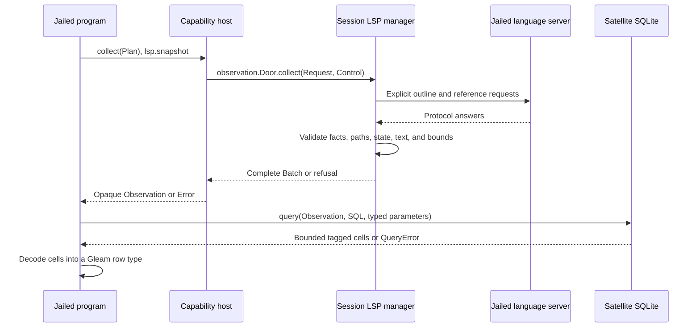

# SQL over finite LSP observations

`cap/lsp_sql` lets a code-mode program collect a bounded set of language-server
facts, then join and aggregate those facts inside its satellite. The collection
names one configured server, one project root, explicit outline files, and
explicit reference targets. Reusing the returned observation for several SQL
queries makes no further language-server requests.

For installation and examples, see the [usage guide](../lsp-sql.md). The
[design note](../design-notes/lsp-sql.md) records the API and motivation, and
[protocol-change/062](../../protocol-change/062-lsp-sql-observations.md) records
the separate observation contract. The ordinary tools and `cap/lsp` keep their
existing [LSP door](lsp.md).

**Integration status:** focused collection, routing, decoding, and cancellation
tests have passed. The complete design-note example has compiled warning-free.
Native package publication, final dependency pins, the cold offline seed, and
the real jailed end-to-end run are pending. These checks remain separate from
the architectural properties described below.

## The execution boundary

Only collection crosses the capability channel. `collect(Plan)` calls
`lsp.snapshot`; the harness decodes the plan, admits the scope, and asks the
session's existing jailed language server. It returns facts and provenance to
the program. `query` then builds a fresh private in-memory SQLite database and
evaluates model-supplied SQL inside the jailed satellite. SQL never runs in the
harness VM.



The [public API](../../packages/cap/src/cap/lsp_sql.gleam) keeps `Observation`
opaque. The program can query it and read its metadata, but cannot construct or
mutate its facts. Each successful `QueryResult(a)` carries column names,
decoded rows, and the unchanged metadata beside those rows. A narrow SQL
projection therefore retains its evidence even when it omits every provenance
column.

The public operations are:

```gleam
collect(Plan) -> Result(Observation, Error)
metadata(Observation) -> Metadata
query(Observation, String, List(Cell), RowDecoder(a))
  -> Result(QueryResult(a), QueryError)
```

The [router](../../packages/codemode/src/codemode/observation.gleam) spends one
of four capture admissions before servicing a valid capture. That ceiling
belongs to the invocation in both satellite host shapes. Conditional host
wiring admits `cap/lsp_sql` only where the LSP and observation doors are
present; an import alone does not create a server or widen filesystem access.

## Collection owns a finite scope

The new [observation door](../../packages/lsp/src/lsp/observation.gleam) is
separate from the frozen `lsp/query.Door`. It accepts at most sixteen outline
files and thirty-two reference seeds. Every seed names a file and a symbol;
an optional one-based line narrows resolution. An empty plan is refused.

The [manager](../../packages/client/src/client/lsp/manager.gleam) admits every
requested source to the selected server and canonical project root before
semantic work begins. It reuses the existing document synchronization and
readiness paths, including readiness checks on a warm server. A seed with a
line resolves against its admitted text. A seed without a line can require a
document-symbol request; that request spends the same semantic request budget
as an outline or references request.

The collector neither searches the workspace nor expands an outline into
reference requests for all of its symbols. It also skips reference-container
enrichment, which would add hidden outline requests. References retain the
server's raw admitted locations and their explicit target identity. Existing
reference requests include declarations; a query interested in another file
must express that filter itself.

Every returned path passes admission before the harness reads it. A withheld
reference contributes to the metadata's `withheld` count and produces no
document or site row. Previously opened documents are admitted again before
resynchronization reads them, so an old open-document entry cannot bypass a
later path refusal. Coordinates must round-trip through the exact text;
malformed lines or UTF-16 positions refuse publication instead of being
clamped into a plausible site.

## Four tables, two independent identities

The native bridge creates only these tables. IDs belong to one observation.
Paths are canonical admitted absolute paths. Site lines and codepoint columns
are one-based; `text` is the source line, and `anchor` is its hashline anchor.

| Table | Columns | Meaning |
| --- | --- | --- |
| `documents` | `path`, `digest`, `version` | Texts read to construct admitted facts. |
| `symbols` | `id`, `parent_id`, `name`, `kind`, `detail`, `path`, `line`, `column`, `text`, `anchor` | Flattened outlines of the explicitly requested files. |
| `targets` | `id`, `symbol`, `asked_path`, `asked_line`, `path`, `line`, `column`, `text`, `anchor` | Each requested reference seed and its resolved site. |
| `"references"` | `target_id`, `path`, `line`, `column`, `text`, `anchor` | Admitted reference locations returned for those seeds. |

`symbols.parent_id` joins to `symbols.id` to recover an outline hierarchy.
`references.target_id` joins to `targets.id`. There is no implicit relationship
between a symbol ID and a target ID, even when their sites match. An outline
row says that a symbol was outlined; a target row says that its references
were requested. Joining those IDs would invent collection coverage.

`digest` is a SHA256 content address of the document text. `version` is the
client's internal document version when it held that exact text. A reference
file first discovered in an answer may be read without being opened in the
client, in which case its version is SQL `NULL`. Optional parent IDs, symbol
details, and requested lines also use `NULL`. Quote `"references"` because
`REFERENCES` is a SQLite keyword.

## A checked interval, with explicit limits

The [protocol actor](../../packages/lsp/src/lsp/client.gleam) exposes one atomic
observation of its incarnation, document revision, analysis activity, retained
failure state, busy work, and synchronized texts. After admitted
synchronization, the collector takes that state as its baseline. Before
publication, it checks the state again, resolves requested aliases again, and
rereads admitted fact documents. Restoring identical text after a client edit
still advances the revision, so that change is detected.

Detected changes, busy or failed analysis, unsupported requests, malformed
locations, and exceeded limits refuse the whole collection. A bounded result
is either complete for the collected answers or an error; the collector never
labels a truncated set as successful. The opaque generation identifies the
client incarnation without exposing a VM process identifier.

These checks describe a finite interval over observed documents and client
state. LSP offers no transaction that freezes the whole project. Unobserved
dependencies can change without detection, and a reference document first
discovered in an answer is checked from its read through publication. The
metadata therefore records evidence for the retained facts, rather than a
project-wide transaction or a certificate of semantic completeness.

Metadata retains the configured server, canonical root, generation, monotonic
start and finish times, answered outline paths, requested reference seeds,
semantic request count, withheld count, fact count, and conservative byte
count. Monotonic times describe elapsed collection time; they are not calendar
timestamps or stable identifiers across host restarts.

An anti-join over `targets` and `"references"` can establish that no admitted
reference was returned for a requested seed. It cannot establish that an
outlined function is unused. Even a zero withheld count leaves server omissions
and unseen dependency changes outside the guarantee. The aggregate withheld
count also cannot identify which target lost a location.

## Typed rows and refusals

`Cell` preserves SQLite storage classes as `Null`, `Integer`, `Real`, and
`Text`. Parameters use those same tags and native binding. Signed SQLite
integers remain integers; `NULL`, empty text, and absent rows remain distinct.
Blob results, invalid UTF-8 text, and non-finite real values are refused.

`RowDecoder(a)` is a program-owned function from `List(Cell)` to
`Result(a, String)`. It runs in the satellite after native query evaluation.
Its `a` gives successful rows a Gleam type; arbitrary SQL still receives
runtime syntax, policy, and storage-class checks. A mismatched projection
returns `DecodeFailed` with a zero-based row index and the decoder's reason.
No partial decoded list is returned.

Capture errors distinguish invalid scope, detected change, collection limits,
deadline, admission ceiling, semantic query failure, and unavailable or
malformed answers. SQL errors distinguish authorization, extra statements,
invalid SQL or parameters, resource limits, cancellation, unsupported values,
native unavailability, and decoding. Unknown host and native refusals preserve
their code and message through `Denied` and `SqlRefused`.

## SQLite enforces the SQL policy

The [native bridge](../../packages/cap/src/loom_cap_lsp_sql.erl) privately owns
the connection and the trusted loading statements. It creates the fixed schema,
inserts facts with bound parameters, and finalizes those statements before
model SQL begins. Model code receives neither the database handle nor the
trusted insert path.

The extended existing SQLite binding installs an authorizer before preparing
model SQL. It remains installed through stepping and statement finalization,
including SQLite's automatic reprepare path. The allowlist accepts reads of
the four main-schema fact tables and a small set of pure functions such as
`count`, `sum`, `coalesce`, `lower`, and `like`. Every other authorization action
is denied. SQLite's [authorizer documentation](https://www.sqlite.org/c3ref/set_authorizer.html)
describes this prepare-time policy hook and its reprepare requirement.

The boundary also checks `sqlite3_stmt_readonly`, disables extension loading,
uses defensive mode and an untrusted schema, refuses virtual tables during
prepare, keeps temporary storage in memory, and forbids attached databases.
SQLite parses the statement tail so comments and whitespace are accepted while
a second executable statement is refused. Writes, pragmas, schema inspection,
attachment, unapproved functions, and recursive SQL are refused. A
[read-only statement check](https://www.sqlite.org/c3ref/stmt_readonly.html)
alone would be insufficient: SQLite classifies some operations with external
effects as read-only.

Progress callbacks enforce the approximate operation budget, monotonic deadline,
and calling-process liveness during native work. SQLite's
[progress handler](https://www.sqlite.org/c3ref/progress_handler.html) runs
periodically, so cancellation takes effect at a check rather than promising
instant preemption. The bridge closes the private connection in an `after`
block; the native boundary finalizes its statement and clears callbacks before
that close.

## Budgets compose with invocation custody

| Boundary | Fixed maximum |
| --- | --- |
| Capture admissions | Four per code-mode invocation, including admitted captures that later fail. |
| Explicit scope | Sixteen outline files and thirty-two reference seeds under one server/root. |
| Collection | 128 semantic requests, 10,000 total table rows, 4 MiB of retained text/facts, and 75 seconds narrowed by the invocation deadline. |
| SQL input | 16 KiB SQL, sixty-four parameters, and 128 KiB per text parameter/value. |
| Native prepare and step | Two seconds and one million progress-counted operations per query. |
| SQL output | Thirty-two columns, five hundred rows, and 1 MiB including column names and conservative cell overhead. |
| SQLite allocations | A process-global hard heap ceiling of at most 32 MiB inside the satellite. |

The semantic request budget includes resolver and outline requests.
Initialization requests and lifecycle/document synchronization notifications
are outside this semantic count. The fact
byte count includes retained source texts and conservative row overhead. It
describes collection accounting rather than an exact BEAM heap measurement.

The SQLite heap ceiling is lowered before trusted materialization and is never
raised or restored by a concurrent query. SQLite documents the
[hard heap limit](https://www.sqlite.org/c3ref/hard_heap_limit64.html) as applying
across all connections in one process. Here that means the satellite process,
not the harness. Database loading, the Gleam decoder, repeated queries, and
other program work remain under the enclosing invocation's resource and wall
limits. The two-second SQL limit therefore does not bound the entire public
`query` call.

The [satellite host](../../packages/codemode/src/codemode/satellite.gleam)
publishes a weft cancellation signal before spawning a scoped capture service.
The service watches host death and the invocation deadline. Program
cancellation and resident-invocation release cancel the same signal. The
collector owns its narrower deadline and watches its caller's death.

Pending LSP requests monitor their reply owner. When that owner exits, the
protocol actor removes the pending request ID and sends `$/cancelRequest`;
later fanout and publication stop. The shared language-server lease remains
alive for other callers. A third-party server can ignore the notification, so
local cancellation establishes ownership and withdrawal rather than proving
that the server stopped computing.

## Verification paths

[Collector tests](../../packages/client/test/client/lsp/observation_test.gleam)
exercise admission, target resolution, request accounting, withheld paths,
document changes, malformed coordinates, busy/failure/unsupported responses,
collection limits, deadlines, and caller death against a fake protocol server.
[Actor metadata tests](../../packages/lsp/test/lsp/observation_state_test.gleam)
check incarnation identity and restored-text revision changes. Routing and
public API tests cover the wire contract, typed decoding, and scoped service
custody. Real-server jailed tests and cold dependency preparation provide the
remaining integration evidence; a focused test pass cannot substitute for
those runs.
