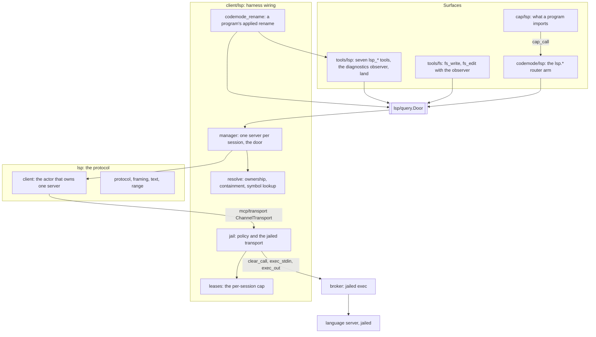

# Language servers

A language server is a long-lived process that knows a codebase the way
its compiler does. Asked over JSON-RPC on its stdin and stdout, it
answers where a name is defined, who refers to it, what type it has, and
what a rename would change. It also reports, unasked, whether the code
still compiles. Loom runs one such server per session, inside the jail,
and puts its answers in front of the model in three places: seven
`lsp_*` tools, a diagnostics block appended to every `fs_write` and
`fs_edit` result, and the `cap/lsp` module a code-mode program can
import.

Two decisions shape the rest of this document. **The server is a jailed
lease**: it is cleared once through the broker's ordinary jailed exec and
held for the life of the session, like an extension host. **The model
addresses symbols, never positions**: every question names a symbol as
code spells it, and every answer comes back as a line the model can edit
without reading the file first. `docs/adr/013-language-servers-as-jailed-leases.md`
is the ruling, with the measurements it rests on. This document is how
the code carries that ruling out.

## Why a language server

Before this work the agent edited by hashline anchor (`fs_read` prints
each line with a short content hash, and `fs_edit` refuses an edit whose
anchor no longer matches) and found code by `grep`. Both know text and
nothing else. Neither can say which of forty `init` functions a call
reaches, or whether an edit broke a file the agent never opened.

Loom's agent does not work only on Gleam. It works on Go, Rust and
anything else a workspace holds, so the semantic channel has to be
language-neutral. The tools that already understand Loom's own code —
the compiler's package-interface export, the `glance` walker behind
`make lint`, the search index — understand Gleam and nothing else. The
language server is the one channel every language already ships, and for
most languages it is the only oracle for types. Loom therefore speaks the
Language Server Protocol (LSP) and brings no language knowledge of its
own. `gleam lsp` and `gopls` appear throughout this document because
they are the two servers the design was measured against, not because
Loom knows them: Loom ships no server table, and a server exists only
because an operator configured one.

What a language spells differently is data, not code. Two facts that
used to be hard-wired defaults are now keys of a server's table, its
**language profile** (`docs/adr/014-language-profiles.md`), and each
key's default is exactly the behaviour it replaced, so a table written
before the keys existed means what it meant:

- **The `languageId` a document is opened with** is `language_id`,
  defaulting to the server's first extension without the dot (`gleam`,
  `go`). That is right for most languages and wrong for some (`.ts` is
  `typescript`), and a profile now says so.
- **A qualified symbol** is split on `qualifier_separators` (default
  `.`), and its qualifier must end the definition's file path without
  its extension, or its directory, once `module_case` has mapped it
  (default: as written). That fits Gleam modules, Go packages, Python,
  Java and TypeScript by default; Rust's and C++'s `::` is
  `qualifier_separators = ["::"]`, and Elixir's `MyApp.Accounts` in
  `my_app/accounts.ex` is `module_case = "snake"`.

One assumption is still the harness's own, and it is about the release
rather than any language: **the bare command `gleam`** resolves to the
toolchain code mode located rather than to `PATH`, so the compiler
analysing a project is the one that builds its programs.

## One door, every surface

All three surfaces ask through one record of closures, `lsp/query.Door`.
The `lsp_*` tools call it, the write tools' diagnostics observer calls it,
and code mode's router calls it. The session's language-server manager
fills it. One door means one symbol-resolution rule, one document-sync
rule and one server per session, whichever surface asked. A code-mode
program is not a second client of the server; it is a second caller of
the same door.

The work is split across five places, layered so that nothing above the
protocol package holds an LSP position and nothing below `client` touches
the broker:



**`packages/lsp` is the protocol and the vocabulary.** `lsp/range` holds
the server's own coordinates (zero-based lines, columns counted in UTF-16
code units). `lsp/query` holds the harness's vocabulary and the `Door`
contract, and is types only. `lsp/framing` is the pure `Content-Length`
framer, working on bytes because the header counts bytes. `lsp/protocol`
holds total decoders for every structure consumed, the advertised-
capability gate, and the answers to the server's own requests. `lsp/text`
is the one place a server position becomes a line and codepoint, and the
one place a server's text edits are applied. `lsp/client` is the actor
that owns one server: a `weft/state_machine` over `mcp/transport`, which
runs the handshake, gates every request, syncs documents, stores
diagnostics and decides when they have settled. The package reuses three
things from `mcp` — the JSON-RPC envelope, the transport seam and the
monitored try-call — and never imports `broker`. `packages/lsp/CLAUDE.md`
is the dense reference.

**`client/lsp` is the harness wiring.** `client/lsp/manager` is the
session's one manager and the door's implementation. `client/lsp/resolve`
is the part of the door that is judgement rather than process: which
server owns a path, whether the path is contained, how a qualified symbol
splits, which outline entry contains a reference. `client/lsp/jail`
builds the server's sandbox policy and the transport that carries its
bytes through the broker. `client/lsp/leases` caps how many helpers
session-lived servers may hold. `client/lsp/codemode_rename` composes a
program's applied rename out of pieces that live in three packages.

**The surfaces are thin.** `tools/lsp` decodes tool arguments into an
`lsp/query.SymbolQuery`, calls the door and renders the answer.
`codemode/lsp` does the same into the msgpack shapes `cap/lsp` decodes.
`cap/lsp` is the typed module a program imports; like every prelude
module, its functions are stubs that send a `cap_call`.

## The jailed lease

A language server runs project code in effect. `gleam lsp` compiles the
project, `gopls` loads packages, and other servers run build scripts and
macros, all from a toolchain the model can edit. Rule Zero (no
model-influenced code in the harness VM) therefore puts the server in the
jail. The broker's ordinary jailed exec is enough to hold it there: the
JSON-RPC bytes ride inside `exec_stdin` and `exec_out` like any command's
input and output, which is what spec Part 1.4 asks of an LSP adapter. No
new frame, no helper change and no FFI was needed. What makes a server
different from a command is only its lifetime: it is cleared once and
lives until it exits.

### The policy

`client/lsp/jail.policy_for` turns one `[lsp.<name>]` table, the project
root a file was found in, and the session's base policy into the lease
base and the requirements the clearance is judged under. The operator's
table is the only thing that widens it; nothing the model supplies does.
The requirements ask for:

- the project root, readable, and writable only when the table says
  `project = "writable"` (Gleam's server writes `manifest.toml` and
  `build/`; `gopls` writes nothing there);
- the table's extra `readable` and `writable` roots, such as the Go
  module cache and build cache;
- the directory holding the server's executable, and never an install
  prefix, because a prefix such as `~/.cargo` would put
  `credentials.toml`, a registry token, inside every server's jail, where
  a build script or proc macro the model wrote could read it and return
  it through a diagnostic. A symbolic link is resolved rather than
  widened: `jail.locate` follows the chain (at most `max_link_hops`, 32,
  and a loop, a dangling link or a chain ending at a non-file is refused
  by name), resolving relative link text against the link's own
  directory, and `jail.regions` mounts the directory of the link and of
  every file it leads through. rustup's `~/.cargo/bin/rust-analyzer ->
  rustup` mounts `~/.cargo/bin` alone, and `/bin/sh -> dash` mounts
  `/bin` and, on a merged-`/usr` host, `/usr/bin`. The link reader is the
  one `tools/fs` already owns (`tools_ffi:read_link/1`), so no new FFI
  was taken. Because the mounts now follow where links point, a link the
  server can rewrite would let it choose a mount: a lease is refused when
  any hop that is itself a link lies at or under a path the server
  writes (a writable project root, the scratch directory, a `writable`
  root), telling the operator to name the file it points to in
  `command`. The file the chain ends at may still sit there, as a plain
  `node_modules/.bin` executable does, since its own directory widens
  nothing; and judging at resolution is enough, since a link rewritten
  later points outside what was mounted and fails to execute. Each region is an explicit read-only mount, and the helper
  lays explicit mounts over every root, so a region at or above a path
  the server writes — the link's own directory or a target's — is refused
  by name rather than left to turn that path read-only. `/bin/sh` is the
  case that found that check, under the prefix rule this replaced: its
  prefix was `/`;
- a private scratch directory as `TMPDIR`, since the jail replaces `/tmp`;
- network off, refused if narrowed (`RefuseNarrowed`);
- `PATH`, `HOME`, `TMPDIR` and the table's `env` names, and no other
  environment.

Limits need care. A one-shot command has a wall-clock limit, a CPU limit
and an output cap, and a server must have none of them: the wall would
kill it mid-session, and the output cap would cut its JSON-RPC stream
mid-frame hours in. Limits compose by meet, with zero meaning unlimited,
so a zero in the requirements against a non-zero base is a narrowing,
and `RefuseNarrowed` refuses it. The zeros must therefore sit on the
base. `broker/policy.session_lease` builds that base for both kinds of
lease. Its `LeaseOutput` argument is `OutputIsLog` for an extension host,
whose stdout is a log the cap may bound, and `OutputIsWire` for a
language server, whose stdout is its protocol. The requirements then
restate the zeros literally rather than deriving them, so a base that
kept a cap is a refusal at clearance rather than a server that goes mute
hours later. What bounds the lease instead is the pooled budget deadline,
twelve hours out, as for extension hosts.

### The transport

`client/lsp/jail.transport` is an `mcp/transport.ChannelTransport` whose
`connect` starts a relay. The relay acquires a lease, clears the call
through `broker.clear_call`, and turns broker events into transport
events. A stdout chunk becomes data. The settlement becomes a close,
carrying the exit and the tail of the server's stderr. A truncated
stdout chunk is fatal, because once bytes are missing the stream is no
longer JSON-RPC. Stderr is only a log: it drains into an 8 KiB ring that
colours the closing reason, and it is never fatal. `lsp/client.start`
accepts only a channel transport, because a port transport would run the
server outside the jail.

### Demand, and the enforcement probe

The server clears under the session's own `EnforcementDemand`, the demand
`bash` clears under. That is platform enforcement by default and
best-effort only where an operator opted a development container into
it. A language server is no more trusted than the shell beside it, and
no less.

Demand alone does not prove anything about a lease. Under platform
enforcement the helper reports what it actually enforced in the
execution's exit report. For a one-shot command that report arrives
before its output is trusted. A server, though, answers queries for
hours before it exits, and a lease must not learn that it ran unjailed at
the end of its life. So before a server starts, the manager clears a
trivial probe (`/bin/sh -c 'exit 0'`) under exactly the server's policy
and the session's demand, and starts the server only if the probe settles
undegraded. A degraded probe refuses the server as `NoServer`, naming
what the helper could not enforce. The cost is one short exec per server
start.

### One server per session, under a lease cap

Each assembled session starts its own helper pool and broker, and the
pool is small on purpose: it clamps to between four and sixteen helpers.
The rest of the session still needs it. A `bash` call borrows a helper,
a code-mode satellite holds one for its whole run, and each capability
call that satellite makes borrows another while the satellite waits. A
lease that took any of those three would turn an ordinary code-mode run
into a wait that ends in a refusal.

Two rules follow. The manager runs **at most one server per session**.
And `client/lsp/leases` caps session-lived leases at `pool_size − 3`; a
server asked for at the cap is refused as `NoServer` with a sentence
naming the cap, rather than queued behind helpers that may never come
back. With one server and a pool of at least four, the cap cannot bind
today. It is the guard for a second server, or for extension hosts
counted against it later (they hold session-lived helpers too, and are
not counted yet), and it is tested at the minimum pool size. The cap is
per session because the pool is. ADR-013's review assumed a daemon-wide
pool; measuring the boot path showed otherwise, and the ADR carries the
correction.

A lease is released when the broker says the server's execution settled,
which is the moment the helper is back in the pool. The leases actor
also monitors every holder, so a relay that crashes gives its lease back
without anyone having to remember to.

### Eviction, death and restart

The manager actor holds only small state: which server is running or
starting, the callers waiting on a start, and the paths the running
server holds open. It never reads disk, never talks to a server and never
waits. A start takes seconds — a handshake plus a project load (`gopls`
answered its first query 1.8 s cold) — so each start happens in a
**keeper**, one process per server start. The keeper waits for the
previous server's keeper to finish stopping, runs the probe, starts the
`lsp/client` actor, re-opens the documents a dead predecessor held, and
reports. Every caller who asked in the meantime is a waiter in the
manager's state, answered once when the keeper reports: one start,
however many callers.

A query about a file that another server or another project root owns
**evicts** the running server. Its keeper is told to stop it gracefully,
and the new keeper waits for that exit before starting anything, so two
servers never hold the session's leases at once. A server that dies is
not restarted eagerly. The next query starts it again and re-opens its
documents, and the answer that paid for the start says so: the tools
prefix it with "started the gleam language server for this query; later
queries are fast", because a model reading a slow answer would otherwise
take it for a hang.

Stopping is `shutdown`, then `exit`, then stdin EOF, with
`broker.abort_step` as the backstop. Every language server of a session
clears under one attribution-only operation, so an operator's abort of a
model run does not reach it, and each server gets its own step,
`lsp/<server>/<root-digest>`, so aborting a step stops exactly one
server.

### No backpressure, so nothing blocks

The relay forwards every stdout chunk as a message, and `broker.stdin` is
a cast. Nothing on this path pushes back on a fast writer, so nothing
that owns a mailbox on it may block. The `lsp/client` actor never reads
disk and never waits inside a handler; every wait is a pending entry
plus a timer in its state. The door's closures run in the **caller's**
process: they ask the manager for the live client, then do the disk
reads, the resync, the requests and the conversion to sites themselves.
A slow query holds up only the caller who asked it.

## Addressing by symbol

LSP is built around documents and positions because an editor always
knows its cursor. An agent does not, and asking it for a zero-based
UTF-16 offset is asking it to be wrong. Every tool and capability
therefore takes a **symbol name**, optionally narrowed by a `path` and a
1-based `line` exactly as `fs_read` prints it. The door resolves the
position:

- `path` + `line` + `symbol`: the first occurrence of the identifier on
  that line, matched on identifier boundaries, so `foo` does not match
  inside `foo_bar`. The boundary rule is deliberately language-neutral:
  anything above ASCII counts as an identifier character, which errs
  toward "not found" rather than a wrong position.
- `path` + `symbol`: the file's outline (`documentSymbol`), searched by
  name.
- `symbol` alone: a bounded, whole-word, literal `rg` over the server's
  root, run in the server's jail and restricted to its extensions (at
  most 200 hits in 50 files, four per file), then `definition` at each
  hit, deduplicated by definition site. Hits inside strings and comments
  resolve to nothing and fall out.

A symbol may be **qualified** the way code reads it: `probe.greet`,
`util.Greet`, `pkg/mod.name`, or `util::greet` for a server whose
profile lists `::`. The symbol is split on the owning server's
`qualifier_separators`, longest first, so it is split only once a server
is known: the path's owner, or each server in turn for a bare name. The
last segment is the identifier. The qualifier is the segments before it
joined with `/`, keeping a `/` written inside one as a path, and it keeps
only definitions whose module path or directory ends with it on segment
boundaries, or whose outline parent chain does. Under `module_case =
"snake"` the module-path comparison maps each segment to snake_case
first (`MyApp` to `my_app`, `HTTPServer` to `http_server`); the parent
chain is the server's own spelling of a type and is compared as written.
A name that still reaches more than one distinct definition is answered
with the candidates, never a guess.

The answers are shaped to be the agent's next step rather than a report
to read:

- **Anchors.** Every site prints as `path:line:anchor|text`: a `grep` hit
  with the hashline anchor `fs_read` would have printed spliced in. The
  `line:anchor|text` tail is exactly an `fs_read` line, so a result feeds
  `fs_edit` with no read in between. A CRLF line keeps its carriage
  return in the site's text, because the hashline tools hash it as part
  of the line.
- **Containers.** Each reference carries the symbol whose body holds it
  (`other.twice`). That answers "who depends on this?", and it gives a
  one-level caller view on servers such as `gleam lsp` that offer no call
  hierarchy.
- **Counts first.** `lsp_references` states how many references in how
  many files before listing any, and lists at most 50, grouped by file
  and by container. A model then knows when to narrow a query or move it
  into code mode, where `cap/lsp` returns up to 200 items with the
  uncapped total beside them.

Every request is gated on what the server advertised in its `initialize`
answer. A measured server left an unadvertised request unanswered for
the whole 30 s it was watched, so a request the server does not offer is
answered `Unsupported`, naming the server and the request, and is never
sent. Every request that is sent carries a deadline (five seconds in
production); one that outlives it is answered `TimedOut`, cancelled on
the wire with `$/cancelRequest`, and its late answer dropped.

## Keeping the server's view honest

A language server answers about the documents it holds, not about the
disk. Loom syncs full text, never deltas, in two directions.

**Push.** A write that lands through `fs_write`, `fs_edit` or a rename is
reported to the door's `after_write`, which sends the new text as a
`didChange` (or `didOpen`) to the server that owns the file. `after_write`
never starts a server. An edit's result must not wait out a handshake and
a full compile, and an edit in one project must not evict the server
another project's queries are using. A write to a file whose server is
not the one running is therefore answered with nothing, and the next query
about it starts the server, which reads the file as it then stands.

**Pull.** Before every query, the caller re-reads every document the
server holds open, sends a `didChange` for each whose digest moved and a
`didClose` for each that vanished. This catches what push cannot: writes
by `bash`, by background jobs and by code-mode programs. The pull is not
a lock. Its race with a concurrent write is the one `fs_edit` already has
with `bash`, and tool concurrency closes it for tools: `lsp_rename` is
`Exclusive`.

**Open what a query touches.** It is tempting to leave documents the
server never opened to the server itself, which can read the disk.
Measured against `gleam lsp`, that is wrong: it answers `definition`
with nothing and outlines nothing for a file it was never sent. So the
manager opens the files a query is about to touch — the hit files of a
bare-symbol search, and the referencing files whose outlines give
references their containers (at most 32, half the open bound, so one
wide answer cannot evict everything else the server holds). At most 64
documents are open at once, least recently synced closed first.

**Containment.** A file is owned by the configured server whose
`extensions` include its extension, rooted at the nearest ancestor that
holds one of that server's `root_markers`. Its *real* location, every
symlink resolved, must then lie under the root's real location. bwrap
binds the root at its own path, so a symlink leading out of it names a
file the jailed server cannot read, and asking about it would produce an
answer about nothing. Such a path is refused as `NoServer` before any
request is sent, and the server is thereafter addressed only by real
paths.

### Readiness

A server may answer while it is still loading its project, and
`rust-analyzer` does, with empty results rather than errors: measured,
`definition` came back `[]`, `references` held only the declaration,
`hover` found nothing, and a rename edited one file of the two that
needed it. `gopls` and `gleam lsp` hold a request until they can answer
it, so they never showed this.

Readiness is a mechanism rule over standard work-done progress, not a
per-server key. The `initialize` request declares
`window.workDoneProgress`, and the client actor tracks the set of active
`$/progress` tokens: `begin` adds one, `end` removes it, a `report` for
a token it never saw begin adds it, a malformed notification is dropped,
and at most 64 are held. `lsp/client.ready(quiet_ms:, deadline_ms:)`
answers `Quiet` once no token has been active for a continuous
`quiet_ms`, measured from the later of the call and the last token's
end, or `StillBusy` with the active titles at the deadline. Like
settlement, it is a waiter and timers in actor state.

Only the query that starts a server asks, after the pull. It waits a
300 ms window (`Timing.quiet_ms`), because the server may not have begun
reporting when `initialized` is sent, and then for every token to end. A
server still busy at `Timing.ready_ms` (a minute) is answered
`Unavailable`: "the language server is still loading (Indexing); ask
again in a moment", never an empty answer, and is left running.

A warm query never waits, for two reasons. The measured empty answers
were a load-time problem: a warm server re-indexing after an edit
answers from its previous state, which is its normal behaviour and what
every editor's client sees. And a server that begins a token and never
ends it would otherwise stall every later query for the whole minute;
as it is, the leak costs one "still loading" answer at start, and the
next query, being warm, proceeds. Diagnostics, `after_write` included,
do not wait either: settlement has its own two rules and bound. A server
that reports no progress costs one 300 ms window after its start and
nothing after.

Measured through the jailed manager on a two-file crate,
`rust-analyzer`'s first progress began 4 ms after the manager asked, well
inside the window; the longest gap between one token's end and the next
one's begin was about 100 ms; and the load went quiet 3.45 s after the
handshake began, the first answer following 300 ms later. Asked with no
window after the start, the same question answered `[]`.

## Settled diagnostics

After a write, the model should learn whether the code still compiles,
and should never be told it is clean when the server simply had not
finished. Both halves turn out to be harder than they look, because the
two measured servers disagree about everything a client could wait on:

| After a `didChange` | `gleam lsp` 1.18.1 | `gopls` |
|---|---|---|
| `publishDiagnostics` carries a `version` | no | yes |
| a clean → clean edit publishes | nothing | a versioned empty list |
| publications, relative to the answer of a request sent after the change | **before** it, for every affected file | **after** it |

"Wait for diagnostics at version N" never completes on `gleam lsp`,
which versions nothing and publishes nothing for a file that stays clean.
"Send a request and wait for its answer" is a barrier on `gleam lsp` and
not on `gopls`, whose publications arrive afterwards. So settlement takes
two rules, and both must hold:

1. **The barrier has answered.** After a change, the client sends
   `documentSymbol` on the changed file. On `gleam lsp` every publication
   the change caused has arrived by the time it answers.
2. **Versioned servers have caught up.** If this server has ever
   published a `version`, then for every changed open document a
   publication at a version at least the one synced has arrived.

A server with no `documentSymbol` settles by the second rule alone, so
one that neither answers the barrier nor versions its publications never
settles. The wait is bounded at 1.5 s. Every file published between the
change and settlement is collected, since breaking `a.gleam` usually
breaks `b.gleam` too, and the rendered block lists at most 20 diagnostics
under a count of all of them.

The answer is a two-variant type, `Settled | Unsettled`, rather than a
list and a flag, because the two are different claims. `Settled([])` is
clean code. `Unsettled([])` is only that nothing had arrived, and every
surface renders it as "did not settle", never as clean.

With a door present, `fs_write` and `fs_edit` are built with
`tools/lsp.diagnostics_observer`, and a landed write's result gains the
settled-diagnostics block after the fresh-anchor block. The first two
lines of the result never move. Without a door they are the plain tools,
byte for byte. The measured servers settle in milliseconds, so the 1.5 s
is paid only by a server that never does.

## Rename

A rename is where a language server earns the most and where it could do
the most damage, so the server computes and Loom writes. A server's
`workspace/applyEdit` request is always answered `applied: false`, the
`initialize` request declares that the client cannot apply edits, and a
`WorkspaceEdit` that creates, renames or deletes a file is refused whole.

The door's `prepare_rename` asks the server (`prepareRename` where
offered, then `rename`) and hands back, for each file, the text the
server saw and the text after its edits. It writes nothing. For an open
document the base is the last text sent, which the pull just made the
disk text, so full-text sync makes it the server's exact view; a file in
the edit that is not open is read now. **Every edit's range must select
exactly the old identifier** in its base. A stale position fails that
check at no cost. The server's positions are converted by `lsp/text`, and
a position that falls between the halves of a surrogate pair is refused
rather than rounded, because rounding would move an edit onto a
neighbouring character and still apply.

`tools/lsp.land` then lands the files, in three passes. First, each
file's before-and-after pair becomes an ordinary hashline plan bound to
the base's digest (`tools/hashline.plan_between`). Then every target is
resolved and every file on disk is compared with the text the server
saw. Only then is anything written, file by file, through
`tools/fs.land_plan`, the path `fs_edit` takes. A file changed since the
server looked is refused as `StaleContent`, exactly as a stale `fs_edit`
is, and a failed check on any file stops the whole rename before the
first byte is written.

The landing across files is still not atomic: a write can fail after
another has landed. The report says per file what landed, what was
rejected and what was not attempted, each landed file is pushed to the
server, and the settled diagnostics that follow expose a half-landed
rename at once. A server's own refusal ("would make it unexported", in
`gopls`'s words) reaches the model verbatim.

The tool previews by default. `lsp_rename` with `mode: "preview"` shows
every changed line before and after, with anchors, and writes nothing;
the model applies with `mode: "apply"` what it has seen. The read-only
tools are replay-`Safe` and `Concurrent`; `lsp_rename` is `Never` and
`Exclusive`.

## Code mode

A tool answers one question per call. A program composes them, and the
composition is the point. "Every definition in this file that is used
from another file" is one outline and a loop of reference queries, and no
single tool offers it:

```gleam
import cap/lsp
import gleam/list
import gleam/result

pub fn used_elsewhere(path: String) -> Result(List(String), lsp.LspError) {
  use outline <- result.try(lsp.outline(path))
  Ok(list.filter_map(outline, fn(entry) {
    use found <- result.try(lsp.references(lsp.symbol(entry.name) |> lsp.in(path)))
    case list.any(found.items, fn(reference) { reference.site.path != path }) {
      True -> Ok(entry.name)
      False -> Error(lsp.NotFound(entry.name))
    }
  }))
}
```

`codemode/lsp.routing` serves the seven names — `lsp.definition`,
`lsp.references`, `lsp.hover`, `lsp.outline`, `lsp.calls`,
`lsp.diagnostics` and `lsp.rename` — as `ServedHere`, the way
`client/mcp.routing` serves `mcp.<server>`. The server is already
running, jailed, under a lease the session holds, and a query is a
message to it over a channel the harness owns, so there is no process to
spawn and no policy to compose. The door's request deadline and the
host's call timeout bound a call.

Failures travel on two channels. A refusal that is only a sentence
(`NoServer`, a server's refusal, `Unavailable`) is an in-band denial with
a code and a message. The three that carry structure a message cannot —
`NotFound`'s symbol, `Ambiguous`'s candidate sites, `Unsupported`'s
server and request — travel as an answer tagged `unresolved`, because the
harness looked and the looking is the answer.

A program's rename previews in the router, which diffs the door's base
and edited texts and needs nothing more. Apply is composed elsewhere,
because it needs write authority the router must not hold.
`client/lsp/codemode_rename` builds it per execution out of the door's
`prepare_rename`, the same `tools/lsp.land` the tool uses, and the write
boundary a program's `cap/fs.write` is held to: the execution's
workspace, its approved writable roots and its protected paths. A
protected path such as `.git/hooks` is refused to a rename for the reason
it is refused to `fs.write`.

**Admission is conditional, and the reason has a price.** `cap/lsp` is on
no static allowlist. Every module on a static list has its type surface
rendered into the `code_mode` tool description, and the description is
part of the cached prefix every provider request pays for. The reshaped
`cap/lsp` surface is about 5.6 KB of generated text in
`tools/prelude.type_surfaces` (the positional stub it replaced was about
1 KB). Most sessions configure no language server, and there it could
only refuse. So `client/codemode.over_lsp` admits it per host, the way
MCP façades and `cap/notes` are admitted: with a door present, the
allowlist, the description, the advertised capabilities and the router
arm all gain it; without one, a program that imports it is refused at
vetting with a reason naming it, rather than at its first call.
Extensions and resident hooks never see it.
`codemode/vet/policy.harness_only_cap_modules` records the exclusion so
the prelude gate knows it is a decision rather than an oversight.

## Configuration

Servers are configured, never discovered or installed. Each is an
`[lsp.<name>]` table in `loom.toml`, and the table is the whole of what
the server's jail grants beyond its project. With no `[lsp]` table there
are no `lsp_*` tools, the write tools are unchanged, `cap/lsp` is not
admitted, and nothing is spawned.

```toml
[lsp.gleam]
command = ["gleam", "lsp"]
extensions = [".gleam"]
root_markers = ["gleam.toml"]
project = "writable"
hint = "Qualify a name with its module as imported: probe.greet, or pkg/mod.name for a nested module"

# gopls reads the module cache and writes the build cache and its own
# cache, all outside the project, so all are named here. Both caches are
# in the per-user cache directory, which <cache>/ names on every
# platform.
[lsp.go]
command = ["gopls"]
extensions = [".go"]
root_markers = ["go.mod"]
readable = ["~/go/pkg/mod"]
writable = ["<cache>/go-build", "<cache>/gopls"]
env = ["GOFLAGS"]
hint = "Qualify a name with its package name as imported: util.Greet"
```

Both tables are examples. Neither is built in, and a workspace that
wants neither configures neither.

`command` is an argv, never a shell string. Its head is resolved once:
an absolute path is taken as written; the bare name `gleam` is the
toolchain code mode located, so the compiler analysing the project is the
one that builds its programs; any other bare name is looked up on the
daemon's `PATH`. `extensions` are matched case-insensitively, and an
extension claimed by two servers is a configuration error naming both,
because a file with two owners has no well-defined view. `project` is
`"read-only"` by default. `env` names variables passed through from
the daemon's environment; the values never live in the file, and `PATH`,
`HOME` and `TMPDIR` are the harness's own.

`readable` and `writable` are absolute, `~/`-relative or
`<cache>/`-relative. Both relative forms are expanded at load time
against the daemon's own environment, never the jailed session's: `~/`
is its `HOME`, and `<cache>/` is its per-user cache directory, which is
`$HOME/Library/Caches` on macOS and, elsewhere, `$XDG_CACHE_HOME` when
the daemon was started with an absolute one, else `$HOME/.cache`. That
is the one fact a `gopls` table used to need per platform, and granting
the wrong cache leaves `go` unable to write, so `gopls` loads no
packages. A form whose place is unknown (no `HOME`) refuses that server
at boot, as does a relative path, a `..` component, or a bare `~/` or
`<cache>/`.

Four optional keys carry what a language spells differently. They make
the table a **language profile** (ADR-014), and each default is what
ADR-013 shipped before the key existed:

| Key | Default | What it says |
|---|---|---|
| `language_id` | the first extension without its dot | The `languageId` documents are opened with, `[a-z0-9][a-z0-9+._-]*`, at most 40 characters: `typescript` for `.ts`. |
| `qualifier_separators` | `["."]` | What a qualified symbol is split on, longest first: `["::"]` for Rust or C++. Each is non-empty, holds no whitespace, is not `/`, and is listed once. |
| `module_case` | `"as-written"` | `"snake"` maps each qualifier segment from CamelCase before it meets a path, as Elixir and Ruby lay modules out. |
| `hint` | none | One printable line, at most 200 bytes, telling the model how the language spells a qualified name. |

A `hint` is appended once, as a "Language notes:" block of `name: hint`
lines, to `lsp_definition`'s description, and nowhere else: every other
symbol-taking tool addresses symbols the same way, so one statement
reaches them all without paying for the text seven times in the cached
prefix. It is operator-approved text in the model's context, exactly as
an extension's tool description is. A session whose servers carry no
hint sees the description byte for byte as it was; `tools/lsp` pins
that with a test.

`client/lsp/profile` decodes the tables, and `client/catalog` hands it
the `[lsp]` table's entries. It is the one decoder, which an extension
that ships a profile will go through too (ADR-014 §1), and it is pure:
the daemon's `HOME` and cache directory reach it as `profile.Places`,
read by `client/serve`. `docs/examples/loom.toml` carries the annotated
version.

At boot, `client/serve` builds a session's language-server plane only
when a table exists: the leases actor and the manager, the latter
supervised with the session's other services. Nothing is spawned then.
The first query starts a server, after the probe, so a session that never
asks a semantic question never pays for a server.

## What is not built, and the known hazards

Each absence below is deliberate.

| Absent | Why | What would bring it |
|---|---|---|
| `workspace/symbol` | neither measured server needs it for symbol lookup, and `gleam lsp` never answers it; the bounded `rg` plus `definition` does the job for every server | a server whose `definition` cannot resolve from a text hit |
| Code actions, formatting, completion | each is an editor's convenience; an agent formats with the project's formatter through `bash`, and completion answers a question a model does not ask | a measured case where the model's edit loop needs one |
| A per-language program database | it would be language knowledge in the harness, which is what a language server exists to hold | nothing short of a design change |
| DAP (#26) | a debugger is a second long-lived stdio peer, and nothing builds it yet | #26; the shared peer seam is extracted then, not before |
| A shared `packages/peer` | it would move the one impure piece, the MCP port FFI, for a consumer that does not use it, to serve DAP, which does not exist | DAP landing as a real third consumer, as a single move commit |
| Discovery and installation of servers | a server's jail is built from its table, so an operator states what it needs | nothing; this is the trust decision |

**The helper's stdin mutex.** The exec helper writes a server's stdin
synchronously while holding the execution's mutex, and `Cancel` takes
the same mutex. A server that stops reading while its stdin pipe is full
therefore blocks cancellation as well as frame processing, until the
broker's three-second helper kill collapses the namespace. That is
bounded and costs one helper. It is recorded for the helper's owners,
not fixed here.

**Enforcement is reported at exit.** Under platform enforcement the
helper states what it enforced only when an execution exits, which for a
server is hours late. The probe answers it, at the cost of one short
exec per server start. A helper that reported enforcement at clearance
would make the probe unnecessary.

**What would prove the design wrong.** A server that needs the network
at query time, one that writes outside the roots its table declares, or
one that publishes neither before a barrier nor with versions. Each
fails visibly, as `NoServer` or as diagnostics that did not settle. The
first two are fixed in the server's table and the third by a quiet
window; none is a change to the mechanism.

## Where the code lives

| Path | What it holds |
|---|---|
| `lsp/range.gleam` | The server's coordinates: `Position`, `Range`, `TextEdit`, zero-based and UTF-16. |
| `lsp/query.gleam` | The harness vocabulary and the `Door` every surface calls: `SymbolQuery`, `Site`, `Diagnostics`, `QueryError`. Types only. |
| `lsp/framing.gleam` | The `Content-Length` framer over bytes, bounded before it buffers. |
| `lsp/protocol.gleam` | Total codecs, the advertised-capability gate, answers to server requests, `file://` conversion. |
| `lsp/text.gleam` | UTF-16 ↔ codepoint conversion, identifier-boundary lookup, and pure edit application. |
| `lsp/client.gleam` | The actor that owns one server: handshake, gated requests, sync, diagnostics store, settlement, readiness, stop. |
| `client/lsp/manager.gleam` | One server per session, keepers, eviction, restart, the probe, the bare-symbol search, and `door`. |
| `client/lsp/resolve.gleam` | Ownership, containment, qualified symbols (per-server separators and module case), outline lookup, containers, display paths. |
| `client/lsp/profile.gleam` | The one `[lsp.<name>]` decoder: `LspServer`, `LspPath`, `ModuleCase`, `Places`, the extension-ownership check, `expand_path` and `cache_place`. Pure. |
| `client/lsp/jail.gleam` | `policy_for`, executable location and mounts, and the jailed `ChannelTransport`. |
| `client/lsp/leases.gleam` | The per-session cap on session-lived helper leases. |
| `client/lsp/codemode_rename.gleam` | A program's applied rename, over the tools' landing and the program's write boundary. |
| `client/catalog.gleam` | Hands the `[lsp]` table's entries to `client/lsp/profile`. |
| `client/contributions.gleam` | `built_in`'s `lsp` plane: the `lsp_*` tools and the observed write tools. |
| `client/codemode.gleam` | `over_lsp` and the per-host admission of `cap/lsp`. |
| `broker/policy.gleam` | `session_lease` and `LeaseOutput`, shared with extension hosts. |
| `tools/lsp.gleam` | The seven tools, the profile hints on `lsp_definition`, rendering, `land`, and `diagnostics_observer`. |
| `tools/fs.gleam`, `tools/hashline.gleam` | `land_plan`, `WriteTarget`, the write observer, and `plan_between`. |
| `codemode/lsp.gleam` | The `lsp.*` router arm, preview diffing, and the wire shapes. |
| `cap/lsp.gleam` | The module a program imports: `Query`, `Site`, `Found`, `LspError`, and the seven functions. |

Each path is relative to its package's source root: `lsp/client.gleam`
is `packages/lsp/src/lsp/client.gleam`, and `client/lsp/jail.gleam` is
`packages/client/src/client/lsp/jail.gleam`. `packages/lsp/CLAUDE.md` is
the dense per-type reference for the protocol package, and
`docs/adr/013-language-servers-as-jailed-leases.md` is the ruling and its
measurements.
