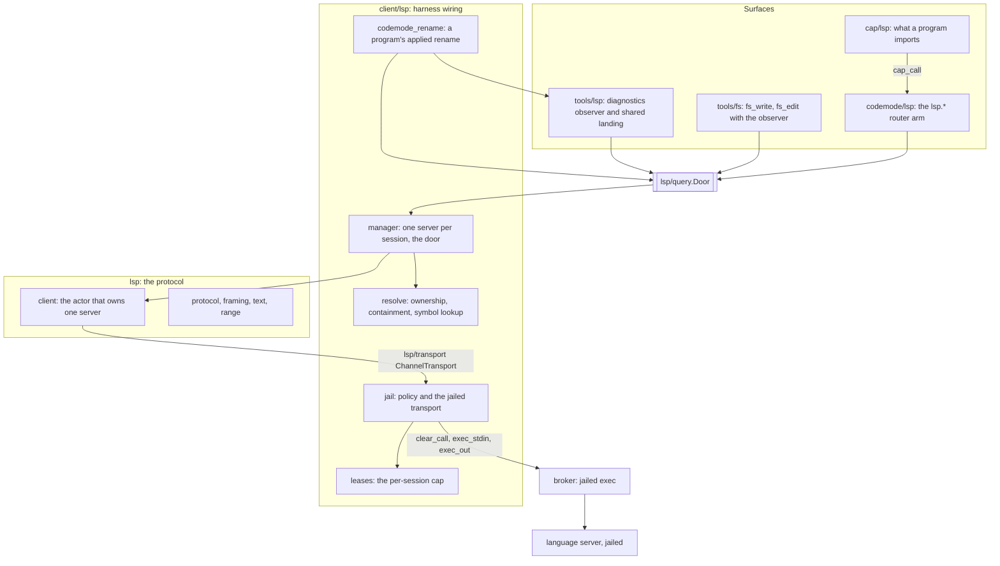

# Language servers

For installation, prerequisites and host checks, start with the
[language-server setup guide](../language-servers.md).

For bounded joins and aggregates in code mode, see
[SQL over finite LSP observations](lsp-sql.md). Its separate observation door
collects explicit outlines and reference targets before satellite-local SQL.

A language server is a long-lived process that knows a codebase the way
its compiler does. Asked over JSON-RPC on its stdin and stdout, it
answers where a name is defined, who refers to it, what type it has, and
what a rename would change. It also reports, unasked, whether the code
still compiles. Loom runs one such server per session, inside the jail,
and puts its answers in front of the model through `cap/lsp` in code mode
and a diagnostics block appended to `fs_write` and `fs_edit` results.
`cap/lsp_sql` collects explicit observations for satellite-local SQL. The
default registry exposes no separate `lsp_*` tools; the capability modules
share the same manager and lease.

This document is how the code carries out two rulings:
`docs/adr/015-language-servers-as-jailed-leases.md` (the server is a
jailed lease, with the measurements it rests on) and
`docs/adr/016-language-profiles.md` (a language is a profile, shipped
as data). It starts with the principles the design follows and a map of
the code in reading order, then covers each mechanism, and ends with how
to add a language.

## Principles

Seven rules shape every module below. Each is a heading followed by its
reason and the place in the code that holds it, so a change that breaks
one shows up as a change to that place.

### Teach the harness the protocol and no language

Loom ships no server table. A server exists because an operator wrote an
`[lsp.<name>]` table or installed a profile, and what a language spells
differently (its `languageId`, how a qualified name is split, how a module
name meets a file name) is a key of that table. The reason is reach: the
agent works on Go, Rust and whatever else a workspace holds, and a
language server is the one semantic channel every language already ships.
A language the harness had to learn would tie that language's fixes to
Loom's release train.

There is one place where the harness names a tool. The bare command
`gleam` resolves to the toolchain code mode located, not to `PATH`
(`executable_path`, `codemode/lsp_host/jail.gleam:400`), so the compiler
analysing a project is the one that builds its programs. That is a rule
about which release runs, not about Gleam's semantics, and it is stated
here because a principle with an unstated exception is worse than a
narrower one.

### Run the server in the jail

A language server runs project code. `gleam lsp` compiles the project,
`gopls` loads packages, and other servers run build scripts and macros,
all from a toolchain the model can edit. Rule Zero (no model-influenced
code in the harness VM) therefore applies to the server as it does to
`bash`. The broker's ordinary jailed exec holds it, under the session's
own enforcement demand, and a probe proves the jail is enforced before the
server starts. `policy_for` (`codemode/lsp_host/jail.gleam:922`) builds the
policy. Its read view includes the session-authorized portion of the
workspace for sibling dependencies; writes remain at the selected package.
Only the operator's table adds roots outside that workspace. Answer paths
still pass the admission gate below.

### Keep a profile to data

A profile extension declares `[lsp.<name>]` tables and `[[check]]`s. The
manifest decoder refuses a `[[tool]]`, `[[hook]]` or `[net]` in one by
name (`profile_tier`, `client/extension/manifest.gleam:93`), and an
install is fetch, extract and record, with nothing to vet or compile. The
profile runs nothing itself. It does carry the authority to name a binary
for the harness to run in the jail, and a one-line `hint` that lands in
the model's context, so both are part of what the operator approves at
install and the install record keeps the approved grant in full.

The reason for data over code is that data can be decoded totally,
approved as a diff and proven by a fixture. Code would need the extension
platform to grow five new capabilities first (ADR-016, option 2), and
would move the safety properties of ADR-015 out of the one place they are
audited.

### Address symbols by name, never by position

A tool takes a symbol as code spells it (`greet`, `util.Greet`),
optionally narrowed by a `path` and the 1-based `line` that `fs_read`
prints. The door turns that into the server's position (`SymbolQuery` in
`lsp/query.gleam`, resolution in `codemode/lsp_host/resolve.gleam`). A model
cannot count columns, and the protocol's columns are UTF-16 code units, so
a guessed offset lands on the wrong token and the server answers about
something else without saying so. Sites come back with codepoint columns,
which a model can use.

### Shape answers as the model's next step

A typed site carries its path, line, anchor and text, so a program can
report the evidence needed for an anchored edit. Bounded lists retain their
total and withheld counts rather than treating a clipped response as complete.
`cap/lsp.rename` requires `Preview` or `Apply`; the model previews, inspects
and applies in a separate code-mode call. The shared landing code still checks
every base before the first write. Shared rename landing, diagnostics rendering and the write observer remain in
`tools/lsp`; the seven top-level tool constructors and their obsolete tests are
removed.

### Gate every path the server names

The jail bounds what a server can read, but not which paths it can put in
an answer, and the harness reads outside every jail. So every path out of
an answer (a definition, a reference, a call edge, a published diagnostic,
a rename's edit) becomes `Admitted` or `Withheld` through one function,
`admit` (`codemode/lsp_host/resolve.gleam:399`), called from one place in the
manager (`gate`, `codemode/lsp_host/manager.gleam:2202`). Without it, a hostile
project's server could name `~/.loom/owner.token` and have the harness
print its first line.

`owner` (`codemode/lsp_host/resolve.gleam:173`) is the same containment rule
turned the other way: it keeps the model from asking about a file the jail
hides. A refused path costs no request.

### Measure readiness and settlement

The two servers ADR-015 measured disagree on everything a client could
wait on, and `rust-analyzer` answers `[]` while it is still loading. So a
freshly started server is asked whether its work-done progress has gone
quiet (`ready`, `lsp/client.gleam:1167`), and a write's diagnostics are
collected under two rules that both must hold (`settle`,
`lsp/client.gleam:1126`). The answer is a type that says `Settled` or
`Unsettled`, so a server that had not finished is never reported as clean
code.

The timings in this document are numbers somebody measured, and a
profile's `[[check]]`s are how a new server gets measured. A claim that
the code or a profile works rests on a run that asked the server, not on a
reading of its documentation.

## A map of the code

The modules are listed in the order a query travels through them, so
reading down the tables follows a question from the model to the server.
To read the code, start with `cap/lsp.gleam` and `codemode/lsp.gleam` to see
what a program sends, then `codemode/lsp_host/manager.gleam` for the door, then
`lsp/client.gleam` for one server's conversation, and read the jail and
profile modules last, after the contract they protect is clear.
The [style guide](../gleam-style.md#orientation-in-large-modules) requires a
readable `## Flow` spine in large modules (R13), checked transition tables for
critical state machines (R14), state types before functions (R15), and qualified
domain calls (R16). R17 and R18 warn about function order and unnamed helpers;
they remain censuses, and their warnings do not justify padding module prose.
Literate comments explain ownership, ordering and failure behavior beside the
code. This document links those maintained accounts of the implementation. Each path is
relative to its package's source root: `lsp/client.gleam` is
`packages/lsp/src/lsp/client.gleam`, and `codemode/lsp_host/jail.gleam` is
`packages/codemode/src/codemode/lsp_host/jail.gleam`.

**The surfaces: what the model and a program see.**

| Module | Owns | Read first |
|---|---|---|
| `tools/lsp.gleam` | Shared rendering, rename's `land`, the write tools' `diagnostics_observer`, and shared clipping/change-span helpers. | `## Flow` (`tools/lsp.gleam:19`), then `land` (`tools/lsp.gleam:112`) |
| `tools/fs.gleam`, `tools/hashline.gleam` | `land_plan`, `WriteTarget`, the write observer, and `plan_between`: the one landing path rename shares with `fs_edit`. | their own headers |
| `codemode/lsp.gleam` | The `lsp.*` router arm, rename preview diffing, and the wire shapes. | `## Flow` (`codemode/lsp.gleam:57`) |
| `cap/lsp.gleam` | The typed module a program imports: `Query`, `Site`, `Found`, `LspError`, and the seven functions. | `## Flow` (`cap/lsp.gleam:43`) and `## Where each error comes from` (`cap/lsp.gleam:62`) |

**The door and the harness wiring: one server per session.**

| Module | Owns | Read first |
|---|---|---|
| `lsp/query.gleam` | The harness vocabulary and the `Door` contract every surface calls: `SymbolQuery`, `Site`, `Diagnostics`, `QueryError`. Types only. | its header |
| `codemode/lsp_host/manager.gleam` | One server per session, the keepers that start servers, eviction, restart, the probe, the bare-symbol search, the gate on named paths, and `door`. | `## Flow` (`codemode/lsp_host/manager.gleam:100`), then `## Transitions of the manager` (`codemode/lsp_host/manager.gleam:124`) and `## Transitions of a keeper` (`codemode/lsp_host/manager.gleam:139`) |
| `codemode/lsp_host/resolve.gleam` | The judgement half of the door: ownership, containment, the `admit` gate, qualified symbols, outline lookup and containers. | `## Flow` (`codemode/lsp_host/resolve.gleam:71`) |
| `codemode/lsp_host/leases.gleam` | The per-session cap on session-lived helper leases. | its header |
| `codemode/lsp_host/codemode_rename.gleam` | A program's applied rename, composed from the tools' landing and the program's write boundary. | its header |

**The jail: what a server may touch.**

| Module | Owns | Read first |
|---|---|---|
| `codemode/lsp_host/jail.gleam` | `policy_for`, executable location and mounts, the containment checks, and the jailed `ChannelTransport` with its relay state machine. | `## Flow` (`codemode/lsp_host/jail.gleam:61`), `## Transitions of the relay` (`codemode/lsp_host/jail.gleam:82`) and `## What each containment rule stops` (`codemode/lsp_host/jail.gleam:100`) |
| `broker/policy.gleam` | `session_lease` and `LeaseOutput`, shared with extension hosts. | `session_lease` |

**The protocol client: one server, one actor.**

| Module | Owns | Read first |
|---|---|---|
| `lsp/client.gleam` | The actor that owns one server: handshake, gated requests, document sync, the diagnostics store, settlement, readiness and stop. It is a `weft/state_machine` over `lsp/transport` and never imports `broker` or `mcp`. | `## Transition table` (`lsp/client.gleam:48`), `## Flow` (`lsp/client.gleam:78`) and `## Reading the handlers` (`lsp/client.gleam:104`) |
| `lsp/protocol.gleam` | Total decoders for every structure consumed, the advertised-capability gate, answers to the server's own requests, and `file://` conversion. | `## Flow` (`lsp/protocol.gleam:45`) and `## Reading a decoder` (`lsp/protocol.gleam:78`) |
| `lsp/jsonrpc.gleam` | The JSON-RPC 2.0 envelope over `core/json`: the request, notification, response and error encoders, and the total `decode` of an inbound body into a response, server request, notification or fault. | `## Flow` (`lsp/jsonrpc.gleam:23`) |
| `lsp/transport.gleam` | The transport seam: `Connection`, `TransportEvent`, and a `Transport` with only the channel variant. | `## Flow` (`lsp/transport.gleam:19`) |
| `lsp/framing.gleam` | The pure `Content-Length` framer. It works on bytes, because the header counts bytes. | `## Flow` (`lsp/framing.gleam:36`) and `## Transition table` (`lsp/framing.gleam:52`) |
| `lsp/text.gleam` | The one place a server position becomes a line and codepoint, and the one place a server's text edits are applied. | `## Flow` (`lsp/text.gleam:60`) |
| `lsp/range.gleam` | The server's coordinates: zero-based lines, columns in UTF-16 code units. | its header |

The package takes the JSON value type from `core/json` and carries its own
JSON-RPC envelope and transport seam, `lsp/jsonrpc` and `lsp/transport`,
because `gleam_mcp` ships its HTTP stack in the same package and that closure
would reach every package that imports `lsp`. It keeps its own monitored
try-call in `lsp/call.gleam` too, because `gleam_mcp` carries one only
privately.
`packages/lsp/CLAUDE.md` is the dense per-type reference for the package.

**Profiles and checks: what a language is.**

| Module | Owns | Read first |
|---|---|---|
| `codemode/lsp_host/profile.gleam` | The one `[lsp.<name>]` decoder (`LspServer`, `LspPath`, `ModuleCase`, `Places`), the extension-ownership check, `expand_path` and `cache_place`. Pure. | `## Flow` (`codemode/lsp_host/profile.gleam:62`) and `## Refusal rules` (`codemode/lsp_host/profile.gleam:87`) |
| `client/lsp/profiles.gleam` | Combining `loom.toml` tables with installed profiles: the operator's file wins whole, and a conflict refuses the installed side. | its header |
| `client/lsp/profile_check.gleam` | A profile's `[[check]]`s asked through the door and judged as sets of `path:line` (ADR-016 §5). | its header |
| `client/extension/check.gleam` | `loomd ext check`: the scratch workspace, the check plane, the probe's jail line, and a manager over one server. | `## Flow` (`client/extension/check.gleam:58`) |
| `client/catalog.gleam`, `client/contributions.gleam`, `client/codemode.gleam` | Handing the `[lsp]` table to the decoder, `built_in`'s `lsp` plane (the tools and the observed write tools), and `over_lsp`, the per-host admission of `cap/lsp`. | their headers |

## Why a language server

Before this work the agent edited by hashline anchor (`fs_read` prints
each line with a short content hash, and `fs_edit` refuses an edit whose
anchor no longer matches) and found code by `grep`. Both know text and
nothing else. Neither can say which of forty `init` functions a call
reaches, or whether an edit broke a file the agent never opened.

The tools that already understand Loom's own code (the compiler's
package-interface export, the `glance` walker behind `make lint`, the
search index) understand Gleam and nothing else. The language server is
the one channel every language ships, and for most languages it is the
only oracle for types. Loom therefore speaks the Language Server
Protocol (LSP) and brings no language knowledge of its own. `gleam lsp`
and `gopls` appear throughout this document because they are the two
servers the design was measured against, not because Loom knows them.

What a language spells differently is data. Two facts that used to be
hard-wired defaults, the `languageId` a document is opened with and how a
qualified symbol is split, are now keys of a server's table, its
**language profile** (ADR-016). Each key's default is exactly the
behaviour it replaced, so a table written before the keys existed means
what it meant. The keys are described under "Configuration" below.

## One door, every surface

Native queries and observed writes ask through one record of closures,
`lsp/query.Door`. The write tools' diagnostics observer calls it, and code
mode's router calls it. The session's language-server manager
fills it. One door means one symbol-resolution rule, one document-sync
rule and one server per session, whichever surface asked. A code-mode
program is not a second client of the server; it is a second caller of
the same door.

The work is layered so that nothing above the protocol package holds an
LSP position and nothing below `client` touches the broker:


```mermaid
flowchart TB
    subgraph Surfaces
      T[tools/lsp: diagnostics observer and shared landing]
      FS[tools/fs: fs_write, fs_edit with the observer]
      CM[codemode/lsp: the lsp.* router arm]
      CAP[cap/lsp: what a program imports]
    end
    D[[lsp/query.Door]]
    subgraph Wiring[client/lsp: harness wiring]
      M[manager: one server per session, the door]
      R[resolve: ownership, containment, symbol lookup]
      J[jail: policy and the jailed transport]
      L[leases: the per-session cap]
      CR[codemode_rename: a program's applied rename]
    end
    subgraph Protocol[lsp: the protocol]
      C[client: the actor that owns one server]
      P[protocol, framing, text, range]
    end
    B[broker: jailed exec]
    S[language server, jailed]
    CAP -->|cap_call| CM
    T --> D
    FS --> D
    CM --> D
    D --> M
    M --> R
    M --> C
    CR --> T
    CR --> D
    C -->|lsp/transport ChannelTransport| J
    J --> L
    J -->|clear_call, exec_stdin, exec_out| B
    B --> S
```

**The surfaces are thin.** `tools/lsp` decodes tool arguments into an
`lsp/query.SymbolQuery`, calls the door and renders the answer.
`codemode/lsp` does the same into the msgpack shapes `cap/lsp` decodes.
`cap/lsp` is the typed module a program imports; like every prelude
module, its functions are stubs that send a `cap_call`.

## The jailed lease

A language server runs project code in effect. `gleam lsp` compiles the
project, `gopls` loads packages, and other servers run build scripts and
macros, all from a toolchain the model can edit. Rule Zero (no
model-influenced code in the harness VM) therefore puts the server in the
jail. The broker's ordinary jailed exec is enough to hold it there: the
JSON-RPC bytes ride inside `exec_stdin` and `exec_out` like any command's
input and output, which is what spec Part 1.4 asks of an LSP adapter. No
new frame, no helper change and no FFI was needed. What makes a server
different from a command is only its lifetime: it is cleared once and
lives until it exits.

### The policy

`codemode/lsp_host/jail.policy_for` turns one `[lsp.<name>]` table, the project
root a file was found in, and the session's base policy into the lease
base and the requirements the clearance is judged under. The operator's
table is the only thing that widens it; nothing the model supplies does.
The requirements ask for:

- the project root, readable, and writable only when the table says
  `project = "writable"` (Gleam's server writes `manifest.toml` and
  `build/`; `gopls` writes nothing there);
- the table's extra `readable` and `writable` roots, such as the Go
  module cache and build cache;
- the directory holding the server's executable, and never an install
  prefix, because a prefix such as `~/.cargo` would put
  `credentials.toml`, a registry token, inside every server's jail, where
  a build script or proc macro the model wrote could read it and return
  it through a diagnostic. A symbolic link is resolved rather than
  widened: `jail.locate` follows the chain (at most `max_link_hops`, 32,
  and a loop, a dangling link or a chain ending at a non-file is refused
  by name), resolving relative link text against the link's own
  directory, and `jail.regions` mounts the directory of the link and of
  every file it leads through. rustup's `~/.cargo/bin/rust-analyzer ->
  rustup` mounts `~/.cargo/bin` alone, and `/bin/sh -> dash` mounts
  `/bin` and, on a merged-`/usr` host, `/usr/bin`. The link reader is the
  one `tools/fs` already owns (`tools_ffi:read_link/1`), so no new FFI
  was taken. Because the mounts now follow where links point, a link the
  server can rewrite would let it choose a mount: a lease is refused when
  any hop that is itself a link lies at or under a path the server
  writes (a writable project root, the scratch directory, a `writable`
  root), telling the operator to name the file it points to in
  `command`. The file the chain ends at may still sit there, as a plain
  `node_modules/.bin` executable does, since its own directory widens
  nothing; and judging at resolution is enough, since a link rewritten
  later points outside what was mounted and fails to execute. A link can
  also be a *directory* on the spelled path (`node_modules/.bin`
  replaced by a link beside a credential), and the region is mounted by
  that spelling, which the helper's bind follows, so before a start the
  manager refuses one too (`jail.directory_unlinked`): where a path the
  server writes holds the executable's directory, the part below it must
  resolve to itself, the real path being the write's real path with the
  same components after it. A link above the write, such as a workspace
  under `/var -> /private/var`, is the operator's and is admitted. Each region is an explicit read-only mount, and the helper
  lays explicit mounts over every root, so a region at or above a path
  the server writes (the link's own directory or a target's) is refused
  by name rather than left to turn that path read-only. `/bin/sh` is the
  case that found that check, under the prefix rule this replaced: its
  prefix was `/`;
- a private scratch directory as `TMPDIR`, since the jail replaces `/tmp`;
- network off, refused if narrowed (`RefuseNarrowed`);
- `PATH`, `HOME`, `TMPDIR` and the table's `env` names, and no other
  environment.

Limits need care. A one-shot command has a wall-clock limit, a CPU limit
and an output cap, and a server must have none of them: the wall would
kill it mid-session, and the output cap would cut its JSON-RPC stream
mid-frame hours in. Limits compose by meet, with zero meaning unlimited,
so a zero in the requirements against a non-zero base is a narrowing,
and `RefuseNarrowed` refuses it. The zeros must therefore sit on the
base. `broker/policy.session_lease` builds that base for both kinds of
lease. Its `LeaseOutput` argument is `OutputIsLog` for an extension host,
whose stdout is a log the cap may bound, and `OutputIsWire` for a
language server, whose stdout is its protocol. The requirements then
restate the zeros literally rather than deriving them, so a base that
kept a cap is a refusal at clearance rather than a server that goes mute
hours later. What bounds the lease instead is the pooled budget deadline,
twelve hours out, as for extension hosts.

### The transport

`codemode/lsp_host/jail.transport` is an `lsp/transport.ChannelTransport` whose
`connect` starts a relay. The relay acquires a lease, clears the call
through `broker.clear_call`, and turns broker events into transport
events. A stdout chunk becomes data. The settlement becomes a close,
carrying the exit and the tail of the server's stderr. A truncated
stdout chunk is fatal, because once bytes are missing the stream is no
longer JSON-RPC. Stderr is only a log: it drains into an 8 KiB ring that
colours the closing reason, and it is never fatal. `lsp/transport.Transport`
has only the channel variant, so a port transport, which would run the
server outside the jail, cannot be built.

### Demand, and the enforcement probe

The server clears under the session's own `EnforcementDemand`, the demand
`bash` clears under. That is platform enforcement by default and
best-effort only where an operator opted a development container into
it. A language server is no more trusted than the shell beside it, and
no less.

Demand alone does not prove anything about a lease. Under platform
enforcement the helper reports what it actually enforced in the
execution's exit report. For a one-shot command that report arrives
before its output is trusted. A server, though, answers queries for
hours before it exits, and a lease must not learn that it ran unjailed at
the end of its life. So before a server starts, the manager clears a
trivial probe (`/bin/sh -c 'exit 0'`) under exactly the server's policy
and the session's demand, and starts the server only if the probe settles
undegraded. A degraded probe refuses the server as `NoServer`, naming
what the helper could not enforce. The cost is one short exec per server
start.

### One server per session, under a lease cap

Each assembled session starts its own helper pool and broker, and the
pool is small on purpose: it clamps to between four and sixteen helpers.
The rest of the session still needs it. A `bash` call borrows a helper,
a code-mode satellite holds one for its whole run, and each capability
call that satellite makes borrows another while the satellite waits. A
lease that took any of those three would turn an ordinary code-mode run
into a wait that ends in a refusal.

Two rules follow. The manager runs **at most one server per session**.
And `codemode/lsp_host/leases` caps session-lived leases at `pool_size − 3`; a
server asked for at the cap is refused as `NoServer` with a sentence
naming the cap, rather than queued behind helpers that may never come
back. With one server and a pool of at least four, the cap cannot bind
today. It is the guard for a second server, or for extension hosts
counted against it later (they hold session-lived helpers too, and are
not counted yet), and it is tested at the minimum pool size. The cap is
per session because the pool is. ADR-015's review assumed a daemon-wide
pool; measuring the boot path showed otherwise, and the ADR carries the
correction.

A lease is released when the broker says the server's execution settled,
which is the moment the helper is back in the pool. The leases actor
also monitors every holder, so a relay that crashes gives its lease back
without anyone having to remember to.

### Eviction, death and restart

The manager actor holds only small state: which server is running or
starting, the callers waiting on a start, and the paths the running
server holds open. It never reads disk, never talks to a server and never
waits. A start takes seconds (a handshake plus a project load; `gopls`
answered its first query 1.8 s cold), so each start happens in a
**keeper**, one process per server start. The keeper waits for the
previous server's keeper to finish stopping, runs the probe, starts the
`lsp/client` actor, re-opens the documents a dead predecessor held, and
reports. Every caller who asked in the meantime is a waiter in the
manager's state, answered once when the keeper reports: one start,
however many callers.

A query about a file that another server or another project root owns
**evicts** the running server. Its keeper is told to stop it gracefully,
and the new keeper waits for that exit before starting anything, so two
servers never hold the session's leases at once. A server that dies is
not restarted eagerly. The next query starts it again and re-opens its
documents, and the answer that paid for the start says so: the tools
prefix it with "started the gleam language server for this query; later
queries are fast", because a model reading a slow answer would otherwise
take it for a hang.

Stopping is `shutdown`, then `exit`, then stdin EOF, with
`broker.abort_step` as the backstop. Every language server of a session
clears under one attribution-only operation, so an operator's abort of a
model run does not reach it, and each server gets its own step,
`lsp/<server>/<root-digest>`, so aborting a step stops exactly one
server.

### No backpressure, so nothing blocks

The relay forwards every stdout chunk as a message, and `broker.stdin` is
a cast. Nothing on this path pushes back on a fast writer, so nothing
that owns a mailbox on it may block. The `lsp/client` actor never reads
disk and never waits inside a handler; every wait is a pending entry
plus a timer in its state. The door's closures run in the **caller's**
process: they ask the manager for the live client, then do the disk
reads, the resync, the requests and the conversion to sites themselves.
A slow query holds up only the caller who asked it.

## Addressing by symbol

LSP is built around documents and positions because an editor always
knows its cursor. An agent does not, and asking it for a zero-based
UTF-16 offset is asking it to be wrong. Every tool and capability
therefore takes a **symbol name**, optionally narrowed by a `path` and a
1-based `line` exactly as `fs_read` prints it. The door resolves the
position:

- `path` + `line` + `symbol`: the first occurrence of the identifier on
  that line, matched on identifier boundaries, so `foo` does not match
  inside `foo_bar`. The boundary rule is deliberately language-neutral:
  anything above ASCII counts as an identifier character, which errs
  toward "not found" rather than a wrong position.
- `path` + `symbol`: the file's outline (`documentSymbol`), searched by
  name.
- `symbol` alone: a bounded, whole-word, literal `rg` over the server's
  root, run in the server's jail and restricted to its extensions (at
  most 200 hits in 50 files, four per file), then `definition` at each
  hit, deduplicated by definition site. Hits inside strings and comments
  resolve to nothing and fall out.

A symbol may be **qualified** the way code reads it: `probe.greet`,
`util.Greet`, `pkg/mod.name`, or `util::greet` for a server whose
profile lists `::`. The symbol is split on the owning server's
`qualifier_separators`, longest first, so it is split only once a server
is known: the path's owner, or each server in turn for a bare name. The
last segment is the identifier. The qualifier is the segments before it
joined with `/`, keeping a `/` written inside one as a path, and it keeps
only definitions whose module path or directory ends with it on segment
boundaries, or whose outline parent chain does. Under `module_case =
"snake"` the module-path comparison maps each segment to snake_case
first (`MyApp` to `my_app`, `HTTPServer` to `http_server`); the parent
chain is the server's own spelling of a type and is compared as written.
A server may spell a method with its receiver as one top-level outline
entry, as gopls does (`(*Server).handle`, `(Server).handle`); the method part
of such a name counts as the entry's name and its receiver as a parent for a
qualifier, so `handle`, `Server.handle` and `(*Server).handle` all find it.
A name that still reaches more than one distinct definition is answered
with the candidates, never a guess, including one method name on two
receivers in one file.

The answers are shaped to be the agent's next step rather than a report
to read:

- **Anchors.** Every site prints as `path:line:anchor|text`: a `grep` hit
  with the hashline anchor `fs_read` would have printed spliced in. The
  `line:anchor|text` tail is exactly an `fs_read` line, so a result feeds
  `fs_edit` with no read in between. A CRLF line keeps its carriage
  return in the site's text, because the hashline tools hash it as part
  of the line.
- **Containers.** Each reference carries the symbol whose body holds it
  (`other.twice`). That answers "who depends on this?", and it gives a
  one-level caller view on servers such as `gleam lsp` that offer no call
  hierarchy.
- **Completeness.** `cap/lsp` returns up to 200 items with the total and
  withheld count beside them. A program checks those fields before treating
  a list as complete, and returns a task-sized report rather than raw rows.
  SQL observations have their own explicit scope and collection limits.

Every request is gated on what the server advertised in its `initialize`
answer. A measured server left an unadvertised request unanswered for
the whole 30 s it was watched, so a request the server does not offer is
answered `Unsupported`, naming the server and the request, and is never
sent. Every request that is sent carries a deadline (five seconds in
production); one that outlives it is answered `TimedOut`, cancelled on
the wire with `$/cancelRequest`, and its late answer dropped.

## Keeping the server's view honest

A language server answers about the documents it holds, not about the
disk. Loom syncs full text, never deltas, in two directions.

**Push.** A write that lands through `fs_write`, `fs_edit` or a rename is
reported to the door's `after_write`, which sends the new text as a
`didChange` (or `didOpen`) to the server that owns the file. `after_write`
never starts a server. An edit's result must not wait out a handshake and
a full compile, and an edit in one project must not evict the server
another project's queries are using. A write to a file whose server is
not the one running is therefore answered with nothing, and the next query
about it starts the server, which reads the file as it then stands.

**Pull.** Before every query, the caller re-reads every document the
server holds open, sends a `didChange` for each whose digest moved and a
`didClose` for each that vanished. This catches what push cannot: writes
by `bash`, by background jobs and by code-mode programs. The pull is not
a lock. Its race with a concurrent write is the one `fs_edit` already has
with `bash`. The outer `code_mode` call is `Exclusive`, but background
writers may still race it; rename's base checks protect the landing.

**Open what a query touches.** It is tempting to leave documents the
server never opened to the server itself, which can read the disk.
Measured against `gleam lsp`, that is wrong: it answers `definition`
with nothing and outlines nothing for a file it was never sent. So the
manager opens the files a query is about to touch: the hit files of a
bare-symbol search, and the referencing files whose outlines give
references their containers (at most 32, half the open bound, so one
wide answer cannot evict everything else the server holds). At most 64
documents are open at once, least recently synced closed first.

**Containment.** A file is owned by the configured server whose
`extensions` include its extension, rooted at the nearest ancestor that
holds one of that server's `root_markers`. Its *real* location, every
symlink resolved, must then lie under the root's real location. bwrap
binds the root at its own path, so a symlink leading out of it names a
file the jailed server cannot read, and asking about it would produce an
answer about nothing. Such a path is refused as `NoServer` before any
request is sent, and the server is thereafter addressed only by real
paths.

The same refusal covers a file outside the workspace altogether, such as
a sibling clone of the project that is not a subdirectory of the session's
root. An absolute path there, a `..` climb out of the workspace, and a
symlink inside the workspace that leads out are all `NoServer`, and the
reason names the path and the workspace root, so a model sees that the
question was about a tree no server of this session is rooted in. A
relative path always means the workspace, never the tree the model is
thinking about. Nothing is answered from the workspace's own tree in
place of the one asked about: path-scoped questions, `lsp.diagnostics`,
`lsp.rename` and the `lsp_sql` capture's outlines and seeds all pass the
same ownership check (`resolve.owner`) before a server is started or asked.

A question with no path cannot be refused this way, because it names no
file. A bare `lsp.symbol("Name")` searches one server's project root, and
it can only ever answer about that root. When the search finds nothing,
the `NotFound` answer carries `searched`, the root it covered ("the go
server rooted at /work/app", or "the workspace /work" before any server is
running), so an empty answer about a name that exists in another clone is
not mistaken for a statement about that clone.

### Readiness

A server may answer while it is still loading its project, and
`rust-analyzer` does, with empty results rather than errors: measured,
`definition` came back `[]`, `references` held only the declaration,
`hover` found nothing, and a rename edited one file of the two that
needed it. `gopls` and `gleam lsp` hold a request until they can answer
it, so they never showed this.

Readiness is a mechanism rule over standard work-done progress, not a
per-server key. The `initialize` request declares
`window.workDoneProgress`, and the client actor tracks the set of active
`$/progress` tokens: `begin` adds one, `end` removes it, a `report` for
a token it never saw begin adds it, a malformed notification is dropped,
and at most 64 are held. `lsp/client.ready(quiet_ms:, deadline_ms:)`
answers `Quiet` once no token has been active for a continuous
`quiet_ms`, measured from the later of the call and the last token's
end, or `StillBusy` with the active titles at the deadline. Like
settlement, it is a waiter and timers in actor state.

Only the query that starts a server asks, after the pull. It waits a
300 ms window (`Timing.quiet_ms`), because the server may not have begun
reporting when `initialized` is sent, and then for every token to end. A
server still busy at `Timing.ready_ms` (a minute) is answered
`Unavailable`: "the language server is still loading (Indexing); ask
again in a moment", never an empty answer, and is left running.

A warm query never waits, for two reasons. The measured empty answers
were a load-time problem: a warm server re-indexing after an edit
answers from its previous state, which is its normal behaviour and what
every editor's client sees. And a server that begins a token and never
ends it would otherwise stall every later query for the whole minute;
as it is, the leak costs one "still loading" answer at start, and the
next query, being warm, proceeds. Diagnostics, `after_write` included,
do not wait either: settlement has its own two rules and bound. A server
that reports no progress costs one 300 ms window after its start and
nothing after.

Measured through the jailed manager on a two-file crate,
`rust-analyzer`'s first progress began 4 ms after the manager asked, well
inside the window; the longest gap between one token's end and the next
one's begin was about 100 ms; and the load went quiet 3.45 s after the
handshake began, the first answer following 300 ms later. Asked with no
window after the start, the same question answered `[]`.

## Settled diagnostics

After a write, the model should learn whether the code still compiles,
and should never be told it is clean when the server simply had not
finished. Both halves turn out to be harder than they look, because the
two measured servers disagree about everything a client could wait on:

| After a `didChange` | `gleam lsp` 1.18.1 | `gopls` |
|---|---|---|
| `publishDiagnostics` carries a `version` | no | yes |
| a clean → clean edit publishes | nothing | a versioned empty list |
| publications, relative to the answer of a request sent after the change | **before** it, for every affected file | **after** it |

"Wait for diagnostics at version N" never completes on `gleam lsp`,
which versions nothing and publishes nothing for a file that stays clean.
"Send a request and wait for its answer" is a barrier on `gleam lsp` and
not on `gopls`, whose publications arrive afterwards. So settlement takes
two rules, and both must hold:

1. **The barrier has answered.** After a change, the client sends
   `documentSymbol` on the changed file. On `gleam lsp` every publication
   the change caused has arrived by the time it answers.
2. **Versioned servers have caught up.** If this server has ever
   published a `version`, then for every changed open document a
   publication at a version at least the one synced has arrived.

A server with no `documentSymbol` settles by the second rule alone, so
one that neither answers the barrier nor versions its publications never
settles. The wait is bounded at 1.5 s. Every file published between the
change and settlement is collected, since breaking `a.gleam` usually
breaks `b.gleam` too, and the rendered block lists at most 20 diagnostics
under a count of all of them.

The answer is a two-variant type, `Settled | Unsettled`, rather than a
list and a flag, because the two are different claims. `Settled([])` is
clean code. `Unsettled([])` is only that nothing had arrived, and every
surface renders it as "did not settle", never as clean.

With a door present, `fs_write` and `fs_edit` are built with
`tools/lsp.diagnostics_observer`, and a landed write's result gains the
settled-diagnostics block after the fresh-anchor block. The first two
lines of the result never move. Without a door they are the plain tools,
byte for byte. The measured servers settle in milliseconds, so the 1.5 s
is paid only by a server that never does.

## Rename

A rename is where a language server earns the most and where it could do
the most damage, so the server computes and Loom writes. A server's
`workspace/applyEdit` request is always answered `applied: false`, the
`initialize` request declares that the client cannot apply edits, and a
`WorkspaceEdit` that creates, renames or deletes a file is refused whole.

The door's `prepare_rename` asks the server (`prepareRename` where
offered, then `rename`) and hands back, for each file, the text the
server saw and the text after its edits. It writes nothing. For an open
document the base is the last text sent, which the pull just made the
disk text, so full-text sync makes it the server's exact view; a file in
the edit that is not open is read now. **Every edit's range must select
exactly the old identifier** in its base. A stale position fails that
check at no cost. The server's positions are converted by `lsp/text`, and
a position that falls between the halves of a surrogate pair is refused
rather than rounded, because rounding would move an edit onto a
neighbouring character and still apply.

`tools/lsp.land` then lands the files, in three passes. First, each
file's before-and-after pair becomes an ordinary hashline plan bound to
the base's digest (`tools/hashline.plan_between`). Then every target is
resolved and every file on disk is compared with the text the server
saw. Only then is anything written, file by file, through
`tools/fs.land_plan`, the path `fs_edit` takes. A file changed since the
server looked is refused as `StaleContent`, exactly as a stale `fs_edit`
is, and a failed check on any file stops the whole rename before the
first byte is written.

The landing across files is still not atomic: a write can fail after
another has landed. The report says per file what landed, what was
rejected and what was not attempted, each landed file is pushed to the
server, and the settled diagnostics that follow expose a half-landed
rename at once. A server's own refusal ("would make it unexported", in
`gopls`'s words) reaches the model verbatim.

`cap/lsp.rename(query, name, Preview)` returns each planned file and changed
line without writing. After inspecting that result, the model submits a
separate program using `Apply`. The outer `code_mode` call is replay-`Never`
and `Exclusive`, so an interrupted program's effects are never replayed.

## Code mode

Semantic queries use capability modules in code mode. A program can ask
one question or compose several, keeping intermediate results in the satellite.
The default registry has no separate top-level LSP tools. "Every definition in this file that is used
from another file" is one outline and a loop of reference queries, and no
single tool offers it:

```gleam
import cap/lsp
import gleam/list
import gleam/result

pub fn used_elsewhere(path: String) -> Result(List(String), lsp.LspError) {
  use outline <- result.try(lsp.outline(path))
  Ok(list.filter_map(outline, fn(entry) {
    use found <- result.try(lsp.references(lsp.symbol(entry.name) |> lsp.in(path)))
    case list.any(found.items, fn(reference) { reference.site.path != path }) {
      True -> Ok(entry.name)
      False -> Error(lsp.NotFound(entry.name, None))
    }
  }))
}
```

`codemode/lsp.routing` serves the seven names (`lsp.definition`,
`lsp.references`, `lsp.hover`, `lsp.outline`, `lsp.calls`,
`lsp.diagnostics` and `lsp.rename`) as `ServedHere`, the way
`client/mcp.routing` serves `mcp.<server>`. The server is already
running, jailed, under a lease the session holds, and a query is a
message to it over a channel the harness owns, so there is no process to
spawn and no policy to compose. The door's request deadline and the
host's call timeout bound a call.

Failures travel on two channels. A refusal that is only a sentence
(`NoServer`, a server's refusal, `Unavailable`) is an in-band denial with
a code and a message. The three that carry structure a message cannot,
`NotFound`'s symbol and the root a bare search covered, `Ambiguous`'s
candidate sites, `Unsupported`'s server and request, travel as an answer tagged `unresolved`, because the
harness looked and the looking is the answer.

A program's rename previews in the router, which diffs the door's base
and edited texts and needs nothing more. Apply is composed elsewhere,
because it needs write authority the router must not hold.
`codemode/lsp_host/codemode_rename` builds it per execution out of the door's
`prepare_rename`, the shared `tools/lsp.land`, and the write
boundary a program's `cap/fs.write` is held to: the execution's
workspace, its approved writable roots and its protected paths. A
protected path such as `.git/hooks` is refused to a rename for the reason
it is refused to `fs.write`.

**Admission is conditional, and the reason has a price.** `cap/lsp` is on
no static allowlist. Every module on a static list has its type surface
rendered into the `code_mode` tool description, and the description is
part of the cached prefix every provider request pays for. The reshaped
`cap/lsp` surface is about 5.6 KB of generated text in
`tools/prelude.type_surfaces` (the positional stub it replaced was about
1 KB). Most sessions configure no language server, and there it could
only refuse. So `client/codemode.over_lsp` admits it per host, the way
MCP façades and `cap/notes` are admitted: with a door present, the
allowlist, the description, the advertised capabilities and the router
arm all gain it; without one, a program that imports it is refused at
vetting with a reason naming it, rather than at its first call.
Extensions and resident hooks never see it.
`codemode/vet/policy.harness_only_cap_modules` records the exclusion so
the prelude gate knows it is a decision rather than an oversight.

## Configuration

Servers are configured, never discovered or installed. Each is an
`[lsp.<name>]` table in `loom.toml`, and the table is the whole of what
the server's jail grants beyond its project. With no `[lsp]` table there
the write tools are unchanged, neither `cap/lsp` nor `cap/lsp_sql` is
admitted, and nothing is spawned.

```toml
[lsp.gleam]
command = ["gleam", "lsp"]
extensions = [".gleam"]
root_markers = ["gleam.toml"]
project = "writable"
hint = "Qualify a name with its module as imported: probe.greet, or pkg/mod.name for a nested module"

# gopls reads the module cache, outside the project, so it is named
# here. Its caches are private: cache_env points GOCACHE, GOPLSCACHE and
# XDG_CACHE_HOME under <cache>/loom/lsp/go/, which Loom creates and
# grants writable, never the ~/.cache/go-build the host's own go build
# trusts. The first two are named because on macOS go and gopls ignore
# XDG_CACHE_HOME.
[lsp.go]
command = ["gopls"]
extensions = [".go"]
root_markers = ["go.mod"]
readable = ["~/go/pkg/mod"]
cache_env = { XDG_CACHE_HOME = "xdg", GOCACHE = "go-build", GOPLSCACHE = "gopls" }
env = ["GOFLAGS"]
hint = "Qualify a name with its package name as imported: util.Greet"
```

Both tables are examples. Neither is built in, and a workspace that
wants neither configures neither. **Language support ships as profile
extensions in separate repositories** (ADR-016 and its addendum). Loom
carries the mechanism and no language: the three first-party profiles are
[loom-lsp-gleam](https://github.com/Roasbeef/loom-lsp-gleam),
[loom-lsp-go](https://github.com/Roasbeef/loom-lsp-go) and
[loom-lsp-rust](https://github.com/Roasbeef/loom-lsp-rust), each with a
fixture and the checks that prove it, and each tagged v0.1.0. They are the
maintained versions of these tables. For example,
`loomd ext install https://github.com/Roasbeef/loom-lsp-go --rev v0.1.0`
approves the Go table without editing `loom.toml`; a `loom.toml` table of
the same name replaces an installed profile whole.

`command` is an argv, never a shell string. Its head is resolved once:
an absolute path is taken as written; the bare name `gleam` is the
toolchain code mode located, so the compiler analysing the project is the
one that builds its programs; any other bare name is looked up on the
daemon's `PATH`. `extensions` are matched case-insensitively, and an
extension claimed by two servers is a configuration error naming both,
because a file with two owners has no well-defined view. `project` is
`"read-only"` by default. `env` names variables passed through from
the daemon's environment; the values never live in the file, and `PATH`,
`HOME` and `TMPDIR` are the harness's own.

`readable` and `writable` are absolute, `~/`-relative or
`<cache>/`-relative. Both relative forms are expanded at load time
against the daemon's own environment, never the jailed session's: `~/`
is its `HOME`, and `<cache>/` is its per-user cache directory, which is
`$HOME/Library/Caches` on macOS and, elsewhere, `$XDG_CACHE_HOME` when
the daemon was started with an absolute one, else `$HOME/.cache`. A
form whose place is unknown (no `HOME`) refuses that server at boot, as
does a relative path, a `..` component, or a bare `~/` or `<cache>/`.
`<cache>/loom` and anything beneath it is refused however it is spelled
("Loom's private cache is not a root a table may name"), and at boot
(`profile.private_cache_fault`, from `serve.lsp_server_roots`) so is an
absolute or `~/` root that resolves there, or a `writable` one that
holds it, such as `~/.cache` on Linux.

`cache_env` is the one key that sets an environment *value*, and the
value can only be a directory Loom owns: `cache_env = { XDG_CACHE_HOME
= "xdg" }` sets the variable to `<cache>/loom/lsp/<server>/xdg`. The
manager creates the directory just before a jail binds it
(`codemode/lsp_host/manager.jail_for`, beside the scratch directory), the jail
grants it writable (`codemode/lsp_host/jail.policy_for`), and the install
approval prints it. It exists because a writable host cache is a way
out of the jail when the host's own tools trust it: `go build` reads
`GOCACHE` unverified, and `go list` in the jail runs cgo with flags the
project can write. A name also in `env`, a name the harness owns, and a
directory that is absolute, has an empty, `.` or `..` component, or lies
inside another entry's (which the server could swap for a link before
the next start binds it) are each refused as
`lsp.<name>.cache_env.<VAR>`. Those rules, and the refusal of any root in
`<cache>/loom`, close the routes a table could open; the manager closes
the rest from the disk. Both before `mkdir -p` and after it,
`jail.caches_unlinked` resolves each private cache and refuses the start
unless its real path is the cache place's real path joined with
`loom/lsp/<server>/<dir>`, so no link below the cache place is followed
whoever planted it; the cache place is resolved first, so a `~/.cache`
that is itself a link still works. The check reads the disk once per
start, before any clearance, so it closes a planted link but not one
swapped in between that read and the helper's bind.

Four optional keys carry what a language spells differently. They make
the table a **language profile** (ADR-016), and each default is what
ADR-015 shipped before the key existed:

| Key | Default | What it says |
|---|---|---|
| `language_id` | the first extension without its dot | The `languageId` documents are opened with, `[a-z0-9][a-z0-9+._-]*`, at most 40 characters: `typescript` for `.ts`. |
| `qualifier_separators` | `["."]` | What a qualified symbol is split on, longest first: `["::"]` for Rust or C++. Each is non-empty, holds no whitespace, is not `/`, and is listed once. |
| `module_case` | `"as-written"` | `"snake"` maps each qualifier segment from CamelCase before it meets a path, as Elixir and Ruby lay modules out. |
| `hint` | none | One printable line, at most 200 bytes, telling the model how the language spells a qualified name. |

Served profiles' hints travel as a deterministic "Language notes:" block
with `cap/lsp` discovery. The `code_mode` description carries the same hints
that `fs_read` at `cap://lsp` returns beside the full API. They appear only
on an offer that admits and serves the native LSP capability, and no hint
is advertised on extension or resident seams that cannot use it. The hints
remain operator-approved configuration text, not language-specific harness
logic. A host with no hints adds no supplemental block.

`codemode/lsp_host/profile` decodes the tables, and `client/catalog` hands it
the `[lsp]` table's entries. It is the one decoder, which an extension
that ships a profile will go through too (ADR-016 §1), and it is pure:
the daemon's `HOME` and cache directory reach it as `profile.Places`,
read by `client/serve`. `docs/examples/loom.toml` carries the annotated
version.

At boot, `client/serve` builds a session's language-server plane only
when a table exists: the leases actor and the manager, the latter
supervised with the session's other services. Nothing is spawned then.
The first query starts a server, after the probe, so a session that never
asks a semantic question never pays for a server.

## Adding a language

A language is a profile, not a change to Loom. It lives in its own
repository, so its fixes follow its server's releases and not Loom's
(ADR-016, addendum). Loom maintains three, which are also the worked
examples: [loom-lsp-gleam](https://github.com/Roasbeef/loom-lsp-gleam),
[loom-lsp-go](https://github.com/Roasbeef/loom-lsp-go) and
[loom-lsp-rust](https://github.com/Roasbeef/loom-lsp-rust). Each has a
`docs/how-this-profile-works.md` that walks through its `extension.toml`
key by key.

### What a profile repository contains

```text
loom-lsp-<language>/
  extension.toml                 the manifest: [extension], one [lsp.<name>], and the [[check]]s
  fixture/                       a small project the server can load offline
  README.md                      what the host must hold before the profile works
  LICENSE
  .github/workflows/check.yml    CI: build Loom, install the profile, run the checks
```

The `[extension]` table names it (`name = "lsp_go"`, which is what
`loomd ext check` takes) and sets `tier = "profile"`. A profile
manifest holds at least one `[lsp.<name>]` table and may hold
`[[check]]`s. It holds no `[[tool]]`, `[[hook]]` or `[net]`, and the
decoder refuses each by name.

### Choosing the keys

The full rules are ADR-016 §2, and the decoder
(`codemode/lsp_host/profile.gleam`, its `## Refusal rules` section) refuses
anything outside them with a message naming `lsp.<name>.<key>`. Three
keys are required: `command` (an argv, never a shell string),
`extensions` and `root_markers`. The others answer one question each:

- **Does the server write into the project?** Say `project = "writable"`.
  `gleam lsp` writes `manifest.toml` and `build/`; `gopls` and
  `rust-analyzer` write nothing, so they leave the default `read-only`.
- **Does it read anything outside the project?** Name it in `readable`:
  `~/go/pkg/mod` for Go, `~/.rustup` and `~/.cargo/registry` for Rust.
  Never name a directory a host tool later trusts as `writable`. A root
  that a build script could write and that later runs on the host, such
  as anything under `~/.cargo`, is the way out of the jail.
- **Does it need a cache it can write?** Use `cache_env`, which points
  an environment variable at a directory Loom owns under
  `<cache>/loom/lsp/<server>/`. It is the only key that sets a value.
- **Does it need names from the daemon's environment?** List them in
  `env`. The values are never in the file.
- **Does the language spell things differently?** `language_id` when the
  `languageId` is not the extension without its dot (`rust`, not `rs`),
  `qualifier_separators` when qualified names do not use `.` (`::`), and
  `module_case = "snake"` when modules are laid out as snake_case files.
- **Is there a convention the resolver cannot express?** Put it in
  `hint`, one line the model reads in code-mode discovery and `cap://lsp`.
  Rust's leading `crate::` is the case: the hint tells the model to leave
  it out.

A writable root must already exist on the host, because the jail refuses
one that does not. Give every root and every environment name a comment
saying why it is there and, where you measured, what happened without it.

### Writing a fixture and checks

The `fixture/` directory holds a small project the server can load
offline and read-only. A Rust crate needs its `Cargo.lock`, since
`cargo metadata` would otherwise try to write one. Keep it to two files
in two modules or packages, so a qualified name has something to
qualify.

Each `[[check]]` is one question asked through the door the tools use:
a `definition` or `references` query, the symbol spelled as a model
would spell it, and the `path:line` sites the answer must equal as a set
(ADR-016 §5).

```toml
[[check]]
server = "go"
query = "definition"
symbol = "util.Greet"
expect = ["util/util.go:<line>"]
```

Here `<line>` is the 1-based line of `Greet`'s declaration in the fixture.

Write at least a qualified `definition` (it proves the qualifier rule
and the project root) and a `references` check that crosses a module
boundary (it proves the server loaded the whole project). A check is
pinned to the line numbers of the fixture, so changing a fixture file
means updating `expect`.

### Running the checks

```sh
loomd ext install ./loom-lsp-<language>
loomd ext check lsp_<language>
```

The host needs the server, its toolchain and `rg` (a bare-name question
searches the project with it) on the daemon's `PATH`. `loomd ext check`
writes the fixture into a scratch workspace, starts the
server in the ordinary jail under your enforcement demand, prints what
the jail enforced, and asks every check. A `FAIL` line names both sets of
sites, and the verb exits 1. An empty answer usually means the server
could not load the project: a root it needs is not granted, or a cache
it writes is not writable. Measure what the server needs by removing a
grant and watching which check fails, as the Rust profile's comments
record for `~/.rustup` and `~/.cargo/registry`.

### Adding CI

Copy `.github/workflows/check.yml` from the closest of the three
repositories (`loom-lsp-go` for a toolchain installed with one command,
`loom-lsp-rust` for one that needs a setup script) and change four
things: the job name, the `loomd ext check lsp_<language>` line, the
step that installs the language's toolchain and server, and the version
pins at the top. The workflow checks out the profile and Loom side by
side, builds Loom's sandbox helper and `loomd`, installs the profile
from its checkout, and runs the checks. The job's result is the exit
code of `loomd ext check`. The `LOOM_REV` variable pins the Loom
revision the profile is proven against, and changing it re-proves the
profile against a newer Loom.

## What is not built, and the known hazards

Each absence below is deliberate.

| Absent | Why | What would bring it |
|---|---|---|
| `workspace/symbol` | neither measured server needs it for symbol lookup, and `gleam lsp` never answers it; the bounded `rg` plus `definition` does the job for every server | a server whose `definition` cannot resolve from a text hit |
| Code actions, formatting, completion | each is an editor's convenience; an agent formats with the project's formatter through `bash`, and completion answers a question a model does not ask | a measured case where the model's edit loop needs one |
| A per-language program database | it would be language knowledge in the harness, which is what a language server exists to hold | nothing short of a design change |
| DAP (#26) | a debugger is a second long-lived stdio peer, and nothing builds it yet | #26; the shared peer seam is extracted then, not before |
| A shared `packages/peer` | it would move the one impure piece, the MCP port FFI, for a consumer that does not use it, to serve DAP, which does not exist | DAP landing as a real third consumer, as a single move commit |
| Discovery and installation of servers | a server's jail is built from its table, so an operator states what it needs | nothing; this is the trust decision |

**The helper's stdin mutex.** The exec helper writes a server's stdin
synchronously while holding the execution's mutex, and `Cancel` takes
the same mutex. A server that stops reading while its stdin pipe is full
therefore blocks cancellation as well as frame processing, until the
broker's three-second helper kill collapses the namespace. That is
bounded and costs one helper. It is recorded for the helper's owners,
not fixed here.

**Enforcement is reported at exit.** Under platform enforcement the
helper states what it enforced only when an execution exits, which for a
server is hours late. The probe answers it, at the cost of one short
exec per server start. A helper that reported enforcement at clearance
would make the probe unnecessary.

**What would prove the design wrong.** A server that needs the network
at query time, one that writes outside the roots its table declares, or
one that publishes neither before a barrier nor with versions. Each
fails visibly, as `NoServer` or as diagnostics that did not settle. The
first two are fixed in the server's table and the third by a quiet
window; none is a change to the mechanism.

## Project-load failures

Some servers publish an error-level `window/showMessage` or
`window/logMessage` and then return null or an empty array for a semantic
query. A diagnostics barrier only proves request ordering; it cannot turn
that failed load into clean code. `lsp/client` retains a bounded failure
reason and returns `Unavailable` for those empty answers, diagnostics reads,
and settlement, including a settlement deadline. Recovery requires a
nonempty typed semantic result, rather than a non-null JSON object: empty
hover contents and empty rename edits retain the error. Hierarchy methods
share a capability but have distinct decoders, so their nonempty replies
reach the caller without clearing a prior failure; another semantic query
must establish recovery. Informational messages leave legitimate misses
unchanged.
Protocol 061 records this boundary and the workspace read change.


## Approved dependency preparation

A profile may opt into the fixed Gleam dependency recipe from
[protocol 064](../../protocol-change/064-lsp-dependency-preparation.md). The
production `manager.connect_jailed` path first proves its offline jail, then
runs the recipe through the same broker, checks generated dependency records,
and constructs the offline server transport. The profile's resolved executable,
project view, protected paths and private cache are shared between setup and
server. Only setup's finite policy permits networking.

`codemode/lsp_host/preparation` owns the fixed argv, 60-second deadline, output bound
and failure rendering. It never runs a shell or adds a general session grant.
`codemode/lsp_host/dependency_state` fingerprints workspace-local dependency
configurations and the selected package's manifest and installation inventory.
The inventory stamp sorts parsed TOML table keys recursively, retaining supported
string values. Unsupported values and excessive nesting refuse reuse.
Gleam can rewrite `packages.toml` in a different
key order between initialization and the next query; that serializer order
does not represent changed dependencies. Version and Git commit changes still
invalidate reuse. Configurations and manifests remain byte-hashed.
Query callers perform these bounded reads before acquisition. The manager holds
only the digest and compares it when reusing a server. A mismatch follows the
existing eviction and keeper ordering, so preparation cannot begin while the
previous lease is still being retired under that ordering.

An existing profile has no recipe by default. Setup authority appears in its
installation approval, and requires a writable project and private cache. The
Gleam recipe also gives the server a private HOME because macOS cache lookup
uses `HOME/Library/Caches`. Neither the model's query nor the language server's
error message can enlarge those permissions. See the
[setup guide](../language-servers.md#gleam) for upgrade and failure handling.
