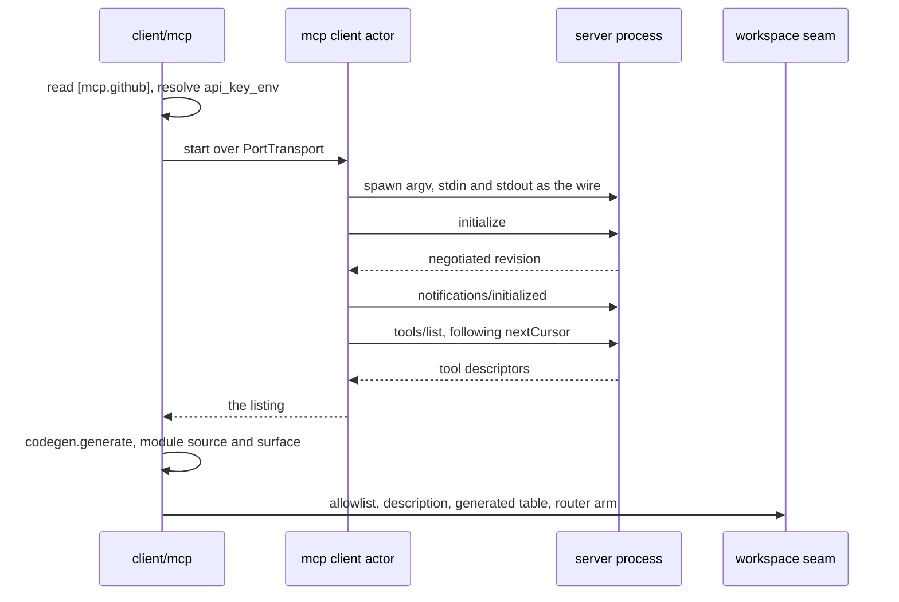
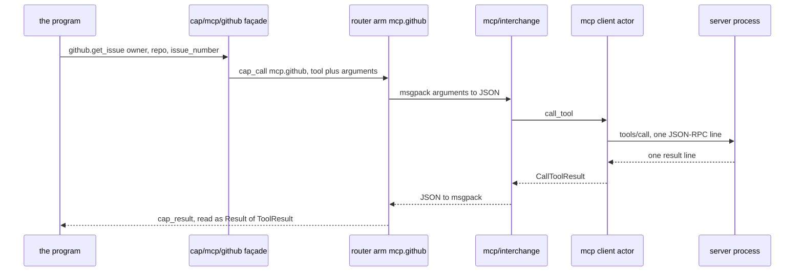
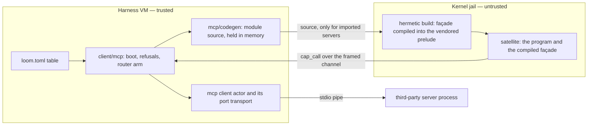

# MCP

An MCP server — Model Context Protocol — is somebody else's program,
speaking JSON-RPC 2.0 down a pipe and offering tools it would like a
model to call. Loom's client side of that arrangement is two pieces:
`packages/mcp` holds the protocol codecs, the actor that owns one server
process, the generator that turns a tool listing into Gleam, and the
value translation between the two wires; `client/mcp` is the harness
wiring that reads the configuration, starts a client per server, and
answers capability calls out to them.

One decision shapes everything else in this document. **A server's tools
reach a model only through code mode, as one generated Gleam module per
server.** A program calls `github.create_issue(...)` after writing
`import cap/mcp/github`, and by no other route: nothing about MCP is a
registered harness tool, and there is no generic
`invoke(server, tool, args)` a program can reach. What follows is that
decision's mechanism — the boot path that *generates* each server's
module, the jailed build that *compiles* it, the hostile-input posture
the generator is built around, the wire one call travels, and what v1
deliberately does not do. `docs/architecture/code-mode.md` carries the
vetting theorem this all rests on and the pipeline the generated modules
are compiled into; this document assumes it rather than restating it.

## One module per server

Code mode's bound is a source-level one: a Gleam program's maximal
capability set is the transitive closure of its imports plus its own
`@external` declarations, so vetting reads the import list and knows what
the program can do. Two shapes were available for reaching an MCP server
from inside that bound, and the difference between them is not whether
the theorem survives.

A generic dispatcher — `cap/tools.invoke(name, args)`, one module every
program may import — does not falsify the theorem. Vetting would still
compute a correct upper bound. The bound would just be *the whole
registry, for every program*, so the import list would stop sorting
programs into capability classes and the broker's per-call check would
be the only thing left discriminating between them. That is one layer
where code mode was built to have two, and the loss would be invisible:
every program still vets, and every program is trusted with every server.

Per-server modules keep the discrimination. The vetting allowlist names
one module per configured server, so a program that imported
`cap/mcp/github` was handed that server and no other, visibly, in its
first few lines. The granularity is the one a human actually reasons
about — nobody vets three hundred tools one at a time, and an operator
who adds a server to `loom.toml` is making exactly one trust decision.

Two structural facts hold the shape in place.

**The marshaling seam is unimportable.** Every generated façade is a
name, a signature, and one call to `cap/internal/mcp.invoke`, which
builds the capability name `"mcp." <> server` and the argument map. Gleam
forbids another package from importing an internal module, so a program
cannot name `invoke` and dispatch to a server string of its own — which
would be the generic dispatcher by the back door, and would collapse
per-server trust to "any server the router knows".

**A module costs what a module costs.** A registered tool renders into
the provider's cached prefix and is paid on every request of every
strand, so a registry-per-tool design scales its cost with the server's
tool count. A generated module renders its surface once, the way
`cap/proc` does, whether the server lists three tools or three hundred.
The scaling lever is therefore which servers an operator enables, not
model-side discovery, which is why Loom builds no tool search:
`docs/design-notes/tool-search-and-code-mode.md` has the arithmetic, and
its MCP half is superseded by what shipped.

## From a table to a callable module

An operator writes one table per server in `loom.toml`, and that is the
whole configuration surface — no CLI flag, no auto-discovered project
file, no live reload:

```toml
[mcp.github]
command = ["mcp-server-github", "--stdio"]
api_key_env = "GITHUB_TOKEN"
```

The table key is load-bearing three times over: it is the `<name>` in the
`cap/mcp/<name>` module a program imports, the `<server>` in the
`mcp.<server>` capability the call travels under, and the catalogue key
an operator reads a refusal against. So `client/catalog` holds it to a
single lowercase-ASCII identifier segment (`[a-z][a-z0-9_]*`), judged by
the same grammar gate vetting holds every import to, and additionally
refuses any key the generator's name mangler would rewrite — a keyword, a
doubled or trailing underscore, anything past 32 characters. On every
config-legal key, mangling is the identity, which is what makes the
promise that `[mcp.github]` yields `cap/mcp/github` provable rather than
usually true. `internal` is refused by name, because `cap/mcp/internal`
would sit confusingly beside the unimportable marshaling layer.

`command` is argv with the executable first, never a shell string.
`api_key_env` names an environment *variable*, never a key: the value is
read from the harness's own environment at spawn through the same
`provider/secret` seam every other configured secret goes through, put
into the child's environment under the same name, and stored in no
record, no log line, and no refusal message. A configured variable that
is unset refuses that server before anything is spawned, because a server
started without the key it was configured with fails later, further away,
and in the server's own words.

### Generation happens once, at boot

`client/mcp.start` walks the configured servers in catalogue order and
does four things per server, in this order:

1. **Resolve the secret**, as above, before any process exists.
2. **Spawn and hand-shake.** The client actor is started over
   `mcp/transport.PortTransport` — a child OS process on an Erlang port,
   stdin and stdout as the wire — and sends `initialize` asking for
   revision 2025-06-18, accepting `2025-03-26` and `2024-11-05` and
   refusing anything else, then `notifications/initialized`.
3. **List the tools.** `tools/list`, following `nextCursor` for at most
   64 pages, under one budget for the whole listing (30 seconds by
   default).
4. **Generate the module.** `mcp/codegen.generate` turns the listing into
   a `Generated(module_name, source, surface)`: the `cap/mcp/<name>`
   module's Gleam *source text*, and the rendered description surface the
   `code_mode` tool carries for it. No compiler runs here. The source is
   held in memory, as part of the session's MCP layer, until an execution
   asks for it.

One server's boot, from its table to the four things its module widens:



The client stays running for the life of the session, because dispatch
is the same client. Every step is a place a third party can fail, and
each failure refuses *that server* — one `mcp.unavailable` log line
naming the server and the reason, the client torn down behind it, and
the boot continuing without it. That line is not decoration: a refused
server has no module, so a program importing it is rejected by vetting
with no word about why the module is absent, and the line is the only
place an operator will ever see the cause. A layer that reached at least
one server logs `mcp.ready` with each server's name and tool count.

A host that registers no `code_mode` tool starts no MCP server at all.
Since a server's tools are only ever a module a program may import, a
host with nothing that could import one would be spending process and
attack surface on a capability nobody can reach.

### What one field widens

The layer reaches code mode as a single `Config.mcp` field, and a server
in it widens four things together:

| What widens | With what |
|---|---|
| The vetting **allowlist** | `cap/mcp` plus one `cap/mcp/<server>` per server (`client/codemode.seam_allowlist`) |
| The rendered **description** | each server's surface, as the seam offer's extra surfaces |
| The **generated table** the hermetic build takes | `#(module name, source)` per server |
| The capability **router** | one `mcp.<server>` arm per server |

They are one field for the reason the code-mode surface is one field: a
host that could set them apart would eventually set them apart, and each
pair that drifted would be its own failure — a module the model was told
about and vetting rejects, or a module vetting admits and the build never
writes. The **orchestration seam is widened by none of it, ever.** Which
capabilities travel together is the whole of what the two-seam split
buys, and an orchestrator that could also call out to a third-party
server is a materially worse thing to hand a model than one that cannot.

## Generated at boot, compiled per execution

A server's module is *generated* once and *compiled* many times, and the
two verbs run at different times, in different places, under different
rules. Collapsing them into one is the commonest way to misread this
subsystem.

**Generation** turns a server's `tools/list` JSON into Gleam *source
text*. It runs in the harness VM, at boot, once per configured server. No
compiler is involved: `mcp/codegen.generate` renders text, and the text
stays in memory as part of the session's MCP layer.

**Compilation** turns that text into loadable BEAM modules. It runs
inside the jailed hermetic build of one code-mode execution, and only
when the vetted program imported `cap/mcp/<server>`.

| | Generation | Compilation |
|---|---|---|
| When | once at boot | once per execution |
| For which servers | every one configured | only the ones the program imported |
| Where | the harness VM | the network-off jail around the build |
| What runs | `mcp/codegen.generate` | `gleam build --warnings-as-errors` |
| What comes out | source text and a rendered surface, held in memory | the compiled façade, inside that execution's artifact |
| What a server nobody imports costs | one generation at boot | nothing |

Between the two verbs sit a filter and a write.

**The filter.** `codemode.execute` narrows the host's whole table of
generated modules to the vetted program's own import list before the
compile service sees it, so a program that named one server pays for one
and a program that named none pays for nothing. The narrowing is a cost
filter and not an authorization one — what a program may import was
already decided by the allowlist.

**The write.** The builder writes each surviving module into the build
root *after* the seed clone and *before* `gleam build`, and both halves
of that ordering are forced. Cloning the seed replaces `vendor/`
wholesale, so a module written earlier is deleted; `gleam build` reads
the package off disk once, so a module written later arrives too late.
Where the module lands is forced too. It goes
*inside* the vendored prelude's own source tree —
`vendor/cap/src/cap/mcp/<server>.gleam` — because a façade calls
`cap/internal/mcp.invoke` and Gleam admits an internal module only to its
own package.

So a generated façade compiles in the same network-off jail as the
program that imports it, from source the harness wrote and never
compiled. The seed every build root is cloned from holds no generated
module at all; each one is written fresh into a build root created for
that execution.

## What the model reads, and what it writes

A model writing a code-mode program authors blind: no autocomplete, no
hover, no language server. The rendered surface is therefore the whole
oracle, and it is part of the `code_mode` description the model has
before it writes a line. For the three-tool fixture server the client
package's end-to-end runs against, configured as `[mcp.fixture]`, the
surface opens like this:

```
### cap/mcp/fixture
`cap/mcp/fixture` — the tools of the MCP server "fixture", as typed calls.
Descriptions below are the server's own text, not Loom's.
Optional parameters travel in `options` by wire name, e.g.
`options: [#("page", report.int(2))]`; pass `[]` when none.

/// Echoes the arguments it was called with, verbatim.
///
/// Tool "echo_args" on MCP server "fixture". Optional parameters travel in
/// `options` by wire name; pass [] when none.
/// - message: wire "message", string. the text to echo
/// - "tag" (optional): an optional label
pub fn echo_args(message: String, options: List(#(String, report.Value))) -> Result(mcp.ToolResult, mcp.McpError)
```

Three things a reader should take from those lines. The first paragraph
of each block is the *server's* description, quoted and capped, and the
surface says so rather than letting a model read third-party prose as
Loom's. Every required parameter is a labelled Gleam argument whose wire
name is stated beside it. Every optional parameter rides in one
`options` list keyed by wire name, so it is discoverable without costing
a signature.

A program written against that surface looks like any other code-mode
program. This one is the shape the client package's live suite submits,
with one extra branch:

```gleam
import cap/mcp
import cap/mcp/fixture
import cap/report
import gleam/option
import gleam/result

pub fn main() -> report.Outcome {
  case
    fixture.echo_args(
      message: "loom-mcp-wire-fidelity",
      options: [#("tag", report.string("Tag-With_Mixed.Case"))],
    )
  {
    Ok(found) -> report.text(mcp.text(found) <> " " <> echoed(found))
    Error(mcp.ToolFailed(message:, content: _content)) ->
      report.failure("the tool ran and refused: " <> message)
    Error(mcp.ServerUnavailable(reason: reason)) ->
      report.failure("the server never answered: " <> reason)
    Error(_other) -> report.failure("the mcp call did not settle")
  }
}

/// What the server echoed back as structured content, read field by field.
fn echoed(found: mcp.ToolResult) -> String {
  let read = {
    use echo_of <- result.try(option.to_result(found.structured, Nil))
    use message <- result.try(report.field(echo_of, "message"))
    use message <- result.try(report.as_string(message))
    Ok("echoed=" <> message)
  }
  case read {
    Ok(rendered) -> rendered
    Error(Nil) -> "the structured echo carried no message"
  }
}
```

Four details are worth naming, because each is a property rather than a
style choice. The import list is the permission grant: this program was
handed the `fixture` server and nothing else, and it can touch neither
the disk nor the network nor a process. Arguments are built with
`cap/report`'s value builders, which is the one structured-value
vocabulary every seam already carries, so an MCP argument map is composed
the way an `Outcome` is. `ToolFailed` and `ServerUnavailable` are
genuinely different events — the first is a *tool* verdict on a call that
settled, the second is a call that never reached a tool — and nothing
below the program can tell them apart for it. Label shorthand in the patterns
is ordinary Gleam syntax and passes through the same vetter as every other
submitted construct.

## A worked example: an issue triage pass

The program below does a chore no single tool call expresses. It reads
every open issue in a repository, classifies each one, notices titles
that repeat, and answers with counts and the duplicate pairs. Ten open
issues make it eleven `tools/call`s — one listing plus one fetch per
issue — and eleven issue bodies. As tool calls that is eleven round trips
and eleven bodies landing in the conversation. As a program it is one
execution answering with four numbers, a list of pairs, and a reference
to a table the model can fetch if it wants one.

### The surface it was written against

Every signature below is generated output rather than prose written for
this document. `packages/mcp/test/mcp/fixtures/github.gleam` is a
checked-in ten-tool `tools/list` from a GitHub-shaped server, and
`codegen_test` generates a module from it and pins the surface against
that module. Configured as `[mcp.github]`, the fixture renders what
follows, exactly as the `code_mode` description carries it. Two of the
ten tools are excerpted; the program calls only these two.

```
### cap/mcp/github
`cap/mcp/github` — the tools of the MCP server "github", as typed calls.
Descriptions below are the server's own text, not Loom's.
Optional parameters travel in `options` by wire name, e.g.
`options: [#("page", report.int(2))]`; pass `[]` when none.

/// Get details of a specific issue in a GitHub repository.
///
/// Tool "get_issue" on MCP server "github". Optional parameters travel in
/// `options` by wire name; pass [] when none.
/// - owner: wire "owner", string. Repository owner
/// - repo: wire "repo", string. Repository name
/// - issue_number: wire "issue_number", integer. The number of the issue
pub fn get_issue(owner: String, repo: String, issue_number: Int, options: List(#(String, report.Value))) -> Result(mcp.ToolResult, mcp.McpError)

/// List issues in a GitHub repository with filtering options.
///
/// Tool "list_issues" on MCP server "github". Optional parameters travel in
/// `options` by wire name; pass [] when none.
/// - owner: wire "owner", string. Repository owner
/// - repo: wire "repo", string. Repository name
/// - "state" (optional): Filter by state
/// - "labels" (optional): Filter by labels
/// - "sort" (optional): Sort order
/// - "direction" (optional): Sort direction
/// - "since" (optional): Filter by date (ISO 8601 timestamp)
/// - "page" (optional): Page number
/// - "perPage" (optional): Results per page
pub fn list_issues(owner: String, repo: String, options: List(#(String, report.Value))) -> Result(mcp.ToolResult, mcp.McpError)
```

A signature says what a tool *takes*. Nothing in it says what the tool
answers: MCP describes a tool's input schema, and `structuredContent`
crosses this client raw and uninterpreted. So the way this program reads
a result — `list_issues` answers with an `issues` array, `get_issue` with
an object carrying `title` and `body` — is an assumption about the
server, and it is written as one. Every read goes through `cap/report`'s
total readers, and a missing field becomes a reported failure rather than
a crash.

One honest limit before the code: no suite runs this program, the way
`packages/codemode/test` runs
`docs/examples/stale_symbol_sweep.gleam` verbatim. What a suite pins here
is the surface above.

### The program

```gleam
import cap/actor
import cap/mcp
import cap/mcp/github
import cap/report
import cap/task
import gleam/bool
import gleam/dict
import gleam/int
import gleam/list
import gleam/option
import gleam/result
import gleam/string

/// The repository being triaged.
const owner = "loom-lang"

const repo = "loom"

/// What makes an issue a bug report or a question. Plain string rules,
/// computed here: a code-mode program has capabilities, not a model.
const bug_words = ["crash", "panic", "traceback", "regression", "stack trace"]

const question_words = ["how do i", "how to", "is it possible", "question"]

const noise_words = ["a", "an", "the", "in", "on", "when", "with", "error"]

type Class {
  Bug
  Feature
  Question
}

/// One issue, after its body has been read and classified. The body
/// itself stays in the program.
type Triaged {
  Triaged(
    number: Int,
    title: String,
    class: Class,
    duplicate_of: option.Option(Int),
  )
}

/// The dedup index: the first issue seen under each normalized title,
/// and every later collision as a pair.
type Index {
  Index(first_seen: dict.Dict(String, Int), duplicates: List(#(Int, Int)))
}

/// The one message the index takes: claim a title for an issue, and
/// learn which issue already held it.
type Claim {
  Claim(key: String, number: Int, reply: actor.Reply(option.Option(Int)))
}

pub fn main() -> report.Outcome {
  case triage() {
    Ok(outcome) -> outcome
    Error(reason) -> report.failure(reason)
  }
}

fn triage() -> Result(report.Outcome, String) {
  use listed <- result.try(
    github.list_issues(owner: owner, repo: repo, options: [
      #("state", report.string("open")),
      #("perPage", report.int(100)),
    ])
    |> result.map_error(explain),
  )
  use numbers <- result.try(issue_numbers(listed))
  use index <- result.try(
    actor.spawn(Index(first_seen: dict.new(), duplicates: []), remember)
    |> result.replace_error("the dedup index would not start"),
  )
  use triaged <- result.try(
    task.parallel_map(numbers, max_concurrency: 4, with: fn(number) {
      classify_one(index, number)
    })
    |> result.map_error(first_failure),
  )
  use final <- result.try(
    actor.get(index, timeout: 5000)
    |> result.replace_error("the dedup index did not answer"),
  )
  actor.shutdown(index)
  Ok(summarize(triaged, final.duplicates, emit_detail(triaged)))
}

/// One issue, start to finish: fetch it, classify it, and claim its
/// title against the shared index. Runs once per issue, four at a time.
fn classify_one(
  index: actor.Address(Index, Claim),
  number: Int,
) -> Result(Triaged, String) {
  use found <- result.try(
    github.get_issue(
      owner: owner,
      repo: repo,
      issue_number: number,
      options: [],
    )
    |> result.map_error(explain),
  )
  use issue <- result.try(structured(found))
  let title = text_field(issue, "title")
  use first <- result.try(
    actor.call(
      index,
      fn(reply) { Claim(key: normalize(title), number: number, reply: reply) },
      timeout: 5000,
    )
    |> result.replace_error("the dedup index did not answer"),
  )
  Ok(Triaged(
    number: number,
    title: title,
    class: classify(title, text_field(issue, "body")),
    duplicate_of: first,
  ))
}

/// The index's handler. Concurrent workers all call it; it runs their
/// claims one at a time, which is what makes "first seen" mean anything.
fn remember(state: Index, message: Claim) -> actor.Next(Index) {
  case message {
    Claim(key: key, number: number, reply: reply) ->
      case dict.get(state.first_seen, key) {
        Ok(first) -> {
          actor.reply(reply, option.Some(first))
          actor.continue(
            Index(..state, duplicates: [#(first, number), ..state.duplicates]),
          )
        }
        Error(Nil) -> {
          actor.reply(reply, option.None)
          actor.continue(
            Index(
              ..state,
              first_seen: dict.insert(state.first_seen, key, number),
            ),
          )
        }
      }
  }
}

/// Bug, feature, or question, decided from the issue's own words.
fn classify(title: String, body: String) -> Class {
  let text = string.lowercase(title <> " " <> body)
  use <- bool.guard(when: mentions(text, bug_words), return: Bug)
  use <- bool.guard(when: mentions(text, question_words), return: Question)
  Feature
}

fn mentions(text: String, words: List(String)) -> Bool {
  list.any(words, fn(word) { string.contains(text, word) })
}

/// A title reduced to its content words, so "Crash on startup" and
/// "The crash on startup" claim the same key.
fn normalize(title: String) -> String {
  string.lowercase(title)
  |> string.replace(each: "-", with: " ")
  |> string.split(" ")
  |> list.filter(fn(word) { word != "" && !list.contains(noise_words, word) })
  |> string.join(" ")
}

/// The per-issue table, written to the blob store rather than to the
/// conversation. The `Outcome` carries only its reference.
fn emit_detail(triaged: List(Triaged)) -> report.Value {
  let rows = csv(triaged)
  let table = <<rows:utf8>>
  case report.emit(name: "detail.csv", content_type: "text/csv", bytes: table) {
    Ok(reference) -> report.string(reference.id)
    Error(report.EmitDenied(code: code, message: _message)) ->
      report.string("not emitted: " <> code)
    Error(report.EmitUnavailable(reason: _reason)) ->
      report.string("not emitted: the channel could not carry it")
  }
}

fn csv(triaged: List(Triaged)) -> String {
  list.map(triaged, fn(item) {
    int.to_string(item.number)
    <> ","
    <> class_name(item.class)
    <> ","
    <> item.title
  })
  |> string.join("\n")
}

fn class_name(class: Class) -> String {
  case class {
    Bug -> "bug"
    Feature -> "feature"
    Question -> "question"
  }
}

/// The counts, the duplicate pairs, and the artifact reference — the
/// only things that leave the satellite.
fn summarize(
  triaged: List(Triaged),
  duplicates: List(#(Int, Int)),
  detail: report.Value,
) -> report.Outcome {
  let originals =
    list.filter(triaged, fn(item) { item.duplicate_of == option.None })
  report.value(
    report.object([
      #("scanned", report.int(list.length(triaged))),
      #("bug", report.int(count(originals, Bug))),
      #("feature", report.int(count(originals, Feature))),
      #("question", report.int(count(originals, Question))),
      #("duplicates", report.list(list.map(duplicates, pair_value))),
      #("detail", detail),
    ]),
  )
}

fn count(triaged: List(Triaged), class: Class) -> Int {
  list.count(triaged, fn(item) { item.class == class })
}

fn pair_value(pair: #(Int, Int)) -> report.Value {
  report.object([
    #("first", report.int(pair.0)),
    #("later", report.int(pair.1)),
  ])
}

/// The issue numbers `list_issues` answered with.
fn issue_numbers(listed: mcp.ToolResult) -> Result(List(Int), String) {
  use payload <- result.try(structured(listed))
  use issues <- result.try(
    report.field(payload, "issues")
    |> result.try(report.as_list)
    |> result.replace_error("list_issues answered with no `issues` array"),
  )
  Ok(
    list.filter_map(issues, fn(issue) {
      report.field(issue, "number") |> result.try(report.as_int)
    }),
  )
}

fn structured(found: mcp.ToolResult) -> Result(report.Value, String) {
  option.to_result(
    found.structured,
    "the server answered without structured content: " <> mcp.text(found),
  )
}

fn text_field(value: report.Value, key: String) -> String {
  report.field(value, key)
  |> result.try(report.as_string)
  |> result.unwrap("")
}

/// Why a triage pass stopped, in the program's own words.
fn explain(error: mcp.McpError) -> String {
  case error {
    mcp.ToolFailed(message:, content: _content) ->
      "the tool ran and refused: " <> message
    mcp.ServerUnavailable(reason: reason) ->
      "the server never answered: " <> reason
    mcp.McpDenied(code:, message:) ->
      "the call was denied as " <> code <> ": " <> message
    mcp.ResultMalformed(reason: reason) ->
      "the answer did not decode: " <> reason
  }
}

fn first_failure(failures: List(task.Failure(String))) -> String {
  case failures {
    [task.Returned(index: _index, error: error), ..] -> error
    [task.Crashed(index: number, reason: reason), ..] ->
      "classifying issue " <> int.to_string(number) <> " died: " <> reason
    [] -> "the triage pass produced no result"
  }
}
```

### The import list is the permission grant

Five capability modules and seven standard-library ones. This program can
call the `github` server's tools, fan work out under `cap/task`, keep one
`cap/actor`, and return an outcome or emit an artifact. It cannot read a
file, run a process, open a socket, or reach a *second* MCP server:
`cap/fs`, `cap/proc`, `cap/net` and every other `cap/mcp/<server>` are
absent, vetting confirmed the absences before the program compiled, and
the hermetic build's dependency table leaves the compiler nothing else to
resolve. `cap/mcp` carries no authority of its own — it is the result and
error vocabulary the façade's signatures are written in — so the one line
that grants anything is `import cap/mcp/github`.

### Where the concurrency bounds come from

`max_concurrency: 4` is the program's own bound, and the program may
raise it freely. Three bounds it cannot raise sit underneath.

- **The pooled outstanding-effect cap**, applied by the satellite host
  before any plan is served. It is one cap for the whole execution, so a
  program that asked for four hundred does not get four hundred
  concurrent calls.
- **This seam's 60-second call timeout**, per `tools/call`, deliberately
  below the host's 120-second one so a program that asked a server a
  question is answered `mcp_timeout` rather than left waiting.
- **The execution's wall deadline**, over everything at once. On expiry
  the satellite dies as a unit — the fan-out, the index actor, and the
  program root together.

Each fetch is its own `cap_call`, routed and checked on its own, drawing
on that one pooled budget. So raising `max_concurrency` buys breadth
inside the program and no additional footprint outside it, which is the
property that makes fanning out safe to hand a model.

### What the actor buys over a fold

A sequential fold over the issues could carry the same index in an
accumulator, and would be shorter. It would also fetch the issues one at
a time, and fetching is the slow part. Once four workers run at once,
four processes need to read and update one index, and "first seen" has to
mean something definite.

`cap/actor` is what makes it mean something. Four `actor.call`s land as
four messages in one bounded mailbox, the handler runs them one at a
time, and each worker gets back either `None` — it was first — or
`Some(number)` naming the issue that already held the title. No lock, no
shared mutable value, and no second pass over the results: by the time
`parallel_map` returns, the duplicate pairs are already in the index, and
`actor.get` reads them out. That is the case `cap/actor` exists for —
ongoing state driven by concurrent input — rather than state one loop
could have threaded.

One structural detail is worth knowing at this spawn site. `main` spawns
the index, so the actor is linked to the program root and an abnormal
crash fails the execution as a unit. An actor spawned *inside* a
`parallel_map` branch would be linked to that branch's worker instead,
and its crash would be contained to the branch;
`docs/architecture/code-mode.md` has the whole of that rule.

### What crosses the wire, and what stays inside

Per issue, exactly one `tools/call` goes out —
`{tool: "get_issue", arguments: {owner, repo, issue_number}}` — and one
result comes back carrying the whole issue: title, body, labels, author,
timestamps. That result reaches the program and stops there.
`string.lowercase`, `string.contains` and the three word lists run inside
the satellite, and the bodies stay there and die with it.

What leaves is the object `summarize` builds: four counts, the duplicate
pairs, and one artifact reference. The per-issue table goes out through
`report.emit` into the session's blob store, so the model can fetch the
detail deliberately instead of paying for it by default. An ordinary MCP
tool call cannot make that distinction — its whole result becomes context
by construction — and closing that gap is what code mode is for.

The classification is honest string work, and that is a constraint rather
than a simplification. A code-mode program holds capabilities, not a
model, and no capability asks a model a question: the prelude declares
none, and a program reaches exactly what the broker routes. A triage that
wants real judgment returns the titles and asks in the next turn — a
second round trip, taken on purpose, rather than a model call smuggled
inside a jailed program.

## `tools/list` is attacker-controlled input

A server's listing is JSON the harness did not write, and the generator
turns it into Gleam source the harness compiles and the vetting allowlist
admits. That is the sharp edge of the whole feature. The posture that
holds it is one governing rule, three mechanisms that carry it out, and
two sets of bounds.

**The generator's discretion is names and signatures only, never
marshaling.** Every façade it emits is a doc comment, a `pub fn` header,
and one call to `cap/internal/mcp.invoke`; the marshaling — building the
argument map, encoding it, decoding the pinned result, mapping a denial
onto `cap/mcp`'s error vocabulary — lives in that one internal module,
written once by hand. Server-influenced text therefore reaches a
generated module as *identifiers and literals* and never as code that
touches the wire.

**Wire identity never bends.** Every generated body closes over the
original tool name and the original parameter names as escaped string
literals. `mcp/name`'s output is a display artifact, and escaping is
total: `\` and `"` are escaped and every codepoint outside printable
ASCII is emitted as `\u{...}`, so a literal can never carry a raw
newline, a control character, or a bidi override. Whenever mangling
changed anything at all — or the name ran past 32 characters — the result
carries `_` plus the first eight hex characters of a SHA-256 digest of
the original, so two names that differ only in shape cannot silently
become one function. A residual collision after that is engineered rather
than accidental, and the generator refuses the whole server naming both
originals instead of repairing it.

Worked, against the names the checked-in fixture server lists, plus one
name it does not:

| Original, on the wire | Generated Gleam name | What the body sends |
|---|---|---|
| `echo_args` | `echo_args` — mangling changed nothing, so no digest | `"echo_args"` |
| `Create-Issue!` | `create_issue_48f762e0` | `"Create-Issue!"` |
| `Target-Repo` (a parameter of `nested`) | label `target_repo_bc64ccdd` | `#("Target-Repo", …)` |
| `createIssue` (not on this server) | `create_issue_706a5e2e` | `"createIssue"` |

The last row is there for the pairing: `Create-Issue!` and `createIssue`
both mangle to `create_issue`, and the eight digest characters are the
whole of what keeps them two functions rather than one. The generated
function for the second row reads:

```gleam
/// A tool whose name is no Gleam identifier.
///
/// Tool "Create-Issue!" on MCP server "fixture". Optional parameters travel
/// in `options` by wire name; pass [] when none.
/// - title: wire "title", string.
pub fn create_issue_48f762e0(
  title title: String,
  options options: List(#(String, report.Value)),
) -> Result(mcp.ToolResult, mcp.McpError) {
  internal.invoke(
    "fixture",
    "Create-Issue!",
    report.object(list.append(
      [
        #("title", report.string(title)),
      ],
      options,
    )),
  )
}
```

**Server prose stays inside the comment line it was written into.**
`codegen.sanitize` replaces every control and direction-changing
codepoint with a space — C0 and C1 controls, the bidi overrides and
isolates, zero-width characters, the tag-character plane — and caps a
tool description at 400 characters and a parameter note at 120. Every
comment line the generator emits begins `/// `, and every line break
comes from the generator's own word wrap rather than from the server's
text, whose breaks the sanitizer already flattened.

**A backstop proves the other two held.** After rendering,
`codegen.scan_for_at` walks the source and fails generation if a single
`@` appears outside a comment or a string literal. Generated code needs
no attribute at all, so a stray `@` means the sanitizer failed — and
`@external` is exactly the payload a hostile listing would want, since it
is Gleam's one bridge to arbitrary Erlang. The generator refuses the
server loudly rather than hand the compiler an attribute.

### Every schema settles, and no parameter is dropped

`mcp/schema.plan` is the one place a tool's raw `inputSchema` is read,
and it has no error case: tier 3 *is* its failure mode, carried as data.
Each required parameter lands in one of three tiers.

| Tier | What lands there | What the façade takes |
|---|---|---|
| 1 | `string`, `integer`, `number`, `boolean`, or an array of those | a typed Gleam argument (`String`, `Int`, `Float`, `Bool`, `List(...)`) |
| 2 | a nested object, a `$ref`, an `anyOf`, a missing type, or a `required` name with no `properties` entry | a required `report.Value` argument, with the reason in its doc line |
| 3 | an unusable top level — the whole `inputSchema` is not an object schema | one `arguments: report.Value` holding the entire map |

Optional parameters are never typed arguments: they travel in the single
`options` list keyed by their original wire name, and appear in the doc
comment so a model knows they exist. Nothing is silently dropped at any
tier — a `required` name the server never declared becomes a tier-2
argument carrying that as its reason, because dropping a parameter is the
one thing this reading must never do.

The subset is deliberately narrow, and the falsifier for that choice is
written into `codegen_test`: measured against a plausible GitHub-shaped
listing, 30 of 31 required parameters land in tier 1, and if mainstream
servers ever push tier 2 past 25% of required parameters, that is the
trigger to widen the subset and generate nested records.

### Ceilings, and what each one costs a hostile server

| Bound | Value | What happens past it |
|---|---|---|
| tools in one listing | 256 | the server is refused whole |
| rendered surface | 64 KiB after truncation | the server is refused whole |
| `tools/list` pages | 64 | `TooManyPages`; the listing fails |
| one JSON-RPC line | 16 MiB | `LineTooLong`, and the client latches dead |
| one `cap_result` | the cap channel's frame cap, less a 64 KiB envelope margin | the call is refused `mcp_malformed` |
| result nesting | msgpack's `max_depth`, less the two containers the frame adds | the call is refused `mcp_malformed` |

Two refusals are narrower than the rest by design. A residual *tool* name
collision refuses the server; a *label* collision inside one tool degrades
that one function to its tier-3 whole-value form and leaves the rest of
the server typed. And the result ceilings are measured in `client/mcp`,
at the point where the answer is still a refusal a program can read: an
oversized frame dropped further down would leave the program blocked
until its wall deadline, and an over-deep one would settle every
in-flight call and close the channel — one hostile answer costing the
whole execution instead of one call.

## The wire

A call from a generated façade is a capability call like any other.
`cap/internal/mcp.invoke` sends it under the capability name
`"mcp." <> server` with the arguments
`{tool: <the server's original name, verbatim>, arguments: <the map>}`,
and the harness answers with the pinned result shape
`{content: [<block>...], is_error: Bool, structured?: <value>}`, whose
`structured` key is present only when the server sent one.

The plan is `satellite.ServedHere`, exactly as the orchestration seam's
is: the harness answers over a socket it already owns, building no
`CallSpec`, entering no jail, composing no policy. There is nothing to
compose a policy *for* — the call spawns no process and touches no path.
What bounds it instead is the pooled outstanding-effect cap the satellite
host applies before any plan is served, the execution's wall deadline,
and this seam's own 60-second call timeout, which sits deliberately below
the host's 120-second one so a program that asked a server a question
gets a refusal rather than a silence.

The arguments are converted to JSON at plan time rather than after
dispatch, so a value this wire cannot carry is refused before a round
trip that could not have happened.

Where each hop of one call runs — the program is inside the jail, the
router and everything right of it is in the harness VM, and the server is
outside both:



### What a program reads back

| In-band code | Raised when | What `cap/mcp` makes of it |
|---|---|---|
| `mcp_unavailable` | the client is dead — the child exited, framing broke, the bytes stopped being UTF-8 | `ServerUnavailable(reason)` |
| `mcp_timeout` | `tools/call` did not settle inside the seam's call timeout | `McpDenied("mcp_timeout", …)` |
| `mcp_malformed` | the answer was not the shape the method promises, or would not cross to the capability wire | `McpDenied("mcp_malformed", …)` |
| `jsonrpc_<code>` | the server answered a JSON-RPC error; `-32601` arrives as `jsonrpc_-32601` | `McpDenied(code, message)` |
| `unsupported_cap` | `mcp.<server>` naming a server this host never configured | `McpDenied(...)` |
| `invalid_argument` | the call's own `{tool, arguments}` could not be read, or the arguments do not cross to JSON | `McpDenied(...)` |

Two outcomes are not denials at all. A call that settled with
`is_error: true` is a *tool* verdict, and reaches the program as
`ToolFailed(message, content)`. A `cap_result` that does not match the
pinned shape is `ResultMalformed`. The server's own JSON-RPC code travels
in the string rather than being folded onto one name, because it is the
one fact a program could branch on.

### Two vocabularies that disagree

`mcp/interchange` is the translation between the capability wire
(msgpack) and the MCP wire (JSON), total in both directions: every input
settles as a converted value or as a fault naming the path it was found
at, never a crash and never a silent substitution. Four rules cover the
disagreements, and each was a choice:

- **A msgpack integer always fits JSON**, since `core/json.Int` is
  arbitrary precision. The asymmetry runs the other way.
- **A JSON integer outside `[-2^63, 2^64 - 1]` fails the whole
  conversion** rather than being wrapped, clamped, or turned into a
  float. A program reading a wrapped integer would act on a number the
  server did not send.
- **A msgpack binary is refused in an argument.** JSON has no byte
  string, and both encodings a caller might expect — base64 text, an
  array of integers — are guesses about what the server wants.
  `cap/report`'s builders cannot construct one, so this is unreachable
  from a vetted program.
- **`NilValue` and `Null` are each other**, and a non-string map key is
  refused, because inventing a rendering for one would change what the
  server is asked.

Floats cross unchanged both ways. Depth needs no ceiling here: both
parsers already bound nesting at the same `max_depth`, so a value
arriving is shallow enough for the encoder on the far side.

## What runs where

Three regions, and the boundaries between them are the point. Which
region holds which piece, and what each one has to trust:



**In the harness VM:** one client actor per server, its port transport,
and the router arm. The actor owns the child process for the session,
handles the handshake, holds one deadline per in-flight call, and answers
`Unavailable` in band once it is dead. It never restarts a peer and it is
never `process.call`ed — every public call is a monitored
send-and-select, because `process.call` panics on a timeout and on a dead
callee, and a caller holding a tool-call verdict must not die of a wedged
client. The declared client capabilities are an **empty object**, and a
test pins the emptiness: no `sampling` (a server must not spend Loom's
model), no `roots` (a server learns nothing about the filesystem), no
`elicitation` (a server must not put questions to a human through the
harness). A server-initiated request is answered with JSON-RPC's
method-not-found; a notification is decoded and dropped.

**Inside the satellite:** the generated façades, compiled into the
vendored prelude of that execution's hermetic build, running under the
same jail and the same pooled budget as everything else a code-mode
program does. The façade holds no socket and no server handle — it
marshals and calls, and the capability channel carries it out.

**On the child's own stdio:** the server. Its stderr is deliberately not
merged into stdout, because `stderr_to_stdout` would interleave
diagnostics into the newline-delimited JSON-RPC stream and corrupt
framing; the child inherits the BEAM's stderr instead, so a server's
complaints land on the harness's own.

### The spawn is a primitive, and the jail is an open decision

`mcp/client` is written against `mcp/transport.Transport` and nothing
lower. `PortTransport` is the production mechanism and it spawns
**unjailed**; `ChannelTransport` is the test seam — an in-process peer
that receives the connect, sees every outbound line, and delivers inbound
bytes through the same messages a port does, which is why every client
behaviour is provable without an OS process.

Whether an MCP server should run inside a jail at all — through the
`loom-exec` helper, the way every other third-party process Loom starts
does — is an **open decision rather than a deferred implementation**. It
has not been designed, not merely not built. The seam is where the answer
would attach, and it exists so that the answer can land without rewriting
the actor. Until then, an unjailed spawn is the production primitive and
not the final security posture; the threat model in
`docs/architecture/effects.md` already counts a compromised third-party
tool among the things defended against, and this is the place that
defense is currently owed. **#109** carries the decision, and
`docs/next.md` records it as open.

## What v1 leaves out

Everything below is refused rather than deferred by accident, and each
line says what would bring it back.

| Absent | Why | What would reverse it |
|---|---|---|
| Resources, prompts, logging, progress, cancellation, completion | each is surface a hostile server could push data through, and a tool-calling client needs none of it | a capability that actually needs one, argued on its own |
| Sampling, roots, elicitation | a server must not spend Loom's model, learn about the filesystem, or question a human through the harness; upstream deprecated the first two in 2026-07-28 | nothing short of a design change; a test pins the empty capabilities object, so widening it is deliberate and test-breaking |
| The 2026-07-28 stateless revision | it has no `initialize`, and servers in the field speak the older lifecycle | servers in the field speaking it |
| `listChanged` handling | it decodes faithfully and is ignored: this client lists tools once per connection | a server whose tool set changes mid-session — which also means re-rendering a description the model was already given |
| HTTP and SSE transports | a locally-spawned server speaks stdio, and a spawned child is what the jailing story attaches to | a server worth reaching that speaks nothing else, decided together with the jail question |
| Restart and reconnect supervision | a dead peer latches dead and answers `Unavailable` in band | phase 5's LSP client (#25), which needs the same substrate: a supervised, long-lived stdio peer |
| Nested records for tier-2 parameters | the typed subset covers 30 of 31 required parameters on a GitHub-shaped listing | tier 2 past 25% of required parameters on mainstream servers — the falsifier is in `codegen_test` |
| Per-tool trust | a human trusts a server, not a tool | a policy vocabulary keyed on tool identity, which is a protocol change and strictly more work than generating modules |

One thing is owed rather than declined. The end-to-end runs against a
checked-in fixture server that is deliberately friendly in its protocol
and hostile only in its names, so a run against a third-party server from
the wild is still owed. The **adversarial corpus** for hostile
`tools/list` input, which was owed beside it, is built:
`codegen_test`'s adversarial-name, hostile-prose and sanitizer-breach
cases and `schema_test`'s hostile-size cases are that corpus, aimed at
the generator the way `packages/codemode/test`'s vetting corpus is aimed
at the lint.

**Tracked in issues.** Each open item above is a filing rather than a
floating obligation.

- **#108** — streamable HTTP transport plus OAuth, for remote servers.
- **#109** — the jail decision for an MCP server process: undesigned, not
  merely unbuilt.
- **#110** — an end-to-end against a third-party server from the wild.
- **#111** — whether Loom answers elicitation, now folded into the base
  protocol as `input_required`.
- **#112** — acting on `listChanged` by regenerating a server's module.
- **#25** — restart and reconnect supervision, which phase 5's LSP client
  needs from the same substrate.
- **#107** — async code mode, the question a long-running MCP call meets.

## Where the code lives

| Path | What it holds |
|---|---|
| `mcp/jsonrpc.gleam` | The JSON-RPC 2.0 envelope: encoders, and one total decoder for the three inbound shapes. |
| `mcp/protocol.gleam` | The five methods v1 speaks, version negotiation against a closed list, and the deliberately empty client capabilities. |
| `mcp/stdio.gleam` | Line framing both ways: a push buffer bounded at 16 MiB, and `frame` for the outbound side. |
| `mcp/transport.gleam` | The `Transport` seam, the `Spawn` spec, and `utf8_prefix`, which reassembles characters split across pipe chunks. |
| `mcp/client.gleam` | The actor: handshake, `list_tools` with bounded pagination, `call_tool`, `stop`, and the death latch. |
| `mcp/schema.gleam` | The three-tier reading of a raw `inputSchema` into a parameter plan; no error case. |
| `mcp/name.gleam` | Mangling a server-chosen name into a Gleam identifier, with the digest rule that keeps two originals distinct. |
| `mcp/codegen.gleam` | The generator: one `cap/mcp/<server>` module and its rendered surface, the sanitizer cage, the `@` backstop, and every refusal. |
| `mcp/interchange.gleam` | msgpack ↔ JSON, total both ways, with the four disagreements decided. |
| `mcp/internal/ffi_port.gleam` | The port externals over `mcp_ffi.erl` — this package's complete inventory of impurity. |
| `client/catalog.gleam` | `[mcp.<name>]`: the key grammar, the mangling gate, and the `api_key_env` indirection. |
| `client/mcp.gleam` | The layer: boot per server, the refusal wording, the `mcp.<server>` router arm, the pinned result shape, and the result ceilings. |
| `client/codemode.gleam` | `over_mcp`, `seam_allowlist`, `seam_caps_on` — the one `Config.mcp` field and the four things it widens. |
| `cap/mcp.gleam` | The generated façades' vocabulary: `Content`, `ToolResult`, `McpError`. Types only, no authority. |
| `cap/internal/mcp.gleam` | The one marshaling seam: `invoke`, the pinned result decoder, and the denial-code mapping. A program cannot import it. |
| `client/test/support/mcp_fixture.escript` | The checked-in third-party server the end-to-end spawns: three tools, one of them an oracle that echoes its arguments back. |
| `client/test/client/codemode_live_test.gleam` | A program reaching a real server process through a real pipe, and the wire-fidelity assertions on what crossed. |

Each Gleam path is relative to its package's source root —
`mcp/codegen.gleam` is `packages/mcp/src/mcp/codegen.gleam` — except the
last two rows, which are under `packages/client/test/`.
`docs/architecture/code-mode.md` is the depth on the pipeline these
modules are compiled into and on what each of its layers confines;
`docs/architecture/effects.md` holds the threat model and the two-channel
doctrine; and `packages/mcp/CLAUDE.md`, `packages/cap/CLAUDE.md` and
`packages/client/CLAUDE.md` are denser than this document about their own
packages.
