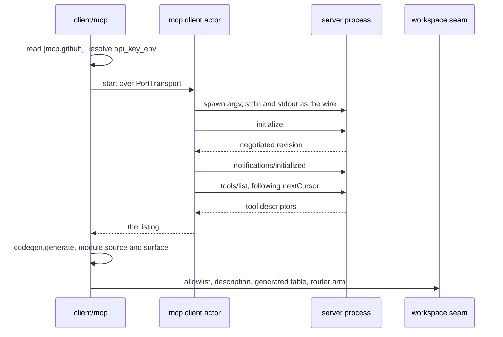
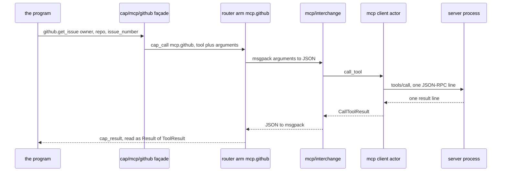
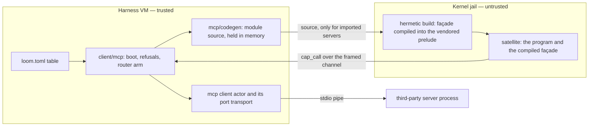

# MCP

An MCP (Model Context Protocol) server is a third-party program that
offers tools for a model to call, speaking JSON-RPC 2.0 over a pipe.
Loom's MCP client has two parts. `packages/mcp` holds the protocol
codecs, the actor that owns one server process, the generator that turns
a tool listing into Gleam source, and the value translation between the
capability wire and the MCP wire. `client/mcp` is the harness wiring: it
reads the configuration, starts one client per server, and answers
capability calls to them.

One decision shapes the rest of this document: **a server's tools reach
a model only through code mode, as one generated Gleam module per
server.** Code mode is Loom's pipeline for running a model-written Gleam
program: vetting checks the program's imports, a jailed hermetic build
compiles it, and it runs in a satellite (a fresh jailed BEAM node) whose
every effect is a capability call. A program calls
`github.create_issue(...)` after writing `import cap/mcp/github`, and by
no other route. No part of MCP is a registered harness tool, and no
generic `invoke(server, tool, args)` is reachable from a program.

Work flows in three stages. At boot, the harness starts each configured
server and *generates* its module's source. Per execution, the jailed
build *compiles* only the modules the program imports. At run time, each
call travels as a capability call to the client actor that owns the
server process. Around those stages, this document covers how the
generator treats hostile input and what v1 leaves out.

`docs/architecture/code-mode.md` carries the vetting theorem this design
rests on and the pipeline the generated modules compile into; this
document assumes both.

## One module per server

Code mode bounds a program at the source level: a Gleam program's
maximal capability set is the transitive closure of its imports plus its
own `@external` declarations, so vetting can read the import list and
determine what the program can do. There were two ways to expose an MCP
server inside that bound. Both keep the theorem true; they differ in how
much the import list reveals.

A generic dispatcher (`cap/tools.invoke(name, args)`, one module every
program may import) would still let vetting compute a correct upper
bound. But that bound would be *the whole registry, for every program*.
The import list would stop sorting programs into capability classes, and
the broker's per-call check would be the only thing distinguishing one
program from another. Code mode was built with two layers of checks, and
this design would silently drop to one: every program would still pass
vetting, and every program would be trusted with every server.

Per-server modules keep the import list meaningful. The vetting
allowlist names one module per configured server, so a program that
imports `cap/mcp/github` has been granted that server and no other, and
it says so in its first few lines. That granularity matches how a human
reasons about trust: nobody vets three hundred tools one at a time, and
an operator who adds a server to `loom.toml` makes exactly one trust
decision.

Two properties keep this design in place.

**The marshaling seam is unimportable.** Every generated façade is a
name, a signature, and one call to `cap/internal/mcp.invoke`, which
builds the capability name `"mcp." <> server` and the argument map. Gleam
forbids another package from importing an internal module, so a program
cannot call `invoke` with a server string of its own. If it could,
`invoke` would be a generic dispatcher by another route, and per-server
trust would collapse to "any server the router knows".

**A module's cost does not grow with the tool count.** A registered tool
renders into the provider's cached prompt prefix and is paid for on
every request of every strand (one agent's conversation within a
session), so registering each tool would scale the cost with the
server's tool count. A generated module renders its surface once, the
way `cap/proc` does, whether the server lists three tools or three
hundred. Cost is therefore controlled by which servers an operator
enables, not by model-side discovery, and that is why Loom builds no
tool search. `docs/design-notes/tool-search-and-code-mode.md` has the
arithmetic; its MCP half is superseded by what shipped.

## From a table to a callable module

An operator configures each server with one table in `loom.toml`. There
is no other configuration surface: no CLI flag, no auto-discovered
project file, and no live reload.

```toml
[mcp.github]
command = ["mcp-server-github", "--stdio"]
api_key_env = "GITHUB_TOKEN"
```

The table key names the server in three places: the `<name>` in the
`cap/mcp/<name>` module a program imports, the `<server>` in the
`mcp.<server>` capability each call travels under, and the catalogue key
an operator reads a refusal against. `client/catalog` therefore holds it
to a single lowercase-ASCII identifier segment (`[a-z][a-z0-9_]*`),
checked by the same grammar gate vetting applies to every import. It
also refuses any key the generator's name mangler would rewrite: a
keyword, a doubled or trailing underscore, or anything past 32
characters. On every key the config accepts, mangling is the identity,
so the promise that `[mcp.github]` yields `cap/mcp/github` is provable
rather than usually true. `internal` is refused by name, because
`cap/mcp/internal` would sit confusingly beside the unimportable
marshaling layer.

`command` is an argv list with the executable first, never a shell
string. `api_key_env` names an environment *variable*, never a key. At
spawn, the harness reads the variable from its own environment through
the same `provider/secret` seam every other configured secret uses, and
sets it in the child's environment under the same name. The value is
stored in no record, log line, or refusal message. If the configured
variable is unset, the server is refused before anything is spawned,
because a server started without its configured key would fail later,
further from the cause, and in the server's own words.

### Generation happens once, at boot

`client/mcp.start` walks the configured servers in catalogue order and
does four things per server, in this order:

1. **Resolve the secret**, as above, before any process exists.
2. **Spawn and hand-shake.** The client actor starts over
   `mcp/transport.PortTransport` (a child OS process on an Erlang port,
   with stdin and stdout as the wire). It sends `initialize` requesting
   revision 2025-06-18, accepts `2025-03-26` and `2024-11-05`, refuses
   anything else, and then sends `notifications/initialized`.
3. **List the tools.** `tools/list`, following `nextCursor` for at most
   64 pages, under one budget for the whole listing (30 seconds by
   default).
4. **Generate the module.** `mcp/codegen.generate` turns the listing into
   a `Generated(module_name, source, surface)`: the Gleam *source text*
   of the `cap/mcp/<name>` module, and the rendered description surface
   the `code_mode` tool carries for it. No compiler runs here. The source
   stays in memory, as part of the session's MCP layer, until an
   execution needs it.

The boot sequence for one server, ending with the four things its module
widens:



The client keeps running for the life of the session, because the same
client later handles dispatch. Any step can fail because of the third
party, and a failure refuses *that server* only: `client/mcp` logs one
`mcp.unavailable` line naming the server and the reason, tears the
client down, and continues the boot without it. That log line is the
only place an operator can see the cause. A refused server has no
module, so vetting rejects a program that imports it without saying why
the module is absent. If at least one server started, the layer logs
`mcp.ready` with each server's name and tool count.

A host that registers no `code_mode` tool starts no MCP server at all.
A server's tools are reachable only as a module a program imports, so
without code mode a server would cost a process and attack surface for a
capability nothing can reach.

### What one field widens

The MCP layer reaches code mode as a single `Config.mcp` field, and each
server in it widens four things together:

| What widens | With what |
|---|---|
| The vetting **allowlist** | `cap/mcp` plus one `cap/mcp/<server>` per server (`client/codemode.seam_allowlist`) |
| The rendered **description** | each server's surface, as the seam offer's extra surfaces |
| The **generated table** the hermetic build takes | `#(module name, source)` per server |
| The capability **router** | one `mcp.<server>` arm per server |

The four are one field for the same reason the code-mode surface is one
field: a host that could set them separately eventually would, and each
mismatched pair is its own failure. The model could be told about a
module that vetting rejects, or vetting could admit a module the build
never writes. **The orchestration seam, code mode's other capability
surface, is never widened by any of it.** The two-seam split exists to
control which capabilities travel together, and an orchestrator that
could also call a third-party server is materially more dangerous to
hand a model than one that cannot.

## Generated at boot, compiled per execution

A server's module is *generated* once and *compiled* many times, and the
two steps run at different times, in different places, under different
rules. Conflating them is the most common way to misread this subsystem.

**Generation** turns a server's `tools/list` JSON into Gleam *source
text*, with no compiler involved. **Compilation** turns that text into
loadable BEAM modules inside the jailed hermetic build of one code-mode
execution, and only when the vetted program imported
`cap/mcp/<server>`.

| | Generation | Compilation |
|---|---|---|
| When | once at boot | once per execution |
| For which servers | every one configured | only the ones the program imported |
| Where | the harness VM | the network-off jail around the build |
| What runs | `mcp/codegen.generate` | `gleam build --warnings-as-errors` |
| What comes out | source text and a rendered surface, held in memory | the compiled façade, inside that execution's artifact |
| What a server nobody imports costs | one generation at boot | nothing |

Two steps connect them: a filter and a write.

**The filter.** `codemode.execute` narrows the host's table of generated
modules to the vetted program's own import list before the compile
service sees it. A program that imports one server pays to compile one,
and a program that imports none pays nothing. The filter controls cost,
not authorization: the allowlist already decided what a program may
import.

**The write.** The builder writes each remaining module into the build
root *after* the seed clone and *before* `gleam build`, and both halves
of that ordering are required. Cloning the seed replaces `vendor/`
wholesale, so a module written earlier would be deleted. `gleam build`
reads the package from disk once, so a module written later would
arrive too late. The location is also required. The module goes
*inside* the vendored prelude's own source tree, at
`vendor/cap/src/cap/mcp/<server>.gleam`, because a façade calls
`cap/internal/mcp.invoke` and Gleam admits an internal module only to its
own package.

As a result, a generated façade compiles in the same network-off jail as
the program that imports it, from source the harness wrote but never
compiled. The seed that every build root is cloned from holds no
generated module; each one is written fresh into a build root created
for that execution.

## What the model reads, and what it writes

A model writing a code-mode program has no autocomplete, no hover, and
no language server. The rendered surface is its only reference, and it
is part of the `code_mode` description the model has before it writes a
line. For the three-tool fixture server that the client package's
end-to-end tests run against, configured as `[mcp.fixture]`, the surface
begins like this:

```
### cap/mcp/fixture
`cap/mcp/fixture` — the tools of the MCP server "fixture", as typed calls.
Descriptions below are the server's own text, not Loom's.
Optional parameters travel in `options` by wire name, e.g.
`options: [#("page", report.int(2))]`; pass `[]` when none.

/// Echoes the arguments it was called with, verbatim.
///
/// Tool "echo_args" on MCP server "fixture". Optional parameters travel in
/// `options` by wire name; pass [] when none.
/// - message: wire "message", string. the text to echo
/// - "tag" (optional): an optional label
pub fn echo_args(message: String, options: List(#(String, report.Value))) -> Result(mcp.ToolResult, mcp.McpError)
```

Those lines show three properties. The first paragraph of each block is
the *server's* description, quoted and capped, and the surface labels
it so a model does not read third-party prose as Loom's. Every required
parameter is a labelled Gleam argument with its wire name stated beside
it. Every optional parameter goes in one `options` list keyed by wire
name, so the model can discover it without a signature slot for each.

A program written against that surface looks like any other code-mode
program. This one is the shape the client package's live suite submits,
with one extra branch:

```gleam
import cap/mcp
import cap/mcp/fixture
import cap/report
import gleam/option
import gleam/result

pub fn main() -> report.Outcome {
  case
    fixture.echo_args(
      message: "loom-mcp-wire-fidelity",
      options: [#("tag", report.string("Tag-With_Mixed.Case"))],
    )
  {
    Ok(found) -> report.text(mcp.text(found) <> " " <> echoed(found))
    Error(mcp.ToolFailed(message:, content: _content)) ->
      report.failure("the tool ran and refused: " <> message)
    Error(mcp.ServerUnavailable(reason: reason)) ->
      report.failure("the server never answered: " <> reason)
    Error(_other) -> report.failure("the mcp call did not settle")
  }
}

/// What the server echoed back as structured content, read field by field.
fn echoed(found: mcp.ToolResult) -> String {
  let read = {
    use echo_of <- result.try(option.to_result(found.structured, Nil))
    use message <- result.try(report.field(echo_of, "message"))
    use message <- result.try(report.as_string(message))
    Ok("echoed=" <> message)
  }
  case read {
    Ok(rendered) -> rendered
    Error(Nil) -> "the structured echo carried no message"
  }
}
```

Four details in it are properties of the design rather than style
choices. The import list is the permission grant: this program was given
the `fixture` server and nothing else, and it cannot touch the disk, the
network, or a process. Arguments are built with `cap/report`'s value
builders, the one structured-value vocabulary every seam already
carries, so an MCP argument map is composed the same way as an
`Outcome`. `ToolFailed` and `ServerUnavailable` are different events:
the first is a *tool* verdict on a call that settled, and the second is
a call that never reached a tool. Nothing below the program can
distinguish them on its behalf. Finally, label shorthand in the patterns
is ordinary Gleam syntax and passes through the same vetter as every
other submitted construct.

## A worked example: an issue triage pass

The program below does a job no single tool call can express. It reads
every open issue in a repository, classifies each one, finds titles that
repeat, and returns counts and the duplicate pairs. With ten open issues
it makes eleven `tools/call`s (one listing plus one fetch per issue) and
reads eleven issue bodies. As direct tool calls, that would be eleven
round trips and eleven bodies in the conversation. As a program, it is
one execution that returns four numbers, a list of pairs, and a
reference to a table the model can fetch if it needs one.

### The surface it was written against

Every signature below is generator output, not prose written for this
document. `packages/mcp/test/mcp/fixtures/github.gleam` is a checked-in
ten-tool `tools/list` from a GitHub-shaped server, and `codegen_test`
generates a module from it and pins the surface against that module.
Configured as `[mcp.github]`, the fixture renders the text below, exactly
as the `code_mode` description carries it. The excerpt shows two of the
ten tools, the only two the program calls.

```
### cap/mcp/github
`cap/mcp/github` — the tools of the MCP server "github", as typed calls.
Descriptions below are the server's own text, not Loom's.
Optional parameters travel in `options` by wire name, e.g.
`options: [#("page", report.int(2))]`; pass `[]` when none.

/// Get details of a specific issue in a GitHub repository.
///
/// Tool "get_issue" on MCP server "github". Optional parameters travel in
/// `options` by wire name; pass [] when none.
/// - owner: wire "owner", string. Repository owner
/// - repo: wire "repo", string. Repository name
/// - issue_number: wire "issue_number", integer. The number of the issue
pub fn get_issue(owner: String, repo: String, issue_number: Int, options: List(#(String, report.Value))) -> Result(mcp.ToolResult, mcp.McpError)

/// List issues in a GitHub repository with filtering options.
///
/// Tool "list_issues" on MCP server "github". Optional parameters travel in
/// `options` by wire name; pass [] when none.
/// - owner: wire "owner", string. Repository owner
/// - repo: wire "repo", string. Repository name
/// - "state" (optional): Filter by state
/// - "labels" (optional): Filter by labels
/// - "sort" (optional): Sort order
/// - "direction" (optional): Sort direction
/// - "since" (optional): Filter by date (ISO 8601 timestamp)
/// - "page" (optional): Page number
/// - "perPage" (optional): Results per page
pub fn list_issues(owner: String, repo: String, options: List(#(String, report.Value))) -> Result(mcp.ToolResult, mcp.McpError)
```

A signature describes what a tool *takes*, not what it returns. MCP
describes only a tool's input schema, and `structuredContent` crosses
this client raw and uninterpreted. The way this program reads a result
(`list_issues` returns an `issues` array, and `get_issue` returns an
object with `title` and `body`) is therefore an assumption about the
server, and the code treats it as one. Every read goes through
`cap/report`'s total readers, so a missing field becomes a reported
failure rather than a crash.

One limit before the code: no suite runs this program, unlike
`docs/examples/stale_symbol_sweep.gleam`, which `packages/codemode/test`
runs verbatim. The suite pins only the surface above.

### The program

```gleam
import cap/actor
import cap/mcp
import cap/mcp/github
import cap/report
import cap/task
import gleam/bool
import gleam/dict
import gleam/int
import gleam/list
import gleam/option
import gleam/result
import gleam/string

/// The repository being triaged.
const owner = "loom-lang"

const repo = "loom"

/// What makes an issue a bug report or a question. Plain string rules,
/// computed here: a code-mode program has capabilities, not a model.
const bug_words = ["crash", "panic", "traceback", "regression", "stack trace"]

const question_words = ["how do i", "how to", "is it possible", "question"]

const noise_words = ["a", "an", "the", "in", "on", "when", "with", "error"]

type Class {
  Bug
  Feature
  Question
}

/// One issue, after its body has been read and classified. The body
/// itself stays in the program.
type Triaged {
  Triaged(
    number: Int,
    title: String,
    class: Class,
    duplicate_of: option.Option(Int),
  )
}

/// The dedup index: the first issue seen under each normalized title,
/// and every later collision as a pair.
type Index {
  Index(first_seen: dict.Dict(String, Int), duplicates: List(#(Int, Int)))
}

/// The one message the index takes: claim a title for an issue, and
/// learn which issue already held it.
type Claim {
  Claim(key: String, number: Int, reply: actor.Reply(option.Option(Int)))
}

pub fn main() -> report.Outcome {
  case triage() {
    Ok(outcome) -> outcome
    Error(reason) -> report.failure(reason)
  }
}

fn triage() -> Result(report.Outcome, String) {
  use listed <- result.try(
    github.list_issues(owner: owner, repo: repo, options: [
      #("state", report.string("open")),
      #("perPage", report.int(100)),
    ])
    |> result.map_error(explain),
  )
  use numbers <- result.try(issue_numbers(listed))
  use index <- result.try(
    actor.spawn(Index(first_seen: dict.new(), duplicates: []), remember)
    |> result.replace_error("the dedup index would not start"),
  )
  use triaged <- result.try(
    task.parallel_map(numbers, max_concurrency: 4, with: fn(number) {
      classify_one(index, number)
    })
    |> result.map_error(first_failure),
  )
  use final <- result.try(
    actor.get(index, timeout: 5000)
    |> result.replace_error("the dedup index did not answer"),
  )
  actor.shutdown(index)
  Ok(summarize(triaged, final.duplicates, emit_detail(triaged)))
}

/// One issue, start to finish: fetch it, classify it, and claim its
/// title against the shared index. Runs once per issue, four at a time.
fn classify_one(
  index: actor.Address(Index, Claim),
  number: Int,
) -> Result(Triaged, String) {
  use found <- result.try(
    github.get_issue(
      owner: owner,
      repo: repo,
      issue_number: number,
      options: [],
    )
    |> result.map_error(explain),
  )
  use issue <- result.try(structured(found))
  let title = text_field(issue, "title")
  use first <- result.try(
    actor.call(
      index,
      fn(reply) { Claim(key: normalize(title), number: number, reply: reply) },
      timeout: 5000,
    )
    |> result.replace_error("the dedup index did not answer"),
  )
  Ok(Triaged(
    number: number,
    title: title,
    class: classify(title, text_field(issue, "body")),
    duplicate_of: first,
  ))
}

/// The index's handler. Concurrent workers all call it; it runs their
/// claims one at a time, which is what makes "first seen" mean anything.
fn remember(state: Index, message: Claim) -> actor.Next(Index) {
  case message {
    Claim(key: key, number: number, reply: reply) ->
      case dict.get(state.first_seen, key) {
        Ok(first) -> {
          actor.reply(reply, option.Some(first))
          actor.continue(
            Index(..state, duplicates: [#(first, number), ..state.duplicates]),
          )
        }
        Error(Nil) -> {
          actor.reply(reply, option.None)
          actor.continue(
            Index(
              ..state,
              first_seen: dict.insert(state.first_seen, key, number),
            ),
          )
        }
      }
  }
}

/// Bug, feature, or question, decided from the issue's own words.
fn classify(title: String, body: String) -> Class {
  let text = string.lowercase(title <> " " <> body)
  use <- bool.guard(when: mentions(text, bug_words), return: Bug)
  use <- bool.guard(when: mentions(text, question_words), return: Question)
  Feature
}

fn mentions(text: String, words: List(String)) -> Bool {
  list.any(words, fn(word) { string.contains(text, word) })
}

/// A title reduced to its content words, so "Crash on startup" and
/// "The crash on startup" claim the same key.
fn normalize(title: String) -> String {
  string.lowercase(title)
  |> string.replace(each: "-", with: " ")
  |> string.split(" ")
  |> list.filter(fn(word) { word != "" && !list.contains(noise_words, word) })
  |> string.join(" ")
}

/// The per-issue table, written to the blob store rather than to the
/// conversation. The `Outcome` carries only its reference.
fn emit_detail(triaged: List(Triaged)) -> report.Value {
  let rows = csv(triaged)
  let table = <<rows:utf8>>
  case report.emit(name: "detail.csv", content_type: "text/csv", bytes: table) {
    Ok(reference) -> report.string(reference.id)
    Error(report.EmitDenied(code: code, message: _message)) ->
      report.string("not emitted: " <> code)
    Error(report.EmitUnavailable(reason: _reason)) ->
      report.string("not emitted: the channel could not carry it")
  }
}

fn csv(triaged: List(Triaged)) -> String {
  list.map(triaged, fn(item) {
    int.to_string(item.number)
    <> ","
    <> class_name(item.class)
    <> ","
    <> item.title
  })
  |> string.join("\n")
}

fn class_name(class: Class) -> String {
  case class {
    Bug -> "bug"
    Feature -> "feature"
    Question -> "question"
  }
}

/// The counts, the duplicate pairs, and the artifact reference — the
/// only things that leave the satellite.
fn summarize(
  triaged: List(Triaged),
  duplicates: List(#(Int, Int)),
  detail: report.Value,
) -> report.Outcome {
  let originals =
    list.filter(triaged, fn(item) { item.duplicate_of == option.None })
  report.value(
    report.object([
      #("scanned", report.int(list.length(triaged))),
      #("bug", report.int(count(originals, Bug))),
      #("feature", report.int(count(originals, Feature))),
      #("question", report.int(count(originals, Question))),
      #("duplicates", report.list(list.map(duplicates, pair_value))),
      #("detail", detail),
    ]),
  )
}

fn count(triaged: List(Triaged), class: Class) -> Int {
  list.count(triaged, fn(item) { item.class == class })
}

fn pair_value(pair: #(Int, Int)) -> report.Value {
  report.object([
    #("first", report.int(pair.0)),
    #("later", report.int(pair.1)),
  ])
}

/// The issue numbers `list_issues` answered with.
fn issue_numbers(listed: mcp.ToolResult) -> Result(List(Int), String) {
  use payload <- result.try(structured(listed))
  use issues <- result.try(
    report.field(payload, "issues")
    |> result.try(report.as_list)
    |> result.replace_error("list_issues answered with no `issues` array"),
  )
  Ok(
    list.filter_map(issues, fn(issue) {
      report.field(issue, "number") |> result.try(report.as_int)
    }),
  )
}

fn structured(found: mcp.ToolResult) -> Result(report.Value, String) {
  option.to_result(
    found.structured,
    "the server answered without structured content: " <> mcp.text(found),
  )
}

fn text_field(value: report.Value, key: String) -> String {
  report.field(value, key)
  |> result.try(report.as_string)
  |> result.unwrap("")
}

/// Why a triage pass stopped, in the program's own words.
fn explain(error: mcp.McpError) -> String {
  case error {
    mcp.ToolFailed(message:, content: _content) ->
      "the tool ran and refused: " <> message
    mcp.ServerUnavailable(reason: reason) ->
      "the server never answered: " <> reason
    mcp.McpDenied(code:, message:) ->
      "the call was denied as " <> code <> ": " <> message
    mcp.ResultMalformed(reason: reason) ->
      "the answer did not decode: " <> reason
  }
}

fn first_failure(failures: List(task.Failure(String))) -> String {
  case failures {
    [task.Returned(index: _index, error: error), ..] -> error
    [task.Crashed(index: number, reason: reason), ..] ->
      "classifying issue " <> int.to_string(number) <> " died: " <> reason
    [] -> "the triage pass produced no result"
  }
}
```

### The import list is the permission grant

The program imports five capability modules and seven standard-library
ones. It can call the `github` server's tools, fan work out under
`cap/task`, keep one `cap/actor`, and return an outcome or emit an
artifact. It cannot read a file, run a process, open a socket, or reach
a *second* MCP server. `cap/fs`, `cap/proc`, `cap/net` and every other
`cap/mcp/<server>` are absent; vetting confirmed those absences before
the program compiled, and the hermetic build's dependency table leaves
the compiler nothing else to resolve. `cap/mcp` carries no authority of
its own (it is the result and error vocabulary the façade signatures are
written in), so the one line that grants anything is
`import cap/mcp/github`.

### Where the concurrency bounds come from

`max_concurrency: 4` is the program's own bound, and the program may
raise it freely. Three bounds underneath it are out of the program's
reach:

- **The pooled outstanding-effect cap**, applied by the satellite host
  before any plan is served. It is one cap for the whole execution, so a
  program that asked for four hundred does not get four hundred
  concurrent calls.
- **This seam's 60-second call timeout** per `tools/call`, deliberately
  below the host's 120-second one, so a program that asked a server a
  question is answered `mcp_timeout` rather than left waiting.
- **The execution's wall deadline**, over everything at once. On expiry
  the whole satellite dies: the fan-out, the index actor, and the
  program root together.

Each fetch is its own `cap_call`, routed and checked individually, and
draws on the one pooled budget. Raising `max_concurrency` therefore buys
parallelism inside the program without adding footprint outside it, and
that is why fanning out is safe to hand a model.

### What the actor buys over a fold

A sequential fold over the issues could carry the same index in an
accumulator and would be shorter, but it would fetch the issues one at a
time, and fetching is the slow part. With four workers running at once,
four processes read and update one index, and "first seen" needs a
definite meaning.

`cap/actor` provides that meaning. The workers' `actor.call`s arrive as
messages in one bounded mailbox, and the handler processes them one at a
time. Each worker gets back either `None` (it was first) or
`Some(number)`, naming the issue that already claimed the title. There
is no lock, no shared mutable value, and no second pass over the
results: when `parallel_map` returns, the duplicate pairs are already in
the index, and `actor.get` reads them out. `cap/actor` exists for this
case, where ongoing state is driven by concurrent input, rather than for
state one loop could have threaded through.

The spawn site matters. `main` spawns the index, so the actor is linked
to the program root, and an abnormal crash fails the whole execution. An
actor spawned *inside* a `parallel_map` branch would instead be linked
to that branch's worker, and its crash would be contained to the branch.
`docs/architecture/code-mode.md` has the full rule.

### What crosses the wire, and what stays inside

Per issue, exactly one `tools/call` goes out
(`{tool: "get_issue", arguments: {owner, repo, issue_number}}`), and one
result comes back carrying the whole issue: title, body, labels, author,
and timestamps. That result reaches the program and goes no further.
`string.lowercase`, `string.contains` and the three word lists run
inside the satellite, and the issue bodies stay there and are discarded
with it.

Only the object `summarize` builds leaves: four counts, the duplicate
pairs, and one artifact reference. The per-issue table goes through
`report.emit` into the session's blob store, so the model fetches the
detail only when it chooses to, instead of paying for it by default. An
ordinary MCP tool call cannot make that distinction, because its whole
result becomes context. Closing that gap is what code mode is for.

The classification is plain string matching, and that is a constraint of
the design, not a shortcut. A code-mode program holds capabilities, not
a model, and no capability asks a model a question: the prelude declares
none, and a program reaches only what the broker routes. A triage that
needs real judgment returns the titles and asks the model in the next
turn. That second round trip is deliberate, and it replaces a model call
hidden inside a jailed program.

## `tools/list` is attacker-controlled input

A server's listing is JSON the harness did not write, and the generator
turns it into Gleam source that the harness compiles and the vetting
allowlist admits. That makes the generator the most exposed part of the
feature. Its defence is one governing rule, three mechanisms that
enforce it, and two sets of bounds.

**The generator chooses names and signatures only, never marshaling.**
Every façade it emits is a doc comment, a `pub fn` header, and one call
to `cap/internal/mcp.invoke`. The marshaling (building the argument map,
encoding it, decoding the pinned result, and mapping a denial onto
`cap/mcp`'s error vocabulary) lives in that one internal module, written
once by hand. Server-influenced text therefore reaches a generated
module only as *identifiers and literals*, never as code that touches
the wire.

**Wire identity never changes.** Every generated body embeds the
original tool name and the original parameter names as escaped string
literals; `mcp/name`'s output is only a display name. Escaping is total:
`\` and `"` are escaped, and every codepoint outside printable ASCII is
emitted as `\u{...}`, so a literal can never carry a raw newline, a
control character, or a bidi override. Whenever mangling changes
anything at all, or the name runs past 32 characters, the result gets
`_` plus the first eight hex characters of a SHA-256 digest of the
original. Two names that differ only in shape therefore cannot silently
become one function. A collision that survives the digest must have been
engineered, and the generator refuses the whole server, naming both
originals, rather than repairing it.

The rule applied to the names the checked-in fixture server lists, plus
one name it does not:

| Original, on the wire | Generated Gleam name | What the body sends |
|---|---|---|
| `echo_args` | `echo_args` (mangling changed nothing, so no digest) | `"echo_args"` |
| `Create-Issue!` | `create_issue_48f762e0` | `"Create-Issue!"` |
| `Target-Repo` (a parameter of `nested`) | label `target_repo_bc64ccdd` | `#("Target-Repo", …)` |
| `createIssue` (not on this server) | `create_issue_706a5e2e` | `"createIssue"` |

The last row shows why the digest exists: `Create-Issue!` and
`createIssue` both mangle to `create_issue`, and the eight digest
characters are all that keep them two functions rather than one. The
generated function for the second row reads:

```gleam
/// A tool whose name is no Gleam identifier.
///
/// Tool "Create-Issue!" on MCP server "fixture". Optional parameters travel
/// in `options` by wire name; pass [] when none.
/// - title: wire "title", string.
pub fn create_issue_48f762e0(
  title title: String,
  options options: List(#(String, report.Value)),
) -> Result(mcp.ToolResult, mcp.McpError) {
  internal.invoke(
    "fixture",
    "Create-Issue!",
    report.object(list.append(
      [
        #("title", report.string(title)),
      ],
      options,
    )),
  )
}
```

**Server prose stays inside the comment line it was written into.**
`codegen.sanitize` replaces every control and direction-changing
codepoint with a space: C0 and C1 controls, the bidi overrides and
isolates, zero-width characters, and the tag-character plane. It caps a
tool description at 400 characters and a parameter note at 120. Every
comment line the generator emits begins `/// `, and every line break
comes from the generator's own word wrap; the sanitizer has already
flattened any breaks in the server's text.

**A backstop checks that the other two held.** After rendering,
`codegen.scan_for_at` walks the source and fails generation if a single
`@` appears outside a comment or a string literal. Generated code needs
no attribute at all, so a stray `@` means the sanitizer failed.
`@external` is exactly the payload a hostile listing would want, since
it is Gleam's one bridge to arbitrary Erlang, so the generator refuses
the server loudly rather than hand the compiler an attribute.

### Every schema settles, and no parameter is dropped

`mcp/schema.plan` is the one place a tool's raw `inputSchema` is read,
and it has no error case: tier 3 *is* its failure mode, represented as
data. Each required parameter lands in one of three tiers.

| Tier | What lands there | What the façade takes |
|---|---|---|
| 1 | `string`, `integer`, `number`, `boolean`, or an array of those | a typed Gleam argument (`String`, `Int`, `Float`, `Bool`, `List(...)`) |
| 2 | a nested object, a `$ref`, an `anyOf`, a missing type, or a `required` name with no `properties` entry | a required `report.Value` argument, with the reason in its doc line |
| 3 | an unusable top level: the whole `inputSchema` is not an object schema | one `arguments: report.Value` holding the entire map |

Optional parameters are never typed arguments. They travel in the single
`options` list keyed by their original wire name, and appear in the doc
comment so the model can see they exist. No tier drops a parameter
silently: a `required` name the server never declared becomes a tier-2
argument with that fact as its reason, because dropping a parameter is
the one thing this reading must never do.

The typed subset is deliberately narrow, and `codegen_test` records the
measurement that would overturn that choice. Against a plausible
GitHub-shaped listing, 30 of 31 required parameters land in tier 1. If
mainstream servers ever push tier 2 past 25% of required parameters,
that is the trigger to widen the subset and generate nested records.

### Ceilings, and what each one costs a hostile server

| Bound | Value | What happens past it |
|---|---|---|
| tools in one listing | 256 | the server is refused whole |
| rendered surface | 64 KiB after truncation | the server is refused whole |
| `tools/list` pages | 64 | `TooManyPages`; the listing fails |
| one JSON-RPC line | 16 MiB | `LineTooLong`, and the client latches dead |
| one `cap_result` | the cap channel's frame cap, less a 64 KiB envelope margin | the call is refused `mcp_malformed` |
| result nesting | msgpack's `max_depth`, less the two containers the frame adds | the call is refused `mcp_malformed` |

Two refusals are deliberately narrower than the rest. A residual *tool*
name collision refuses the server, but a *label* collision inside one
tool degrades only that function to its tier-3 whole-value form and
leaves the rest of the server typed.

The result ceilings are measured in `client/mcp`, where the answer can
still become a refusal the program can read. An oversized frame dropped
further down would leave the program blocked until its wall deadline.
An over-deep one would settle every in-flight call and close the
channel. Either way, one hostile answer would cost the whole execution
instead of one call.

## The wire

A call from a generated façade is an ordinary capability call.
`cap/internal/mcp.invoke` sends it under the capability name
`"mcp." <> server` with the arguments
`{tool: <the server's original name, verbatim>, arguments: <the map>}`.
The harness answers with the pinned result shape
`{content: [<block>...], is_error: Bool, structured?: <value>}`, where
the `structured` key is present only when the server sent one.

The plan is `satellite.ServedHere`, the same as for the orchestration
seam: the harness answers over a socket it already owns, without
building a `CallSpec`, entering a jail, or composing a policy. There is
nothing to compose a policy *for*, because the call spawns no process
and touches no path. Three limits bound it instead, each described under
[Where the concurrency bounds come from](#where-the-concurrency-bounds-come-from):
the pooled outstanding-effect cap, the execution's wall deadline, and
this seam's own 60-second call timeout.

The arguments are converted to JSON at plan time rather than after
dispatch, so a value this wire cannot carry is refused before a round
trip that could not have succeeded.

The diagram shows where each hop of one call runs. The program is
inside the jail, the router and every participant to its right run in
the harness VM, and the server is outside both:



### What a program reads back

| In-band code | Raised when | What `cap/mcp` makes of it |
|---|---|---|
| `mcp_unavailable` | the client is dead: the child exited, framing broke, or the bytes stopped being UTF-8 | `ServerUnavailable(reason)` |
| `mcp_timeout` | `tools/call` did not settle inside the seam's call timeout | `McpDenied("mcp_timeout", …)` |
| `mcp_malformed` | the answer was not the shape the method promises, or would not cross to the capability wire | `McpDenied("mcp_malformed", …)` |
| `jsonrpc_<code>` | the server answered a JSON-RPC error; `-32601` arrives as `jsonrpc_-32601` | `McpDenied(code, message)` |
| `unsupported_cap` | `mcp.<server>` naming a server this host never configured | `McpDenied(...)` |
| `invalid_argument` | the call's own `{tool, arguments}` could not be read, or the arguments do not cross to JSON | `McpDenied(...)` |

Two outcomes are not denials at all. A call that settled with
`is_error: true` is a *tool* verdict and reaches the program as
`ToolFailed(message, content)`. A `cap_result` that does not match the
pinned shape becomes `ResultMalformed`. The server's own JSON-RPC code
travels in the code string rather than being folded into one name,
because it is the one fact a program could branch on.

### Two vocabularies that disagree

`mcp/interchange` translates between the capability wire (msgpack) and
the MCP wire (JSON), and it is total in both directions. Every input
becomes either a converted value or a fault naming the path where the
problem was found, never a crash and never a silent substitution. Four
rules settle where the two formats disagree, and each was a deliberate
choice:

- **A msgpack integer always fits JSON**, since `core/json.Int` is
  arbitrary precision. The asymmetry runs the other way.
- **A JSON integer outside `[-2^63, 2^64 - 1]` fails the whole
  conversion** rather than being wrapped, clamped, or turned into a
  float. A program reading a wrapped integer would act on a number the
  server did not send.
- **A msgpack binary is refused in an argument.** JSON has no byte
  string, and both encodings a caller might expect (base64 text, or an
  array of integers) are guesses about what the server wants.
  `cap/report`'s builders cannot construct one, so this is unreachable
  from a vetted program.
- **`NilValue` and `Null` map to each other.** A non-string map key is
  refused, because inventing a rendering for one would change what the
  server is asked.

Floats cross unchanged in both directions. Depth needs no ceiling here:
both parsers already bound nesting at the same `max_depth`, so any value
that arrives is shallow enough for the encoder on the other side.

## What runs where

The pieces live in three regions: the trusted harness VM, the untrusted
kernel jail, and the server's own process outside both. The diagram
shows which region holds which piece and what each one has to trust:



**In the harness VM:** one client actor per server, its port transport,
and the router arm. The actor owns the child process for the session,
performs the handshake, holds one deadline per in-flight call, and
answers `Unavailable` in band once the child is dead. It never restarts
a peer, and it is never `process.call`ed. Every public call is a
monitored send-and-select instead, because `process.call` panics on a
timeout and on a dead callee, and a caller waiting on a tool-call
verdict must not die because a client is wedged.

The declared client capabilities are an **empty object**, pinned by a
test: no `sampling`, `roots` or `elicitation`, for the reasons given
under [What v1 leaves out](#what-v1-leaves-out). A server-initiated
request is answered with JSON-RPC's
method-not-found; a notification is decoded and dropped.

**Inside the satellite:** the generated façades, compiled into the
vendored prelude of that execution's hermetic build, running under the
same jail and the same pooled budget as the rest of the program. A
façade holds no socket and no server handle; it marshals the arguments
and makes the call, and the capability channel carries it.

**On the child's own stdio:** the server. Its stderr is deliberately
kept out of stdout, because `stderr_to_stdout` would interleave
diagnostics into the newline-delimited JSON-RPC stream and corrupt the
framing. The child inherits the BEAM's stderr instead, so a server's
error output appears on the harness's own stderr.

### The spawn is a primitive, and the jail is an open decision

`mcp/client` is written against `mcp/transport.Transport` and nothing
lower. `PortTransport` is the production mechanism, and it spawns the
server **unjailed**. `ChannelTransport` is the test seam: an in-process
peer that receives the connect, records every outbound line, and
delivers inbound bytes through the same messages a port does. That is
why every client behaviour can be tested without an OS process.

Whether an MCP server should run inside a jail at all (through the
`loom-exec` helper, like every other third-party process Loom starts) is
an **open decision rather than a deferred implementation**: it has not
been designed, not merely not built. The transport seam is where the
answer would attach, and it exists so the answer can land without
rewriting the actor. Until then, the unjailed spawn is the production
primitive, not the final security posture. The threat model in
`docs/architecture/effects.md` already counts a compromised third-party
tool among the things it defends against, and this spawn is where that
defense is still owed. **#109** carries the decision, and
`docs/next.md` records it as open.

## What v1 leaves out

Everything below is refused deliberately, and each row says what would
bring it back.

| Absent | Why | What would reverse it |
|---|---|---|
| Resources, prompts, logging, progress, cancellation, completion | each is surface a hostile server could push data through, and a tool-calling client needs none of it | a capability that actually needs one, argued on its own |
| Sampling, roots, elicitation | a server must not spend Loom's model, learn about the filesystem, or question a human through the harness; upstream deprecated the first two in 2026-07-28 | nothing short of a design change; a test pins the empty capabilities object, so widening it is deliberate and test-breaking |
| The 2026-07-28 stateless revision | it has no `initialize`, and servers in the field speak the older lifecycle | servers in the field speaking it |
| `listChanged` handling | it decodes faithfully and is ignored: this client lists tools once per connection | a server whose tool set changes mid-session, which also means re-rendering a description the model was already given |
| HTTP and SSE transports | a locally-spawned server speaks stdio, and a spawned child is what the jailing story attaches to | a server worth reaching that speaks nothing else, decided together with the jail question |
| Restart and reconnect supervision | a dead peer latches dead and answers `Unavailable` in band | unbuilt; the LSP client (#25, ADR-013) restarts lazily on the next query rather than supervising a reconnect, so no shared substrate exists yet |
| Nested records for tier-2 parameters | the typed subset covers 30 of 31 required parameters on a GitHub-shaped listing | tier 2 past 25% of required parameters on mainstream servers (the falsifier is in `codegen_test`) |
| Per-tool trust | a human trusts a server, not a tool | a policy vocabulary keyed on tool identity, which is a protocol change and strictly more work than generating modules |

One item is owed rather than declined. The end-to-end runs against a
checked-in fixture server that is deliberately friendly in its protocol
and hostile only in its names, so a run against a third-party server
from the wild is still owed. The **adversarial corpus** for hostile
`tools/list` input, which was owed alongside it, now exists:
`codegen_test`'s adversarial-name, hostile-prose and sanitizer-breach
cases and `schema_test`'s hostile-size cases. That corpus targets the
generator the way `packages/codemode/test`'s vetting corpus targets the
lint.

**Tracked in issues.** Each open item above has an issue:

- **#108**: streamable HTTP transport plus OAuth, for remote servers.
- **#109**: the jail decision for an MCP server process, undesigned and
  not merely unbuilt.
- **#110**: an end-to-end against a third-party server from the wild.
- **#111**: whether Loom answers elicitation, now folded into the base
  protocol as `input_required`.
- **#112**: acting on `listChanged` by regenerating a server's module.
- **Restart and reconnect supervision.** #25 was expected to build it as
  a shared substrate and did not: the LSP manager (ADR-013) restarts a
  dead server lazily on the next query, which suits a query-driven
  peer. An MCP client that needs supervised reconnection is still
  unbuilt.
- **#107**: async code mode, the open question a long-running MCP call raises.

## Where the code lives

| Path | What it holds |
|---|---|
| `mcp/jsonrpc.gleam` | The JSON-RPC 2.0 envelope: encoders, and one total decoder for the three inbound shapes. |
| `mcp/protocol.gleam` | The five methods v1 speaks, version negotiation against a closed list, and the deliberately empty client capabilities. |
| `mcp/stdio.gleam` | Line framing both ways: a push buffer bounded at 16 MiB, and `frame` for the outbound side. |
| `mcp/transport.gleam` | The `Transport` seam, the `Spawn` spec, and `utf8_prefix`, which reassembles characters split across pipe chunks. |
| `mcp/client.gleam` | The actor: handshake, `list_tools` with bounded pagination, `call_tool`, `stop`, and the death latch. |
| `mcp/schema.gleam` | The three-tier reading of a raw `inputSchema` into a parameter plan; no error case. |
| `mcp/name.gleam` | Mangling a server-chosen name into a Gleam identifier, with the digest rule that keeps two originals distinct. |
| `mcp/codegen.gleam` | The generator: one `cap/mcp/<server>` module and its rendered surface, the sanitizer, the `@` backstop, and every refusal. |
| `mcp/interchange.gleam` | msgpack ↔ JSON, total both ways, with the four disagreements decided. |
| `mcp/internal/ffi_port.gleam` | The port externals over `mcp_ffi.erl` — this package's complete inventory of impurity. |
| `client/catalog.gleam` | `[mcp.<name>]`: the key grammar, the mangling gate, and the `api_key_env` indirection. |
| `client/mcp.gleam` | The layer: boot per server, the refusal wording, the `mcp.<server>` router arm, the pinned result shape, and the result ceilings. |
| `client/codemode.gleam` | `over_mcp`, `seam_allowlist`, `seam_caps_on` — the one `Config.mcp` field and the four things it widens. |
| `cap/mcp.gleam` | The generated façades' vocabulary: `Content`, `ToolResult`, `McpError`. Types only, no authority. |
| `cap/internal/mcp.gleam` | The one marshaling seam: `invoke`, the pinned result decoder, and the denial-code mapping. A program cannot import it. |
| `client/test/support/mcp_fixture.escript` | The checked-in third-party server the end-to-end spawns: three tools, one of them an oracle that echoes its arguments back. |
| `client/test/client/codemode_live_test.gleam` | A program reaching a real server process through a real pipe, and the wire-fidelity assertions on what crossed. |

Each Gleam path is relative to its package's source root
(`mcp/codegen.gleam` is `packages/mcp/src/mcp/codegen.gleam`), except
the last two rows, which are under `packages/client/test/`.

For more depth, `docs/architecture/code-mode.md` covers the pipeline
these modules are compiled into and what each of its layers confines.
`docs/architecture/effects.md` holds the threat model and the
two-channel doctrine. `packages/mcp/CLAUDE.md`, `packages/cap/CLAUDE.md`
and `packages/client/CLAUDE.md` are denser than this document about
their own packages.
