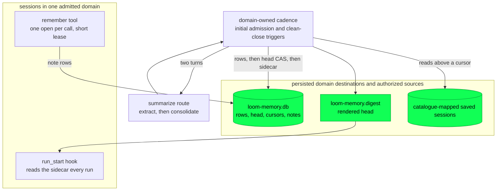

# Memory

Memory carries settled knowledge between sessions: a durable store, a
two-turn extraction and consolidation pipeline, a rendered digest injected
at run start, and a `remember` tool for explicit notes. The managed daemon
owns these resources per admitted domain, not per session or daemon boot.
Workspace-private domains preserve the owner's aggregate memory; an
explicit session-only domain has separate destinations and sources. See
[session ownership](sessions.md) for the persisted mapping and isolation
rules. Isolation does not sanitize an existing transcript.

Memory sits in the durability plane by construction — it is an ordinary
session file, with the same write-once rows, the same leases and the
same total decoders (`docs/architecture/durability.md`) — and reaches
the orchestration plane at exactly one point, the `run_start` hook that
injects the digest. The reasoning behind the design, including why a
memory session rather than a fourth storage concept and what the cache
arithmetic says about injection, is
`docs/design-notes/compaction-and-memory.md` Part 3, and is not repeated
here.

## The four pieces

**The store** is an ordinary session file at the domain's persisted memory
path, outside the editable workspace. Models edit the workspace; writable
aggregate memory would let one session inject durable instructions into
others. Distillates are `CustomEntry` rows
under three registered types (`memory/fact`, `memory/lesson`,
`memory/preference`), each carrying provenance: the source sessions and
entry ids it was derived from. The head is a register naming the rows
currently in force; per-source cursors and the notes cursor are
registers too.

**The pipeline** is `client/distill.gleam:612` (`prepare`) on the managed
path: resolve explicit catalogue sources after cleanup ownership is
published, extract per source on a cheap model, consolidate the candidates
and outstanding notes against the current head, then render the sidecar.
The standalone `run` adapter can still scan a directory; it is not the
managed daemon's source authority.

**The lifecycle worker** is parked by
`client/distillpass.gleam:748` (`prepare_domain`) before publication, then
started through `begin_domain`. It coalesces authorized triggers while a
pass runs and retains the original cleanup witness.

**The injection** is `client/memory.gleam:1675` (`digest_hooks`), which
appends the fenced, attributed digest to every accepted run's opening
messages.

## Which sessions a pass reads, and how it skips the live ones

Managed passes resolve at most 512 saved, catalogue-mapped sources in the
domain; overflow is refused. Reserved registrations are not sources, and
the resolver never falls back to scanning a directory. Each source opens
under its ordinary writer lease (`client/distill.gleam:1261`,
`harvest_one`), with its canonical session identity checked. A resident
session holds that lease until its effects retire, so extraction skips it.
Shared history has a separate read-only path for live sources; its reads
are not distillation and do not take over the writer lease.

Per-source progress is a `{seq, rewrite generation}` cursor in the
memory session. A generation that no longer matches voids the seq and
the source is read from zero again, because a precise rewrite renumbers
every entry.

What extraction may read is structural rather than textual
(`client/distill.gleam:257`, `extractable`): settled assistant text and
compaction or branch summaries contribute; a **user** message
contributes nothing, which is what permanently excludes an injected
digest from being re-ingested, and a `CustomEntry` contributes nothing,
which excludes `memory/*` rows found anywhere. That is the anti-feedback
rule, and it is a rule about types so that no string can defeat it.

## The three leases

| Lease | TTL | Who takes it | Why that length |
|---|---|---|---|
| The source session's | the session owner's | The resident instance, through confirmed retirement | It is what makes "skip the live session" exact. |
| The memory session's, per `remember` call | `lease_ttl_ms`, 30 s (`client/memory.gleam:253`) | `remember_seam` (`client/memory.gleam:1298`) | One open per call, one commit; nothing slow between. |
| The memory session's, per pass | `run_lease_ttl_ms`, 600 s (`client/memory.gleam:276`) | The owned distillation pass | Its commits are separated by whole provider turns, and a lease that expired between them would be stolen mid-run. |

There is deliberately **no new lease type** for the lifecycle worker.
The pass takes the memory session's ordinary writer lease, which is what
makes concurrency safe by construction: a second pass, a hand-run
`loom-distill`, and a `remember` call arriving mid-pass are all refused
in band by the same mechanism, and each is told which owner holds it.

## The lifecycle worker

The managed worker is a `weft/state_machine` owned by the domain host.
Publication precedes `begin_domain`; beginning a parked worker starts its
initial pass without making session admission wait for model turns. Each
pass has a bounded Weft scope and an original retirement witness. A pass
result describes pipeline work, not proof that every resource has closed.

Clean session retirement sends `notify_domain`
(`client/distillpass.gleam:848`). An active pass retains at most one
follow-up, so several closes do not create an unbounded work queue. There
is no periodic timer. A failed pass discards the pending follow-up rather
than retrying automatically; a later authorized trigger may start again.

When the last session retires, the manager sends the final close hint and
then `request_quiesce` (`client/distillpass.gleam:910`) in order. Quiescence
fences new triggers and waits for the current pass and any already
coalesced follow-up. Only then does the manager cancel the domain host.
Its original normal retirement, not the quiescence reply alone, reclaims
the domain slot. Lost cleanup proof keeps that slot blocked. Normal daemon
shutdown drains sessions before domains.

The old `start`/`settled` one-pass adapter remains for standalone and
internal callers. Its per-session boot cadence is not the managed path.

## Retry, stated in full

The write order is rows first, then the head-and-cursors CAS, then the
sidecar: `client/memory.gleam:717` (`append_distillates`),
`client/memory.gleam:901` (`advance_head`), and
`client/memory.gleam:1185` (`reconcile_digest`). Failure before the CAS
leaves the previous head and cursors intact; appended orphan rows are not
visible through that head. Failure after the CAS retains the new durable
progress even if sidecar publication or cleanup fails. A later authorized
pass resumes from that committed state, not from an assumed rollback.

Cancellation asks the owned resources to close in order. A close failure
or missing original retirement proof retains custody and can block domain
reclamation; neither a caller timeout nor an expired lease proves that an
old native owner has stopped. Lease expiry remains a recovery boundary for
an abandoned store, not a substitute for the live daemon's cleanup proof.

## When a new digest becomes visible

The sidecar is read at **run start**, once per accepted run, by the hook
`client/serve.gleam` installs over `client/memory.gleam:1565`
(`read_digest`). Two consequences:

- A digest a pass writes is carried by the **next run** of a session
  mapped to that domain. It never reaches a run already open — injection
  happens once, when a run is accepted, and nothing in the pipeline
  touches a live prompt.
- The digest rides *messages*, never the pinned system prompt. A changed
  digest therefore costs one rolling tail write rather than a
  session-wide head rewrite, which is the cache rule the design note
  states first.

The design note's second injection rule said memory updates land at
*session* boundaries. With the producer inside the server that becomes
**run** boundaries, deliberately: a boot-time read would hold every
session one pass behind its own pipeline, which is precisely the
symptom #149 was filed about. The cache arithmetic behind the original
rule is unchanged — it is an argument about the pinned prefix, and the
digest was never in it — and the anti-feedback exclusion is structural
rather than temporal, so a digest injected earlier in the same session
still contributes nothing to any later extraction.

The digest body is rendered from the head (`client/memory.gleam:1448`,
`render_digest`) — scrubbed, byte-capped, truncation marked — and the
fence and attribution are built at injection time
(`client/memory.gleam:1721`, `wrapped`) so that the file cannot forge
its own provenance.

The read is bounded before it happens, because it is a read of an
untrusted file on the strand driver's own process at every run: the
sidecar's size is asked by one `stat` and anything over
`max_sidecar_bytes` — four times what the pipeline renders to — is
refused whole rather than read and clipped, with one
`memory.digest_oversize` line saying so. A file merely over the render
cap is still read and clipped, since that is a file `render_digest`
could plausibly have produced.

## Configuration, cost and cadence

The domain's persisted configuration reference supplies its maintenance
catalogue and `[memory]` table, decoded by
`client/distillpass.gleam:205` (`parse`). This is independent of each
session's runtime configuration; an explicit empty domain reference does
not fall back to a later daemon default.

| Key | Values | Default | Meaning |
|---|---|---|---|
| `distill` | `"on-boot"`, `"off"` | `"on-boot"` | The retained configuration spelling enables initial domain admission and clean-close triggers. `"off"` disables maintenance, not shared history or explicit notes. |
| `distill_wall_ms` | a positive integer, at most `600000` | `600000` | How long one whole pass may take before the deadline reaps it. The ceiling is the memory session's run lease: nothing renews that lease but a commit, so a pass cannot outlive it, and a larger value is refused rather than clamped. |

An unknown key in the table is refused, because an opt-out that distils
anyway is the one failure an operator cannot see. `memory` also has to
be in `client/catalog.gleam`'s allowed top-level keys, which is where
this document's table names are checked.

**The model cost of one pass** is one extraction turn per eligible
source session plus one consolidation turn — unchanged by #149, and
routed exactly as the hand-run command routes it: the `summarize` role
when the catalogue declares one, and the resolved main model when it
does not (`client/distill.gleam:1568`, `target`). Both turns' usage rows
land in the memory session's own ledger, so memory's cost is visible
rather than folded into a session's. A pass with nothing to read
dispatches **no** turn at all: extraction runs over zero harvests and
the consolidation is decided on what extraction produced, so a quiet
repository commits a cursors-only transaction and asks nothing.

## What an operator sees

Managed passes use the domain's logger, under stable names:

| Event | Level | When |
|---|---|---|
| `memory.distill.started` | info | The managed pass begins; carries the memory destination. |
| `memory.distill.completed` | info | The pass ran; carries `sources`, `skipped`, `candidates`, `rows`, and `digest` as `written:<bytes>`, `emptied` or `unchanged`. |
| `memory.distill.failed` | warn | The pipeline or cleanup refused, with its reason and the note that committed progress is retained. This does not promise rollback or an automatic retry. |
| `memory.distill.expired` | warn | The wall deadline reaped the pass. |
| `memory.distill.off` | info | Maintenance is disabled for this configuration. |
| `memory.digest_oversize` | warn | A run met a sidecar too large to be a digest and injected nothing; carries the size, the limit and what to do about it. Not a pass event — it is the *consumer* refusing. |

The pipeline's own lines keep the `distill.*` names they have always
had: `distill.idle`, `distill.consolidated`, `distill.digest_written`,
`distill.source_unreadable`, `distill.extraction_failed`,
`distill.walk_failed`, `distill.cascaded`.

Per-source outcomes are `debug`, and deliberately so: a machine somebody
is using has a live session in every walk and a quiet one in most, so
they would drown the `info` stream that carries the counts. Raise
`LOOM_LOG_LEVEL` to `debug` and every source says which of the four it
was — `distill.source_read` (with the entry count), `distill.source_live`
("its writer lease is held"), `distill.source_quiet` ("nothing above its
cursor") and, already at `warn`, `distill.source_unreadable` and
`distill.extraction_failed` with their reasons.

## The `remember` door

The one model-initiated write path, and the reason the store exists
before any pass has run. `client/memory.gleam:1298` (`remember_seam`)
opens the store per call under the short lease, scrubs and caps the
note, and refuses in band when a pass holds the run-scale lease, naming
the owner. Notes are a separate entry type from the pipeline's three, so
a model cannot forge a consolidated fact; the consolidation turn folds
outstanding notes in and the notes cursor advances with the head CAS.

## Erasure, and the rebuild it schedules

The erasure cascade is the second command behind the pipeline's entry
point, `client/distill.gleam:1019` (`cascade`): after `session/repo` has
rewritten a source session, it drops from the head every distillate
whose provenance names that session (`client/memory.gleam:694`,
`names_source`) and re-renders the sidecar without them, through a head
CAS and no new rows (`client/memory.gleam:1076`, `replace_head`). It needs no
catalogue and dispatches no model turn.

One limit is named rather than hidden: the cascade is **first-order**. A
distillate derived from a dropped one keeps its predecessor's id and not
its predecessor's sources, so erasure guarantees stop at the first
derivation.

**A cascade that drops rows rewinds the cursors** (issue #124). A head
is one consolidation's batch and so is uniform in provenance, which
means any effective cascade empties it.
Reading the surviving sources again is then the only rebuild there is,
so the CAS that replaces the head also winds every recorded cursor back
to zero and resets the notes cursor (`client/memory.cursor_rewind`,
committed through `replace_head`). The cursors are enumerated by a
prefix scan of the memory session's own `distill/cursor/*` cells: that
cell *is* the pipeline's record of what it has ever read, so it names
sources a walk at cascade time could not see — a file a live server
holds the lease on, a file since moved away — and both must be re-read
if they come back. A rewound cursor keeps the generation it recorded and
zeroes only the seq, which is exact: `cursor_from` answers `Cursor(0,
generation)` when the generation still matches and a fresh cursor when
it has moved, and both re-read from zero. The erased source's own cursor
is wound back with the rest, which changes nothing for it — the rewrite
generation had already voided it.

**One transaction is the point.** A crash between an emptied head and a
separate cursor write would leave the head empty above high-water
cursors, which is precisely the unrecoverable state #124 described. A
cascade over a session nothing names still writes nothing at all: the
rewind is earned by a drop, and the no-op stays a no-op.

**What the rebuild costs**, and it is the only rebuild there is: one
extraction request per readable source plus one consolidation, at the
next authorized domain pass or at the operator's next manual one. The
dropped rows stay in the store as orphans nothing reads again.
`loom-distill --cascade <session> --dry-run` opens the store under the
short lease, computes the same answer — what would be dropped, kept and
rewound — reports it, and writes nothing: no CAS, no cursor, no sidecar.
#149 does not touch any of this: the lifecycle worker runs the ordinary
pass, and a cascade stays an operator's deliberate act.

## Where memory is protected

The store and the sidecar join the session base policy's `protected`
list wherever a writable root reaches them (`client/serve.gleam:2869`,
`protecting_memory`). The asymmetry is the point: `protected` bars
writes and leaves reads alone, and writing is the whole of the poisoning
path, since the digest is injected into every run of every session on
the repository without anybody asking for it. The protection is
conditional because neither file need exist, and the jail refuses to
mask a missing path under a read-only parent.

## Where the code lives

| Piece | Module |
|---|---|
| The store, the head, the cursors, the digest and the `remember` seam | `packages/client/src/client/memory.gleam` |
| The pipeline and its two commands | `packages/client/src/client/distill.gleam` |
| The lifecycle worker and the `[memory]` table | `packages/client/src/client/distillpass.gleam` |
| The boot wiring, the protection and the injection | `packages/client/src/client/serve.gleam` |
| The lifecycle, end to end | `packages/client/test/client/memory_lifecycle_test.gleam` |
| The M2 exit criterion, with the pipeline called by hand | `packages/client/test/client/memory_persist_test.gleam` |
| The pipeline's own unit and crash-point tests | `packages/client/test/client/distill_test.gleam` |
