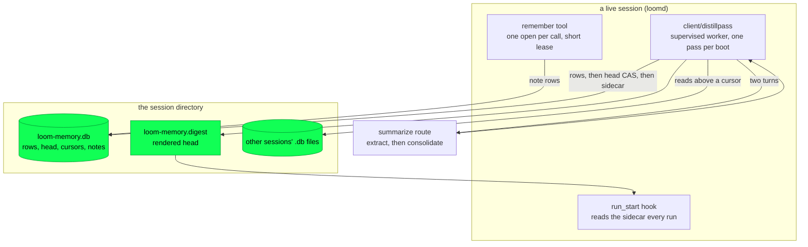

# Memory

A session that has learned something and then ended has learned it for
nobody. Memory is what Loom does about that: a store beside the session
files, a two-turn pipeline that reads closed sessions and consolidates
what they settled, a sidecar the next run of every session injects, and
one model-facing door (`remember`) for the things a model is told
outright. For most of memory stage M2's life the consumer ran in the
server and the *producer* did not — an operator had to run the pipeline
from a source checkout, out of cron or by hand, and a release had
neither. Issue #149 closed that: the pass is now a supervised child of
every ordinary boot, and this page is memory as built.

Memory sits in the durability plane by construction — it is an ordinary
session file, with the same write-once rows, the same leases and the
same total decoders (`docs/architecture/durability.md`) — and reaches
the orchestration plane at exactly one point, the `run_start` hook that
injects the digest. The reasoning behind the design, including why a
memory session rather than a fourth storage concept and what the cache
arithmetic says about injection, is
`docs/design-notes/compaction-and-memory.md` Part 3, and is not repeated
here.

## The four pieces

**The store** is `loom-memory.db`, an ordinary session file beside the
repository's session files rather than inside the workspace — models
edit the workspace, and memory a model can write is durable prompt
injection with a delivery mechanism. Distillates are `CustomEntry` rows
under three registered types (`memory/fact`, `memory/lesson`,
`memory/preference`), each carrying provenance: the source sessions and
entry ids it was derived from. The head is a register naming the rows
currently in force; per-source cursors and the notes cursor are
registers too.

**The pipeline** is `client/distill.gleam:495` (`run`): walk the session
directory, extract per source on a cheap model, consolidate the
candidates and the outstanding `remember` notes against the current head
in one more turn, then re-render the sidecar.

**The lifecycle worker** is `client/distillpass.gleam:330` (`start`),
new in #149: a supervised child that runs exactly one pass per boot and
then idles.

**The injection** is `client/memory.gleam:1412` (`digest_hooks`), which
appends the fenced, attributed digest to every accepted run's opening
messages.

## Which sessions a pass reads, and how it skips the live ones

The rule is one line of code and no heuristics: every candidate source
is opened with the ordinary writer lease, and a file whose lease is held
is skipped (`client/distill.gleam:1002`, `harvest_one`). A live server
holds its own session's lease for the whole of its life, so *the pass
can never read the session it is running inside* — no idle timer, no
clock arithmetic, no second read path. The memory store itself and the
search index are excluded by name (`client/distill.gleam:932`,
`source_files`).

Per-source progress is a `{seq, rewrite generation}` cursor in the
memory session. A generation that no longer matches voids the seq and
the source is read from zero again, because a precise rewrite renumbers
every entry.

What extraction may read is structural rather than textual
(`client/distill.gleam:240`, `extractable`): settled assistant text and
compaction or branch summaries contribute; a **user** message
contributes nothing, which is what permanently excludes an injected
digest from being re-ingested, and a `CustomEntry` contributes nothing,
which excludes `memory/*` rows found anywhere. That is the anti-feedback
rule, and it is a rule about types so that no string can defeat it.

## The three leases

| Lease | TTL | Who takes it | Why that length |
|---|---|---|---|
| The source session's | the server's own | `loomd`, for its whole life | It is what makes "skip the live session" exact. |
| The memory session's, per `remember` call | `lease_ttl_ms`, 30 s (`client/memory.gleam:240`) | `remember_seam` (`client/memory.gleam:1132`) | One open per call, one commit; nothing slow between. |
| The memory session's, per pass | `run_lease_ttl_ms`, 600 s (`client/memory.gleam:263`) | `client/distill.gleam:495` (`run`) | Its commits are separated by whole provider turns, and a lease that expired between them would be stolen mid-run. |

There is deliberately **no new lease type** for the lifecycle worker.
The pass takes the memory session's ordinary writer lease, which is what
makes concurrency safe by construction: a second pass, a hand-run
`loom-distill`, and a `remember` call arriving mid-pass are all refused
in band by the same mechanism, and each is told which owner holds it.

## The lifecycle worker

`client/distillpass.gleam` is a `weft/state_machine` with two states —
`Running` while the pass is in flight, `Idle(pass)` for the rest of the
boot — started under the host's restartable service tier beside the
search-index holder (`client/serve.gleam:2537`, `with_distill_pass`).
Three things about it are load-bearing:

- **It starts after the boot, not inside it.** The pass dispatches model
  turns, and a repository with ten closed sessions would otherwise delay
  the server's first turn by however long extraction takes. Starting it
  as a supervised child also buys the ordering for free: by the time the
  service tier starts, the host has held its own session's writer lease
  since early in `assemble`, so the live session is guaranteed to be
  skipped.
- **The pass runs on its own weft scope, bounded by a wall deadline**
  (`client/distillpass.gleam:461`, `begin`). The machine relays the
  outcome onto its own subject rather than blocking on it, which is what
  lets `settled` answer while a pass is still running. All seven
  `weft.Outcome` variants are matched (`client/distillpass.gleam:494`,
  `reported`).
- **It never re-arms.** One pass per boot is the whole cadence. There is
  no timer and no per-turn hook, because the material a pass can read —
  the sessions closed since the last boot, and the notes the `remember`
  door wrote — does not change while this server runs.

A question asked while the pass is in flight is *postponed* by the state
machine and answered on the transition, which is what makes
`client/distillpass.gleam:386` (`settled`) a wait rather than a poll,
and what lets a black-box test drive the whole lifecycle deterministically.

## Retry, stated in full

**A failed pass is not retried in this session. The next boot reads the
same material again.** That is the entire policy, and it is safe because
nothing moves until the pass succeeds: the write order is rows first,
then the head-and-cursors CAS, then the sidecar
— `client/memory.gleam:680` (`append_distillates`), then
`client/memory.gleam:864` (`advance_head`), then
`client/memory.gleam:1019` (`reconcile_digest`) — so a pass that dies
anywhere leaves every cursor where it was and the previous head
standing.

The one cost of an interruption is a lease, not a row. A pass killed
mid-flight — a shutdown, a fatal child, `SIGKILL` — cannot release the
memory session's lease, which it holds under the ten-minute run TTL. The
store is consistent, but a boot arriving inside that window finds the
lease held and logs `memory.distill.failed` rather than distilling.
There is deliberately no machinery to shorten it: releasing a lease from
outside the process that took it is exactly the theft the run-scale TTL
exists to prevent, and the cost is memory freshness measured in minutes.

## When a new digest becomes visible

The sidecar is read at **run start**, once per accepted run, by the hook
`client/serve.gleam` installs over `client/memory.gleam:1377`
(`read_digest`). Two consequences:

- A digest a pass writes is carried by the **next run** of any session
  on the repository, including later runs of the session whose own
  worker wrote it. It never reaches a run already open — injection
  happens once, when a run is accepted, and nothing in the pipeline
  touches a live prompt.
- The digest rides *messages*, never the pinned system prompt. A changed
  digest therefore costs one rolling tail write rather than a
  session-wide head rewrite, which is the cache rule the design note
  states first.

The design note's second injection rule said memory updates land at
*session* boundaries. With the producer inside the server that becomes
**run** boundaries, deliberately: a boot-time read would hold every
session one pass behind its own pipeline, which is precisely the
symptom #149 was filed about. The cache arithmetic behind the original
rule is unchanged — it is an argument about the pinned prefix, and the
digest was never in it — and the anti-feedback exclusion is structural
rather than temporal, so a digest injected earlier in the same session
still contributes nothing to any later extraction.

The digest body is rendered from the head (`client/memory.gleam:1282`,
`render_digest`) — scrubbed, byte-capped, truncation marked — and the
fence and attribution are built at injection time
(`client/memory.gleam:1457`, `wrapped`) so that the file cannot forge
its own provenance.

## Configuration, cost and cadence

The `[memory]` table in the same `loom.toml` the catalogue comes from,
decoded by `client/distillpass.gleam:158` (`parse`):

| Key | Values | Default | Meaning |
|---|---|---|---|
| `distill` | `"on-boot"`, `"off"` | `"on-boot"` | Whether a pass runs at all. `"off"` starts no worker, logs `memory.distill.off`, and leaves notes accumulating for a hand-run `loom-distill`. |
| `distill_wall_ms` | a positive integer | `600000` | How long one whole pass may take before the deadline reaps it. |

An unknown key in the table is refused, because an opt-out that distils
anyway is the one failure an operator cannot see. `memory` also has to
be in `client/catalog.gleam`'s allowed top-level keys, which is where
this document's table names are checked.

**The model cost of one pass** is one extraction turn per eligible
source session plus one consolidation turn — unchanged by #149, and
routed exactly as the hand-run command routes it: the `summarize` role
when the catalogue declares one, and the resolved main model when it
does not (`client/distill.gleam:1241`, `target`). Both turns' usage rows
land in the memory session's own ledger, so memory's cost is visible
rather than folded into a session's. A pass with nothing to read
dispatches **no** turn at all: extraction runs over zero harvests and
the consolidation is decided on what extraction produced, so a quiet
repository commits a cursors-only transaction and asks nothing.

## What an operator sees

Every pass logs through the session's own logger, under stable names:

| Event | Level | When |
|---|---|---|
| `memory.distill.started` | info | The pass begins; carries the directory and the wall deadline. |
| `memory.distill.completed` | info | The pass ran; carries `sources`, `skipped`, `candidates`, `rows`, and `digest` as `written:<bytes>`, `emptied` or `unchanged`. |
| `memory.distill.failed` | warn | The pipeline refused — a held lease, a provider failure, a dead worker — with the reason and the retry note. Also logged at boot when the catalogue routes nothing the pipeline could ask. |
| `memory.distill.expired` | warn | The wall deadline reaped the pass. |
| `memory.distill.off` | info | This host is configured not to distil. |

The pipeline's own lines keep the `distill.*` names they have always
had: `distill.idle`, `distill.consolidated`, `distill.digest_written`,
`distill.source_unreadable`, `distill.extraction_failed`,
`distill.walk_failed`, `distill.cascaded`.

Per-source outcomes are `debug`, and deliberately so: a machine somebody
is using has a live session in every walk and a quiet one in most, so
they would drown the `info` stream that carries the counts. Raise
`LOOM_LOG_LEVEL` to `debug` and every source says which of the four it
was — `distill.source_read` (with the entry count), `distill.source_live`
("its writer lease is held"), `distill.source_quiet` ("nothing above its
cursor") and, already at `warn`, `distill.source_unreadable` and
`distill.extraction_failed` with their reasons.

## The `remember` door

The one model-initiated write path, and the reason the store exists
before any pass has run. `client/memory.gleam:1132` (`remember_seam`)
opens the store per call under the short lease, scrubs and caps the
note, and refuses in band when a pass holds the run-scale lease, naming
the owner. Notes are a separate entry type from the pipeline's three, so
a model cannot forge a consolidated fact; the consolidation turn folds
outstanding notes in and the notes cursor advances with the head CAS.

## Erasure, and the part that is still open

The erasure cascade is the second command behind the pipeline's entry
point, `client/distill.gleam:842` (`cascade`): after `session/repo` has
rewritten a source session, it drops from the head every distillate
whose provenance names that session (`client/memory.gleam:657`,
`names_source`) and re-renders the sidecar without them, through a head
CAS alone and no new rows (`client/memory.gleam:921`, `replace_head`).
It needs no catalogue and dispatches no model turn.

Two limits are named rather than hidden. It is **first-order**: a
distillate derived from a dropped one keeps its predecessor's id and not
its predecessor's sources, so erasure guarantees stop at the first
derivation. And it **moves no cursor**, which is the open problem
**#124**: since a head is uniform in provenance, an effective cascade
empties it, and the surviving sources keep their high-water cursors — so
their contribution and every hand-written note become unrecoverable by
the pipeline, which will next consolidate the erased source alone over
an empty head. `distill_test`'s
`an_emptying_cascade_loses_the_surviving_sources` pins the loss until a
rewind, a `--rebuild` companion or a `--dry-run` preview lands. #149
does not touch it: the lifecycle worker runs the ordinary pass, and a
cascade stays an operator's deliberate act.

## Where memory is protected

The store and the sidecar join the session base policy's `protected`
list wherever a writable root reaches them (`client/serve.gleam:2869`,
`protecting_memory`). The asymmetry is the point: `protected` bars
writes and leaves reads alone, and writing is the whole of the poisoning
path, since the digest is injected into every run of every session on
the repository without anybody asking for it. The protection is
conditional because neither file need exist, and the jail refuses to
mask a missing path under a read-only parent.

## Where the code lives

| Piece | Module |
|---|---|
| The store, the head, the cursors, the digest and the `remember` seam | `packages/client/src/client/memory.gleam` |
| The pipeline and its two commands | `packages/client/src/client/distill.gleam` |
| The lifecycle worker and the `[memory]` table | `packages/client/src/client/distillpass.gleam` |
| The boot wiring, the protection and the injection | `packages/client/src/client/serve.gleam` |
| The lifecycle, end to end | `packages/client/test/client/memory_lifecycle_test.gleam` |
| The M2 exit criterion, with the pipeline called by hand | `packages/client/test/client/memory_persist_test.gleam` |
| The pipeline's own unit and crash-point tests | `packages/client/test/client/distill_test.gleam` |
