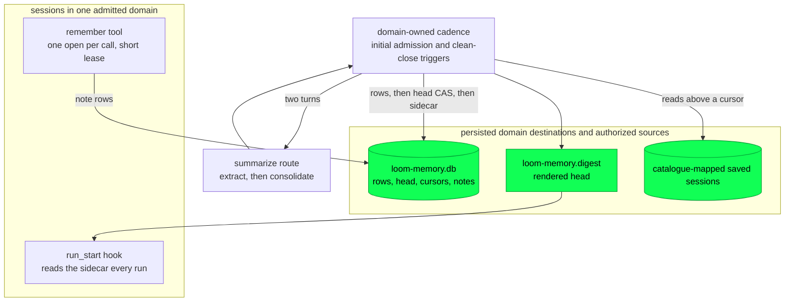

# Memory

Memory carries settled knowledge from one session to later ones. It has four
pieces: a durable store, a two-turn pipeline that extracts and consolidates
knowledge from saved sessions, a rendered digest injected when each run
starts, and a `remember` tool through which the model writes explicit notes.

The managed daemon owns these resources per admitted *domain*, not per
session or per daemon boot. A domain is the memory scope the session
catalogue maps each session to. A workspace-private domain preserves the
owner's aggregate memory for that workspace; an explicit session-only domain
has its own destinations and sources. [Session ownership](sessions.md)
describes the persisted mapping and the isolation rules. Isolation does not
sanitize an existing transcript.

Memory lives in the durability plane. The store is an ordinary session file,
with the same write-once rows, leases and total decoders as any other
(`docs/architecture/durability.md`). It reaches the orchestration plane at
exactly one point: the `run_start` hook that injects the digest. The
rationale for the design, including why memory is a session rather than a
fourth storage concept and what the cache arithmetic says about injection,
is in `docs/design-notes/compaction-and-memory.md` Part 3 and is not repeated
here.

## The four pieces

**The store** is an ordinary session file at the domain's persisted memory
path, outside the editable workspace. It sits outside because models edit
the workspace, and writable aggregate memory would let one session inject
durable instructions into others. Distillates are `CustomEntry` rows under
three registered types (`memory/fact`, `memory/lesson`, `memory/preference`).
Each row carries its provenance: the source sessions and entry ids it was
derived from. The *head* is a register naming the rows currently in force.
The per-source cursors and the notes cursor are registers too.

**The pipeline** on the managed path is
`client/distill.gleam:612` (`prepare`). It runs in four steps:

1. Resolve explicit catalogue sources, after cleanup ownership is published.
2. Extract candidates from each source on a cheap model.
3. Consolidate the candidates and outstanding notes against the current head.
4. Render the digest to a *sidecar* file next to the store.

The standalone `run` adapter can still scan a directory, but it is not the
managed daemon's source authority.

**The lifecycle worker** schedules passes. It is parked by
`client/distillpass.gleam:770` (`prepare_domain`) before publication, then
started through `begin_domain`. While a pass runs, it coalesces authorized
triggers, and it retains the original cleanup witness.

**The injection** is `client/memory.gleam:1675` (`digest_hooks`), which
appends the fenced, attributed digest to every accepted run's opening
messages.

## Which sessions a pass reads, and how it skips the live ones

A managed pass resolves at most 512 saved, catalogue-mapped sources in the
domain, and refuses the overflow. Reserved registrations are not sources,
and the resolver never falls back to scanning a directory.

Each source opens under its ordinary writer lease, with its canonical
session identity checked (`client/distill.gleam:1261`, `harvest_one`). A
resident session holds that lease until its effects retire, so extraction
skips it. Shared history has a separate read-only path for live sources;
those reads are not distillation and do not take over the writer lease.

Per-source progress is a `{seq, rewrite generation}` cursor in the memory
session. If the recorded generation no longer matches the source, the seq is
void and the source is read again from zero, because a precise rewrite
renumbers every entry.

What extraction may read is decided by entry type, not by text
(`client/distill.gleam:257`, `extractable`). Settled assistant text and
compaction or branch summaries contribute. A **user** message contributes
nothing, which permanently prevents an injected digest from being
re-ingested. A `CustomEntry` contributes nothing, which excludes
`memory/*` rows wherever they appear. Together these form the
anti-feedback rule, which is stated over types so that no string can
defeat it.

## The three leases

| Lease | TTL | Who takes it | Why that length |
|---|---|---|---|
| The source session's | the session owner's | The resident instance, through confirmed retirement | It is what makes "skip the live session" exact. |
| The memory session's, per `remember` call | `lease_ttl_ms`, 30 s (`client/memory.gleam:253`) | `remember_seam` (`client/memory.gleam:1298`) | One open per call, one commit; nothing slow between. |
| The memory session's, per pass | `run_lease_ttl_ms`, 600 s (`client/memory.gleam:276`) | The owned distillation pass | Its commits are separated by whole provider turns, and a lease that expired between them would be stolen mid-run. |

The lifecycle worker deliberately has **no new lease type**. A pass takes the
memory session's ordinary writer lease, and that makes concurrency safe by
construction. A second pass, a hand-run `loom-distill`, and a `remember`
call arriving mid-pass are all refused in band by the same mechanism, and
each refusal names the owner that holds the lease.

## The lifecycle worker

The managed worker is a `weft/state_machine` owned by the domain host. Its
life runs through these steps:

1. **Start.** Publication precedes `begin_domain`. Beginning a parked worker
   starts its initial pass without making session admission wait for model
   turns. Each pass has a bounded Weft scope and an original retirement
   witness. A pass result describes pipeline work; it does not prove that
   every resource has closed.
2. **Follow-ups.** Clean session retirement sends `notify_domain`
   (`client/distillpass.gleam:848`). An active pass retains at most one
   follow-up, so several closes cannot build an unbounded work queue.
   There is no periodic timer. A failed pass discards the pending
   follow-up instead of retrying; a later authorized trigger may start a
   new pass.
3. **Quiescence.** When the last session retires, the manager sends the
   final close hint and then
   `request_quiesce` (`client/distillpass.gleam:933`), in that order.
   Quiescence fences new triggers and waits for the current pass and
   any follow-up already coalesced. Only then does the manager cancel the
   domain host.
4. **Reclamation.** The domain slot is reclaimed by the host's original
   normal retirement, not by the quiescence reply alone. If the cleanup
   proof is lost, the slot stays blocked. Normal daemon shutdown drains
   sessions before domains.

An explicit open can revive a quiescing domain while daemon admission is
still open. The manager resumes the cadence and replaces the settle reply
subject before it publishes the revived slot. Resuming discards the worker's
parked replies. A reply decided before the resume may still arrive, and the
replacement subject prevents it from settling a later close. Shutdown and
failed maintenance do not permit revival.

The old `start`/`settled` one-pass adapter remains for standalone and
internal callers. Its per-session boot cadence is not the managed path.

## Retry, stated in full

A pass writes in a fixed order: rows first, then the CAS over the head and
cursors, then the sidecar. The three steps are
`client/memory.gleam:717` (`append_distillates`),
`client/memory.gleam:901` (`advance_head`), and
`client/memory.gleam:1185` (`reconcile_digest`).

- A failure before the CAS leaves the previous head and cursors intact. Any
  rows already appended are orphans, invisible through that head.
- A failure after the CAS keeps the new durable progress, even if sidecar
  publication or cleanup fails.

A later authorized pass resumes from the committed state; it never assumes a
rollback.

Cancellation asks the owned resources to close in order. A close failure, or
missing proof of the original retirement, retains custody and can block
domain reclamation. Neither a caller timeout nor an expired lease proves
that an old native owner has stopped. Lease expiry is a recovery boundary
for an abandoned store, not a substitute for the live daemon's cleanup
proof.

## When a new digest becomes visible

The sidecar is read once per accepted run, at **run start**, by the hook
that `client/serve.gleam` installs over `client/memory.gleam:1565`
(`read_digest`). Two consequences follow:

- A digest written by a pass reaches the **next run** of any session mapped
  to that domain. It never reaches a run already open: injection happens
  once, when a run is accepted, and nothing in the pipeline touches a live
  prompt.
- The digest is carried in *messages*, never in the pinned system prompt.
  A changed digest therefore costs one rolling tail write rather than a
  session-wide head rewrite, which is the cache rule the design note states
  first.

The design note's second injection rule said memory updates land at
*session* boundaries. With the producer inside the server, they land at
**run** boundaries instead, deliberately. A boot-time read would hold every
session one pass behind its own pipeline, which is the symptom #149 was
filed about. The cache arithmetic behind the original rule still holds,
because it is an argument about the pinned prefix and the digest was never
in that prefix. The anti-feedback exclusion is structural rather than
temporal, so a digest injected earlier in the same session still
contributes nothing to later extraction.

The digest body is rendered from the head
(`client/memory.gleam:1448`, `render_digest`): scrubbed, capped in bytes,
and marked where truncated. The fence and attribution are added at
injection time (`client/memory.gleam:1721`, `wrapped`), so the file cannot
forge its own provenance.

The read is bounded before it happens, because it reads an untrusted file
on the strand driver's own process at every run. One `stat` gets the
sidecar's size. A file over `max_sidecar_bytes`, four times the size the
pipeline renders, is refused whole rather than read and clipped, and one
`memory.digest_oversize` line reports it. A file that is only over the
render cap is still read and clipped, since `render_digest` could plausibly
have produced it.

## Configuration, cost and cadence

The domain's persisted configuration reference supplies its maintenance
catalogue and its `[memory]` table, which
`client/distillpass.gleam:205` (`parse`) decodes. This configuration is
independent of each session's runtime configuration. An explicit empty
domain reference does not fall back to a later daemon default.

| Key | Values | Default | Meaning |
|---|---|---|---|
| `distill` | `"on-boot"`, `"off"` | `"on-boot"` | The retained configuration spelling enables initial domain admission and clean-close triggers. `"off"` disables maintenance, not shared history or explicit notes. |
| `distill_wall_ms` | a positive integer, at most `600000` | `600000` | How long one whole pass may take before the deadline reaps it. The ceiling is the memory session's run lease: nothing renews that lease but a commit, so a pass cannot outlive it, and a larger value is refused rather than clamped. |

An unknown key in the table is refused, because an opt-out that distils
anyway is a failure the operator cannot see. `memory` must also appear in
`client/catalog.gleam`'s allowed top-level keys, which is where this
document's table names are checked.

**The model cost of one pass** is one extraction turn per eligible source
session plus one consolidation turn; #149 did not change it. The turns are
routed exactly as the hand-run command routes them: to the `summarize` role
when the catalogue declares one, and to the resolved main model otherwise
(`client/distill.gleam:1568`, `target`). Both turns' usage rows land in the
memory session's own ledger, so memory's cost is visible rather than folded into
another session's.

A pass with nothing to read dispatches **no** turn. Extraction runs over
zero harvests, and whether to consolidate depends on what extraction
produced, so a quiet repository commits a cursors-only transaction and sends
no request.

## What an operator sees

Managed passes log through the domain's logger, under stable names:

| Event | Level | When |
|---|---|---|
| `memory.distill.started` | info | The managed pass begins; carries the memory destination. |
| `memory.distill.completed` | info | The pass ran; carries `sources`, `skipped`, `candidates`, `rows`, and `digest` as `written:<bytes>`, `emptied` or `unchanged`. |
| `memory.distill.failed` | warn | The pipeline or cleanup refused, with its reason and the note that committed progress is retained. This does not promise rollback or an automatic retry. |
| `memory.distill.expired` | warn | The wall deadline reaped the pass. |
| `memory.distill.off` | info | Maintenance is disabled for this configuration. |
| `memory.digest_oversize` | warn | A run met a sidecar too large to be a digest and injected nothing; carries the size, the limit and what to do about it. Not a pass event: it is the *consumer* refusing. |

The pipeline's own lines keep their `distill.*` names: `distill.idle`,
`distill.consolidated`, `distill.digest_written`,
`distill.source_unreadable`, `distill.extraction_failed`,
`distill.walk_failed`, `distill.cascaded`.

Per-source outcomes log at `debug`, deliberately. On a machine in use, every
walk finds a live session and most find a quiet one, so per-source lines
would drown the `info` stream that carries the counts. With
`LOOM_LOG_LEVEL` set to `debug`, each source reports one of four outcomes:

- `distill.source_read`, with the entry count;
- `distill.source_live`, meaning its writer lease is held;
- `distill.source_quiet`, meaning nothing is above its cursor;
- `distill.source_unreadable` or `distill.extraction_failed`, already at
  `warn`, with their reasons.

## The `remember` door

`remember` is the one write path the model initiates, and it is why the
store exists before any pass has run.
`client/memory.gleam:1298` (`remember_seam`) opens the store per call
under the short lease, then scrubs and caps the note. It
refuses in band, naming the owner, when a pass holds the run-scale lease.
Notes are a separate entry type from the pipeline's three, so a model cannot
forge a consolidated fact. The consolidation turn folds outstanding notes
in, and the notes cursor advances with the head CAS.

## Erasure, and the rebuild it schedules

The erasure cascade is the pipeline's second command,
`client/distill.gleam:1019` (`cascade`). After `session/repo` has rewritten
a source session, the cascade drops from the head every distillate whose
provenance names that session
(`client/memory.gleam:694`, `names_source`). It then re-renders the
sidecar without them, through a head CAS that writes no new
rows (`client/memory.gleam:1076`, `replace_head`). It needs no catalogue and
dispatches no model turn.

The cascade is **first-order**, and we state that limit openly. A distillate
derived from a dropped one keeps its predecessor's id but not its
predecessor's sources, so the erasure guarantee stops at the first
derivation.

**A cascade that drops rows rewinds the cursors** (issue #124). A head holds
one consolidation's batch, so its provenance is uniform, and any cascade
that drops anything empties it. Reading the surviving sources again is then
the only possible rebuild. The CAS that replaces the head therefore also
winds every recorded cursor back to zero and resets the notes cursor
(`client/memory.cursor_rewind`, committed through `replace_head`).

The cursors to rewind are found by a prefix scan of the memory session's
own `distill/cursor/*` cells. Those cells are the pipeline's record of
everything it has ever read, so they name sources that a walk at cascade
time could not see: a file a live server holds the lease on, or a file
since moved away. Both must be re-read if they come back. A rewound cursor
keeps its recorded generation and zeroes only the seq, and that is exact:
`cursor_from` answers `Cursor(0, generation)` when the generation still
matches and a fresh cursor when it has moved, and both re-read from zero.
The erased source's own cursor is rewound with the rest, which changes
nothing for it, because the rewrite generation had already voided it.

**The drop and the rewind must be one transaction.** A crash between an
emptied head and a separate cursor write would leave an empty head above
high-water cursors, which is the unrecoverable state #124 described. A
cascade over a session that no distillate names still writes nothing: only
a drop triggers the rewind, and the no-op stays a no-op.

**The rebuild costs** one extraction request per readable source plus one
consolidation, at the next authorized domain pass or the operator's next
manual one. The dropped rows stay in the store as orphans that nothing
reads again. `loom-distill --cascade <session> --dry-run` opens the store
under the short lease, computes the same answer (what would be dropped,
kept and rewound), reports it, and writes nothing: no CAS, no cursor, no
sidecar. #149 changed none of this. The lifecycle worker runs the ordinary
pass, and a cascade stays a deliberate operator action.

## Where memory is protected

The store and the sidecar join the session base policy's `protected` list
wherever a writable root reaches them
(`client/serve.gleam:2869`, `protecting_memory`).
`protected` bars writes and leaves reads alone, and that asymmetry is
intended: writing is the entire poisoning path, since the digest is injected
into every run of every session on the repository without anyone asking for
it. The protection is conditional because neither file need exist, and the
jail refuses to mask a missing path under a read-only parent.

## Where the code lives

| Piece | Module |
|---|---|
| The store, the head, the cursors, the digest and the `remember` seam | `packages/client/src/client/memory.gleam` |
| The pipeline and its two commands | `packages/client/src/client/distill.gleam` |
| The lifecycle worker and the `[memory]` table | `packages/client/src/client/distillpass.gleam` |
| The boot wiring, the protection and the injection | `packages/client/src/client/serve.gleam` |
| The lifecycle, end to end | `packages/client/test/client/memory_lifecycle_test.gleam` |
| The M2 exit criterion, with the pipeline called by hand | `packages/client/test/client/memory_persist_test.gleam` |
| The pipeline's own unit and crash-point tests | `packages/client/test/client/distill_test.gleam` |
