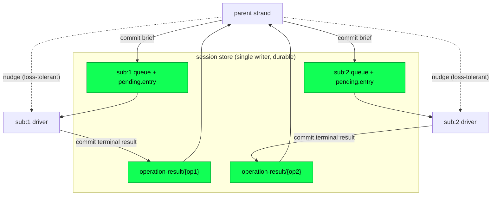

# Inter-strand messaging

A **strand** is a named line of work in a session: the main conversation,
a subagent, or a parallel attempt. Each strand is driven by its own actor
over a shared, write-once conversation tree. This page describes how
strands send each other work and results, and the rule behind it: every
payload travels through the durable store, and a process message is used
only as a content-free wake-up. The patterns below (request/reply,
peer-to-peer, blackboard, broadcast) are all built from the orchestration
plane's existing queue machinery and the durability plane's commits.

Two strands in the same session run as two processes on the same BEAM
node, so one *could* reach the other with a raw `Process.send`. Loom
forbids that on purpose. A BEAM mailbox lives only in a process's heap,
and a strand's supervisor restarts that process on any crash. A message
sitting unread in the mailbox at that instant is gone: never in the
transcript, invisible to recovery, and believed delivered by its sender.
An unread "found the bug at auth.gleam:42" becomes ghost state, which is
exactly the failure the durability plane exists to eliminate. So strands
message each other through the store, not through their mailboxes.

## The doctrine: durable payloads, ephemeral doorbells

Every payload one strand sends another travels in a commit: the same
atomic, single-writer transaction that records everything else durable in
the session (see `docs/architecture/durability.md`). The commit writes the
payload to a register and appends its id to the target's queue. Only
after the payload is durable does the sender ring a **doorbell**, a plain
process message called a **nudge** that asks the target's driver to
re-plan now instead of at its next scheduled check.

The nudge carries no content, so losing it costs latency and never data.
Each strand's driver runs a periodic **checkpoint poll**, a timer that
drives one planning pass on a fixed interval. That pass re-reads the
strand's registers and finds any durably queued work whether or not a
nudge arrived. A lost doorbell means the target acts one poll interval
later. A lost payload cannot happen, because the payload was durable
before the doorbell rang.

The line between the two kinds of message is sharp:

> If the recipient would act differently for having received a message,
> it goes through a commit. If the message only affects pacing or
> display, a plain process message is fine.

Findings, task briefs, results, and shared state change what a strand
does, so they commit. Progress ticks, heartbeats, and a cancellation hint
sent ahead of a durable abort affect only timing or a display, so they may
ride an ordinary message where loss is harmless. The rule is about
**correctness**, not security: sibling strands are trusted harness code,
and the model influences their content, never their code.

## One enqueue plus one doorbell

Every messaging primitive in the session API is the same two steps: a
durable admission through the StorageWriter, then a doorbell. The
admission is the orchestration plane's ordinary queue machinery: the
`steer` and `follow-up` enqueues and the fresh-run acceptance that also
serve a human at the keyboard (see `docs/architecture/orchestration.md`).
Inter-strand messaging adds no new transport; it aims the existing
admission at a sibling strand.

The crash behaviour follows from that shape:

- A sender that dies after the commit has already delivered the payload.
- A sender that dies before the commit delivered nothing, and its caller
  retries.
- A target that dies between the doorbell and acting restarts. Its first
  recovery pass, identical to a normal planning pass, reads the queue and
  finds the message waiting.

The api exposes `_quietly` variants (`accept_quietly`, `steer_quietly`)
that commit without ringing at all. Schedulers use them, and the
doorbell-loss tests use them to prove a run completes on the poll alone.



The solid edges are commits; a crash on either side resumes from them.
The dashed edges are doorbells; if they are dropped, the checkpoint poll
still delivers.

## The four patterns

The design names four inter-agent patterns. All four are built entirely
from machinery the single-strand runtime already had.

### Request/reply

A parent spawns a subagent and later collects its result. `create_strand`
does four things in order:

1. It seeds the child's three registers durably: its own model identity,
   its own leaf (a cursor into the shared tree; `None` starts at the
   root), and its own strand state.
2. It starts the child's driver.
3. It accepts the task brief as the child's first run.
4. It rings the child's doorbell.

Because the registers are durable before anything runs, every later
reboot of the tree restores the child.

Starting the driver goes through `supervisor.start_strand`, which asks
`Config.subagent` which of the tree's two strand factories owns the name
and starts the strand there. The predicate is evaluated afresh every time
rather than cached, so the answer survives a restart with no state of its
own. The default predicate classifies no strand as a subagent. The runtime
cannot distinguish a model-spawned strand from an operator-spawned one,
so the host injects the predicate. `docs/architecture/orchestration.md`
covers why the two factories sit in that order.

```gleam
let assert Ok(op) =
  api.create_strand(
    runtime,
    named: "sub:reviewer",
    configuration: reviewer_config,
    at: Some(leaf),
    brief: [task_brief],
  )

// ... the parent does other work ...

case
  api.await_strand_result(
    runtime,
    strand: "sub:reviewer",
    operation: op,
    within_ms: 5000,
  )
{
  Ok(result) -> handle(result)
  Error(Nil) -> still_running()
}
```

The child's terminal transaction records its outcome twice, atomically:
in the latest-wins `strand.last_result` register, and in an
operation-keyed copy under the reserved `fact.custom/operation-result/{op}`
key. `await_strand_result` reads straight from the store, so it survives
tree restarts, and it keys on the operation. Every subagent leaves its
full transcript in the shared tree; the parent takes only the structured
result.

### Peer-to-peer

Two live strands converse by messaging each other, with every turn
durable. `send_to_strand` admits the payload onto the target and reports
how it landed.

```gleam
// implementer -> reviewer
let assert Ok(Steered(_)) =
  api.send_to_strand(runtime, to: "sub:reviewer", message: patch_ready)

// reviewer -> implementer, some turns later
let assert Ok(delivery) =
  api.send_to_strand(runtime, to: "sub:impl", message: findings)
```

`Delivery` distinguishes the two admissions the target allowed.
`Steered(entry)` means the target had an open run and the message is a
durable steer item on its queue. `Started(operation)` means the target
was idle and the message opened a fresh run. `send_to_strand` tries the
steer first. If the target reports no active run, it accepts a new run,
and if a run opens in that gap it retries the steer. A target flipping
between busy and idle therefore never drops the message.

Not every peer is a child. The harness creates the **advisor** strand
through `api.create_idle_strand` rather than through the Agency, so the
advisor has no `lineage/` cell. Its isolation from lineage tools follows
from that absence. `agent_send` and `agent_wait` check the cell before one
strand may address another, and `strand.roster` lists from it. Neither
strand can use those tools to address the other, and neither appears in
the other's lineage roster. Peer links are a separate, explicit owner
grant under Protocol 048, so advisor isolation also requires withholding
those links.

The one channel between the advisor and the primary runs the other way,
and the harness builds it from the machinery above. The advisor calls a
tool, the harness determines what that verdict costs, and only then does
a `send_to_strand` carry the text to the primary. A peer created this way
is owned by the session rather than by a parent, so no parent's run end
reaps it and no detached deadline retires it.
`docs/architecture/advisor.md` has the loop, the guard that rations it,
and the two `fact.custom` cells it keeps.

### Blackboard

The **blackboard** is `fact.custom`, the one register namespace shared
across strands; every other namespace is owned by a single strand or
operation. It holds transactional session state that any strand may read
and write.

```gleam
// the reviewer posts a finding
let assert Ok(Nil) =
  api.put_fact(runtime, "review/findings", finding_json)

// the implementer reads the whole review namespace
let assert Ok(entries) = api.facts(runtime, prefix: Some("review/"))
```

A fact write is a commit and nothing else. Registers carry no
watch-or-notify, so a `put_fact` rings no doorbell. When a reader must
*act* on a fact rather than read it at its own next decision point, pair
the write with a `send_to_strand`, or let the reader's checkpoint poll
pick it up.

The harness reserves prefixes through `api.reserved_fact_key` to prevent
model-written facts from changing authority or lifecycle state. Each
reserved prefix blocks a specific forgery:

- `escalation/`: manufacturing an approval and widening a denied call.
- `operation-result/`: shadowing an operation's terminal result and lying
  to every waiter.
- `lineage/`: rewriting a parent edge, which is the single assumption the
  wait graph's acyclicity rests on.
- `prompt/`: rewriting the operator's channel.
- `client/`: tampering with async execution records, workflow steps, peer
  grants, and delivery receipts.

Reserving a prefix does two things. `put_fact` refuses it, and `facts`
*hides* it, so a reserved cell is invisible through the blackboard API as
well as unwritable. That is why the harness needs its own API:
`api.put_reserved_fact` and `api.reserved_facts` read and write exactly
the namespace that `facts` and `put_fact` will not touch, and refuse
everything outside it. The two APIs are deliberately disjoint rather than
one API with a flag, so neither can be used as the other. `put_fact` is
reachable from a model-supplied key and must never name a reserved cell;
`put_reserved_fact` is reachable only from harness code that builds the
key itself. (The singular `fact` read never consulted the reservation and
still does not.)

### Broadcast

The EventBus carries ephemeral awareness to subscribers (user interfaces,
projections, the client gateway) over an OTP `pg` scope, keyed per
session and topic.

```gleam
bus.publish(bus, session: session_id, event: bus.StrandResult(strand: "sub:3"))
```

Bus events are thin: `StrandResult(strand)` names the strand that
settled, never its result. Two events do carry a string, the `phase` on
`OpTransition` and the `description` on `Escalation`, but each is a label
for a display, never a machine input. The `op.state` register and the
durable escalation record stay the source of truth.

A subscriber that was down, slow to join, or on another node misses the
event, and that is legal by design. Anything that must be correct pulls
from the store on the next hint, sync, or restart. Broadcast is therefore
for prompt awareness, not delivery. A strand that needs a sibling to
*act* writes a durable fact or sends to it directly, and may use the bus
to prompt a reader sooner. (Cross-node fan-out over a clustered `pg`
scope is follow-up work; today the bus is local to one node.)

## Guarantees the message layer rests on

Two fixes in the multi-strand (M3) wave close races that would otherwise
corrupt a conversation between strands.

**A result belongs to its operation, not to whoever asks last.** Keying
the wait on `strand.last_result` alone has a hole: a child that starts a
second run overwrites that register, so a parent still waiting on the
first run's result would read the second run's result, or nothing. The
operation-keyed `operation-result/{op}` fact closes the hole. The terminal
transaction writes both rows atomically, latest-wins touches only the
strand register, and `await_strand_result` reads the operation's own row
first. A child's second run can no longer make its first result
unobservable.

**An approval reaches only its own call.** An escalation is the one
durable message whose purpose is security rather than correctness. The
flow is:

1. When the capability broker denies an effect, the runtime records a
   durable escalation under the reserved `escalation/` prefix. The record
   is attributed to the exact call the denial was raised for, a
   `CallScope` of `{operation, strand, step, source index, call id}`.
2. A human's approval attaches grants to that record.
3. On re-execution, a strand's clearance path loads only the approvals
   whose scope matches the call it is clearing.
4. It consumes each approval by compare-and-swap *before* composing its
   grants into policy, and passes forward only the grants whose
   consumption commit won.

An unscoped approval matches no clearance and widens nothing. So an
approval a human granted for one call can never widen a different call,
on the same strand or any other, and one approval is worth at most one
widened execution of exactly the call approved.

## Explicit peers and background workflows

[Protocol 048](../../protocol-change/048-async-collaboration.md) adds
directional peer links independently of lineage. The owner grants a
source session and strand permission to message one target session and
strand. Starting work on an idle target requires the separate `may_wake`
permission.

The recipient's `peer_mail` handler checks the durable grant. It commits
the message and receipt in the same transaction, provided the grant has
not changed. Retrying the same message ID, target, and body returns the
receipt without adding another message. The receipt proves admission, not
model consumption. The daemon routes to resident endpoints only;
discovery can list saved sessions without opening them. An unavailable
link remains one unavailable roster row.

Both steering an active operation and starting an idle strand place the
same `UserMessage` with a host-bound `PeerOrigin(session, strand)`. The
message body contains the sender's text. `core/origin` serializes the
identity independently and adds a peer-agent attribution label when
projecting provider input. Human origins keep their existing
representation, and a malformed peer origin is reported as corruption
rather than replayed as anonymous text.

A background execution keeps one satellite alive under a fixed deadline.
`cap/execution.receive` reads committed input that the program can decode
into messages for its typed actors. Children belong to that execution and
survive the launching turn. Closing the execution cancels its owned
children and waits for their background work to settle.

`cap/workflow.step` records a named step's input and assignment before
starting its child. Repeating the step recovers the original child
operation, even if lineage publication was interrupted. The runtime
commits that original operation ID with the brief, so a later run cannot
replace it. See the [API guide](../async-collaboration.md) for examples
and recovery limits.

## What is durable, and what is ephemeral

| Message | Carrier | On loss |
|---|---|---|
| A `send_to_strand` payload | commit: `pending.entry` + a queue list | never lost; durable before the doorbell |
| A subagent's task brief | commit: an accepted run | never lost |
| A subagent's terminal result | commit: `strand.last_result` + `operation-result/{op}` | never lost; readable across restarts |
| A blackboard fact | commit: a `fact.custom` cell | never lost |
| An escalation and its decision | commit: `fact.custom` under `escalation/` | never lost |
| A strand's existence | commit: `strand.config` / `strand.leaf` / `strand.state` | never lost; recovery reboots every strand |
| The doorbell (`nudge`) | process message | target acts one poll-interval later |
| An EventBus hint | best-effort `pg` send | subscriber catches up on the next hint or sync |
| Progress ticks, liveness pings | process message | harmless by construction |
| A scheduled heartbeat's fire | commit: a marked steer or fresh-run admission + its occurrence's fired-mark | never lost; a crash before the commit re-derives the same due occurrence and tries again |
| A model-created schedule | commit: a `schedule/config/…` cell claimed on its absence | never lost; a second claim of the name is told `NameTaken` rather than overwriting |
| A schedule's observation instant | commit: a `schedule/seen/…` cell claimed once by the scanner | never lost; the expiry clock a restart re-derives is the one every incarnation agreed on |
| A schedule's retirement | commit: its marks, then its seen cell, then its config cell deleted | a fault mid-way leaves a live schedule with a reset count, never an orphan clock for a reused name |

The rule reads straight down the table: if a row is a commit, a crash
cannot lose it; if a row is a process message, losing it costs latency or
a delayed display, never a payload.

Two rows use the word "heartbeat" for unrelated things. A **liveness
ping** is the ephemeral pacing signal that §4.6 already allows to ride a
bare process message, because losing one costs only a moment's staleness
in a display. A **scheduled heartbeat** (`client/schedule` and
`client/schedulescan`) is a time-triggered admission: an operator's
`[[schedule]]` table or a strand's own schedule, firing onto a strand on a
clock instead of at a human's or a sibling strand's request. It changes
what the model sees, so it commits like every other durable payload: the
injected text and its write-once fired-mark land in one transaction.

That is the same `steer_marking` argument this document already makes for
triggered project rules. Scheduled heartbeats extend it to a door those
rules never needed, `send_to_strand_marking`, because an opt-in scheduled
heartbeat, unlike a rule, may start a fresh run on an idle strand.
`docs/design-notes/scheduled-heartbeats.md` has the full ruling.

## Where the code lives

| Path | What it holds |
|---|---|
| `runtime/api.gleam` | `create_strand`, `send_to_strand`, `await_strand_result`, `on_strand`; the `put_fact` / `fact` / `facts` blackboard; the escalation decisions. |
| `runtime/strand_runtime.gleam` | The driver: the `Nudge` doorbell, the checkpoint poll that finds durable work anyway, the clearance path that consumes a scoped approval. |
| `machine/queue.gleam` | Steer and follow-up admission — the durable enqueue every message rides. |
| `machine/acceptance.gleam` | `accept_prompt` — the fresh-run admission a `send_to_strand` to an idle strand uses. |
| `runtime/escalation.gleam` | The durable escalation record, its `CallScope`, and its status transitions. |
| `events/bus.gleam` | The EventBus: typed per-session topics of thin hints. |
| `events/projection.gleam` | Pull-based read models that converge from the store on each hint. |
| `client/schedule.gleam` | The scheduled-heartbeat store — three timings, owner and target, the bounds — and the occurrence arithmetic (`interval_late`, `cron_late`, `recurring_expired`). |
| `client/cron.gleam` | The pure five-field cron core the `Cron` timing searches with; no clock, no I/O. |
| `client/schedulescan.gleam` | The timer-driven scanner: one marked admission per due occurrence, `steer_marking` or `send_to_strand_marking` depending on `wake`, and the settled-target check that ends a schedule with the strand it fires onto. |
| `client/scheduleseam.gleam` | The model's door: the claim on a config cell's absence, the lineage-checked target, `retire`, and the `run_end` reaper. |
| `client/scheduleadmin.gleam` | The operator's door over the protocol: list everything, cancel what a strand wrote, through the same `retire`. |
| `client/advisor.gleam` | The advisor loop: the run-boundary hooks, the branch scan from a stored cursor, the framed feed, and the `advise` seam that refuses any caller but the advisor strand. |

Each path is relative to its package's source root: `runtime/api.gleam`
is `packages/runtime/src/runtime/api.gleam`. For the doctrine's intent,
`docs/loom-design.md` §4.6 states the rule. For the queue machinery every
pattern reuses, `docs/architecture/orchestration.md` covers admission,
doorbells, and the drive loop. For the store beneath it all,
`docs/architecture/durability.md` covers commits, registers, and the
single writer.
