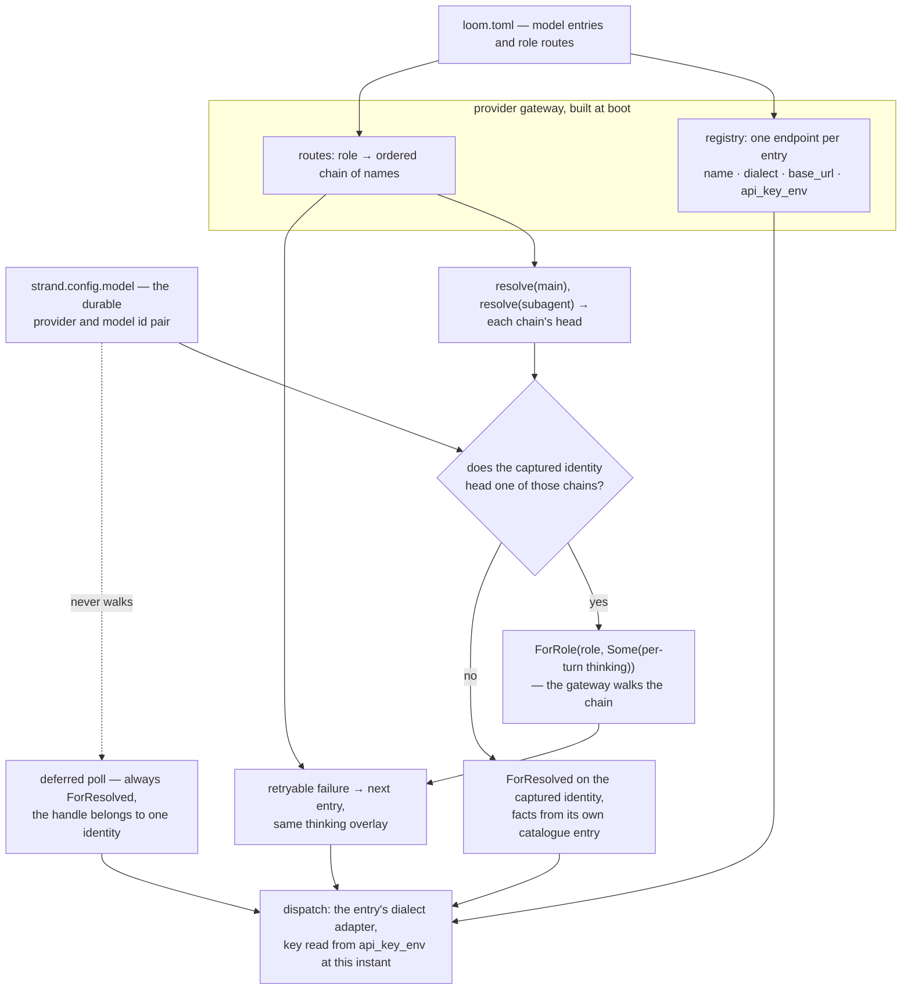

# The model plane

A harness that knows one vendor's endpoint stops when that vendor does.
A rate limit stalls the session, a retired model id ends it, and a task
better served by something cheaper or larger has nowhere to go. So Loom
holds no model constant in its source. Which model a request reaches is
data: a TOML file the operator writes, read once at boot into the
provider gateway's registry, and reachable afterward by name from the
session protocol and from the terminal UI.

What follows is that catalogue as built, in `client/catalog`,
`client/serve`, `client/wiring`, the `models` and `set_config` commands
of the websocket protocol, and the `/model` picker in the native TUI. The
dispatch machinery underneath — the streaming contract, total
stop-reason mapping, overflow arithmetic, the secret seam, and the
gateway's own fallback semantics — is described in
`docs/architecture/effects.md` under "Providers", and is not repeated
here.

## What an operator writes

The server takes `--config <loom.toml>`. The file has exactly two
top-level tables: `[models.<name>]` entries and one `[roles]` table
routing over their names. `docs/examples/loom.toml` is the commented
version, and it doubles as a parse fixture in the catalogue's test
suite, so an example that drifts from the parser fails the build.

```toml
[models.baseten-oss]
dialect = "openai"
base_url = "https://inference.baseten.example/v1"
api_key_env = "BASETEN_API_KEY"
model_id = "openai/gpt-oss-120b"
context_window = 128000
max_output_tokens = 16000
thinking = "unsupported"

[models.anthropic-opus]
dialect = "anthropic"
api_key_env = "ANTHROPIC_API_KEY"
model_id = "claude-opus-5"
context_window = 1000000
max_output_tokens = 32000

[roles]
main = ["baseten-oss", "anthropic-opus"]
subagent = ["baseten-oss"]
summarize = ["anthropic-opus"]
```

`dialect` is `"anthropic"`, `"openai"` or `"gemini"` and selects the wire
adapter. `base_url` is optional; omitting it takes the dialect's
conventional root (`https://api.anthropic.com`, `https://api.openai.com/v1`,
`https://generativelanguage.googleapis.com/v1beta`), and a
trailing slash is stripped so the config author need not know that the
gateway's `ProviderConfig` forbids one. `model_id` is the identifier
the provider expects in the request body, copied through verbatim.
`context_window` and `max_output_tokens` are positive token counts —
the window is what adapter-computed overflow compares against, so a
figure invented here buys a wrong overflow verdict later. `thinking`
accepts `off`, `low`, `medium`, `high`, or `unsupported`, where
`unsupported` is the config author's word for a model with no reasoning
mode and maps to `off`, which sends no reasoning field at all. For a
Gemini 3 model, which cannot stop reasoning, `off` therefore means the
model reasons at its own default and shows none of it.

**Keys never live in the file.** `api_key_env` names an environment
variable, and that name travels all the way into the gateway's
`ProviderConfig` as a name. The value is read once per dispatch by the
injected secret store and copied into one outbound header. A catalogue
whose variables are all unset still boots and still serves: every
request against that entry fails in band as `NoSecret`, carrying the
provider and the secret's name and nothing else.

**Parsing is total and strict, and strictness is the point.** Any
malformed document, unknown key, unknown dialect, unknown role name,
non-positive limit, or chain entry naming a model the `[models]` table
does not define comes back as a worded error naming the offending
table, and the server refuses to boot on it. A typoed `api_key_env`
that was merely ignored would boot happily and then fail every request
with a confusing missing-key error hours later; refusing the file is
the cheaper failure. The `[roles]` table must route `main` — a strand
with no main identity has nothing to run.

Without `--config` the server shapes a one-entry catalogue from the
environment instead: an Anthropic entry named `anthropic` whose model
id, base URL, and limits come from `LOOM_MODEL`, `LOOM_BASE_URL`,
`LOOM_CONTEXT_WINDOW`, and `LOOM_MAX_OUTPUT_TOKENS`, routed as `main`.
The entry is called `anthropic` deliberately: sessions written before
the catalogue existed stored that provider name in their durable
identities, and they keep resolving. With `--config` those variables
are not consulted at all — the file is the whole model surface —
though `LOOM_SYSTEM_PROMPT` is read either way.

## The name is the durable handle

One decision propagates through everything else here: **an entry's
catalogue name is its provider name.** `catalog.gateway` registers one
`ProviderConfig` per entry keyed by that name, so the durable
`{provider, model_id}` identity a strand stores is exactly
`{catalogue-name, model_id}`.

That collapse is what lets a name be the only handle anyone needs. The
`models` listing keys rows by it; `set_config`'s `model_name` accepts
it; the TUI displays it; and the reverse lookup — given a strand's
durable identity, which catalogue entry is that? — is a single lookup
of the identity's provider half. Two entries may point at the same
provider model id under different names, differing in endpoint,
credential, or declared limits, and the harness treats them as two
distinct identities, because they are.

## Roles and chains

Five roles are routable: `main`, `subagent`, `plan`, `summarize`, and
`vision`. Each row of `[roles]` is an ordered chain of entry names,
best first. `gateway.resolve(role)` returns the first target in that
chain whose provider is registered — which, for a gateway built from a
catalogue, is always the head, since every name in a chain names a
registered entry. The resolved value carries the entry's static facts,
context window and output ceiling and thinking level, alongside the
identity.

Resolution feeds dispatch, and since the M5 routing wave it also decides
it — but only where a walk cannot change what the intent promised.

The rule is one sentence: **role follows identity.** An effect intent
commits the identity it will use *before* the request goes out, so
`client/wiring.request_target` starts from the strand's captured identity
and asks a single question of it — is this identity the *head* of some
routable role's chain? If it is, the dispatch is `ForRole(role, …)` and
the gateway walks that chain inside the attempt: a rate-limited head falls
to its own tail instead of burning the machine's retry ladder against an
endpoint that is refusing. If it is not — a strand switched to an entry no
role heads, or a catalogue whose routes have moved since the session was
written — the dispatch is `ForResolved` on exactly the captured identity,
because a walk there would reach a model the intent never named.

Both answers are a pure function of durable state and boot configuration,
which is what makes this safe across a crash. Recovery does not
re-dispatch a request that is still in flight; it orphans it, settles it
synthetically, and re-attempts from the checkpoint. What has to agree
across that gap is the *decision*, not the socket — and the decision reads
only the strand's captured identity and a registry fixed before the
session opened.

Off route, the model facts come from the identity's own catalogue entry
(`wiring.Config.facts`, built by `client/serve` from the catalogue), so a
switched strand is dispatched, admitted and compacted against the window
and ceiling it will actually meet. Only an identity the catalogue does not
know at all falls back to the wiring config's declared counts. On both
paths the strand's per-turn thinking level is what reaches the provider —
as an overlay onto *every* target of a walk (`protocol-change/009`), so a
fallback cannot silently answer at a smaller reasoning budget than the
head was asked for.

Deferred polls are the one dispatch held to `ForResolved` unconditionally.
A deferred handle is minted by one identity and ORCH-L4 validates the
settlement against exactly the `{provider, model_id, api}` the intent
captured, so a poll that walked a chain would fetch a continuation nobody
issued.



Two roles are dispatched on today: `main` and `subagent`. `main` serves
any strand configured with its chain head; `subagent` serves a strand an
Agency spawned, because `client/agency` *seeds* a child with
`resolve(subagent)`'s identity at creation and the derivation then
recognises that identity as subagent's head. `summarize` is dispatched on
by structural summaries, which go out `ForRole(Summarize, None)` — as a
role, chain walk included, with no thinking overlay so the summarization
entry's own declared level applies. A summary is published as text rather
than as a response attributed to a model, so there is no durable identity
contract to honour there and a cheaper fallback is pure gain.

`plan` and `vision` are **reserved vocabulary**: parsed, validated, routed
into the registry, reported in the `models` listing, and dispatched on by
nothing. There is no plan-generation step and no image-bearing request
path in the harness for them to attach to, so wiring a dispatch site would
be inventing the caller as well as the route. Recorded in
`docs/spec-gaps.md`.

## Dialects and the adapter seam

What actually differs between the dialects is small and entirely
contained in the adapters. Anthropic posts to `base_url <> "/v1/messages"`
with `x-api-key` and `anthropic-version: 2023-06-01`, takes the system
prompt as a top-level `system` field, names its output ceiling
`max_tokens`, and expresses reasoning as a `thinking` object with an
explicit token budget (2048, 8192, or 16384 for low, medium, and high).
The OpenAI-compatible adapter posts to `base_url <> "/chat/completions"`
with an `authorization: Bearer` header, folds the system prompt into
the message list as a `system` turn, names its ceiling
`max_completion_tokens`, asks for usage with
`stream_options.include_usage`, and expresses reasoning as
`reasoning_effort: "low" | "medium" | "high"`. Their streams differ
too — named SSE events with typed content blocks against unnamed chunk
documents terminated by a literal `[DONE]` — and each folds its own
dialect into the same settled assistant message.

The Gemini adapter is the third, and the first that is shaped like
neither. It posts to `base_url <> "/models/" <> model_id <>
":streamGenerateContent?alt=sse"` with the key in `x-goog-api-key`, takes
the system prompt as `systemInstruction`, names its ceiling
`maxOutputTokens`, and declares tools as `functionDeclarations` carrying
`parametersJsonSchema`. Reasoning is a `thinkingConfig`, and the knob
inside it depends on the model generation: Gemini 3 takes a
`thinkingLevel` word and rejects a token budget, Gemini 2.5 takes a
`thinkingBudget` and rejects the word, so the adapter reads the
generation off the model id — the same rule pi and oh-my-pi apply. Its
stream has no terminator sentinel: each unnamed event is a whole
`GenerateContentResponse`, whose parts arrive complete rather than as
deltas (a function call comes with its arguments already parsed), and
the body simply closes after the chunk that carried a `finishReason`.
Two facts about that wire are load-bearing. A `thoughtSignature` may
ride on any part and must be replayed with the block it signed; a
function call sent back without one is a hard 400, so a call with no
stored signature — one another model made earlier in the conversation —
replays with the `skip_thought_signature_validator` sentinel the API
documents for that case. And `STOP` is the only finish reason a
tool-calling turn ends with, so settlement promotes it to tool use when
the response carried a call. `docs/examples/loom.toml` has the entry
shape; a Google AI Studio key is what `api_key_env` names, since Vertex
AI wants OAuth rather than an API key and is not reachable through this
dialect.

Above that seam nothing knows the difference. A catalogue entry chooses
an adapter and a base URL, and every layer above holds a
provider-neutral `ProviderRequest`.

The same neutrality applies to lifetime. A request returns a
provider-neutral `StreamHandle` whose cancel capability reaches the active
transport owner and whose optional owner pid acknowledges the complete drain.
Today the lowest owner is a parked native process which receives the raw
`httpc` messages itself and retains the request id plus dedicated handler;
a future Responses or subscription-backed adapter may retain a different
native handle without changing the gateway, fallback policy, runtime, or
client wrappers. This is an ownership seam inside the process tree, not an
HTTP server or proxy between Loom and the provider.

The payoff showed up the first time the seam was tested against an
endpoint neither adapter was written for. Baseten hosts
OpenAI-compatible inference; reaching it took an entry with
`dialect = "openai"` and its inference URL as `base_url`, and **no
change to the OpenAI adapter at all** — not a header, not a body field,
not a stream-parsing branch. That is the whole argument for the seam
in one data point.

## Switching models while a session runs

Two switches exist, and they scope differently.

The wire command is `set_config` with a `model_name` key, whose value
is a catalogue name. The gateway resolves that name server-side and
refuses an unknown one, so a client never handles raw provider facts.
With a `strand` field the switch rewrites that strand's durable
configuration; without one it rewrites every strand's, which is the
session-wide switch. Strands created afterward copy the main strand's
configuration when they are seeded, so a session-wide switch carries
forward rather than applying only to the strands that happened to exist
at the time. The reply echoes the effective configuration, and it
carries `model_name` back whenever the strand's identity is one the
catalogue knows — the same handle the client switched with, so it can
display and re-select by it. The lower-level `model` key, taking a raw
`{provider, model_id}` object, remains available for a strand and
bypasses the catalogue entirely.

A switch moves the identity and **nothing else** — in particular it does
not touch `thinking_level`, even though the entry declares one. The
entry's level seeds a strand at creation; the per-turn level afterwards
belongs to whoever is having the conversation, and changing model mid-run
is not a request to un-raise a reasoning budget somebody deliberately
raised. A client that wants both sends both keys. What a *newly seeded*
strand gets is the other half of the same rule: `fork` and `create_strand`
copy the source strand's configuration but re-seed its thinking level from
the catalogue entry the copied identity names, because a fresh strand has
had no conversation to inherit a per-turn decision from.

The terminal UI drives exactly that. Typing `/model` sends the
protocol's `models` command. The reply is a snapshot carrying one row
per entry — name, dialect, provider model id, the roles whose chain
lists it, and the subset it currently heads — and it opens a modal
picker. Each row renders as `name (dialect · model_id)` followed
by role tags with a star on the roles the entry actually resolves for,
so `roles: main*,summarize` reads as "listed for main and summarize,
currently serving main." The cursor starts on the active strand's
current model when the TUI knows it, making enter-without-moving a
no-op. `j`/`k` move, enter sends `set_config` with `model_name` scoped
to the active strand, and escape closes without touching anything. A
hub with no catalogue answers an empty listing and the picker reports
that rather than opening — a shape the session server never produces,
since a catalogue always exists, environment-shaped if not from a file.

Nothing about either switch reaches the provider gateway's registry. A
switch rewrites durable strand configuration; the registry built at
boot is unchanged, and the next dispatch resolves against it exactly as
before.

## Known limits

Five, and each is a boundary somebody chose rather than a gap nobody
noticed.

**The walk covers refusals the provider answers, never configuration
errors.** A missing secret is terminal: a chain head whose `api_key_env`
is unset stops the attempt with the `NoSecret` refusal rather than
falling to a tail whose key is present. The walk exists for what varies
per request — a rate limit, a transport failure — and an unset variable
does not vary; falling past it would let a misconfigured head look
healthy on every dispatch while its own row silently never serves.

**Per-model headers are refused rather than carried.** A `headers` key
in an entry gets its own worded rejection instead of being silently
ignored, because the gateway's `ProviderConfig` has no header slot to
put one in. The bearer key from `api_key_env` is the only credential
either adapter sends, which is all Baseten's OpenAI-compatible
endpoints need.

**Role chains are boot-time only, and the head is always tried first.**
The `[roles]` routing is baked into the registry the wiring closures
capture when the server starts. `model_name` moves a strand's — or the
session's — identity, but re-routing a role's chain at runtime would need
a mutable registry or a restart, and neither exists. Nor is there any
memory *within* a boot: no health tracking, no circuit breaker, no sticky
chain position. A chain whose head is rate-limited is walked past on every
single request, paying one refused round trip each time, and the harness
never concludes that the head is down. That is the deliberate trade — a
walk is a dispatch-time choice and never a routing change, so "preferred"
means preferred, not "preferred until it fails once", and nothing has to
decide when a model has recovered.

**Selection is by role and position, never by cost or latency.** The
chain's order is the operator's stated preference and the only input.
Nothing measures how long an entry took or what it charged, and nothing
reorders a chain on that basis.

**`plan` and `vision` route nothing.** Both are parsed, validated, routed
into the registry and listed — reserved vocabulary with no dispatch site,
because the harness has no plan-generation step and no image-bearing
request path to attach one to. Recorded in `docs/spec-gaps.md`.

One earlier limit is closed and worth naming because the shape of the fix
is reusable. *Off-route model facts* used to fall back to the main chain
head's window and ceiling, since `client/wiring.Config` had no
per-identity lookup; it now carries `facts`, an
`identity -> #(ResolvedModel, api)` seam that `client/serve` builds from
the catalogue, and admission, the compaction threshold and an off-route
dispatch target all read the switched-to entry's own figures. The same
seam fixed a quieter bug beside it: the durably captured `request_api` had
been the main entry's dialect for every strand, including one switched to
an entry of the *other* dialect, which is a value ORCH-L4 later validates
a deferred handle against. *An entry's `thinking` not reaching the wire*
is closed too, differently: it is not an override at dispatch — it
**seeds** a strand's per-turn level at creation, at all three creation
points (boot's `main`, the hub's fork/create_strand, an Agency's child).

## Where the code lives

| Path | What it holds |
|---|---|
| `client/catalog.gleam` | The `loom.toml` parser (total, strict, worded errors), `Catalog`/`CatalogModel`/`Dialect`, the `find`/`main_model`/`routed_roles`/`active_roles` lookups, and `gateway` — catalogue to registry plus routes. |
| `client/serve.gleam` | The `--config` ladder, the environment-shaped one-entry catalogue, the `Settings` the wiring config is built from, `catalogue_facts` (the per-identity fact seam), `seed_thinking`, and the Agency's `subagent_model` resolver. |
| `client/wiring.gleam` | `request_target` (role derivation from the captured identity), `resolved_target` (off route and every deferred poll), the per-query admission and per-strand threshold window, and `strand_thinking_level` — the lift that seeds a strand from an entry. |
| `client/agency.gleam` | `Config.subagent_model` and `child_configuration`: a spawned child's identity and seed thinking level, chosen once at creation. |
| `client/gateway.gleam` | The `models` listing, `set_config`'s `model_name` with its strand and session scopes, the catalogue name echoed in the effective config, and `seeded_thinking` — a forked or created strand takes the entry in force's level. |
| `client/protocol.gleam` | `ListModels`, `ModelsSnapshot`, `ModelInfo`, `SetConfig` — the wire shapes, pinned by the Go golden fixtures. |
| `provider/gateway.gleam` | `ProviderConfig`, the builder, `resolve`, and the chain walk. |
| `provider/model.gleam` | `Role`, `ResolvedModel`, `RequestTarget` (whose `ForRole` carries the thinking overlay — `protocol-change/009`), `ThinkingLevel`, `ProviderRequest`. |
| `provider/adapter/anthropic.gleam`, `.../openai.gleam`, `.../gemini.gleam` | The three dialects: URLs, headers, body shapes, reasoning fields, stream folds. |
| `provider/retry.gleam` | `classify` — which provider failures count as retryable, for the chain walk and for the runtime's retry ladder alike. |
| `provider/secret.gleam` | The `fn(name) -> Result(String, Nil)` lookup and its environment backend. |
| `packages/tui/src/tui/model_selector.gleam` | The `/model` picker: the modal, search ranking, cursor, role tags, and selected catalogue name. |
| `docs/examples/loom.toml` | The worked example, and a parse fixture in `client/test/client/catalog_test.gleam`. |

Each Gleam path is relative to its package's source root —
`client/catalog.gleam` is `packages/client/src/client/catalog.gleam` —
and the TUI path is rooted at `packages/tui`. For the dispatch
machinery this plane configures, see `docs/architecture/effects.md`
under "Providers"; for how a strand captures and re-dispatches an
identity across a crash, `docs/architecture/orchestration.md` covers
the effect sandwich and the durable program counter. For intent and
contracts, `docs/loom-design.md` §4.4 states the role-routing intent
and `docs/loom-implementation-spec.md` §1.5 holds the frozen gateway
interface, with WP-F's scope in Part 2;
`protocol-change/009-forrole-carries-thinking.md` is the amendment that
let a walk carry a turn's reasoning budget; `docs/spec-gaps.md` records
where the implementation refined the spec, the reserved `plan`/`vision`
vocabulary included.
