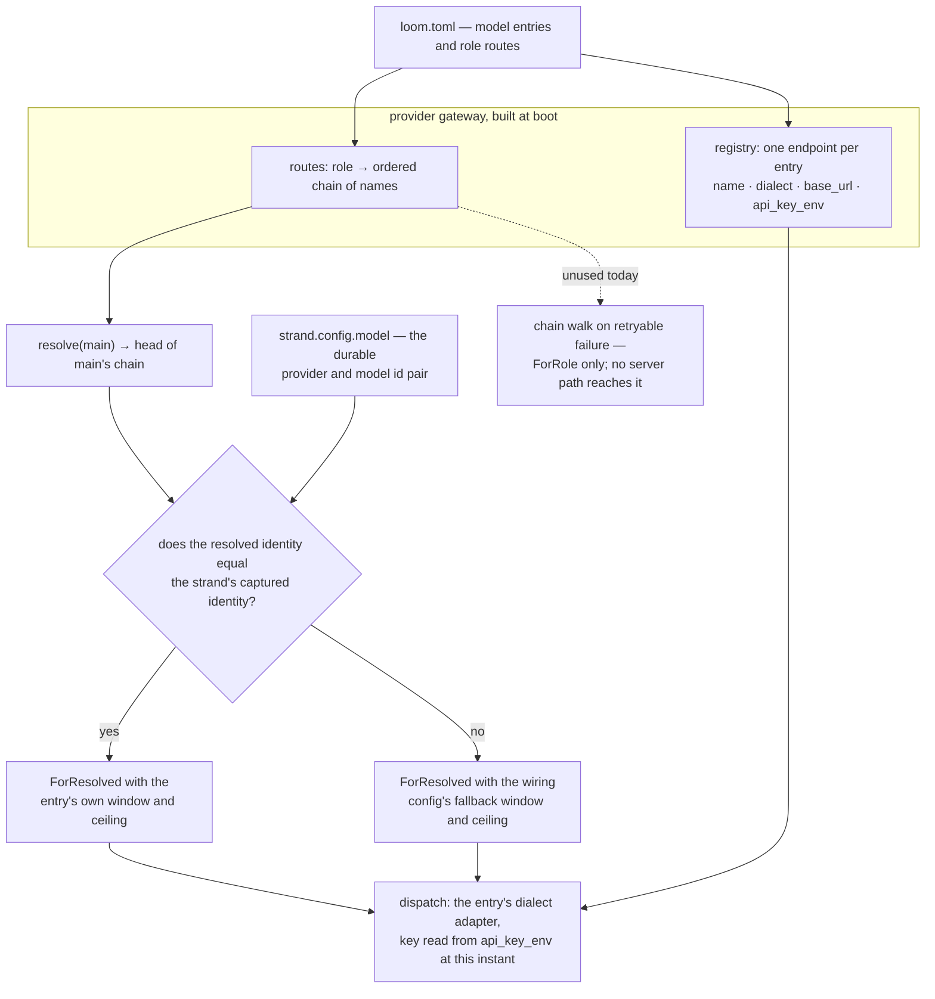

# The model plane

A harness that knows one vendor's endpoint stops when that vendor does.
A rate limit stalls the session, a retired model id ends it, and a task
better served by something cheaper or larger has nowhere to go. So Loom
holds no model constant in its source. Which model a request reaches is
data: a TOML file the operator writes, read once at boot into the
provider gateway's registry, and reachable afterward by name from the
session protocol and from the terminal UI.

What follows is that catalogue as built, in `client/catalog`,
`client/serve`, `client/wiring`, the `models` and `set_config` commands
of the websocket protocol, and the `:models` picker in the Go TUI. The
dispatch machinery underneath — the streaming contract, total
stop-reason mapping, overflow arithmetic, the secret seam, and the
gateway's own fallback semantics — is described in
`docs/architecture/effects.md` under "Providers", and is not repeated
here.

## What an operator writes

The server takes `--config <loom.toml>`. The file has exactly two
top-level tables: `[models.<name>]` entries and one `[roles]` table
routing over their names. `docs/examples/loom.toml` is the commented
version, and it doubles as a parse fixture in the catalogue's test
suite, so an example that drifts from the parser fails the build.

```toml
[models.baseten-oss]
dialect = "openai"
base_url = "https://inference.baseten.example/v1"
api_key_env = "BASETEN_API_KEY"
model_id = "openai/gpt-oss-120b"
context_window = 128000
max_output_tokens = 16000
thinking = "unsupported"

[models.anthropic-opus]
dialect = "anthropic"
api_key_env = "ANTHROPIC_API_KEY"
model_id = "claude-opus-5"
context_window = 1000000
max_output_tokens = 32000

[roles]
main = ["baseten-oss", "anthropic-opus"]
subagent = ["baseten-oss"]
summarize = ["anthropic-opus"]
```

`dialect` is `"anthropic"` or `"openai"` and selects the wire adapter.
`base_url` is optional; omitting it takes the dialect's conventional
root (`https://api.anthropic.com`, `https://api.openai.com/v1`), and a
trailing slash is stripped so the config author need not know that the
gateway's `ProviderConfig` forbids one. `model_id` is the identifier
the provider expects in the request body, copied through verbatim.
`context_window` and `max_output_tokens` are positive token counts —
the window is what adapter-computed overflow compares against, so a
figure invented here buys a wrong overflow verdict later. `thinking`
accepts `off`, `low`, `medium`, `high`, or `unsupported`, where
`unsupported` is the config author's word for a model with no reasoning
mode and maps to `off`, which sends no reasoning field at all.

**Keys never live in the file.** `api_key_env` names an environment
variable, and that name travels all the way into the gateway's
`ProviderConfig` as a name. The value is read once per dispatch by the
injected secret store and copied into one outbound header. A catalogue
whose variables are all unset still boots and still serves: every
request against that entry fails in band as `NoSecret`, carrying the
provider and the secret's name and nothing else.

**Parsing is total and strict, and strictness is the point.** Any
malformed document, unknown key, unknown dialect, unknown role name,
non-positive limit, or chain entry naming a model the `[models]` table
does not define comes back as a worded error naming the offending
table, and the server refuses to boot on it. A typoed `api_key_env`
that was merely ignored would boot happily and then fail every request
with a confusing missing-key error hours later; refusing the file is
the cheaper failure. The `[roles]` table must route `main` — a strand
with no main identity has nothing to run.

Without `--config` the server shapes a one-entry catalogue from the
environment instead: an Anthropic entry named `anthropic` whose model
id, base URL, and limits come from `LOOM_MODEL`, `LOOM_BASE_URL`,
`LOOM_CONTEXT_WINDOW`, and `LOOM_MAX_OUTPUT_TOKENS`, routed as `main`.
The entry is called `anthropic` deliberately: sessions written before
the catalogue existed stored that provider name in their durable
identities, and they keep resolving. With `--config` those variables
are not consulted at all — the file is the whole model surface —
though `LOOM_SYSTEM_PROMPT` is read either way.

## The name is the durable handle

One decision propagates through everything else here: **an entry's
catalogue name is its provider name.** `catalog.gateway` registers one
`ProviderConfig` per entry keyed by that name, so the durable
`{provider, model_id}` identity a strand stores is exactly
`{catalogue-name, model_id}`.

That collapse is what lets a name be the only handle anyone needs. The
`models` listing keys rows by it; `set_config`'s `model_name` accepts
it; the TUI displays it; and the reverse lookup — given a strand's
durable identity, which catalogue entry is that? — is a single lookup
of the identity's provider half. Two entries may point at the same
provider model id under different names, differing in endpoint,
credential, or declared limits, and the harness treats them as two
distinct identities, because they are.

## Roles and chains

Five roles are routable: `main`, `subagent`, `plan`, `summarize`, and
`vision`. Each row of `[roles]` is an ordered chain of entry names,
best first. `gateway.resolve(role)` returns the first target in that
chain whose provider is registered — which, for a gateway built from a
catalogue, is always the head, since every name in a chain names a
registered entry. The resolved value carries the entry's static facts,
context window and output ceiling and thinking level, alongside the
identity.

Resolution feeds dispatch, but it does not decide it. Every production
dispatch is `ForResolved`, never `ForRole`, and the reason is the
recovery story: an effect intent commits the identity it will use
*before* the request goes out, and re-dispatching that committed intent
after a crash must reach the same model rather than whatever the
registry now prefers. `client/wiring.request_target` therefore starts
from the strand's captured identity and consults the configured role
only to enrich it: when the role resolves to that same identity, the
entry's own window and ceiling ride along; when it resolves to
something else, or fails to resolve, the captured identity is kept and
the wiring config's fallback window and ceiling fill the gaps. On both
paths the strand's per-turn thinking level overwrites the route's, so a
turn that raises its reasoning budget reaches the provider with exactly
that budget.



The consequence is worth stating plainly, because the file format
invites the opposite reading. **A chain's tail does not serve as a
runtime fallback in the session server today.** The gateway can walk a
chain — `request` with a `ForRole` target tries each target in turn,
moving on only for a failure `retry.classify` calls retryable,
surfacing a terminal error at once and the last real error when the
chain is exhausted, and never falling back after a settled response —
and `docs/architecture/effects.md` describes that walk. But
`client/wiring` is the only production consumer of the gateway, and it
never builds a `ForRole` target. What a retryable provider failure gets
in a live session is the machine's own retry ladder against the same
captured identity, not the next entry in the chain. A chain's tail
affects a running session only if its head becomes unregistered, which
a catalogue-built gateway cannot arrange.

The same seam bounds the other roles. `client/serve` builds one wiring
config for the whole session with `role: model.Main`, so every strand —
main or subagent — resolves against main's chain. The `subagent`,
`plan`, `summarize`, and `vision` rows are parsed, validated, routed
into the registry, and reported in the `models` listing, and nothing
dispatches on them. Structural summaries have no provider surface at
all yet (recorded in `docs/spec-gaps.md` under the M2 integration), so
`summarize` has nothing to route even in principle. The design doc
places full role routing in the fifth milestone. Until then the routing
table records which models an operator intends for which purpose, and
selects a model only for `main`.

## Dialects and the adapter seam

What actually differs between the two dialects is small and entirely
contained in the adapters. Anthropic posts to `base_url <> "/v1/messages"`
with `x-api-key` and `anthropic-version: 2023-06-01`, takes the system
prompt as a top-level `system` field, names its output ceiling
`max_tokens`, and expresses reasoning as a `thinking` object with an
explicit token budget (2048, 8192, or 16384 for low, medium, and high).
The OpenAI-compatible adapter posts to `base_url <> "/chat/completions"`
with an `authorization: Bearer` header, folds the system prompt into
the message list as a `system` turn, names its ceiling
`max_completion_tokens`, asks for usage with
`stream_options.include_usage`, and expresses reasoning as
`reasoning_effort: "low" | "medium" | "high"`. Their streams differ
too — named SSE events with typed content blocks against unnamed chunk
documents terminated by a literal `[DONE]` — and each folds its own
dialect into the same settled assistant message.

Above that seam nothing knows the difference. A catalogue entry chooses
an adapter and a base URL, and every layer above holds a
provider-neutral `ProviderRequest`.

The payoff showed up the first time the seam was tested against an
endpoint neither adapter was written for. Baseten hosts
OpenAI-compatible inference; reaching it took an entry with
`dialect = "openai"` and its inference URL as `base_url`, and **no
change to the OpenAI adapter at all** — not a header, not a body field,
not a stream-parsing branch. That is the whole argument for the seam
in one data point.

## Switching models while a session runs

Two switches exist, and they scope differently.

The wire command is `set_config` with a `model_name` key, whose value
is a catalogue name. The gateway resolves that name server-side and
refuses an unknown one, so a client never handles raw provider facts.
With a `strand` field the switch rewrites that strand's durable
configuration; without one it rewrites every strand's, which is the
session-wide switch. Strands created afterward copy the main strand's
configuration when they are seeded, so a session-wide switch carries
forward rather than applying only to the strands that happened to exist
at the time. The reply echoes the effective configuration, and it
carries `model_name` back whenever the strand's identity is one the
catalogue knows — the same handle the client switched with, so it can
display and re-select by it. The lower-level `model` key, taking a raw
`{provider, model_id}` object, remains available for a strand and
bypasses the catalogue entirely.

The terminal UI drives exactly that. Typing `:models` sends the
protocol's `models` command. The reply is a snapshot carrying one row
per entry — name, dialect, provider model id, the roles whose chain
lists it, and the subset it currently heads — and it opens a modal
picker. Each row renders as `name (dialect · model_id)` followed
by role tags with a star on the roles the entry actually resolves for,
so `roles: main*,summarize` reads as "listed for main and summarize,
currently serving main." The cursor starts on the active strand's
current model when the TUI knows it, making enter-without-moving a
no-op. `j`/`k` move, enter sends `set_config` with `model_name` scoped
to the active strand, and escape closes without touching anything. A
hub with no catalogue answers an empty listing and the picker reports
that rather than opening — a shape the session server never produces,
since a catalogue always exists, environment-shaped if not from a file.

Nothing about either switch reaches the provider gateway's registry. A
switch rewrites durable strand configuration; the registry built at
boot is unchanged, and the next dispatch resolves against it exactly as
before.

## Known limits

Four, the first three of them recorded in `docs/spec-gaps.md` under
WP-L.

**Off-route model facts fall back.** Switching a strand to a catalogue
entry that is not what the configured role resolves to dispatches with
the wiring config's fallback context window and output ceiling — the
figures from the *main chain head* — rather than the switched-to
entry's own, because `client/wiring.Config` has no per-identity fact
lookup. Dispatch itself is exact: the adapter, base URL, key, and model
id all come from the entry. Only the overflow arithmetic is
approximate, and the fix belongs in the wiring seam.

**Per-model headers are refused rather than carried.** A `headers` key
in an entry gets its own worded rejection instead of being silently
ignored, because the gateway's `ProviderConfig` has no header slot to
put one in. The bearer key from `api_key_env` is the only credential
either adapter sends, which is all Baseten's OpenAI-compatible
endpoints need.

**Role chains are boot-time only.** The `[roles]` routing is baked into
the registry that the wiring closures capture when the server starts.
`model_name` moves a strand's — or the session's — identity, but
re-routing a role's chain at runtime would need a mutable registry or a
restart, and neither exists today.

**An entry's `thinking` level does not reach the wire.** It is parsed,
carried into the route's resolved value, and then overwritten on every
dispatch by the strand's own thinking level, which starts at `off` and
changes through `set_config`'s `thinking_level` key. The override is
deliberate — a turn that asks for a larger reasoning budget must get
it — but it leaves the catalogue field with no effect in the server
today.

## Where the code lives

| Path | What it holds |
|---|---|
| `client/catalog.gleam` | The `loom.toml` parser (total, strict, worded errors), `Catalog`/`CatalogModel`/`Dialect`, the `find`/`main_model`/`routed_roles`/`active_roles` lookups, and `gateway` — catalogue to registry plus routes. |
| `client/serve.gleam` | The `--config` ladder, the environment-shaped one-entry catalogue, and the `Settings` the wiring config and the seed strand configuration are built from. |
| `client/wiring.gleam` | `request_target`: captured identity, role resolution, the fallback facts, and the thinking override. |
| `client/gateway.gleam` | The `models` listing, `set_config`'s `model_name` with its strand and session scopes, and the catalogue name echoed in the effective config. |
| `client/protocol.gleam` | `ListModels`, `ModelsSnapshot`, `ModelInfo`, `SetConfig` — the wire shapes, pinned by the Go golden fixtures. |
| `provider/gateway.gleam` | `ProviderConfig`, the builder, `resolve`, and the chain walk. |
| `provider/model.gleam` | `Role`, `ResolvedModel`, `RequestTarget`, `ThinkingLevel`, `ProviderRequest`. |
| `provider/adapter/anthropic.gleam`, `.../openai.gleam` | The two dialects: URLs, headers, body shapes, reasoning fields, stream folds. |
| `provider/retry.gleam` | `classify` — which provider failures count as retryable, for the chain walk and for the runtime's retry ladder alike. |
| `provider/secret.gleam` | The `fn(name) -> Result(String, Nil)` lookup and its environment backend. |
| `internal/ui/model.go` | The `:models` picker: the modal, the cursor, the role tags, and the `set_config` it sends. |
| `docs/examples/loom.toml` | The worked example, and a parse fixture in `client/test/client/catalog_test.gleam`. |

Each Gleam path is relative to its package's source root —
`client/catalog.gleam` is `packages/client/src/client/catalog.gleam` —
and the Go path is relative to `packages/tui`. For the dispatch
machinery this plane configures, see `docs/architecture/effects.md`
under "Providers"; for how a strand captures and re-dispatches an
identity across a crash, `docs/architecture/orchestration.md` covers
the effect sandwich and the durable program counter. For intent and
contracts, `docs/loom-design.md` §4.4 states the role-routing intent
and `docs/loom-implementation-spec.md` §1.5 holds the frozen gateway
interface, with WP-F's scope in Part 2; `docs/spec-gaps.md` records
where the implementation refined the spec, including three of the four
limits above.
