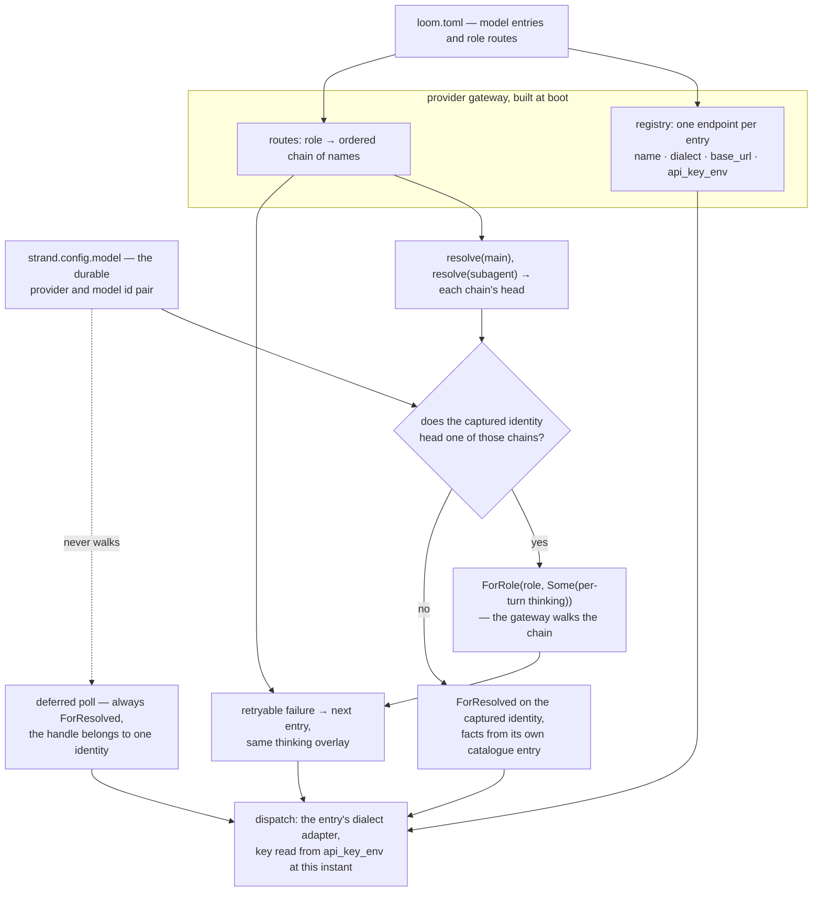

# The model plane

Loom holds no model constant in its source. A harness hard-wired to one
vendor's endpoint stops when that vendor does: a rate limit stalls the
session, a retired model id ends it, and a task better served by a cheaper
or larger model has nowhere to go. So the model a request reaches is data.
The operator writes a TOML file, the server reads it once at boot into the
provider gateway's registry, and afterwards the session protocol and the
terminal UI refer to each model by name.

The model plane is that catalogue and its consumers:

- `client/catalog` parses the file into named entries and role routes;
- `client/serve` and `client/wiring` turn a strand's model identity into a
  dispatch target;
- the websocket protocol's `models` and `set_config` commands list and
  switch models;
- the native TUI's `/model` picker drives those commands.

The dispatch machinery underneath (the streaming contract, total
stop-reason mapping, overflow arithmetic, the secret seam, and the
gateway's own fallback semantics) is described in
`docs/architecture/effects.md` under "Providers", and this document does
not repeat it.

## What an operator writes

The server takes `--config <loom.toml>`. Model configuration uses
`[models.<name>]` entries and one `[roles]` table that routes over their
names; the same file can also configure MCP servers, extensions, and
project rules. `docs/examples/loom.toml` is the commented version. It is
also a parse fixture in the catalogue's test suite, so an example that
drifts from the parser fails the build.

```toml
[models.baseten-oss]
dialect = "openai"
base_url = "https://inference.baseten.example/v1"
api_key_env = "BASETEN_API_KEY"
model_id = "openai/gpt-oss-120b"
context_window = 128000
max_output_tokens = 16000
thinking = "unsupported"

[models.anthropic-opus]
dialect = "anthropic"
api_key_env = "ANTHROPIC_API_KEY"
model_id = "claude-opus-5"
context_window = 1000000
max_output_tokens = 32000

[roles]
main = ["baseten-oss", "anthropic-opus"]
subagent = ["baseten-oss"]
summarize = ["anthropic-opus"]
```

The entry fields:

- `dialect` is `"anthropic"`, `"openai"`, `"gemini"`, or
  `"openai-responses"`, and selects the wire adapter. `openai` remains Chat
  Completions; it does not select Responses.
- `base_url` is optional. Omitting it takes the dialect's conventional root
  (`https://api.anthropic.com`, `https://api.openai.com/v1`,
  `https://generativelanguage.googleapis.com/v1beta`). A trailing slash is
  stripped, so the config author need not know that the gateway's
  `ProviderConfig` forbids one.
- `model_id` is the identifier the provider expects in the request body,
  copied through verbatim.
- `context_window` and `max_output_tokens` are positive token counts.
  Adapter-computed overflow compares against the window, so an invented
  figure here produces a wrong overflow verdict later.
- `thinking` accepts `off`, `low`, `medium`, `high`, or `unsupported`.
  `unsupported` means the model has no reasoning mode; it maps to `off`,
  which sends no reasoning field at all. A Gemini 3 model cannot stop
  reasoning, so for it `off` means the model reasons at its own default and
  shows none of the reasoning.

### Image limits

`max_images` is an optional positive count, defaulting to eight. It limits
all attached and tool-result image blocks in a provider request, history
included. The default is conservative, and the setting should match the
endpoint's actual limit. The gateway applies it separately to each
resolved fallback, starting from the original request each time.

The limit replaces the oldest historical images with explicit placeholders
and preserves text, answers, tool-call relationships, and metadata. Images
in the active run stay intact. If the active run alone has too many, the
request fails with a local, terminal `image_limit` error before secret
lookup or transport.

Wiring supplies the image count for the entire admitted run, so held
prompts remain one batch even when the last prompt is text. Compaction does
not reset that boundary. The count follows original entries back to the
operation's source leaf and ignores copies in retained tails. Retained
tails are contiguous suffixes, so when compaction removes current-run
images, all older history has also left the projection. Capping the
protected count to the images still in the request then preserves the
surviving current images.

A new run gets a new boundary, so a session can recover after an oversized
image turn. Durable image bytes remain available; the placeholders exist
only in the transient request projection.

### The Responses dialect

Responses uses the same default API root as Chat Completions but posts to
`/responses`. It requires `auth = "api-key"` and a nonempty `api_key_env`.
The older dialects keep their existing configuration and reject an `auth`
field. No dialect accepts arbitrary headers or authentication profiles.

`codex-subscription` is not implemented, because API usage is separate from
a ChatGPT subscription.
[ADR-012](../adr/012-responses-and-subscription-boundaries.md) records that
support boundary and the evidence needed to revisit it.

### Keys and the secret store

**Keys never live in the file.** `api_key_env` names an environment
variable, and that name travels into the gateway's `ProviderConfig` as a
name. The injected secret store reads the value once per dispatch and
copies it into one outbound header. A catalogue whose variables are all
unset still boots and still serves. Every request against such an entry
fails in band as `NoSecret`, carrying the provider and the secret's name
and nothing else.

**The operator chooses the store behind the name.** The injected secret
store is not necessarily the process environment. A `[secrets]` table in
the same `loom.toml` specifies how to *obtain* a named value, and
`client/secrets` layers what it resolves over the environment store. A
resolved name wins, and every other name falls through unchanged, so a
catalogue with no such table behaves exactly as before.

One source ships: `command`, an argv run on the host outside every jail,
whose stdout minus one trailing newline is the value. It supports `gh auth
token`, `op read`, and `pass`, none of which export anything to a shell. A
command that exits 0 having written nothing resolves no value; the name
stays unset and falls through to the environment rather than binding to
the empty string. The same store answers an MCP server's `api_key_env`, an
extension's bound egress secret, and each `[tools] env` name, so the
operator chooses the backend once rather than per reader.

The `[secrets]` entries run where a session's stores are built: on every
session create and open, not once when the daemon starts. A rotated token
is therefore picked up without a restart, at the cost of one serial pass
over the entries per open. A command that fails or overruns its ten-second
bound produces one `secrets.unresolved` warning naming the variable and its
exit status. The model entry that needed the value then fails in band as
`NoSecret`, exactly as it would for an unset variable.

### Strict parsing

**Parsing is total and strict, and the strictness is deliberate.** Each of
the following comes back as a worded error naming the offending table, and
the server refuses to boot on it: a malformed document, an unknown key, an
unknown dialect, an unknown role name, a non-positive limit, or a chain
entry naming a model the `[models]` table does not define. A mistyped
`api_key_env` that was merely ignored would boot and then fail every
request with a confusing missing-key error hours later, so refusing the
file is the cheaper failure. The `[roles]` table must route `main`, because
a strand with no main identity has nothing to run.

### Without a config file

The launcher fills in `--config` itself when the flag is absent and
`~/.loom/loom.toml` exists, so an operator's standing catalogue serves
every workspace without being named each time. A workspace can never supply
one.

With neither, the server builds a one-entry catalogue from the environment:
an Anthropic entry named `anthropic`, routed as `main`, whose model id,
base URL, and limits come from `LOOM_MODEL`, `LOOM_BASE_URL`,
`LOOM_CONTEXT_WINDOW`, and `LOOM_MAX_OUTPUT_TOKENS`. The entry is named
`anthropic` deliberately: sessions written before the catalogue existed
stored that provider name in their durable identities, and they keep
resolving. With `--config`, those variables are not consulted at all, and
the file is the whole model surface. `LOOM_SYSTEM_PROMPT` is read either
way.

## Pricing: what a model costs and where the cost is applied

Any entry may carry an optional `[models.<name>.pricing]` table. It is the
only place in the tree that records what a request costs in money.

```toml
[models.baseten-kimi.pricing]
input = 3.00
output = 15.00
cache_read = 0.30
```

**Every rate is US dollars per million tokens.** Providers publish prices
in that unit, so an operator copies the figure off a pricing page instead
of converting it and getting the exponent wrong.

`input` and `output` are required once the table exists. Every response
fills those two buckets, so a card that prices neither is a typo rather
than a choice. `cache_read` and `cache_write` are optional and default to
`input`. The cached buckets are prompt tokens either way, so the default
can only *over*-report, which an operator notices and corrects. Defaulting
them to zero would under-report spend silently, which nobody notices.

The four rates line up with `core/message.Usage`'s four token buckets. The
adapter contract makes those buckets disjoint (`input` counts prompt tokens
that were neither read from nor written to the cache), so cost is a plain
weighted sum with nothing double-charged. `reasoning` and `cache_write_1h`
are subsets of buckets already priced and are not charged again. The
parser refuses a rate that is negative or not a number, in the same worded
style as every other catalogue error, naming the model and the key.

**A model with no pricing table is unpriced, and unpriced costs zero.**
That is the record the harness wrote before this layer existed, so an
operator who annotates nothing sees no change and no wrong number.

**Cost is applied once, in the gateway, and never in an adapter.** An
adapter handles the wire dialect, not the commercial arrangement behind the
endpoint. The same Anthropic dialect is spoken by first-party Anthropic, by
a reseller, and by a local proxy, at three different prices. So the
adapters keep writing `UsageCost(0.0, ...)`, and `client/catalog.gateway`
attaches each entry's card to the gateway under the entry's own name. That
name is also the provider name a durable identity stores.

`provider/gateway`'s `attempt_one` then rewrites a settled attempt's usage
through `provider/pricing.price` before the fallback walk receives it.
Every settlement passes through that point exactly once, and it is the
last point at which the target that produced the settlement is still
known. A fallback walk therefore prices each attempt with the card of the
model that actually served it, not the chain head's.

`Settled.usage` is contractually equal to the usage inside the settled
message, so both are repriced together, and a consumer reading either one
sees the same bill. Downstream, the usage ledger stores what it is handed,
and the TUI's status bar sums `cost.total` across a session. The dollar
figure in the footer therefore becomes real as soon as a card is written,
with no new command, event, or protocol field.

## The name is the durable handle

**An entry's catalogue name is its provider name**, and the rest of this
plane depends on that decision. `catalog.gateway` registers one
`ProviderConfig` per entry keyed by that name, so the durable
`{provider, model_id}` identity a strand stores is exactly
`{catalogue-name, model_id}`.

Because of that, the name is the only handle anyone needs. The `models`
listing keys rows by it, `set_config`'s `model_name` accepts it, and the
TUI displays it. The reverse lookup (given a strand's durable identity,
which catalogue entry is it?) is a single lookup of the identity's provider
half. Two entries may point at the same provider model id under different
names, differing in endpoint, credential, or declared limits. The harness
treats them as two distinct identities, because they are.

## Selecting a child's model

`agent_spawn` accepts an optional `model` naming one of the host's
catalogue entries, and its tool schema lists those names. The Agency (the
component that spawns child strands) resolves an explicit choice before
creating the child and seeds both its identity and its initial thinking
level. An unknown name is refused without creating a strand. Omitting
`model` uses the configured subagent route, or inherits the parent's model
if no route exists. Code-mode assignments make the same choice with
`cap/strand.with_model`.

The seed is durable before the brief runs. An ordinary replay and a
recovery between seeding and brief admission both use that stored
identity, even if the host's catalogue has changed. The tool receipt
returns `model` and `model_id` from the child's current configuration.
Role fallback and vision routing still apply, so the receipt describes
configuration; it does not attest which model answered a later request.
[Protocol 034](../../protocol-change/034-agent-model-selection.md) records
the argument and receipt contract.

## Roles and chains

Five roles are routable: `main`, `subagent`, `plan`, `summarize`, and
`vision`. Each row of `[roles]` is an ordered chain of entry names, best
first. `gateway.resolve(role)` returns the first target in that chain whose
provider is registered. For a gateway built from a catalogue that is always
the head, since every name in a chain names a registered entry. The
resolved value carries the entry's static facts (context window, output
ceiling, and thinking level) alongside the identity.

Resolution feeds dispatch. Since the M5 routing wave it also selects the
dispatch target, but only where a chain walk cannot change what the intent
promised.

### Role follows identity

The rule is **role follows identity.** An effect intent commits the
identity it will use *before* the request goes out.
`client/wiring.request_target` starts from the strand's captured identity
and asks one question: is this identity the *head* of some routable role's
chain?

1. If it is, the dispatch is `ForRole(role, …)`, and the gateway walks that
   chain inside the attempt. A rate-limited head falls to its own tail
   instead of spending the machine's retry ladder against an endpoint that
   is refusing.
2. If it is not, the dispatch is `ForResolved` on exactly the captured
   identity, because a walk would reach a model the intent never named.
   This covers a strand switched to an entry no role heads, and a
   catalogue whose routes have moved since the session was written.

Both answers are a pure function of durable state and boot configuration,
which makes the rule safe across a crash. Recovery does not re-dispatch a
request that is still in flight. It orphans the request, settles it
synthetically, and re-attempts from the checkpoint. What has to agree
across that gap is the routing *decision*, not the socket, and the decision
reads only the strand's captured identity and a registry fixed before the
session opened.

Off route, the model facts come from the identity's own catalogue entry
(`wiring.Config.facts`, built by `client/serve` from the catalogue). A
switched strand is therefore dispatched, admitted, and compacted against
the window and ceiling it will actually meet. Only an identity the
catalogue does not know at all falls back to the wiring config's declared
counts.

On both paths, the strand's per-turn thinking level is what reaches the
provider. On a walk it is overlaid onto *every* target
(`protocol-change/009`), so a fallback cannot silently answer at a smaller
reasoning budget than the head was asked for.

Deferred polls are the one dispatch held to `ForResolved` unconditionally.
One identity mints a deferred handle, and ORCH-L4 validates the settlement
against exactly the `{provider, model_id, api}` the intent captured. A poll
that walked a chain would fetch a continuation nobody issued.



### Which roles dispatch today

`main` and `subagent` are the two roles dispatched on by identity.
`main` serves any strand configured with its chain head. `subagent` serves
a strand an Agency spawned: `client/agency` *seeds* a child with
`resolve(subagent)`'s identity at creation, and the derivation then
recognises that identity as subagent's head.

Structural summaries dispatch on `summarize`. They go out
`ForRole(Summarize, None)`: as a role, chain walk included, with no
thinking overlay, so the summarization entry's own declared level applies.
A summary is published as text rather than as a response attributed to a
model. There is no durable identity contract to honour, so a cheaper
fallback costs nothing.

`plan` remains reserved vocabulary. `vision` serves image-bearing requests
when the strand's primary model is text-only. It receives the existing
system prompt, tools, and conversation context, bounded by the image policy
above. It is a routed generation for that turn, not a separate
image-description subtask. Later text-only turns can return to the primary
model with historical images replaced by placeholders. The catalogue
refuses a vision chain containing an explicitly text-only model.

## Dialects and the adapter seam

The differences between dialects are small and contained entirely in the
adapters. Above that seam, every layer holds a provider-neutral
`ProviderRequest`, and a catalogue entry only chooses an adapter and a base
URL.

### Anthropic and OpenAI Chat Completions

The two original adapters differ in these ways:

| | Anthropic | OpenAI-compatible |
|---|---|---|
| Endpoint | `base_url <> "/v1/messages"` | `base_url <> "/chat/completions"` |
| Auth headers | `x-api-key` and `anthropic-version: 2023-06-01` | `authorization: Bearer` |
| System prompt | top-level `system` field | a `system` turn in the message list |
| Output ceiling | `max_tokens` | `max_completion_tokens` |
| Usage | always reported | requested with `stream_options.include_usage` |
| Reasoning | a `thinking` object with a token budget (2048, 8192, or 16384 for low, medium, and high) | `reasoning_effort: "low" \| "medium" \| "high"` |
| Stream | named SSE events with typed content blocks | unnamed chunk documents terminated by a literal `[DONE]` |

Each adapter folds its own stream into the same settled assistant message.

### Gemini

The Gemini adapter is the third, and the first shaped like neither of the
others. It posts to `base_url <> "/models/" <> model_id <>
":streamGenerateContent?alt=sse"` with the key in `x-goog-api-key`. It
sends the system prompt as `systemInstruction`, names its ceiling
`maxOutputTokens`, and declares tools as `functionDeclarations` carrying
`parametersJsonSchema`.

Reasoning is a `thinkingConfig`, and the field inside it depends on the
model generation. Gemini 3 takes a `thinkingLevel` word and rejects a token
budget; Gemini 2.5 takes a `thinkingBudget` and rejects the word. The
adapter reads the generation off the model id, the same rule pi and
oh-my-pi apply.

The Gemini stream has no terminator sentinel. Each unnamed event is a whole
`GenerateContentResponse` whose parts arrive complete rather than as deltas
(a function call comes with its arguments already parsed). The body closes
after the chunk that carried a `finishReason`.

Two facts about that wire are load-bearing:

- A `thoughtSignature` may ride on any part and must be replayed with the
  block it signed. A function call sent back without one is a hard 400. A
  call with no stored signature (one another model made earlier in the
  conversation) therefore replays with the
  `skip_thought_signature_validator` sentinel the API documents for that
  case.
- `STOP` is the only finish reason a tool-calling turn ends with, so
  settlement promotes it to tool use when the response carried a call.

`docs/examples/loom.toml` has the entry shape. `api_key_env` names a Google
AI Studio key; Vertex AI requires OAuth rather than an API key and is not
reachable through this dialect.

### Responses

Responses is the fourth adapter. It sends the system prompt as
`instructions`, history as an `input` item array, and tool definitions in
the flat Responses function schema. `store: false` keeps replay owned by
Loom, and no `conversation` or `previous_response_id` is sent. Thinking
levels map to `reasoning.effort`, with summaries requested and encrypted
reasoning included for replay. `off` omits the reasoning options.

Its named SSE events identify output items and their content parts.
Deltas, completion records, and final output must agree before an
assistant message settles. Deltas can interleave those items, so bounded
replay metadata records the mapping from durable block order back to
provider item order. The metadata keeps IDs, part boundaries, statuses,
message phases, and annotations, not a second copy of the answer text. The
optional `commentary` or `final_answer` phase survives replay and must
agree across completion witnesses. Essential metadata that exceeds 64 KiB
fails the stream rather than producing history that cannot be replayed.

The first thinking block of each reasoning item retains its opaque
encrypted content; later parts do not duplicate that potentially large
value. Replay requires the validated Responses item ID and matching durable
blocks. Missing or invalid metadata cannot introduce a guessed reasoning
item, and signatures from another dialect are not Responses encrypted
content. Ordinary text and calls can still be projected without a replay
hint.

The usage projection subtracts bounded cache-read and cache-write counts
from the reported input total, so those counters do not count the same
tokens twice. `packages/conformance/test/conformance/responses_e2e_test.gleam`
covers a complete runtime tool turn.

Tool results use an `output` array of `input_text` and `input_image` parts.
An error uses one text part containing the JSON envelope
`{"is_error":true,"content":[...]}`, whose content is the same projected
parts. The durable `is_error` value remains unchanged. Internal tool usage,
details, and dynamically added tool names are not sent as model input.

### Stream ownership

The seam is neutral about request lifetime too. A request returns a
provider-neutral `StreamHandle`. Its cancel capability reaches the active
transport owner, and its optional owner pid acknowledges the complete
drain. Today the lowest owner is a parked native process that receives the
raw `httpc` messages itself and retains the request id plus a dedicated
handler. The Responses adapter reuses that owner without adding a helper or
changing the gateway's cancellation and drain guarantees. Subscription
support remains deferred rather than introducing a second native owner
speculatively. The seam is an ownership boundary inside the process tree,
not an HTTP server or proxy between Loom and the provider.

### Evidence for the seam

The first test of the seam against an endpoint neither original adapter was
written for was Baseten, which hosts OpenAI-compatible inference. Reaching
it took an entry with `dialect = "openai"` and its inference URL as
`base_url`, and **no change to the OpenAI adapter at all**: no header, no
body field, no stream-parsing branch.

## Switching models while a session runs

Two switches exist, and they differ in scope.

The wire command is `set_config` with a `model_name` key whose value is a
catalogue name. The gateway resolves that name server-side and refuses an
unknown one, so a client never handles raw provider facts. With a
`strand` field, the switch rewrites that strand's durable configuration.
Without one, it rewrites every strand's configuration, which is the
session-wide switch.

Strands created afterwards copy the main strand's configuration when they
are seeded, so a session-wide switch carries forward rather than applying
only to the strands that existed at the time. The reply echoes the
effective configuration. It carries `model_name` back whenever the strand's
identity is one the catalogue knows, which is the same handle the client
switched with, so the client can display and re-select by it. The
lower-level `model` key, taking a raw `{provider, model_id}` object,
remains available for a strand and bypasses the catalogue entirely.

### Thinking level is separate

A switch moves the identity and **nothing else**. In particular, it does
not touch `thinking_level`, even though the entry declares one. The
entry's level seeds a strand at creation; afterwards the per-turn level
belongs to whoever is having the conversation. Changing model mid-run is
not a request to lower a reasoning budget somebody deliberately raised. A
client that wants both changes sends both keys.

The TUI exposes the level separately as `/effort <level>`. It sends
`set_config` with `thinking_level` for the active strand and lets the
server validate the word (`off`, `minimal`, `low`, `medium`, `high`,
`xhigh`, `max`). The adapters map that seven-step vocabulary onto whatever
their dialect offers, so `xhigh` on a Gemini entry reaches the wire as
`HIGH`.

A *newly seeded* strand follows the other half of the same rule. `fork` and
`create_strand` copy the source strand's configuration but re-seed its
thinking level from the catalogue entry the copied identity names, because
a fresh strand has had no conversation to inherit a per-turn level from.

### The `/model` picker

The terminal UI drives `set_config` through a picker:

1. Typing `/model` sends the protocol's `models` command.
2. The reply is a snapshot with one row per entry: name, dialect, provider
   model id, the roles whose chain lists the entry, and the subset of those
   roles it currently heads. The reply opens a modal picker.
3. Each row renders as `name (dialect · model_id)` followed by role tags,
   with a star on the roles the entry actually resolves for. So
   `roles: main*,summarize` reads as "listed for main and summarize,
   currently serving main."
4. The cursor starts on the active strand's current model when the TUI
   knows it, so pressing enter without moving is a no-op.
5. `j`/`k` move, enter sends `set_config` with `model_name` scoped to the
   active strand, and escape closes without changing anything.

A hub with no catalogue answers an empty listing, and the picker reports
that rather than opening. The session server never produces that shape,
since a catalogue always exists, built from the environment if not from a
file.

Neither switch reaches the provider gateway's registry. A switch rewrites
durable strand configuration; the registry built at boot is unchanged, and
the next dispatch resolves against it exactly as before.

## Known limits

There are five limits, and each is a deliberate boundary rather than an
unnoticed gap.

**The walk covers refusals the provider answers, never configuration
errors.** A missing secret is terminal. A chain head whose `api_key_env` is
unset stops the attempt with the `NoSecret` refusal rather than falling to
a tail whose key is present. The walk exists for failures that vary per
request, such as a rate limit or a transport failure, and an unset variable
does not vary. Falling past it would let a misconfigured head look healthy
on every dispatch while its own row never serves.

**Per-model headers are refused rather than carried.** A `headers` key in
an entry gets its own worded rejection instead of being silently ignored,
because the gateway's `ProviderConfig` has no header slot to put one in.
The bearer key from `api_key_env` is the only credential either adapter
sends, which is all Baseten's OpenAI-compatible endpoints need.

**Role chains are boot-time only, and the head is always tried first.** The
`[roles]` routing is fixed in the registry that the wiring closures capture
when the server starts. `model_name` moves a strand's (or the session's)
identity, but re-routing a role's chain at runtime would need a mutable
registry or a restart, and neither exists.

Nor does the gateway keep any state *within* a boot: no health tracking,
no circuit breaker, no sticky chain position. A chain whose rate-limited
head is walked past on every request pays one refused round trip each
time, and the harness never marks the head as down. That is the deliberate
trade. A walk is a dispatch-time choice and never a routing change, so
"preferred" means preferred, not "preferred until it fails once," and
nothing has to determine when a model has recovered.

**Selection is by role and position, never by cost or latency.** The
chain's order is the operator's stated preference and the only input.
Nothing measures how long an entry took. The ledger now records what each
attempt charged, but nothing reorders a chain on that basis: pricing is
reporting, not routing.

**`plan` routes nothing.** It is parsed, validated, routed into the
registry, and listed, but it is reserved vocabulary with no dispatch site,
because the harness has no plan-generation step. `docs/spec-gaps.md`
records this. (`vision` used to share this limit; it now serves
image-bearing turns through `client/vision`, as described under the roles
above.)

### Closed limits

Two earlier limits are closed, and the shape of the first fix is reusable.

*Off-route model facts* used to fall back to the main chain head's window
and ceiling, since `client/wiring.Config` had no per-identity lookup. It
now carries `facts`, an `identity -> #(ResolvedModel, api)` seam that
`client/serve` builds from the catalogue. Admission, the compaction
threshold, and an off-route dispatch target all read the switched-to
entry's own figures. The same seam fixed a quieter bug beside it: the
durably captured `request_api` had been the main entry's dialect for every
strand, including one switched to an entry of the *other* dialect. ORCH-L4
later validates a deferred handle against that value.

*An entry's `thinking` not reaching the wire* is closed differently. The
entry's level is not an override at dispatch; it **seeds** a strand's
per-turn level at creation, at all three creation points: boot's `main`,
the hub's fork/create_strand, and an Agency's child.

## Where the code lives

| Path | What it holds |
|---|---|
| `client/catalog.gleam` | The `loom.toml` parser (total, strict, worded errors), `Catalog`/`CatalogModel`/`Dialect`, the `find`/`main_model`/`routed_roles`/`active_roles` lookups, and `gateway` — catalogue to registry plus routes and rate cards. |
| `provider/pricing.gleam` | `Pricing`, the per-million-token rate card, and `price` — the pure function turning a `Usage` into a costed one. |
| `provider/gateway.gleam` | `price`/`card_for`, the registry's rate cards, and the costing applied to a settled attempt on its way out of `attempt_one`. |
| `client/serve.gleam` | The `--config` ladder, the environment-shaped one-entry catalogue, the `Settings` the wiring config is built from, `catalogue_facts` (the per-identity fact seam), `seed_thinking`, and the Agency's `subagent_model` resolver. |
| `client/wiring.gleam` | `request_target` (role derivation from the captured identity), `resolved_target` (off route and every deferred poll), the per-query admission and per-strand threshold window, and `strand_thinking_level` — the lift that seeds a strand from an entry. |
| `client/agency.gleam` | `Config.subagent_model` and `child_configuration`: a spawned child's identity and seed thinking level, chosen once at creation. |
| `client/gateway.gleam` | The `models` listing, `set_config`'s `model_name` with its strand and session scopes, the catalogue name echoed in the effective config, and `seeded_thinking` — a forked or created strand takes the entry in force's level. |
| `client/protocol.gleam` | `ListModels`, `ModelsSnapshot`, `ModelInfo`, `SetConfig` — the wire shapes, pinned by the Go golden fixtures. |
| `provider/gateway.gleam` | `ProviderConfig`, the builder, `resolve`, and the chain walk. |
| `provider/model.gleam` | `Role`, `ResolvedModel`, `RequestTarget` (whose `ForRole` carries the thinking overlay — `protocol-change/009`), `ThinkingLevel`, `ProviderRequest`. |
| `provider/adapter/anthropic.gleam`, `.../openai.gleam`, `.../gemini.gleam`, `.../responses.gleam` | The four dialects: URLs, headers, body shapes, reasoning fields, stream folds. |
| `provider/retry.gleam` | `classify` — which provider failures count as retryable, for the chain walk and for the runtime's retry ladder alike. |
| `provider/secret.gleam` | The `fn(name) -> Result(String, Nil)` lookup and its environment backend. |
| `packages/tui/src/tui/model_selector.gleam` | The `/model` picker: the modal, search ranking, cursor, role tags, and selected catalogue name. |
| `docs/examples/loom.toml` | The worked example, and a parse fixture in `client/test/client/catalog_test.gleam`. |

Each Gleam path is relative to its package's source root
(`client/catalog.gleam` is `packages/client/src/client/catalog.gleam`), and
the TUI path is rooted at `packages/tui`.

Related documents:

- `docs/architecture/effects.md`, under "Providers", covers the dispatch
  machinery this plane configures.
- `docs/architecture/orchestration.md` covers how a strand captures and
  re-dispatches an identity across a crash: the effect sandwich and the
  durable program counter.
- `docs/loom-design.md` §4.4 states the role-routing intent.
- `docs/loom-implementation-spec.md` §1.5 holds the frozen gateway
  interface, with WP-F's scope in Part 2.
- `protocol-change/009-forrole-carries-thinking.md` is the amendment that
  let a walk carry a turn's reasoning budget.
- `docs/spec-gaps.md` records where the implementation refined the spec,
  including the reserved `plan`/`vision` vocabulary.
