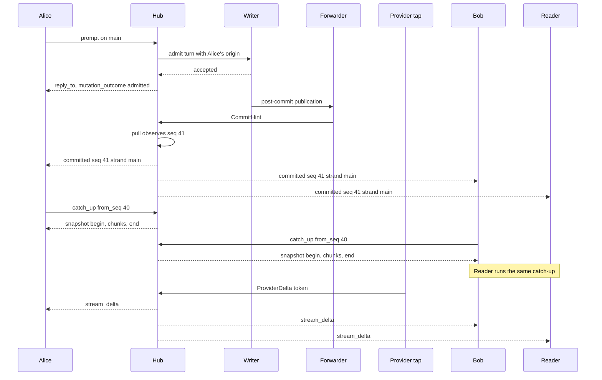
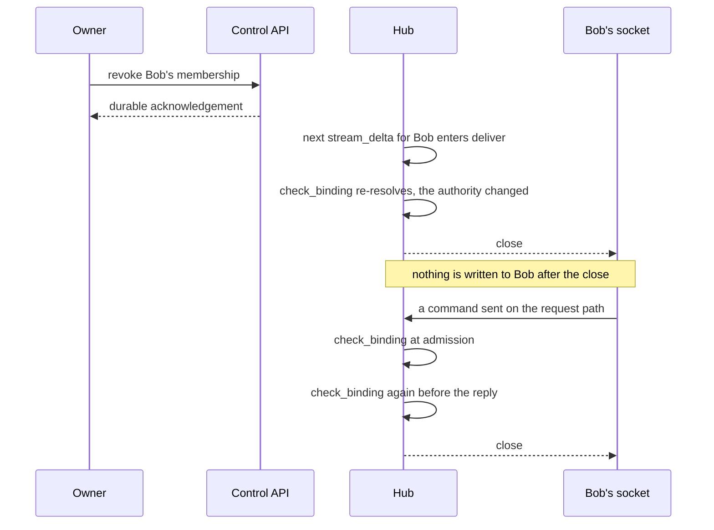
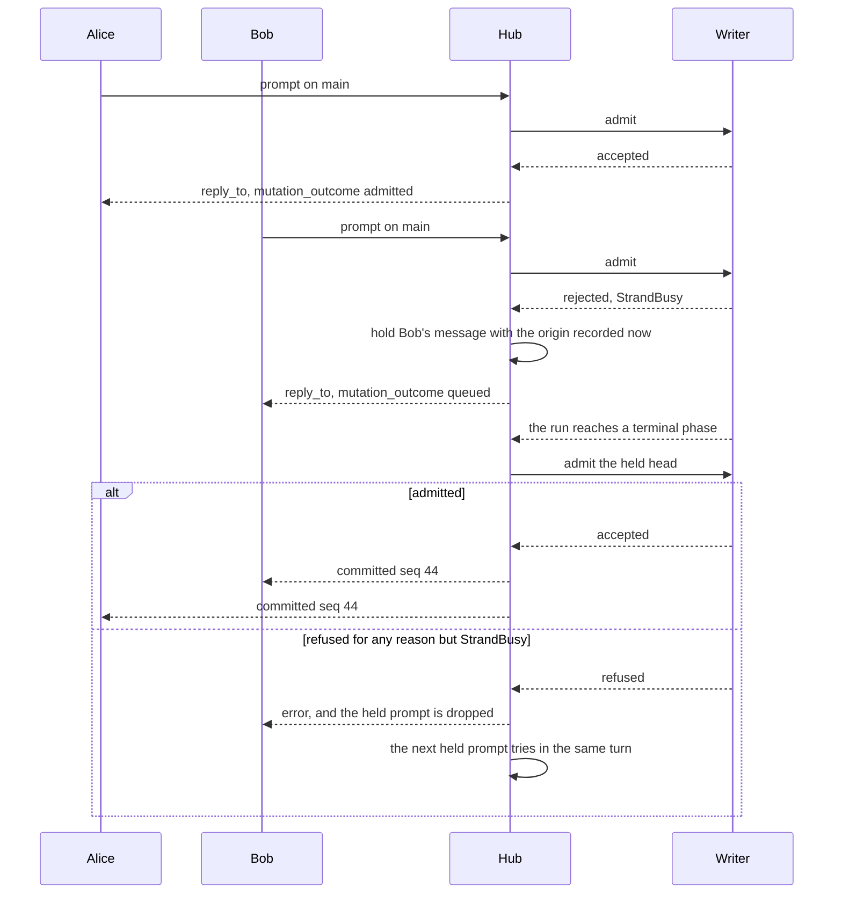
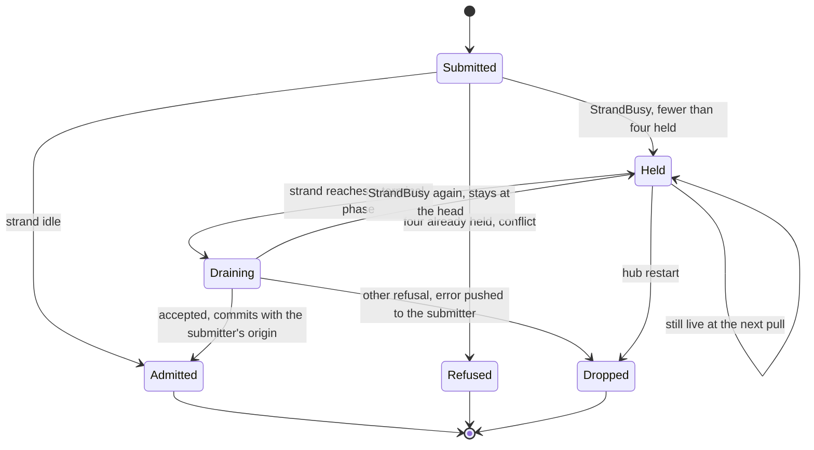
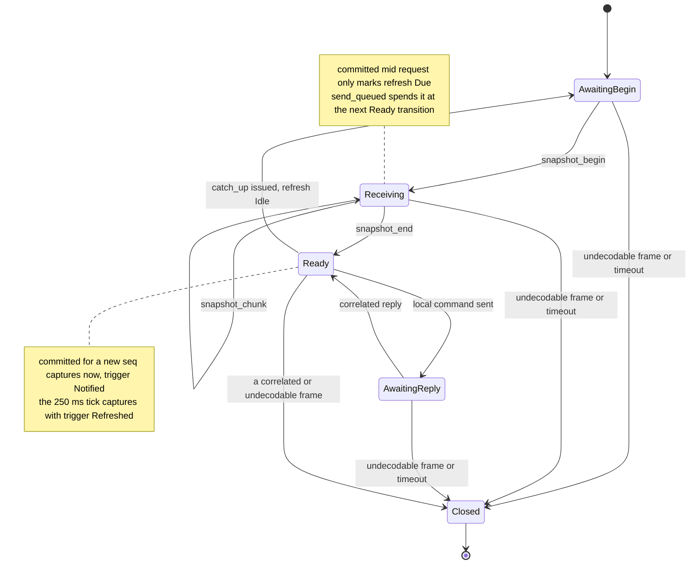

# Several operators on one session

**Status: on `main`, with acceptance still incomplete.** The managed v2
daemon, per-principal credentials, attributed commands, presence, pushed
delivery and native TUI integration replace the baseline surveyed at
`f019322`. The fixtures below each cover part of that contract; the
scenario matrix is an acceptance target, not a claim that one test
exercises every row.

This page is for implementers tracing a collaborator's command from
authentication to its durable result and each client's rendered frame.
The [session assembly](sessions.md#implemented-assembly-boundary) runs
independently of a listener, and the daemon routes explicit resident
attachments to separate session gateways that share resources only
through their persisted domain mappings. The
[brief](../design-notes/multiplayer.md) records the initial survey;
[sessions](sessions.md) explains how many shared sessions coexist in one
daemon, and [client](client.md) describes the transport and the TUI.

## Identity and authority

Authentication resolves a server-owned principal. A principal has a stable
ID and a display name, and credentials can rotate without changing
authorship. An ephemeral connection ID distinguishes windows belonging to
the same principal. A client-supplied name never establishes identity.

The daemon owner manages the server and grants session membership. An
invitation authorizes a named session, not every session the daemon hosts.
Within that session an operator can prompt, steer, abort work, resolve
approvals and change session configuration; an observer can subscribe and
replay but cannot mutate. Session access does not imply authority to shut
the daemon down, register a session, or reach another workspace.

Both the control and conversation APIs enforce membership, so listings,
operation status and routes never expose an unauthorized session
identifier. Revocation prevents later admissions, and an existing
attachment closes at its next authorization check, whether that check
guards a request or an outbound delivery. It is not an instantaneous
cancellation of commands already admitted; see protocol 015 for that
boundary, and note that revocation cannot undo completed effects.

An invitation exposes the existing transcript and whatever the session's
tools and memory can bring into it. Membership is not filesystem
isolation: overlapping workspace grants and deliberately shared memory can
reveal another project's data, so the owner has to review those grants
before inviting anyone. Remote access additionally requires TLS, since a
bearer token over cleartext TCP is not enough.

## One writer, several operators

Every session keeps one writer and one gateway, and Alice and Bob attach
to that same gateway. Each admitted durable event carries one session
sequence, and both clients reconcile against that durable order. A command
reply reports admission or refusal, and the committed entry then arrives
through the same credited read path for its author and for everyone else.
A client must not render the admission reply as another durable entry.

Concurrent steers are admitted in the session's existing order and carry
their authors through the queue into eventual user turns. There is no
controlling terminal, no global command queue, no transcript CRDT and no
per-strand ACL.

Origin travels with user turns, queued steers and approval resolutions. It
stores the principal ID and the display name recorded at admission, so a
later rename does not rewrite history. System-generated turns may have no
human origin. The model's prompt projection includes authorship once, so a
shared session can tell one operator's instructions from another's.

## How a frame reaches a terminal

The gateway pushes notices and serves records on credit. A record still
travels the credited path: a terminal requests a cut and the bounded
reader answers it. What the gateway also does, since
[`protocol-change/018`](../../protocol-change/018-pushed-delivery.md), is
announce. A commit reaches every subscribed socket as a `committed` frame
carrying the sequence and the strand and no record, and a terminal that
has not seen that sequence issues its catch-up immediately instead of at
the next idle refresh. Token deltas are pushed inline, clipped to the same
24 KiB bound the snapshot preview uses (`broadcast_delta`,
`client/gateway.gleam:2693`). The presence roster is pushed when a peer
departs (`publish_presence`, `client/gateway.gleam:1924`); a peer's
arrival appears in the next capture's `peers` instead, because the join
path issues no push of its own.

The delta half runs in the shipped binary and not only in the gateway's
tests. `client/serve` nests the two provider taps,
`tap_provider(tap_preview_provider(...))` (`client/serve.gleam:2482`), so
every token reaches the hub as a `ProviderDelta`, while the bounded
preview stays as the catch-up fallback for a terminal that attaches
mid-answer. The same module starts one `commit_forwarder`
(`client/gateway.gleam:833`) per session hub and subscribes the writer to
it, which is what makes a commit visible to the hub at all.

Follow one turn of Alice's from her keypress to the tokens her peers see.



The author is not a special case anywhere in that picture. Alice's reply
says her turn was admitted and nothing more; the entry itself reaches her
through the same notice and the same catch-up that reach Bob, which is why
a client that rendered the reply as a durable entry would show the turn
twice. A notice carries no record, so a terminal that already holds
sequence 41 drops it, one with a request in flight defers it, and one that
missed it entirely is repaired by any later catch-up. The 250 ms idle
refresh remains as that recovery path, and as the only path on a daemon
built before this change.

Delivery splits on the envelope rather than on the connection
(`send_to`, `client/gateway.gleam:2601`). An envelope carrying a
`reply_to` answers a command and goes out on that command's one bounded
reply capability; one with no `reply_to` leaves through `deliver`
(`client/gateway.gleam:2661`). Both run the same `check_binding`
(`client/gateway.gleam:1741`) immediately before the frame goes out, so
there is no second way out of the hub and no second authority path to
keep in step. On the socket process a push
arrives as a `Push` signal (`client/daemon/session_socket.gleam:66`) and
is written with `mist.send_text_frame` from the same handler that writes
replies, so the two writes are ordered by one mailbox and never interleave
mid-frame.

That check is where a revoked member stops receiving frames.



Revocation stops frames, not work already admitted. Bob's socket closes
at the next frame the hub tries to hand it, whichever path that frame was
on, and a command already admitted still runs to its durable end. The
narrow race between admission and delivery is covered by
`session_authorization_test` with scripted authority rather than by the
shipped fixture, which establishes the boundary after the owner's
acknowledgement.

## Concurrent submits and the queue

Two operators submitting on one strand are ordered rather than refused.
The first opens the run; the second is held in the hub's per-strand queue,
answered `mutation_outcome {status: "queued"}`, and submitted with its own
submitter's origin when the run settles (`hold_prompt`,
`client/gateway.gleam:3486`). The queue is hub memory, four deep per
strand (`held_per_strand`, `client/gateway.gleam:532`), and a fifth
submission gets the `conflict` the command used to answer with.



What the picture cannot show is where the drain runs. `drain_idle_strands`
(`client/gateway.gleam:3536`) is called from inside `pull_and_broadcast`
(`client/gateway.gleam:1983`), after `state.live` has been replaced from
the registers and before anything leaves the hub, because that pull is the
one place a strand is observed to have gone idle. Only the head is
submitted (`drain_strand`, `client/gateway.gleam:3548`): a second would be
refused by the very acceptance the queue exists to work around. A
`StrandBusy` at drain time keeps the head in place for the next
transition, and any other refusal is that prompt's own, so it is dropped
with a pushed `error` and the next one is tried immediately, since nothing
else will transition an idle strand.



The restart edge is why the reply says `queued` and never `admitted`. A
prompt that survived a restart would need a pending-run operation in
`machine`, a new durable operation kind with its own state space, added
for a convenience nothing else needs, so the wire carries the weaker
status rather than hiding it, and the terminal clears its own queued
state when the socket closes. `steer` and `follow_up` are unchanged: a
principal who wants a message folded into the run that is already going
uses those, while `prompt` on a busy strand means "next turn".

## What the terminal does with a pushed frame

An uncorrelated frame is decoded as `Pushed` and accepted in every phase
but `Closed`. `session_wire.decode` (`tui/session_wire.gleam:161`) treats
the *absent* `reply_to` as the mark of a push, so a frame that names a
request identity is still held to the outstanding one and a stale or
forged correlation still fails closed. A push belongs to no request, so it
consumes no credit, allocates no identity and cannot fail the lane
(`apply_pushed`, `tui/session_channel.gleam:494`).



Two arms drop a notice outright, and both are statements about what the
lane already holds: a sequence below the cut's `next_seq`, and any notice
arriving before a cut exists at all, which the initial transfer will
deliver anyway (`capture_or_defer`, `tui/session_channel.gleam:546`). A
`Closed` lane drops everything. The mark is one bit rather than a count,
because a notice carries no state of its own and any number of them
collapse into "capture when free"; `send_queued`
(`tui/session_channel.gleam:943`) spends it at the next `Ready`
transition, which is sooner than the idle refresh in `tick`
(`tui/session_channel.gleam:732`) would have been.

Because a notice may legitimately do nothing, the lane reports every one
it reads as `Noticed` (`tui/session_channel.gleam:82`) before deciding
what to do with it, and `tui.Model` counts those arrivals
(`tui.gleam:365`). That is the only account of live delivery which does
not depend on winning a race against the refresh. The other pushed events
are simpler: a `stream_delta` becomes a `Streamed` update in any phase,
`presence` and `attachment` are capture triggers like a notice, and a
pushed `error` reports a failure the daemon had on this terminal's behalf,
so it is an ordinary auxiliary refusal and the socket stays open.

### One turn on the wire

Here is a single turn as a raw v2 client receives it, with `→` for what
the client writes and `←` for what it reads. Fields not under discussion
are elided as `...`.

```
→ {"v":2,"id":1,"cmd":"subscribe","body":{"session":"S"}}
← {"v":2,"reply_to":1,"event":"snapshot_begin",
   "body":{"snapshot_id":"T1","next_seq":40,"window":"recent",
           "role":"operator","record_bytes_limit":33554432,
           "fragment_bytes_limit":24576,"origin":null,...}}
→ {"v":2,"id":2,"cmd":"snapshot_next","body":{"snapshot_id":"T1","index":0}}
← {"v":2,"reply_to":2,"event":"snapshot_chunk",
   "body":{"snapshot_id":"T1","index":0,"record_id":"R1",
           "total_bytes":812,"offset":0,"data":"<base64>",...}}
→ {"v":2,"id":3,"cmd":"snapshot_next","body":{"snapshot_id":"T1","index":1}}
← {"v":2,"reply_to":3,"event":"snapshot_end",
   "body":{"snapshot_id":"T1","index":1,"next_seq":40,"more_after":null}}
← {"v":2,"event":"committed","seq":41,"body":{"strand":"main"}}
→ {"v":2,"id":4,"cmd":"catch_up","body":{"from_seq":40}}
← {"v":2,"reply_to":4,"event":"snapshot_begin",
   "body":{"snapshot_id":"T2","next_seq":42,"window":"catch_up",...}}
← {"v":2,"event":"stream_delta",
   "body":{"strand":"main","op":"op-7","ephemeral":true,
           "kind":"text","text":"livedeli"}}
← {"v":2,"event":"presence",
   "body":{"peers":[{"connection_id":"c-2","origin":{...},
                     "role":"operator"}]}}
```

The three pushed frames at the bottom are the ones that carry no
`reply_to`, and reading them is what a client built before
`protocol-change/018` gets wrong: Part 1.3's tolerant name decoding
already required an unknown event to be ignored, but the shipped terminal
on `main` treated an *uncorrelated* frame as a protocol violation, which
is the client bug this change forced to the surface. The `presence` frame
is a departure, since a join is not pushed; every pushed frame costs one
authority check per peer, and the joiner's own capture already carries the
roster.

## Configuration, presence, and approvals

Configuration is durable session state. A successful change is included,
with its origin, in every client's next authoritative metadata cut rather
than updating only the issuing terminal, and reconnection restores that
state from the server. A metadata-only change must be reconciled even when
no new conversation entry advances the entry cursor.

Presence is transient. Reconciliation supplies a replacement roster of
principals and connections rather than replaying old joins as conversation
entries, and several windows from one principal stay distinguishable. The
roster is a gateway observation, not part of the storage transaction that
captures durable metadata.

An escalation is shown to the session's eligible operators. Approve and
deny compete through the same conditional transition, so exactly one
resolution wins, and the result records its origin and the exact action
and grant. Losing clients receive a conflict identifying the resolved
request. Visibility alone never grants permission to approve.

## What the client renders

The attachment snapshot identifies the authenticated principal and the
current session role. Other operators' turns show their authors, shared
config changes update every footer, and presence identifies who is
attached. Switching the viewed strand or session changes only that
terminal's view.

After a disconnect the view is visibly stale until an authoritative
snapshot and catch-up complete. Durable cursors are session-scoped and may
be sparse, and old stream fragments and presence do not survive a new
session incarnation. An uncertain prompt or approval stays explicitly
unconfirmed and is never resent automatically; ordinary transcript updates
do not resolve that notice.

## Sharing scope

Workspace memory is private to the owner by default. Session membership
does not grant access to another session's transcript or to a workspace
aggregate. Before inviting a collaborator, create a `session_only` session
or stop an existing one and run
`loomd access isolate SESSION --share-existing-transcript`.

Isolation assigns fresh memory and index paths without copying the private
aggregate. It preserves the existing transcript, which may already contain
privately recalled material: the acknowledgement authorizes sharing that
history, not sanitizing it. Repeated isolation keeps the same paths, and a
retained runtime or failed-cleanup slot must retire before isolation can
proceed.

The catalogue records this policy without opening stores. Runtime recall
and maintenance must also use these mappings; see the accepted domain
addendum in
[protocol 015](../../protocol-change/015-daemon-control-and-session-attachments.md).

## What the fixtures prove

The focused fixtures run independent native TUI drivers, each owning its
inbox, connection and virtual-terminal loop, connected over real
WebSockets to a real server and real session storage. Scripted providers
make replies depend on the submitted prompts, so a rendered marker proves
the round trip rather than the delivery of an unconditional fixture. The
matrix below states the combined acceptance obligations; the individual
results after it have narrower scope. A live drive with two
owner-authenticated terminals has verified rendering without another
keypress, submission after capture, and session switching, but that drive
does not establish distinct-principal authority. The resource soak still
requires an adopted SQLite retirement fix, as described in
[sessions](sessions.md#verification-required-before-release).

| Scenario | Required observation |
|---|---|
| Two operators prompt and steer | Both transcripts contain the same admitted entries once, in the same order, with correct origins. |
| One operator changes config | Both clients render the resulting model/configuration state. |
| Approve races deny | Exactly one durable resolution wins, the UI names its author, and only the authorized effect runs. |
| Observer submits a mutation | The server refuses it; neither durable state nor tool execution changes. |
| One client disconnects and returns | Catch-up converges without duplicate entries, old streams, or stale presence. |
| A session invitation targets another session | No listing, subscription, lifecycle status, or mutation authority crosses the membership boundary. |
| One session stalls | Clients on another session remain usable. |
| Two operators prompt inside one catch-up window | One prompt opens the run; the other is answered `queued`, renders as a booked turn rather than a conflict, and commits with its own submitter's origin when the run settles. |
| A peer's answer is delivered | Every terminal shows the answer's text before any entry for it exists in that terminal's cut, and its notice count rises by the records the turns commit. |
| A member is revoked mid-answer | The socket closes at the per-frame authority check while pushed frames are in flight, and no further frame reaches it while the remaining terminals complete the answer. |

### Coordinating real clients

`tui_shipped_multiplayer_test` drives the built `bin/loomd` through its
real bootstrap and administration APIs. The owner creates a session, waits
for its retirement, isolates it, invites two operators and an observer,
and reopens it. Three independent native TUI drivers verify their
principal and role, then converge on Alice's configuration change and its
server-assigned origin, which no fixture-written register supplies. Alice
submits a prompt, Bob leaves and rejoins and submits a second, and a
finite loopback HTTP/SSE peer validates each latest user message,
including Loom's human-attribution block, before answering, so the drive
crosses the shipped daemon's ordinary provider transport rather than an
injected one. All three terminals must recover identical durable records,
exact user authors and answer text, rendered answers and completed
strands.

The owner also creates an uninvited session in a separate workspace. The
operator and the observer can list only their invited session; their
requests for the foreign session's metadata, open and lifecycle operation
return `not_found`, owner-only mutations return `forbidden`, and both
credentials fail the foreign WebSocket upgrade, while the owner reads the
same resident incarnation and operation and upgrades that route, so a
missing target cannot stand in for authorization enforcement. An
observer's valid `set_config` frame also reaches the shipped gateway
directly and receives a correlated `forbidden` reply, bypassing the
terminal's local read-only guard; the gateway checks the role before
subscription state, and the probe does not join presence. These checks
establish API authority, not filesystem confinement or revocation of a
queued command.

Bob's terminal then stops, and Alice and the observer must see his
presence disappear before he rejoins with the same credential. All three
terminals must then see the exact principal set, a new Bob attachment ID,
no old one, and the unchanged configuration and author, because driver
exit alone is not the detach barrier.

The revocation stage revokes Bob's membership while his terminal and a
separate credited socket are attached. The coordinator consumes the
owner's acknowledgement before submitting a valid mutation on Bob's raw
socket, and that socket must receive a WebSocket close and actual TCP
closure, since a timeout is not closure. Bob's terminal disconnects, Alice
and Reader observe the remaining roster with no configuration change from
Bob, and Alice changes configuration successfully. Bob's credential still
authenticates control, but its catalogue is empty and the old session
cannot be inspected or upgraded, which distinguishes membership revocation
from credential revocation.

The selector stage grants Alice access to a second session, then obtains
and highlights its real `/sessions` row through terminal input. The owner
revokes only that membership before Alice presses Enter, and the refusal
must leave her original session identity, records, inbox and socket intact
while an authorized owner can still attach to the target. That covers
refusal before replacement attachment, not every failure during an
already-started transfer or a switch during a live tool. With the
membership restored, Alice selects session B while Reader stays on A,
completes a provider turn on B, and an independently authenticated owner
terminal completes another on A; Reader receives A's new turn without
changing its attachment, and exact message contents and authors
distinguish each session's history. When Alice selects A again, her
replacement attachment must name A's original daemon epoch and runtime
incarnation, and her records must equal those of both terminals that
stayed. The provider requests are deliberately sequenced: this is
concurrent residency and independent progress, not simultaneous provider
execution.

The live-tool stage creates A2 in A1's workspace, alongside B. An ordinary
provider response starts a fixed bash tool in A1, and the fixture requires
both its workspace marker and the server's `tools` phase before Alice
highlights A2. Revoking A2 access before Enter must preserve Alice's
original A1 identity, records, inbox and socket while the tool is live;
restoring that membership permits a real switch and a completed A2 turn.
Alice then selects B and completes its own turn before the host releases
A1. On a host with the demanded enforcement the script uses exactly eight
exchanges, the four earlier turns included. No further A1 input can merge
with its tool result, and A1's records must contain the original user
author, exact invocation, successful result and final answer in order,
with one completion marker. The markers prove this benign tool ran; they
do not prove filesystem confinement or an approval decision.

Before choosing that suffix the fixture probes the shipped helper with the
daemon's own base policy and a silent shell built-in, after the original
helper has retired so the result can be read. Only an explicit
enforcement-degradation result skips the live-tool section, and the four
earlier exchanges and every non-tool assertion still run. The ordinary
Linux CI job declares this missing prerequisite; the delegated jail job
runs the same fixture and rejects that skip, so the declaration cannot
replace real tool coverage, and macOS retains the full drive when its
probe succeeds.

The three initial terminal opens have a named 20-second deadline after a
hosted macOS run exceeded the component helper's eight-second wait; the
other terminal assertions, the 15-second tool marker and the body and
cleanup deadlines are unchanged, and the allowance is not a diagnosis of
that delay. The body is bounded, a separate native cleanup check runs even
on assertion failure, and the loopback provider keeps its listener witness
outside the bounded callback. `make e2e-client-bootstrap` supplies the
executable and public dummy provider credential; ordinary package tests
skip the fixture when `LOOM_BOOTSTRAP_E2E_SERVER` is unset. The
[handoff](../next.md#verified-results-and-their-limits) records which
revision passed each local and hosted gate.

### Watching an answer arrive

`tui_shipped_live_delivery_test` is the shipped proof of the last three
matrix rows, and the one fixture whose subject is *when* a frame arrives
rather than what it says. It builds the same session shape, with the owner
creating, isolating and reopening, Alice and Bob operating and Reader
observing, except that Bob is a raw v2 wire client rather than a terminal,
on the same authenticated WebSocket route the terminals use.

Bob submits on a strand that is already running, and the hub holds his
prompt. He is a wire client because that is the only client which reaches
the queue deterministically: a terminal sends `prompt` only while its own
model shows the strand idle, `steer` has no `queued` acknowledgement, and
against a pushing daemon the stale window between the two is a few
milliseconds wide. A raw client tracks no liveness, so the fixture waits
until Alice's terminal reports the strand live, which means the run exists
at the hub, and only then writes Bob's prompt. The `queued` reply is then
a fact about the hub rather than about scheduling.

The scripted peer is paced: `provider_http.Paced` splits an answer across
content deltas and waits between chunks, so an answer occupies an interval
rather than an instant. Inside that interval both terminals must show live
text for the running operation that is a genuine prefix of the answer,
while their own records still contain no assistant entry. They are sampled
in one loop rather than one after another, because the interval is shorter
than a sequence of awaits would take.

Both properties are stated as counts. The snapshot's sampled preview
projects as exactly one fragment however many tokens it summarises, so
`live_text_before_the_entry` requires two: a stream holding two fragments
before the entry exists was fed by `stream_delta` frames and by nothing
else. Notices are counted for a different reason. `session_channel.Capture`
still names what asked for a given cut, but which capture paints an answer
is a race the design keeps, since the idle refresh may already have a
catch-up in flight when the commit lands, paint first, and leave the
following notice naming a sequence already held. So the fixture requires
each terminal's `Model.notices` to have risen by at least the four durable
records the two shared turns commit, two user entries and two assistant
entries. `last_capture` survives in the diagnostic dump, where knowing
which path a cut took is useful and asserting on it is not. Nothing here
asserts on elapsed time.

A third turn exists only so that Bob's membership can be revoked while
pushed frames are genuinely in flight to him. The fixture reads his socket
forward until it carries a prefix of the third answer, and only then does
the owner revoke; the hub's next write to him fails its per-delivery
authority check and the socket is closed. The witness is a frame count on
the raw socket, which is the stronger form of the old one: a terminal can
only show that nothing arrived during some quiet interval, while a socket
read past the server's close frame returns the transport's own refusal to
produce anything further.

Bob's history is then read back through his own credited `catch_up` and
must reassemble, through the shared core decoder, to exactly the records
the terminals hold, which is two independent reads of one history rather
than a comparison against something the fixture kept. The two terminals
hold identical durable records, in one order, with the two human turns
attributed to the two different operators. This fixture does not cover the
durable-queue behaviour a hub restart would need, the four-deep queue
bound, or a drain failure; those are the gateway's own tests.
`make e2e-client-bootstrap` supplies its executable and dummy provider
credential, and it skips itself when `LOOM_BOOTSTRAP_E2E_SERVER` is unset.

### Stop, reopen, and the test foundation

A separate shipped fixture holds A's actual HTTP response while B
completes a turn. Owner control requests A's stop, the original provider
socket must close, that same control connection must observe `Saved`, and
B then completes another exact turn without replacing its attachment or
socket. Explicitly reopening A creates a new incarnation and resumes its
admitted operation; its second HTTP request matches the first, and its
durable history contains one user message, the required interrupted
settlement and the final answer. Its helper distinguishes actual closure
from a timeout or stray bytes and rejects malformed or oversized framing
before reading a body. That is cooperative stop and recovery, not a
process-kill test or an uncooperative drain held past a caller timeout,
which remains separate injected-transport coverage.

Each driver creates its inbox and runs its terminal loop in the same
process, because sharing a model or constructing both inboxes in the
coordinator would bypass the ownership rules the shipped client relies on.
The coordinator schedules operator input independently for each client
while server responses arrive through each client's real connection, and
the driver selects each real message from its socket ingress and transfers
it into a separate model inbox through `Deliver`. That inbox has no
concurrent sender, so the transfer preserves the socket's order, and the
coordinator never fabricates a gateway response.

Wait for observable results, not a fixed number of ticks: a virtual tick
can drain messages already in the inbox but cannot prove the daemon
processed a submitted command. Each wait has a deadline and names its
condition, such as both clients observing the committed entry sequence,
and only once it holds does the drive flush presentation and compare
models, rendered frames and durable state. Injected presentation time
makes frame pacing reproducible; real socket and cleanup deadlines still
bound a hung test. A failure report retains each client's input schedule
and inbound recording, the last frame, the expected condition and the
server's relevant durable state, which reproduces what a client received
without reproducing server scheduling or proving a command's effect.

Run `make e2e-multiplayer` for the native terminal, multi-principal
approval, persisted restart, approved effect and fault-containment
fixtures. The target builds the real helper, runs each fixture module
through the existing test runner with a 180-second outer deadline
(`LOOM_TEST_TIMEOUT_SECONDS` overrides it), and stops on the first
failure. These tests also remain in the ordinary client suite. Run
`make soak-daemon` separately for repeated real session lifecycles with an
unread peer; `make soak` instead runs deterministic conformance seeds.
Neither replaces the shipped-artifact and platform acceptance drive. The
[mutation checks](../review/single-daemon-mutation-gates.md) record six
tested failure cases behind the lifecycle and transfer assertions.

`packages/client/test/support/tui_driver.gleam` runs each TUI in its own
actor with the shipped connection handshake and virtual terminal loop.
`two_virtual_tuis_share_one_real_session_test_` in
`packages/client/test/client/tui_e2e_test.gleam` starts the managed daemon
over SQLite and a real v2 WebSocket listener; Alice and Bob submit
distinct prompts, and the scripted provider returns a marker only when its
request contains the corresponding prompt. The test compares both clients'
decoded durable records, exact message contents and rendered replies, and
waits for both to observe an idle strand before the next prompt, because a
committed assistant entry can arrive before the `done` transition. A fresh
subscriber recovers both turns, and both drivers must detach before server
shutdown. It runs in the ordinary client suite without tmux and does not
by itself prove the full multiplayer contract.

Separate fixtures cover real admin-issued operator and observer
credentials with exact approval resolution (`tui_multiplayer_test`),
SQLite-backed shared-domain assembly and lazy restart across two
workspaces (`tui_v2_persisted_test`), and attempt-tagged recording replay
(`tui_recording_v2_test`). Their providers are scripted, so these fixtures
do not establish production-provider behavior. The `tui_multiplayer_test`
approval fixture inserts a pending unscoped escalation, then lets real
operator commands compete to resolve it, which proves the recorded winner
and its rendered author, not execution of a newly authorized jailed
effect; the observer's terminal also refuses its mutation locally, and
separate gateway tests establish server refusal.

`tui_approval_effect_test` supplements that fixture with a real broker
refusal, SQLite and native execution. Two authenticated operator sockets
submit the same captured approval sequence; before either approval the
marker file is absent and no tool result exists, then one approval wins,
the other returns `stale_approval`, and exactly one marker and durable
result record the authorized effect. It also checks observer wire refusal
and the winning author and waits for original-root cleanup, using a real
observer terminal, but claims neither two operator keyboard submissions
nor filesystem confinement. `daemon_fault_containment_test` joins a
blocked provider's retirement with another session's progress and the
original writer lease, and [sessions](sessions.md) describes the schedule
residency and measured-load fixtures. These results supplement the
authority, recording and live-terminal tests; they do not turn each row
above into an exhaustive fault or interleaving test.

The live check uses two terminals in Herdr's `loom-test` tab against the
same test daemon: verify cross-client prompting, configuration, approval
resolution and reconnect, then switch one terminal to another session and
verify the other stays attached. Use isolated test data and credentials,
never an existing working session. Use the merged virtual backend for the
shipped loop and frame capture, and recordings with settled-frame goldens
for reproducible rendering failures. The seeded simulator and full real-server
drive described in
[the simulation brief](../design-notes/tui-simulation.md) remain
incomplete, and the existing tmux test remains until its stated
replacement criteria pass. A live Herdr drive complements these tests but
does not replace them.

[Issue #240](https://github.com/Roasbeef/loom/issues/240) is what pushed
delivery implements; `docs/design-notes/live-delivery.md` is the ruling,
and the two questions it leaves open, a durable queue and registry-pushed
revalidation in place of the per-frame check, are recorded there.
