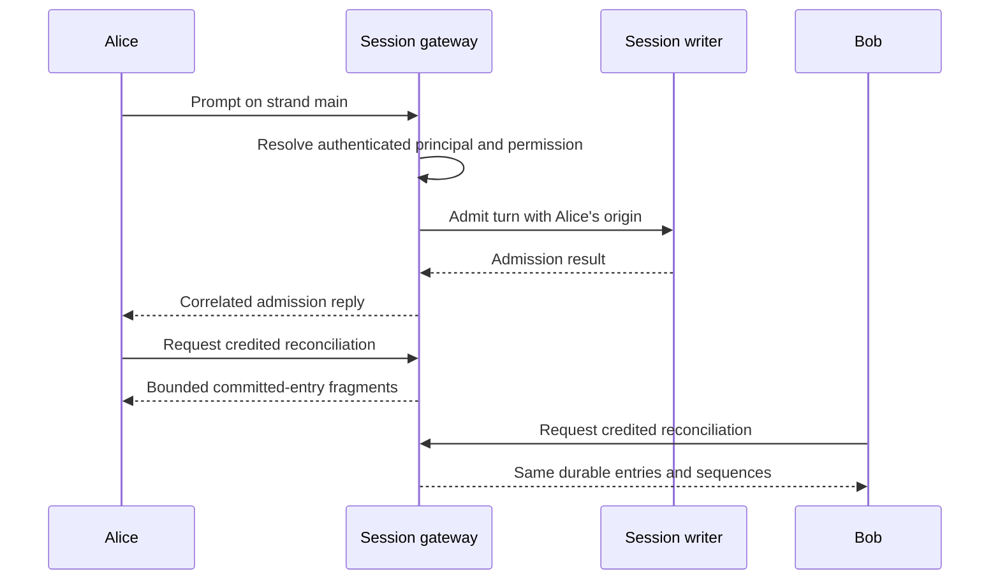

# Several operators on one session

**Status: implemented on an unmerged branch; acceptance remains
incomplete.** The managed v2 daemon, per-principal credentials, attributed
commands, presence, and native TUI integration replace the baseline surveyed
at `f019322`. The focused
fixtures below cover distinct parts of that contract; the scenario matrix
is an acceptance target, not a claim that one test exercises every row.

The [session assembly](sessions.md#implemented-assembly-boundary) runs
independently of a listener. The daemon routes explicit resident attachments
to separate session gateways and shares resources only through their
persisted domain mappings.

This page is for implementers tracing a collaborator's command from
authentication to its durable result and each client's rendered frame.
The [brief](../design-notes/multiplayer.md) records the initial survey;
[sessions](sessions.md) explains how many shared sessions coexist in one
daemon, and [client](client.md) describes the current transport and TUI.

## Identity and authority

Authentication resolves a server-owned principal. A principal has a stable
ID and a display name; credentials can rotate without changing authorship.
An ephemeral connection ID distinguishes windows belonging to that same
principal. A client-supplied name never establishes identity.

The daemon owner manages the server and grants session membership. An
invitation authorizes a named session, not every session hosted by the
daemon. Within that session, an operator can prompt, steer, abort work,
resolve approvals, and change session configuration. An observer can
subscribe and replay but cannot mutate. Session access does not implicitly
authorize daemon shutdown, session registration, or another workspace.

Both control and conversation APIs enforce membership. Listings,
operation status and routes must not expose unauthorized session identifiers.
Revocation prevents later admissions; an existing attachment closes at its
next authorization check, including a request or outbound delivery. It is
not an instantaneous cancellation of commands already admitted. See
protocol 015 for that boundary; revocation cannot undo completed effects.

An invitation exposes the existing transcript and the information the
session's tools and memory can bring into it. Membership is not filesystem
isolation: overlapping workspace grants and intentionally shared memory
can reveal another project's data. The owner must review those grants
before inviting collaborators. Remote access additionally requires TLS;
a bearer token over cleartext TCP is insufficient.

## One writer, several operators

Every session retains one writer and one gateway. Alice and Bob attach to
that same gateway. Each admitted durable event has one session sequence.
Both clients reconcile against that durable order. A command reply reports
its admission or refusal; the committed entry arrives through the same
credited read path for its author and other clients. A client must not render
the admission reply as another durable entry.

A second prompt on a live strand remains a conflict. Concurrent steers
are admitted in the session's existing order and carry their authors
through the queue into eventual user turns. No controlling terminal,
global command queue, transcript CRDT, or per-strand ACL is introduced.

Origin travels with user turns, queued steers, and approval resolutions.
It stores the principal ID and the display name at admission. A rename
does not rewrite history. System-generated turns may have no human origin.
The model's prompt projection includes authorship once, so a shared session
can distinguish instructions from different operators.

## Configuration, presence, and approvals

Configuration is durable session state. A successful change is included,
with its origin, in every client's next authoritative metadata cut rather
than updating only the issuing terminal. Reconnection restores that state
from the server. A metadata-only change must be reconciled even when no new
conversation entry advances the entry cursor.

Presence is transient. Reconciliation supplies a replacement roster of
principals and connections; it does not replay old joins as conversation
entries. Several windows from one principal remain distinguishable. The
roster is a gateway observation, not part of the storage transaction that
captures durable metadata.

An escalation is shown to the session's eligible operators. Approve and
deny compete through the same conditional transition, so exactly one
resolution wins. The result records its origin and the exact action and
grant. Losing clients receive a conflict identifying the resolved request;
visibility alone never grants permission to approve it.

## What the client renders

The attachment snapshot identifies the authenticated principal and current
session role. Other operators' turns show their authors, shared config
changes update every footer, and presence identifies who is attached.
Switching the viewed strand or session changes only that terminal's view.

After disconnect, the view is visibly stale until an authoritative snapshot
and catch-up complete. Durable cursors are session-scoped and may be sparse.
Old stream fragments and presence do not survive a new session incarnation.
An uncertain prompt or approval remains explicitly unconfirmed and is never
automatically resent. Ordinary transcript updates do not resolve that notice.

## End-to-end proof

The focused fixtures run independent native TUI drivers, each owning its inbox,
connection, and virtual-terminal loop. They connect over real WebSockets
to a real server and real session storage. Scripted providers make replies
depend on the submitted prompts, so a rendered marker proves the round
trip rather than the delivery of an unconditional fixture. The following
matrix states the combined acceptance obligations; individual results below
have narrower scope. A live drive with two owner-authenticated terminals has
verified rendering without another keypress, submission after capture, and
session switching. That drive does not establish distinct-principal authority.
The resource soak still requires an adopted SQLite retirement fix, as described
in [sessions](sessions.md#verification-required-before-release).

| Scenario | Required observation |
|---|---|
| Two operators prompt and steer | Both transcripts contain the same admitted entries once, in the same order, with correct origins. |
| One operator changes config | Both clients render the resulting model/configuration state. |
| Approve races deny | Exactly one durable resolution wins, the UI names its author, and only the authorized effect runs. |
| Observer submits a mutation | The server refuses it; neither durable state nor tool execution changes. |
| One client disconnects and returns | Catch-up converges without duplicate entries, old streams, or stale presence. |
| A session invitation targets another session | No listing, subscription, lifecycle status, or mutation authority crosses the membership boundary. |
| One session stalls | Clients on another session remain usable. |

### Coordinating real clients

`tui_shipped_multiplayer_test` also drives the built `bin/loomd` through its
real bootstrap and administration APIs. The owner creates a session, waits
for its retirement, explicitly isolates it, invites two operators and an
observer, and reopens it. Three independent native TUI drivers verify their
principal and role, then converge on Alice's configuration change and its
server-assigned origin. No fixture-written register supplies that result.
Alice then submits a prompt, Bob leaves and rejoins, and Bob submits a second
prompt. A finite loopback HTTP/SSE peer validates each latest user message,
including Loom's human-attribution block, before returning its answer. All
three terminals must recover identical durable records, exact user authors
and answer text, rendered answers and completed strands. This crosses the
shipped daemon's ordinary provider transport, not an injected transport.
`make e2e-client-bootstrap` supplies the executable and public dummy provider
credential for this fixture; ordinary package
tests explicitly skip it when `LOOM_BOOTSTRAP_E2E_SERVER` is unset.

The owner also creates an uninvited session in a separate workspace. An
operator and observer can list only their invited session. Their requests
for the foreign session's metadata, open and lifecycle operation return
`not_found`; owner-only mutations return `forbidden`. Both credentials fail
the foreign WebSocket upgrade. The owner then reads the same resident
incarnation and operation and successfully upgrades that route, so a missing
target cannot stand in for authorization enforcement.

An observer's valid `set_config` frame also reaches the shipped gateway
directly and receives a correlated `forbidden` reply. This bypasses the
terminal's local read-only guard. The gateway checks the role before
subscription state; the probe does not join presence. These checks establish
API authority, not filesystem confinement or revocation of a queued command.

The same fixture stops Bob's terminal and waits for Alice and the observer
to see his presence disappear. Bob rejoins with the same credential; all
three terminals must see the exact principal set, a new Bob attachment ID,
no old attachment ID, and the unchanged configuration and author. Driver
exit alone is not the detach barrier: the surviving terminals must receive
the server's updated presence. This covers presence recovery, not ordered
replay beyond the two scripted turns or admission of a command queued before
revocation.

The revocation stage revokes Bob's session membership while his terminal and a
separate credited socket are attached. The coordinator consumes the owner's
revocation acknowledgement before submitting a valid mutation on Bob's raw
socket. That socket must receive a WebSocket close and actual TCP closure;
a timeout is not closure. Bob's terminal disconnects, and Alice and Reader
observe the remaining roster without a configuration change from Bob.
Alice then changes configuration successfully. Reader receives the same
authoritative value and author; Bob retains his last authorized view.

Bob's credential still authenticates control, but its catalogue is empty and
the old session cannot be inspected or upgraded. This distinguishes membership
revocation from credential revocation. The shipped check establishes the
post-acknowledgement admission boundary, not the narrow race between admission
and delivery. `session_authorization_test` covers that interval separately
with scripted authority; already admitted work is not required to cancel.

The selector stage grants Alice access to the second session, then obtains
and highlights its real `/sessions` row through terminal input. The owner
revokes only that target membership before Alice presses Enter. The exact
refusal must leave Alice's original session identity, records, inbox and
socket intact. An authorized owner can still attach to the target, while
Alice's original connection sends another configuration change to Reader.
This covers refusal before replacement attachment, not every failure during
an already-started snapshot transfer or switching during a live tool.

This shipped-artifact fixture has a bounded body and a separate native
cleanup check, including on assertion failure. The loopback provider retains
its original listener witness outside the bounded callback. The composed
fixture does not establish live-tool switching or the entire acceptance matrix.

Each driver creates its inbox and runs its terminal loop in the same
process. Sharing a model or constructing both inboxes in the coordinator
would bypass the ownership rules that the shipped client relies on.
The coordinator schedules operator input independently for each client;
server responses arrive through each client's real connection. The driver
selects each real message from its socket ingress and transfers it into a
separate model inbox through `Deliver`. The model inbox has no concurrent
sender, so that transfer preserves the socket's order. The coordinator
never fabricates a gateway response.

Wait for observable results, not a fixed number of ticks. A virtual tick
can drain messages already in the inbox, but cannot prove that the daemon
has processed a submitted command. Each wait has a deadline and names its
condition, such as both clients observing the committed entry sequence.
After that condition holds, flush presentation and compare the models,
rendered frames, and durable state. Injected presentation time makes frame
pacing reproducible; real socket and cleanup deadlines still bound a hung
test.

Run at least two operators on one session and a client on another session
in the same daemon. Add an observer for authorization checks. A failure
report retains each client's input schedule and inbound recording, the
last frame, the expected condition, and the server's relevant durable
state. A recording reproduces what a client saw; it does not, by itself,
reproduce server scheduling or prove a command's effect.

The live check uses two terminals in Herdr's `loom-test` tab against the
same test daemon. Verify cross-client prompting, configuration, approval
resolution, and reconnect, then switch one terminal to another session
and verify that the other stays attached. Use isolated test data and
credentials; do not attach collaborators to an existing working session
just to demonstrate the UI.

Use the merged virtual backend for the shipped loop and frame capture.
Use recordings and settled-frame goldens for reproducible rendering
failures. The seeded simulator and full real-server drive described in
[the simulation brief](../design-notes/tui-simulation.md) remain incomplete;
the existing tmux test remains until its stated replacement criteria pass.
A live Herdr drive complements these tests, but does not replace them.

### Sharing scope

Workspace memory is private to the owner by default. Session membership does
not grant access to another session's transcript or to a workspace aggregate.
Before inviting a collaborator, create a `session_only` session or stop an
existing session and run
`loomd access isolate SESSION --share-existing-transcript`.

Isolation assigns fresh memory and index paths without copying the private
aggregate. It preserves the existing transcript, which may already contain
private recalled material: the acknowledgement authorizes sharing that history,
not sanitizing it. Repeated isolation keeps the same paths. A retained runtime
or failed-cleanup slot must retire before isolation can proceed.

The catalogue records this policy without opening stores. Runtime recall and
maintenance must also use these mappings; see the accepted domain addendum in
[protocol 015](../../protocol-change/015-daemon-control-and-session-attachments.md).

### Implemented test foundation

Run `make e2e-multiplayer` for the native terminal, multi-principal approval,
persisted restart, approved effect and fault-containment fixtures described
below. The target builds the real helper and runs each fixture module through
the existing test runner. Each module has a 180-second outer deadline by
default; `LOOM_TEST_TIMEOUT_SECONDS` overrides that budget. The target stops
on the first failure. These tests also remain in the ordinary client suite.

Run `make soak-daemon` separately for repeated real session lifecycles with
an unread peer. `make soak` instead runs deterministic conformance seeds.
Neither command replaces the shipped-artifact and platform acceptance drive.
The [mutation checks](../review/single-daemon-mutation-gates.md) record six
tested failure cases behind the lifecycle and transfer assertions.

`packages/client/test/support/tui_driver.gleam` runs each TUI in its own
actor, with the shipped connection handshake and virtual terminal loop.
`two_virtual_tuis_share_one_real_session_test_` in
`packages/client/test/client/tui_e2e_test.gleam` starts the managed daemon
over SQLite and a real v2 WebSocket listener. Alice and Bob submit
distinct prompts; the scripted provider returns a distinct marker only
when its request contains the corresponding prompt.

The test compares both clients' decoded durable records, exact message
contents, and rendered replies. It waits for both clients to observe an
idle strand before the next prompt: a committed assistant entry can arrive
before the `done` transition. A fresh subscriber recovers both turns, and
both drivers must detach before server shutdown. This scenario runs in the
ordinary client suite without tmux. It does not by itself prove the full
multiplayer contract. Separate fixtures cover real admin-issued operator
and observer credentials with exact approval resolution
(`tui_multiplayer_test`), SQLite-backed shared-domain assembly and lazy
restart across two workspaces (`tui_v2_persisted_test`), and attempt-tagged
recording replay (`tui_recording_v2_test`). Their providers are scripted;
these fixtures do not establish production-provider behavior.

The `tui_multiplayer_test` approval fixture inserts a pending unscoped escalation, then lets real
operator commands compete to resolve it. That proves the recorded winner and
its rendered author, not execution of a newly authorized jailed effect. The
observer's terminal also refuses its mutation locally; separate gateway tests
establish server refusal.

The passing `tui_approval_effect_test` supplements that fixture with a real
broker refusal, SQLite and native execution. Two authenticated operator sockets
submit the same captured approval sequence. Before either approval, the marker
file is absent and no tool result exists. One approval wins, the other returns
`stale_approval`, and exactly one marker and durable result record the authorized
effect. The test also checks observer wire refusal and the winning author,
then waits for original-root cleanup. It uses a real observer terminal, but
does not claim two operator keyboard submissions or filesystem confinement.

The passing `daemon_fault_containment_test` joins a blocked provider's retirement
with another session's progress and the original writer lease. The schedule
residency and measured-load fixtures are described in [sessions](sessions.md).
These results supplement the authority, recording and live-terminal tests;
they do not turn each row above into an exhaustive fault or interleaving test.
