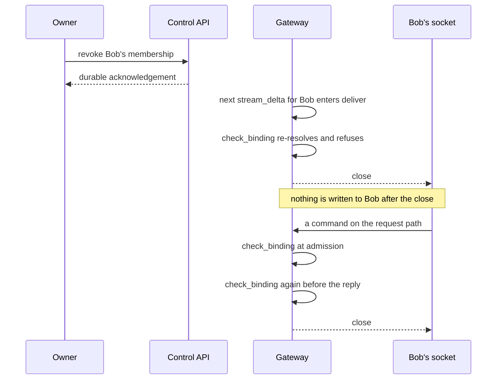
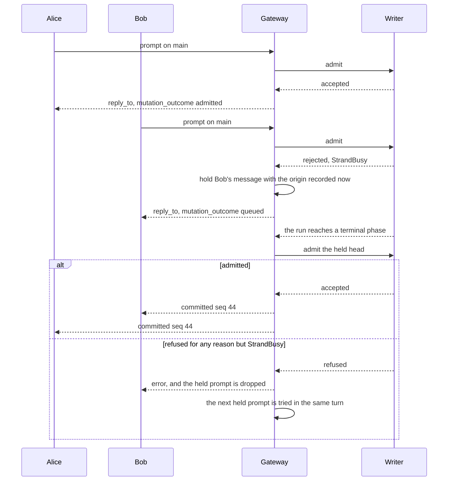
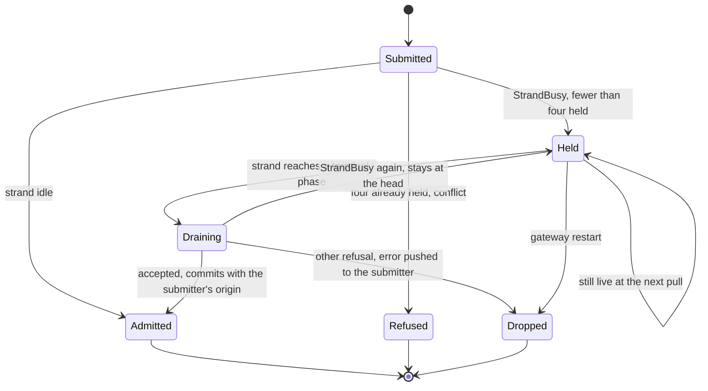
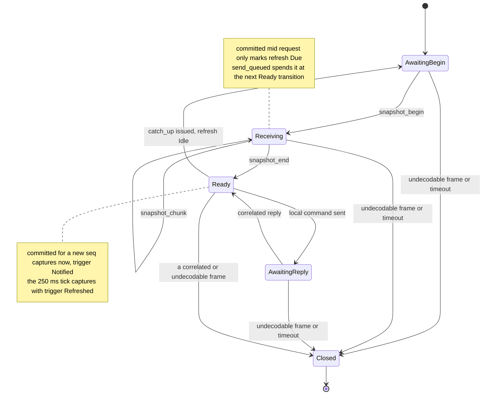

# Several operators on one session

**Status: on `main`.** The managed v2 daemon, per-principal credentials,
attributed commands, presence, pushed delivery and the native terminal
replace the baseline surveyed at `f019322`. Live delivery has its own
shipped fixture. What is still open is the release acceptance, not this
design. Two rows of the scenario matrix below are proven at host level
rather than from the shipped binary. The handoff also still lists four
pieces of release evidence: the resource soak behind #247, hosted latency
in #241, the joined load and crash observations in #246, and filesystem
confinement in #242. The last section says which fixture proves which
row.

This page is for an implementer who is tracing one collaborator's command
from authentication to its durable record and to every attached
terminal's screen. It assumes you know what a session, a strand and the
daemon are, and nothing about this subsystem. The
[client protocol reference](../client-protocol.md) defines every message
on the wire; this page explains the design behind them.
[Sessions](sessions.md) explains how many shared sessions coexist in one
daemon. [Client](client.md) describes the transport and the terminal. The
[brief](../design-notes/multiplayer.md) records the initial survey.

## Identity and authority

Authentication resolves a server-owned principal. A principal has a stable
ID and a display name. Credentials can rotate without changing authorship,
and an ephemeral connection ID distinguishes two windows that belong to
the same principal. A client-supplied name never establishes identity.

The daemon owner manages the server and grants session membership. An
invitation authorizes one named session, not every session the daemon
hosts. Within that session an operator can prompt, steer, abort work,
resolve approvals and change configuration. An observer can subscribe and
replay but cannot mutate. Session access does not include shutting the
daemon down, registering a session, or reaching another workspace.

Both the control and conversation APIs enforce membership, so listings,
operation status and routes never expose an unauthorized session
identifier. Revocation prevents later admissions. An existing attachment
closes at its next authorization check, whether that check guards a
request or an outbound delivery. Revocation does not cancel a command that
was already admitted, and it cannot undo a completed effect; protocol 015
defines that boundary.

Membership is not filesystem isolation. An invitation exposes the
existing transcript and whatever the session's tools and memory can bring
into it, so overlapping workspace grants and deliberately shared memory
can reveal another project's data. The owner has to review those grants
before inviting anyone. Remote access also requires TLS, because a bearer
token over cleartext TCP is not enough.

## One writer, one gateway

Every session has one writer and one gateway, and every attached terminal
connects to that same gateway. (The code calls the gateway "the hub" in
`client/serve`; this page uses one name.) Each admitted durable event
carries one session sequence, and every client reconciles against that
order. The reply to a command reports admission or refusal; the committed
entry then reaches its author and everyone else through the same read
path. A client must not render the admission reply as a durable entry,
because the entry arrives separately.

Concurrent steers are admitted in the session's existing order and carry
their authors into the eventual user turns. There is no controlling
terminal, no global command queue, no transcript CRDT and no per-strand
access list.

Origin travels with user turns, queued steers and approval resolutions. It
records the principal ID and the display name at admission, so a later
rename does not rewrite history. System-generated turns may have no human
origin. The model's prompt projection includes authorship once, which lets
a shared session distinguish one operator's instructions from another's.

## How a frame reaches a terminal

The gateway sends two kinds of frame. A reply answers one command and
carries that command's `id` in `reply_to`. A push answers nothing and has
no `reply_to`. Records always travel as replies: a terminal requests a cut
and the bounded reader answers it. Since
[`protocol-change/018`](../../protocol-change/018-pushed-delivery.md) the
gateway also pushes three things:

- A `committed` notice for each new durable sequence, carrying the
  sequence and the strand and no record. A terminal that has not seen the
  sequence requests its catch-up at once instead of at the next idle
  refresh.
- A `stream_delta` for each provider token, clipped to the same 24 KiB
  bound the snapshot preview uses (`broadcast_delta`,
  `client/gateway.gleam:2693`).
- The presence roster when a peer departs (`publish_presence`,
  `client/gateway.gleam:1924`). A join is not pushed; the joiner's own
  capture carries the roster, and every pushed frame costs one authority
  check per peer.

Two pieces of wiring in `client/serve` make the pushes reach the shipped
binary. It starts one `commit_forwarder` (`client/gateway.gleam:978`) per
session and subscribes the writer to it, so the gateway learns of each
commit. It also nests the two provider taps,
`tap_provider(tap_preview_provider(...))` (`client/serve.gleam:2737`), so
every token reaches the gateway as a `ProviderDelta` while the bounded
preview remains available to a terminal that attaches in the middle of an
answer.

The diagram follows one of Alice's turns from her keypress to the tokens
her peers see.


The author receives her own entry the same way her peers do. Alice's reply
says only that her turn was admitted. The entry reaches her through the
same notice and the same catch-up that reach Bob, which is why a client
that rendered the reply as an entry would show the turn twice.

A notice is safe to receive more than once and in any order. A terminal
that already holds sequence 41 drops the notice. A terminal with a request
in flight defers it. A terminal that missed it entirely receives the
record at its next catch-up. The 250 ms idle refresh stays as that
recovery path, and it is the only path against a daemon built before
pushed delivery.

### One authority check for both kinds of frame

Delivery splits on the envelope, not on the connection (`send_to`,
`client/gateway.gleam:2601`). A frame with a `reply_to` goes out on that
command's single bounded reply capability. A frame without one goes out
through `deliver` (`client/gateway.gleam:2940`). Both paths call
`check_binding` (`client/gateway.gleam:2050`) immediately before the
frame leaves, so every frame that reaches a socket has passed the same
membership check, and there is no second authority path to keep
consistent.

On the socket process a push arrives as a `Push` signal
(`client/daemon/session_socket.gleam:66`) and is written with
`mist.send_text_frame` from the same handler that writes replies. One
mailbox orders the two kinds of write, so a reply and a push never
interleave within a frame.

That check is where a revoked member stops receiving frames.



Revocation stops frames, not admitted work. Bob's socket closes at the
next frame the gateway attempts to send it, on either path, and a command
that was already admitted still runs to its durable end. The narrow
interval between admission and delivery is covered by
`session_authorization_test` with scripted authority; the shipped fixture
establishes the boundary after the owner's acknowledgement.

## Concurrent submits and the queue

Two operators who submit on one strand are ordered, not refused. The first
prompt opens the run. The gateway holds the second in a per-strand queue,
answers it `mutation_outcome {status: "queued"}`, and submits it under its
own submitter's origin when the run settles (`hold_prompt`,
`client/gateway.gleam:3486`). The queue is gateway memory and holds four
prompts per strand (`held_per_strand`, `client/gateway.gleam:670`). A
fifth prompt receives the `conflict` reply that every second prompt used
to receive.



The drain runs inside the gateway's pull, because that pull is the one
place where the gateway observes that a strand has gone idle.
`drain_idle_strands` (`client/gateway.gleam:4237`) is called from
`pull_and_broadcast` (`client/gateway.gleam:2323`) after `state.live` has
been refreshed from the registers and before any frame leaves. Only the
head of a queue is submitted (`drain_strand`,
`client/gateway.gleam:3548`), since the writer would reject a second
prompt on the strand it has just opened. A `StrandBusy` at drain time
keeps the head in place for the next transition. Any other refusal
belongs to that prompt alone: the prompt is dropped and the submitter
receives a pushed `error`. The next held prompt is then tried at once,
because nothing else will transition an idle strand.



The restart edge is why the reply says `queued` rather than `admitted`. A
held prompt is not durable: a gateway restart drops the queue, and a
prompt that survived a restart would need a new durable operation kind in
`machine`. The wire reports the weaker status, and the terminal clears its
own queued state when the socket closes. `steer` and `follow_up` are
unchanged. A principal who wants a message folded into the running turn
uses those; `prompt` on a busy strand means "the next turn".

## What the terminal does with a pushed frame

The terminal accepts a frame without `reply_to` in every phase except
`Closed`. `session_wire.decode` (`tui/session_wire.gleam:161`) treats the
absent field as the mark of a push. A frame that does carry `reply_to` is
still matched against the outstanding request, so a stale or forged
correlation still fails closed. A push belongs to no request: it consumes
no credit, allocates no identity, and cannot fail the lane
(`apply_pushed`, `tui/session_channel.gleam:518`).



A notice arriving in `Ready` starts a catch-up at once. A notice arriving
while a request is in flight sets a one-bit mark, `Refresh.Due`, and
`send_queued` (`tui/session_channel.gleam:1112`) starts the catch-up at the
next transition to `Ready`. That is sooner than the idle refresh in `tick`
(`tui/session_channel.gleam:732`) would have started it. The mark is a
bit rather than a count because a notice carries no state, so any number
of them mean the same thing: capture when free.

Two cases drop a notice (`capture_or_defer`,
`tui/session_channel.gleam:546`): a sequence below the current cut's
`next_seq`, which the terminal already holds, and a notice that arrives
before any cut exists, which the initial transfer will deliver anyway. A
`Closed` lane drops everything.

Because a notice may correctly do nothing, the lane reports every one it
reads as `Noticed` (`tui/session_channel.gleam:117`) before deciding what
to do with it, and the model counts those arrivals (`tui.gleam:365`).
That count is how the shipped fixture proves that pushes reach a terminal
without depending on which capture painted the answer. The other pushed
events are simpler. A `stream_delta` becomes a `Streamed` update in any
phase. `presence` and `attachment` trigger a capture, like a notice. A
pushed `error` reports a failure the daemon had on this terminal's behalf,
so it is rendered as an ordinary refusal and the socket stays open.

A `stream_delta` arrives per provider token, and what the terminal keeps of
one is bounded in two ways it did not used to be. The delta's `text` is a
slice of the whole received frame, so the model rebuilds it before storing
it; keeping the slice kept the frame, and a long answer kept one frame per
token. And the accumulated live region collapses to its newest 24 KiB —
`tui.live_stream_limit`, the same clip `stream_preview` takes — whenever it
would pass twice that. Without the second bound every paint reflowed the
whole answer, so a terminal on a long turn drained its socket more slowly
the longer the turn ran, until the socket was not being drained at all and
the growth moved into the mailbox, a whole frame per queued message. That is
what put two terminals at 32 GB and 26 GB against daemons at 3.5 GB and
1.6 GB. `packages/tui/test/stream_bounds_test.gleam` holds the bound: across
40,000 deltas the model stays flat at a few hundred kilobytes and sustains
above 3,500 deltas a second. What a reader loses is the head of an answer
that has not committed, and the durable record replaces the whole region the
moment it does.

### One turn on the wire

The transcript below shows one turn as a raw v2 client receives it. `→`
marks what the client writes and `←` what it reads. Fields not under
discussion are elided as `...`. The
[client protocol reference](../client-protocol.md) defines every field.

```
→ {"v":2,"id":1,"cmd":"subscribe","body":{"session":"S"}}
← {"v":2,"reply_to":1,"event":"snapshot_begin",
   "body":{"snapshot_id":"T1","next_seq":40,"window":"recent",
           "role":"operator","record_bytes_limit":33554432,
           "fragment_bytes_limit":24576,"origin":null,...}}
→ {"v":2,"id":2,"cmd":"snapshot_next","body":{"snapshot_id":"T1","index":0}}
← {"v":2,"reply_to":2,"event":"snapshot_chunk",
   "body":{"snapshot_id":"T1","index":0,"record_id":"R1",
           "total_bytes":812,"offset":0,"data":"<base64>",...}}
→ {"v":2,"id":3,"cmd":"snapshot_next","body":{"snapshot_id":"T1","index":1}}
← {"v":2,"reply_to":3,"event":"snapshot_end",
   "body":{"snapshot_id":"T1","index":1,"next_seq":40,"more_after":null}}
← {"v":2,"event":"committed","seq":41,"body":{"strand":"main"}}
→ {"v":2,"id":4,"cmd":"catch_up","body":{"from_seq":40}}
← {"v":2,"reply_to":4,"event":"snapshot_begin",
   "body":{"snapshot_id":"T2","next_seq":42,"window":"catch_up",...}}
← {"v":2,"event":"stream_delta",
   "body":{"strand":"main","op":"op-7","ephemeral":true,
           "kind":"text","text":"livedeli"}}
← {"v":2,"event":"presence",
   "body":{"peers":[{"connection_id":"c-2","origin":{...},
                     "role":"operator"}]}}
```

The last three frames carry no `reply_to`. A client written before
`protocol-change/018` closed the connection on such a frame, because it
treated every frame as the answer to its outstanding request. The
`presence` frame here reports a departure; a join is not pushed.

## Configuration, presence, and approvals

Configuration is durable session state. A successful change is included,
with its origin, in every client's next metadata cut, and reconnection
restores it from the server. A client must reconcile a metadata-only
change even when no new entry advances the entry cursor.

Presence is transient. Reconciliation supplies a replacement roster of
principals and connections; joins and leaves are not conversation
entries, and several windows from one principal stay distinguishable. The
roster is a gateway observation, not part of the storage transaction that
captures durable metadata.

An escalation is shown to the session's eligible operators. Approve and
deny compete through the same conditional transition, so exactly one
resolution wins, and the result records its origin and the exact action
and grant. The losing client receives a conflict that names the resolved
request. Seeing an escalation never grants permission to approve it.

## What the client renders

The attachment snapshot identifies the authenticated principal and the
current session role. Other operators' turns show their authors, a shared
configuration change updates every footer, and presence shows who is
attached. Switching the viewed strand or session changes only that
terminal's view.

After a disconnect the view is visibly stale until a snapshot and a
catch-up complete. Durable cursors are session-scoped and may be sparse.
Stream fragments and presence do not survive a new session incarnation.
A prompt or approval whose outcome is unknown stays marked unconfirmed and
is never resent automatically; later transcript updates do not clear that
mark.

## Sharing scope

Workspace memory is private to the owner by default, and session
membership grants no access to another session's transcript or to a
workspace aggregate. Before inviting a collaborator, create a
`session_only` session, or stop an existing one and run
`loomd access isolate SESSION --share-existing-transcript`.

Isolation assigns fresh memory and index paths without copying the private
aggregate. It preserves the existing transcript, which may already contain
privately recalled material; the acknowledgement authorizes sharing that
history, not sanitizing it. Repeated isolation keeps the same paths. A
retained runtime or a failed-cleanup slot must retire before isolation
can proceed.

The catalogue records this policy without opening stores. Runtime recall
and maintenance must use the same mappings; the accepted domain addendum
in [protocol 015](../../protocol-change/015-daemon-control-and-session-attachments.md)
defines them.

## What the fixtures prove

Each fixture runs independent native terminal drivers, each owning its
inbox, connection and virtual-terminal loop, over real WebSockets to a
real server with real session storage. Scripted providers answer only
when the request contains the expected prompt, so a rendered marker proves
the round trip. The matrix lists the acceptance obligations and the
fixture that establishes each one. A live drive with two owner terminals
has also verified rendering without a keypress, submission after capture,
and session switching, but not distinct-principal authority.

| Scenario | Required observation | Proved by |
|---|---|---|
| Two operators prompt and steer | Both transcripts contain the same admitted entries once, in the same order, with correct origins. | `tui_shipped_multiplayer_test` |
| One operator changes config | Both clients render the resulting model and configuration state. | `tui_shipped_multiplayer_test` |
| Approve races deny | Exactly one durable resolution wins, the UI names its author, and only the authorized effect runs. | `tui_multiplayer_test`, `tui_approval_effect_test` (host level) |
| Observer submits a mutation | The server refuses it; neither durable state nor tool execution changes. | `tui_shipped_multiplayer_test` |
| One client disconnects and returns | Catch-up converges without duplicate entries, old streams, or stale presence. | `tui_shipped_multiplayer_test` |
| A session invitation targets another session | No listing, subscription, lifecycle status, or mutation authority crosses the membership boundary. | `tui_shipped_multiplayer_test` |
| One session stalls | Clients on another session remain usable. | `daemon_fault_containment_test` (host level) |
| Two operators prompt inside one catch-up window | One prompt opens the run; the other is answered `queued` and commits with its own submitter's origin when the run settles. | `tui_shipped_live_delivery_test` |
| A peer's answer is delivered | Every terminal shows the answer's text before any entry for it exists in that terminal's cut, and its notice count rises by the records the turns commit. | `tui_shipped_live_delivery_test` |
| A member is revoked mid-answer | The socket closes at the per-frame authority check while pushed frames are in flight, and no further frame reaches it. | `tui_shipped_live_delivery_test` |

### The shipped multiplayer fixture

`tui_shipped_multiplayer_test` drives the built `bin/loomd` through its
real bootstrap and administration APIs. The owner creates a session,
isolates it, invites two operators and an observer, and reopens it. Three
terminal drivers verify their principal and role, converge on Alice's
configuration change and its server-assigned origin, and then run a
scripted provider turn each for Alice and Bob, with Bob leaving and
rejoining in between. All three terminals must end with identical durable
records, exact authors and answer text.

The same fixture proves the authority boundary. An uninvited session in a
separate workspace is invisible to the operator and observer. Its
metadata, open and lifecycle requests return `not_found`, owner-only
mutations return `forbidden`, and both credentials fail its WebSocket
upgrade, while the owner can read and attach to it. An observer's valid
`set_config` frame sent straight to the gateway receives a correlated
`forbidden`. Revoking Bob while his terminal and a raw socket are attached
must close the socket at the TCP level and remove him from the roster.
His credential must still authenticate control with an empty catalogue,
which distinguishes membership revocation from credential revocation.

Two further stages cover session switching and a live tool. Alice
switches to a second session and back while the Reader stays attached to
the first; a revocation before she confirms the switch must leave her
original attachment intact. A fixed bash tool runs in one session while
Alice switches away and back, and its result must merge with no later
input. The tool stage runs only where the shipped helper reports full
enforcement. The ordinary Linux CI job declares that prerequisite
missing, the delegated jail job runs the stage and rejects the skip, and
macOS runs the full drive. What the fixture does not prove: filesystem
confinement, an approval decision, and revocation of a command already
queued. The [handoff](../next.md#verified-results-and-their-limits)
records which revision passed each gate.

### The shipped live-delivery fixture

`tui_shipped_live_delivery_test` proves the last three matrix rows. It
builds the same session shape, except that Bob is a raw v2 wire client on
the same authenticated route the terminals use. Bob is a wire client
because only a wire client reaches the queue on every run. A terminal
sends `prompt` only while its own view shows the strand idle, and against
a pushing daemon that view is stale for a few milliseconds at most. The
fixture waits until Alice's terminal reports the strand running, which
means the run exists at the gateway, and then writes Bob's prompt. The
`queued` reply is therefore deterministic.

The scripted provider is paced with `provider_http.Paced`, which splits an
answer across content deltas with a wait between them, so an answer
occupies an interval. Inside that interval both terminals must show live
text that is a prefix of the answer while their records hold no assistant
entry yet. Both delivery properties are counts rather than timings. A
stream holding two or more fragments before the entry exists can only
have come from `stream_delta` frames, because the snapshot preview always
projects as one fragment. Each terminal's `Model.notices` must rise by at
least the four records the two turns commit. Which capture painted an
answer is not asserted, because the idle refresh may have a catch-up in
flight when the commit lands.

A third turn exists so that Bob can be revoked while frames are in flight
to him. The fixture reads his socket until it carries a prefix of the
third answer, the owner revokes him, and the socket must then deliver the
server's close frame and nothing after it. Bob's history is then read back
through his own `catch_up` and must decode to the same records the
terminals hold. The fixture does not cover a gateway restart, the
four-deep queue bound, or a drain failure; the gateway's unit tests do.
`make e2e-client-bootstrap` supplies the executable and the dummy
provider credential, and the fixture skips itself when
`LOOM_BOOTSTRAP_E2E_SERVER` is unset.

### Stop, reopen, and the host-level fixtures

`daemon_shipped_stop_test` holds one session's HTTP response open while a
second session completes a turn. The owner stops the first session, the
provider socket must close, the same control connection must observe
`Saved`, and the second session completes another turn without replacing
its attachment. Reopening the first session creates a new incarnation and
resumes its admitted operation, and its durable history must contain one
user message, the interrupted settlement and the final answer. That fixture covers
cooperative stop and recovery; a process kill or an uncooperative drain is
separate injected-transport coverage.

The host-level fixtures run in the ordinary client suite and complete the
matrix where the shipped drives stop:

- `tui_e2e_test` starts the managed daemon over SQLite with a real v2
  listener, has Alice and Bob submit distinct prompts, and compares both
  clients' decoded records and rendered replies, then has a fresh
  subscriber recover both turns.
- `tui_multiplayer_test` uses real admin-issued operator and observer
  credentials and lets real operator commands race to resolve a pending
  escalation, proving the recorded winner and its rendered author.
- `tui_approval_effect_test` adds a real broker, SQLite and native
  execution: two operator sockets submit the same approval, one wins, the
  other receives `stale_approval`, and exactly one marker file and one
  durable result record the effect.
- `tui_v2_persisted_test` covers shared-domain assembly and lazy restart
  across two workspaces, and `tui_recording_v2_test` covers recording
  replay.
- `daemon_fault_containment_test` blocks one session's provider and
  proves another session keeps making progress under the original writer
  lease.

Their providers are scripted, so none of them establishes
production-provider behaviour, and none turns a matrix row into an
exhaustive fault or interleaving test.

### How the drivers wait

Each driver creates its inbox and runs its terminal loop in one process,
because sharing a model or constructing both inboxes in the coordinator
would bypass the ownership rules the shipped client relies on. Server
responses arrive through each client's real connection. The driver
transfers each message into a separate model inbox that has no other
sender, so socket order is preserved, and the coordinator never
fabricates a gateway response.

Every wait names an observable condition and a deadline, such as both
clients holding the committed entry sequence; a fixed number of ticks
proves nothing about what the daemon processed. Injected presentation
time makes frame pacing reproducible, while real socket and cleanup
deadlines still bound a hung test. A failure report keeps each client's
input schedule, its inbound recording, its last frame, the expected
condition and the relevant durable state.

### Running them

`make e2e-multiplayer` builds the real helper and runs the host-level
fixtures with a 180-second outer deadline per module
(`LOOM_TEST_TIMEOUT_SECONDS` overrides it), stopping at the first failure.
`make e2e-client-bootstrap` builds `bin/loomd` and runs the shipped
fixtures against it. `make soak-daemon` runs repeated real session
lifecycles with an unread peer, and `make soak` runs deterministic
conformance seeds. None of these replaces the shipped-artifact and
platform acceptance drive. The
[mutation checks](../review/single-daemon-mutation-gates.md) record six
tested failure cases behind the lifecycle and transfer assertions, and
the [simulation brief](../design-notes/tui-simulation.md) describes the
seeded simulator and full real-server drive that remain incomplete.

[Issue #240](https://github.com/Roasbeef/loom/issues/240) is what pushed
delivery implements. `docs/design-notes/live-delivery.md` is the ruling,
and it records the two questions left open: a durable queue, and
registry-pushed revalidation in place of the per-frame check.
