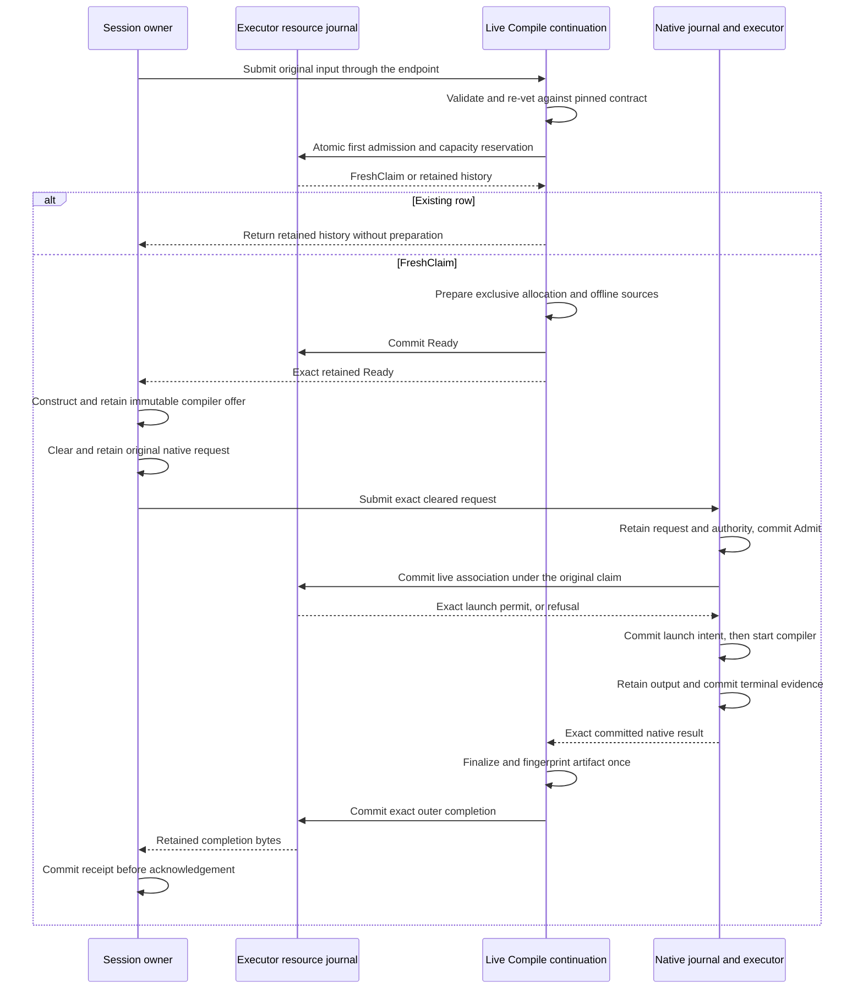

# Remote compilation and retained outcomes

Remote compilation keeps the source preparation, compiler process and compiled
artifact beside the registered executor workspace. The session owner retains
approval and budget authority. A compiler result names an executor-owned
artifact, so the owner never interprets its location as a local filesystem path.

The components described here implement the storage and validation boundaries in
[protocol 067](../../protocol-change/067-remote-workspace-services.md). The native
command admission engine, whole Compile actor, owner consumer and
concrete TLS BEAM routing are implemented components. Registered daemon
assembly, Launch and separate-host acceptance remain pending. The sequence
below describes their effect and receipt order; it does not claim a shipped
remote workflow.

## Three records describe different work

The owner journal retains the original tool, physical service and cleared native
command. Its service key includes the parent tool identity, complete workspace
scope, physical operation and step, service UUID, and input and enrollment
digests. The command reference retains that full service key. An operation number
alone cannot distinguish two physical services under different parents.

The executor resource journal retains the original Compile input, preparation
state and outer completion. Its separate native journal retains the exact
compiler request, admission, ordered output and terminal evidence. Those records
answer different questions: preparing files does not establish native admission,
and a compiler exit does not establish a finalized artifact.

| Record | What its commit establishes |
|---|---|
| Owner command reservation | The original native UUID and exact cleared request are retained before transmission. |
| Resource Ready | The recorded allocation and preparation receipt belong to the original service. |
| Native Admit | The native journal has admitted the exact compiler request. |
| Resource association | The retained native request matches this service's full identity and compiler template. |
| Native terminal commit | The native reducer has accepted the retained terminal payload as evidence. |
| Resource completion | Exact outer result bytes and their digest can be recovered without finalizing again. |

The [custody guide](remote-custody.md) explains owner reservations and tool-result
recovery. `executor/remote/resource_journal` owns the executor records above.
Its named SQL queries are compiled by Parrot/sqlc; schema installation and
transaction control remain explicit in the actor.

## Preparation grants one live continuation

The original service calls `admit_preparation` to insert its input and enter
Preparing in one SQLite transaction. That transaction reserves room for the
input, preparation receipt, native association and completion. Only a successful
commit of this new row returns `FreshClaim`. The opaque claim belongs to the
original journal endpoint and original input.

Every matching existing row returns `Retained`, including Reserved. This rule
matters when the process stops between reservation and preparation: reopening
the database must not turn an old reservation into a new live continuation.
The earlier, separate reserve/claim APIs remain available to their component
callers; the whole Compile service must use atomic first admission.

`fence_preparation` orders cancellation against that first admission. If the
input is absent, it reserves capacity and inserts an Unknown row in the same
transaction. If the row is Reserved, Preparing or Ready, it changes the phase
to Unknown while preserving any Ready bytes and native association. A late
admission then reads history. If admission won first, its late Ready or native
association still has to pass the committed fence.

Both operations compare the complete immutable input under the writer lock.
An existing row with a different body or service identity returns a conflict.
For absent input in a sealed scope, cancellation can return `ScopeFenced`
after excluding an address collision. That response confirms the scope's seal;
it does not invent an input row or claim that an earlier process has stopped.

A failed or ambiguous commit returns `Uncertain` and fences the journal
endpoint. No live claim or successful cancellation acknowledgement escapes
that path. The caller must preserve the uncertainty instead of retrying as
new work.

The physical service must exclusively create the allocation, prepare fixed
sources and the offline seed, and then commit Ready. An existing allocation is a
collision; it cannot be reused or deleted to make a retry work. The shared
compiler helpers perform preparation and finalization, while the live service
must enforce this ordering and the original deadline.

The native service now calls the live association boundary between native
admission and launch intent. Its opaque `CommandContext` holds either the original
preparation claim or historical input. The live constructor derives that input
from the claim and checks the complete service key and concrete native journal
endpoint. It cannot combine a peer-selected row with another service's claim.

Only a live context can request a challenge or submit a compiler command. Its
challenge ticket includes the complete command reference, so another route cannot
reuse the nonce. The service refuses session-lifetime compiler commands before
authorization. After the resource association commits, the service compares the
permit's exact endpoint, reference, native key and digest before continuing to
launch. The existing deadline check still applies after that wait.

The live context also retains the original Compile deadline in the native
service's monotonic clock era. The executor whole Compile actor captures that deadline once at
admission and copies it into subsequent contexts. Native authorization takes the
earlier of this cap and the deadline derived from its own challenge. It retains
the resulting Authority before admission and uses that same deadline for launch
checks and the native watchdog.

This cap includes time spent preparing files. A larger remaining budget sent
later, including one inflated by an owner wall-clock adjustment, cannot extend
it. The selected native wall and cleared request remain unchanged. Zero is
invalid; a negative deadline can be valid when the monotonic clock's current
value is also negative. The constructor cannot prove that a trusted caller
supplied its original deadline, so the whole Compile owner must preserve that
value and clock era.

Historical contexts can query, cancel, send stdin or acknowledge an already
associated command. Each operation checks the retained reference, key and digest
before applying an effect or returning native evidence. Both duplicate Submit
paths perform the same check. Retained input alone grants none of these controls;
the exact association establishes which native command belongs to the service.

### Cancellation and admission share one transaction order

`associate_live_native` requires the original preparation claim. It first reads
the exact native request, finite authority and committed admission. Those reads
occur outside the resource writer transaction so one actor does not hold a writer
lock while asking another actor for evidence.

The final resource transaction checks the full original input again. The scope
must still be open, preparation must be Ready, and the native association must be
absent. It commits the association before returning an opaque permit bound to the
exact resource endpoint, command reference, native key and request digest.

If cancellation commits first, the association refuses. If association commits
first, cancellation follows the retained native key. The latter ordering can race
process startup; it does not establish that no process ran. The native reducer's
separate launch-intent transition still permits at most one launch.

The permit carries no renewed deadline. The original native continuation must
check elapsed time before launch. Duplicate association, a lost reply or journal
recovery cannot return another permit. Gleam values are copyable, so trusted
assembly must keep the returned permit in that original continuation.

`retained_input` recovers the original bounded data through its complete service
key, including after cancellation, scope sealing or native endpoint loss. It never
reconstructs a preparation claim. This lets recovery compare history while keeping
fresh execution permission unavailable.

## Every native exchange retains its physical service

A compiler command has two identities. Its native key identifies the process
request and retained output. Its `CommandRef` identifies the whole Compile
service that prepared the files. The reference includes the original service
UUID, parent tool, scope, physical step, input digest and enrollment digest.
Keeping both prevents a request from using one service's preparation to control
another service's compiler.

The owner dispatcher represents this distinction with `CommandReserved`. It
carries the exact reference through Challenge, Submit, Query, Stdin, Cancel and
DurableReceipt. A detached cancellation retains the same route even after the
main dispatch worker stops. Ordinary native reservations retain their existing
wire format.

`wire.CommandEnvelope` wraps the canonical reference and existing native
envelope under a closed discriminator. Construction checks scope and physical
operation correspondence. Decoding applies the existing aggregate frame bound
and requires canonical bytes; the wrapper does not enlarge the Prepared limit.
The endpoint checks the complete returned reference and transport generation
before exposing a native answer. An ordinary native reply cannot satisfy a
command exchange.

The wire checks establish correspondence. The native service separately checks
the exact retained resource association before historical control or returning an
existing command's output. Fresh admission requires the original live claim and
association permit described above.
The fixed TLS BEAM endpoint sends physical command envelopes through the
registered whole Compile actor. A live route uses its original Claim and cap;
historical lookup constructs only an associated control context. The
[routing review](../review/distributed-physical-command-routing.md) records the
codec and dispatcher controls. The original hostile socket fixtures are being
migrated to real TLS BEAM peers; a fixed hostile peer proves transport refusal,
not service admission.

## The original owner consumes Compile

`client/remote/compile_client` projects an internal `compile.CompileService`
from the original runner's pinned custodian Handle, session Broker, checked
SessionEnrollment and concrete TLS BEAM endpoint. It creates no new actor,
clock, registry or clearance authority. The enclosing custodian admits at most
four managed bodies and durably retains unresolved run custody; this adapter
is not a free-standing unlimited service.

Before a send, the consumer validates the source input and original complete
PhaseIdentity, derives the Compile service origin from its original parent and
reserves the exact canonical service envelope. The native origin is separately
CompileCommand. Its original nonzero Unix budget becomes one owner-monotonic
deadline. The challenge exchange uses the explicit 1000-ms ticket window and
100-ms margin; retransmission cannot create another lifetime.

Ready must bind that exact service and enrollment-derived allocation. Only then
does the owner choose a positive finite compiler wall under the original
remaining deadline and retain one immutable offer. The private accepted command
factory uses the shared service template, original input and actual Ready.
Native ceiling restrictions are ordered before policy set construction and real
Broker clearance. Protected roots and environment allowlists compare as sets;
literal command environment, argv and cwd stay exact ordered values. Actual
Prepared and native registered policy authority remain unchanged.

The existing indexed `command_binding` resolves the full retained service and
offer before preparation, then atomically reserves the original cleared native
request. A discarded unused UUID candidate is harmless: the transaction returns
the existing UUID on exact retry. Recovery never invokes that sendable path.
The dispatcher preserves the complete CommandRef through challenge, submit,
query, stdin, detached cancellation and native receipt.

Owner settlement crosses two receipt boundaries. The dispatcher first commits
ordered native output and terminal bytes. The Compile consumer accepts only a
closed outer completion, at most 256 KiB, whose complete service key and native
association match that retained receipt. Its private ordered-receipt parser
handles the existing larger child receipt: at most 64 binary output chunks of
16 KiB and one terminal binary of 32 KiB, within the custodian's 2-MiB aggregate.
It re-encodes through the existing receipt codec to require canonical equality.
The generic 256-KiB scanner cannot parse that larger existing receipt profile.

Only a successful owner receipt commit permits outer ACK. A valid exact receipt
arriving after cancellation is retained, because cancellation cannot erase an
already completed effect. Conflicting bytes or digest refuse. Historical
recovery observes original input and exact completion without preparing,
minting, submitting or clearing again. Its best-effort ACK uses the existing
finite exchange bound; an ACK failure does not discard usable owner evidence.

The startup allowance is
`44000 + clearance_wait_ms + 2 * exchange_wait_ms`, derived from serial pending
asks and fixed control margins. `challenge_window_ms` is separately 1000 ms.
This allowance concerns successful bounded exchanges; expiration of an abandoned
ask cannot prove that its write was cancelled. Preparation, clearance and native
launch still spend the original whole-service deadline.

## A single trusted BEAM endpoint carries both routes

`beam_endpoint.compile_registration` derives the native service and enrollment
from its concrete whole Compile actor. Whole operations transfer canonical Input
and return bounded metadata plus an optional exact completion segment. Physical
native commands enter through `compile_service.send_command_exchange`, whose
live path retains the original actor-owned Claim. A historical command context
cannot substitute for that first-submit authority.

All scopes share four data and two control credits at one fixed node rendezvous.
Each credit retains the original final service reply subject. The actor may
finish a forwarding task while the actual native service still owns its ask;
only that service's answer and final transport drain permit reuse. Old local
handoffs carry their correlation and cannot enter a reused credit. The endpoint
bounds acknowledged content, not every message a trusted BEAM member can send.
See [executor architecture](executor.md#one-concrete-endpoint) for membership,
credential protection and native lifetime obligations.

## Failure preserves what can be proved

A failure during preparation can produce a Before-native completion only while
the original claim still names live Preparing state. The completion transaction
also fences a late Ready commit. After Ready exists, absence of a native
association proves only that the association is absent. A native submission may
already be in flight, so the result must remain uncertain.

A completion after native work requires both retained terminal bytes and the
matching committed native evidence. Retaining the bytes can precede the reducer
commit. Treating those bytes alone as completion would incorrectly close that
window. The live continuation must then finalize the artifact once and retain the
closed outer result before advertising it.

Exact historical association, completion and acknowledgement retries read the
resource journal first. They remain available after loss of the native endpoint,
resource release or scope closure. They do not renew a deadline, re-clear a
command or repeat source preparation. Conflicting bytes fail instead of replacing
the original record.

### Observe a committed result before finalizing

`executor/remote/compile_observation` implements the evidence boundary between
the native journal and physical finalization. It first reads the native reducer's
committed terminal state, then reads the immutable output and terminal payloads.
Reading payloads first could mistake a concurrent commit for missing evidence;
accepting payloads without the reducer commit could advertise unfinished custody.

The adapter checks the original full service key, enrollment, Ready allocation,
native request key and digest. An absent association or uncommitted terminal is
pending. A committed terminal whose retained payload is absent or inconsistent
is an error. Output ordinals must be contiguous; reconstruction preserves each
stream's order and accumulated truncation status.

The resulting opaque observation contains data for the original continuation.
`finalize` calls the shared build finalizer against that original allocation and
fingerprints actual compiler products. A recovered row cannot create a new live
continuation, and copying an observation cannot establish permission to finalize
again. The Compile service owns that once-only ordering and the subsequent
outer-completion commit.

Human-readable outer errors have an 8,000-byte UTF-8 ceiling, including a
truncation marker. The error variant survives truncation, and exact native
terminal and receipt bytes remain unchanged. The
[observation review](../review/distributed-compile-observation.md) records the
real-journal controls, compiler-product fixture and remaining integration limits.

## Receipts and cleanup are independent

The outer Compile receipt means that the owner retained the exact Compile result.
The native receipt means that the owner retained the compiler's exact native
result. Native retirement requires a separate witness that the scoped native
processes have drained. Resource cleanup records what happened to the allocation.
No one of these facts substitutes for the others.

The resource database uses format 2 and reserves future result capacity before
effects. It refuses an older format before querying new columns. Header queries
check scalar types, lengths and reserved capacity before transferring bodies;
body queries retain their own guards. These checks bound what a corrupt row can
materialize as well as what a valid request can reserve.

## Verification and integration boundary

The [custody review](../review/distributed-compile-outcome-custody.md) records real
SQLite tests, native admission and terminal evidence, independent review findings
and targeted mutations. The [P model review](../review/distributed-compile-custody-model.md)
records bounded checks of preparation, settlement and receipt ordering. Those
model checks do not establish database crash atomicity or operating-system
behavior.

The [live-admission review](../review/distributed-live-compile-admission.md)
records the resource transaction controls, complete-identity mutations and
independent executor gate. The [first-admission review](../review/distributed-compile-first-admission.md)
records the atomic insertion and cancellation controls, including independent
SQLite opens and commit failures. The [native-command review](../review/distributed-native-command-admission.md)
records the next boundary: actual compiler output, cross-command control refusal,
resource fencing before native launch and exact historical recovery. The native engine, whole Compile actor and owner consumer now supply these
component boundaries. Real joined controls use the original Broker, actual
compiler/helper and independent TLS BEAM owner/executor VMs; they establish
component custody, not separate-host filesystem isolation.

Production acceptance still requires registered daemon assembly, Launch/satellite,
remote LSP and ordinary tool consumers. The native historical-context
Missing/Conflict classification remains a separately pending correction. The final
test must run the owner and executor on separate hosts with the workspace absent
from the owner's disk, including cancellation, restart and lost replies.

## Closed Launch custody

The executor resource journal uses format 3 for closed Compile and Launch
completion in the same bounded slot. It refuses formats 1 and 2 before reading
new columns or bodies. Fresh provisioning is required; this component performs
no migration of existing journal constraints.

`launch_completion` records the complete original Launch key and a witnessed
refusal before native dispatch or exact settled native identity, Prepared digest
and canonical terminal bytes. Native enforcement derives from the terminal.
Program outcome and complete report retention belong to the existing owner
store; the 256-KiB completion slot cannot carry a 16-MiB cap frame.

`fail_launch_preparation` requires the original live Claim and definite owner
refusal continuation. Its atomic phase fence preserves Ready while excluding any
retained native association. The native command service can dispatch only after
that association commits and yields its opaque permit, so whichever commit wins
excludes the other. Native readback already in progress must revalidate after
refusal. Missing association alone, timeout and caller loss remain uncertainty.
`commit_launch` instead requires exact actual native journal settlement. Neither
completion variant establishes resource cleanup, transport consumption, scope
retirement or owner report COMMIT, and neither can recreate a live channel.

Launch native association reads one bounded Compile producer from the same
resource connection and verifies its full original input, enrollment and retained
successful completion. The existing `service_input.admit_launch` and
`service_command.launch` constructors derive the SatelliteCommand using actual
admitted wall time and original Launch Ready resources. Compile-specific APIs
remain role guarded. The same canonical Prepared, UUID, policy and finite native
authority checks apply; historical recovery grants no new native permit.

## Whole Launch executor-local owner

The authenticated local `launch_service` admits closed token placement and keeps
one through four original live entries beside its bounded metadata lane. Before
Claim or file effects, it validates the retained successful Compile producer and
hashes that producer's actual beam directory against the immutable manifest.
The original actor retains Claim and socket ownership before preparing exclusive
canonical paths, private token permissions and a listener, then commits LaunchReady.
The existing owner Broker supplies the cleared SatelliteCommand through the live
Claim route; Launch adds no native execution engine.

Finite `Observed(preparation, LaunchStatus)` answers separate admission from
socket handoff. `install_host` accepts the trusted original host once and returns an
`Installed(deadline_ms)` receipt from the same active original entry, then its
paused connection asynchronously after acceptance and weft adoption of both socket
children. The caller installs the connection before activation. Historical Query
cannot return a live connection or mint another Claim. The executor-local reader
orders bounded cap frames and End; native terminal observation retains its closed
journal evidence independently and never emits End.

Definite owner refusal uses `RefuseBeforeNative` and the atomic original Claim
fence, including after Ready. Lost replies and timeouts remain uncertain. Cleanup
closes the original listener and accepted socket independently before joining
blocked I/O. A committed no-dispatch refusal, actual child joins, original path
removal and resource release COMMIT establish ResourcesReleased. Cancellation
can also establish no-dispatch custody after its original fence commits and
exact same-row Unassociated readback succeeds. It does not create a historical
RefusedBeforeNative result. Original preparation and socket joins must precede
directory removal; lost fence, readback or join remains unresolved. A separate
six-second observation grace never extends the immutable dispatch deadline.
Associated native
terminal evidence currently retains unresolved resource retirement. Active slots
remain held until the original continuation and cleanup witnesses all settle.
A historical replay owns no Claim or channel; its completed observation-only
entry releases admission capacity after its actual managed task drains.
The finite BEAM routes and live stream are described below. Owner client
integration and default assembly remain separate integration work; this local
owner alone is not distributed E2E acceptance.

## Original Launch stream over BEAM

`launch_beam` connects the original owner host to the executor-local paused
connection. `beam_endpoint.bind_launch` uses route five and one finite Control
credit to install the checked original offer once. The service row, peer, door,
scope, generation and full Launch identity must agree. The installation reply
does not wait for socket acceptance. Socket handoff, activation and stream
lifetime belong to the separate bridge actor. A known installation or definite
refusal can return its credit after the actual network task drains; an uncertain
installation retains its assignment. A lost reply never permits a fresh bind.

Each direction owns one original frame reservation. Frames carry at most 16 MiB
of payload plus their four-byte prefix, transported in chunks no larger than
64 KiB. The 64 MiB lifetime allowance includes every prefix and is never
refunded. Chunk acknowledgement advances the byte cursor; only the original
frame consumer returns frame capacity. Peer-door identity, direction and
sequence must match before a message can change that state.

The executor's original reader produces End and terminates on Final. The bridge
retains an authenticated close result even when it arrives before the local
caller asks to close, then joins its original collectors. TransportJoined and
ResourcesReleased remain separate observations. A native terminal, process exit
or closed socket cannot invent resource release. Raw token placement uses its
existing separate operation; neither the binding nor stream packets carry it.

The [stream review](../review/distributed-launch-stream.md) records the real TLS
and Unix controls, independent gate and current integration limits.

## Whole Launch executor-local owner

The authenticated local `launch_service` admits closed token placement and keeps
one through four original live entries beside its bounded metadata lane. Before
Claim or file effects, it validates the retained successful Compile producer and
hashes that producer's actual beam directory against the immutable manifest.
The original actor retains Claim and socket ownership before preparing exclusive
canonical paths, private token permissions and a listener, then commits LaunchReady.
The existing owner Broker supplies the cleared SatelliteCommand through the live
Claim route; Launch adds no native execution engine.

Finite `Observed(preparation, LaunchStatus)` answers separate admission from
socket handoff. `install_host` accepts the trusted original host once and returns an
`Installed(deadline_ms)` receipt from the same active original entry, then its
paused connection asynchronously after acceptance and weft adoption of both socket
children. The caller installs the connection before activation. Historical Query
cannot return a live connection or mint another Claim. The executor-local reader
orders bounded cap frames and End; native terminal observation retains its closed
journal evidence independently and never emits End.

Definite owner refusal uses `RefuseBeforeNative` and the atomic original Claim
fence, including after Ready. Lost replies and timeouts remain uncertain. Cleanup
closes the original listener and accepted socket independently before joining
blocked I/O. A committed no-dispatch refusal, actual child joins, original path
removal and resource release COMMIT establish ResourcesReleased. Cancellation
can also establish no-dispatch custody after its original fence commits and
exact same-row Unassociated readback succeeds. It does not create a historical
RefusedBeforeNative result. Original preparation and socket joins must precede
directory removal; lost fence, readback or join remains unresolved. A separate
six-second observation grace never extends the immutable dispatch deadline.
Associated native
terminal evidence currently retains unresolved resource retirement. Active slots
remain held until the original continuation and cleanup witnesses all settle.
A historical replay owns no Claim or channel; its completed observation-only
entry releases admission capacity after its actual managed task drains.
BEAM routing, stream binding, owner client integration and default assembly remain
separate integration work; this local owner alone is not distributed E2E acceptance.

### Owner Launch consumption

The trusted local `launch_client` runs inside the original Fresh tool custodian.
It binds the complete retained Compile producer, enrollment and artifact before
reserving a Launch child, then places only the committed original token. Ready
precedes original stream binding and native clearance; the paused connection
handoff occurs outside finite metadata credits. Owner and executor deadlines
remain on their respective clocks. Historical recovery cannot mint a live
connection or dispatch another satellite.

Successful Final still aborts original Run capability work before connection
close. That can cancel the native dispatcher's receipt collector before owner
COMMIT. The original managed Launch companion therefore collects exact retained
native Output/Terminal bytes with historical Query under the fixed original
observation grace. Contiguous cursor order and byte/count bounds precede
accumulation; existing command binding verifies the retained Prepared identity
and commits the native receipt. Exact outer completion COMMIT precedes ACK.
Neither receipt, Final nor native terminal proves transport join or helper
retirement. Associated native resources remain unresolved. This component's
real TLS/native control establishes capability traffic and durable result
custody, while default assembly and separate-host acceptance remain open.

Historical Launch recovery captures one configured endpoint observation budget
at entry and spends its remaining allowance on outer Query, exact native history
collection and ACK. This is a read-only budget, independent of the original
execution deadline. It can repair missing native and outer child receipts after
the original observer dies and the owner store reopens. It cannot reconstruct
a missing final ToolOutcome, native retirement or a live Connection. Live
observation continues to use only the original execution deadline plus the
one fixed six-second grace. The real scope-loss control monitors the original
companion before terminating its actual linked native scope; abnormal-link
death remains unresolved and bounded. It exercises actual owner reopen with
Prepared retained, both owner receipts absent and executor originals retained.
Weft's declared Joined/Lost relay accounting is a separate source invariant;
the scope-loss control does not manufacture a RunLost message.
