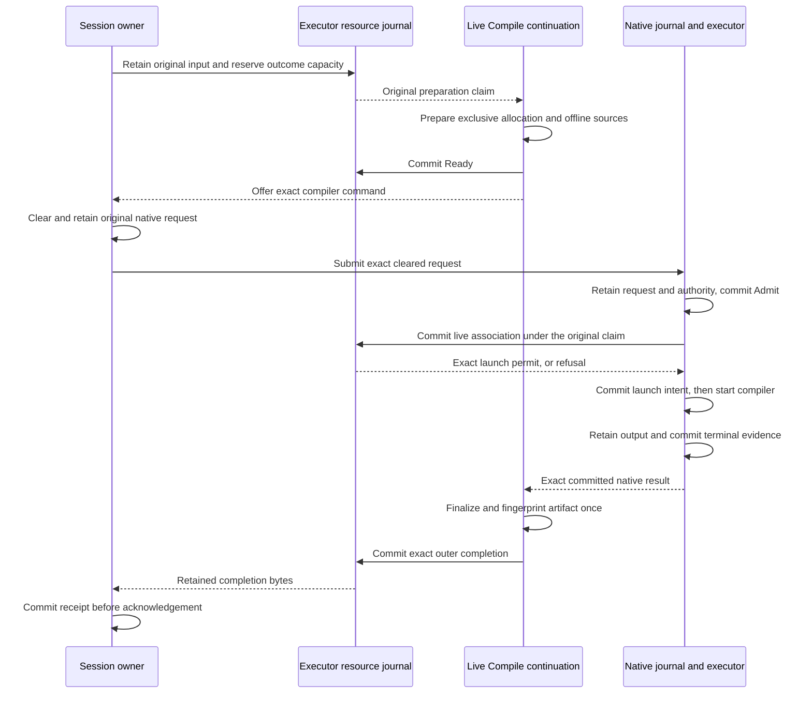

# Remote compilation and retained outcomes

Remote compilation keeps the source preparation, compiler process and compiled
artifact beside the registered executor workspace. The session owner retains
approval and budget authority. A compiler result names an executor-owned
artifact, so the owner never interprets its location as a local filesystem path.

The components described here implement the storage and validation boundaries in
[protocol 067](../../protocol-change/067-remote-workspace-services.md). The native command admission engine is implemented. The whole Compile service,
server-side command forwarding and shipped remote deployment still require
assembly. The sequence below specifies that assembly's required order;
it does not claim that a separate-host workflow has passed acceptance.

## Three records describe different work

The owner journal retains the original tool, physical service and cleared native
command. Its service key includes the parent tool identity, complete workspace
scope, physical operation and step, service UUID, and input and enrollment
digests. The command reference retains that full service key. An operation number
alone cannot distinguish two physical services under different parents.

The executor resource journal retains the original Compile input, preparation
state and outer completion. Its separate native journal retains the exact
compiler request, admission, ordered output and terminal evidence. Those records
answer different questions: preparing files does not establish native admission,
and a compiler exit does not establish a finalized artifact.

| Record | What its commit establishes |
|---|---|
| Owner command reservation | The original native UUID and exact cleared request are retained before transmission. |
| Resource Ready | The recorded allocation and preparation receipt belong to the original service. |
| Native Admit | The native journal has admitted the exact compiler request. |
| Resource association | The retained native request matches this service's full identity and compiler template. |
| Native terminal commit | The native reducer has accepted the retained terminal payload as evidence. |
| Resource completion | Exact outer result bytes and their digest can be recovered without finalizing again. |

The [custody guide](remote-custody.md) explains owner reservations and tool-result
recovery. `executor/remote/resource_journal` owns the executor records above.
Its named SQL queries are compiled by Parrot/sqlc; schema installation and
transaction control remain explicit in the actor.

## Preparation grants one live continuation

The original service calls `admit_preparation` to insert its input and enter
Preparing in one SQLite transaction. That transaction reserves room for the
input, preparation receipt, native association and completion. Only a successful
commit of this new row returns `FreshClaim`. The opaque claim belongs to the
original journal endpoint and original input.

Every matching existing row returns `Retained`, including Reserved. This rule
matters when the process stops between reservation and preparation: reopening
the database must not turn an old reservation into a new live continuation.
The earlier, separate reserve/claim APIs remain available to their component
callers; the whole Compile service must use atomic first admission.

`fence_preparation` orders cancellation against that first admission. If the
input is absent, it reserves capacity and inserts an Unknown row in the same
transaction. If the row is Reserved, Preparing or Ready, it changes the phase
to Unknown while preserving any Ready bytes and native association. A late
admission then reads history. If admission won first, its late Ready or native
association still has to pass the committed fence.

Both operations compare the complete immutable input under the writer lock.
An existing row with a different body or service identity returns a conflict.
For absent input in a sealed scope, cancellation can return `ScopeFenced`
after excluding an address collision. That response confirms the scope's seal;
it does not invent an input row or claim that an earlier process has stopped.

A failed or ambiguous commit returns `Uncertain` and fences the journal
endpoint. No live claim or successful cancellation acknowledgement escapes
that path. The caller must preserve the uncertainty instead of retrying as
new work.

The physical service must exclusively create the allocation, prepare fixed
sources and the offline seed, and then commit Ready. An existing allocation is a
collision; it cannot be reused or deleted to make a retry work. The shared
compiler helpers perform preparation and finalization, while the live service
must enforce this ordering and the original deadline.

The native service now calls the live association boundary between native
admission and launch intent. Its opaque `CommandContext` holds either the original
preparation claim or historical input. The live constructor derives that input
from the claim and checks the complete service key and concrete native journal
endpoint. It cannot combine a peer-selected row with another service's claim.

Only a live context can request a challenge or submit a compiler command. Its
challenge ticket includes the complete command reference, so another route cannot
reuse the nonce. The service refuses session-lifetime compiler commands before
authorization. After the resource association commits, the service compares the
permit's exact endpoint, reference, native key and digest before continuing to
launch. The existing deadline check still applies after that wait.

Historical contexts can query, cancel, send stdin or acknowledge an already
associated command. Each operation checks the retained reference, key and digest
before applying an effect or returning native evidence. Both duplicate Submit
paths perform the same check. Retained input alone grants none of these controls;
the exact association establishes which native command belongs to the service.

### Cancellation and admission share one transaction order

`associate_live_native` requires the original preparation claim. It first reads
the exact native request, finite authority and committed admission. Those reads
occur outside the resource writer transaction so one actor does not hold a writer
lock while asking another actor for evidence.

The final resource transaction checks the full original input again. The scope
must still be open, preparation must be Ready, and the native association must be
absent. It commits the association before returning an opaque permit bound to the
exact resource endpoint, command reference, native key and request digest.

If cancellation commits first, the association refuses. If association commits
first, cancellation follows the retained native key. The latter ordering can race
process startup; it does not establish that no process ran. The native reducer's
separate launch-intent transition still permits at most one launch.

The permit carries no renewed deadline. The original native continuation must
check elapsed time before launch. Duplicate association, a lost reply or journal
recovery cannot return another permit. Gleam values are copyable, so trusted
assembly must keep the returned permit in that original continuation.

`retained_input` recovers the original bounded data through its complete service
key, including after cancellation, scope sealing or native endpoint loss. It never
reconstructs a preparation claim. This lets recovery compare history while keeping
fresh execution permission unavailable.

## Every native exchange retains its physical service

A compiler command has two identities. Its native key identifies the process
request and retained output. Its `CommandRef` identifies the whole Compile
service that prepared the files. The reference includes the original service
UUID, parent tool, scope, physical step, input digest and enrollment digest.
Keeping both prevents a request from using one service's preparation to control
another service's compiler.

The owner dispatcher represents this distinction with `CommandReserved`. It
carries the exact reference through Challenge, Submit, Query, Stdin, Cancel and
DurableReceipt. A detached cancellation retains the same route even after the
main dispatch worker stops. Ordinary native reservations retain their existing
wire format.

`wire.CommandEnvelope` wraps the canonical reference and existing native
envelope under a closed discriminator. Construction checks scope and physical
operation correspondence. Decoding applies the existing aggregate frame bound
and requires canonical bytes; the wrapper does not enlarge the Prepared limit.
The connection checks the complete returned reference and transport generation
before exposing a native answer. An ordinary native reply cannot satisfy a
command exchange.

The wire checks establish correspondence. The native service separately checks
the exact retained resource association before historical control or returning an
existing command's output. Fresh admission requires the original live claim and
association permit described above.
The current server reader accepts ordinary native envelopes only; enabling the
command route awaits that service assembly. The
[routing review](../review/distributed-physical-command-routing.md) records the
codec, real TLS and dispatcher controls for the owner half.

## Failure preserves what can be proved

A failure during preparation can produce a Before-native completion only while
the original claim still names live Preparing state. The completion transaction
also fences a late Ready commit. After Ready exists, absence of a native
association proves only that the association is absent. A native submission may
already be in flight, so the result must remain uncertain.

A completion after native work requires both retained terminal bytes and the
matching committed native evidence. Retaining the bytes can precede the reducer
commit. Treating those bytes alone as completion would incorrectly close that
window. The live continuation must then finalize the artifact once and retain the
closed outer result before advertising it.

Exact historical association, completion and acknowledgement retries read the
resource journal first. They remain available after loss of the native endpoint,
resource release or scope closure. They do not renew a deadline, re-clear a
command or repeat source preparation. Conflicting bytes fail instead of replacing
the original record.

## Receipts and cleanup are independent

The outer Compile receipt means that the owner retained the exact Compile result.
The native receipt means that the owner retained the compiler's exact native
result. Native retirement requires a separate witness that the scoped native
processes have drained. Resource cleanup records what happened to the allocation.
No one of these facts substitutes for the others.

The resource database uses format 2 and reserves future result capacity before
effects. It refuses an older format before querying new columns. Header queries
check scalar types, lengths and reserved capacity before transferring bodies;
body queries retain their own guards. These checks bound what a corrupt row can
materialize as well as what a valid request can reserve.

## Verification and integration boundary

The [custody review](../review/distributed-compile-outcome-custody.md) records real
SQLite tests, native admission and terminal evidence, independent review findings
and targeted mutations. The [P model review](../review/distributed-compile-custody-model.md)
records bounded checks of preparation, settlement and receipt ordering. Those
model checks do not establish database crash atomicity or operating-system
behavior.

The [live-admission review](../review/distributed-live-compile-admission.md)
records the resource transaction controls, complete-identity mutations and
independent executor gate. The [first-admission review](../review/distributed-compile-first-admission.md)
records the atomic insertion and cancellation controls, including independent
SQLite opens and commit failures. The [native-command review](../review/distributed-native-command-admission.md)
records the next boundary: actual compiler output, cross-command control refusal,
resource fencing before native launch and exact historical recovery. The native
service API is implemented, while its listener and whole-service callers remain
the next assembly work.

Production acceptance still requires the live Compile/Launch services, exact
command routing, executor registration and ordinary tool consumers. The final
test must run the owner and executor on separate hosts with the workspace absent
from the owner's disk, including cancellation, restart and lost replies.
