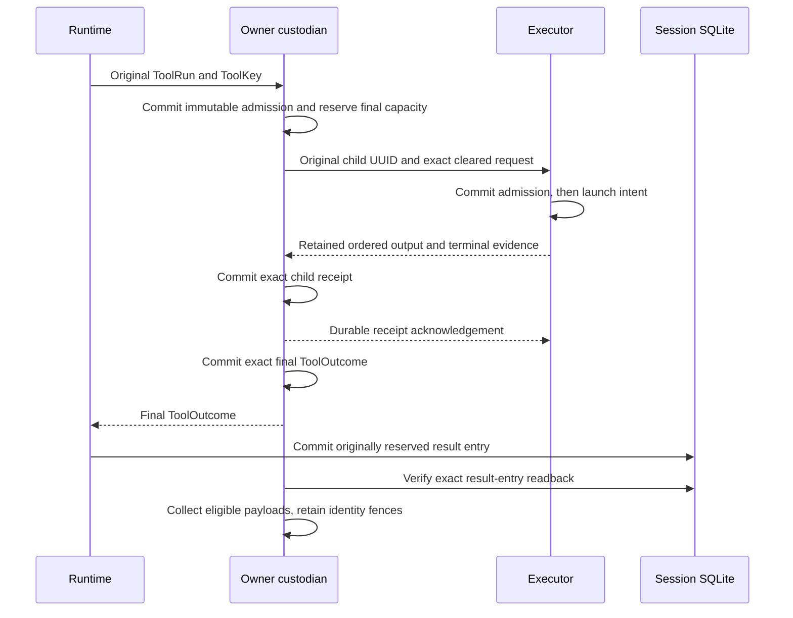

# Remote custody and recovery

Remote execution can finish even when its caller loses the connection. Loom
therefore keeps execution identity and evidence outside the lifetime of that
connection. The owner retains the exact request and final tool report; the
executor retains admission, native custody and result evidence. Each side
acknowledges only what it has committed locally.

These are implementation boundaries for [issue #697](https://github.com/Roasbeef/loom/issues/697)
and [protocol 067](../../protocol-change/067-remote-workspace-services.md).
The runtime recovery hook and owner custodian exist. The shipped daemon still
needs the registered-workspace assembly and two-host acceptance tests before
this becomes a usable remote deployment. Nothing here grants automatic
failover or permission to repeat uncertain work.

## Identity precedes the connection

A `core/remote_tool.ToolKey` contains the durable session, operation, step,
source tool index, digest of the effective arguments, and reserved result
entry. The runtime supplies those coordinates. The adapter computes SHA-256
over canonical JSON argument bytes; it does not hash a rendered prompt or a
transport frame to invent a tool identity.

The journal lookup address excludes the argument digest and result entry.
That distinction matters: a retry with changed arguments must find the old
row and conflict. If changed content produced another address, it could look
like permission to execute a new mutation.

Child origins name a compile, launch or numbered capability invocation under
that tool. A system service has its own explicit origin. The child reservation
stores a UUIDv7 and exact outgoing request before any connection can send it.
A reconnect reads that UUID instead of allocating a replacement. Physical
build phases and detached jobs may have different broker coordinates; the
owner must validate and retain their relationship to the original ToolKey.

## Two stores, different obligations

The owner journal is a separate per-session SQLite database. It does not
change the conversation schema. `storage/owner_custody` uses named queries
compiled by Parrot/sqlc, while `client/remote/custodian` owns the connection in
one supervised weft actor. Only bounded, typed requests reach that actor.

A child process result is not the tool's final report. A code-mode program
can run several children and construct its report afterward. If the owner
crashes between those steps, recovery keeps the child evidence and reports
an unknown final outcome. It never reruns the program to reconstruct a report.

The executor has another obligation: native retirement. A terminal process
result or closed socket does not prove that every descendant has retired.
Executor collection requires both its retirement witness and the owner's
receipt of the exact result. The owner's session-result readback satisfies a
different handoff and cannot substitute for that witness.

## A lost callback does not grant another run

`ToolSurface.recover` runs on an effect before the runtime applies its old
orphan policy. It receives the original effective arguments and reserved result
entry, with no replay grants. Its result is one of four cases:

| Recovery evidence | Runtime action |
|---|---|
| Unmanaged local tool | Apply the existing local orphan/replay policy. |
| Exact recovered ToolOutcome | Settle through the normal durable result path. |
| Pending reconciliation | Wait for completion or cancellation without model polling. |
| Unknown outcome | Settle truthfully while the custodian retains evidence. |

The production custodian wrapper currently returns exact final or unknown
for managed recovery. It does not advertise a pending observer service.
Missing, conflicting, unavailable or child-only evidence cannot become an
unmanaged local fallback.

The custodian runs admitted tool bodies in bounded weft tasks. A live callback
can disappear while its task completes; the custodian commits the result
before answering the caller's ticket. Every fresh reservation also commits
`run_custody = 'unreleased'` before spawning. Only the same live incarnation's
exact final-outcome commit followed by weft `AllDelivered` can discharge it.
A worker crash, lost run, missing outcome, failed outcome or discharge COMMIT,
or consumer `fatal_fence` leaves custody unreleased. The fatal disposition is
sticky even if that worker later returns an ordinary exact ToolOutcome.

The runner receives a private handle pinned to the admitting actor's original
Subject/PID, and its weft run watches that owner's death. External admission and
historical readback continue through the reclaimable registry handle. The pinned
handle prevents an old worker from resolving a replacement owner during the
cancellation race. A replacement owner probes the indexed unreleased marker
before opening fresh admission; any outstanding run makes it recovery-only.
Exact outcome and late child receipt readback remain available there.

Restarting the custodian never starts a retained body again. Its atomic `Fresh`
admission result is the only path to a new body; an idempotent `Retained` result is evidence, not dispatch authority.

Cancellation also has a durable meaning. An origin can be cancelled before
its child UUID has been allocated. That row retains a cancellation fence with
no fabricated UUID; later reservation refuses it. If cancellation follows
reservation, the row keeps its original UUID and request for reconciliation.
At the runtime, a pending recovery under a durable cancellation marker settles
as unknown instead of creating a new observer after the abort sweep.

## Capacity is reserved before effects

The owner journal persists its row, byte and payload ceilings. Admission
reserves the full allowance for the future final or child receipt before work
becomes sendable. Header queries validate types, lengths and that full unused
allowance before reading payloads or accepting another terminal write.

The hard payload ceiling is 2 MiB so one child receipt can hold bounded output
and its terminal bytes. The final ToolOutcome codec has a separate 256 KiB
limit. The database has a 256 MiB accounting ceiling. Collected identity fences
still consume capacity; a full journal refuses new admission rather than
forgetting an old request and making it executable again.

The custodian admits at most four active tasks. That cap and bounded asks do
not bound an OTP mailbox. Daemon assembly must also bound concurrent callers.
The owner journal format is version 4. The remote deployment is unshipped;
prior formats are intentionally refused because they contain no run discharge
proof. They must be preserved rather than migrated to `Released`. Run custody
is independent of retained/frozen collection state. Collection requires
`Released` as well as exact reserved-session result readback, so collection
cannot erase the final bytes between answering a ticket and live drain.
Frozen rows retain the released marker. These observations prove owner-run
discharge, not native retirement or resource cleanup.

## Physical service and command custody

The [remote compilation guide](remote-compilation.md) follows the executor's
preparation claim, native association and retained Compile completion through
their separate storage boundaries.

A compiler or satellite service owns more than a native command. Its original
ServiceKey retains the parent ToolKey, full workspace scope, physical step,
service UUID and input, registration and contract digests. The physical
operation must agree with the parent. A closed CommandRef pairs Compile with
CompileCommand, or Launch with SatelliteCommand; offers allocate no new UUID.

The owner retains the complete service request in its child row before storing
an immutable command offer. Native reservation then verifies the original
service and exact offer in one transaction before retaining a complete cleared
request. A duplicate returns the original native UUID and bytes. Changed
content conflicts; a partially prepared native request has no storage slot.

Each offer reserves its full bounded payload allowance and participates in
persistent global count and byte limits. The two fixed service roles permit
at most two offers per parent. The existing 64 actual-child limit remains;
outer service and native command each consume a child row. Queries check bounded
headers and reservations before transferring payloads. All row operations use
named SQL and generated Parrot/sqlc bindings.

Cancelling a service atomically fences its outer row, offers and any allocated
native child. A late native receipt can still be retained under its original
identity. Neither cancellation nor that receipt proves physical cleanup.

### Recover an offer from its native origin

The broker receives a managed native origin before it has the complete command
reference. `command_offer_for_origin` uses the existing unique native-origin
index to recover that reference and its exact offer. This lookup does not scan
the journal or allocate a native UUID.

The index address identifies a candidate; it does not establish complete
identity. The reader first checks bounded scalar headers and the reserved
capacity. It then loads the bounded bodies and verifies the original parent,
canonical command reference and retained service. A changed parent digest that
shares the same logical address therefore conflicts with the saved evidence.

Cancelled offers remain readable because recovery still needs their original
identity. Frozen evidence and collected parents refuse. The lookup grants no
clearance, so the existing live reservation transaction still fences a cancelled
service. This separation lets recovery inspect what happened without making the
command executable again.

Both offer-header queries project a non-integer reservation as an invalid scalar
sentinel. SQLite's non-strict constraint can accept a BLOB in that column; rejecting
it in the Gleam decoder would transfer the BLOB first. The SQL projection keeps
that corruption check ahead of body materialization.

Collection is deliberately conservative for these physical services. Any
Compile or Launch child row, or any offer, prevents parent collection even
after exact final-result readback. This includes a service that failed before
producing an offer and a final unknown outcome. A later whole-service recovery
handoff must establish which evidence may be released; a final tool report
alone cannot establish it.

These APIs preserve exact bounded bytes. Trusted assembly must still validate
the command template, complete SandboxPolicy, cleared native envelope and
service-specific completion associations. Storage opacity does not establish
those semantic checks or authorize execution.

## The original Broker reserves a compiler command

`dispatch_binding.with_commands` extends the existing dispatcher configuration
with a closed CompileCommand path. It retains the same owner custodian,
endpoint, clock, preparation callback and UUID allocator. Ordinary native
origins keep their existing path; SatelliteCommand explicitly refuses until
Launch assembly exists.

The Broker first clears a real Dispatch. The command binding then reads its
indexed offer and complete retained service input. It checks canonical bytes,
input and offer digests, original enrollment, physical operation and step, and
the complete derived compiler template. Reconstructing the expected allocation
checks its literal identity; it does not prepare files or prove executor Ready.
That evidence belongs to the whole Compile consumer.

Only after those checks does the binding call its original preparation callback.
The returned Prepared must preserve the actual cleared request and step. Its
argv, environment and cwd must match the offer exactly, and its effective policy
must stay within the expected requirements. Protected roots and environment
allowlists are compared as sets; the binding never reorders the outgoing request
or substitutes a newly constructed policy.

The atomic owner transaction retains the complete request and returns the
original UUID on an exact retry. The binding uses that returned identity to
construct CommandReserved. It does not read the child first and then decide
whether to create a replacement. Recovery reads retained evidence through
separate APIs and cannot obtain a fresh sendable reservation from this callback.

Receipt and cancellation also resolve the full reference through the original
origin. Receipt checks the retained UUID and Prepared digest, then commits the
ordered output chunks and terminal before the dispatcher sends DurableReceipt.
Cancellation fences the complete service, its offer and any allocated native
child. A missing command lookup cannot fall back to ordinary native cancellation;
the binding refuses and invokes the existing fatal fence when custody is lost.
Cancellation before an offer exists belongs to the outer consumer, which already
holds the complete ServiceKey.

The new path makes three bounded custodian asks during native reservation. The
whole Compile consumer must include those pending waits in its original budget.
The startup allowance is `44000 + clearance_wait_ms + 2 * exchange_wait_ms`,
or 59000 ms when both configurable waits are 5000 ms. The separate native
challenge window remains 1000 ms. These are successful-call allowances, not hard
real-time guarantees; an expired ask does not prove that no effect occurred.

The [owner-binding review](../review/distributed-owner-command-binding.md)
records real Broker controls and the limits of that evidence. Whole-service
assembly still owns original PhaseIdentity construction, actual Ready validation
and native-ceiling ordering before clearance.

## TLS BEAM carries custody without replacing it

The owner resolves its executor Peer from the original successful administrative
boot. `beam_endpoint.Config` retains the exact labels, complete scope, generation
and finite exchange wait. The same fixed endpoint carries native, workspace,
whole Compile and physical command traffic. Its local registrations bind
concrete actors; a network message cannot select an arbitrary function or create
an enrollment. A trusted BEAM member has full runtime privileges, while jailed
satellites remain outside that membership.

The endpoint's sixteen registration slots share four data and two control
credits. Each credit owns one actual service reply subject. A successful send
means only distribution accepted the message. Caller loss and elapsed waits
cannot prove that a queued reservation, receipt or cancellation was retracted.
After service handoff, the actual service answer and `AllDelivered` must both
arrive before credit reuse. Exact run correlations refuse delayed handoffs from
a previous assignment. Ambiguous answers and lost drains retire capacity.

This transport preserves the existing canonical request and receipt bytes.
Native frames use their original bounded codecs; large semantic input and
completion use acknowledged fixed chunks. The transport bounds retained
content and admitted exchanges. It does not impose a global memory ceiling
on a trusted peer's BEAM mailbox or replace durable journal quotas.

Owner consumers use the original runner's incarnation-pinned custodian Handle.
`compile_client` supplies the actual `compile.CompileService` adapter within
that already bounded managed body. It reserves complete original service input
before transmission, consumes exact Ready, retains the immutable command offer
and clears through the original session Broker. It creates no independent
actor, Broker or budget. On uncertain live custody it calls the real
`custodian.fatal_fence` on the pinned owner; the durable run-discharge rule also
covers a worker killed before any callback could run.

The dispatcher retains the ordered native receipt before DurableReceipt.
The consumer then checks the complete outer Compile result and corresponding
native receipt, commits the exact outer child receipt and only afterward sends
outer Acknowledge. Cancellation does not invalidate a later exact receipt;
conflicting bytes or digest refuse. Best-effort historical ACK failure leaves
that already committed completion usable. Historical recovery neither challenges
nor submits, clears, prepares, allocates a UUID or renews a deadline.

## Verification and remaining integration

Tests use actual owner and session SQLite files. They cover duplicate and
conflicting admissions, final-report recovery after caller loss, child-only
unknown outcomes, reserved-entry collection, cancellation before reservation,
and malformed persisted reservations. Two runtime cancellation regressions
fail against the pre-fix implementation and pass with the fix.

Independent review found the cancellation wait and reservation-accounting
bugs, which now have regression tests. Component tests and review do not
establish the final remote product. The implemented Compile consumer and
concrete TLS BEAM endpoint bind those
component callbacks, while registered daemon assembly still must select them
under the original supervised custody and enrollment. The two-host fixture must
then prove that ordinary file
tools, Bash, code mode and LSP use a checkout absent from the owner's disk.
