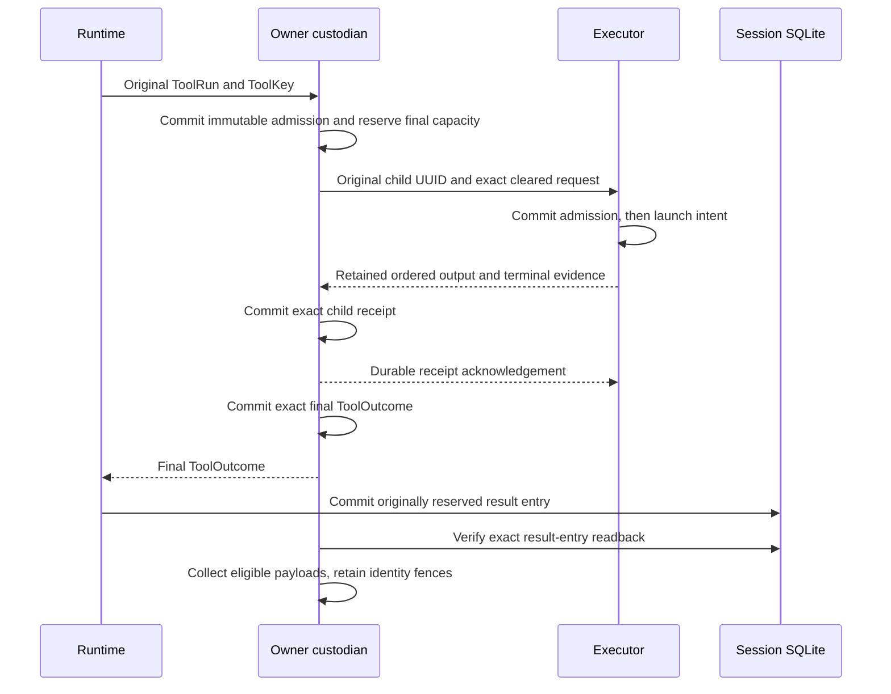

# Remote custody and recovery

Remote execution can finish even when its caller loses the connection. Loom
therefore keeps execution identity and evidence outside the lifetime of that
connection. The owner retains the exact request and final tool report; the
executor retains admission, native custody and result evidence. Each side
acknowledges only what it has committed locally.

These are implementation boundaries for [issue #697](https://github.com/Roasbeef/loom/issues/697)
and [protocol 067](../../protocol-change/067-remote-workspace-services.md).
The runtime recovery hook and owner custodian exist. The shipped daemon still
needs the registered-workspace assembly and two-host acceptance tests before
this becomes a usable remote deployment. Nothing here grants automatic
failover or permission to repeat uncertain work.

## Identity precedes the connection

A `core/remote_tool.ToolKey` contains the durable session, operation, step,
source tool index, digest of the effective arguments, and reserved result
entry. The runtime supplies those coordinates. The adapter computes SHA-256
over canonical JSON argument bytes; it does not hash a rendered prompt or a
transport frame to invent a tool identity.

The journal lookup address excludes the argument digest and result entry.
That distinction matters: a retry with changed arguments must find the old
row and conflict. If changed content produced another address, it could look
like permission to execute a new mutation.

Child origins name a compile, launch or numbered capability invocation under
that tool. A system service has its own explicit origin. The child reservation
stores a UUIDv7 and exact outgoing request before any connection can send it.
A reconnect reads that UUID instead of allocating a replacement. Physical
build phases and detached jobs may have different broker coordinates; the
owner must validate and retain their relationship to the original ToolKey.

## Two stores, different obligations

The owner journal is a separate per-session SQLite database. It does not
change the conversation schema. `storage/owner_custody` uses named queries
compiled by Parrot/sqlc, while `client/remote/custodian` owns the connection in
one supervised weft actor. Only bounded, typed requests reach that actor.

A child process result is not the tool's final report. A code-mode program
can run several children and construct its report afterward. If the owner
crashes between those steps, recovery keeps the child evidence and reports
an unknown final outcome. It never reruns the program to reconstruct a report.

The executor has another obligation: native retirement. A terminal process
result or closed socket does not prove that every descendant has retired.
Executor collection requires both its retirement witness and the owner's
receipt of the exact result. The owner's session-result readback satisfies a
different handoff and cannot substitute for that witness.

## A lost callback does not grant another run

`ToolSurface.recover` runs on an effect before the runtime applies its old
orphan policy. It receives the original effective arguments and reserved result
entry, with no replay grants. Its result is one of four cases:

| Recovery evidence | Runtime action |
|---|---|
| Unmanaged local tool | Apply the existing local orphan/replay policy. |
| Exact recovered ToolOutcome | Settle through the normal durable result path. |
| Pending reconciliation | Wait for completion or cancellation without model polling. |
| Unknown outcome | Settle truthfully while the custodian retains evidence. |

The production custodian wrapper currently returns exact final or unknown
for managed recovery. It does not advertise a pending observer service.
Missing, conflicting, unavailable or child-only evidence cannot become an
unmanaged local fallback.

The custodian runs admitted tool bodies in bounded weft tasks. A live callback
can disappear while its task completes; the custodian commits the result
before answering the caller's ticket. Restarting the custodian never starts a
retained body again. Its atomic `Fresh` admission result is the only path to
a new body; an idempotent `Retained` result is evidence, not dispatch authority.

Cancellation also has a durable meaning. An origin can be cancelled before
its child UUID has been allocated. That row retains a cancellation fence with
no fabricated UUID; later reservation refuses it. If cancellation follows
reservation, the row keeps its original UUID and request for reconciliation.
At the runtime, a pending recovery under a durable cancellation marker settles
as unknown instead of creating a new observer after the abort sweep.

## Capacity is reserved before effects

The owner journal persists its row, byte and payload ceilings. Admission
reserves the full allowance for the future final or child receipt before work
becomes sendable. Header queries validate types, lengths and that full unused
allowance before reading payloads or accepting another terminal write.

The hard payload ceiling is 2 MiB so one child receipt can hold bounded output
and its terminal bytes. The final ToolOutcome codec has a separate 256 KiB
limit. The database has a 256 MiB accounting ceiling. Collected identity fences
still consume capacity; a full journal refuses new admission rather than
forgetting an old request and making it executable again.

The custodian admits at most four active tasks. That cap and bounded asks do
not bound an OTP mailbox. Daemon assembly must also bound concurrent callers.
The format is version 3. A transactional migration validates version-2
metadata, configured limits and existing reservations before adding the offer
table. Valid cancelled or collected child fences can have no UUID. Incompatible
version-1 evidence is refused and must be preserved rather than replaced.

## Physical service and command custody

The [remote compilation guide](remote-compilation.md) follows the executor's
preparation claim, native association and retained Compile completion through
their separate storage boundaries.

A compiler or satellite service owns more than a native command. Its original
ServiceKey retains the parent ToolKey, full workspace scope, physical step,
service UUID and input, registration and contract digests. The physical
operation must agree with the parent. A closed CommandRef pairs Compile with
CompileCommand, or Launch with SatelliteCommand; offers allocate no new UUID.

The owner retains the complete service request in its child row before storing
an immutable command offer. Native reservation then verifies the original
service and exact offer in one transaction before retaining a complete cleared
request. A duplicate returns the original native UUID and bytes. Changed
content conflicts; a partially prepared native request has no storage slot.

Each offer reserves its full bounded payload allowance and participates in
persistent global count and byte limits. The two fixed service roles permit
at most two offers per parent. The existing 64 actual-child limit remains;
outer service and native command each consume a child row. Queries check bounded
headers and reservations before transferring payloads. All row operations use
named SQL and generated Parrot/sqlc bindings.

Cancelling a service atomically fences its outer row, offers and any allocated
native child. A late native receipt can still be retained under its original
identity. Neither cancellation nor that receipt proves physical cleanup.

Collection is deliberately conservative for these physical services. Any
Compile or Launch child row, or any offer, prevents parent collection even
after exact final-result readback. This includes a service that failed before
producing an offer and a final unknown outcome. A later whole-service recovery
handoff must establish which evidence may be released; a final tool report
alone cannot establish it.

These APIs preserve exact bounded bytes. Trusted assembly must still validate
the command template, complete SandboxPolicy, cleared native envelope and
service-specific completion associations. Storage opacity does not establish
those semantic checks or authorize execution.

## Verification and remaining integration

Tests use actual owner and session SQLite files. They cover duplicate and
conflicting admissions, final-report recovery after caller loss, child-only
unknown outcomes, reserved-entry collection, cancellation before reservation,
and malformed persisted reservations. Two runtime cancellation regressions
fail against the pre-fix implementation and pass with the fix.

Independent review found the cancellation wait and reservation-accounting
bugs, which now have regression tests. Component tests and review do not
establish the final remote product. Remaining assembly must bind configured
scope, supervised custody, durable child identity, cleared materialization and
receipt callbacks. The two-host fixture must then prove that ordinary file
tools, Bash, code mode and LSP use a checkout absent from the owner's disk.
