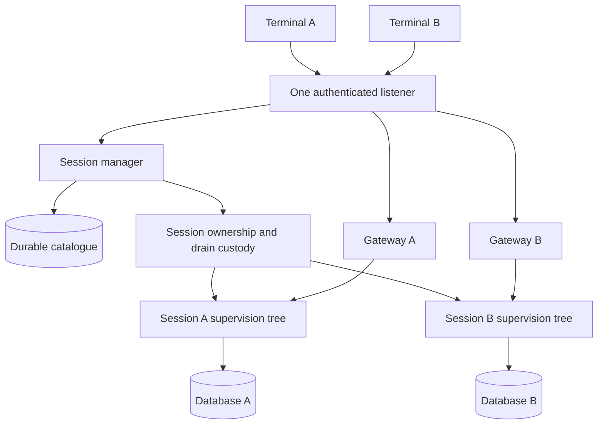

# Sessions in one daemon

**Status: implementation target, not yet shipped.** Baseline: `f019322`,
2026-09-04. The owner selected one daemon as the new default, with no
legacy client/server compatibility path. [Client](client.md) describes
the baseline implementation; this page describes the replacement.

The reader is an implementer tracing ownership from terminal startup to
session shutdown. [The design note](../design-notes/single-daemon.md)
records the alternatives and detailed failure analysis.

## Implemented assembly boundary

`client/serve.Instance` groups one session's database runtime, gateway,
broker, helper pool and composition services. `open_instance` starts that
assembly without a listener, token directory or token file. `close_instance`
closes only that assembly. `Booted` adds the current single-session listener;
the shipped launcher and wire protocol have not changed yet.

Session services and writer subscriptions use reclaimable Weft reference
addresses. A replacement service binds the same address; a hint sent while
it is absent is lost without failing the durable commit. Each instance owns
its namespace and retires it on close.

`client/serve_test` opens two instances in one VM and completes a turn on
one after closing the other. It also measures ten fresh SQLite session
open/execute/close cycles with real helpers and no warmed atom growth.
These checks establish the assembly boundary, not daemon recovery: the
existing host still lacks partial-boot and owner-death custody, and close
does not yet return the drain verdict needed to release a reservation.

## One process across workspaces

One `loomd` process runs one BEAM VM and hosts the user's active sessions
across workspaces. Each session has one gateway, one supervision tree,
and one conversation database. Several terminals can attach to the same
session, and one terminal can switch between sessions without stopping
the work it leaves behind. See [multiplayer](multiplayer.md) for the
authority and ordering of those attachments.

The default state directory stores daemon metadata and saved sessions.
It does not partition projects into separate servers. A separately
configured state directory is an explicit isolated deployment, not a
normal consequence of changing the terminal's working directory.

## Ownership

The daemon owns discovery, authentication, the listener, the catalogue,
and admission against global resource limits. The session manager handles
small lifecycle messages. It does not run database opens, snapshot scans,
or external-process drains inside its request handler.

A session owner retains its runtime, gateway, effect services, and cleanup
handles. Cleanup custody must survive that owner's death. A replacement
owner cannot execute until the predecessor's effects have drained and its
writer authority has been released. A supervisor detecting a dead process
is not evidence that its external effects have stopped.

The session remains the unit of execution authority and cancellation.
Generated programs run in kernel-enforced sandboxes outside the harness
VM. They receive session-specific broker capabilities, never the daemon
credential. Daemon files and other registered conversation databases must
be protected even when workspaces overlap.

## Discovery is not execution

The catalogue assigns saved sessions stable identities and records their
database paths, workspaces, configuration references, and lifecycle state.
Listing or previewing a session reads metadata without opening its runtime:
the current runtime open path can resume durable unfinished operations.

Concurrent requests to open the same session converge on one owner.
Opening unrelated sessions may proceed concurrently under admission
limits. Every open gets a fresh incarnation and writer-owner identity so
late callbacks cannot affect a replacement runtime.

Closing a client detaches one connection. Stopping a session drains its
work and preserves its database. Shutting down the daemon drains every
session. A caller's timeout stops its wait, not the server's cleanup, and
cannot release a capacity reservation whose work may still be alive.

After a whole-daemon restart, restore the catalogue and leave every
session closed. Open a session lazily when an authorized operator selects
it or explicitly requests an open. Catalogue listing and metadata preview
never open a session, run its schedules, or resume unfinished operations.
Automatic transport reconnect does not reopen a session across daemon
epochs; the client requires an explicit selection or open request.

Lazy opening uses the same admission, ownership, and cleanup checks as
any other open. Concurrent requests for one session share one opening
runtime. Once opened, the session uses its existing durable recovery
semantics, which can resume unfinished work. Sessions that were active
before the restart remain closed until requested.

## Client startup and routing

A terminal first discovers and authenticates the existing daemon. Only
when no valid daemon is available does it arbitrate startup on the
canonical state root's kernel lock. Discovery must work while the live
daemon holds that lifetime lock. A listener accepting TCP is not ready;
the authenticated daemon identity and protocol handshake establish reuse.

The control API lists and manages sessions. Session sockets route to one
gateway and remain bound to that session and incarnation. The manager does
not forward each token, stream fragment, or conversation write. Catalogue
invalidation and conversation catch-up have separate revisions because
they describe different stores.

Selecting another session keeps the current view usable until the new
connection authenticates and supplies its initial snapshot. Each attempt
owns its inbox and deadline. Old messages and failed attempts cannot
change the adopted view. Reconnect reconciles durable state and never
automatically resends a mutation with an unknown outcome.

## Containment and bounds

Session supervision contains ordinary actor failures. An OOM, native
library fault, or VM crash can affect every session; one VM is not an
OS-level resource boundary between sessions. Per-session worker VMs are
not part of this implementation.

Long-lived hosting requires reclaimable runtime addresses: dynamically
allocated atoms survive session close. Audit node-global state before
reusing session assembly. Install VM-wide handlers once, carry workspace
and environment as session values, and coordinate shared search/memory
stores explicitly instead of deriving them from daemon startup cwd.

Admission must bound active sessions, helper reservations, inbound frames,
queued work, snapshots, and slow-client output. A blocked session must not
prevent another session from accepting a prompt or the control API from
reporting status. Limits need measured defaults and executable tests.

## Verification required before changing the default

Two terminals starting in different workspaces must converge on one daemon.
Two sessions must execute concurrently with separate databases and no
cross-delivery. Two clients on one session must observe the same durable
event order while a third client uses another session.

The drive must also cover concurrent open, failed replacement, client
detach, owner death, listener restart, blocked drain, and whole-daemon
restart. Repeated open/close cycles must stabilize atom and resource counts.
These are release gates, not results established by this page.

For the restart case, save two active sessions, restart the daemon, and
list them. Assert that both records survive while no session runtime,
provider call, tool execution, or schedule starts. Then select one session
from two clients concurrently: exactly one runtime opens, both clients
attach to it, and the other session remains closed. A denied open request
must leave both sessions closed when neither was already resident.

## Implemented runtime prerequisite

The runtime uses Weft v0.4.3 reference addresses for strand drivers and for
the writer, registry and drain ledger. It allocates no dynamic process names.
The two strand factories are unnamed and publish their current handles in the
registry. Runtime close and root death reclaim service routing; the retained
direct drain-ledger subject still governs whether the writer lease can be
released.

The runtime tests execute and close 50 sessions after warming the VM, assert
zero atom growth, and check that old roots, drivers, namespaces and addresses
are gone. A blocked-provider test kills the root and observes namespace death
before close; close must still wait for the provider to drain before another
writer can acquire the database. These tests establish runtime prerequisites,
not the daemon or multiplayer experience above. Client service addressing and
cleanup custody across owner death remain to be implemented.
