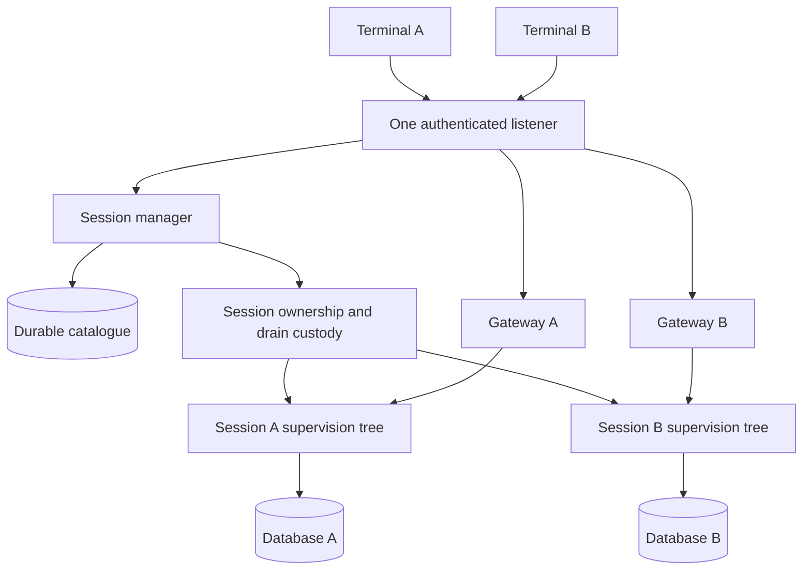

# Sessions in one daemon

**Status: implemented on an unmerged branch; acceptance remains
incomplete.** The default entrypoint now runs one managed daemon, with no
legacy client/server compatibility path. [Client](client.md) describes the
current startup and protocol, and labels the historical `f019322` baseline
separately. The focused tests below establish specific boundaries, not a
completed multi-session release gate.

One `loomd` process hosts all of a user's active sessions, across
workspaces. This doc traces ownership from terminal startup to session
shutdown, for an implementer. The main pieces are:

- the **daemon root**, which owns discovery, authentication, the one
  listener, the catalogue, and admission against global limits;
- the **catalogue**, a durable SQLite database of session metadata
  (identity, database path, workspace, domain, configuration reference,
  lifecycle state), readable without opening any session;
- the **session manager and registry**, which serialize catalogue access,
  bound the number of live sessions, and hold cleanup custody for each one;
- the per-session **instance**: one supervision tree from the
  [orchestration plane](orchestration.md), one gateway, one conversation
  database, and the broker and helper pool behind its effects;
- the per-**domain** shared resources (history and memory maintenance),
  where a domain is the memory and search scope the catalogue maps each
  session to.

The central rule is that discovery is not execution: listing a session
never starts its runtime, and a restart leaves every session closed until
someone opens it. The second rule is that cleanup custody outlives any one
process, so a replacement never runs while its predecessor's external
effects may still be alive. [Multiplayer](multiplayer.md) covers several
terminals attached to one session. [The design note](../design-notes/single-daemon.md)
records the alternatives and the detailed failure analysis.

## One process across workspaces

One `loomd` process runs one BEAM VM and hosts the user's active sessions
across workspaces. Each session has one gateway, one supervision tree, and
one conversation database. Several terminals can attach to the same
session, and one terminal can switch between sessions without stopping the
work it leaves behind. See [multiplayer](multiplayer.md) for the authority
and ordering of those attachments.

The default state directory stores daemon metadata and saved sessions. It
does not partition projects into separate servers. A separately configured
state directory is an explicit isolated deployment, not a normal
consequence of changing the terminal's working directory.

## Ownership

The daemon owns discovery, authentication, the listener, the catalogue, and
admission against global resource limits. The session manager handles only
small lifecycle messages. It does not run database opens, snapshot scans,
or external-process drains inside its request handler.

A session owner retains its runtime, gateway, effect services, and cleanup
handles. Cleanup custody must survive that owner's death. A replacement
owner cannot execute until the predecessor's effects have drained and its
writer authority has been released. A supervisor detecting a dead process
is not evidence that the process's external effects have stopped.

The session remains the unit of execution authority and cancellation.
Generated programs run in kernel-enforced sandboxes outside the harness VM.
They receive session-specific broker capabilities, never the daemon
credential. Daemon files and other registered conversation databases must
be protected even when workspaces overlap.

## Discovery is not execution

The catalogue assigns saved sessions stable identities and records their
database paths, workspaces, configuration references, and lifecycle state.
Listing or previewing a session reads metadata without opening its runtime.
The separation matters because the runtime open path can resume durable
unfinished operations.

Concurrent requests to open the same session converge on one owner.
Opening unrelated sessions may proceed concurrently under admission limits.
Every open gets a fresh incarnation and writer-owner identity, so late
callbacks cannot affect a replacement runtime.

Three kinds of stop differ in scope:

- Closing a client detaches one connection.
- Stopping a session drains its work and preserves its database.
- Shutting down the daemon drains every session.

A caller's timeout stops its wait, not the server's cleanup. It cannot
release a capacity reservation whose work may still be alive.

Stopping a session is not the same as aborting its operation. Runtime close
retires the tree and drains its effects at a durable commit boundary,
without writing a cancelled or terminal operation state, so an explicit
later open can resume the admitted operation. For an interrupted provider
request, recovery records the unknown outcome before continuing; a second
HTTP request does not imply a second user admission. The client still must
not resend a mutation whose acknowledgement was lost. The two
responsibilities are separate: the runtime recovers durable intent, while
the terminal preserves uncertainty about whether its command was admitted.

Schedules follow the same residency boundary. `wake = true` wakes an idle
strand inside a resident runtime; it does not open a Saved session (one
recorded in the catalogue with no runtime). An overdue operator-configured
one-shot is considered when an explicit open creates its scanner. The
scanner persists its fired marker, so another stop/open does not admit that
occurrence again. The shipped schedule fixture checks that a peer session
can progress while the Saved session's cut and absent fired marker remain
unchanged. It then compares the exact durable marker and message records
after the first firing and after another reopen.

After a whole-daemon restart, the daemon restores the catalogue and leaves
every session closed. A session opens lazily, when an authorized operator
selects it or explicitly requests an open. Catalogue listing and metadata
preview never open a session, run its schedules, or resume unfinished
operations. Automatic transport reconnect does not reopen a session across
daemon epochs; the client requires an explicit selection or open request.

Lazy opening uses the same admission, ownership, and cleanup checks as any
other open. Concurrent requests for one session share one opening runtime.
Once opened, the session uses its existing durable recovery semantics,
which can resume unfinished work. Sessions that were active before the
restart remain closed until requested.

### Reopening after an unclean exit

A SIGKILL runs no cleanup, so the next daemon finds state that no orderly
shutdown would have left. Three cases matter, and each has a distinct
answer.

**The writer lease survives.** A resident session's lease survives in its
own database, with the expiry its dead writer last renewed: up to the full
sixty-second TTL past the kill. The replacement's open is therefore refused
by its own predecessor. The refusal is deliberate. An unexpired lease is
the only evidence the single-writer rule has, the lease row does not record
whether the OS process died, and stealing on a guess risks two writers on
one conversation. The refusal clears itself when the expiry passes, so the
expiry instant is all the operator needs, and it is what the daemon
records: `daemon.session_start_failed` carries `class` `lease_held` with
`lease_expires_at_ms`. Only the class and that instant enter the record;
the reason string can name the session's own path and stays out of the
log.

**An incomplete creation survives.** This is an identity reserved in the
catalogue whose database was never established. It survives the restart as
`protocol-change/015` requires, and only a `sessions.create` retry under
its original request key can finish it. It has no runtime slot either, so
reading liveness alone would report it as `saved` and invite a selection
that the registry then refuses with `not_initialized`. Listing instead
joins the durable state with the live one and renders it `reserved`. The
terminal declines to offer it for opening and says it needs a create retry.

**A failed open is not a stale one.** An open whose builder returns an
error has its slot deleted as soon as ordered cleanup drains, usually
before the requesting terminal's first `operations.get` poll. The registry
therefore stores the operation of the most recent failed build per session.
That record is capped at the same limit that bounds live slots and cleared
when the session opens again. The poll is then answered `start_failed`
rather than `stale_operation`, which would have claimed that a replacement
overtook a request that never started.

Nothing here deletes operator data. The `<session>.db.tmp` directory beside
each database is the session's own scratch directory, made by assembly on
every open. A stranded one is harmless and is not swept.

## Client startup and routing

A terminal first discovers and authenticates the existing daemon. A failed
connection does not authorize replacement: the launcher must observe that
the recorded native process has departed. A short-lived launch lock
serializes that decision, separately from the daemon's lifetime lock.
Discovery works while the live daemon holds its lifetime lock. A listener
accepting TCP is not yet ready; the authenticated protocol and the daemon
epoch establish reuse.

The control API lists and manages sessions. Session sockets route to one
gateway and remain bound to that session and incarnation. The manager does
not forward each token, stream fragment, or conversation write. Catalogue
invalidation and conversation catch-up have separate revisions because
they describe different stores.

Selecting another session keeps the current view usable until the new
connection authenticates and supplies its initial snapshot. Each attempt
owns its inbox and deadline, so old messages and failed attempts cannot
change the adopted view. A replacement connection reconciles durable state
and never automatically resends a mutation with an unknown outcome.

Current terminal failure handling marks the connection disconnected; it
does not start an automatic reconnect loop. Internal tests and the live
drive verify recovery through explicit session selection, not automatic
reconnection.

If the original control owner has retired, list, open and create reconnect
inside their managed action worker, and the frame loop stays responsive
during the handshake. Each replacement connection belongs to that worker
and closes when the worker finishes or is cancelled. The model keeps the
original route rather than adopting a new background control owner.
Subsequent explicit actions may pay another handshake, but an uncertain
creation is not automatically resent.

### Implemented shared endpoint boundary

`host/endpoint` owns one bounded, private `daemon.endpoint` record beneath
the canonical state root. Its version-one schema names gateway protocol
two. A `Starting` record carries the OS PID, platform birth marker, and
diagnostic start time. `Ready` adds the actual loopback host/port and the
daemon epoch. The record contains no workspace, session database, bearer
credential, or redirectable token path. The fixed credential path is
`owner.token`.

Automatic startup runs in this order:

1. Acquire `launch.lock` and check the existing native fence.
2. Start a paused wrapper, observe its birth identity, and write
   `Starting` before releasing the child.
3. Release `launch.lock` before waiting. The child reacquires that lock to
   adopt its own reservation, so holding it while waiting for the child
   would deadlock startup.

Direct foreground startup writes the same reservation before catalogue or
session acquisition. `daemon.lock` remains the root's separate lifetime
lock.

The daemon requests port zero and publishes the actual selected port only
after retaining its original listener owner. The launcher reads the private
owner token and requires an authenticated `/v2/control` hello with the
exact published epoch. `tui/bootstrap.resolve_daemon` returns that
terminal-owned control connection without creating or opening a session.
The standard conversation UI and `/sessions` selector now use that
connection. Selecting a saved session requests its open, then adopts the
candidate only after its authenticated initial cut validates.

Replacement fails closed. A still-live PID/birth pair or an
identity-observation error never permits replacement after a failed probe,
and malformed endpoint records fail closed. A missing endpoint beside an
existing `catalogue.db` requires the operator to establish that the
previous VM and native children have exited, and to recover the endpoint;
startup neither deletes the catalogue nor guesses that the old owner is
dead. Normal root shutdown retains the record until the original VM
departs. Killing a BEAM root can release its kernel lock while its VM
remains alive, and in that case the native fence still refuses startup.

The focused tests cover the real paused-child handoff, authentication and
epoch refusal, two workspaces reusing one native PID without opening
sessions, and a root KILL followed by a failed probe after lifetime-lock
release. These tests establish bootstrap behavior, not the complete
interactive multiplayer drive.

### What a session's jail may see of the state root

The state root is not masked wholesale from a session's jail, because an
operator has reasons to work in it: the model catalogues live there.
Masking it wholesale was the shipped behaviour, and it was a bug. A session
opened with the state root as its workspace got a profile denying reads
over the jail's own working directory, and every jailed command failed on
`getcwd` before it ran.

`client/serve.state_root_masks` enumerates what stays masked instead. Each
entry was chosen by asking whether a jailed process reading or writing it
could obtain a credential, another session's data, or the daemon's
control. The masked entries are:

- the credential (`owner.token`) and the launcher's bearer tokens
  (`tokens/`);
- every session's database (`sessions/`);
- the catalogue and its WAL family;
- the per-workspace and per-session domain state (`workspaces/`,
  `domains/`);
- the locks (`locks/`, `daemon.lock`, `launch.lock`);
- the endpoint records (`endpoints/`, `daemon.endpoint`), which hold no
  secret but are what a launcher adopts a running daemon by.

The `loom*.toml` catalogues, `extensions/`, `logs/` and `daemon.log` are
left alone. The blob store is masked by the workspace policy itself rather
than by this list.

A workspace that *is* one of those entries, or lies under one, is refused
at boot and at session creation, with an error naming the entry.
`protected` is the policy's only subtractive verb and no grant carves a
hole in one, so such a session would otherwise come up and then fail on
every call.

Confining one session's database from another session's jail is separate,
open work (issue #242). This list covers only the daemon's own secrets.

## Catalogue and ownership components

`storage/catalogue` implements durable creation reservations and saved-file
metadata. Its bounded pages carry a revision, and its unique identity, path
and request-key constraints reject conflicting registrations. Reopening and
listing the catalogue never opens the conversation paths. The production
queries are generated from named SQL through parrot/sqlc, and the schema is
embedded from the same checked-in SQL file used for generation.

Creation retries retrieve the original reservation by request key before
minting an identity or path. `session.ensure_reserved_id` persists that
exact identity and refuses a conflicting file. Workspace defaults are
durable catalogue mappings, validated against the selected registration's
workspace. Reading or changing a default never opens its conversation.

Durable recovery fixtures reopen the catalogue at two points: after a saved
reservation, and after database identity publication but before catalogue
confirmation. Listing does not initialize the runtime. Retrying the
creation key preserves the exact session ID, path and domain, and a held
cleanup witness prevents a second builder from taking writer custody. (A
cleanup witness is the process whose normal exit proves that a session's
or domain's cleanup finished.) These controlled builder and registry
failures do not amount to a whole-VM crash sweep.

`client/daemon/manager` serializes catalogue access and bounds live
instances, including instances whose cleanup is stopping or blocked.
Creation explicitly admits a reserved record; ordinary open refuses one.
The registry confirms the record only after assembly reports success. Its
outer `client/daemon/lifetime` owns one transitive registry witness, so
completed incarnations do not accumulate in a daemon-wide ownership ledger.

`client/internal/instance_host` prepares a parked builder and keeps it
alive after assembly returns. The registry creates and monitors its Weft
custody scope before releasing assembly. Preparation belongs to the
long-lived registry because creating that scope from a short-lived opening
job would close the session when the job exits.

`client/internal/instance_owner` retains ordered cleanup capabilities
after builder death. A real-SQLite test holds a drain callback past the
close report deadline and verifies that another writer is still refused.
Only after drain and connection retirement can the same session reopen.
Failed cleanup remains blocked.

The default `client/daemon/main` now connects these components to serving
assembly and the authenticated v2 listener. Separate real-SQLite and
native-TUI fixtures exercise that integration. The combined failure,
resource-load, and live multiplayer drive remains an acceptance gate.

Helper retirement now uses the accepted
[shutdown frame](../../protocol-change/014-helper-shutdown-witness.md).
The broker retains the port until native exit and then joins the original
BEAM owner. Its pool inventories a parked helper before starting its native
process, and retains both idle and borrowed helpers until retirement is
confirmed. Serving assembly also prepares MCP clients, publishes their
cleanup capability, and only then starts them. A failed or unconfirmed
native cleanup retains custody rather than counting as a successful
session close. Focused helper and MCP checks do not establish the entire
release drive.

## Implemented assembly boundary

### Durable domain metadata

Session display names are catalogue metadata. New local sessions use the
cached workspace basename and Git branch. `/rename <name>` saves an
owner-authorized override and refreshes the selector; the override and the
pagination revision commit together. Catalogue version 2 migrates existing
registrations without changing their original creation names, so retrying
a creation key still compares the same request. Renaming neither opens nor
restarts the conversation. See
[protocol-change/019](../../protocol-change/019-session-display-names.md).

The catalogue also stores each session's domain mapping.
`workspace_private` preserves the owner's canonical workspace aggregate;
`session_only` assigns fresh memory and index paths for that session. The
record captures the selected maintenance configuration reference at
creation, including an explicit no-config choice. Opening sessions in a
different order cannot replace it. Listing, restoring, or isolating this
metadata does not open conversation, memory, index, or configuration
files.

That reference does not replace each session's runtime configuration. A
session can select different providers and tools while retaining the same
owner-private domain paths; shared maintenance uses the domain's own
configuration binding.

Only saved registrations appear in paged domain source enumeration.
Reserved registrations are excluded before the page limit is applied, so
maintenance cannot create their missing databases by opening them.
Owner-authorized isolation requires no retained runtime slot and copies no
old aggregate files; see [sharing scope](multiplayer.md#sharing-scope) for
its transcript caveat. Runtime resource admission consumes this mapping
through `serve.build_domain` and `serve.assemble_in_domain`. Persisting the
metadata alone would not establish that integration.

### Shared domain resources

The manager owns one history coordinator and optional maintenance cadence
per admitted domain. It captures the immutable domain record before
preparing the host, publishes cleanup before starting effects, and passes
the original shared history capability to each session. Session commit
forwarders notify that owner with the committing session's ID. History
checks the current domain source list before returning ranked results or
reading an exact entry; stored index locators do not authorize reads.

The domain book (the manager's bounded table of domains) has the same
capacity as the session book. Preparing, quiescing, closing, and blocked
domains remain counted, so repeatedly opening distinct session-only
domains cannot grow an unbounded retained map. Sessions waiting for domain
preparation occupy their own session slots. Listing and restoring saved
metadata still start no domain resources.

Closing one session leaves its shared domain available to other resident
sessions. The session's original normal custody witness triggers a
clean-close maintenance notification. Domain retirement then proceeds in
order:

1. After the last dependency retires, the manager quiesces current and
   coalesced maintenance.
2. The manager cancels the domain host.
3. Ordered cleanup retires maintenance before shared history.
4. Only the original domain witness's normal exit releases the domain's
   reservation; failed cleanup retains capacity.

While daemon admission remains open, an explicit session open can revive a
quiescing domain before cancellation starts. The revival resumes
maintenance and replaces the domain's settle subject. A late reply to the
withdrawn fence cannot settle a later close, even if the worker decided
that reply before processing the resume.

Once cancellation has started, an explicit open instead reserves a parked
session and receives `Opening`. The reservation consumes session capacity
while the retiring domain continues to consume domain capacity. Only the
original domain witness's normal exit permits replacement, and the accepted
session builder starts after the replacement services publish. Shutdown
and blocked cleanup cancel parked waiters and never permit revival.

The control `status` response reports `domain_capacity`,
`domain_occupied`, and `domain_blocked` separately from session counts, so
a `Saved` session can coexist with a retained closing domain. Normal daemon
shutdown waits for both books to empty. A later explicit admission creates
a fresh domain owner and may run another cursor-based maintenance pass. The
catalogue remains the source of the domain's paths, configuration, and
authorized source IDs.

The real SQLite assembly test opens two sessions under one original history
owner, closes one while the other retains that owner, and joins the owner
during daemon shutdown. Restart restores only metadata; an explicit open
creates a new history owner. Separate public-custody tests cover blocked
cleanup, and cancellation of domain preparation with two waiting sessions.
The precise cross-sender DOWN-before-result ordering is source-reviewed
rather than deterministically scheduled by those tests.

A joined cadence test also holds the initial pass while two sessions
close. The accepted coalesced pass still runs, and the original history
and maintenance owners stay alive while it is held. Releasing that final
pass permits normal domain retirement and releases domain capacity.

### Instance resources

`client/serve.Instance` groups one session's database runtime, gateway,
broker, helper pool and composition services. The managed entrypoint
passes the manager's existing custodian and published domain capabilities
to `serve.assemble_in_domain`. Assembly binds no listener and mints no
daemon token; the daemon root owns those resources once for all sessions.

`open_instance`, `close_instance`, and `Booted` remain internal host and
test adapters. The old `close_instance` returns no drain verdict, so the
manager does not treat its return as permission to release a reservation.
The manager's owned path waits for the original custody witness instead.

Session services and writer subscriptions use reclaimable Weft reference
addresses. A replacement service binds the same address. A hint sent while
the service is absent is lost without failing the durable commit. Each
instance owns its namespace and retires it on close.

`client/serve_test` opens two instances in one VM and completes a turn on
one after closing the other. It also measures ten fresh SQLite session
open/execute/close cycles with real helpers and no warmed atom growth.
These checks establish the reusable assembly boundary, not daemon recovery.
The separate `owned_assembly_test` exercises builder death during assembly,
failed effect cleanup, runtime drain before lease release, and fatal child
behavior. The retained custodian owns published cleanup even when the
builder can no longer report a result.

Each assembly now creates a random writer-owner identity. Closing SQLite
deletes the lease row, so the next open can reuse fence one; reusing the
owner as well could restore authority to a still-open, expired connection.
A real-SQLite regression retains such a connection across takeover, close
and reopen, then proves it cannot renew or delete the current lease. The
saved session identity remains unchanged across these incarnations.

SQLite close also retains its first result. If lease deletion is blocked,
close returns an error through the binding's busy-safe path, and later
closes return that same error rather than claiming the reservation can be
freed. This storage result is a prerequisite for the assembly's typed
close, not a replacement for proof that external effects drained.

The runtime's internal `api.open_published` hook publishes its root and
direct drain witness before the writer or any recovered driver starts. The
callback acknowledges custody or refuses startup. It runs once per root,
not on ordinary writer or driver restarts. Tests cover paused recovery,
refusal, and session-owner death with a surviving Weft scope. Serving
assembly uses this hook to publish runtime shutdown before writer startup
and recovery. The hook shuts down the runtime tree without releasing
storage early; the custodian retires storage only after the effect cleanup
sequence succeeds.

## Implemented runtime prerequisite

The runtime uses Weft v0.4.4 reference addresses for strand drivers and for
the writer, registry and drain ledger. It allocates no dynamic process
names. The two strand factories are unnamed and publish their current
handles in the registry. Runtime close and root death reclaim service
routing; the retained direct drain-ledger subject still governs whether the
writer lease can be released.

The runtime tests execute and close 50 sessions after warming the VM,
assert zero atom growth, and check that old roots, drivers, namespaces and
addresses are gone. A blocked-provider test kills the root and observes
namespace death before close; close must still wait for the provider to
drain before another writer can acquire the database. These tests
establish runtime prerequisites, not the daemon or multiplayer experience
above.

The assembly boundary also uses reference addresses for client services.
Cleanup custody across builder death is implemented by the owned assembly
path described above. A lost transitive retirement proof remains a
deliberate recovery-blocked boundary.

## Containment and bounds

Session supervision contains ordinary actor failures. An OOM, a native
library fault, or a VM crash can affect every session, because one VM is
not an OS-level resource boundary between sessions. Per-session worker VMs
are not part of this implementation.

Long-lived hosting requires reclaimable runtime addresses, because
dynamically allocated atoms survive session close. Audit node-global state
before reusing session assembly. Install VM-wide handlers once, carry
workspace and environment as session values, and coordinate shared
search and memory stores explicitly instead of deriving them from the
daemon's startup cwd.

Admission must bound active sessions, helper reservations, inbound frames,
queued work, snapshots, and slow-client output. A blocked session must not
prevent another session from accepting a prompt, or the control API from
reporting status. Limits need measured defaults and executable tests.

## Verification required before release

`make e2e-multiplayer` runs the terminal, authority, persisted-restart,
approved-effect and fault-containment fixtures. `make soak-daemon` runs the
real-daemon lifecycle soak, which is distinct from the simulated
`make soak`. These fixtures keep bounded execution and remain in the
ordinary client suite. The
[six mutation checks](../review/single-daemon-mutation-gates.md) show which
deliberately broken protections the focused tests rejected.

The default is implemented. Published `00076858` passed Linux, jailed E2E
and the 200-seed CI job, but macOS failed the paired-latency assertion. An
earlier head passed both platforms; that result does not make this head
green. Exact heads, retained samples and local results are recorded in
[the handoff](../next.md#verified-results-and-their-limits). Those results
do not validate an unadopted dependency or establish the entire joined
drive.

The shipped identity-recovery fixture starts a native terminal while
creation remains on its original opening operation. After VM death,
selection must end with a control-loss failure without adopting a
conversation. The terminal's session, channel, captured snapshot and
records must keep their pre-crash values. Explicit same-key recovery waits
for the original lease to expire; a fresh terminal then validates the
original session under the replacement daemon's epoch and current runtime
incarnation. The fixture observes pending selection, not a particular
outstanding frame or an ambiguous prompt.

Live owner-authenticated terminals have verified rendering and submission
without another keypress, recovery through explicit selection, and
switching to a shared session. `daemon_fault_containment_test` verifies
peer progress while another session retains a blocked provider and writer
lease.

`daemon_schedule_residency_test` closes a real attachment before an
overdue one-shot fires. After stop and original-root retirement, it adds
another schedule through normal storage, restarts the daemon, and proves
that listing keeps the session inactive. Explicit open fires the second
occurrence without replaying the first prompt or replacing its fired cell.
Recurring cursor arithmetic remains separate scanner-test coverage.

The original resource soak found 192 additional SQLite file descriptors
after 16 measured cycles, despite stable atoms and helper ownership. The
evaluation binding held 68 descriptors across 16 cycles in 14.20 seconds,
but it is not an adopted dependency. [ADR-002](../adr/002-sqlite-binding.md)
records the pending retirement correction and its adoption boundary. The
final dependency state still needs the resource and release gates; a
passing soak assertion alone does not establish stable descriptors or
resident memory.

Filesystem acceptance has two distinct gaps. Application filesystem
dispatch still bypasses the jailed planner. The separate native
PrivateScratch work under protocol 017 remains restricted and unverified.
No multiplayer test or planner codec result establishes confinement across
overlapping workspaces.

The release drive must show the following:

- Two terminals starting in different workspaces converge on one daemon.
- Two sessions execute concurrently with separate databases and no
  cross-delivery.
- Two clients on one session observe the same durable event order while a
  third client uses another session.
- The drive covers concurrent open, failed replacement, client detach,
  owner death, listener restart, blocked drain, and whole-daemon restart.
- Repeated open/close cycles stabilize atom and resource counts.

The fixtures above cover specific cases. The final release evidence must
name the cases exercised rather than claim every fault permutation from
their count.

For the restart case, save two active sessions, restart the daemon, and
list them. Assert that both records survive while no session runtime,
provider call, tool execution, or schedule starts. Then select one session
from two clients concurrently: exactly one runtime opens, both clients
attach to it, and the other session remains closed. A denied open request
must leave both sessions closed when neither was already resident.
