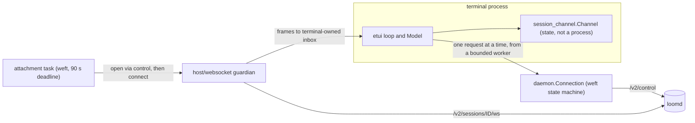

# The terminal client

`loom` is Loom's native terminal client, the Gleam package `packages/tui`. It
is a protocol client and nothing more: it connects to a running `loomd`
daemon over authenticated WebSockets, renders what the daemon reports, and
turns keys into gateway commands. It persists no conversation state and
invents no lifecycle state. The session, its strands (named lines of work,
such as the main conversation or a sub-agent) and its operations all live in
the daemon; [the client plane](client.md) describes that side, and the
[durability](durability.md) and [orchestration](orchestration.md) planes
beneath it. The terminal sits outside all three planes, on the far side of the
gateway.

The package has about 75 modules, but most of the behaviour runs through one
of them. `tui.gleam` holds the immutable `Model`, the `update` and `view`
functions that etui (the terminal UI library) drives, and the glue between
them. The other modules are the parts that glue calls into: the launcher and
daemon bootstrap, two connections (a daemon control connection and a
per-session conversation channel), pure projections that turn a captured
snapshot into rows, one module per panel, Markdown rendering, Herdr
integration, recording and replay, and the `loom update` release installer.
This document walks through them in that order.

## What `loom` does before the loop

`main` parses the command line into a `Launch` and dispatches on it before any
terminal state exists. Only three variants start the interactive loop:

- `Demo` is `--demo`, a design preview with no daemon.
- `Local` is the ordinary launch. It finds or starts the shared daemon, then
  shows the session catalogue or opens `--session`.
- `Remote` attaches to an explicit address with an explicit token.

The rest never enter the alternate screen. `Version` prints the client's own
build identity. `Forward` runs `loomd ext …` as a pass-through child and exits
with its status. `Update` runs the release installer. `Replay` plays a
recording through a virtual backend and prints frames. `Sessions` lists or
deletes catalogue rows over the control connection and prints one line per
row. `Invalid` writes its reason to stderr and exits nonzero. Help (`--help`,
`-h`, or a leading `help`) is answered before any of these, so asking for usage
never contacts a daemon.

An interactive launch requires a terminal on both stdin and stdout
(`ffi_terminal.require_terminal`) before it starts a daemon. It also silences
the OTP logger first, because once etui owns the alternate screen, a
dependency's error report would print over the frame.

## The model, update and view loop

The loop is etui's `app.run_buffered_cursor_adaptive`, and the terminal hands
it four functions: `view`, `update`, a quit predicate, and
`terminal_poll_timeout`. `tui.loop()` returns the same four, so tests and
`loom replay` drive the shipped loop rather than a copy of it. The terminal
process owns one immutable `Model`; each input event produces the next model,
and `view` draws a frame from it.

`update` (`tui.gleam:4807`) is three steps:

1. `recording.note_input` writes the raw event to the `--record` file, if one
   is open, before anything interprets it.
2. `apply_input` dispatches on the event: a key, a paste, a resize, a mouse
   wheel notch, a drag, or `Tick`.
3. `settle_update` does everything that follows any event. It requests a
   worktree observation if a diff pane just appeared, runs the context, advisor
   and goal refresh edges, publishes the Herdr pane state, rebuilds the row
   projection, snaps the viewport if the event addressed the transcript, and
   determines whether to paint a fresh frame.

`Tick` is the event etui delivers when a poll times out with no input, so it
is where socket traffic enters the model. `update_tick` (`tui.gleam:5026`)
drains, in order, the replay inbox, the session-switch and candidate
attachment results, control replies, the reconnect outcome, and up to 64
messages from the conversation socket. `settle_tick` then services the
auxiliary reads (queue, worktree, notes, jobs, context, advisor nudges, goal),
ticks the conversation channel, and updates the quiet timer. A key press,
wheel notch or held drag also drains up to 64 socket messages before it is
interpreted, because a fast gesture produces events faster than any timeout
and no tick would arrive until the hand paused.

The split between dispatch and settling exists for the compiler, not for
readers. The Erlang inliner re-visits the whole dispatched expression once per
settling step when those steps sit in the same body; six steps took over a
minute to compile. Applying the steps to a function parameter
(`settle_update(event, model, updated)`) keeps the visit count constant.
`update_tick` and `settle_tick` have the same boundary for the same reason.
The package's `CLAUDE.md` and `docs/execution.md` have the measurements, and
folding the steps back into one body restores the blow-up.

The name `tui/update` is unrelated to this function. It is the release
installer behind `loom update`, described under "Release updates" below.

### Frames are cached, then paced

`view` does not re-render on its own. It returns the frame cached for the
current screen rectangle, and the cached `Buffer` term is returned unchanged,
which lets etui's frame diff short-circuit on identity. Each visible change
advances `frame_revision`, and `settle_update` calls `refresh_frame_cache` to
determine whether to build the new frame now.

That decision is `tui/pacing`'s. It holds two pieces of arithmetic, neither of
which reads the model:

- **Frame pacing.** During a burst of events, a stale frame is repainted at
  most once every 16 ms, and the rest is recorded as frame debt. The tick after
  the burst flushes it, and the poll timeout drops to 8 ms while debt is
  outstanding.
- **Viewport pacing.** A provider chunk lands as several rows at once.
  `Model.revealed_rows` counts how many of the projected rows the
  bottom-anchored viewport has shown, and `pacing.pace` advances it about one
  row per frame, faster once the backlog passes a threshold. An event that
  addresses the transcript (a wheel notch, a page key, Enter, a resize) reveals
  the whole backlog at once. Typing into the composer does not.

The poll timeout follows recent activity rather than liveness: 40 ms until
320 ms pass without an event, then 400 ms. The daemon's socket actor cannot
wake etui's poll, so after a quiet period the first socket message can wait up
to 400 ms before the tick drains it.

## Three kinds of transcript content

The transcript mixes three kinds of content with different lifetimes, and the
model keeps them in separate fields so they never alias.

**Durable records.** `Model.records` holds the entries of the active strand's
branch, taken from the last captured snapshot. `refresh_record_cache` projects
them into `Line` values (a speaker and text), then into wrapped rows cached in
`record_rows`. The row cache is keyed by the complete `Line` and the width, and
it is rebuilt only when something it reads changes: the records, the header
lines, the active strand, or the detail mode. Captures arrive four times a
second during a turn, and most of them change only usage or a phase, so
`render_cut` compares those inputs before invalidating. When new records only
append, their rows are appended too; the exception is a compact tool group that
a new result regroups (`tool_activity.regroups`), which forces a rebuild.

**Transient fragments.** `transient_lines` builds, on every projection, the
rows that have no durable identity yet: live stream fragments
(`Model.streams`), running tool-output tails (`Model.tool_tails`), queued
inputs the daemon is holding, and pending advisor nudges. These rows are drawn
below the durable rows and never enter the record cache. A stream fragment
therefore cannot force the settled transcript to be re-parsed, and a settled
entry cannot be drawn twice. Each stream is owned by one provider request
generation; the durable entry that answers it, a newer generation, or the
operation's terminal result retires it (`tui/stream_identity`). A live stream
is also bounded: past twice `tui.live_stream_limit` (24 KiB) its fragments
collapse to the newest 24 KiB. [Multiplayer](multiplayer.md#what-the-terminal-does-with-a-pushed-frame)
explains the memory failure behind that bound.

**Local presentation.** Everything the terminal says on its own behalf lives
in `Model.transcript`, `Model.notice` and the overlay fields. `render_cut`
rebuilds the transcript header from each cut: a "beginning of conversation" or
"scroll up to load older" line, the attachment banner, a daemon build-mismatch
notice, the strand's configuration, the last unconfirmed submission, and
pending approvals. `append_system` and `append_error` add local lines to the
same list. These lines are prepended to the durable rows so they scroll with
the transcript, but they are never mistaken for entries. Overlays and panels
are painted over the frame after the transcript.

Scrolling above the live tail freezes a copy of the transient rows in
`Model.reading_lines`, so a stream that keeps arriving does not move the text
being read. Older history is fetched in bounded pages by `tui/history_view`,
which keeps its own window separate from the live cut. The reading position is
held by `transcript_anchor.Row` values (an entry identity plus an offset within
its rows) rather than by row counts, so it survives new output, older pages,
width changes and a detail toggle. A strand switch parks the editor and the
reading position in `Model.strand_workspaces`, keyed by session and strand,
and restores them on return.

## Two connections

A local terminal holds two WebSocket connections to the daemon, owned by
different processes and with different jobs.

### The control connection

`tui/daemon.Connection` is the `/v2/control` connection. It carries catalogue
and lifecycle requests (list, open, create, rename, archive, delete, status,
shutdown) and never conversation traffic. It is a weft state machine with
three phases, `AwaitHello`, `Idle` and `Waiting`. The handshake ends with an
authenticated `Hello`, which carries the daemon epoch, the principal and the
daemon's build identity, and lifecycle requests take their epoch from it.

The connection has one outstanding request with a deadline. A second
concurrent request gets `Busy` rather than a queue slot. A timeout on an
in-flight request closes the connection, so a stalled writer cannot accumulate
requests. A lost reply to a mutation returns `UnknownOutcome(command)` and is
never resent. The connection monitors the terminal process and closes when it
exits, even though `tui/daemon/bootstrap` may create it from a short-lived
worker. `tui/daemon/protocol` is the terminal's own total decoder for this
wire; it imports no server code.

The terminal keeps a `daemon_selection.Host`: the control connection plus its
route (address and owner token). Control actions run inside a bounded worker,
never in the frame loop. If the original connection has retired, the worker
calls `daemon_selection.with_live_control`, which authenticates a temporary
replacement on the same route and closes it when the action finishes.

### The conversation channel

Opening a session goes through control first, then through a separate
per-session socket at `/v2/sessions/<id>/ws`. Four modules divide that
socket's work:

- `tui/connection` is a thin adapter over the shared `host/websocket`
  transport. It maps transport events onto the terminal's `Message` type
  (`Connected`, `Incoming`, `Closed`, `NetworkFault`) and translates an HTTP
  503 at startup into advice about the daemon's connection limits.
- `tui/session_wire` encodes commands and decodes one frame. A frame carrying
  `reply_to` must answer the one outstanding request exactly; a frame without
  it is a push from the daemon and is decoded as an event.
- `tui/session_channel` is the credited request lane. It is terminal-owned
  state, not a process.
- `tui/snapshot` and `tui/snapshot_view` assemble a transfer into a validated
  cut and project it into strands, operations, configuration and presence.

`session_channel.Channel` moves between five phases: `AwaitingBegin`,
`Receiving`, `Ready`, `AwaitingReply` and `Closed`. One request owns the wire
at a time. A snapshot arrives as `snapshot_begin`, a chunk per credit, then
`snapshot_end`, and the cut becomes visible only at the end, so partial
metadata never repaints the view. While idle the channel issues a credited
`catch_up` every 250 ms. A `committed` or `presence` push moves that catch-up
earlier. `stream_delta`, `tool_output` and `usage_observation` pushes are
applied directly. Pushes are accepted in every phase except `Closed` and
consume no credit.
[Multiplayer](multiplayer.md#what-the-terminal-does-with-a-pushed-frame) has
the phase diagram and the push rules; this document does not repeat them.

The channel reports to the model as `session_channel.Update` values, and
`apply_channel_update` folds each one in. `Captured` carries a new cut to
`reconcile_cut` and then `render_cut` (`tui.gleam:6639`). `Streamed` and
`ToolStreamed` feed the transient region. `HistoryPage` feeds scrollback.
`LookedUp` answers exact approval lookups. `RequestRefused` carries the command
name and request ID, so a refusal settles only the request it answers.

Commands take one of two lanes. The channel classifies an outgoing frame by its
command name: `models`, `skills`, `schedules`, `notes`, `queued_input`,
`context`, `worktree_diff`, `live_jobs`, `advisor_pending` and `goal_get` are
reads, and every other name is a mutation. A read waits for the lane to be
free. A mutation may also wait: after the first cut, the channel can hold one
unsent mutation behind a capture in progress, and sends it exactly once when
the capture completes. `Disposition` reports which happened (`Waiting`, `Sent`
or `DefinitelyNotSent`). The composer stays visible but locked while its text
waits, and Escape cancels it without sending anything.
[ADR-010](../adr/010-retain-one-unsent-terminal-command.md) records that
decision.

The command-name lists are string literals in three places
(`session_channel`'s `outbound` and `matching_presentation`, and
`tui/attempt`'s `decode_selection`), and the compiler checks none of them. A
new read command must be added to all three. In `outbound`, an unlisted read
defaults to the mutation lane, and the channel fails closed when its reply
does not match a mutation or when the request deadline passes. In `decode_selection`, an unlisted
command fails the replay of any recording that carries it.

### Opening a session is provisional

Selecting a session never tears down the current one first.
`attachment.start_recorded` runs the control `open` and the socket startup in
a weft task under one 90-second deadline, and publishes the new socket to
subjects the terminal created. The terminal feeds the candidate's frames
through its own `session_channel`, validates the expected session, epoch and
incarnation and the complete initial cut, and acknowledges it. Only then, once
the task has also completed, does `attachment.Outcome` report `Adopted`, and
the terminal swaps in the new channel and transcript. A failure closes only the
provisional socket; the old session keeps running and stays on screen.

Every inbox the terminal reads is created by the terminal process, because a
`Subject` delivers to the process that created it and receiving on another
process's subject panics. The attachment worker owns only the acknowledgement
subject that the terminal writes to.

`tui/sessions` and its `SessionSelector` overlay are an older, record-based
switch path kept as a host-test seam. The live selector is `DaemonSelector`,
backed by `tui/session_selector` and `tui/daemon/selection`.

## Finding or starting the daemon

A `Local` launch calls `bootstrap.resolve_daemon`, which resolves one shared
daemon per private state root without opening any session. The steps, in
`tui/daemon/bootstrap.resolve`:

1. Take the kernel launch lock under the state root, polling within the
   deadline.
2. Read the published endpoint record. If one exists, reuse it. If the endpoint
   is vacant, find the `loomd` executable and its configuration, spawn it
   paused, write a `Starting` record carrying the child's native process
   identity (its fence), and only then release the child to run.
3. Release the lock, since the child takes the same lock before it adopts its
   reservation, and holding it while waiting would deadlock.
4. Poll until the record for that fence reports ready, then authenticate a
   control hello whose epoch matches the published one.

Executable and configuration discovery run only when the endpoint is proven
vacant, so an existing daemon does not need a discoverable binary in this
terminal's environment. Repository content never chooses the executable, its
configuration or its working directory. The whole budget is 90 seconds.
[The client plane](client.md#discovery-credentials-and-safe-startup) documents
the state-root files, credentials and fencing rules that this sequence relies
on, and the package `CLAUDE.md` lists the invariants (single-winner cold
start, publication before execution, monotonic waits).

## Reconnecting

The terminal has one automatic recovery path, and it is narrow. When the
conversation socket closes, or the channel fails, `begin_reconnect` asks
`reconnect_decision` whether this loss earns an attempt. It does only when the
terminal is not quitting, a session is attached, the launch was `Local`, and
the `Reconnect` state is `ReconnectIdle`. A remote attachment has no launch to
re-run, so it never reconnects on its own.

The attempt runs `daemon_selection.relaunch` in a weft task with a 90-second
deadline. That calls `bootstrap.reconnect_daemon`, which differs from a cold
launch: it observes before it launches. It polls the endpoint, reuses a daemon
whose control status reports `Accepting`, and keeps waiting while a daemon is
still draining. Only when the endpoint is natively vacant does it run the
ordinary resolver once. A failed socket probe is never evidence that the old
daemon is gone.

On success the terminal reattaches the same session through the ordinary
provisional open path. On failure it marks the attempt `ReconnectSpent` and
writes the reason, pointing the operator at `/sessions`. Either way the attempt
is spent until an attachment is adopted, so a daemon that keeps dying produces
one error rather than a loop.

No path resends a mutation. A request that was sent and whose reply was lost
becomes a retained `UnconfirmedSubmission` notice naming the session, command
and request ID, and the notice survives attachment replacement. When the daemon hands back a
held prompt it could not run (a pushed `HeldInputReturned`), the text is
restored to the composer; image bytes must be reattached.

## The composer, commands and the queue editor

The composer is an etui text area plus `tui/composer` attachments. A paste
estimated at 400 tokens or more, or of eight lines or more, becomes a compact
attachment chip; its bytes are expanded into the prompt only when it is sent.
A pasted path to a PNG, JPEG, GIF or WebP file of at most 20 MiB becomes an
image attachment, up to four per prompt (`tui/image_drop` reads the magic bytes
and never invokes a shell). Image prompts go out as `prompt_content`, the only
frame that carries images.

Enter submits. `command.parse_with_skills` classifies the draft into a
`command.Command`: ordinary text becomes `Prompt`, a slash word becomes one of
the command variants, and a name from the daemon's skill catalogue becomes a
prompt the daemon expands. `submit` first checks `mutation_refusal` (is a
conversation attached, is the recipient strand known, is the mutation slot
free) and keeps the draft with a reason if the answer is no. Otherwise the
command is encoded by a `tui/protocol` constructor and handed to `send_frame`,
which calls `session_channel.submit`. Every send site switches on
`tui.Peer`: `Attached` writes to the socket, `Preview` echoes locally for
`--demo`, `Replaying` does only the local half, and `Disconnected` refuses.

On a busy strand, Enter sends `prompt`, which the daemon holds and runs after
the current operation. Tab switches one draft to `steer`, which the gateway
puts at the front of the queue and uses to stop the observed operation.
Escape interrupts current work; the daemon keeps queued turns. Typing `/`
opens a prefix-filtered palette built from `command.suggestions_with_skills`,
with built-in commands taking precedence over skills.

Held inputs are shown in a card above the composer, up to three at a time,
from the cut's `pending_inputs`. `/queue` with no text, or `Alt+q`, opens
`tui/queue_panel`'s inspector. Enter on an editable item fetches the complete
document with `queued_input`, and `tui/queue_editor` edits it in its own editor
without borrowing the ordinary composer. `Ctrl+s` saves with
`edit_queued_input` against the fetched revision. The editor's `Delivery`
state (`Editable`, `Saving`, `Unknown`) prevents a fetch from replacing a dirty
or uncertain draft, and a changed session, epoch or incarnation cannot save an
old draft. [Protocol 024](../../protocol-change/024-edit-queued-input.md) owns
the wire contract.

## Panels and surfaces

Each panel reads an observation the daemon returned and owns only its own
selection and scroll state. Most observations are explicit reads on the
conversation channel; none of them grants authority the command itself did not
already have.

| Surface | Opened by | Data it shows | Modules |
|---|---|---|---|
| Approval dialog | Automatically, when a new exact escalation is pending | The captured action, requesting strand and exact grants; Allow once, Allow for session, Deny | `approval`, `approval_panel` |
| Changes pane and navigator | `/diff` (right-hand pane at 140 columns or wider) | A bounded Git observation from `worktree_diff`, with captured `fs_edit` patches as a labelled fallback | `worktree_view`, `diff_panel` |
| Agent workspace | `/agents` or F2; `Shift+Tab` toggles the compact rail | Per-strand rows from the cut: task, phase, waits, outcome; Activity, Messages and Notes tabs | `agents`, `agent_view`, `agent_activity`, `agent_messages`, `agent_message_panel`, `reviewer_status` |
| Notes | `/notes`, or the inspector's Notes tab | The current `notes` observation with its revisions | `notes_view`, `note_panel` |
| Queue inspector and editor | `/queue`, `Alt+q` | Held inputs and one fetched queue document | `queue_panel`, `queue_editor` |
| Completion summary | `/summary`, and the card after an operation completes | Completion evidence, cumulative usage, and the `live_jobs` roster, as three tabs | `completion_summary`, `summary_panel`, `live_jobs` |
| Context inspector | `/context`, `/context all` | The server-priced `context` projection | `context_view`, `context_panel` |
| Advisor pending nudges | Automatically, on the primary's idle edges | Undelivered nudges from `advisor_pending`, in the transient tail | `advisor_pending` |
| Goal | `/goal`, plus a row beside the composer | The `goal_get` board | `goal_view`, `focused_goal_panel` |
| Model selector | `/model` | The model catalogue; selection sends `set_config` | `model_selector` |
| Session picker | `/sessions`, and at a `Local` launch | One authorized catalogue page, active or archived | `session_selector`, `daemon/selection` |

A few rules apply to every surface. An open overlay owns focus, so ordinary
prompt editing is inert while it is up, and `Ctrl+C` stays global. Overlay
rows are cut to width rather than wrapped, so a long entry cannot push the
selection off screen. A missing observation is shown as unavailable, never as
zero or empty: `Model.nudges` and `Model.goal` are `None` for "not observed",
and only a server board can say "no goal is pinned".

Three of the automatic reads are driven by transitions rather than timers.
`advisor_nudges_action` reads the nudge queue when the primary's operation
settles, when a review settles while the primary is idle, and when the primary
first appears; it clears the board when the primary starts a run.
`goal_action` reads the goal on the same edges plus a run start.
`context_refresh_due` refreshes context on the first capture, a strand switch,
a configuration change, and the active operation settling.
[The advisor doc](advisor.md#how-the-terminal-draws-it) and
[the goals doc](goals.md#commands-and-terminal-behavior) describe what those
panels show and why.

The approval dialog deserves one more sentence because it carries consent. It
captures the escalation's sequence, action and grants when it opens, selects no
choice by default, and a decision echoes exactly what was captured. Metadata
refreshes behind the dialog cannot change the question.

## Rendering

Every string from the daemon or the model is untrusted terminal input.
`tui/text_hygiene` replaces C0 and C1 controls, bidirectional marks,
zero-width and tag codepoints before text reaches an etui span, and complete
ANSI CSI and OSC sequences are stripped before Markdown parsing. Model text
therefore never becomes terminal control traffic.

`tui/markdown` walks Mork's CommonMark tree and emits etui spans directly; it
never routes text through HTML or an ANSI renderer. `markdown.render` takes the
width because tables must be measured before they are drawn: columns are
sized in terminal cells, narrowed by fair share when the grid is too wide, and
replaced by one labelled record per row only when a column cannot keep three
cells. Other blocks are reflowed afterwards by `markdown.wrap_lines`, which
keeps code rows hard-wrapped on cell boundaries so indentation survives.
Fenced Gleam, including code-mode programs, gets token styling without being
reformatted. `markdown.diff` renders patches with addition and removal colours.

`render_line` gives each `Speaker` its mark and style. In compact mode,
`tui/tool_activity` groups consecutive tool calls and joins results by call
ID, a reasoning block is one `ReasoningDigest` row, and a successful settle
keeps the same row count as the live region it replaces, so the transcript
does not jump when a call completes. `Ctrl+G` expands all of it. Harness-written
user turns (advisor frames, goal continuations, the notes digest) are
recognized by both their header and footer tokens and drawn in the system
voice; the advisor and goals docs cover the details.

Colour is decided once at launch. `appearance.detect` reads `COLORTERM`,
`TERM`, `COLORFGBG` and `NO_COLOR` into an `appearance.Palette`, and a
completed frame is adapted once before it enters the frame cache. Rendering
itself does no I/O.

## Workspace and Herdr

`tui/workspace` settles the workspace once, before the loop starts. For a
local launch that is `bootstrap.launch_workspace`: the `--workspace`
directory, or the launch directory without one, canonicalized exactly as the
launcher keys its own per-workspace state. The path is never widened to the
repository around it; the enclosing repository contributes only the branch,
read from `HEAD` through bounded file reads. The picker's `n` sends that path
as the new session's workspace, and the footer label and the default session
name come from the same `workspace.Context`. The session picker sorts rows
for the same workspace first. A session switch takes the selected row's
recorded workspace as it is, borrowing the branch the same way.

`tui/herdr` reports the terminal's state to the Herdr terminal multiplexer
when the terminal runs inside one of its panes. It is enabled only when
`HERDR_ENV=1`, `HERDR_SOCKET_PATH` and `HERDR_PANE_ID` are all set.
`herdr.state_for` maps the model onto three states: `blocked` while an
approval is pending, `working` while any strand has a live phase, and `idle`
otherwise. `publish_herdr` runs in `settle_update` and sends only when the
state or the session changes, announcing the session ID when it first becomes
known and on each switch, since `herdr session` resume keys on it. Nothing is
sent until a session is attached. The sends go to a dedicated reporter process
that retries each one once and then drops it, so a stale Herdr socket cannot
stall the terminal. The report sequence is seeded from the wall clock because
Herdr's `seq` is unsigned and the BEAM monotonic clock can be negative.

## Recording and replay

`loom --record <path>` writes one JSON line per event the client received:
keys, pastes, resizes, wheel notches, mouse presses, drags and releases, and
every socket message, each with its monotonic offset. Ticks and plain mouse
motion are left out because they do not change the model. `update` records an
input before interpreting it, and the channel records a frame before decoding
it, so a recording reproduces a decoding bug rather than hiding it. A failed
append is silent, since etui owns the screen.

The current format (local format 2) tags each request credit, raw frame and
adoption with a terminal-local attempt identity (`tui/attempt`), so a replay
can tell a provisional attachment that failed from the one that was adopted.
[ADR-009](../adr/009-record-terminal-attempt-custody.md) records that design.

`loom replay <path>` plays a recording through `tui/virtual_backend`, an etui
backend whose `poll` answers from a script. The replay runs the shipped
`update` and `view`, with `Peer` set to `Replaying`: it opens no socket, starts
no daemon, and sends nothing, and `tui/attempt_replay` feeds recorded frames
through the same channel reducer the live client uses. `tui/frame` converts a
rendered `Buffer` to plain text for printing and for snapshot tests. Only the
last frame is reproducible across machines, because whether a paced event
drew a fresh frame depends on elapsed time; the settling tick that ends a
replay always flushes. Tests can inject a clock with `new_model_with_clock`,
but the replay command still uses the real one.

The same virtual backend runs the golden-frame tests in
`packages/tui/test/snapshot_test.gleam` and the real-client fixtures in
`packages/client/test/support/tui_driver.gleam`, which is why `tui.loop()`
exists.

## Release updates

`loom update` is a terminal command that runs before any terminal setup.
`tui/update` resolves and verifies a release manifest, stages the archives in
a private directory, publishes them through the running client's own
installer, and restarts the daemon through the authenticated control
connection. The `tui/update/*` modules divide that work: `options` parses
intent, `source` and `manifest` bind the release to a commit and platform,
`download` fetches over HTTPS, `archive` admits only the release writer's tar
subset, `files` stages and publishes, `version` refuses a silent downgrade, and
`lifecycle` restarts the daemon. [The client plane](client.md#release-updates)
summarizes the design, and [updating](../updating.md) is the operator guide.

## Invariants and failure behaviour

These are the properties the rest of the design protects. Each is enforced in
the module named.

- **The server is authoritative.** Strands, operations, entries, usage and
  configuration come from captured cuts. The terminal persists nothing
  (`tui.gleam`, `snapshot_view`).
- **No mutation is resent.** A lost reply becomes `UnknownOutcome` on both
  connections, and switching sessions never moves an unsent command to the new
  connection (`daemon`, `session_channel`).
- **A pushed frame never owns the wire.** It allocates no request identity and
  spends no credit, while a correlated frame with the wrong identity closes the
  socket (`session_wire`, `session_channel`).
- **Replacement preserves the old view until the new one validates**
  (`attachment`).
- **Durable and transient rows do not alias**, so an answer is not drawn twice
  at the moment it commits (`tui.gleam`).
- **Every inbox the terminal reads, the terminal created** (`attachment`,
  `daemon`, `sessions`).
- **A decision echoes exactly what was displayed** (`approval`,
  `approval_panel`).
- **A replay performs no outbound effect** (`Peer.Replaying`).

The main failure behaviours follow from those. A socket failure closes the
conversation channel, clears streams, marks outstanding reads failed, and
makes at most one reconnect attempt. A control timeout retires that control
connection, and the next action authenticates a replacement. A daemon that
refuses an optional read (for example an older daemon without
`advisor_pending` or goals) leaves that surface unavailable rather than
failing the session.

## What changed since the historical description

[The client plane's historical terminal section](client.md#historical-the-terminal-client)
describes the client at `f019322`. The model, update and view structure is the
same, and so is the separation of durable records from stream fragments. Five
things changed:

- The terminal no longer starts a private daemon per workspace. It resolves one
  shared daemon, authenticates a control connection, and opens sessions from a
  catalogue picker.
- The conversation uses the v2 credited channel (snapshots in chunks, periodic
  catch-up, pushed notices) instead of v1 envelopes and full snapshots, over
  the shared `host/websocket` transport rather than Stratus directly.
- On a live strand, Enter now queues a `prompt` that the daemon holds, and Tab
  selects `steer` for one draft. Previously Enter steered and Tab queued a
  `follow_up`.
- `/diff` shows a Git worktree observation with a file navigator; captured
  edits are now only the fallback.
- Recordings carry attempt identities (local format 2), and tests can inject
  the presentation clock.

## Where the code lives

Paths are relative to `packages/tui/src`.

| Module | What it owns |
|---|---|
| `tui.gleam` | `Model`, `main` and launch parsing, `update`/`apply_input`/`settle_update`, `update_tick`/`settle_tick`, `view` and the frame cache, `render_cut`, the row projection, command dispatch, and the `Reconnect` state. |
| `tui/pacing` | Frame and viewport pacing and the poll cadence, as pure arithmetic. |
| `tui/connection` | The terminal's event names over the shared `host/websocket` transport. |
| `tui/session_wire` | v2 command encoding and single-frame decoding: correlated replies versus pushes. |
| `tui/session_channel` | The credited conversation lane: phases, one outstanding request, one unsent mutation, 250 ms catch-up, pushed frames. |
| `tui/snapshot`, `tui/snapshot_view` | Assembling a credited transfer into a validated cut, and projecting it into strands, operations, configuration and presence. |
| `tui/protocol` | The client's view of the ClientGateway event union and its command constructors. |
| `tui/attachment` | One provisional session replacement and its adoption. |
| `tui/daemon` | The `/v2/control` connection: weft state machine, one outstanding request. |
| `tui/daemon/protocol` | The independent, total control codec. |
| `tui/daemon/bootstrap` | Shared-daemon discovery, cold start under the launch lock, and reconnect observation. |
| `tui/daemon/selection` | Open, create, rename, archive, delete and list over control; control-owner replacement; relaunch. |
| `tui/bootstrap` | Launch options, state-root and executable discovery, and the entry points `resolve_daemon` and `reconnect_daemon`. |
| `tui/session_selector` | The catalogue picker page and its confirm, rename and delete prompts. |
| `tui/sessions` | The older record-based switch path, kept as a test seam. |
| `tui/history_view`, `tui/transcript_anchor` | Bounded scrollback paging and identity-based reading position. |
| `tui/stream_identity` | Handoff of a streamed answer to its reserved durable entry. |
| `tui/tool_activity`, `tui/file_read_view` | Compact tool groups, and the readable projection of file reads and edits. |
| `tui/markdown`, `tui/text_hygiene` | CommonMark to etui spans, table layout, wrapping, patch rendering; terminal-safe text. |
| `tui/theme`, `tui/appearance` | Semantic colours and the launch-time palette. |
| `tui/command`, `tui/skills` | Slash-command grammar, palette suggestions, and daemon skill names. |
| `tui/composer`, `tui/image_drop` | Paste attachments, token estimate, and image admission. |
| `tui/queue_panel`, `tui/queue_editor` | Held-input inspector and the revision-fenced queue editor. |
| `tui/approval`, `tui/approval_panel` | Exact approval capture and the approval dialog. |
| `tui/worktree_view`, `tui/diff_panel` | Git worktree observation and the changes navigator. |
| `tui/agents`, `tui/agent_view`, `tui/agent_activity`, `tui/agent_messages`, `tui/agent_message_panel`, `tui/reviewer_status` | The agent rail and inspector projections. |
| `tui/notes_view`, `tui/note_panel` | The notes observation and browser. |
| `tui/completion_summary`, `tui/summary_panel`, `tui/live_jobs` | Completion evidence, the summary panel, and the jobs roster. |
| `tui/context_view`, `tui/context_panel` | The context observation and inspector. |
| `tui/advisor_pending` | The pending-nudge observation. |
| `tui/goal_view`, `tui/focused_goal_panel` | The goal board, composer row and inspector. |
| `tui/model_selector` | The `/model` overlay. |
| `tui/cache_miss` | Prompt-cache miss detection and TTL outlook from usage rows. |
| `tui/selection`, `tui/frame` | Mouse selection and OSC 52 copy; a `Buffer` as plain text. |
| `tui/workspace`, `tui/internal/workspace_file` | The session workspace, kept as named, and its branch label. |
| `tui/herdr`, `tui/internal/ffi_herdr` | Herdr pane-state reporting and its one socket exchange. |
| `tui/recording`, `tui/attempt`, `tui/attempt_replay`, `tui/virtual_backend` | The `--record` format, attempt custody, replay reduction, and the scripted etui backend. |
| `tui/update`, `tui/update/*` | The `loom update` release installer and daemon restart. |
| `tui/internal/ffi_terminal`, `tui/internal/ffi_file`, `tui/internal/ffi_download` | The package's Erlang FFI: terminal-owned actions, bounded image reads, and Gun HTTPS streams. |
