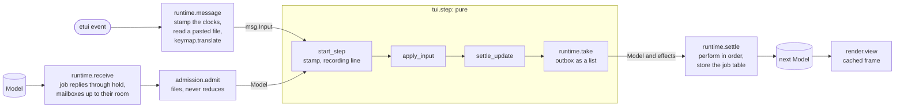
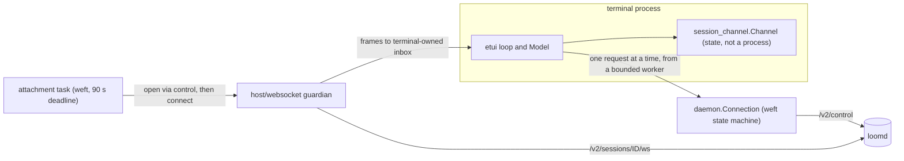

# The terminal client

`loom` is Loom's native terminal client, the Gleam package `packages/tui`. It
is a protocol client and nothing more: it connects to a running `loomd`
daemon over authenticated WebSockets, renders what the daemon reports, and
turns keys into gateway commands. It persists no conversation state and
invents no lifecycle state. The session, its strands (named lines of work,
such as the main conversation or a sub-agent) and its operations all live in
the daemon; [the client plane](client.md) describes that side, and the
[durability](durability.md) and [orchestration](orchestration.md) planes
beneath it. The terminal sits outside all three planes, on the far side of the
gateway.

The package has about 80 modules. `tui.gleam` holds the entry points and the
`update` dispatch that etui (the terminal UI library) drives; the immutable
`Model` lives in `tui/model`, `view` in `tui/render`, and the rest of what
used to share that one file is split by responsibility into the modules the
table at the end names. The model is two records, `Model(shared:
TerminalShared, view: View)`: `Shared` is the session state a second host
showing the same session would need, and `View` is the terminal's own
state, including its etui render caches as `View.caches` and the step's
effect outbox. `Shared` names its host handles only by type parameter,
`Shared(socket, recorder, source, replay_source)`: the adopted lane and the
replay state take the socket and recorder types, and the connection and
replay inboxes are keyed by their sources. `TerminalShared` binds them to
the terminal's connection, its recording and the two subjects it reads.
`Shared` and the functions over it alone live in `session_view`, the
package lint's R6 keeps portable, since S4 of the step extraction:
`session_view/model` holds the record and its helpers, and the terminal
imports it as `session_model`. Three records that held both kinds of
state are split, each with its session half in `Shared` and its terminal
half in `View`: a strand's parked history window and its editor, the agent
roster and the strip's focus, and the queue editor's requests on the lane
(`session_view/queue_request`) and the editor. The build-mismatch notice
is shared data (`Shared.build_notice`) that the terminal computes from the
daemon it adopts and its own build, which stay in `View` because
`host/build_identity` reads the environment, and a held prompt the daemon
returns waits in `Shared.returned_drafts` until the terminal moves it into
an editor. The terminal's reducers take the whole model and read a field
through the half that holds it, and a terminal reducer stores the result
of any function over `Shared` through `tui_model.hold_shared`. The sending
path (`session_view/outbound`) and the side surfaces' reads and receivers
(`session_view/surfaces`) take `Shared` alone. They cannot write the
composer, the queue editor or the goal inspector, so they record what
those must show (`Shared.drafts_sent`, `queue_notices` and
`goal_observations`), and `hold_shared` applies it at the point of the
call, where the old functions wrote the editors themselves. The functions
that open a side surface or read its target read the terminal's overlay
and stay in `tui/side_surfaces`. The event fold, which applies each pushed
event, takes `Shared` alone too (`session_view/event_fold`). Where an event
used to write the terminal's editor, overlays or footer, it records a
`SurfaceFact` in `Shared.surface_facts`, and `inbound.settle_surfaces`
applies the facts after each event, before the next one reads the terminal
state they change. The lane fold, which applies each update of the adopted
lane and each change of a replay, takes `Shared` alone too
(`session_view/lane_fold`), one update per call. The terminal keeps the
loop over a drain's updates in `tui/inbound`: before each update it passes
the `Surroundings` a decision inside the update reads (whether a diff or a
notes surface is shown, and the approval under review), and after it
applies the update's facts. The commands an operator gives the session (an
interrupt, a stop, a decision, a model change, a change of strand, the
session's half of a quit, and every slash command the session carries out)
take `Shared` alone too (`session_view/commands`, with the command set in
`session_view/msg`); the terminal decides from a key or a parsed slash
command which one to run, and settles the facts it records, as it does for
a fold. The three edges that decide after every event whether the context,
the advisor's pending nudges or the goal need a fresh read compare two
shared records, and run together as the shared step's settle
(`session_view/step`, imported as `session_step`).
The split, the parameters and the cut are slices S1 to S4 of moving the
step into `session_view` ([the step extraction
design](../design-notes/step-extraction.md)), and S5 made the web view a
second caller of what moved: it runs the shared units through
`session_step.update`, the whole-event entry for a host with no surfaces
of its own, which the terminal does not call (see "The model, update and
view loop"). `Shared.ended`, the reason the adopted lane failed, is
written by the lane fold for the web view's heading and cleared by the
terminal's adoption, and the terminal never reads it. The other modules are the parts that glue calls into: the launcher and
daemon bootstrap, two connections (a daemon control connection and a
per-session conversation channel), pure projections that turn a captured
snapshot into rows, one module per panel, Markdown rendering, Herdr
integration, recording and replay, and the `loom update` release installer.
This document walks through them in that order. The session lane, the
protocol decoders, snapshot adoption and the transcript's line builders are
not in this package: they live in `packages/session_view`, which the
daemon's web view drives as well
([the client engine and its hosts](client.md#the-client-engine-and-its-hosts)).

## What `loom` does before the loop

`main` parses the command line into a `Launch` and dispatches on it before any
terminal state exists. Only three variants start the interactive loop:

- `Demo` is `--demo`, a design preview with no daemon.
- `Local` is the ordinary launch. It finds or starts the shared daemon, then
  shows the session catalogue or opens `--session`.
- `Remote` attaches to an explicit address with an explicit token.

The rest never enter the alternate screen. `Version` prints the client's own
build identity. `View` is `loom ui --session <id>`: it resolves the daemon
(starting one with `--ui` if none runs), asks it for a single-use link to
the session's web page with `ui.link`, prints the link, and with `--open`
also hands it to the platform's opener; [the web view](web-view.md) follows
that link. `Forward` runs `loomd ext …` as a pass-through child and exits
with its status. `Update` runs the release installer. `Replay` plays a
recording through a virtual backend and prints frames. `Sessions` lists or
deletes catalogue rows over the control connection and prints one line per
row. `Invalid` writes its reason to stderr and exits nonzero. Help (`--help`,
`-h`, or a leading `help`) is answered before any of these, so asking for usage
never contacts a daemon.

An interactive launch requires a terminal on both stdin and stdout
(`ffi_terminal.require_terminal`) before it starts a daemon. It also silences
the OTP logger first, because once etui owns the alternate screen, a
dependency's error report would print over the frame.

## The model, update and view loop

The loop is etui's `app.run_buffered_cursor_adaptive`, and the terminal hands
it four functions: `view`, `update`, a quit predicate, and
`terminal_poll_timeout`. `tui.loop()` returns the same four, so tests and
`loom replay` drive the shipped loop rather than a copy of it. The terminal
process owns one immutable `Model`; each input event produces the next model,
and `view` draws a frame from it.

`update` runs four calls in order. `runtime.message` translates etui's event
into the client's own message (`tui/msg`, through `tui/keymap`), reading the
clocks once and the file a pasted path names into it; `runtime.receive`
reads waiting traffic and job replies and has the step's admission file
them into the model; `tui.step` computes the next model and the effects it
decided on; and `runtime.settle` carries those effects out and stores the
table of running jobs they left on the model. The step performs none of the
fire-and-forget effects itself; "Effects are values" below describes that
split. The step takes a `msg.Msg`: an `Input(at, wall_ms, event)`, which it reduces,
or `Arrived(arrivals)`, traffic it only files (`tui/admission`) and never
reduces. An input's step has three stages:

1. `tui_model.start_step` stores the input's stamp as `Model.shared.stamp`
   and its wall clock reading as `Model.view.wall_ms`, and queues the
   event's recording line, if a `--record` file is open, before
   anything interprets it, so it is the step's first effect.
2. `apply_input` dispatches on the event: a key, a paste, a resize, a mouse
   wheel notch, a drag, or `Ticked`.
3. `settle_update` does everything that follows any event. It requests a
   worktree observation if a diff pane just appeared, runs the context, advisor
   and goal refresh edges, decides the Herdr pane report, rebuilds the row
   projection, snaps the viewport if the event addressed the transcript, and
   determines whether to paint a fresh frame.

`runtime.take` then collects what those stages queued and returns it with the
model.

The whole of `tui.update` is
`runtime.settle(step(runtime.message(event, model), runtime.receive(model)))`
(`update` at `packages/tui/src/tui.gleam:2434`). Everything inside the
box below is pure; everything outside it is the host.

```mermaid
flowchart LR
    ev(["etui event"]) --> message["runtime.message<br/>stamp the clocks,<br/>read a pasted file,<br/>keymap.translate"]
    m0[("Model")] --> receive["runtime.receive<br/>job replies through hold,<br/>mailboxes up to their room"]
    receive --> admit["admission.admit<br/>files, never reduces"]
    message -- "msg.Input" --> start
    admit -- "Model" --> start
    subgraph step["tui.step: pure"]
        start["start_step<br/>stamp, recording line"] --> apply["apply_input"]
        apply --> settleu["settle_update"]
        settleu --> take["runtime.take<br/>outbox as a list"]
    end
    take -- "Model and effects" --> settle["runtime.settle<br/>perform in order,<br/>store the job table"]
    settle --> m1[("next Model")]
    m1 --> view["render.view<br/>cached frame"]
```

[The client engine and its hosts](client.md#the-client-engine-and-its-hosts)
places this loop beside the web view's, which drives the same session lane
from a Lustre component.

The terminal's step calls the shared units one at a time, and it does not
call `session_step.update`, which composes the same units for a whole
event. Two things stop it. A tick is not one shared call: the terminal
drains its replay, control, candidate and reconnect traffic among the
shared drains in a fixed order (`tick.update_tick`), and it applies the
surface facts each lane update recorded before the next update reads the
state they change (`inbound.settle_surfaces`, the ruling on question 11 of
the step extraction design). And a key handler that runs a command writes
its own state after the command, while the settle runs once at the end of
the event, in `settle_update`; a settle inside `update` would send a
context, nudge or goal read earlier than the terminal does now. So
`session_step.update` is the web view's loop, and its tick runs the
terminal's units in the terminal's order less its surfaces: the activity
and roster clocks, the drain of every held frame, `service_reads`, and the
lane's tick with its history read. `session_view/step_test` holds it to
that order over a scripted drain, and a mutation that runs the reads
before the drain fails it. The terminal's tick also sends the block-summary
read, which `update` leaves out because the daemon may run a summarizer
for a label it is asked for. Making the terminal call `update` too, with a
pure callback the sequencer applies after each piece so the host can apply
its facts, is recorded on
[issue #569](https://github.com/Roasbeef/loom/issues/569) as a later
option and is not planned.

`Tick` is the event etui delivers when a poll times out with no input, or
when another process wakes the poll, so it is where socket traffic enters
the model. A session socket wakes it: after the socket actor files a frame
in the terminal's inbox it sends etui's `{etui_wake}` to the terminal
process, paced to one wake per 16 ms with the last wake of a burst sent at
the end of its interval (`connection.connect_waking`,
`websocket.WakeAfter`). A frame therefore reaches the model within one
wake interval of arriving, whatever the poll timeout is.
`tui/tick.update_tick` drains, in
order, the replay inbox, control replies, the candidate attachment's
traffic, the reconnect outcome, the picker's activity
answer, a new session's configuration, and up to 64 messages from the
conversation socket. `settle_tick` then services the auxiliary reads (queue,
worktree, notes, jobs, context, advisor nudges, goal), ticks the conversation
channel, and updates the quiet timer. A key press,
wheel notch or held drag also drains up to 64 socket messages before it is
interpreted, because a fast gesture produces events faster than any timeout
and no tick would arrive until the hand paused.

None of those drains reads a mailbox for the conversation socket, the replay
or the candidate attachment. Each of those inboxes is a `tui/buffered.Inbox`,
a subject together with the messages already taken out of its mailbox.
Before the step, `runtime.arrivals` reads each one's mailbox up to the room
its buffer has left, the most the step can consume less what it holds: the
connection inbox to `connection_batch` (64), the replay inbox to one event,
and the candidate's frames to 40 until the initial cut is captured.
`tui/admission` files what was read, behind what each buffer holds, and
reduces nothing. The drains take from those buffers, and traffic that
arrives during the step waits for the next one. An inbox the step did not
drain has no room and reads nothing, so every buffer stays within its
bound. The bound is the host's: admission never drops a frame for
capacity, because a dropped frame is a gap in the lane's sequence. A frame
is tagged with the subject it was read from, and admission files it only
into the adopted inbox or the waiting attempt with that subject. A host
that wakes when traffic arrives delivers `Arrived` and then a `Ticked`
input; it never reduces on an arrival alone. The terminal's wake is that
host's shape: the wake arrives as etui's `Tick`, and a wake queued behind
an Escape is a separate event, so the Escape's step still cancels before
any traffic is reduced (ADR-010). The control, reconnect, activity and attachment jobs' own messages,
the attachment's `Prepared` and worker outcome among them, reach the step
the same way ("Jobs are started by the runtime" below), and are received
before the frames, so a `Prepared` and the first frames it names arrive in
the same step.

Because an inbox's buffer lives inside the inbox value, an adoption that
replaces `Model.shared.inbox` drops what the old socket's inbox had received along
with the inbox itself, and no later drain can reduce a message from it. Code
outside the step that waits on an inbox, such as a test driver or the
attachment cancel that runs as an effect, reads it through
`buffered.receive`, which returns the held messages before anything still in
the mailbox; they are always older.

The split between dispatch and settling exists for the compiler, not for
readers. The Erlang inliner re-visits the whole dispatched expression once per
settling step when those steps sit in the same body; six steps took over a
minute to compile. Applying the steps to a function parameter
(`settle_update(event, model, updated)`) keeps the visit count constant.
`update_tick` and `settle_tick` have the same boundary for the same reason.
The package's `CLAUDE.md` and `docs/execution.md` have the measurements, and
folding the steps back into one body restores the blow-up.

The name `tui/update` is unrelated to this function. It is the release
installer behind `loom update`, described under "Release updates" below.

### Effects are values

A reducer does not write to a socket, close a connection, cancel a worker,
discard an inbox, print a clipboard sequence or report to Herdr. It appends a
`tui/effect.Effect` describing that action to the model's outbox through
`tui_model.emit`, and `tui/runtime` performs the list after the step. Three
modules divide the work:

- `tui/effect` is the vocabulary: a closed data type, not closures, so a test
  can assert on the effects a step produced and a second runtime can interpret
  the same values against its own transport. The two effects the session
  reducers decide, a lane output and the recording line for a message that
  arrived with no lane, are `session_view/step_effect` values generic over the socket
  and recorder, carried as `effect.Step`; the rest are the terminal's own.
- `session_view/session_channel` is a pure transition system. Its `emit`, `close`
  and receive queue `Transmit`, `Shut` and `Note` outputs on the channel
  itself, a `Note` being one attempt event for the recording, and
  `terminal_lane.perform` is the only place the channel touches its socket
  or its recorder. Every reducer that transitions the adopted lane stores it
  through `hold_channel`, whose outputs reach the model outbox at that point:
  the shared form queues them on `Shared.outbox`, and
  `tui_model.hold_shared`, which stores the result of every call into a
  function over `Shared`, moves them into `View.outbox` before anything
  else is queued. `tui/attachment` returns its candidate channel's
  outputs from `poll` and `accept` with the rest of what they decided: the
  `Acknowledge` that releases its worker, the attempt's failure note, and
  its cleanup.
- `tui/runtime` owns collection and performance. `runtime.take` empties the
  model outbox, which is the step's one queue, and returns it oldest first.
  `runtime.perform` carries the list out, starting and cancelling jobs
  through `tui/job_runner`. Nothing in the reducer imports either.

Every effect names the handle it acts on, and the runtime never looks a target
up in the model. An adoption replaces the socket partway through a step, and a
write decided before the adoption must still reach the socket it was decided
for. A recording note names its recorder for the same reason. Because each
lane's outputs join the outbox as soon as the transition that decided them is
stored, replacing or dropping the adopted lane later in the step cannot lose
them; a lane stored without `hold_channel` would keep outputs that nothing
collects.

The effects come out in the order the step decided them. For a socket that is
the order its lane issued frames in, and a lane in its `Closed` phase queues
nothing, so no channel writes after its own close. For the recording it is
the order ADR-009 requires: the input's line first, then each attempt note
where its cause was decided, a request's `Issued` ahead of its frame and a
frame's `Received` ahead of anything it made the lane send.

A consequence is that a send decided mid-step leaves at the end of the step. A
zero-timeout drain later in the same step cannot see its reply, which it never
reliably could.

The step reads no clock, file, mailbox, process or environment variable.
Whether the replacement socket's actor is alive is read by the host when it
hands the attachment job's end over (`runtime.hold`, which delivers
`job.Finished` with the answer), and this client's build identity is read
once when the model is created (`Model.view.client_build`). Clock reads, the
connection, replay and attachment drains, every job start, and every file
read have moved out of the step, as described above and below. Recording
appends are effects: each line's offset is read
when the runtime appends it, and the file's bytes are the ones the terminal
wrote when the appends were synchronous
([ADR-009](../adr/009-record-terminal-attempt-custody.md) has the addendum).

A caller that runs a reducer outside `update`, such as a test driver that
hands a socket message to `inbound.accept_connection_message`, passes the
resulting model through `runtime.flush`; a lane it builds itself goes onto
the model through `tui_model.hold_channel`. A caller holding a bare channel
against a live socket calls `session_channel.take_outputs` and performs each
output, and one polling a bare attachment performs the outputs `poll`
returns. The next `update` also performs anything left in the outbox, so a
missing flush delays an effect rather than losing it.
[ADR-013](../adr/013-tui-effects-as-values.md) records this design and, in
its addenda, each later phase of
[issue #530](https://github.com/Roasbeef/loom/issues/530): the drains and
job starts that became messages and effects, the client's own message type,
and the move of the session lane into `packages/session_view`.

### Jobs are started by the runtime

The daemon control request, the relaunch after a daemon death, the
picker's activity poll and the provisional attachment each block on a
socket, and resolving a new session's configuration reads the file system,
so each runs as a one-task weft run. The step does not start them.
A reducer describes the job as a `tui/job.Spec` (`Control(host, request)`,
`Reconnect(options)`, `Activity(host, ids)`, `Attach(route, within_ms)` or
`Configure(options)`), allocates a key from `Model.view.next_job`, and queues
`effect.StartJob(key, spec)`; the slot that waits for the job
(`ControlRequest`, `ReconnectAttempting`, `ActivityAsking`,
`Model.view.candidate`, `Model.view.configuring`) holds the key and the messages
received for it. Keys are never reused.

After the step, `tui/job_runner` starts the run in the terminal's process
and records its cancel signal and reply subject under the key in
`Model.view.running`, a table no reducer reads. `CancelJob(key)` cancels by the
same key. Before the next step, `runtime.receive` reads every running job's
messages, at most two per job, and `runtime.hold` has admission file each
into the slot of its kind only when that slot holds the reply's key. A reply for any
other key is dropped, and because the replies live inside the slot, a
reducer that clears a slot drops what it held. The runner keeps a job until
its relay's last message is read, whatever its slot holds, so no job leaves
messages in the terminal's mailbox. The tick takes the replies at its fixed
points through `session_control.drain_control`, `drain_reconnect`,
`drain_activity` and `drain_configuration`, and through `attachment.poll`
for the attempt. Quit clears each slot and cancels each job by its key.

An attachment job is the one that hands the terminal a socket, so its
drops act. The runner creates the frames subject when it starts the job
and passes it to the worker, whose `job.Prepared` names it; that is the
only way the attempt learns its frames inbox. A `Prepared` no attempt
admits, for a key nobody holds or a second one for the same attempt, has
its socket closed and its frames subject emptied by effects `runtime.hold`
queues, and cancelling an attachment job does the same directly for a
`Prepared` still waiting in the mailbox (`job_runner.dropped`). A dropped
relaunch outcome has its control connection closed the same way. A failed or abandoned attempt
queues `CancelJob` for its key ahead of its own `Abandon`
(`tui_model.emit_attachment`).

The S4 addendum to [ADR-013](../adr/013-tui-effects-as-values.md) records
the design and the alternatives it rejected.

### Files are read outside the step

The step reads no file. A pasted image is read before the step:
`runtime.message` reads the file when a paste names exactly one path and
carries the result inside the paste's own message (`msg.Pasted`), and the
composer's paste handler attaches what that read found. The read is not a job
because a job answers a step later, and a key typed in between would be
applied before the image arrived. A new session's configuration is resolved
by a `job.Configure` job: pressing `n` in the picker starts it, and the
tick that takes its reply makes the creation's checks, cancels the pending
submission and retains the creation key, in the order the step used to,
so a local failure still sends nothing and retains no key. The workspace
of an opened or created session is discovered by the attachment worker
when it resolves the route, and the launch paths read the working
directory's workspace, the token files and the recording before the loop.
The S6 addendum to [ADR-013](../adr/013-tui-effects-as-values.md) has the
survey and what phase 2 left in the step.

### Frames are cached, then paced

`view` does not re-render on its own. It returns the frame cached for the
current screen rectangle, and the cached `Buffer` term is returned unchanged,
which lets etui's frame diff short-circuit on identity. Each visible change
advances `frame_revision`, and `settle_update` calls `refresh_frame_cache` to
determine whether to build the new frame now.

That decision is `tui/pacing`'s. It holds two pieces of arithmetic, neither of
which reads the model:

- **Frame pacing.** During a burst of events, a stale frame is repainted at
  most once every 16 ms, and the rest is recorded as frame debt. The tick after
  the burst flushes it, and the poll timeout drops to 8 ms while debt is
  outstanding.
- **Viewport pacing.** A provider chunk lands as several rows at once.
  `Model.view.revealed_rows` counts how many of the projected rows the
  bottom-anchored viewport has shown, and `pacing.pace` advances it about one
  row per frame, faster once the backlog passes a threshold. An event that
  addresses the transcript (a wheel notch, a page key, Enter, a resize) reveals
  the whole backlog at once. Typing into the composer does not. Rows that are
  not new output are never walked: a strand or session switch, and a peer
  joining or leaving, which adds or removes the author label above each owner
  prompt, are adopted whole, so another terminal or a browser page opening the
  session does not hide the tail of this transcript.

The poll timeout is `tick.terminal_poll_timeout`, and since socket traffic
wakes the loop itself, the timeout is only for what a wake does not
announce. A drain that stopped at its batch polls at once, since the
frames it left have had their wakes spent. A viewport still walking polls
at 16 ms, and a lane with a request in flight at 8 ms, because the reply
usually lands inside the wake interval of the wake that led to the
request. A model that `tick.wakes_itself` (a strand running anywhere, a
deferred frame, a job running, or frames held) takes the paced poll, 40 ms
until 320 ms pass without an event and 400 ms after, capped at 250 ms as
before and by the lane's next due reading.
Anything else sleeps until the lane's `session_channel.next_due`, capped at
`tick.idle_poll_ceiling_ms` (one second). The ceiling bounds what nothing
announces: etui notices a resized window only when its loop runs, and a
cache countdown with nothing running under it moves only on a tick. An
idle attached terminal therefore wakes about once a second, where it woke
four times a second before. [Delivery](delivery.md) traces a frame from
the socket to the screen.

## Three kinds of transcript content

The transcript mixes three kinds of content with different lifetimes, and the
model keeps them in separate fields so they never alias.

**Durable records.** `Model.shared.records` holds the entries of the active strand's
branch, taken from the last captured snapshot. `refresh_record_cache` projects
them into `Line` values (a speaker and text), then into wrapped rows cached in
`record_rows`. The row cache is keyed by the complete `Line` and the width, and
it is rebuilt only when something it reads changes: the records, the header
lines, the active strand, or the detail mode. Captures arrive four times a
second during a turn, and most of them change only usage or a phase, so
`render_cut` compares those inputs before invalidating. When new records only
append, their rows are appended too; the exception is a compact tool group that
a new result regroups (`tool_activity.regroups`), which forces a rebuild.

**Transient fragments.** `transient_lines` builds, on every projection, the
rows that have no durable identity yet: live stream fragments
(`Model.shared.streams`), running tool-output tails (`Model.shared.tool_tails`), queued
inputs the daemon is holding, and pending advisor nudges. These rows are drawn
below the durable rows and never enter the record cache. A stream fragment
therefore cannot force the settled transcript to be re-parsed, and a settled
entry cannot be drawn twice. Each stream is owned by one provider request
generation; the durable entry that answers it, a newer generation, or the
operation's terminal result retires it (`session_view/stream_identity`). A live stream
is also bounded: past twice `session_view/transcript_lines.live_stream_limit` (24 KiB) its fragments
collapse to the newest 24 KiB. [Multiplayer](multiplayer.md#what-the-terminal-does-with-a-pushed-frame)
explains the memory failure behind that bound.

The live answer is the one transient line that grows on every frame, and
rendering it from scratch made a frame cost the length of the answer so
far: sanitizing, parsing and word-wrapping all of it each time, which at
four thousand deltas was nine times a frame's cost at the start, and made a
replay of 1,500 deltas fifteen times as slow as one of 800. `tui/live_tail`
keeps what the last frame decided in the terminal's render caches,
`View.live_tail`, and redoes only what new text can change. The cache
checks the fragment list it last drew against the stream on every
projection, so no reducer drops it when a stream restarts. A Markdown block closed by a blank line and followed
by a line starting with a letter settles: its rows are finished once and
never parsed again, after rendering the two halves and the whole confirms
the cut is not inside a fence or an HTML block. Text the hygiene pass
leaves unchanged (`session_view/text_hygiene.unchanged_prefix`) is checked
once as it arrives. The open blocks are parsed every frame, and their lines
are wrapped against the last frame's: a paragraph that only grew re-wraps
from its last row (`tui/markdown.rewrap`). An answer written as one long
paragraph never settles, so the open paragraph keeps a checkpoint after its
plain leading lines, which hold no Markdown punctuation, and only the text
after it is parsed and joined on (`tui/markdown.join_soft_break`). The rows
are exactly those `render_line` gives, which `test/live_tail_test.gleam`
checks over generated streams; text holding a reference definition or a
footnote is rendered whole, since its meaning crosses blocks. A resize
changes the wrap width and starts the cache over. What still grows with an
answer is list work over its rows, a few reductions per row per frame, and
the parse of an open paragraph after its first Markdown delimiter.

**Local presentation.** Everything the terminal says on its own behalf lives
in `Model.shared.transcript`, `Model.shared.notice` and the overlay fields. `render_cut`
rebuilds the transcript header from each cut: a "beginning of conversation" or
"scroll up to load older" line, the attachment banner, a daemon build-mismatch
notice, the strand's configuration, the last unconfirmed submission, and
pending approvals. `append_system` and `append_error` add local lines to the
same list. These lines are prepended to the durable rows so they scroll with
the transcript, but they are never mistaken for entries. Overlays and panels
are painted over the frame after the transcript.

Scrolling above the live tail freezes a copy of the transient rows in
`Model.view.reading_lines`, so a stream that keeps arriving does not move the text
being read. Older history is fetched in bounded pages by `session_view/history_view`,
which keeps its own window separate from the live cut. The reading position is
held by `transcript_anchor.Row` values (an entry identity plus an offset within
its rows) rather than by row counts, so it survives new output, older pages,
width changes and a detail toggle. A strand switch parks the editor and the
reading position in `Model.view.strand_workspaces`, and its history window in `Model.shared.parked_scrollback`, keyed by session and strand,
and restores them on return.

## Two connections

A local terminal holds two WebSocket connections to the daemon, owned by
different processes and with different jobs.

```mermaid
flowchart LR
    subgraph terminal["terminal process"]
        loop["etui loop and Model"]
        channel["session_channel.Channel (state, not a process)"]
    end
    control["daemon.Connection (weft state machine)"]
    socket["host/websocket guardian"]
    task["attachment task (weft, 90 s deadline)"]
    daemon[("loomd")]
    loop -- "one request at a time, from a bounded worker" --> control
    control -- "/v2/control" --> daemon
    task -- "open via control, then connect" --> socket
    socket -- "/v2/sessions/ID/ws" --> daemon
    socket -- "frames to terminal-owned inbox" --> loop
    loop --> channel
```

### The control connection

`tui/daemon.Connection` is the `/v2/control` connection. It carries catalogue
and lifecycle requests (list, open, create, rename, archive, delete, status,
shutdown) and never conversation traffic. It is a weft state machine with
three phases, `AwaitHello`, `Idle` and `Waiting`. The handshake ends with an
authenticated `Hello`, which carries the daemon epoch, the principal and the
daemon's build identity, and lifecycle requests take their epoch from it.

The connection has one outstanding request with a deadline. A second
concurrent request gets `Busy` rather than a queue slot. A timeout on an
in-flight request closes the connection, so a stalled writer cannot accumulate
requests. A lost reply to a mutation returns `UnknownOutcome(command)` and is
never resent. The connection monitors the terminal process and closes when it
exits, even though `tui/daemon/bootstrap` may create it from a short-lived
worker. `tui/daemon/protocol` is the terminal's own total decoder for this
wire; it imports no server code.

The terminal keeps a `daemon_selection.Host`: the control connection plus its
route (address and owner token). Control actions run inside a bounded worker,
never in the frame loop. If the original connection has retired, the worker
calls `daemon_selection.with_live_control`, which authenticates a temporary
replacement on the same route and closes it when the action finishes.

### The conversation channel

Opening a session goes through control first, then through a separate
per-session socket at `/v2/sessions/<id>/ws`. Four modules divide that
socket's work:

- `tui/connection` is a thin adapter over the shared `host/websocket`
  transport. It maps transport events onto the terminal's `Message` type
  (`Connected`, `Incoming`, `Closed`, `NetworkFault`) and translates an HTTP
  503 at startup into advice about the daemon's connection limits.
- `session_view/session_wire` encodes commands and decodes one frame. A frame carrying
  `reply_to` must answer the one outstanding request exactly; a frame without
  it is a push from the daemon and is decoded as an event.
- `session_view/session_channel` is the credited request lane. It is terminal-owned
  state, not a process, and it performs no I/O during a transition: its
  writes and its close are queued outputs that the runtime performs after the
  step.
- `session_view/snapshot` and `session_view/snapshot_view` assemble a transfer into a validated
  cut and project it into strands, operations, configuration and presence.

`session_channel.Channel` moves between five phases: `AwaitingBegin`,
`Receiving`, `Ready`, `AwaitingReply` and `Closed`. One request owns the wire
at a time. A snapshot arrives as `snapshot_begin`, a chunk per credit, then
`snapshot_end`, and the cut becomes visible only at the end, so partial
metadata never repaints the view. While idle the channel issues a credited
`catch_up` every 250 ms until a frame has been pushed to it, and every
five seconds after (`polling_refresh_ms`, `pushing_refresh_ms`). The first
push arrives at attach, because the daemon pushes the roster to a peer
when it subscribes (protocol-change/054). A `committed`
or `presence` push moves that catch-up earlier. `stream_delta`, `tool_output`, `usage_observation` and
`block_summary` pushes are applied directly. Pushes are accepted in every phase except `Closed` and
consume no credit.
[Multiplayer](multiplayer.md#what-the-terminal-does-with-a-pushed-frame) has
the phase diagram and the push rules; this document does not repeat them.

The channel reports to the model as `session_channel.Update` values, and
`apply_channel_update` folds each one in. `Captured` carries a new cut to
`reconcile_cut` and then `tui/inbound.render_cut`. `Streamed` and
`ToolStreamed` feed the transient region, and `Auxiliary` carries a pushed
event; each of the three goes to `event_fold.apply_event` from
`lane_fold.apply_channel_update`, and `inbound.apply_channel_update`
settles the surface facts the update recorded. `HistoryPage` feeds
scrollback.
`LookedUp` answers exact approval lookups. `RequestRefused` carries the command
name and request ID, so a refusal settles only the request it answers.

Commands take one of two lanes. The channel classifies an outgoing frame by its
command name: `models`, `skills`, `schedules`, `notes`, `queued_input`,
`context`, `worktree_diff`, `live_jobs`, `advisor_pending`, `block_summaries`
and `goal_get` are reads, and every other name is a mutation. A read waits for the lane to be
free. A mutation may also wait: after the first cut, the channel can hold one
unsent mutation behind a capture in progress, and sends it exactly once when
the capture completes. `Disposition` reports which happened (`Waiting`, `Sent`
or `DefinitelyNotSent`). The composer stays visible but locked while its text
waits, and Escape cancels it without sending anything.
[ADR-010](../adr/010-retain-one-unsent-terminal-command.md) records that
decision.

The command-name lists are string literals in three places
(`session_channel`'s `outbound` and `matching_presentation`, and
`session_view/attempt`'s `decode_selection`), and the compiler checks none of them. A
new read command must be added to all three. In `outbound`, an unlisted read
defaults to the mutation lane, and the channel fails closed when its reply
does not match a mutation or when the request deadline passes. In `decode_selection`, an unlisted
command fails the replay of any recording that carries it.

### Opening a session is provisional

Selecting a session never tears down the current one first.
`session_control.begin_open` queues a `job.Attach` job and holds its key in
`attachment.opening`; the runtime runs the control `open` and the socket
startup in a weft task under one 90-second deadline, and the worker
publishes the new socket in a `job.Prepared` that names the frames subject
the runtime created for it. The terminal feeds the candidate's frames
through its own `session_channel`, validates the expected session, epoch and
incarnation and the complete initial cut, and acknowledges it. Only then, once
the task has also completed, does `attachment.Outcome` report `Adopted`, and
the terminal swaps in the new channel and transcript. A failure closes only the
provisional socket; the old session keeps running and stays on screen.

Every inbox the terminal reads is created by the terminal process, because a
`Subject` delivers to the process that created it and receiving on another
process's subject panics. The runtime creates the attachment job's subjects
when it performs the job's `StartJob`, in the terminal process; the worker
owns only the acknowledgement subject that the terminal writes to. Since `update` tops up the model's
inboxes on every event, it must run in the process that created the model.
A test that hands a model to an actor builds the model inside the actor.

The session picker is `DaemonSelector`, backed by `tui/session_selector`
and `tui/daemon/selection`. An older record-based local switch, `tui/sessions`
and its `SessionSelector` overlay, had no entry point in the shipped loop
and was deleted in phase 2 of issue #530.

## Finding or starting the daemon

A `Local` launch calls `bootstrap.resolve_daemon`, which resolves one shared
daemon per private state root without opening any session. The steps, in
`tui/daemon/bootstrap.resolve`:

1. Take the kernel launch lock under the state root, polling within the
   deadline.
2. Read the published endpoint record. If one exists, reuse it. If the endpoint
   is vacant, find the `loomd` executable and its configuration, spawn it
   paused, write a `Starting` record carrying the child's native process
   identity (its fence), and only then release the child to run.
3. Release the lock, since the child takes the same lock before it adopts its
   reservation, and holding it while waiting would deadlock.
4. Poll until the record for that fence reports ready, then authenticate a
   control hello whose epoch matches the published one.

Executable and configuration discovery run only when the endpoint is proven
vacant, so an existing daemon does not need a discoverable binary in this
terminal's environment. Repository content never chooses the executable, its
configuration or its working directory. The whole budget is 90 seconds.
[The client plane](client.md#discovery-credentials-and-safe-startup) documents
the state-root files, credentials and fencing rules that this sequence relies
on, and the package `CLAUDE.md` lists the invariants (single-winner cold
start, publication before execution, monotonic waits).

## Reconnecting

The terminal has one automatic recovery path, and it is narrow. When the
conversation socket closes, or the channel fails, `begin_reconnect` asks
`reconnect_decision` whether this loss earns an attempt. It does only when the
terminal is not quitting, a session is attached, the launch was `Local`, and
the `Reconnect` state is `ReconnectIdle`. A remote attachment has no launch to
re-run, so it never reconnects on its own.

The attempt runs `daemon_selection.relaunch` in a weft task with a 90-second
deadline. That calls `bootstrap.reconnect_daemon`, which differs from a cold
launch: it observes before it launches. It polls the endpoint, reuses a daemon
whose control status reports `Accepting`, and keeps waiting while a daemon is
still draining. Only when the endpoint is natively vacant does it run the
ordinary resolver once. A failed socket probe is never evidence that the old
daemon is gone.

On success the terminal reattaches the same session through the ordinary
provisional open path. On failure it marks the attempt `ReconnectSpent` and
writes the reason, pointing the operator at `/sessions`. Either way the attempt
is spent until an attachment is adopted, so a daemon that keeps dying produces
one error rather than a loop.

No path resends a mutation. A request that was sent and whose reply was lost
becomes a retained `UnconfirmedSubmission` notice naming the session, command
and request ID, and the notice survives attachment replacement. When the daemon hands back a
held prompt it could not run (a pushed `HeldInputReturned`), the text is
restored to the composer; image bytes must be reattached.

## The composer, commands and the queue editor

The composer is an etui text area plus `session_view/composer` attachments. A paste
estimated at 400 tokens or more, or of eight lines or more, becomes a compact
attachment chip; its bytes are expanded into the prompt only when it is sent.
A pasted path to a PNG, JPEG, GIF or WebP file of at most 20 MiB becomes an
image attachment, up to four per prompt (`tui/image_drop` reads the magic bytes
and never invokes a shell, and the runtime reads the file before the step).
Image prompts go out as `prompt_content`, the only frame that carries
images.

Enter submits. `command.parse_with_skills` classifies the draft into a
`command.Command`, and the parse also says who acts on it. A
`command.Surface` command is the terminal's own: a panel it draws, the
model selector, daemon control, a change of strand, the quit; `submit`
carries it out. Everything else is a `command.Session` command: ordinary
text becomes `Prompt`, a slash word becomes one of the session's command
variants, and a name from the daemon's skill catalogue becomes a prompt the
daemon expands. `submit` hands it to the shared step as `msg.Submit`, and
`commands.submit` first checks `mutation_refusal` (is a conversation
attached, is the recipient strand known, is the mutation slot free) and
keeps the draft with a reason if the answer is no. Otherwise the command is
encoded by a `session_view/protocol` constructor and handed to `send_frame`,
which calls `session_channel.submit`. The dispatch reads no editor: when it
consumes a draft it records `DraftTaken`, and the terminal empties its
editor, keeps the text in its input history and, for a prompt, returns to
prompting; a draft locked behind the lane is consumed when the lane sends
it. Every send site switches on
`tui.Peer`: `Attached`, which always has its lane, queues a write through
the lane that the runtime performs at the end of the step, `Preview` echoes
locally for `--demo`, `Replaying` does only the local half, and
`Disconnected` refuses. A replay has no lane, so it writes nothing.

On a busy strand, Enter sends `prompt`, which the daemon holds and runs after
the current operation. Tab switches one draft to `steer`, which the gateway
puts at the front of the queue and uses to stop the observed operation.
Escape interrupts current work; the daemon keeps queued turns. Typing `/`
opens a prefix-filtered palette built from `command.suggestions_with_skills`,
with built-in commands taking precedence over skills.

Held inputs are shown in a card above the composer, up to three at a time,
from the cut's `pending_inputs`. `/queue` with no text, or `Alt+q`, opens
`tui/queue_panel`'s inspector. Enter on an editable item fetches the complete
document with `queued_input`, and `tui/queue_editor` edits it in its own editor
without borrowing the ordinary composer. The read waiting for the lane, the
read in flight and the request ID a refusal is matched against are session
state, `Shared.queue_request`; only the answer to the read in flight fills the
editor. `Ctrl+s` saves with
`edit_queued_input` against the fetched revision. The editor's `Delivery`
state (`Editable`, `Saving`, `Unknown`) prevents a fetch from replacing a dirty
or uncertain draft, and a changed session, epoch or incarnation cannot save an
old draft. [Protocol 024](../../protocol-change/024-edit-queued-input.md) owns
the wire contract.

### Held queues and goal read ownership

An idle cut with pending input stays held after the local interrupt retires.
`session_view/model.active_queue_halted` projects that cut while excluding a
prompt already submitting; both `render.input_behavior` and the inline queue
card use it. A second attachment therefore draws the hold without having sent
Escape. Enter submits an ordinary prompt, which releases the gateway's halt.

Goal write notifications use the shared lane's separate read debt. A refused
automatic read clears `Shared.goal` while an open inspector can retain its old
board labelled as a failed refresh. The host applies the old reply before the
new read's `Sent` update, so the old reply cannot clear the new owner. The
[Gleam reading guide](delivery.md#reading-the-held-input-and-goal-paths-in-gleam)
traces both orders of a notice and an older read, and a mutation queued behind
that read.

## Panels and surfaces

Each panel reads an observation the daemon returned and owns only its own
selection and scroll state. Most observations are explicit reads on the
conversation channel; none of them grants authority the command itself did not
already have.

| Surface | Opened by | Data it shows | Modules |
|---|---|---|---|
| Approval dialog | Automatically, when a new exact escalation is pending | The captured action, requesting strand and exact grants; Allow once, Allow for session, Deny | `approval`, `approval_panel` |
| Changes tab and navigator | `/diff` (the Changes tab of the docked rail at 120 columns or wider, of the sheet below that) | A bounded Git observation from `worktree_diff`, with captured `fs_edit` patches as a labelled fallback | `worktree_view`, `diff_panel` |
| Agent workspace | `/agents` or F2; `Shift+Tab` docks or hides the rail, which lists the same rows | One row per strand in attention order, the strip's row shape (`agent_row`); Tab filters, `w` writes to the unchanged recipient; Activity, Messages, Notes and Collaborate views | `agents`, `agent_row`, `agent_view`, `agent_activity`, `agent_messages`, `agent_message_panel`, `reviewer_status` |
| Notes | `/notes`, or the inspector's Notes tab | The current `notes` observation with its revisions | `notes_view`, `note_panel` |
| Queue inspector and editor | `/queue`, `Alt+q` | Held inputs and one fetched queue document | `queue_panel`, `queue_editor` |
| Completion summary | `/summary`, and the card after an operation completes | Completion evidence, cumulative usage, and the `live_jobs` roster, as three tabs | `completion_summary`, `summary_panel`, `live_jobs` |
| Context inspector | `/context`, `/context all` | The server-priced `context` projection | `context_view`, `context_panel` |
| Advisor pending nudges | Automatically, on the primary's idle edges | Undelivered nudges from `advisor_pending`, in the transient tail | `advisor_pending` |
| Goal | `/goal`, plus a row beside the composer | The `goal_get` board | `goal_view`, `focused_goal_panel` |
| Model selector | `/model` | The model catalogue; selection sends `set_config` | `model_selector` |
| Session picker | `/sessions`, and at a `Local` launch | One authorized catalogue page; Enter opens a session, while `l` links the attached strand to the selected resident session | `session_selector`, `daemon/selection`, `peer_links` |
| Access overlay | `/access` (owner only) | `principals.list` and `principals.memberships` pages; set-role, revoke and revoke-credentials after a y/N review | `access_overlay`, `daemon/protocol`, `host/access` |

The peer-link path starts in `tui/interaction`: `l` on a resident `/sessions`
row passes that row to `tui/session_control` without attaching its session.
`/peers` starts from the active strand; `p` in `/agents` starts from the
inspected strand. `tui/model` stores the modal and the pending control request,
while `tui/peer_links` holds the target strand, grant selection, and catalogue
revision. `tui/session_control` reads the session catalogue and peer grants
through the owner control socket, then sends link or unlink requests only after
the operator confirms the exact direction. The daemon checks ownership, epoch,
residency, and grant authority. A saved session cannot become a target through
selection alone. `tui/render` paints the confirmation and acknowledged result;
closing the modal returns to the session picker, agent inspector, or composer
without changing the attached session or its draft.

`/access` (protocol-change/053, phase 3) is the owner's view of who can reach the
daemon. It needs the daemon control connection and no attached session.
`tui/access_overlay` is a pure state machine: `update` maps a key to an `Action`
that carries the next state, and `tui/session_control` turns a read or a change
into a `job.ReadAccess` or `job.ChangeAccess` control job and feeds the reply
back. The rows are checked by `host/access.principal_lines` and
`membership_lines`, the same checks `loom access list` and `show` print through,
so a credential appears only as the daemon's 16-character fingerprint. The
overlay sets a member's role in one session, revokes one membership, or revokes
a member's credentials, each after a y/N question that names the member and the
session; only a lowercase `y` sends. It does not grant: for an invitation or a
rotation it shows the `loom access` line to run in a shell, since the terminal
records every key and socket message under `--record` and a claim must never
pass through it. A member who opens the overlay receives `forbidden` from the
daemon and sees one line saying the overlay is for the owner. `/access` is a
surface command, so the web page refuses it with the rest, which keeps owner
administration in the terminal.

A few rules apply to every surface. An open overlay owns focus, so ordinary
prompt editing is inert while it is up, and `Ctrl+C` stays global. Overlay
rows are cut to width rather than wrapped, so a long entry cannot push the
selection off screen. A missing observation is shown as unavailable, never as
zero or empty: `Model.shared.nudges` and `Model.shared.goal` are `None` for "not observed",
and only a server board can say "no goal is pinned".

Three of the automatic reads are driven by transitions rather than timers.
`advisor_nudges_action` reads the nudge queue when the primary's operation
settles, when a review settles while the primary is idle, and when the primary
first appears; it clears the board when the primary starts a run.
`goal_action` reads the goal on the same edges plus a run start.
`context_refresh_due` refreshes context on the first capture, a strand switch,
a configuration change, and the active operation settling.
[The advisor doc](advisor.md#how-the-terminal-draws-it) and
[the goals doc](goals.md#commands-and-terminal-behavior) describe what those
panels show and why.

The approval dialog deserves one more sentence because it carries consent. It
captures the escalation's sequence, action and grants when it opens, selects no
choice by default, and a decision echoes exactly what was captured. Metadata
refreshes behind the dialog cannot change the question.

## Rendering

Every string from the daemon or the model is untrusted terminal input.
`session_view/text_hygiene` replaces C0 and C1 controls, bidirectional marks,
zero-width and tag codepoints before text reaches an etui span, and complete
ANSI CSI and OSC sequences are stripped before Markdown parsing. Model text
therefore never becomes terminal control traffic.

`tui/markdown` walks the closed tree `session_view/markdown` parses, the same
tree the web view draws, and emits etui spans directly; it never routes text
through HTML or an ANSI renderer. The parser is linear in its input and bounds
the tree's depth. Mork, which the terminal used before, took time exponential
in a run of unclosed `[`, and because the live tail parses an answer again on
every delta, an answer holding such a run hung the terminal. Agent prose is
Markdown in both hosts: an answer, reasoning, a `ToolDetail` row, and in the
line builders a sub-agent's report in an expanded `agent_wait` result and a
peer's message, which are `ToolDetail` rows. `markdown.render` takes the
width because tables must be measured before they are drawn: columns are
sized in terminal cells, narrowed by fair share when the grid is too wide, and
replaced by one labelled record per row only when a column cannot keep three
cells. Other blocks are reflowed afterwards by `markdown.wrap_lines`, which
keeps code rows hard-wrapped on cell boundaries so indentation survives.
Fenced Gleam, including code-mode programs, gets token styling without being
reformatted. `markdown.diff` renders patches with addition and removal colours.

`render_line` gives each `Speaker` its mark and style. In compact mode,
`session_view/tool_activity` groups consecutive tool calls and joins results by call
ID, a reasoning block is one `ReasoningDigest` row, and a successful settle
keeps the same row count as the live region it replaces, so the transcript
does not jump when a call completes. `Ctrl+G` expands all of it.

### Summaries of long blocks

The daemon's summarizer writes a one- or two-sentence summary of each
reasoning block and each delivered advice or nudges message of at least
512 bytes ([protocol 050](../../protocol-change/050-reasoning-summaries.md)).
`session_view/block_summary` holds them per attachment: stored summaries keyed by
entry id and block index, and live summaries keyed by the `generation` of
the stream they describe.

In compact mode a long reasoning block with a summary is one
`SummarizedReasoning` line: a header row, `∴ Reasoning (summarized)` and
the expand hint once settled, or `∴ Reasoning (summarized) · 62 lines ·
13s` while it streams, and the summary beneath it as dim secondary text,
indented and wrapped to at most three rows, cut with `…` beyond that. The
header carries the attribution, so the summary has no prefix and is never
read as the agent's own words. A block without a summary keeps the single
`ReasoningDigest` row: its first line once settled, `3 lines · 1m 04s so
far` while streaming. The time is `Model.shared.generation_elapsed_s`, a
whole-second reading of the generation clock (`generation_started_ms`)
taken on the tick; a change repaints only while a reasoning row is on
screen, and the repaint rebuilds the transient rows while the durable row
cache stays valid. A long advice or nudges message collapses the same way
to a `SummarizedAdvice` line: its heading, marked `(summarized)` when a
summary follows, and the summary or the body's first line beneath it.
Detail mode is unchanged: full text everywhere. A block under the floor
renders exactly as it did before summaries existed.

The one-row rule for a collapsed reasoning block holds only for a block
without a summary. A summarized block takes its header and up to three
more rows, deliberately: a summary clipped to one row said too little to
be worth reading. Two things keep that from moving the transcript under
the reader. A response that commits before its own summary arrives lends
the stream's live summary to its first long reasoning block
(`transcript_lines.labels_for`), so a block that showed a summary while
streaming settles into the same number of rows. And a summary that
arrives for a block already on screen adds rows once; the anchor
projection (`projection.record_anchors_for`) is built from the same lines
as the rows, so it stays parallel to them, and a reader scrolled back into
history is relocated by those anchors and keeps the rows on screen in
place.

A summary arriving changes rows the record cache holds, so it clears
`record_cache_valid`; the compact entry cache keys each entry by the
summaries its rows show, so only entries whose summaries moved are
projected again. A cut whose records changed marks the long blocks it
holds no summary for as wanted, and `surfaces.service_block_summaries`
reads them by exact key on the read lane, 32 to a read, once per block per
attachment. The daemon summarizes the primary strand's blocks as they
commit and other strands' blocks on demand, so a read for a sub-agent's or
the advisor's block that finds nothing also asks the daemon to summarize
it, and the summary arrives later as a push. A refused read stops the reads for the attachment and draws
no error row. Harness-written
user turns (advisor frames, goal continuations, the notes digest) are
recognized by both their header and footer tokens and drawn in the system
voice; the advisor and goals docs cover the details.

Colour is decided once at launch. `appearance.detect` reads `COLORTERM`,
`TERM`, `COLORFGBG` and `NO_COLOR` into an `appearance.Palette`, and a
completed frame is adapted once before it enters the frame cache. Rendering
itself does no I/O.

## Workspace and Herdr

`tui/workspace` discovers the repository around the working directory (or
`--workspace`) once, before the loop starts: the repository root and the
branch read from `HEAD`, through bounded file reads. The footer label and the
default name of a newly created session come from that `workspace.Context`,
and the session picker sorts rows for the same workspace first. A session
switch derives the context again from the selected row's workspace, in the
attachment worker rather than the step.

`tui/herdr` reports the terminal's state to the Herdr terminal multiplexer
when the terminal runs inside one of its panes. It is enabled only when
`HERDR_ENV=1`, `HERDR_SOCKET_PATH` and `HERDR_PANE_ID` are all set.
`herdr.state_for` maps the model onto three states: `blocked` while an
approval is pending — named in the report's `message`, the field Herdr
shows beside a waiting pane — `working` while any strand has a live phase,
and `idle` otherwise. `publish_herdr` runs in `settle_update` and queues a
report only when the state, the session or the message changes, announcing
the session ID when it first becomes known and on each switch. Nothing is
sent until a session is attached. The sends are effects the runtime
performs after the step, into a dedicated reporter process that retries
each one once and then drops it, so a stale Herdr socket cannot stall the
terminal; on quit a queued `pane.release_agent` effect clears the pane in
a bounded synchronous exchange before the loop exits and the VM halts.
The report sequence is seeded from the wall clock because Herdr's `seq` is
unsigned and the BEAM monotonic clock can be negative.

The integration reports under the third-party source `loom:terminal`.
Herdr reserves the `herdr:` prefix for the integrations it ships itself,
and only those earn built-in session restore from the reported session
id alone. For every other source the id is discarded, and the
resume mechanism is `resume_argv` — the report carries
`["loom", "--session", <id>]`, the command Herdr replays in the pane's
directory after a server restart (Herdr 0.9.2 and later; older servers
ignore the field and everything else still works).

## Recording and replay

`loom --record <path>` writes one JSON line per event the client received:
keys, pastes, resizes, wheel notches, mouse presses, drags and releases, and
every socket message, each with its monotonic offset. Ticks and plain mouse
motion are left out because they do not change the model. `step` queues an
input's line before interpreting it, and the channel queues a frame's note
before decoding it, so a recording reproduces a decoding bug rather than
hiding it. The lines are effects: the runtime appends them after the step, in
the order the step decided them, and reads each offset as it appends. A
failed append is silent, since etui owns the screen.

The current format (local format 2) tags each request credit, raw frame and
adoption with a terminal-local attempt identity (`session_view/attempt`), so a replay
can tell a provisional attachment that failed from the one that was adopted.
[ADR-009](../adr/009-record-terminal-attempt-custody.md) records that design.

`loom replay <path>` plays a recording through `tui/virtual_backend`, an etui
backend whose `poll` answers from a script. The replay runs the shipped
`update` and `view`, with `Peer` set to `Replaying`: it opens no socket, starts
no daemon, and sends nothing, and `session_view/attempt_replay` feeds recorded frames
through the same channel reducer the live client uses. `tui/frame` converts a
rendered `Buffer` to plain text for printing and for snapshot tests. Only the
last frame is reproducible across machines, because whether a paced event
drew a fresh frame depends on elapsed time; the settling tick that ends a
replay always flushes. Tests can inject a clock with `new_model_with_clock`,
but the replay command still uses the real one.

The same virtual backend runs the golden-frame tests in
`packages/tui/test/snapshot_test.gleam` and the real-client fixtures in
`packages/client/test/support/tui_driver.gleam`, which is why `tui.loop()`
exists.

## Release updates

`loom update` is a terminal command that runs before any terminal setup.
`tui/update` resolves and verifies a release manifest, stages the archives in
a private directory, publishes them through the running client's own
installer, and restarts the daemon through the authenticated control
connection. The `tui/update/*` modules divide that work: `options` parses
intent, `source` and `manifest` bind the release to a commit and platform,
`download` fetches over HTTPS, `archive` admits only the release writer's tar
subset, `files` stages and publishes, `version` refuses a silent downgrade, and
`lifecycle` restarts the daemon. [The client plane](client.md#release-updates)
summarizes the design, and [updating](../updating.md) is the operator guide.

## Invariants and failure behaviour

These are the properties the rest of the design protects. Each is enforced in
the module named.

- **The server is authoritative.** Strands, operations, entries, usage and
  configuration come from captured cuts. The terminal persists nothing
  (`tui/inbound`, `snapshot_view`).
- **No mutation is resent.** A lost reply becomes `UnknownOutcome` on both
  connections, and switching sessions never moves an unsent command to the new
  connection (`daemon`, `session_channel`).
- **A pushed frame never owns the wire.** It allocates no request identity and
  spends no credit, while a correlated frame with the wrong identity closes the
  socket (`session_wire`, `session_channel`).
- **Replacement preserves the old view until the new one validates**
  (`attachment`).
- **No message from a replaced inbox reaches the reducer.** The adoption
  swap replaces the whole buffered inbox, held messages included
  (`buffered`, `interaction`).
- **Durable and transient rows do not alias**, so an answer is not drawn twice
  at the moment it commits (`tui/inbound`, `tui/projection`).
- **Every inbox the terminal reads, the terminal created** (`attachment`,
  `daemon`, `job_runner`).
- **A decision echoes exactly what was displayed** (`approval`,
  `approval_panel`).
- **A step performs no fire-and-forget I/O.** Writes, closes, cancels,
  discards, the clipboard sequence, Herdr reports and recording appends are
  returned as effects and performed by the runtime, in the order the step
  decided them (`tui/effect`, `tui/runtime`, `tui_model.hold_channel`).
- **A replay performs no outbound effect.** During `loom replay` the model
  has no lane, no recorder and no Herdr reporter, so no step can queue a
  write, a note or a report; the `Peer.Replaying` arms that remain change
  only local state and rendering (ADR-013's phase 3 addendum has the
  survey).

The main failure behaviours follow from those. A socket failure closes the
conversation channel, clears streams, marks outstanding reads failed, and
makes at most one reconnect attempt. A control timeout retires that control
connection, and the next action authenticates a replacement. A daemon that
refuses an optional read (for example an older daemon without
`advisor_pending` or goals) leaves that surface unavailable rather than
failing the session.

## What changed since the historical description

[The client plane's historical terminal section](client.md#historical-the-terminal-client)
describes the client at `f019322`. The model, update and view structure is the
same, and so is the separation of durable records from stream fragments. Five
things changed:

- The terminal no longer starts a private daemon per workspace. It resolves one
  shared daemon, authenticates a control connection, and opens sessions from a
  catalogue picker.
- The conversation uses the v2 credited channel (snapshots in chunks, periodic
  catch-up, pushed notices) instead of v1 envelopes and full snapshots, over
  the shared `host/websocket` transport rather than Stratus directly.
- On a live strand, Enter now queues a `prompt` that the daemon holds, and Tab
  selects `steer` for one draft. Previously Enter steered and Tab queued a
  `follow_up`.
- `/diff` shows a Git worktree observation with a file navigator; captured
  edits are now only the fallback.
- Recordings carry attempt identities (local format 2), and tests can inject
  the presentation clock.

## Where the code lives

Paths are relative to the package's source root: `tui/...` is under
`packages/tui/src`, and `session_view/...` is under
`packages/session_view/src`.

| Module | What it owns |
|---|---|
| `tui.gleam` | `main` and launch parsing, `new_model`, the loop, replay, `loom ui` (`run_view`), and the `update`/`step`/`apply_input`/`settle_update` dispatch. |
| `tui/effect` | The closed vocabulary of effects a step decides on, with the session reducers' effects wrapped as `Step`. |
| `tui/terminal_lane` | The session lane with the terminal's socket and recorder filled in, and `perform`, the one place a lane's outputs touch the websocket or the recording. |
| `tui/view_link` | Printing the `loom ui` link and handing it to the platform's opener. |
| `tui/model` | `Model` and its two halves, `TerminalShared` (the terminal's binding of `Shared`) and `View` (the terminal's own state and its `Caches`), the frame cache, the `Reconnect` state, the effect outbox in `View` (`emit`, `record`, `hold_shared`, `run_shared`, and the terminal forms of `record_arrival`, `hold_channel`, `send_frame`, `send_via` and `apply_submission`), the composer's `clear_composer` and the other terminal types every reducer shares. |
| `tui/runtime` | The terminal's host: `message`, which builds the step's input with the clocks and a pasted file read into it; `receive` and `arrivals`, which read job replies and each inbox's mailbox up to its room and have admission file them; `hold`, which hands one job message over after checking an attachment's socket; `take`, `perform`, `settle` and `flush`, which collect a step's effects, perform them and store the job table. |
| `tui/msg` | What the step is given: `Input(at, wall_ms, event)` or `Arrived(arrivals)`, and the client's `Event` and `Arrival`. |
| `tui/keymap` | `translate`, etui's input event to a `msg.Event`; parsing only. |
| `tui/admission` | `admit`: files arrivals into the waiting attempt and the job slots, and the session's frames and replayed events through `session_view/admission`; it reduces nothing. |
| `tui/job` | Jobs as data: `Key`, the slot type `Awaiting`, `Spec`, and the keyed `Arrival`. |
| `tui/job_runner` | The runtime's table of running jobs: starts a spec as a weft run, cancels by key, receives every job's replies. |
| `tui/buffered` | `Inbox`: a terminal-owned subject with the messages already received from it, `waiting` and `push` before the step, `take` in it, `receive` outside it. |
| `session_view/transcript_lines` | Transcript rows from durable entries, streams, tool calls and advisor frames. |
| `tui/layout` | Screen rectangles for painting and hit-testing, including the todo panel's rows. |
| `tui/render` | `view`, `cached_frame` and `render_frame`. |
| `tui/inbound` | The terminal's loop over the lane's updates, and settling the surface facts each recorded. |
| `tui/side_surfaces` | The side surfaces' openers and targets, which read the terminal's overlay and panels, over the whole model. |
| `session_view/model`, `session_view/step_effect`, `session_view/msg`, `session_view/admission` | The shared step's record, `Shared`, generic over the host handles, with the types it names, its effect outbox and the functions over it alone; the two effects it decides; the `Stamp`, the operator's `Command` and the whole-event `Msg` (`Arrived` and `Input`) that `step.update` reduces; and the filing of frames and replayed events. |
| `session_view/outbound`, `session_view/event_fold`, `session_view/lane_fold` | Sending frames and folding the lane's disposition (`outbound`); applying each pushed event (`event_fold`) and each lane update and replay change, captured cuts included (`lane_fold`), over `Shared` alone. |
| `session_view/surfaces` | The auxiliary reads (notes, queue, worktree, jobs, context, advisor nudges, goal, todo seed), their replies, the edge detectors and the goal commands, over `Shared` alone. |
| `session_view/commands`, `session_view/step` | The operator's commands to the session (`commands`), and the shared step's settle after every event, a tick's side-surface reads and clocks, and `update`, the whole-event entry the web view calls and the terminal does not (`step`), over `Shared` alone. |
| `tui/session_control` | Daemon control requests and reconnection, as job specs, and the drains that take their replies. |
| `tui/projection` | The record row cache and render cache. |
| `tui/live_tail` | The live answer's rows, rebuilt each frame from what changed: settled blocks, checked text, and the open tail. |
| `tui/submit`, `tui/interaction` | Composer submission, the terminal forms of the commands, and keyboard and mouse handling. |
| `tui/tick` | `update_tick`/`settle_tick`: the drain chain and the read services. |
| `tui/todo_panel` | The pinned todo panel and the one-line transcript summary of a `todo` call. |
| `session_view/advisor_history`, `tui/collaboration_view` | Advisor-only commentary in the main transcript, and the inspector's Collaboration tab. |
| `tui/pacing` | Frame and viewport pacing and the poll cadence, as pure arithmetic. |
| `tui/connection` | The terminal's event names over the shared `host/websocket` transport. |
| `session_view/session_wire` | v2 command encoding and single-frame decoding: correlated replies versus pushes. |
| `session_view/session_channel` | The credited conversation lane: phases, one outstanding request, one unsent mutation, the idle catch-up (250 ms, or `pushing_refresh_ms` once pushed to), `next_due`, pushed frames. |
| `session_view/snapshot`, `session_view/snapshot_view` | Assembling a credited transfer into a validated cut, and projecting it into strands, operations, configuration and presence. |
| `session_view/protocol` | The client's view of the ClientGateway event union and its command constructors. |
| `tui/attachment` | One provisional session replacement, the reducer's view of its `job.Attach` job, and its adoption. |
| `tui/daemon` | The `/v2/control` connection: weft state machine, one outstanding request. |
| `tui/daemon/protocol` | The independent, total control codec. |
| `tui/daemon/bootstrap` | Shared-daemon discovery, cold start under the launch lock, and reconnect observation. |
| `tui/daemon/selection` | Open, create, rename, archive, delete and list over control; control-owner replacement; relaunch. |
| `tui/bootstrap` | Launch options, state-root and executable discovery, and the entry points `resolve_daemon` and `reconnect_daemon`. |
| `tui/session_selector` | The catalogue picker page and its confirm, rename and delete prompts. |
| `session_view/history_view`, `tui/transcript_anchor` | Bounded scrollback paging and identity-based reading position. |
| `session_view/stream_identity` | Handoff of a streamed answer to its reserved durable entry. |
| `session_view/tool_activity`, `session_view/file_read_view` | Compact tool groups, and the readable projection of file reads and edits. |
| `tui/markdown`, `session_view/text_hygiene` | CommonMark to etui spans, table layout, wrapping, patch rendering; terminal-safe text. |
| `tui/theme`, `tui/appearance` | Semantic colours and the launch-time palette. |
| `session_view/command`, `session_view/skills` | Slash-command grammar, palette suggestions, and daemon skill names. |
| `session_view/composer`, `tui/image_drop` | Paste attachments, token estimate, and image admission. |
| `tui/queue_panel`, `tui/queue_editor`, `session_view/queue_request` | Held-input inspector, the revision-fenced queue editor, and the editor's requests on the lane, which `Shared` holds. |
| `session_view/approval`, `tui/approval_panel` | Exact approval capture and the approval dialog. |
| `session_view/worktree_view`, `tui/diff_panel` | Git worktree observation and the changes navigator. |
| `tui/agents`, `session_view/agent_view`, `session_view/agent_activity`, `session_view/agent_roster`, `session_view/agent_messages`, `tui/agent_message_panel`, `session_view/reviewer_status` | The agent rail and inspector projections. |
| `session_view/notes_view`, `tui/note_panel` | The notes observation and browser. |
| `session_view/completion_summary`, `tui/summary_panel`, `session_view/live_jobs` | Completion evidence, the summary panel, and the jobs roster. |
| `session_view/context_view`, `tui/context_panel` | The context observation and inspector. |
| `session_view/advisor_pending` | The pending-nudge observation. |
| `session_view/block_summary` | Summarizer labels for long blocks, stored and live, and the exact-key reads still owed. |
| `session_view/goal_view`, `tui/focused_goal_panel` | The goal board, composer row and inspector. |
| `tui/model_selector` | The `/model` overlay. |
| `session_view/cache_miss` | Prompt-cache miss detection and TTL outlook from usage rows. |
| `tui/selection`, `tui/frame` | Mouse selection and OSC 52 copy; a `Buffer` as plain text. |
| `tui/workspace`, `tui/internal/workspace_file` | Repository root and branch discovery. |
| `tui/herdr`, `tui/internal/ffi_herdr` | Herdr pane-state reporting and its one socket exchange. |
| `tui/recording`, `session_view/attempt`, `session_view/attempt_replay`, `tui/virtual_backend` | The `--record` format, attempt custody, replay reduction, and the scripted etui backend. |
| `tui/update`, `tui/update/*` | The `loom update` release installer and daemon restart. |
| `tui/internal/ffi_terminal`, `tui/internal/ffi_file`, `tui/internal/ffi_download` | The package's Erlang FFI: terminal-owned actions, bounded image reads, and Gun HTTPS streams. |
