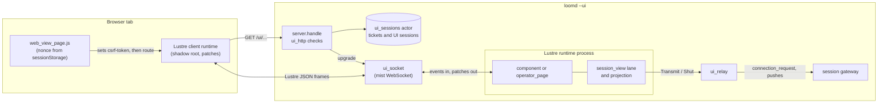
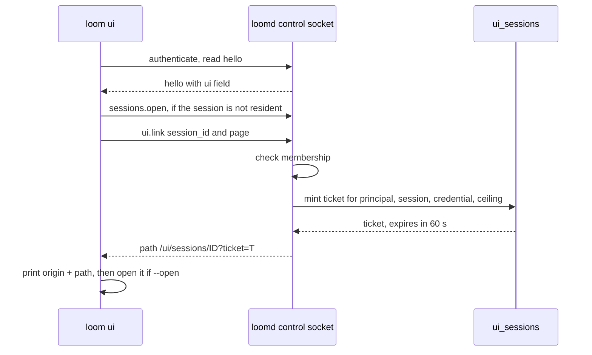
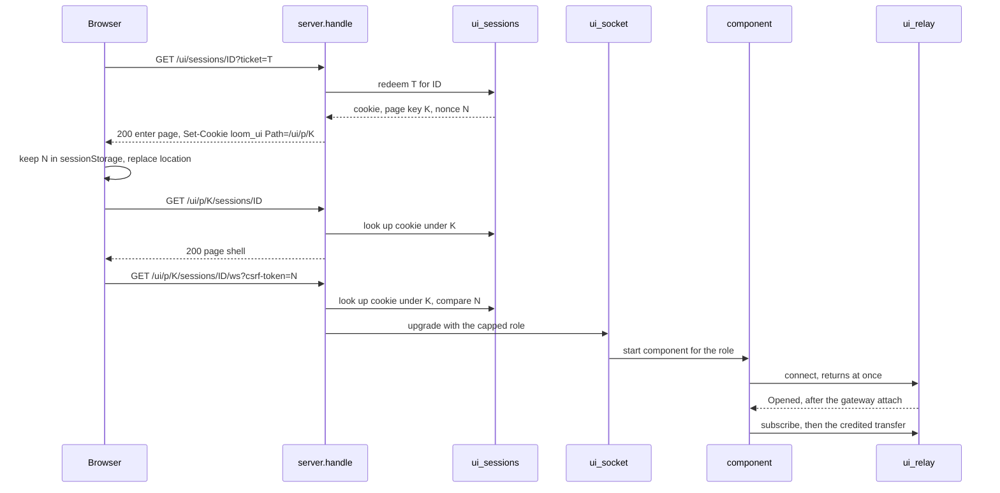
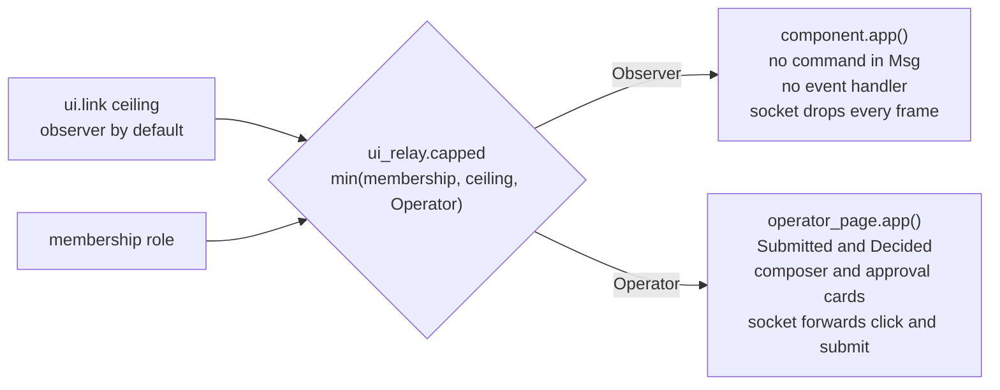

# The web view

`loomd --ui` serves a page for one session to a browser. The page is a
Lustre 5.7.1 server component that runs inside the daemon, and it drives
the same session lane and transcript projection as the terminal, from
`packages/session_view`. The browser runs only Lustre's small client
runtime, which applies the patches the component sends and sends back the
DOM events the component's view asked for. No credential, session state or
session logic reaches the browser.

Three terms recur below and name different things. **The session lane**,
or the lane, is one attached client's connection to one session,
`session_view/session_channel.Channel`: each terminal and each page holds
its own, and a lane carries the frames of every strand in the session. **A
strand** is one conversation thread in the session, such as `main`, the
advisor or `sub:reviewer`. **The transcript** is what the page draws of one
strand's entries; today that strand is always `main`. So one page has one
lane, the lane sees every strand, and the transcript shows one of them.

The view is off unless the daemon was started with `--ui`. With it off, the
listener routes exactly `/v2/control` and `/v2/sessions/<id>/ws`, and the
control `hello` does not mention the view. A person gets a page by running
`loom ui --session <id>`, which prints a single-use link.

This document describes how the view is built. The decisions behind it are
in [ADR-014](../adr/014-second-runtime.md) (one engine, two views) and
[protocol-change/051](../../protocol-change/051-web-view-route.md) (the
routes, the tickets and cookies, and the operator addendum).
[protocol-change/052](../../protocol-change/052-web-view-remote-origin.md)
proposes serving the page behind a TLS origin; it is a design and is not
implemented. [Writing the web view with Lustre](../lustre.md) is the
companion guide to Lustre itself: how server components work, the rules
for view code, and the checklist for a change. This document links to it
rather than repeating it. The [web UI design note](../design-notes/web-ui.md)
is the working spec for where the page is going.

## Why a second runtime exists

The terminal is one person at one keyboard. Loom's sessions are shared: an
owner invites operators and observers, and several people can watch the
same agents work ([multiplayer](multiplayer.md)). A browser page lets a
person follow a session without a terminal attached, and it is where the
agent-first, multi-session views of the design note will live.

The page could have been built three other ways, and each was rejected for
a stated reason ([ADR-014](../adr/014-second-runtime.md), "Alternatives
considered"):

- **A single-page app that speaks the protocol from the browser.**
  `session_view` compiles to JavaScript, so the lane could run there. It
  would put the person's bearer credential in the browser, and it would
  make the browser a second place where session behaviour must match the
  terminal's.
- **A sidecar program that serves the page.** Per-person authentication
  needs the daemon's own credential store, which a sidecar does not have.
- **A web model of its own.** Less code at first, and a rewrite later.

The server component keeps the engine on the BEAM, next to the terminal's
copy of the same code. One rule follows, and reviews hold the code to it:
**the web view grows no session logic of its own.** What a frame means,
when to catch up, which lines a capture becomes, and what an operator's
input becomes on the wire are `session_view`'s. [The client engine and its
hosts](client.md#the-client-engine-and-its-hosts) draws the layering this
rule keeps.

## What runs where

Each open page is three processes in the daemon, plus the client runtime
in the browser.

- **The browser** holds the page shell, Lustre's client runtime (served
  from the `lustre` application's `priv` directory), the stylesheet and
  two small scripts. It keeps the page nonce in `sessionStorage` and never
  holds a credential.
- **The router** is `client/daemon/server.handle`, which sends every
  `/ui/...` path to the web view's checks (`web_view` at
  `packages/client/src/client/daemon/server.gleam:163`) when the view is
  on. The checks themselves are pure functions of the request in
  `client/daemon/ui_http`.
- **`client/daemon/ui_sessions`** is one `weft/actor` that owns the ticket
  and UI-session tables. Every mint, redemption and lookup is a call to
  it, so a ticket is redeemed at most once.
- **`client/daemon/ui_socket`** is the page's WebSocket. It takes the
  connection permit's custody, starts one Lustre runtime for the
  connection, forwards the browser's frames that the page's role allows,
  and writes the runtime's patches to the browser.
- **The Lustre runtime** runs `web_view/component` for an observer or
  `web_view/operator_page` for an operator. The engine lives inside its
  model: a `session_channel.Channel`, an inbox of frames not yet reduced,
  and the rows and approvals projected from the last capture.
- **`client/daemon/ui_relay`** stands in for a session socket. It attaches
  to the session's gateway with the page's principal and capped role,
  turns each frame the lane transmits into one bounded
  `gateway.connection_request`, and hands every reply and push back to the
  component as a `connection_event.Message`. One mailbox serializes both,
  as in `session_socket`, so a reply and a push never interleave.

The component is linked to the socket process, and the relay monitors the
component and the gateway. When the browser goes away, the socket shuts
the component down and the relay detaches. When the gateway ends the
attachment, the relay reports it, the socket waits a quarter second so
the component's patch for the ended state is sent, and then closes. [lustre.md](../lustre.md#lifecycle-and-cleanup)
walks that chain one link at a time.

## From `loom ui` to a live socket

A page is reached in four requests: one control command from the person's
own `loom`, then three HTTP requests from the browser.

### Minting the link

`loom ui --session <id> [--operate] [--open]` is `tui.run_view`
(`packages/tui/src/tui.gleam:1005`). It resolves the daemon with
`bootstrap.resolve_viewing_daemon`, which adds `--ui` to the launch
arguments when it has to start one. A daemon that is already running and
whose `hello` has no `ui` field was started without the view; `loom`
prints that, exits with status 1, and leaves that daemon alone, because
other people's terminals may be attached to it. Otherwise it opens the
session if it is not resident and sends `ui.link` with `page:"operator"`
when `--operate` was given and `page:"observer"` otherwise.

The command also takes the daemon options a local launch takes
(`--state-dir`, `--config`, `--server`, `--workspace`), in any order.
`loom --ui ...` is the older spelling and still works: `parse_launch`
takes `--ui` out wherever it appears in argv and hands the rest to the
same parser, `tui.view_request`, so both spellings accept the same
options in the same orders.

The daemon answers `ui.link` only for a member of the session
(`manager.session_authority`), and refuses it with `unavailable` when the
view is off. `ui_sessions.mint` draws a 32-byte ticket from the same
entropy source invitations use and keeps only its SHA-256 digest, with
the principal, the session, the digest of the credential that asked, and
the page's ceiling. The ticket lives 60 seconds (`ticket_ms`) and is spent
by its first redemption. `loom` joins the returned path to the address it
discovered and prints the link as the first line of standard output.
With `--open` it then hands the link to `open` or `xdg-open`
(`tui/view_link`); a failed opener is a note on standard error, not a
failure, because the printed link still works.

### Exchanging the ticket and opening the socket

1. **The exchange.** `GET /ui/sessions/<id>?ticket=<t>` redeems the ticket
   inside the actor. A redemption ends every other UI session of the same
   principal for the same session, then mints three secrets for the new
   one: the `loom_ui` cookie, the page key, and the page nonce. The
   response is a small same-origin page whose body carries the keyed path
   and the nonce as data attributes, and whose script
   (`web_view_enter.js`) stores the nonce in `sessionStorage` and calls
   `location.replace` on the keyed path. A `303` redirect was not used: a
   `SameSite=Strict` cookie is not sent on a redirect that started from
   another site, so a link clicked on a cross-site page would land on a
   `401`.
2. **The page.** `GET /ui/p/<key>/sessions/<id>` returns the shell
   (`web_view/page.shell`), one empty `<lustre-server-component>` element
   and the page script. The script reads the nonce back, sets it as the
   element's `csrf-token` attribute, and only then sets `route`, because
   the client runtime reads the token when `route` is set. A tab with no
   nonce opens no socket and tells the person to run `loom ui` again.
3. **The socket.** The client runtime opens
   `/ui/p/<key>/sessions/<id>/ws?csrf-token=<nonce>`. The router checks the
   `Origin`, the nonce, the cookie under the key, the credential and the
   membership, then resolves the resident session exactly as a terminal's
   socket does, with the role capped by the page's ceiling
   (`web_socket` at `packages/client/src/client/daemon/server.gleam:179`).
   The parser permit it reserves counts the page against the daemon's
   connection limits.
4. **The component.** In its first handler turn the socket takes the
   permit's custody and starts the component for the admitted role
   (`start_page` at `packages/client/src/client/daemon/ui_socket.gleam:347`).
   The component's `init` selects two sources: the transport, whose
   `connect` starts the relay and returns at once, and a deadline timer,
   which it arms for the lane's next due reading once the lane exists.
   The relay attaches to the gateway as its first message and answers
   `Opened` or `Refused`. On `Opened` the component starts the lane, which
   issues `subscribe` and pulls the transfer chunk by chunk, and the first
   `Captured` update puts the transcript on the page.

"Security layers" below lists what each check in steps 1 to 3 stops.

## Two components, chosen by role

The page's role is the smallest of three things: the principal's
membership role, the ceiling the link was minted with, and Operator
(`ui_relay.capped`). A page never carries `Owner`: the one power an owner
has inside a session beyond an operator's is the worktree bytes, and a
page does not need them. Without `--operate` every page is an observer's,
whatever the person's membership says.

- **The observer's page** is `web_view/component`. Its message type is the
  connection's outcome, the timer's subject, batches of arrivals and the
  timer's fire, and nothing else,
  so it has no way to express a command. Its view attaches no event
  handler. Where an operator's page has its composer, it draws a fixed
  line saying the page is read-only. The socket drops every browser frame
  before it reaches the runtime (`observer_accepts`), which also spares
  the component a render per dropped frame.
- **The operator's page** is `web_view/operator_page`. It wraps the
  observer's messages in `Observed` and adds `Submitted(text, delivery)`
  and `Decided(id, seq, answer)`. Its model is the observer's model. The
  commands reach the lane through `component.submit` and
  `component.decide`, which call the engine's command arms in
  `session_view/operator`. The socket forwards only Lustre's `EventFired`
  for `click` and `submit`, alone or in a batch (`operator_accepts`).

The socket's inbound frame limit follows the role: 64 KiB for an
observer's page, which is the daemon's observer limit, and 1 MiB for an
operator's (`operator_frame_limit`), well below a terminal operator's
32 MiB. The largest thing a page sends is a text prompt; image prompts
are not offered from the page.

The role does not change while a page is open. The relay's binding
carries the capped role, and its `check` recomputes the same minimum from
the current membership record at every request and every push. The
gateway refuses a frame unless the answer equals the binding, so a
demotion, a removed membership or a revoked credential closes the page at
its next frame. A reload admits a page for whatever the record and the
ceiling allow then.

## The engine inside the component

The component is the lane's host in ADR-014's sense: it reads what the
engine may not read and performs what the engine decides.

**Delivery.** Delivery is event-driven (ADR-013, the addendum on
event-driven delivery; [delivery.md](delivery.md) traces it end to end).
The selector's mapping for the relay's inbox drains the inbox behind the
frame it matched, up to `arrival_batch` (64) frames, and builds one
`Arrived(messages, at)`. `Arrived` files the batch into a
`session_view/inbox` and reduces it at once: every filed frame goes to the
lane, oldest first, through `operator.drain`, the loop the terminal also
runs, then `session_channel.tick` runs at the batch's reading. One burst
is one message, and so one render: Lustre renders, diffs and broadcasts
once per message whatever the message changed
([lustre.md](../lustre.md#an-empty-reconcile-is-still-broadcast)), and
`delivery_test` counts the patches a burst costs.

There is no periodic tick. After each transition `component.rearm`
cancels the timer it armed before and arms one `process.send_after` for
the lane's `session_channel.next_due`: the in-flight deadline, or the idle
refresh, which is 250 ms until the daemon has pushed a frame and
`pushing_refresh_ms` (5 s) after (see [delivery.md](delivery.md)). The
daemon pushes the roster to a page when it subscribes
([protocol-change/054](../../protocol-change/054-roster-push-on-subscribe.md)),
so a page moves to the 5 s refresh at attach even on a quiet session. When
the timer fires, `Ticked(at)` runs the same reduction. An idle page wakes
once every five seconds, where the 250 ms tick woke it four times a
second.

**Time.** The clock is read in the selector's mapping, when the timer
message or the relay's batch is received, so `update` reads no clock. The
one host action `update` performs is arming the timer, because its
`Timer` handle has to stay in the model for the next arming to cancel.

**Commands.** `component.submit` refuses empty text and text over 256 KiB
(`prompt_limit`) with a notice. Otherwise it drains what was filed, then
calls `operator.submit`, which asks the lane for a `prompt` or a `steer`
on `main`. `component.decide` finds the pending record with exactly the
drawn escalation ID and sequence (`operator.drawn`) and encodes an
`approve` or a `deny` that echoes that record's action digest, grants and
`expected_seq`. A record that moved after its card was drawn is not
decided, and the page says so. The lane itself refuses a mutation when the
attachment's role is observer (`session_channel.can_mutate`), which is a
third layer under the component's type and the gateway's role check.

**Effects.** The lane's outputs, `Transmit(socket, frame)` and
`Shut(socket)`, are performed through the transport inside one
`effect.from`, in the order the lane queued them. The component holds no
recorder, so its recorder type is `Nil` and the lane never queues a
`Note`. The interpreter has the shape of the terminal's
`tui/terminal_lane.perform`.

**Projection.** When the lane reports `Captured`, `component.apply`
projects the capture once, with `transcript.project_rows`, into keyed
rows for `main`, and folds the capture's escalation cells into the
approval list. Only durable records are drawn: the component ignores
`Streamed` and `ToolStreamed`, so the page shows no live answer or tool
tail. The terminal's streaming live tail (`tui/live_tail`, held in
`View.live_tail`) is terminal view state and has no counterpart here yet.

## Security layers

The page is served from loopback, and loopback does not protect a page:
every other page the browser loads can reach it, including through DNS
rebinding, and any program on another loopback port receives cookies for
the host. Protocol-change/051 sets the threat model. The case that matters
most is the session's own agent, whose tools can reach the loopback
listener unless the session runs with `--network off`, trying to drive an
operator's page and answer its own escalations. Each layer below stops a
named attack, and several are independent, so that any one of them alone
keeps a page from acting.

| Layer | What it stops | Where |
|---|---|---|
| `--ui` flag | Any `/ui` surface on a daemon that did not ask for one. | `client/daemon/main`, `server.handle` |
| Loopback `Host` | DNS rebinding: an attacker's page reaches the listener under its own host name and gets `403`. | `ui_http.loopback_host` |
| Single-use ticket | A replayed or forwarded link. 60 s, redeemed once inside one actor, digest stored, minted only for a member. | `ui_sessions.mint`, `ui_sessions.redeem` |
| `Sec-Fetch-Site` | Another site, or another loopback port, driving the exchange or navigating to the keyed page. Only `none` and `same-origin` pass. | `ui_http.navigation_allowed` |
| Cookie attributes | Script reading the cookie (`HttpOnly`) and cross-site requests sending it (`SameSite=Strict`). No `Max-Age`; the UI session lives 8 hours. | `ui_http.set_cookie` |
| Page key | The cookie reaching other ports. Its `Path=/ui/p/<key>` means a browser sends it only to a path holding the key. The unkeyed page route is `404`. | `ui_http.route`, `page_grant` |
| Page nonce | A server on another port that learned the key. The nonce is delivered once, in the exchange body, and kept in `sessionStorage`, which is scoped by port. The socket compares its digest in constant time. | `page.enter`, `ui_sessions.admits` |
| `Origin` on upgrade | A page on another origin, including another loopback port, opening the socket. It must equal `http://` and the request's `Host`. | `ui_http.origin_matches` |
| Credential and membership | A page outliving its authority. Every page request re-authenticates the minting credential and its membership, and the gateway re-checks at every frame. | `page_grant`, `ui_relay.while_open` |
| Role ceiling | An operator's power by default. A page is an observer's unless minted with `--operate`, and never above Operator. | `ui_relay.capped` |
| Component type | An observer's page sending a command. Its `Msg` has no command and its view no handler; the socket drops every frame. | `web_view/component`, `ui_socket.observer_accepts` |
| Approval card rules | Tricking the person into approving (below). | `web_view/operator_page` |
| Text only | Script injected through session content. Session text is drawn only as text nodes; no attribute, handler, key or URL is built from it. | `web_view/component`, `web_view/operator_page` |
| Response headers | Inline script and style, framing, `Referer` leaks of the ticket and key, caching. | `ui_http.secured`, `page.content_security_policy` |

The approval card follows its own rules, because it is where an agent
would try to trick the person into approving:

- It is drawn from the escalation record alone
  (`approval.presentation`), never from transcript text, in a region
  below the composer that transcript content cannot occupy, and in a style
  no transcript line uses. Below, not above: the agent chooses when a card
  appears and how tall it is, and a card drawn above the composer could
  move a button under a click already on its way to Send.
- Deny comes first, each button names the tool ("Deny bash", "Allow bash
  once"), nothing has `autofocus`, and a new card never takes focus.
- Enter in the composer is a newline. A draft is sent only by the form's
  own Send, Queue or Steer button, and the form's submit never carries a
  decision.
- The page offers allow once and deny. Allow for the session is left out,
  because a remembered grant outlives the page that gave it.
- Cards are keyed by the record's sequence, so a click in flight while the
  list shifts reaches the same card or none.

What the layers do not defend: a process that can read the browser's
profile gets the cookie, and with the key and a live tab's nonce, an
operator's page for one session for up to 8 hours or until revocation.
`loom ui --open` passes the ticket in the opener's argument vector,
which other local users can read with `ps` while the opener runs; printing
the link without `--open` avoids that. A daemon restart ends every UI
session, since the tables live in memory.

## Lustre specifics that shape the code

Four properties of Lustre 5.7.1 decide the shape of `web_view`. Each is
covered in full in [lustre.md](../lustre.md).

- **`effect.batch` does not order its effects, and the server runtime
  performs them in reverse.** The lane's outputs must leave in the order
  the lane decided them, so `component.perform` runs the whole list inside
  one `effect.from`. The component uses `effect.batch` only for effects
  that do not depend on each other: in `init`, opening the transport and
  selecting the timer; and in `Opened`, the subscribe the lane wrote and
  whatever the first reduction wrote after it
  ([lustre.md](../lustre.md#what-differs)).
- **`init` and its effects must finish within a 1000 ms start timeout.**
  The gateway's attach can take longer, so the transport's `connect`
  starts the relay and returns at once, and the relay attaches as its own
  first message and answers on a subject the component selected in `init`
  ([lustre.md](../lustre.md#process-model)).
- **A browser event names its target by path, and a path segment is the
  child's key.** Lists whose items change are keyed by identities the
  engine owns: the transcript by `transcript.Row.key`, which names the
  durable sequence, block and line a row came from; approval cards by the
  record's sequence; and the composer's editor by the count of sent
  drafts, which is how the uncontrolled editor is emptied after a send
  ([lustre.md](../lustre.md#only-events-you-attach-can-arrive)).
- **Every message runs `view` on the whole model and diffs the whole
  tree.** Nothing skips the render when the model did not change, and an
  idle page receives a patch per message, which is why arrivals are
  batched before `update`. So the rows are projected once, in
  `apply`, when a capture arrives, and `component.transcript_view` is
  memoized on them with `element.memo`, which skips both the view call and
  its diff while the rows are unchanged
  ([lustre.md](../lustre.md#cost-of-a-message-and-sizing)).

Two further rules come from the runtime's process model: every
`server_component.select` runs once, from `init`, because a selector added
later is never removed; and the socket sends `lustre.shutdown()` when the
browser goes away, because a runtime outlives its last client.

## What is not built yet

- **Remote access.** A page reached through a TLS proxy at a listed
  origin, with a `__Host-` cookie and a `wss:` policy, is
  [protocol-change/052](../../protocol-change/052-web-view-remote-origin.md),
  proposed and not implemented. Today a remote person reaches the page
  through `ssh -L`, which presents a loopback `Host`.
- **The extracted step.** The page drives the lane and the projection, not
  the terminal's step. Strand focus, history paging, streams and the
  auxiliary reads wait for the four changes ADR-014 lists under "Why the
  step waits for the build-out phase".
- **One strand, one session.** The page shows and addresses `main`. The
  routes already carry the session ID, so a later page can mount one
  component per session or agent.

## Where the code lives

| Path | What it owns |
|---|---|
| `packages/web_view/src/web_view/component.gleam` | The observer's application: the lane's host, event-driven delivery (a batch per burst, one timer for the lane's next due reading), the command arms `submit` and `decide`, projection on `Captured`, the keyed and memoized transcript. |
| `packages/web_view/src/web_view/operator_page.gleam` | The operator's application: `Submitted` and `Decided`, the uncontrolled composer and its total form decoder, the approval cards. |
| `packages/web_view/src/web_view/page.gleam` | The shell, the exchange page, the two scripts, the stylesheet, the keyed paths and the content security policy. |
| `packages/client/src/client/daemon/server.gleam` | `/ui` routing and its check order, `ui.link`, and the `hello` `ui` field. |
| `packages/client/src/client/daemon/ui_http.gleam` | Pure request checks and response headers: route, host, `Sec-Fetch-Site`, origin, cookies. |
| `packages/client/src/client/daemon/ui_sessions.gleam` | The ticket and UI-session actor: mint, single-use redeem, lookup, key and nonce comparison, sweep. |
| `packages/client/src/client/daemon/ui_socket.gleam` | The page's WebSocket: permit custody, the component chosen by role, frame filtering, shutdown. |
| `packages/client/src/client/daemon/ui_relay.gleam` | The relay into the gateway, the role cap, and the four ways a page ends. |
| `packages/tui/src/tui.gleam` (`run_view`), `packages/tui/src/tui/view_link.gleam` | `loom ui`: daemon resolution, `ui.link`, printing and opening the link. |
| `packages/session_view/src/session_view/operator.gleam` | What an operator's input becomes on the wire, shared with the terminal. |

Tests: `web_view/test/component_test` and `operator_page_test` drive the
components through `lustre/dev/simulate`; `client/web_view_parity_test`
checks that the component draws the lines the terminal's projection draws
for the same capture; `client/ui_http_test`, `ui_route_test`,
`ui_sessions_test`, `ui_socket_test`, `ui_relay_test` and
`web_operator_page_test` cover the route's defences and the relay's ends.
