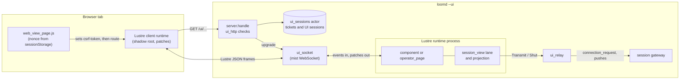
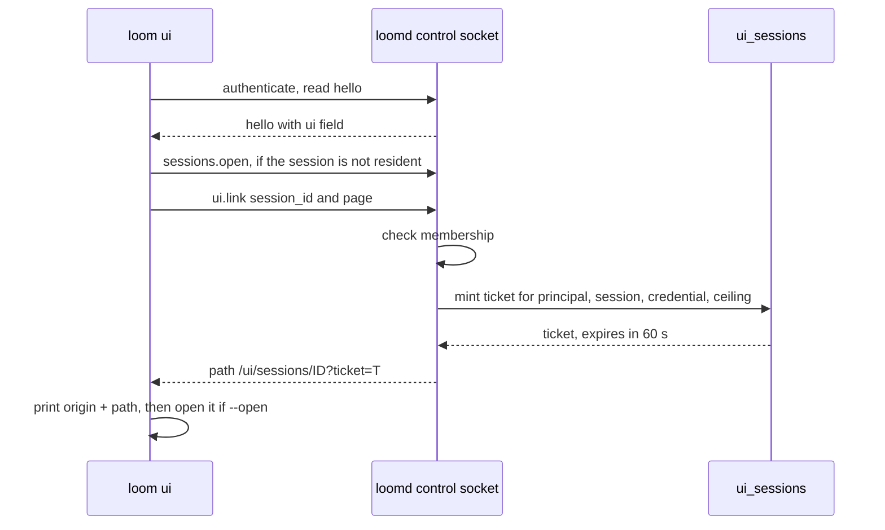
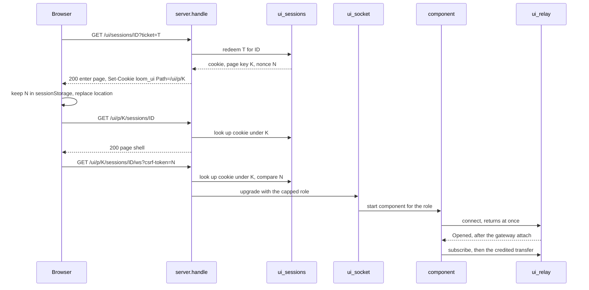
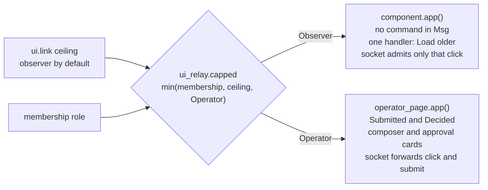

# The web view

`loomd --ui` serves a page for one session to a browser. The page is a
Lustre 5.7.1 server component that runs inside the daemon, and it drives
the same session lane and transcript projection as the terminal, from
`packages/session_view`. The browser runs only Lustre's small client
runtime, which applies the patches the component sends and sends back the
DOM events the component's view asked for. No credential, session state or
session logic reaches the browser.

Three terms recur below and name different things. **The session lane**,
or the lane, is one attached client's connection to one session,
`session_view/session_channel.Channel`: each terminal and each page holds
its own, and a lane carries the frames of every strand in the session. **A
strand** is one conversation thread in the session, such as `main`, the
advisor or `sub:reviewer`. **The transcript** is what the page draws of one
strand's entries; today that strand is always `main`. So one page has one
lane, the lane sees every strand, and the transcript shows one of them.

The view is off unless the daemon was started with `--ui`. With it off, the
listener routes exactly `/v2/control` and `/v2/sessions/<id>/ws`, and the
control `hello` does not mention the view. A person gets a page by running
`loom ui --session <id>`, which prints a single-use link.

This document describes how the view is built. The decisions behind it are
in [ADR-014](../adr/014-second-runtime.md) (one engine, two views) and
[protocol-change/051](../../protocol-change/051-web-view-route.md) (the
routes, the tickets and cookies, and the operator addendum).
[protocol-change/052](../../protocol-change/052-web-view-remote-origin.md)
proposes serving the page behind a TLS origin; it is a design and is not
implemented. [Writing the web view with Lustre](../lustre.md) is the
companion guide to Lustre itself: how server components work, the rules
for view code, and the checklist for a change. This document links to it
rather than repeating it. The [web UI design note](../design-notes/web-ui.md)
is the working spec for where the page is going.

## Why a second runtime exists

The terminal is one person at one keyboard. Loom's sessions are shared: an
owner invites operators and observers, and several people can watch the
same agents work ([multiplayer](multiplayer.md)). A browser page lets a
person follow a session without a terminal attached, and it is where the
agent-first, multi-session views of the design note will live.

The page could have been built three other ways, and each was rejected for
a stated reason ([ADR-014](../adr/014-second-runtime.md), "Alternatives
considered"):

- **A single-page app that speaks the protocol from the browser.**
  `session_view` compiles to JavaScript, so the lane could run there. It
  would put the person's bearer credential in the browser, and it would
  make the browser a second place where session behaviour must match the
  terminal's.
- **A sidecar program that serves the page.** Per-person authentication
  needs the daemon's own credential store, which a sidecar does not have.
- **A web model of its own.** Less code at first, and a rewrite later.

The server component keeps the engine on the BEAM, next to the terminal's
copy of the same code. One rule follows, and reviews hold the code to it:
**the web view grows no session logic of its own.** What a frame means,
when to catch up, which lines a capture becomes, and what an operator's
input becomes on the wire are `session_view`'s. [The client engine and its
hosts](client.md#the-client-engine-and-its-hosts) draws the layering this
rule keeps.

## What runs where

Each open page is three processes in the daemon, plus the client runtime
in the browser.

- **The browser** holds the page shell, Lustre's client runtime (served
  from the `lustre` application's `priv` directory), the stylesheet and
  two small scripts. It keeps the page nonce in `sessionStorage` and never
  holds a credential.
- **The router** is `client/daemon/server.handle`, which sends every
  `/ui/...` path to the web view's checks (`web_view` at
  `packages/client/src/client/daemon/server.gleam:186`) when the view is
  on. The checks themselves are pure functions of the request in
  `client/daemon/ui_http`.
- **`client/daemon/ui_sessions`** is one `weft/actor` that owns the ticket
  and UI-session tables. Every mint, redemption and lookup is a call to
  it, so a ticket is redeemed at most once.
- **`client/daemon/ui_socket`** is the page's WebSocket. It takes the
  connection permit's custody, starts one Lustre runtime for the
  connection, forwards the browser's frames that the page's role allows,
  and writes the runtime's patches to the browser.
- **The Lustre runtime** runs `web_view/component` for an observer or
  `web_view/operator_page` for an operator. The engine lives inside its
  model, which is two records: the shared session state
  (`session_view/model.Shared`, holding the `session_channel.Channel`, the
  inbox of frames not yet reduced, the last capture, the history window,
  the approvals and the agent rows) and what only the page holds (the
  transport, the timer, the rows and the strip it draws, the connection's
  status).
- **`client/daemon/ui_relay`** stands in for a session socket. It attaches
  to the session's gateway with the page's principal and capped role,
  turns each frame the lane transmits into one bounded
  `gateway.connection_request`, and hands every reply and push back to the
  component as a `connection_event.Message`. One mailbox serializes both,
  as in `session_socket`, so a reply and a push never interleave.

The component is linked to the socket process, and the relay monitors the
component and the gateway. When the browser goes away, the socket shuts
the component down and the relay detaches. When the gateway ends the
attachment, the relay reports it, the socket waits a quarter second so
the component's patch for the ended state is sent, and then closes. The
reason is a closed type (`web_view/ending`), so the page draws a fixed
notice for it, and the close code follows from it: 1000 (final, the client
runtime does not reconnect) when the person has to act, 4000 (retried) when
the daemon may clear it. [lustre.md](../lustre.md#lifecycle-and-cleanup)
walks that chain one link at a time.

## From `loom ui` to a live socket

A page is reached in four requests: one control command from the person's
own `loom`, then three HTTP requests from the browser.

### Minting the link

`loom ui --session <id> [--operate] [--open]` is `tui.run_view`
(`packages/tui/src/tui.gleam:1024`). It resolves the daemon with
`bootstrap.resolve_viewing_daemon`, which adds `--ui` to the launch
arguments when it has to start one. A daemon that is already running and
whose `hello` has no `ui` field was started without the view; `loom`
prints that, exits with status 1, and leaves that daemon alone, because
other people's terminals may be attached to it. Otherwise it opens the
session if it is not resident and sends `ui.link` with `page:"operator"`
when `--operate` was given and `page:"observer"` otherwise.

The command also takes the daemon options a local launch takes
(`--state-dir`, `--config`, `--server`, `--workspace`), in any order.
`loom --ui ...` is the older spelling and still works: `parse_launch`
takes `--ui` out wherever it appears in argv and hands the rest to the
same parser, `tui.view_request`, so both spellings accept the same
options in the same orders.

The daemon answers `ui.link` only for a member of the session
(`manager.session_authority`), and refuses it with `unavailable` when the
view is off. `ui_sessions.mint` draws a 32-byte ticket from the same
entropy source invitations use and keeps only its SHA-256 digest, with
the principal, the session, the digest of the credential that asked, and
the page's ceiling. The ticket lives 60 seconds (`ticket_ms`) and is spent
by its first redemption. `loom` joins the returned path to the address it
discovered and prints the link as the first line of standard output.
With `--open` it then hands the link to `open` or `xdg-open`
(`tui/view_link`); a failed opener is a note on standard error, not a
failure, because the printed link still works.

### Exchanging the ticket and opening the socket

1. **The exchange.** `GET /ui/sessions/<id>?ticket=<t>` redeems the ticket
   inside the actor. A redemption ends no other page, except that a
   principal already holding `ui_sessions.max_pages` (four) live pages for
   the session has its oldest ended to make room (protocol-change/051, the
   addendum on several pages). It mints three secrets for the new page: the `loom_ui` cookie, the page key, and the page nonce. The
   response is a small same-origin page whose body carries the keyed path
   and the nonce as data attributes, and whose script
   (`web_view_enter.js`) stores the nonce in `sessionStorage` under `loom-page-nonce.<key>` and calls
   `location.replace` on the keyed path. A `303` redirect was not used: a
   `SameSite=Strict` cookie is not sent on a redirect that started from
   another site, so a link clicked on a cross-site page would land on a
   `401`.
2. **The page.** `GET /ui/p/<key>/sessions/<id>` returns the shell
   (`web_view/page.shell`), one empty `<lustre-server-component>` element
   and the page script. The script reads the nonce back, sets it as the
   element's `csrf-token` attribute, and only then sets `route`, because
   the client runtime reads the token when `route` is set. A tab with no
   nonce opens no socket and tells the person to run `loom ui` again.
3. **The socket.** The client runtime opens
   `/ui/p/<key>/sessions/<id>/ws?csrf-token=<nonce>`. The router checks the
   `Origin`, the nonce, the cookie under the key, the credential and the
   membership, then resolves the resident session exactly as a terminal's
   socket does, with the role capped by the page's ceiling
   (`web_socket` at `packages/client/src/client/daemon/server.gleam:344`).
   The parser permit it reserves counts the page against the daemon's
   connection limits.
4. **The component.** In its first handler turn the socket takes the
   permit's custody and starts the component for the admitted role
   (`start_page` at `packages/client/src/client/daemon/ui_socket.gleam:3977`).
   The component's `init` selects two sources: the transport, whose
   `connect` starts the relay and returns at once, and a deadline timer,
   which it arms for the lane's next due reading once the lane exists.
   The relay attaches to the gateway as its first message and answers
   `Opened` or `Refused`. On `Opened` the component starts the lane, which
   issues `subscribe` and pulls the transfer chunk by chunk, and the first
   `Captured` update puts the transcript on the page.

"Security layers" below lists what each check in steps 1 to 3 stops.

## Two components, chosen by role

The page's role is the smallest of three things: the principal's
membership role, the ceiling the link was minted with, and Operator
(`ui_relay.capped`). A page never carries `Owner`: the one power an owner
has inside a session beyond an operator's is the worktree bytes. The gateway
still refuses a page that read, but an owner's page and an operator's page
are handed a daemon-run read of the workspace for the Changes tab, under an
admission of its own that is checked again at every read (protocol-change/051,
the addendum of 2026-10-05). Without `--operate` every page is an observer's,
whatever the person's membership says.

- **The observer's page** is `web_view/component`. Its message type is the
  connection's outcome, the timer's subject, batches of arrivals, the
  timer's fire, `OlderRequested`, a read of older history, `FocusRequested`,
  a change of the strand the page shows, the sidebar read's answer
  `SessionsListed` and the daemon's answer to a request to open a session,
  `Linked` (both dispatched by effects and carried by no handler), and
  nothing else, so it has no way to express a command or to ask for a
  session. Its view attaches two kinds of event handler: the lane's "Load
  older" click, drawn only while older rows exist (051, the addendum on
  history paging), and one click per chip of the agent strip (051, the
  addendum on strand focus). Where an operator's page has its composer, it
  draws a fixed line saying the page is read-only. The socket admits only a
  click at the button's fixed path (`component.older_path`) or beneath the
  strip's chip list (`component.strip_path`), and drops every other browser
  frame before it reaches the runtime (`observer_accepts`), which also
  spares the component a render per dropped frame.
- **The operator's page** is `web_view/operator_page`. It wraps the
  observer's messages in `Observed` and adds `Submitted(text, delivery)`
  and `Decided(id, seq, answer)`. The lane's "Load older" button sends
  the observer's own `OlderRequested`, wrapped. Its model is the
  observer's model. The inputs reach the shared step through
  `component.submit` and `component.decide`, which wrap them as the step's
  commands (`msg.Submit` and `msg.Decide`, run by `session_view/commands`),
  and the read through `component.older`. The socket forwards only
  Lustre's `EventFired` for `click` and `submit`, alone or in a batch
  (`operator_accepts`). A draft may be any session command, since the page
  parses it as the terminal does; the socket's admitted events and the role
  checks are as they were (protocol-change/051, the addendum "the operator
  page runs session commands"). The page also has buttons for commands the
  terminal runs from a typed draft, `Controlled(control)` and
  `Replying(key)`, which are clicks and submits like the rest (the
  addendum "the page's session controls, the pending nudges and the peer
  reply", and the addendum of 2026-10-02): the goal's Pause, Resume and
  Clear, a Fork form, and a Reply button on a peer's message. The goal's
  buttons and the Fork form are in the Session pane, after the invitation
  control, and the dock keeps one goal line while a goal is active or paused
  (the addendum of 2026-10-03). A control's
  command is `msg.Control`, which has no draft, so it never empties the
  composer. Stop and the Set goal form are gone: stopping a strand is the
  terminal's Escape, and a goal is pinned by typing `/goal ...` in the
  composer, which the page parses as a command.
  The advisor's pending nudges are a card on both pages with no button,
  because the queue has no accept or dismiss command. It sits under the
  strand panel's four panes, on every tab, so the dock holds only what the
  operator types into or answers.

The socket's inbound frame limit follows the role: 64 KiB for an
observer's page, which is the daemon's observer limit, and 12 MiB for an
operator's (`operator_frame_limit`), below a terminal operator's 32 MiB. The
largest thing a page sends is a draft with up to four images and 8 MiB of them,
at their base64 size, in one `submit` event (051, the addendum on images).

## Images

A row that carries images draws each raster one as a thumbnail, on both pages.
`session_view/transcript_image` names them (a row's key and a position) and
`view/lane` draws a `
` whose `src` is
`<session>/image/<row>/<position>`, relative to the page's address, so the
policy's `img-src 'self'` admits it and no `data:` or `blob:` source exists. The
daemon answers `GET /ui/p/<key>/sessions/<id>/image/<row>/<position>` after the
host, the shape, the fetch site (`same-origin` or `none`) and the page grant,
by asking the page's component whether it drew that image: the page socket
registers, under the page's cookie in `ui_sessions`, a function that sends the
component `ImageRequested` with `lustre.dispatch`. What comes back is checked by
`web_view/image.serve` (a raster type, base64 that decodes, at most 20 MiB, and a
magic number that says the type) and sent with the view's headers, so the browser
draws what was checked.

An operator's composer draws `<loom-attach>`, which reads files, pasted images and
images dropped on the composer (`drop_rule`; `drop_guard` stops a file dropped
elsewhere from navigating the tab) in the browser and submits them as one form field, a JSON array of base64
strings, with the draft. `component.submit` runs `web_view/image.admit` on them,
which reads each type from its bytes and bounds the count and the total, and the
prompt goes out as `prompt_content` through the shared step. One bad image
refuses the whole prompt with a notice.

The role does not change while a page is open. The relay's binding
carries the capped role, and its `check` recomputes the same minimum from
the current membership record at every request and every push. The
gateway refuses a frame unless the answer equals the binding, so a
demotion, a removed membership or a revoked credential closes the page at
its next frame. A reload admits a page for whatever the record and the
ceiling allow then.

## The engine inside the component

The component is a host in ADR-014's sense: it reads what the engine may
not read and performs what the engine decides, and it holds no session
logic. Its model is two records, as the terminal's is. `shared` is
`session_view/model.Shared(socket, Nil, Nil, Nil)`, the session state the
shared step reads and writes; the component has no recorder and its two
inboxes have no sources to tell apart, so the last three handle parameters
are `Nil`. `view` is what only this host holds. The component writes
`shared` in two places, both the page's own: it trims the history window to
the rows the page draws, and it marks the window as wanting older rows.

**Delivery.** Delivery is event-driven (ADR-013, the addendum on
event-driven delivery; [delivery.md](delivery.md) traces it end to end).
The selector's mapping for the relay's inbox drains the inbox behind the
frame it matched, up to `arrival_batch` (64) frames, and builds one
`Arrived(messages)`. `update` turns it into two step messages in one
Lustre message: `step.update(msg.Arrived(..))` files the frames into the
record's `session_view/inbox` and reduces nothing, and a `Ticked` input
then drains every filed frame to the lane, oldest first, and ticks the
lane. One burst is one message, and so one render: Lustre renders, diffs
and broadcasts once per message whatever the message changed
([lustre.md](../lustre.md#an-empty-reconcile-is-still-broadcast)), and
`delivery_test` counts the patches a burst costs.

There is no periodic tick. After each transition `component.rearm`
cancels the timer it armed before and arms one `process.send_after` for
the lane's `session_channel.next_due`: the in-flight deadline, or the idle
refresh, which is 250 ms until the daemon has pushed a frame and
`pushing_refresh_ms` (5 s) after (see [delivery.md](delivery.md)). The
daemon pushes the roster to a page when it subscribes
([protocol-change/054](../../protocol-change/054-roster-push-on-subscribe.md)),
so a page moves to the 5 s refresh at attach even on a quiet session. When
the timer fires, `Ticked` runs the same tick. An idle page wakes once
every five seconds, where the 250 ms tick woke it four times a second.
`Opened` adopts the lane and ticks, so frames filed before the lane
existed are drained in order.

**Time.** `component.update` reads the transport's clock once, at its top,
and every step the message takes runs at that reading, as the terminal's
`runtime.message` stamps each input once. The step reads no clock: the
messages it is given carry the reading as a `msg.Stamp`, and the shared
record stores it. The component's own messages carry no reading, and
neither selector mapping reads a clock: `update` takes the reading when it
takes the message. The one host action `update`
performs is arming the timer, because its `Timer` handle has to stay in
the model for the next arming to cancel. Tests give the transport a
settable clock (`page_fixture.clock`).

**Commands.** `component.submit` refuses empty text and text over 256 KiB
(`prompt_limit`) with a notice, since those are the page socket's limits.
It then parses the draft with `command.parse_with_skills`, as the terminal
does. A `command.Session` goes to the shared step as `msg.Submit`, run by
`commands.act`, so `/compact` is a compaction and `/model`, `/fork`,
`/goal` and the rest run as they do in the terminal, and an unknown
command is refused as the terminal refuses it. A `command.Surface` is
refused with a notice and never sent, and so are `/add-dir` and
`/add-write-dir`, which name a path on the daemon's host that a browser
reader can neither see nor pick (`component.page_command`). The page loads
no skills catalogue, so a skill's slash command is refused as unknown until
it does. `component.decide` finds the pending record with exactly the drawn
escalation ID and sequence (`operator.drawn`) and hands the step
`msg.Decide`, which encodes an `approve` or a `deny` that echoes that
record's action digest, grants and `expected_seq`. A record that moved after
its card was drawn is not decided, and the page says so. A decision takes
the same refusals as any mutation (`outbound.mutation_refusal`): it is
refused when the strand is unknown, when no conversation is attached, and
when the lane cannot take a mutation (`session_channel.mutation_available`:
another mutation is in flight, the queued slot is taken, the attachment is
read-only, or the lane has not synchronized). The card stays and the
operator presses again. On a synchronized lane a read in flight does not
refuse it, and the lane queues the decision behind the read. The lane
itself refuses a mutation when the attachment's role is observer
(`session_channel.can_mutate`), which is a third layer under the
component's type and the gateway's role check. A decision draws a row in
the transcript ("Owner allowed bash") from the approval ledger. A page
opened after the decision never saw the request pending, so it sends one
`escalations_decided` read when its lane first idles after the capture's
reads (`component.decisions_read`; never queued, so an operator's first
command is not refused behind it) and the answer joins the ledger as an
exact lookup does, keyed by escalation id: a decision seen live and read is
one row. The step leaves the facts a
command recorded on the record; the component reads `DraftTaken` to know
the command consumed the composer's draft, then drops them
(`step.forget_surfaces`).

**The composer and its notice.** The editor is drawn inside
`<loom-composer>` (`packages/web_client`), which lists the slash commands as
the draft grows (`web_view/completion` builds its table from the terminal's
suggestions, less what `component.page_command` refuses), sends the draft on
Command or Control with Enter by submitting the form, and puts a prompt the
daemon handed back into the editor. None adds a handler or a socket event.
The page's notice is an outcome, not the shared record's notice: the
refusal the page made, else the daemon's reply to the last command
(`Shared.answer`), else what the step worded when the page ran it. A
returned prompt is taken from `Shared.returned_drafts` at the end of every
message and kept, with a number, for the element (protocol-change/051, the
addendum on the composer's element).

**Effects.** The step returns the effects it decided, and the component
performs them through the transport inside one `effect.from`, in the
order the step decided them: `Transmit(socket, frame)` writes a frame and
`Shut(socket)` closes the relay. The component holds no recorder, so the
step never queues a `Note`. The interpreter has the shape of the
terminal's `tui/terminal_lane.perform`.

**What the page draws.** `component.refreshed` runs at the end of every
message and derives what the page draws from the shared record. It
compares what each projection was built from and rebuilds only what
moved. The blocks and turns are rebuilt when the capture, the history
window, the cache notices, the agent rows or the paging differ from the
inputs of the last projection (`Projected`), and the strip when its inputs
(`Stripped`, less the roster's clock) or a cache label it draws did. The
record's `render_revision` is not the signal. It moves for stream fragments,
which change the live region and nothing a capture projects, and for tool
tails the page does not draw, and a page that re-projected on each would
project once per batch of a streaming answer. The comparison
is of state, so an unchanged input is the same term and costs a pointer
check, and a change of paging forces a reprojection without a `before`
record. A projection folds the history window's branch into keyed blocks
for `main` with `transcript.branch_blocks`, keeps the newest turns that fit
the row limit (below) and lays them out as `turns.Piece` values. Only
durable records are in the blocks; the response still being written is the
live region, below. The page draws no tool tail. After a `history` read is answered, refused or abandoned, the window
is still in the reading mode `history_view.older` set, which the terminal
leaves until its reader scrolls back; `refreshed` resumes it and folds
the newest capture in.

**The live region.** Between a request going out and its answer
committing, the page would say nothing for as long as the model takes. It
draws what the terminal draws for that interval, from the same state: the
shared record's `streams` for the followed strand
(`transcript_lines.display_streams`, which also seeds a stream from the
capture's sampled preview when the page attached mid-answer), the
summarizer's `summaries` for the request's headline (protocol 050), the
generation clock, and the inputs the daemon holds for the strand (the
capture's `pending_inputs`, filtered by `transcript_lines.held_inputs` and
worded by `held_words`, the terminal's own rule), so a steer or a queued
prompt the daemon took is on the page until the capture that no longer lists
it. No read and no socket event is added. `component.live`
turns them into `live.Row`s and `view/live` draws them as the last entry of
the lane's keyed list, keyed `live`:

- a reasoning row, `Reasoning · <loom-elapsed>` and a one-line preview of the
  latest line, a `<loom-expand kind="live">` that opens to the reasoning so far
  as Markdown (cut at the last blank line so only the paragraph being written
  is parsed again), with the headline as text beneath when there is one. An
  open live row hands its open state to the settled row that replaces it. The
  count of lines is the row's title. The time is a `<loom-elapsed offset>` in
  milliseconds since the generation clock started, so the browser counts the
  seconds and the server renders again for a fragment and not to move a
  clock (the chips' mechanism);
- the answer so far, drawn as the lane draws an assistant line, Markdown
  parsed into text nodes.

A tool call the model is composing is not drawn; the capture shows it as a
running call. The region carries `aria-live="off"` so the polite log does
not read an answer out as it grows, and the committed row that replaces it
is announced once.

The hand-over is exact. A pushed entry clears the strand's streams in the
shared record before the capture that gives the page the row, and a page
that drew only what the record holds would show a gap. `component.streamed`
therefore keeps the streams it last drew when the record has none, while
`transcript_lines.response_awaited` says their answer is still owed: the
request's identity names the entry it reserved (`stream_identity`), the
window the page projects does not hold that entry, and the capture still
shows the operation running on the strand. When the capture holds the entry,
the row replaces the region in the same patch, and the keyed list places it
where the region was. When the capture says the operation ended without the
entry (an interrupted answer), the region goes. A request that reserved no
entry (an older daemon) leaves with the record's streams. A stream whose
entry the window already holds is dropped, so a capture that lands before
the push cannot draw the answer twice. A page that attached mid-answer keeps
the capture's sampled preview until the pushed text is at least as long,
where the record alone would shrink the answer to the first fragment.

The patch cost is the region's, and the committed rows do not enter it.
A fragment changes `Shared.streams` and nothing a capture projects, so
`refreshed` projects nothing and every committed line's memo holds
(`live_test` counts the lines a render draws: the live answer's one, and
none of a page's 150). Lustre replaces the text node of the paragraph being
written, so a fragment's patch is that paragraph and a fixed envelope. The
patch does not grow with the answer or the page. Measured in `live_test`
with Lustre's own diff, one fragment of a stream of 120 sentences (paragraphs
of six, about 50 bytes each) costs 107 to 268 bytes on a page of 150 rows, and
the same within two bytes on a page of one; and in `delivery_test` on the
real runtime, a burst of eight fragments is one patch of 576 to 668 bytes and
the burst that opens the region 864. The worst case is a single paragraph as
long as the stream's limit, 24 KiB (`live_stream_limit`), sent again for
each batch.

**What the step does for surfaces the page lacks.** The page runs the
shared step and so does what the step does, including reads for surfaces
it does not draw. After a first capture it reads the strand's notes, to
seed a todo board, which the todo panel draws, and then the session's context, the
advisor's pending nudges and the goal, each when the one before is
answered; it reads the context again when an operation ends and when the
configuration changes. Ten seconds after it opens, and then on a tick at most every ten seconds, it also reads the followed
strand's live jobs for the Session pane (the lane also asks for them whenever a run's completion changes; the delay keeps the startup reads the same as the terminal's):
`live_jobs` is one of the gateway's read-only commands, every role may send
it, and its answer is a snapshot the lane folds like the others, so it adds
no page event. That is four round trips at load that hold the
lane's one command slot, and a context read the daemon answers with a
branch scan on each operation, for every open page. Ruling 12 of the step
extraction design chose that over choosing which reads a host has a
surface for. The step's tick leaves out the block-summary read, because
the daemon may run a summarizer for a label it is asked for and the page
draws no labels. The composer's notice line shows the outcome of the
last command, not the shared record's `notice`, so "notes sent" after that
first read and "streaming text" during an answer do not appear there; only
the page's own refusals are drawn as warnings. The facts a
fold records for surfaces the page lacks are dropped with
`step.forget_surfaces`. That includes a held prompt the daemon hands back
(protocol-change/038's custody return): the page has no editor to put it
in, so the operator does not see it, and it is the prompt's last copy.

## Paging older history

The page holds a bounded number of transcript rows, so its memory does not
grow with the session. Lustre's server runtime keeps every element it
rendered, to diff the next render against, and a row of rendered Markdown
retains several times what a plain row does: 600 Markdown rows held 6.7
MB where the same rows as plain text held 2.5 MB (#587).

**The window.** The page holds the newest `component.live_rows` (150) rows
of `main`. The rows are cut between turns (`turns.grouped`), so the oldest
row the page holds is a turn's input. A turn keyed by its input keeps its
key when rows are added above it or the oldest turn leaves, and its lines'
memos are reused (`lane_memo_test`). When a new capture brings rows, the
oldest turns leave the page. The one exception to the turn boundary is a
single turn longer than the limit, which the page holds from its newest
blocks back. Once rows are cut, the history window is trimmed to the
oldest record the page draws (`history_view.retain_from`), so each capture
projects only what the page draws and the records the capture adds. The
end of a turn whose input is older than the window is not drawn but stays
in the window, so the next read asks for the sequences below it; a turn
longer than one read then arrives over several reads, and is drawn once
its input does. When that end alone no longer fits in the room left, the
page counts the turn as cut. A read that finds none of the strand's
records, because other strands wrote every sequence in it, still moves the
next read below it (`history_view.capture` keeps the progress `accept`
made).

**Load older.** Above the oldest row the lane draws `lane.Top`: the
beginning of the conversation, a "Load older" button, "Loading older
rows…" while a read is out, or a line saying the page is full. The button
sends `component.OlderRequested` on both pages, which `component.older` turns into
`history_view.older`: the history window asks for the interval of at most
100 sequences below its oldest record. The page sends that as a `history`
read on its own lane, the read the terminal pages with
(`session_channel.history`), and the lane's `HistoryPage` update is folded
back with `history_view.accept`. The lane has one request out at a time:
when it is busy the demand stays `Wanted` and is offered again after every
reduction until the lane takes it, and a second press while a read is out
asks nothing. While the read is out the history window is frozen, so a
capture that lands meanwhile cannot move the endpoint the reply is placed
against; the reply, or a refusal, resumes it and folds in the newest
capture.

**The cap.** Loading older rows raises the page's limit to
`component.held_rows` (300). The page still holds the newest rows, so new
rows keep arriving at the bottom. When the page, paged, has to cut a whole
turn to stay within 300 rows, it is `Full`: it keeps its newest 300 rows
and loads no more, and the lane says so. The page refuses rather than
dropping its newest rows because dropping them would stop it following the
session and need a second mode to return to the tail, which the terminal
has and the page does not.

**Keeping the reader's place.** Rows loaded above the reader would move
everything they are reading down by the height of what arrived. The
stylesheet turns the browser's scroll anchoring off for the transcript, so
the page keeps the reader's place itself. `<loom-follow>` hears the click on
the button (it carries a fixed `data-loom-older` marker) as it hears a
fold's toggle: it becomes `Reading`, so the growth that follows does not
scroll to the tail, and it holds the lane's first row and its position on
screen. When that row stops being the lane's first, the older rows have
arrived, and it scrolls the transcript by however far the row moved. This
is the one place the reader's place is kept.

**Observers.** A `history` read is a read. The gateway admits it for an
observer's binding (`gateway.read_only` lists `History`), and the lane
sends it on any attachment (`session_channel.history` checks no role).
Protocol-change/051's addendum on history paging lets the observer's page
carry this one handler: the button's message is `component.OlderRequested`
on both pages, and the page socket admits from an observer a `click` at
`component.older_path` and drops every other frame
(`ui_socket.observer_accepts`). `page_events_test` pins that the
observer's rendered view registers that handler at that path.

## Strand focus and the session sidebar

**Focus.** Each chip of the agent strip is a button whose message is
`FocusRequested(name)`, built from the name the strip was drawn with, so a
browser's click chooses among the chips and cannot name a strand. The
component runs `step.focus` (the terminal's change of strand less its
surfaces: cancel the lane's unsent frames, `commands.focus`,
`commands.load_strand`), drops any history read owed for the strand being
left, and restarts paging at the newest rows. The projection, strip, todo
panel and composer then read the active strand instead of `main`. It is a
change of what the page reads and sends no command, so it is on the
observer's page as well; the gateway and the lane refuse an observer's
mutation as before, and an operator's prompt, steer, queue and commands go
to the strand on screen. The socket admits an observer's click beneath
`component.strip_path` (051, the addendum on strand focus).
`focus_test` covers the behaviour and `page_events_test` the paths.

**The sidebar.** `ui_socket` gives the component `Transport.sessions`, the
authorized catalogue read the terminal's session picker uses
(`manager.authorized_page`) made with the page's credential digest, so a
member sees only their own sessions and a revoked credential none. The read
runs in a weft task of the daemon's (`ui_socket.listed_task`) and answers
as the component's `SessionsListed`, so the page's runtime, which once made
the registry call itself and could wait up to five seconds on a busy
registry with every click and patch held behind it, never waits for it. The
component starts it when the page opens and at most every 30 seconds on a
tick (an observer's page is given an empty list and draws no sidebar, so a
stolen observer link does not disclose the principal's other sessions),
groups it by project (`web_view/sessions`), and `view/sidebar`
draws it as the frame's second child (the left column). A project is the
repository a session's workspace belongs to: the daemon reads it from the
filesystem (`client/daemon/ui_project`: a plain checkout is its own project, a
git worktree's `.git` file is followed to the main repository and accepted only
when the repository's own backlink names the worktree, anything else has none),
with no cache, in the same task that reads the catalogue. It reaches the component as the
entry's `project` field, in process and not on a wire, so it needs no protocol
addendum. The heading is the project's directory name, qualified by its parent
directory when two projects share one; a worktree's row leads its quiet line with the
worktree's name, whose `title` is the whole path. The sidebar lists running sessions
and keeps the saved ones behind a quiet "N saved" line: they stay in the
document, so the session switcher still lists them, and `<loom-saved>` shows
them in place in the browser and remembers the choice in local storage. The row of the session
on screen says what it is doing from the page's own lane (a strand
waiting on a decision, or main's failed last run, needs the person; a strand
with an operation is working; otherwise idle), so it never lags the Strands
panel; the other rows say what the daemon's activity read last answered, which
the component repeats every `activity_refresh_ms` (5 s) on a tick, apart from
the list's 30 s. Projects are listed alphabetically by directory name, so
selecting another session never reorders them, and an idle dot is the same quiet
colour on the home and in the sidebar. An empty `nav` child sits
above the first group for the app's navigation. The entry carries
name, workspace, creation time and residency, and nothing of the registration's
path, key or configuration.

## Switching sessions

A page is bound to one session by its key, cookie and nonce, so opening another
session is a navigation to a new page (051, the addendum on switching
sessions). Only an operator page does it.

- **The request.** On an operator page a sidebar row for a running session
  other than the one on screen is a button (`view/sidebar`, beneath
  `component.sidebar_path`), and a peer message in the lane has an `Open <name>`
  button when the session it names is one of the principal's listed running
  sessions (`component.openable`, `lane.Replies.open`). Both send
  `operator_page.Opening(id)` with the catalogue's identity.
  `component.switch_to` calls `Transport.open`, and the daemon's answer returns
  as `Linked`.
- **The daemon.** `ui_socket.ticket_for` runs the checks afresh with the page's
  credential digest: a canonical identity, `manager.session_authority`
  (membership), `manager.get` (resident), then `ui_sessions.mint_before` with the
  page's principal, its own ceiling and its own reach. `ui_socket.opened_for` refuses an
  observer page without asking. The answer is `sessions.Ticketed(path)` or
  `sessions.Declined(reason)` with the fixed words of `sessions.reason_words`.
- **The browser.** A ticket becomes `component.departure`, which the operator
  page writes into the `to` attribute of the hidden `<loom-switch>`, the
  centre's last child. The element accepts only
  `/ui/sessions/<identity>?ticket=<64 hex digits>` (`switch_rule.target`) and
  calls `location.assign`, so each keyed page is a history entry and Back returns to it (its nonce is kept per page key). The exchange, the keyed page and the nonce are the
  ones `loom ui` already uses, and the page left behind is not ended.
- **What holds.** A page for one session holds no text of another
  (`session_isolation_test`); the sidebar is the one region that lists the
  others. The observer's socket drops a click beneath `component.sidebar_path`.

### The session switcher

Command or Control and K, or the `Search ⌘K` chip in the bar, opens a popover
over the page that lists the pages the bar offers (`Home` on a session page,
`Admin` on the owner's home) and the sessions the sidebar already offers, filtered
by what is typed, and opens one on Enter or a click (protocol-change/051, the
addendum on the session switcher). The chip is drawn by `<loom-shell>` on pages
with a sidebar and carries `data-opens="switcher"`; the switcher's document
listener hears a click whose composed path holds that marker. It is
`<loom-switcher>` (`web_client/switcher`, `switcher_rule`), drawn by
`view/switch.switcher` after `<loom-switch>` as the centre's last child on the
operator's page and the home, so no admitted path moves. When it opens it reads the
page's `.sidebar .session-open` buttons, takes each one's name, workspace and
subtitle as text, and on a choice presses that session's own button, so the daemon
mints the ticket and `<loom-switch>` navigates exactly as for a sidebar press: the
switcher has no route and sends nothing. Every name is a text node of its own view
and the filter only compares strings (`switcher_test` runs it under Node with a name
that holds markup). The one listener serves document `keydown` and `click`,
removed with the element; the popover floats, so it takes `--shadow-float`.

### The tab title

A session page's served document is titled `Loom`: the shell knows the session
only by identity, and the identity names nothing. `view/heading` draws a hidden
`<loom-title>` as the bar's last child (`web_client/title`, `title_rule`), which
reads the bar's heading text and the frame's `needing` attribute and sets
`document.title` to `name — Loom`, with `(N) ` in front while N strands wait. The
name reaches the title only as text assigned on the client; the server's
document escapes whatever it writes and writes no name. The home and admin shells
are `Home — Loom` and `Admin — Loom`.

## Renaming and the subtitle (protocol-change/067)

A session's first prompt names it for the page. The daemon reduces the first
accepted prompt's first line to at most 60 characters, once, and the page draws
it as a text node under the name in the sidebar and as the lead of a home row's
quiet line. It is never an attribute, a class, a key or a title.

An owner's page may rename. The session page's control is the Session pane's
fifth child (`component.rename_path`); the home draws a Rename button after each
row and one open form in place of a row. Both send the typed text and nothing
else. `ui_socket.rename_for` re-derives the page's standing at the click and
makes the registry's owner-checked rename, from a task linked to the page's
runtime, so the runtime never waits on the registry. A member's page and an
observer's page are handed no capability and their sockets drop the event.

Both forms open with the field holding the current name, which the server cannot
write: a name is never an attribute. The field sits in a `<loom-rename>` element
(`web_client/rename`, `rename_rule.copy`) and the form's lead draws the name as a
text node in a span marked `data-loom-name`, inside a container marked
`data-loom-renames`. When the form appears the element copies that text node into
the field if the field is empty, cut to the field's 256 characters, and focuses
it. The markers are fixed and valueless and the element wraps only the input, so
the form's handler paths do not move and the server's HTML has no `value`.

## Inviting from the session page

An owner's operator page has one control that a member's page and every
observer's page lack: "invite to this session" (051, the addendum on inviting
from the session page). It is the last child of the Session pane, at
`component.invite_path`.

- **Who has it.** `ui_socket.role_of` gives a page the role `Owning` when its
  authority is operator and its principal is the daemon's owner. Only `Owning`
  gets `Transport.invite`; the component draws nothing and ignores the message
  without it. The socket admits a click at or beneath the path only for an
  owner (`owner_accepts`), `invite_for` reads the principal again, and
  `manager.administer` authenticates the credential as the owner a last time.
- **A private session.** The invitation control starts as `invites.Unshareable`
  on an owner's page whose `Start.standing.sharing` is `Private` (the daemon
  reads the scope with `manager.session_member_page` in
  `ui_socket.standing_of`, the read the admin page makes; no frame is added).
  `view/share` then draws the admin page's sentence in the control's place and
  no button, and `component.invite` ignores a press, so the refusal that tells
  a browser user to run `loomd` cannot be reached. A scope that could not be
  read leaves the buttons, which the daemon still refuses correctly. The owner's
  page offers `Make shareable` in the same place (protocol-change/065, the
  addendum on making a session shareable): the button asks its question in place
  (`shareables.Move`, held only in the server model), and its confirm sends
  `Transport.shareable`, which runs `shareable_for` in a task no page owns, since
  the stop that begins it ends the page. The page then shows the session-stopped
  notice it always shows and the owner reloads it; the admin page offers the same
  button under a private session's sentence and stays open throughout.
- **The request.** Two buttons, observer and operator, send
  `operator_page.Inviting(role)`; a third, "Hide the token", sends
  `Dismissing`. `component.invite` moves the control from `Ready` to `Asking`,
  and the daemon's answer returns as `Invited`. A press while a request is out
  or an invitation is on screen asks nothing.
- **The daemon.** `ui_socket.invite_for` checks that the page is still open and
  that the principal is the owner, takes one of the credential's three
  invitations an hour (`ui_sessions.reserve_invite`), and runs
  `manager.Invite` for a new `guest-` principal in the page's own session with
  a claim that lives an hour (`server.claim_enrollment`). The answer is an
  `invites.Invitation` or a `Declined` reason with fixed words.
- **The browser.** The control shows the role, the principal, the lifetime, the
  command and the token, and the words for handing them over. The command and
  the token are each a `<loom-copy>` box (`subject` and `text` attributes),
  which draws its text and copies it to the clipboard only when it has exactly
  the shape the daemon writes (`copy_rule.text`).
- **What holds.** The token is in the component's state only while the
  invitation shows and is dropped when the owner hides it. It is not in the
  session's transcript, the shared record, a log, a URL, the catalogue (which
  holds its digest) or another page. A stolen owner page can mint three
  invitations an hour for its credential, and each is a membership that
  outlives the page; 051's addendum prices that.

## The home page

Protocol-change/065 and `docs/design-notes/web-workspace-mode.md` add a page
bound to no session: the principal's home, which lists the sessions the
credential may see, grouped by workspace, with resident and saved marked.
`loom ui` with no `--session` sends `ui.link` without a `session_id`
(an operator's page unless `--observe`; `loom ui --session ID` keeps its
observer default) and prints `/ui/home?ticket=<t>`.

A `ui_sessions.Grant` now names a `Scope` (`Session(id)` or `Home`) and a
`Reach` (`OneSession` or `Workspace`; the Home button and the tickets a page mints read it). The
scope is part of redemption: a session's ticket at the home exchange and a
home's at a session's are each spent and refused (`OtherScope`). The page cap
(`max_pages`) is counted per principal and per scope, and a home lives
`ui_sessions.session_ms`, as a session page does. The router adds `GET /ui/home`, `GET /ui/p/<key>/home`
and `GET /ui/p/<key>/home/ws`, checked in the session routes' order against a
`Home` grant (`server.home_grant`); there is no membership check, since there
is no session. One function (`server.entered`) builds the exchange response
for both kinds of ticket.

The socket (`ui_socket.upgrade_home`) shares `websocket` with the session
page and starts `web_view/home` with no relay. The component draws the A2
frame with the sidebar (`sidebar.home`, a "Home" entry above the rows), a
list per workspace (`view/home_table`: name, a quiet line with the residency,
the activity word and the age), and no strand panel (the frame class
`loom-home` hides the panel column in the stylesheet). It reads the sessions
with the page's credential digest when it opens and every 30 s
(`ui_socket.home_listing`); that read is also the page's check: a UI session
that ended or a credential that no longer authenticates answers `Closed`, the
page draws the home's words (`ending.home_headline`, `home_advice`) and
the socket closes. The read runs in the component's process, as the
sidebar's does. The only handlers are a running session's rows, and the socket
admits a click beneath them and no other frame (`ui_socket.home_accepts`, next
section).

What each running session is doing is a second read, started by every list that
answers: `Start.activity` hands the ids (at most 24) to
`ui_socket.activity_task`, a weft run linked to the runtime that calls
`server.home_activity`, which is the control command's `sessions.activity`
(protocol-change/050) reduced to one state word per session. The runtime never
waits for it, the answer comes back as `Observed`, and the read covers only
the ids the page's credential holds, re-derived in the registry at each read
(050's addendum on members).

### Navigation: home to session and back

The second pull request of 065 makes the home and the session pages lead to
each other, in one tab, each page a new UI session.

- **A row opens a session.** A running session's name in the home's table
  (`view/home_table`, beneath `home.table_path`) and its row in the sidebar
  (`sidebar.home(groups, open)`, beneath `home.sidebar_path`) are buttons whose
  message is `home.Opening(id)`, with the catalogue's identity. A saved
  session's row is text on a page minted to read, and a button on a page minted
  to operate (next section). The component asks
  `Start.open`, in its own process, and the answer returns as `Linked`: a
  ticket becomes the `to` attribute of the hidden `<loom-switch>` (the centre's
  last child), a refusal is a `home_table.Note` (`Refused`) beside the row, in
  `sessions.reason_words`. The empty node at the centre's first child remains
  as the path pin, so the table stays at `home.table_path`. Rows are keyed by
  session identity, so a handler's path names its session and not a position.
- **The socket admits exactly that.** `ui_socket.home_accepts` takes a `click`,
  alone or batched, at a path beneath `home.table_path` or `home.sidebar_path`
  and nothing else, where it admitted no frame before. A frame can choose among
  the rows that were drawn and cannot name a session.
- **The daemon.** `ui_socket.ticket_for` now takes a `Standing`: the registry,
  the credential digest, the principal, the ceiling and the reach of the page
  that asked, from `page_standing` for a session page and `home_standing` for a
  home. It checks as before (the page is open, a canonical identity, a
  membership, resident) and mints with the page's own ceiling and its own
  `Reach`, so a page opened from a home is a `Workspace` page and one a link
  for one session opened stays `OneSession`. A forged press for a session the
  principal does not hold is `NotHeld`.
- **The way back.** A session page whose grant has `Reach.Workspace` is handed
  `Transport.home` (`ui_socket.home_capability`) and draws a "Home" button as
  the top bar's second child (`heading.home_link`, at `component.home_path`),
  on the observer's page as well as the operator's. It sends
  `component.GoingHome`, which carries nothing. `ui_socket.home_ticket_for`
  checks that the page is open and that the credential still authenticates as
  the page's principal, and mints a `Home` ticket with the page's credential,
  principal, ceiling and deadline, `Workspace` reach and no login. The observer
  socket admits a click at `component.home_path` and nowhere new. The ticket's
  exchange is `/ui/home?ticket=<64 hex digits>`, which `switch_rule.target`
  accepts as its second shape.
- **What holds.** A chain home, session, home ends with the first home's
  deadline (`mint_before`). An observer page opened from a link for one session
  still draws no sidebar and no Home control. `ui_route_test` reads the chain,
  both reaches and the refusals; `page_events_test` pins the Home button's path
  and that no other path moved.

### Opening a saved session

The third pull request of 065 lets a page minted to operate open a saved
session, through the control command's own checks. `view/resume` holds the rule
for a saved row: a button on an operator-ceiling page, "opening" while its
resume is out, text for every other saved row meanwhile and text always on a
read-only page or for a session the catalogue reports `Reserved` or
`RecoveryBlocked` (`sessions.Blocked`). The press is `home.Resuming(id)` or
`operator_page.Resuming(id)`, beneath the regions the sockets already admit.

The component calls `Start.resume` or `Transport.resume`, which starts the
daemon's task and returns, so the Lustre runtime is free while a session
starts; the task's answer arrives as `Linked`. `ui_socket.resume_task` runs
`resume_for` in a weft run (one task, no deadline, linked to the
runtime): the page is open, its ceiling is Operator, `session_authority` finds
Owner or Operator in the target (an observer member is `NotOperator`),
`manager.open`, a `weft/poll` over `manager.get` for at most
`ui_socket.resume_wait_ms` (30 s), and then `ticket_for`'s own checks and mint.
Any refusal of the open or a wait that runs out is `NotOpened`, in fixed words,
and mints nothing. `ui_route_test` runs each step against a real registry and
`home_test` and `session_switch_test` read the rows and the messages.

### Creating a session

The fourth pull request of 065 lets the owner's home make a session. The owner
picks a workspace the owner already has a session in; there is no path field.
`ui_socket.home_create_capability` hands `Start.create` to a page whose principal
is the daemon's owner and whose ceiling is Operator, and to no other, so any
other home draws nothing (`view/create` has `Never`) and drops the messages.
With it `view/home_table` draws a "New session" button at the head of each
workspace and, under the one pressed, a form: an optional name, a "Shareable"
checkbox and Create and Cancel. The workspace is the catalogue's text carried by
the message the server drew (`home.Choosing`, `home.Creating`), and the form's
fields are decoded totally (`view/create.fields`: one `name`, at most one
`shareable` that reads `on`, nothing else). A tick of Shareable creates the
session `session_only`, the scope an invitation needs (`NotIsolated` otherwise),
so the invite control is not a dead end afterwards.

`ui_socket.create_task` runs `create_for` in a weft run of its own (one task, no
deadline, linked to the runtime) and returns at once; the answer arrives as
`home.Created`. `create_for` is the control command's `sessions.create`
(`server.create_session`, the one function both call) made on the page's behalf
and re-derived from the grant: the page is still open (which is also the epoch
check, since a page lives in this daemon's memory), the ceiling is Operator, the
credential still authenticates as the principal the page was admitted for and
that principal is the owner, the name passes `creations.chosen_name`, the
workspace is one the owner's own authorized read lists, and the credential has a
creation left (`ui_sessions.reserve_creation`, ten an hour, counted apart from
invitations). Then `create` makes the session under a key drawn for the call,
`daemon.session_created` is logged with the principal and the session, and the
session is opened and ticketed as a resume's is (`opened_ticket`). A session made
and not opened is `NotOpened`, in words that say it exists. The socket takes the
form's `submit` beneath `home.table_path` for that page only. That admission is
the one rename already has (`home_owner_accepts`, protocol-change/067): the owner's
socket admits a submit beneath the table when its home holds either the rename or
the creation capability, which are separate and are given on the same condition,
and every other home keeps `home_accepts`, which admits clicks alone. The socket
admits by path and does not say which form a submit is. The two forms sit at
different paths, each handler has its own decoder, and the decoders refuse each
other's fields (`text` for a rename, `name` and `shareable` for a creation), so a
submit reaches one handler and one message. `ui_route_test`, `ui_socket_test`, `ui_sessions_test` and
`home_test` read each refusal and the admission.

### The admin page

The fifth pull request of 065 gives the owner a page to see and change who has
access (protocol-change/065, the fifth addendum). It is the third scope under the
ticket, cookie, key and nonce machinery: `ui_sessions.Admin`, with its own
exchange (`/ui/admin`), page (`/ui/p/<key>/admin`) and socket (`.../admin/ws`)
and a lifetime of `ui_sessions.admin_ms`, fifteen minutes, or the minting home's
deadline if that is earlier. A ticket is honoured only at its own scope's
exchange, so a session's and a home's are spent at the admin exchange and an
admin ticket is spent at theirs. The only way to a ticket is the "Admin" button
on the owner's home, which `ui_socket.home_admin_capability` hands to a home whose
principal is the owner, minted to operate and fresh (`ui_socket.fresh_home`, the
one function that also refuses a home the bookmark resumed), and `admin_ticket_for` checks again
at the press. `server.admin_grant` checks at every page and socket request that the
grant is of the `Admin` scope and its credential still authenticates as the owner.

`web_view/admin` is a server component in the home's frame with no sidebar and no
panel. Its reads and its five changes both run in weft tasks
(`ui_socket.admin_read_task`, `admin_task`): the Lustre runtime never waits on the
registry, a read's number is how an answer that was overtaken is dropped, and a
change is followed by a read so the page shows what the catalogue now holds. A
read is the principals with their credential state (`manager.principal_page`),
the owner's sessions (`authorized_page`) and, once the owner has chosen one, its
members (`manager.session_member_page`, the `sessions.members` read). The page
draws two lists in `view/admin_people` and `view/admin_sessions`: the people
(owner first, each once, with `People · 5 · 1 invited` for the heading and an open
claim drawn in its person's row) and the sessions with a chosen one's members.
Each member of a session has a button that raises or lowers the role and a
two-step button that removes the member. A person's buttons follow what they hold:
Rotate and a two-step Revoke access for an active credential, one two-step `Void
invitation` for an open claim, Rotate alone for none. Identities are drawn as a
prefix and eight characters with the whole in a `title`
(`grants.short_identity`). A form invites a new person into the chosen session
with a name and a role (`admin_sessions.fields` is the one rule for what the form
may hold); a session whose members read reports the `workspace_private` scope
(`grants.Selection.scope`, the `scope` field of `sessions.members`) draws one
sentence in its place, since the registry would refuse the invitation. The two-step shape (`view/admin_buttons`) is a
guard against a mis-click: the first press shows what will happen in words that
name the person and the second sends it. While a change is out every button is
drawn disabled.

The one secret the page holds is a claim. An invitation or a rotation returns the
token to the page that asked; the component holds it until the owner presses "Hide
the token" and draws it once in the session page's copy boxes
(`view/admin_claim`, `<loom-copy>`), beside the action that made it: under the
invitation form for an invitation (`admin_claim.for_session`) and under the
person's row for a rotation (`for_person`). Nothing on the page is sticky, and
`scripts/web_client_css_check.sh` refuses a `position:sticky` rule under
`.admin-body`. The box leads with the browser claim address (`share.handover`:
`http://` and the page's host, `/ui/claim`, a `<loom-copy subject="claim-address">`),
then the token, then the `loom claim` command for a person who has `loom`. Each
claim place is one child of its parent, `element.none()` when no claim belongs
there, so a claim appearing never moves another path and the differ never has a
reason to resend the token (`admin_test` diffs the real patches and finds the
token in the one that shows it). A notice is a line beside what was acted on
(`view/notice`: `Said` fades, `Refused` stays), and a refused fourth grant names
the count and the UTC time a place frees (`ui_sessions.reserve_invite` answers the
wall-clock instant). The catalogue keeps only a claim's digest, so no
read carries one, and no frame of the admin socket carries `loomclaim_` except the
one that shows the owner a claim they just made. `ui_route_test` scans the real
socket's frames for it and `admin_test` pins the display's life.

Every change is `ui_socket.admin_for`, made afresh from the grant: the page is open
(which is also the epoch check), the ceiling is Operator, and the credential
authenticates as the principal the page was admitted for and that principal is
the owner; then `manager.administer`, which authenticates the credential and the
epoch again. An invitation, a rotation and a role raised to operator each take one
place from `ui_sessions.reserve_invite`, the allowance the session page's
invitation control already used, so the fourth grant in an hour across the two is
`TooMany`; lowering a role, removing a membership and revoking credentials cost
nothing. The invitation's dispatch (`invitation`) is shared with the session page,
and a refusal that made nothing gives the place back through the same
`give_back`.

The admissions are the paths the two sockets take. The owner's home that holds the
capability takes `home_admin_accepts`: the clicks and submits `home_owner_accepts`
takes, and a click at exactly `home.admin_path` (`"0\t0\t5"`, the bar's last
child). The admin socket takes `admin_accepts`: a click or a submit beneath
`admin.body_path` (`"0\t2\t1"`) and nothing else. `ui_socket_test` pins both and
the near misses, `home_test` and `admin_test` pin where the view puts its
handlers, and no path an earlier pull request pinned moved.

The page's lifetime is a quiet pill in the bar, `ends in 14m`, and no sentence of
the body. `admin.Start.ends_at` is the instant the page ends, read once as the
socket opens from the live UI session's deadline (`open()`, which answers on the
table's monotonic clock and is carried to the wall clock the reads are counted
in), so it is an in-daemon value. The pill draws it as
`home_bar.ending`: the text `ends in ` and a `<loom-elapsed remaining="...">`
that counts the milliseconds left down in the browser (`duration.remaining`,
whole minutes rounded up and then seconds) and anchors again on every new figure.
It is drawn after the first read, which is when the component has a clock
reading to count from.

Three details of round 5 (B20). A claim's box opens with an empty `<loom-reveal>`,
which scrolls the box into view once when it is inserted, and each secret shares a
row with its copy button. The invitation form is keyed by how many invitations the
page has made, so an invitation opens a fresh form with its name empty, and the
box no longer states a role, since the member's row does. The refusal of a spent
allowance draws the time a place frees in a `<loom-time at=ms>`, which the browser
words in its own zone with the UTC time in the element's `title`. Each session's
row says its people and scope after its path, from `Snapshot.summaries`, one
`session_member_page` call for each listed session.

### Stopping, archiving and deleting from the home

The home offers the owner the three session operations the daemon already has
(protocol-change/065, the addendum on session actions). A running row has a quiet
`Stop`, a saved row `Archive` and `Delete`, in one `home-acts` group after the
row's own button (`view/home_table.Manage`, `web_view/actions`), so the row's own
path and the paths the socket admits are as they were: the buttons are clicks
beneath `home.table_path`, which every home's socket admits for a row. What makes
a button exist is `Start.manage`, which `ui_socket.home_manage_capability` hands
to the owner's operating home that a `loom ui` exchange opened (`fresh_home`, as
for the Admin button), so a member's home, a read-only link and a home a bookmark
resumed draw nothing and ignore the messages. Archive asks at once, and so does Stop on an
idle row. Delete takes a second press in the row: the row's words become `Delete
this session? This cannot be undone.` with a Delete and a Cancel
(`home.Confirming`), and only the second press asks. Stop takes the same step, as
`Stop this session mid-turn?` in a neutral tint, on a row the page's own activity
read has as working or needing the person; a confirmation acts only for the row
and the action that are confirming, so a forged one does nothing.

A press is a message that names the session the server drew into the row. The
component starts the daemon's task (`ui_socket.manage_task`, a weft run) and
returns, and the answer is `ActionAnswered`: the page says what happened in fixed
words (`actions.done_words`, `actions.reason_words`), as a `home_table.Note` that
sits in the row, or in the workspace's heading naming the session once the row is
gone, and never moves the list (a completed one fades, a refusal stays), and reads
its list again, so a stopped session shows as saved and an archived or deleted one
is gone. While one
request is out every other press asks nothing. `ui_socket.manage_for` decides
each press from the attachment, again at the click: the home is open and fresh,
minted to operate, its credential authenticates as the owner, the target is a
canonical identity. A stop is `manager.stop_session` followed by a bounded
`weft/poll` wait (`stop_wait_ms`) for the registry to hold the session saved;
an archive is `manager.set_visibility` and a delete `manager.delete_session`,
which authenticate the credential and the epoch in the registry's own turn and
refuse a session a process still holds (`Running`, in the words "That session is
still running. Stop it first."). `HomeAttachment.sessions_directory` is the
daemon's own directory a delete removes from. `ui_route_test` drives each action
against a real registry and every refusal.

The sidebar offers the owner the same actions on its own rows (protocol-change/065,
the addendum on archiving from the sidebar). `view/archiving` draws a quiet button
after each row's own button, `Archive` on a saved or blocked row and `Stop and
archive` on a running one, which the stylesheet shows on hover and on keyboard
focus and never removes from the tab order. A press opens the row's question and
asks nothing; the question names both steps for a running row and the session as a
text node. The confirm asks for `actions.StopArchive` or `actions.Archive`, chosen
by the server from the row's residency, as one `manage_task`: the daemon stops the
session, waits for it to be saved, and archives it. The home and the session page
are handed the same capability by `home_manage_capability` (the session page's is
`Transport.manage`, dispatched as `ManageAnswered`), so a bookmark's page, a member's
page, a read-only link and a page of one session draw nothing. The session on screen
has no button, with the reason in its `title`. `sidebar_archive_test` reads it.

### The browser login and the home's sign-ins

Protocol-change/065's eighth pull request lets a browser come back to its
home a month after `loom ui`, with no `loom`. `loom ui` with no `--session`
(and without `--no-remember`) mints a `Remembered` home ticket; its exchange,
in `server.entered`, also sets a login: a token whose chain is an HMAC from the
daemon's root key (`<state-dir>/browser.key`, read once at `--ui` start by
`ui_login.root_key`), whose caveats say whose it is, its ceiling, its reach,
its expiry (thirty days, fixed), its login key and the digest of a nonce, and
whose only record on the daemon is one catalogue row of kind `browser`, keyed by
the digest of the token's public identifier. The token is a second cookie,
`loom_login`, scoped to `Path=/ui/l/<key>` and living to the token's expiry; the
exchange page carries the key and a nonce, which `web_view_enter.js` keeps in
`localStorage` under `loom.login.<key>`. `host/login` is the pure part (grammar,
chain, intersection), and the identifier authenticates nothing: every
credential lookup names the kind its digest was made as (`storage/access`), and
a wire path can only make a bearer.

The bookmark `/ui/l/<key>/home` is a `GET` that serves a fixed page
(`page.login_page`), whose script (`web_view_resume.js`) posts the stored nonce
to the same path under `form-action 'self'`, the one document with that policy.
`POST /ui/l/<key>/home` (`server.login_resume`) checks the sender is this
origin's own page, a small declared form, a control-class parser permit and the
body; then `ui_login.resume` opens each of up to four `loom_login` values in
turn (parse, chain, caveats, the path's key, the nonce, the clock) and only for
the first that holds asks the registry whether its row is active, a login, and
the token's principal. The answer is the exchange page of a new home, a
`Resumed` one, whose ticket is minted and redeemed in the same request. A login
narrowed to one session (`s`) mints that session's page instead, never a home.
Every refusal is one `401` document that echoes nothing.

Pages know their login. A ticket carries the `Issuer` (fingerprint, expiry, key)
of the context that minted it, and the page keeps it (`ui_sessions.login_of`);
every ticket a page mints carries the page's `Origin` and login too, so a chain
from the bookmark stays `Resumed` and keeps its login, and a device link inherits
the issuing login's expiry. The home reads the principal's own logins with its
sessions (`Start.signins`, `ui_socket.signins_read`) and draws them in the
account panel (`view/signins`, beneath `home.signins_path`, which has not moved:
the region is still the centre's third child, and the stylesheet floats it under
the bar). The person's name in the bar is the button that opens it, inside a
`<loom-popover>` that toggles it in the browser with no server state
(`view/home_bar.account`); the panel opens by itself while a device link is on
show. The centre of a home is the session list and nothing else. "This browser" marks the
page's own, "Sign out" and "Sign out everywhere" end the principal's logins
(`manager.revoke_login`, `revoke_logins`; the registry drops its frame memo, so
every page the login minted ends at its next request), and a fresh home alone has
"Sign in another device", a ten-minute `Remembered` ticket
(`ui_socket.device_link_for`) that costs one place of the grant allowance an
invitation shares and is shown once in a `<loom-copy subject="device">` box. A
resumed home is handed no device capability and the daemon refuses the request
from one. The Admin button, which only a fresh home may reach, is the same
rule (`fresh_home`), and the admin page lists each principal's sign-ins with a
two-step revoke (`grants.Logins`, `grants.RevokeSignin`), made as the owner at the
click like its other changes.

### Renaming a person

Protocol-change/065's tenth pull request adds `principals.rename`
(`client-protocol` section 3.26) and two surfaces for it. The home's account panel
opens with a "Your name" form (`view/your_name`, beneath `home.signins_path`): the
current name is a text node in the lead, the field sits in a `<loom-rename>` that
copies it in the browser, and the form is keyed by how many times the name changed.
`Start.rename_self` is `Some` for a page minted to operate, whoever its principal is,
and the daemon renames the page's own principal and no other
(`ui_socket.rename_self_for`, run by `rename_self_task`); a refusal is the fixed
words of `web_view/names`. `Start.who` reads the principal's name with every list, so
a name the owner changed reaches an open home. The home's socket admits the form's
`submit` beneath the panel for every home (`ui_socket.home_event`, 051's addendum on
the name form). On the admin page every person's row, the owner's too, has a Rename
button that opens an in-row form (`admin.Editing`, `view/admin_people.rename_form`),
whose submit is the page's seventh change (`grants.Rename`, `ui_socket.rename_for_admin`):
it grants nothing and costs no allowance. Both go through `manager.rename_principal`,
one registry turn that authenticates the caller and the epoch, applies the claim's own
name rule (`storage/access.rename`) and drops the authority memo.

### The browser claim

Protocol-change/065's ninth pull request lets an invitee with no `loom` redeem a
claim in a browser. `GET /ui/claim` serves a fixed form (`page.claim_page`: a
token field, an optional name field and the words that say the inviter's name is
kept when it is left empty), under `form-action 'self'`, the second document with
that policy. `POST /ui/claim` (`server.claim_submit`) takes the sender (this
origin's own page, `none` refused as for the resume), a small declared form and
the body, and then checks the token's shape (`loomclaim_` and 64 lowercase hex,
after trimming a paste's spaces) before anything is reserved or looked up, so a
bearer, a login or a stray word is refused having cost no lookup and no place.
Only a claim-shaped token takes the claim's reservation (`root.acquire_claim`,
one per claim as `/v2/claim` takes it), so a second post of a claim in flight is
refused. `ui_login.claim` draws a login, binds its row to the claim with
the name in the one transaction that spends it (`manager.claim_login`,
`access.claim_login`), and signs the token afterwards for the principal the
catalogue names. The invitee holds no bearer: the login is the credential the
claim made, listed by `principals.list` as the principal's credential with the
claim's instant and counted in `logins`.

The answer is the exchange page of a new `Fresh` `Operator` home, minted and
redeemed in the same request, whose page is the browser of the login (attached as
a remembered exchange's is), and `server.enter_response` sets the page cookie, the
login cookie and the login's key and nonce in the body. A refusal that a person
can correct is the form again with one fixed paragraph over it (`page.ClaimNotice`:
not a claim, unknown or withdrawn, expired, already used, a name the catalogue
refuses, the daemon busy), under the form's policy and with no cookie; a name that
is refused binds nothing and leaves the claim open. A lost reply cannot be
replayed, since the login drawn for it is gone: the owner rotates, which voids the
login with the rest.

## Expanding a row

The terminal's `Ctrl+g` expands every row at once; the page lets the reader
expand one. A code-mode call whose program succeeded shows only its summary
and a result line, and a reasoning block shows its opening line, so the
program and the reasoning could not be read from the page.

The full text is already in the model. When `component.relaned` projects a
capture it asks `turns.pieces` for the terminal's own expanded rows, cut by
the page's budget, and stores them on the pieces: `Step.full` for a call,
`thoughts` for a reasoning row. They are built once per projection, not per
render, and no piece holds the uncapped text. A step reads as one line
(`session_view/step_words`: `Edit calc.py +3 −1`, `Memory · 4 lines`,
`Reasoning · 4s`), and `view/fold_row` draws a row that has a body as
`<loom-expand>` holding the line in a child marked `slot="head"` and the body
in one marked `slot="body"`. The element draws the row's one chevron, so a
turn of ten steps has ten chevrons and no "Expand" buttons, and a row with
nothing behind it has none. The body is the full form when the page holds one.
A button in the element's shadow root shows or hides the body. That choice is
the browser's alone, as a fold's is: no read, no page event and no new entry
in the socket's accepted list, so it works on an observer's page, and the
server never renders which rows are open, so a later patch leaves the reader's
choice alone. The alternative, sending the expanded row on request, would need
a new event and a round trip for text the page already holds.

The cost is that every body is in every viewer's document whether or not
anyone opens it, so each expanded row is cut to 300 lines or 8,000
characters (`view/expansion`), with one line after a cut row saying so. The
terminal shows all of it. The element emits the fold's toggle event, so
`<loom-follow>` treats an expansion as the reader's doing: the reader at the
bottom who expands the newest row keeps the button in view instead of being
scrolled past it.

The heading's status reads "connected" (it read "following"). It is the
connection's state, and the word was mistaken for the scroll state, which
only `<loom-follow>` knows.

### A page with no session says why

A page can be without its session because a newer link replaced it, its
eight hours ran out, its access was revoked, the session stopped, the
daemon has not opened the session yet, or the daemon was not ready. Each is
one variant of `web_view/ending.Ending`, and everything the page says about
it is a fixed string chosen by the variant; a reason that names none is
drawn as a failed connection, so no text from a peer reaches the browser.
Three places draw it:

- **A live page that ended** draws a notice inside its heading
  (`view/ended`): the headline and what to do, usually to run
  `loom ui --session <id>` for a fresh link. The last transcript stays under
  it, and no region after the heading changes its path.
- **A reload of an ended page**, and a ticket that was used or expired, get a
  small document for the ending (`page.refusal`) under the status they always
  had, in place of the bare status text: the brand, the headline, the advice's
  lead (`ending.Advice`) and the command that mints a fresh link in a
  `<loom-copy subject="link">` box, so the document loads the client bundle.
- **A page that never connects** shows a fixed paragraph the shell puts inside
  the `<lustre-server-component>` element. It is the element's light-DOM
  content, which Lustre's runtime hides when it attaches the shadow root on
  the first tree, so it is on screen exactly while the page has no session.
  A refused WebSocket handshake shows the browser nothing but a failure, so
  the shell is where a refusal can be explained.

What it does not do: a tab that had mounted and then lost its socket (the
daemon restarted, the network broke) keeps its last transcript with no
notice while the client runtime retries, because nothing in the browser
tells the two apart. Protocol-change/051's addendum on an ended page lists
what was considered and why a client element was not added.

## Security layers

The page is served from loopback, and loopback does not protect a page:
every other page the browser loads can reach it, including through DNS
rebinding, and any program on another loopback port receives cookies for
the host. Protocol-change/051 sets the threat model. The case that matters
most is the session's own agent, whose tools can reach the loopback
listener unless the session runs with `--network off`, trying to drive an
operator's page and answer its own escalations. Each layer below stops a
named attack, and several are independent, so that any one of them alone
keeps a page from acting.

| Layer | What it stops | Where |
|---|---|---|
| `--ui` flag | Any `/ui` surface on a daemon that did not ask for one. | `client/daemon/main`, `server.handle` |
| Loopback `Host` | DNS rebinding: an attacker's page reaches the listener under its own host name and gets `403`. | `ui_http.loopback_host` |
| Single-use ticket | A replayed or forwarded link. 60 s, redeemed once inside one actor, digest stored, minted only for a member. | `ui_sessions.mint`, `ui_sessions.redeem` |
| `Sec-Fetch-Site` | Another site, or another loopback port, driving the exchange or navigating to the keyed page. Only `none` and `same-origin` pass. | `ui_http.navigation_allowed` |
| Cookie attributes | Script reading the cookie (`HttpOnly`) and cross-site requests sending it (`SameSite=Strict`). No `Max-Age`; the UI session lives 8 hours. The login cookie has the same attributes and a `Max-Age` to its token's expiry. | `ui_http.set_cookie`, `ui_http.set_login_cookie` |
| Login chain | A forged, altered or narrowed-past token. Verified from the root key before the catalogue is asked; every comparison is constant time. | `host/login`, `ui_login.resume` |
| Login nonce, key and sender | A cookie planted by another port or copied alone. The nonce stays in `localStorage` and is posted by the daemon's own page; the key is in the path; `Sec-Fetch-Site: same-origin` is required. | `web_view_resume.js`, `ui_http.same_origin_post`, `ui_login.resume` |
| Credential kind | A login's public identifier presented as a bearer. Every lookup names the kind its digest was made as, and a presented bearer is exactly 64 lowercase hex. | `storage/access`, `server.credential` |
| Fresh and resumed | A stolen bookmark making a second credential. Only a `Fresh` home mints a device link, and a chain carries its origin. | `ui_socket.device_link_for`, `ui_sessions.Origin` |
| Page key | The cookie reaching other ports. Its `Path=/ui/p/<key>` means a browser sends it only to a path holding the key. The unkeyed page route is `404`. | `ui_http.route`, `page_grant` |
| Page nonce | A server on another port that learned the key. The nonce is delivered once, in the exchange body, and kept in `sessionStorage`, which is scoped by port. The socket compares its digest in constant time. | `page.enter`, `ui_sessions.admits` |
| `Origin` on upgrade | A page on another origin, including another loopback port, opening the socket. It must equal `http://` and the request's `Host`. | `ui_http.origin_matches` |
| Credential and membership | A page outliving its authority. Every page request re-authenticates the minting credential and its membership, and the gateway re-checks at every frame. | `page_grant`, `ui_relay.while_open` |
| Role ceiling | An operator's power by default. A page is an observer's unless minted with `--operate`, and never above Operator. | `ui_relay.capped` |
| Component type | An observer's page sending a command. Its `Msg` has no command and its view one handler, the "Load older" read; the socket admits only that click at its fixed path and drops every other frame. | `web_view/component`, `ui_socket.observer_accepts` |
| Approval card rules | Tricking the person into approving (below). | `web_view/operator_page` |
| Text only | Script injected through session content. Session text is drawn only as text nodes; no attribute, handler, key or URL is built from it. An answer's Markdown becomes fixed elements from a closed tree, and a link's destination is hidden text that `<loom-link>` validates in the browser before it draws an anchor. | `web_view/view/lane`, `web_view/view/strip`, `web_view/view/todo_panel`, `web_view/markdown_view`, `web_view/operator_page` |
| Response headers | Inline script and style, framing, `Referer` leaks of the ticket and key, caching. | `ui_http.secured`, `page.content_security_policy` |

The approval card follows its own rules, because it is where an agent
would try to trick the person into approving:

- It is drawn from the escalation record alone
  (`approval.presentation`), never from transcript text, in a region
  that transcript content cannot occupy, and in a style no transcript
  line uses. The region sits directly above the composer in the dock, the
  footer at the bottom of the page's pinned frame, so a pending card is on
  screen wherever the operator has scrolled the transcript. A card
  appearing grows the dock upward, shrinks the transcript by as much, and
  leaves the composer's controls where they were. For 600 ms after a card is
  inserted its buttons refuse clicks and are drawn dimmed (a CSS
  animation on the action row's `arming` class), so a click already
  heading for the bottom of the transcript cannot land on Allow (051, the
  addendum on the pinned composer).
- Deny comes first, each button names the tool ("Deny bash", "Allow bash
  once"), nothing has `autofocus`, and a new card never takes focus.
- Enter in the composer is a newline. A draft is sent by the form's own
  Send, Queue or Steer button, or by Command or Control with Enter in the
  editor, which submits that same form; the form's submit never carries a
  decision.
- The page offers allow once and deny. Allow for the session is left out,
  because a remembered grant outlives the page that gave it.
- Cards are keyed by the record's sequence, so a click in flight while the
  list shifts reaches the same card or none.

What the layers do not defend: a process that can read the browser's
profile gets the cookie, and with the key and a live tab's nonce, an
operator's page for one session for up to 8 hours or until revocation.
`loom ui --open` passes the ticket in the opener's argument vector,
which other local users can read with `ps` while the opener runs; printing
the link without `--open` avoids that. A daemon restart ends every UI
session, since the tables live in memory.

## Lustre specifics that shape the code

Four properties of Lustre 5.7.1 decide the shape of `web_view`. Each is
covered in full in [lustre.md](../lustre.md).

- **`effect.batch` does not order its effects, and the server runtime
  performs them in reverse.** The lane's outputs must leave in the order
  the lane decided them, so `component.perform` runs the whole list inside
  one `effect.from`. The component uses `effect.batch` only for effects
  that do not depend on each other: in `init`, opening the transport and
  selecting the timer; and in `Opened`, the subscribe the lane wrote and
  whatever the first reduction wrote after it
  ([lustre.md](../lustre.md#what-differs)).
- **`init` and its effects must finish within a 1000 ms start timeout.**
  The gateway's attach can take longer, so the transport's `connect`
  starts the relay and returns at once, and the relay attaches as its own
  first message and answers on a subject the component selected in `init`
  ([lustre.md](../lustre.md#process-model)).
- **A browser event names its target by path, and a path segment is the
  child's key.** Lists whose items change are keyed by identities the
  engine owns: the transcript by `transcript.Row.key`, which names the
  durable sequence, block and line a row came from; approval cards by the
  record's sequence; and the composer's editor by the count of drafts that
  left it (`component.drafts`: the ones the lane sent and the ones a
  command consumed), which is how the uncontrolled editor is emptied after
  a send
  ([lustre.md](../lustre.md#only-events-you-attach-can-arrive)).
- **Every message runs `view` on the whole model and diffs the whole
  tree.** Nothing skips the render when the model did not change, and an
  idle page receives a patch per message, which is why arrivals are
  batched before `update`. So the rows are projected only when an input
  of the projection moved (`refreshed`), and the lane draws every transcript
  line and card body inside its own `element.memo`, so a capture draws,
  parses and diffs only the lines that are new. The memos are the lane's
  leaves with no memo around them, and a turn's work is keyed by its
  input, because Lustre forgets memos nested in a memo that hit and
  redraws a keyed subtree whose key changed
  ([lustre.md](../lustre.md#cost-of-a-message-and-sizing)).

Two further rules come from the runtime's process model: every
`server_component.select` runs once, from `init`, because a selector added
later is never removed; and the socket sends `lustre.shutdown()` when the
browser goes away, because a runtime outlives its last client.

## What is not built yet

- **Remote access.** A page reached through a TLS proxy at a listed
  origin, with a `__Host-` cookie and a `wss:` policy, is
  [protocol-change/052](../../protocol-change/052-web-view-remote-origin.md),
  proposed and not implemented. Today a remote person reaches the page
  through `ssh -L`, which presents a loopback `Host`.
- **Accepting or dismissing an advisor nudge.** The card shows the queue and
  offers no action. The wire has one operation on it, the read-only
  `advisor_pending`, and the primary's next run start is the drain, so an
  accept or a dismiss needs a new gateway command and a protocol change.
- **The rest of the page's features.** The page runs the shared step, and
  what it draws is a small part of what the step knows. Part 2 of
  [issue #569](https://github.com/Roasbeef/loom/issues/569) builds the
  page out: strand focus and the session sidebar, among others. History paging is built on the shared record's `scrollback`
  (`history_view.State`); the row limit and `Paging` stay the page's view
  state.
- **One strand, one session.** The page shows and addresses `main`. The
  routes already carry the session ID, so a later page can mount one
  component per session or agent.

## Where the code lives

| Path | What it owns |
|---|---|
| `packages/web_view/src/web_view/component.gleam` | The observer's application: the shared step's host, event-driven delivery (a batch per burst, one timer for the lane's next due reading), the clock read once per message, `submit` and `decide` wrapping the operator's inputs as the step's commands, the history read `older`, `refreshed` deriving the row window (`live_rows`, `held_rows`, `Paging`) and the strip from the record, and `view`, which lays out the regions below. |
| `packages/web_view/src/web_view/ending.gleam` | `Ending`, the closed reason a page has no session, with its fixed headline and advice, its reason string (the relay's hop to the component) and its close code (`Final` or `Retry`). |
| `packages/web_view/src/web_view/view/ended.gleam` | The notice a page draws from an `Ending`, inside the heading. |
| `packages/web_view/src/web_view/view/heading.gleam` | The top bar: the brand, the session's workspace and name, the connection's status and the context and cost estimates, drawn from plain values the component hands it. |
| `packages/web_view/src/web_view/view/switch.gleam` | The hidden `<loom-switch>` both pages draw as their centre's last child, carrying a ticket's address only once the daemon has minted one. |
| `packages/web_view/src/web_view/view/shell.gleam` | The page's frame, `<loom-shell>`, and the order of its four children: the top bar, the sidebar, the centre column and the strand panel. The `sidebar` attribute is written from the `Sidebar` type, and `workspace` carries the digest the daemon computed, for the browser's saved layout. |
| `packages/web_view/src/web_view/view/panel.gleam` | The strand panel, the right column and the frame's last child: four panes, always all drawn, the Strands pane (a title and the strip's cards), the Changes pane, the Session pane and the Trace pane. `<loom-shell>` draws the tabs and shows one pane; the panel carries no decision control. |
| `packages/web_view/src/web_view/view/strip.gleam` | The strand cards (the agent strip's old name) and their `Strip` and `Chip` types: each card a ring, a name and one status line, with `data-loom-card` for its position (`positions` numbers the cards for the cards and the lane), and the hue, ring and status classes. |
| `packages/web_view/src/web_view/view/strand_detail.gleam` | A strand's own view in the Strands tab, while a strand other than `main` is in focus: the back link (a marker, no handler), the ring, name and status line, the figures a card leaves out (model, context, cache, running) and the tools it ran lately. |
| `packages/web_view/src/web_view/view/crumb.gleam` | The breadcrumb above the transcript while a strand other than `main` is in focus: the session and strand names and an `All strands` link that is a marker, with no handler, and an `Esc` hint for the shell's key. |
| `packages/web_view/src/web_view/view/sidebar.gleam` | The session sidebar: the principal's sessions by workspace, memoized, the frame's second child. A row for a running session other than the one on screen is a button that asks to open it. |
| `packages/web_view/src/web_view/sessions.gleam` | The sidebar's `Entry` (with its `project`), `Residency` and `Group`, `grouped` (by project), `titles`, `worktree`, the ordering (current project first, newest first), `label`, and `Answer` and `Reason` with their fixed words, which a switch request and its refusal are made of. |
| `packages/web_view/src/web_view/view/todo_panel.gleam` | The todo panel: the followed strand's board as one line (`Todo · n of m done · <active task>`, a `<loom-fold>` summary; a board with every task closed is not drawn) which opens to the phase that holds the active task expanded and the others folded into one row, the terminal's status glyphs, `n/m done`, and the reviewer band beneath it, drawn from plain values (`component.plan` reads the shared record's `todo_boards` and `reviewer_status.lines`). It is the operator's dock's first child and sits above the observer's bar; its height is capped and it scrolls on its own. |
| `packages/web_view/src/web_view/view/trace.gleam` | The Trace pane: the session's `code_mode` programs (`session_view/trace_view`), the newest with its state, result excerpt and a collapsed budget line, the earlier ones as rows, the panel's fourth pane after Session. It lists programs, the newest with the rows of its call record, and says a program with no record lists none; every string is a text node and it holds no handler. |
| `packages/web_view/src/web_view/view/changes.gleam` | The Changes pane: the files the session's own `fs_edit` results and `fs_write` calls named (a write is one hunk of added lines, `written · N lines`) and their diffs (`session_view/changes_view`), the panel's second pane on both pages, bounded and drawn as text nodes with a class from a closed row kind. It is also the dispatcher: given a board of a Git checkout (`web_view/worktrees.Seen`) it draws `view/worktree`, and otherwise the edit board, with one sentence when the workspace was looked for and not shown. |
| `packages/web_view/src/web_view/view/worktree.gleam` | The Changes pane drawn from the daemon's bounded observation of the session's workspace: the files that differ from HEAD (status words from a closed set, a `details` each with the shared red and green diff drawer), files left out counted, a cut patch marked, and the commits since the session started as a second section. Paths and diff lines are text nodes. |
| `packages/web_view/src/web_view/worktrees.gleam` | The page's read of the workspace: `Read` (withheld, unread, the daemon's board, declined, unreadable), `Asking`, `latest_result` (the tool-result sequence that says the tree may have changed), and the two timings (`refresh_ms`, `lost_ms`). The component asks once on open and after a new tool result, at most once in four seconds, through `Transport.worktree`, a capability that is `None` on an observer's page. |
| `packages/web_view/src/web_view/view/session_tab.gleam` | The Session pane, as groups under eyebrow headings (Session, People, Goal, Fork, Jobs, Cost; the stylesheet orders them, the children keep their pinned paths): the workspace, the goal, the followed strand's live jobs (the read-only `live_jobs` read the component makes on a tick, first ten seconds after opening and then at most every 10 s), on an operator's page only the attached viewers, and the estimated cost, as text nodes in the panel's third pane. |
| `packages/web_view/src/web_view/invites.gleam` | The invitation an owner's page may mint: `Role` (observer or operator, never an owner), `Invitation`, `Reason` with its fixed words, `Answer`, the control's `Share` state and `claim_ttl_ms` (one hour). |
| `packages/web_view/src/web_view/view/share.gleam` | The invitation control in the Session pane: two buttons, or the invitation with a `<loom-copy>` box for the command and for the token. Drawn on an owner's page only; the messages its buttons send are values handed in. |
| `packages/web_view/src/web_view/view/nudges.gleam` | The advisor's pending nudges, read-only, every body received as a text node and the count the server left out. It is drawn under the strand panel's panes on both pages and has no handler. |
| `packages/web_view/src/web_view/view/commentary.gleam` | The advisor's settled commentary, read-only: the request labels and full bodies of the reviews, drawn in the Strands pane under the strand cards as one closed `details` whose summary is `Advisor · N reviews · last: …`, the bodies as Markdown, newest three then a count, with the board's not-loaded line. No handler, and nothing while the advisor itself is on screen. |
| `packages/web_view/src/web_view/view/controls.gleam` | The operator's session controls: the goal row with its buttons and the Fork form (`session`, in the Session pane), and the dock's one goal line while a goal runs or is held (`dock`). It takes the messages its buttons send and the form's submit handler as values. |
| `packages/web_view/src/web_view/view/expansion.gleam` | The budget an expanded row is cut to (300 lines, 8,000 characters) and the line that says a row was cut. |
| `packages/web_view/src/web_view/view/lane.gleam` | The transcript lane: the line above its oldest row (`Top`, the "Load older" button), the keyed pieces as timeline rows with a dot in the strand's hue, the tags and dots that carry a marker for a listed strand (`Marks`), folded work, the cards, no row for the advisor's commentary (the panel's section is its record), and each transcript line and card body in its own leaf memo. |
| `packages/web_view/src/web_view/code_view.gleam` | A code fence's lines drawn with the token classes `session_view/code_tokens` shares with the terminal: a `span` per token, its `tok-` class a literal chosen from the closed kind type, its text a text node. A `code_mode` program (a fenced `gleam` block) and an answer's fenced code both pass through it. |
| `packages/web_view/src/web_view/markdown_view.gleam` | The elements for an answer's Markdown, drawn from `session_view/markdown`'s tree: fixed tags, classes from closed types, every string a text node, a link as `<loom-link>` holding its label and its destination as two text children; `line` is the one-row preview (bold and code kept, cut on the parsed spans) a finished sub-agent row and a strand's latest answer use. |
| `packages/web_view/src/web_view/operator_page.gleam` | The operator's application: `Submitted`, `Decided`, `Controlled` and `Replying`, the uncontrolled composer and its total form decoder, the control forms' decoder, the approval cards. |
| `packages/web_view/src/web_view/page.gleam` | The shell, the exchange page, the two scripts, the stylesheet, the keyed paths and the content security policy. |
| `packages/client/src/client/daemon/server.gleam` | `/ui` routing and its check order, `ui.link`, and the `hello` `ui` field. |
| `packages/client/src/client/daemon/ui_http.gleam` | Pure request checks and response headers: route, host, `Sec-Fetch-Site`, origin, cookies. |
| `packages/web_view/src/web_view/home.gleam`, `view/home_bar.gleam`, `view/home_table.gleam` | The home page's component, top bar and per-workspace lists, whose running rows open a session and, on an operator-ceiling page, whose saved rows resume one (protocol-change/065). The bar draws the name as the account panel's button and a `read-only link` pill for an observer-ceiling page, and a member's rows say their role (`sessions.Entry.role`, filled from `manager.authorized_roles`). |
| `packages/web_view/src/web_view/actions.gleam` | The home's stop, archive and delete: `Action`, `Answer`, `Reason` with their fixed words, and the row's `Stage` (`Calm`, `Confirming`, `Working`). |
| `packages/web_client/src/web_client/switcher.gleam`, `switcher_rule.gleam` | `<loom-switcher>`, the keyboard and chip switcher, and the rule it decides by: the shortcut, the chip's marker, the filter and its order, the highlight. |
| `packages/web_client/src/web_client/link.gleam`, `link_rule.gleam` | `<loom-link>`, which reads a Markdown link's destination from its own hidden child text and, when the rule accepts it (plain absolute `http` or `https`, no credentials, 2048 characters at most), draws a real `target="_blank" rel="noopener noreferrer"` anchor with the destination as its `title`. Protocol-change/051, the addendum on clickable links. |
| `packages/web_client/src/web_client/title.gleam`, `title_rule.gleam` | `<loom-title>`, which sets the tab's title from the bar's name and the waiting count, and the rule that words it. |
| `packages/web_view/src/web_view/view/resume.gleam` | The one rule for a saved row on the sidebar and the home's table: text, a resume button, or "opening" while a resume is out. |
| `packages/client/src/client/daemon/ui_sessions.gleam` | The ticket and UI-session actor: mint, single-use redeem, lookup, key and nonce comparison, sweep, and the page-minted invitations' allowance (three an hour per credential). |
| `packages/client/src/client/daemon/ui_socket.gleam` | The page's WebSocket: permit custody, the component chosen by role (observer, member operator, owner), frame filtering by role, the session and home tickets (`Standing`, `ticket_for`, `home_ticket_for`) and the invitation the daemon makes for a page, the home's socket and its row clicks, shutdown. |
| `packages/client/src/client/daemon/ui_relay.gleam` | The relay into the gateway, the role cap, and the four ways a page ends. |
| `packages/tui/src/tui.gleam` (`run_view`), `packages/tui/src/tui/view_link.gleam` | `loom ui`: daemon resolution, `ui.link`, printing and opening the link. |
| `packages/session_view/src/session_view/step.gleam`, `commands.gleam`, `operator.gleam` | The whole-event entry `step.update` the component calls, the commands it runs, and what an operator's input becomes on the wire, shared with the terminal. |

Tests: `web_view/test/component_test` and `operator_page_test` drive the
components through `lustre/dev/simulate`; `paging_test` holds the row
window, the history read and its one-in-flight rule, the cap and the
refused read, through the page's real lane, and `lane_memo_test` counts
the lines a capture, a slide and a prepended page draw; `client/web_view_parity_test`
checks that the component draws the lines the terminal's projection draws
for the same capture; `client/ui_http_test`, `ui_route_test`,
`ui_sessions_test`, `ui_socket_test`, `ui_relay_test` and
`web_operator_page_test` cover the route's defences and the relay's ends;
`web_view/test/invite_test` and the invitation tests in `ui_route_test` cover
the owner's control.
